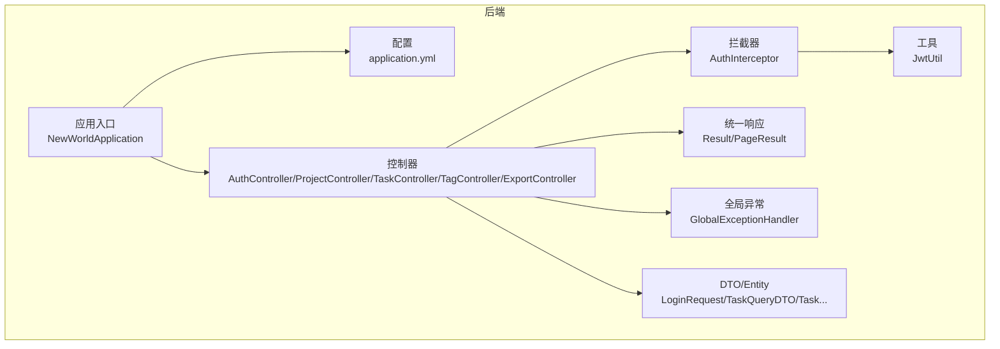
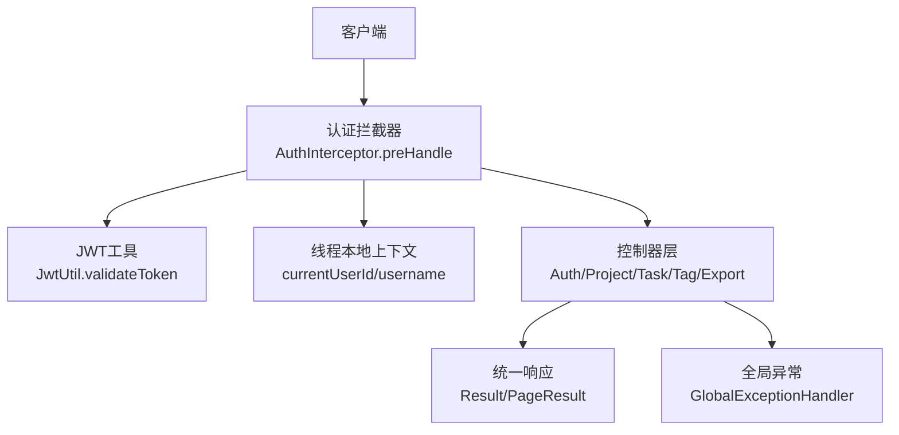
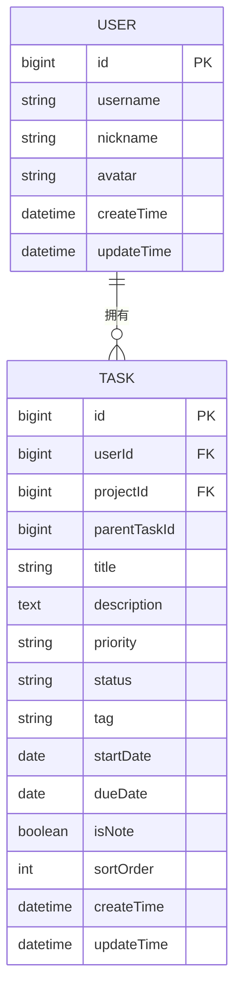
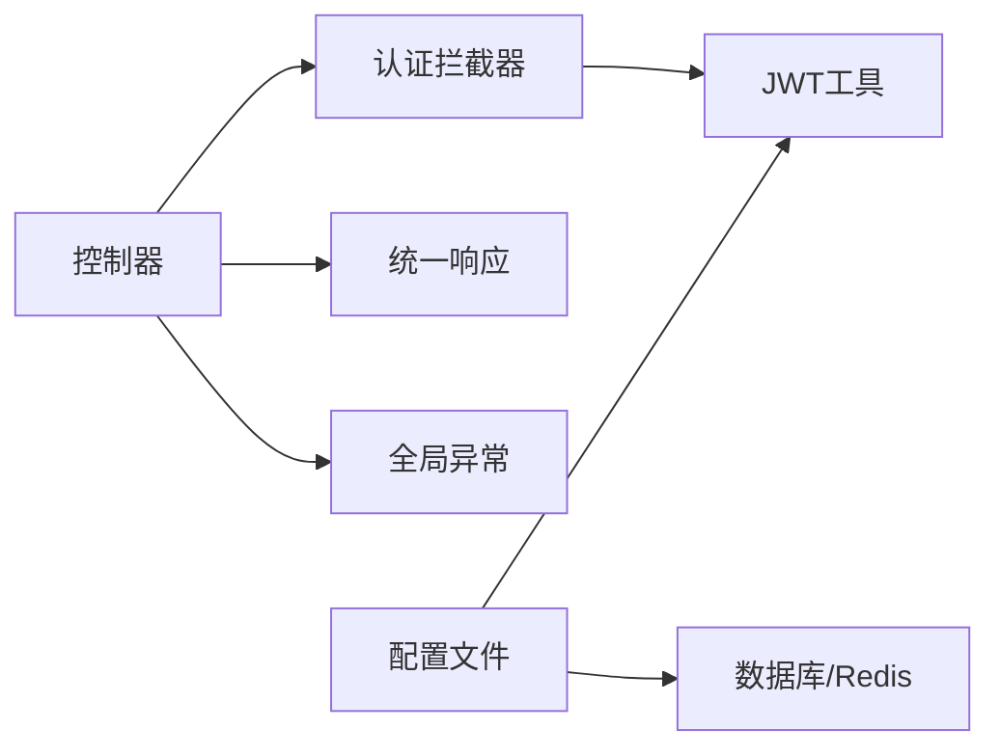
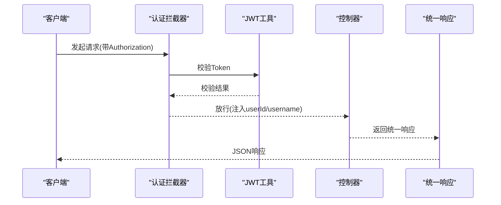
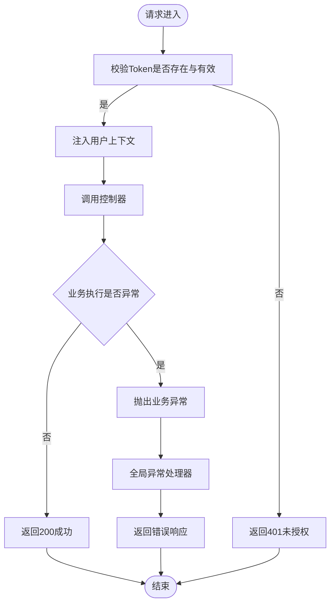

# API接口文档

<cite>
**本文引用的文件**
- [NewWorldApplication.java](file://backend/src/main/java/com/newworld/NewWorldApplication.java)
- [application.yml](file://backend/src/main/resources/application.yml)
- [JwtUtil.java](file://backend/src/main/java/com/newworld/common/JwtUtil.java)
- [Result.java](file://backend/src/main/java/com/newworld/common/Result.java)
- [PageResult.java](file://backend/src/main/java/com/newworld/common/PageResult.java)
- [GlobalExceptionHandler.java](file://backend/src/main/java/com/newworld/common/exception/GlobalExceptionHandler.java)
- [AuthInterceptor.java](file://backend/src/main/java/com/newworld/config/AuthInterceptor.java)
- [AuthController.java](file://backend/src/main/java/com/newworld/controller/AuthController.java)
- [ProjectController.java](file://backend/src/main/java/com/newworld/controller/ProjectController.java)
- [TaskController.java](file://backend/src/main/java/com/newworld/controller/TaskController.java)
- [TagController.java](file://backend/src/main/java/com/newworld/controller/TagController.java)
- [ExportController.java](file://backend/src/main/java/com/newworld/controller/ExportController.java)
- [LoginRequest.java](file://backend/src/main/java/com/newworld/dto/LoginRequest.java)
- [TaskQueryDTO.java](file://backend/src/main/java/com/newworld/dto/TaskQueryDTO.java)
- [TaskStatisticsVO.java](file://backend/src/main/java/com/newworld/dto/TaskStatisticsVO.java)
- [TreeVO.java](file://backend/src/main/java/com/newworld/dto/TreeVO.java)
- [User.java](file://backend/src/main/java/com/newworld/entity/User.java)
- [Task.java](file://backend/src/main/java/com/newworld/entity/Task.java)
- [Group.java](file://backend/src/main/java/com/newworld/entity/Group.java)
- [Project.java](file://backend/src/main/java/com/newworld/entity/Project.java)
- [Tag.java](file://backend/src/main/java/com/newworld/entity/Tag.java)
</cite>

## 目录
1. [简介](#简介)
2. [项目结构](#项目结构)
3. [核心组件](#核心组件)
4. [架构总览](#架构总览)
5. [详细组件分析](#详细组件分析)
6. [依赖分析](#依赖分析)
7. [性能考虑](#性能考虑)
8. [故障排查指南](#故障排查指南)
9. [结论](#结论)
10. [附录](#附录)

## 简介
本文件为“新世界”项目的完整API接口文档，覆盖认证、项目管理、任务管理、标签管理、数据导出等模块。文档包含各接口的HTTP方法、URL路径、请求参数、响应格式与状态码说明；详述JWT认证机制（获取、传递、验证）；提供统一响应体与错误处理规范；并给出版本控制策略与向后兼容性建议。

## 项目结构
后端采用Spring Boot工程，主要目录与职责如下：
- common：通用工具与统一响应封装
- config：拦截器、Web配置、MyBatis-Plus配置等
- controller：REST接口控制器
- dto：请求/响应传输对象
- entity：数据库实体
- mapper/service：数据访问与业务服务
- resources：配置文件与Mapper XML

**图表来源**
- [NewWorldApplication.java:1-13](file://backend/src/main/java/com/newworld/NewWorldApplication.java#L1-L13)
- [application.yml:1-75](file://backend/src/main/resources/application.yml#L1-L75)
- [AuthInterceptor.java:1-78](file://backend/src/main/java/com/newworld/config/AuthInterceptor.java#L1-L78)
- [JwtUtil.java:1-78](file://backend/src/main/java/com/newworld/common/JwtUtil.java#L1-L78)
- [Result.java:1-90](file://backend/src/main/java/com/newworld/common/Result.java#L1-L90)
- [PageResult.java:1-36](file://backend/src/main/java/com/newworld/common/PageResult.java#L1-L36)
- [GlobalExceptionHandler.java:1-35](file://backend/src/main/java/com/newworld/common/exception/GlobalExceptionHandler.java#L1-L35)
- [AuthController.java:1-55](file://backend/src/main/java/com/newworld/controller/AuthController.java#L1-L55)
- [ProjectController.java:1-51](file://backend/src/main/java/com/newworld/controller/ProjectController.java#L1-L51)
- [TaskController.java:1-112](file://backend/src/main/java/com/newworld/controller/TaskController.java#L1-L112)
- [TagController.java:1-43](file://backend/src/main/java/com/newworld/controller/TagController.java#L1-L43)
- [ExportController.java:1-47](file://backend/src/main/java/com/newworld/controller/ExportController.java#L1-L47)

**章节来源**
- [NewWorldApplication.java:1-13](file://backend/src/main/java/com/newworld/NewWorldApplication.java#L1-L13)
- [application.yml:1-75](file://backend/src/main/resources/application.yml#L1-L75)

## 核心组件
- 统一响应体：所有接口返回统一结构，包含状态码、消息与数据字段，便于前端一致化处理。
- 分页响应体：用于列表型接口的分页封装。
- 全局异常处理：集中捕获业务异常、参数异常与系统异常，返回标准化错误响应。
- JWT工具：负责Token生成、解析与校验，并支持密钥与过期时间配置。
- 认证拦截器：在请求进入控制器前校验Authorization头中的Token有效性，并将用户上下文注入线程本地变量。

**章节来源**
- [Result.java:1-90](file://backend/src/main/java/com/newworld/common/Result.java#L1-L90)
- [PageResult.java:1-36](file://backend/src/main/java/com/newworld/common/PageResult.java#L1-L36)
- [GlobalExceptionHandler.java:1-35](file://backend/src/main/java/com/newworld/common/exception/GlobalExceptionHandler.java#L1-L35)
- [JwtUtil.java:1-78](file://backend/src/main/java/com/newworld/common/JwtUtil.java#L1-L78)
- [AuthInterceptor.java:1-78](file://backend/src/main/java/com/newworld/config/AuthInterceptor.java#L1-L78)

## 架构总览
下图展示认证拦截器、JWT工具与控制器之间的交互关系，以及统一响应与异常处理的贯穿路径。

**图表来源**
- [AuthInterceptor.java:1-78](file://backend/src/main/java/com/newworld/config/AuthInterceptor.java#L1-L78)
- [JwtUtil.java:1-78](file://backend/src/main/java/com/newworld/common/JwtUtil.java#L1-L78)
- [Result.java:1-90](file://backend/src/main/java/com/newworld/common/Result.java#L1-L90)
- [PageResult.java:1-36](file://backend/src/main/java/com/newworld/common/PageResult.java#L1-L36)
- [GlobalExceptionHandler.java:1-35](file://backend/src/main/java/com/newworld/common/exception/GlobalExceptionHandler.java#L1-L35)
- [AuthController.java:1-55](file://backend/src/main/java/com/newworld/controller/AuthController.java#L1-L55)
- [ProjectController.java:1-51](file://backend/src/main/java/com/newworld/controller/ProjectController.java#L1-L51)
- [TaskController.java:1-112](file://backend/src/main/java/com/newworld/controller/TaskController.java#L1-L112)
- [TagController.java:1-43](file://backend/src/main/java/com/newworld/controller/TagController.java#L1-L43)
- [ExportController.java:1-47](file://backend/src/main/java/com/newworld/controller/ExportController.java#L1-L47)

## 详细组件分析

### 认证接口
- 接口目标：用户登录、注册、获取当前用户信息、退出登录
- 认证机制：使用JWT，请求需携带Authorization头，值形如Bearer xxx
- 统一响应：成功返回200及data；失败返回非200及错误信息

接口定义
- POST /api/auth/login
  - 请求体：LoginRequest（用户名、密码）
  - 成功响应：data.token（字符串）
  - 失败响应：错误码与错误信息
- POST /api/auth/register
  - 请求体：LoginRequest（用户名、密码）
  - 成功响应：空数据
- GET /api/auth/user-info
  - 成功响应：当前用户信息
- POST /api/auth/logout
  - 成功响应：空数据

请求示例
- 登录请求
  - 方法：POST
  - 路径：/api/auth/login
  - 头部：Content-Type: application/json
  - 示例体：{"username":"张三","password":"123456"}
- 获取用户信息
  - 方法：GET
  - 路径：/api/auth/user-info
  - 头部：Authorization: Bearer <token>

响应示例
- 成功
  - {"code":200,"msg":"操作成功","data":{...}}
- 失败
  - {"code":400,"msg":"用户名或密码错误","data":null}

状态码
- 200：操作成功
- 400：参数错误或业务异常
- 401：未登录或Token无效
- 500：系统异常

**章节来源**
- [AuthController.java:1-55](file://backend/src/main/java/com/newworld/controller/AuthController.java#L1-L55)
- [LoginRequest.java:1-37](file://backend/src/main/java/com/newworld/dto/LoginRequest.java#L1-L37)
- [AuthInterceptor.java:1-78](file://backend/src/main/java/com/newworld/config/AuthInterceptor.java#L1-L78)
- [JwtUtil.java:1-78](file://backend/src/main/java/com/newworld/common/JwtUtil.java#L1-L78)
- [Result.java:1-90](file://backend/src/main/java/com/newworld/common/Result.java#L1-L90)

### 项目管理接口
- 接口目标：按分组获取项目列表、新建、更新、删除项目
- 权限：需要登录态，userId来自Token解析

接口定义
- GET /api/projects
  - 查询参数：groupId（可选）
  - 成功响应：项目列表
- POST /api/projects
  - 请求体：Project（不含userId）
  - 成功响应：新建项目
- PUT /api/projects/{id}
  - 路径参数：id
  - 请求体：Project（含id）
  - 成功响应：更新后的项目
- DELETE /api/projects/{id}
  - 路径参数：id
  - 成功响应：空数据

请求示例
- 新建项目
  - 方法：POST
  - 路径：/api/projects
  - 头部：Authorization: Bearer <token>
  - 示例体：{"name":"新项目","description":"项目描述"}

响应示例
- 成功
  - {"code":200,"msg":"创建成功","data":{"id":1,"name":"新项目",...}}
- 失败
  - {"code":401,"msg":"未登录","data":null}

**章节来源**
- [ProjectController.java:1-51](file://backend/src/main/java/com/newworld/controller/ProjectController.java#L1-L51)
- [AuthInterceptor.java:1-78](file://backend/src/main/java/com/newworld/config/AuthInterceptor.java#L1-L78)
- [Result.java:1-90](file://backend/src/main/java/com/newworld/common/Result.java#L1-L90)

### 任务管理接口
- 接口目标：任务列表查询、详情、新建、更新、删除、状态变更、优先级设置、复制、归档、转笔记、生成分享链接、搜索、统计
- 权限：需要登录态

接口定义
- GET /api/tasks
  - 查询参数：TaskQueryDTO（由服务端定义）
  - 成功响应：任务列表
- GET /api/tasks/{id}
  - 路径参数：id
  - 成功响应：单个任务
- POST /api/tasks
  - 请求体：Task（不含userId）
  - 成功响应：新建任务
- PUT /api/tasks/{id}
  - 路径参数：id
  - 请求体：Task（含id）
  - 成功响应：更新后的任务
- DELETE /api/tasks/{id}
  - 路径参数：id
  - 成功响应：空数据
- PUT /api/tasks/{id}/status
  - 请求体：{"status":"TODO|IN_PROGRESS|DONE|ARCHIVED"}
  - 成功响应：更新后的任务
- PUT /api/tasks/{id}/priority
  - 请求体：{"priority":"RED|YELLOW|BLUE|FLAG|NONE"}
  - 成功响应：更新后的任务
- PUT /api/tasks/{id}/duplicate
  - 成功响应：复制后的任务
- PUT /api/tasks/{id}/archive
  - 成功响应：空数据
- PUT /api/tasks/{id}/convert-note
  - 成功响应：转换后的任务
- GET /api/tasks/{id}/share-link
  - 成功响应：{"link":"..."}
- GET /api/tasks/search
  - 查询参数：keyword
  - 成功响应：任务列表
- GET /api/tasks/statistics
  - 成功响应：TaskStatisticsVO

请求示例
- 更新任务状态
  - 方法：PUT
  - 路径：/api/tasks/1/status
  - 头部：Authorization: Bearer <token>
  - 示例体：{"status":"DONE"}

响应示例
- 成功
  - {"code":200,"msg":"操作成功","data":{"id":1,"status":"DONE",...}}
- 失败
  - {"code":400,"msg":"状态值不合法","data":null}

**章节来源**
- [TaskController.java:1-112](file://backend/src/main/java/com/newworld/controller/TaskController.java#L1-L112)
- [TaskQueryDTO.java](file://backend/src/main/java/com/newworld/dto/TaskQueryDTO.java)
- [TaskStatisticsVO.java](file://backend/src/main/java/com/newworld/dto/TaskStatisticsVO.java)
- [AuthInterceptor.java:1-78](file://backend/src/main/java/com/newworld/config/AuthInterceptor.java#L1-L78)
- [Result.java:1-90](file://backend/src/main/java/com/newworld/common/Result.java#L1-L90)

### 标签管理接口
- 接口目标：获取标签列表、新建标签、删除标签
- 权限：需要登录态

接口定义
- GET /api/tags
  - 成功响应：标签列表
- POST /api/tags
  - 请求体：Tag（不含userId）
  - 成功响应：新建标签
- DELETE /api/tags/{id}
  - 路径参数：id
  - 成功响应：空数据

请求示例
- 新建标签
  - 方法：POST
  - 路径：/api/tags
  - 头部：Authorization: Bearer <token>
  - 示例体：{"name":"工作","color":"#FF0000"}

响应示例
- 成功
  - {"code":200,"msg":"创建成功","data":{"id":1,"name":"工作",...}}

**章节来源**
- [TagController.java:1-43](file://backend/src/main/java/com/newworld/controller/TagController.java#L1-L43)
- [AuthInterceptor.java:1-78](file://backend/src/main/java/com/newworld/config/AuthInterceptor.java#L1-L78)
- [Result.java:1-90](file://backend/src/main/java/com/newworld/common/Result.java#L1-L90)

### 数据导出接口
- 接口目标：将任务数据导出为Excel文件
- 权限：需要登录态
- 输出：application/vnd.openxmlformats-officedocument.spreadsheetml.sheet

接口定义
- GET /api/export/tasks
  - 查询参数：TaskQueryDTO
  - 成功响应：二进制Excel文件流（浏览器下载）

请求示例
- 导出任务
  - 方法：GET
  - 路径：/api/export/tasks?status=TODO
  - 头部：Authorization: Bearer <token>

响应示例
- 成功：返回.xlsx文件（文件名为“任务导出.xlsx”）

**章节来源**
- [ExportController.java:1-47](file://backend/src/main/java/com/newworld/controller/ExportController.java#L1-L47)
- [TaskQueryDTO.java](file://backend/src/main/java/com/newworld/dto/TaskQueryDTO.java)
- [Task.java:1-184](file://backend/src/main/java/com/newworld/entity/Task.java#L1-L184)
- [Result.java:1-90](file://backend/src/main/java/com/newworld/common/Result.java#L1-L90)

### 实体模型与数据结构
- 用户（User）
  - 字段：id、username、nickname、avatar、createTime、updateTime
- 任务（Task）
  - 字段：id、userId、projectId、parentTaskId、title、description、priority、status、tag、startDate、dueDate、isNote、sortOrder、createTime、updateTime
- 项目（Project）、标签（Tag）、分组（Group）等实体同理，详见对应文件

**图表来源**
- [User.java:1-95](file://backend/src/main/java/com/newworld/entity/User.java#L1-L95)
- [Task.java:1-184](file://backend/src/main/java/com/newworld/entity/Task.java#L1-L184)

## 依赖分析
- 控制器依赖拦截器进行认证校验，依赖统一响应封装与异常处理
- 拦截器依赖JWT工具进行Token解析与校验
- DTO/VO用于接口参数与返回值的结构化
- 配置文件提供JWT密钥、过期时间、数据库连接、Redis连接、Knife4j文档路径等

**图表来源**
- [AuthController.java:1-55](file://backend/src/main/java/com/newworld/controller/AuthController.java#L1-L55)
- [AuthInterceptor.java:1-78](file://backend/src/main/java/com/newworld/config/AuthInterceptor.java#L1-L78)
- [JwtUtil.java:1-78](file://backend/src/main/java/com/newworld/common/JwtUtil.java#L1-L78)
- [Result.java:1-90](file://backend/src/main/java/com/newworld/common/Result.java#L1-L90)
- [GlobalExceptionHandler.java:1-35](file://backend/src/main/java/com/newworld/common/exception/GlobalExceptionHandler.java#L1-L35)
- [application.yml:1-75](file://backend/src/main/resources/application.yml#L1-L75)

**章节来源**
- [application.yml:1-75](file://backend/src/main/resources/application.yml#L1-L75)

## 性能考虑
- Token有效期：默认24小时，建议根据业务安全需求调整
- 分页查询：列表接口建议配合分页参数，避免一次性返回大量数据
- 缓存策略：可结合Redis对热点数据进行缓存（如用户信息、常用查询结果）
- 数据库连接池：合理配置最大连接数与超时时间，避免阻塞
- 导出接口：大体量数据导出建议异步处理并提供下载链接

## 故障排查指南
常见错误与处理
- 未登录/未携带Token
  - 现象：401 未登录，请先登录
  - 处理：确保请求头中包含Authorization: Bearer <token>
- Token无效或已过期
  - 现象：401 Token 已过期或无效，请重新登录
  - 处理：重新登录获取新Token
- 参数非法
  - 现象：400 参数异常
  - 处理：检查请求体字段与格式
- 业务异常
  - 现象：自定义业务错误码与消息
  - 处理：根据msg提示修正输入或联系管理员

日志与监控
- 后端日志级别：com.newworld: debug
- 建议接入统一日志收集与告警

**章节来源**
- [AuthInterceptor.java:1-78](file://backend/src/main/java/com/newworld/config/AuthInterceptor.java#L1-L78)
- [GlobalExceptionHandler.java:1-35](file://backend/src/main/java/com/newworld/common/exception/GlobalExceptionHandler.java#L1-L35)
- [application.yml:70-75](file://backend/src/main/resources/application.yml#L70-L75)

## 结论
本API文档覆盖了认证、项目、任务、标签与数据导出的核心接口，明确了请求/响应格式、认证流程与错误处理机制。通过统一响应体与拦截器体系，保障了接口的一致性与安全性。建议在生产环境中进一步完善鉴权粒度、导出异步化与缓存策略，并持续维护Swagger/OpenAPI文档以提升可维护性。

## 附录

### 认证流程时序图

**图表来源**
- [AuthInterceptor.java:1-78](file://backend/src/main/java/com/newworld/config/AuthInterceptor.java#L1-L78)
- [JwtUtil.java:1-78](file://backend/src/main/java/com/newworld/common/JwtUtil.java#L1-L78)
- [Result.java:1-90](file://backend/src/main/java/com/newworld/common/Result.java#L1-L90)

### 错误处理流程图

**图表来源**
- [AuthInterceptor.java:1-78](file://backend/src/main/java/com/newworld/config/AuthInterceptor.java#L1-L78)
- [GlobalExceptionHandler.java:1-35](file://backend/src/main/java/com/newworld/common/exception/GlobalExceptionHandler.java#L1-L35)
- [Result.java:1-90](file://backend/src/main/java/com/newworld/common/Result.java#L1-L90)

### 版本控制与兼容性
- 文档版本：V1.0
- API版本：当前接口未显式带/v1等前缀，建议后续引入语义化版本路径（如/api/v1/...），并在application.yml中统一前缀
- 兼容性策略：新增字段采用可选原则，变更字段保持向后兼容，重大变更通过新版本路径发布并标注废弃