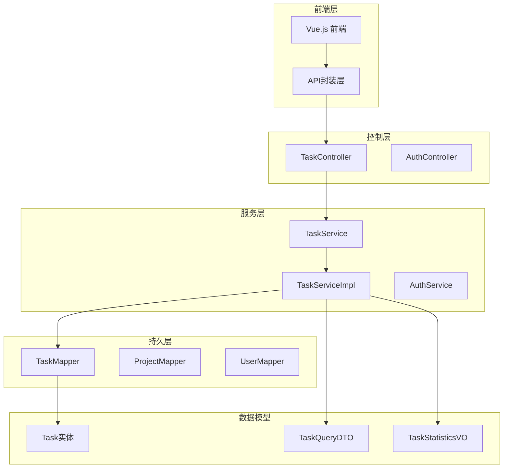
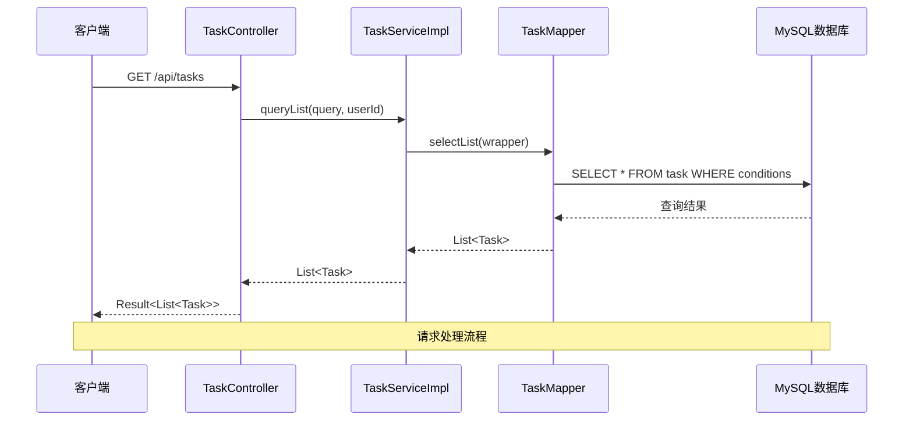
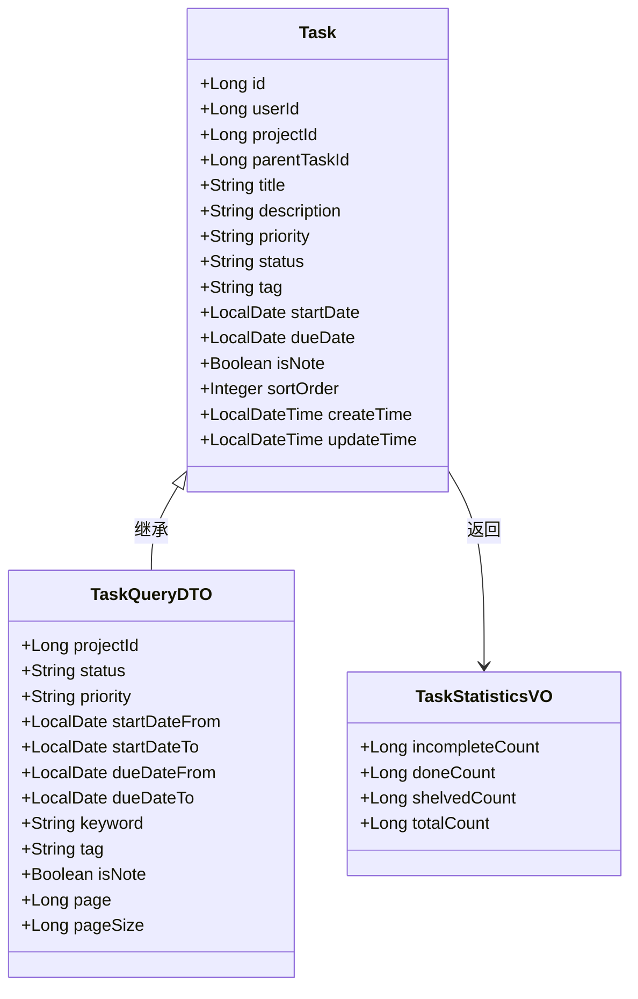
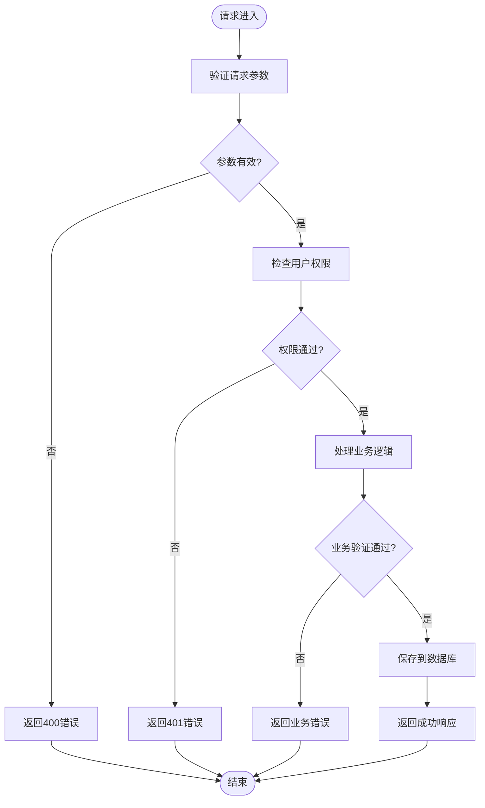
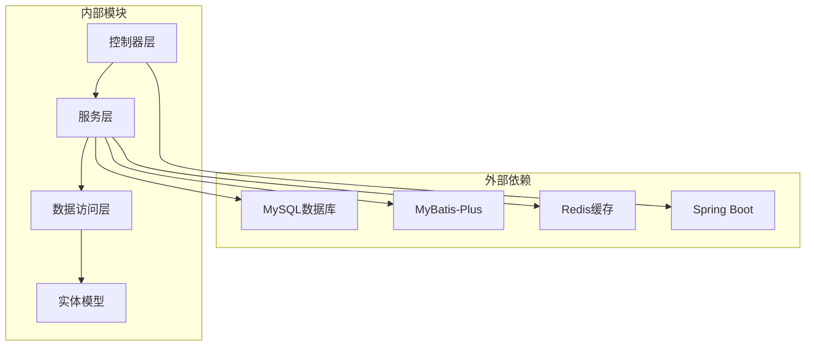
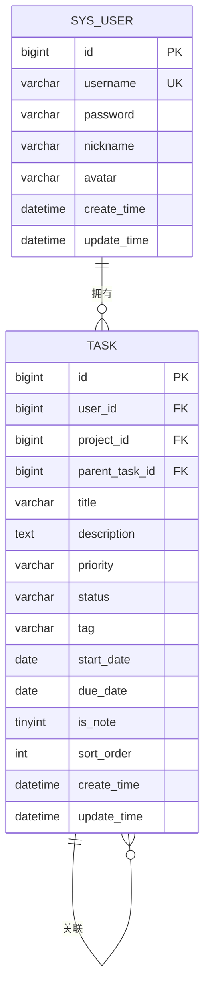

# 任务管理接口

<cite>
**本文引用的文件**
- [TaskController.java](file://backend/src/main/java/com/newworld/controller/TaskController.java)
- [TaskService.java](file://backend/src/main/java/com/newworld/service/TaskService.java)
- [TaskServiceImpl.java](file://backend/src/main/java/com/newworld/service/impl/TaskServiceImpl.java)
- [Task.java](file://backend/src/main/java/com/newworld/entity/Task.java)
- [TaskQueryDTO.java](file://backend/src/main/java/com/newworld/dto/TaskQueryDTO.java)
- [TaskStatisticsVO.java](file://backend/src/main/java/com/newworld/dto/TaskStatisticsVO.java)
- [TaskMapper.java](file://backend/src/main/java/com/newworld/mapper/TaskMapper.java)
- [Result.java](file://backend/src/main/java/com/newworld/common/Result.java)
- [BusinessException.java](file://backend/src/main/java/com/newworld/common/exception/BusinessException.java)
- [GlobalExceptionHandler.java](file://backend/src/main/java/com/newworld/common/exception/GlobalExceptionHandler.java)
- [application.yml](file://backend/src/main/resources/application.yml)
- [init.sql](file://backend/sql/init.sql)
- [task.js](file://frontend/src/api/task.js)
</cite>

## 更新摘要
**变更内容**
- 更新任务状态枚举：从TODO/IN_PROGRESS/DONE/ARCHIVED改为INCOMPLETE/DONE/SHELVED
- 更新任务统计逻辑：统计字段从todoCount/inProgressCount/doneCount/archivedCount改为incompleteCount/doneCount/shelvedCount
- 更新默认状态：创建任务时默认状态从TODO改为INCOMPLETE
- 更新归档操作：将任务状态改为SHELVED而非ARCHIVED
- 更新前端状态显示：INCOMPLETE/DONE/SHELVED对应中文"未完成/已完成/搁置"

## 目录
1. [简介](#简介)
2. [项目结构](#项目结构)
3. [核心组件](#核心组件)
4. [架构概览](#架构概览)
5. [详细组件分析](#详细组件分析)
6. [依赖分析](#依赖分析)
7. [性能考虑](#性能考虑)
8. [故障排除指南](#故障排除指南)
9. [结论](#结论)
10. [附录](#附录)

## 简介
NewWorld 是一个个人工作计划管理工具，提供完整任务管理功能。本文档详细说明任务管理接口的API规范，包括任务CRUD操作、状态流转、查询过滤、统计分析等功能。

## 项目结构
后端采用Spring Boot + MyBatis-Plus架构，遵循分层设计模式：



**图表来源**
- [TaskController.java:1-112](file://backend/src/main/java/com/newworld/controller/TaskController.java#L1-L112)
- [TaskServiceImpl.java:1-194](file://backend/src/main/java/com/newworld/service/impl/TaskServiceImpl.java#L1-L194)
- [TaskMapper.java:1-10](file://backend/src/main/java/com/newworld/mapper/TaskMapper.java#L1-L10)

**章节来源**
- [TaskController.java:1-112](file://backend/src/main/java/com/newworld/controller/TaskController.java#L1-L112)
- [application.yml:1-75](file://backend/src/main/resources/application.yml#L1-L75)

## 核心组件
任务管理系统的核心组件包括：

### 控制器层
- **TaskController**: 提供RESTful API接口
- **AuthController**: 认证相关接口

### 服务层
- **TaskService**: 任务业务逻辑接口
- **TaskServiceImpl**: 任务业务逻辑实现

### 数据访问层
- **TaskMapper**: MyBatis-Plus数据访问接口

### 数据模型
- **Task**: 任务实体类
- **TaskQueryDTO**: 任务查询参数
- **TaskStatisticsVO**: 任务统计结果

**章节来源**
- [TaskController.java:17-112](file://backend/src/main/java/com/newworld/controller/TaskController.java#L17-L112)
- [TaskService.java:9-76](file://backend/src/main/java/com/newworld/service/TaskService.java#L9-L76)
- [TaskServiceImpl.java:17-194](file://backend/src/main/java/com/newworld/service/impl/TaskServiceImpl.java#L17-L194)

## 架构概览



**图表来源**
- [TaskController.java:25-31](file://backend/src/main/java/com/newworld/controller/TaskController.java#L25-L31)
- [TaskServiceImpl.java:23-44](file://backend/src/main/java/com/newworld/service/impl/TaskServiceImpl.java#L23-L44)
- [TaskMapper.java:1-10](file://backend/src/main/java/com/newworld/mapper/TaskMapper.java#L1-L10)

## 详细组件分析

### 任务实体模型



**图表来源**
- [Task.java:14-184](file://backend/src/main/java/com/newworld/entity/Task.java#L14-L184)
- [TaskQueryDTO.java:11-145](file://backend/src/main/java/com/newworld/dto/TaskQueryDTO.java#L11-L145)
- [TaskStatisticsVO.java:9-66](file://backend/src/main/java/com/newworld/dto/TaskStatisticsVO.java#L9-L66)

#### 任务实体字段说明

| 字段名 | 类型 | 必填 | 默认值 | 说明 |
|--------|------|------|--------|------|
| id | Long | 否 | 自增 | 任务ID |
| userId | Long | 是 | - | 用户ID |
| projectId | Long | 否 | null | 项目ID |
| parentTaskId | Long | 否 | null | 关联主任务ID |
| title | String | 是 | - | 任务标题 |
| description | String | 否 | null | 任务描述 |
| priority | String | 否 | NONE | 优先级: RED/YELLOW/BLUE/FLAG/NONE |
| status | String | 否 | INCOMPLETE | 状态: INCOMPLETE/DONE/SHELVED |
| tag | String | 否 | null | 标签 |
| startDate | LocalDate | 否 | null | 开始日期 |
| dueDate | LocalDate | 否 | null | 截止日期 |
| isNote | Boolean | 否 | false | 是否为笔记 |
| sortOrder | Integer | 否 | 0 | 排序号 |
| createTime | LocalDateTime | 否 | 当前时间 | 创建时间 |
| updateTime | LocalDateTime | 否 | 当前时间 | 更新时间 |

**章节来源**
- [Task.java:29-48](file://backend/src/main/java/com/newworld/entity/Task.java#L29-L48)
- [Task.java:56-62](file://backend/src/main/java/com/newworld/entity/Task.java#L56-L62)

### 查询参数模型

| 参数名 | 类型 | 必填 | 默认值 | 说明 |
|--------|------|------|--------|------|
| projectId | Long | 否 | null | 项目ID |
| status | String | 否 | null | 状态过滤: INCOMPLETE/DONE/SHELVED |
| priority | String | 否 | null | 优先级过滤 |
| startDateFrom | LocalDate | 否 | null | 开始日期起始范围 |
| startDateTo | LocalDate | 否 | null | 开始日期结束范围 |
| dueDateFrom | LocalDate | 否 | null | 截止日期起始范围 |
| dueDateTo | LocalDate | 否 | null | 截止日期结束范围 |
| keyword | String | 否 | null | 搜索关键字 |
| tag | String | 否 | null | 标签过滤 |
| isNote | Boolean | 否 | null | 是否笔记过滤 |
| page | Long | 否 | 1 | 页码 |
| pageSize | Long | 否 | 100 | 每页大小 |

**章节来源**
- [TaskQueryDTO.java:13-47](file://backend/src/main/java/com/newworld/dto/TaskQueryDTO.java#L13-L47)

### API接口定义

#### 1. 获取任务列表
**请求URL**: `GET /api/tasks`
**请求参数**: 查询参数DTO
**响应数据**: `Result<List<Task>>`

**查询条件过滤规则**:
- 使用MyBatis-Plus条件构造器动态构建查询
- 支持多条件组合查询
- 自动添加用户权限过滤

**章节来源**
- [TaskController.java:25-31](file://backend/src/main/java/com/newworld/controller/TaskController.java#L25-L31)
- [TaskServiceImpl.java:23-44](file://backend/src/main/java/com/newworld/service/impl/TaskServiceImpl.java#L23-L44)

#### 2. 获取单个任务
**请求URL**: `GET /api/tasks/{id}`
**路径参数**: `id` (Long)
**响应数据**: `Result<Task>`

**章节来源**
- [TaskController.java:33-37](file://backend/src/main/java/com/newworld/controller/TaskController.java#L33-L37)

#### 3. 创建任务
**请求URL**: `POST /api/tasks`
**请求体**: Task实体
**响应数据**: `Result<Task>`

**默认值处理**:
- 优先级默认值: NONE
- 状态默认值: INCOMPLETE  
- 是否笔记默认值: false

**章节来源**
- [TaskController.java:39-45](file://backend/src/main/java/com/newworld/controller/TaskController.java#L39-L45)
- [TaskServiceImpl.java:55-68](file://backend/src/main/java/com/newworld/service/impl/TaskServiceImpl.java#L55-L68)

#### 4. 更新任务
**请求URL**: `PUT /api/tasks/{id}`
**路径参数**: `id` (Long)
**请求体**: Task实体
**响应数据**: `Result<Task>`

**章节来源**
- [TaskController.java:47-52](file://backend/src/main/java/com/newworld/controller/TaskController.java#L47-L52)
- [TaskServiceImpl.java:70-78](file://backend/src/main/java/com/newworld/service/impl/TaskServiceImpl.java#L70-L78)

#### 5. 删除任务
**请求URL**: `DELETE /api/tasks/{id}`
**路径参数**: `id` (Long)
**响应数据**: `Result<Void>`

**章节来源**
- [TaskController.java:54-59](file://backend/src/main/java/com/newworld/controller/TaskController.java#L54-L59)
- [TaskServiceImpl.java:80-87](file://backend/src/main/java/com/newworld/service/impl/TaskServiceImpl.java#L80-L87)

#### 6. 更新任务状态
**请求URL**: `PUT /api/tasks/{id}/status`
**路径参数**: `id` (Long)
**请求体**: `{ "status": "字符串" }`
**响应数据**: `Result<Task>`

**支持的状态值**: INCOMPLETE, DONE, SHELVED

**章节来源**
- [TaskController.java:61-65](file://backend/src/main/java/com/newworld/controller/TaskController.java#L61-L65)
- [TaskServiceImpl.java:89-98](file://backend/src/main/java/com/newworld/service/impl/TaskServiceImpl.java#L89-L98)

#### 7. 设置任务优先级
**请求URL**: `PUT /api/tasks/{id}/priority`
**路径参数**: `id` (Long)
**请求体**: `{ "priority": "字符串" }`
**响应数据**: `Result<Task>`

**支持的优先级值**: RED, YELLOW, BLUE, FLAG, NONE

**章节来源**
- [TaskController.java:67-71](file://backend/src/main/java/com/newworld/controller/TaskController.java#L67-L71)
- [TaskServiceImpl.java:100-109](file://backend/src/main/java/com/newworld/service/impl/TaskServiceImpl.java#L100-L109)

#### 8. 创建任务副本
**请求URL**: `PUT /api/tasks/{id}/duplicate`
**路径参数**: `id` (Long)
**响应数据**: `Result<Task>`

**复制规则**:
- 复制所有属性
- 标题自动添加"(副本)"后缀
- 状态重置为INCOMPLETE

**章节来源**
- [TaskController.java:73-77](file://backend/src/main/java/com/newworld/controller/TaskController.java#L73-L77)
- [TaskServiceImpl.java:111-130](file://backend/src/main/java/com/newworld/service/impl/TaskServiceImpl.java#L111-L130)

#### 9. 归档任务
**请求URL**: `PUT /api/tasks/{id}/archive`
**路径参数**: `id` (Long)
**响应数据**: `Result<Task>`

**状态变更**: 将任务状态改为SHELVED

**章节来源**
- [TaskController.java:79-83](file://backend/src/main/java/com/newworld/controller/TaskController.java#L79-L83)
- [TaskServiceImpl.java:132-141](file://backend/src/main/java/com/newworld/service/impl/TaskServiceImpl.java#L132-L141)

#### 10. 转换为笔记
**请求URL**: `PUT /api/tasks/{id}/convert-note`
**路径参数**: `id` (Long)
**响应数据**: `Result<Task>`

**章节来源**
- [TaskController.java:85-89](file://backend/src/main/java/com/newworld/controller/TaskController.java#L85-L89)
- [TaskServiceImpl.java:143-152](file://backend/src/main/java/com/newworld/service/impl/TaskServiceImpl.java#L143-L152)

#### 11. 生成分享链接
**请求URL**: `GET /api/tasks/{id}/share-link`
**路径参数**: `id` (Long)
**响应数据**: `Result<Map<String,String>>`

**返回格式**: `{ "link": "/share/task/{随机标识}" }`

**章节来源**
- [TaskController.java:91-96](file://backend/src/main/java/com/newworld/controller/TaskController.java#L91-L96)
- [TaskServiceImpl.java:154-164](file://backend/src/main/java/com/newworld/service/impl/TaskServiceImpl.java#L154-L164)

#### 12. 搜索任务
**请求URL**: `GET /api/tasks/search`
**查询参数**: `keyword` (String)
**响应数据**: `Result<List<Task>>`

**搜索范围**: 标题和描述字段

**章节来源**
- [TaskController.java:98-103](file://backend/src/main/java/com/newworld/controller/TaskController.java#L98-L103)
- [TaskServiceImpl.java:166-173](file://backend/src/main/java/com/newworld/service/impl/TaskServiceImpl.java#L166-L173)

#### 13. 任务统计
**请求URL**: `GET /api/tasks/statistics`
**响应数据**: `Result<TaskStatisticsVO>`

**统计维度**:
- 未完成数量 (INCOMPLETE)
- 已完成数量 (DONE)  
- 搁置数量 (SHELVED)
- 总数量

**章节来源**
- [TaskController.java:105-110](file://backend/src/main/java/com/newworld/controller/TaskController.java#L105-L110)
- [TaskServiceImpl.java:175-192](file://backend/src/main/java/com/newworld/service/impl/TaskServiceImpl.java#L175-L192)

### 数据验证规则



**图表来源**
- [TaskServiceImpl.java:47-53](file://backend/src/main/java/com/newworld/service/impl/TaskServiceImpl.java#L47-L53)
- [GlobalExceptionHandler.java:17-33](file://backend/src/main/java/com/newworld/common/exception/GlobalExceptionHandler.java#L17-L33)

**验证规则**:
1. **参数验证**: 所有必填字段必须存在
2. **枚举验证**: 状态和优先级必须在允许范围内
3. **权限验证**: 自动绑定当前登录用户的ID
4. **业务验证**: 任务存在性检查

**章节来源**
- [TaskServiceImpl.java:55-68](file://backend/src/main/java/com/newworld/service/impl/TaskServiceImpl.java#L55-L68)
- [TaskServiceImpl.java:89-98](file://backend/src/main/java/com/newworld/service/impl/TaskServiceImpl.java#L89-L98)

### 错误处理机制

系统采用统一异常处理机制：

| 异常类型 | HTTP状态码 | 错误码 | 说明 |
|----------|------------|--------|------|
| BusinessException | 500 | 500 | 业务异常 |
| IllegalArgumentException | 400 | 400 | 参数验证失败 |
| 其他Exception | 500 | 500 | 系统内部错误 |

**章节来源**
- [GlobalExceptionHandler.java:17-33](file://backend/src/main/java/com/newworld/common/exception/GlobalExceptionHandler.java#L17-L33)
- [BusinessException.java:6-24](file://backend/src/main/java/com/newworld/common/exception/BusinessException.java#L6-L24)

## 依赖分析



**图表来源**
- [application.yml:10-30](file://backend/src/main/resources/application.yml#L10-L30)
- [TaskServiceImpl.java:20-21](file://backend/src/main/java/com/newworld/service/impl/TaskServiceImpl.java#L20-L21)

**依赖关系**:
- **Spring Boot**: 提供Web框架和依赖注入
- **MyBatis-Plus**: 提供ORM映射和数据访问
- **MySQL**: 主数据存储
- **Redis**: 缓存和会话管理

**章节来源**
- [application.yml:10-50](file://backend/src/main/resources/application.yml#L10-L50)

## 性能考虑

### 数据库索引优化
- `idx_task_user_date`: 用户+开始日期+截止日期复合索引
- `idx_task_project`: 项目ID索引
- `idx_task_status`: 状态索引
- `idx_task_priority`: 优先级索引

### 查询优化策略
1. **条件过滤**: 使用动态条件构造器避免无效查询
2. **分页查询**: 默认每页100条记录
3. **排序优化**: 按排序号和创建时间排序
4. **索引利用**: 查询条件充分利用现有索引

### 缓存策略
- Redis用于会话管理和热点数据缓存
- 任务统计信息可考虑缓存策略

**章节来源**
- [init.sql:86-91](file://backend/sql/init.sql#L86-L91)
- [TaskServiceImpl.java:23-44](file://backend/src/main/java/com/newworld/service/impl/TaskServiceImpl.java#L23-L44)

## 故障排除指南

### 常见问题及解决方案

#### 1. 任务不存在错误
**现象**: 更新或删除任务时报错
**原因**: 任务ID不存在或已被删除
**解决**: 确认任务ID正确性和任务状态

#### 2. 权限访问错误
**现象**: 无法访问其他用户的任务
**原因**: 系统自动添加用户权限过滤
**解决**: 确保使用正确的用户上下文

#### 3. 参数验证错误
**现象**: 400错误响应
**原因**: 必填字段缺失或枚举值不正确
**解决**: 检查请求参数格式和取值范围

#### 4. 数据库连接错误
**现象**: 500错误响应
**原因**: 数据库连接配置问题
**解决**: 检查数据库连接参数和网络连通性

**章节来源**
- [TaskServiceImpl.java:47-53](file://backend/src/main/java/com/newworld/service/impl/TaskServiceImpl.java#L47-L53)
- [GlobalExceptionHandler.java:17-33](file://backend/src/main/java/com/newworld/common/exception/GlobalExceptionHandler.java#L17-L33)

## 结论
NewWorld任务管理系统提供了完整的任务生命周期管理功能，包括基础CRUD操作、状态流转、查询过滤、统计分析等特性。系统采用分层架构设计，具有良好的扩展性和维护性。通过合理的数据验证和异常处理机制，确保了系统的稳定性和可靠性。

## 附录

### 前端API调用示例

```javascript
// 获取任务列表
getTaskList({ status: 'INCOMPLETE', page: 1, pageSize: 50 })

// 创建任务
createTask({
  title: '新任务',
  description: '任务描述',
  priority: 'RED',
  startDate: '2024-01-01',
  dueDate: '2024-01-31'
})

// 更新任务状态
updateTaskStatus(123, 'DONE')

// 获取任务统计
getTaskStatistics()
```

**章节来源**
- [task.js:3-54](file://frontend/src/api/task.js#L3-L54)

### 数据库表结构



**图表来源**
- [init.sql:45-65](file://backend/sql/init.sql#L45-L65)

### 状态变更对照表

| 旧状态值 | 新状态值 | 中文含义 | 用途说明 |
|----------|----------|----------|----------|
| TODO | INCOMPLETE | 未完成 | 初始创建的任务状态 |
| IN_PROGRESS | DONE | 已完成 | 任务完成状态 |
| DONE | SHELVED | 搁置 | 任务归档状态 |
| ARCHIVED | 无对应值 | 已归档 | 已移除该状态 |

**章节来源**
- [Task.java:37-39](file://backend/src/main/java/com/newworld/entity/Task.java#L37-L39)
- [TaskQueryDTO.java:16](file://backend/src/main/java/com/newworld/dto/TaskQueryDTO.java#L16)
- [TaskServiceImpl.java:60](file://backend/src/main/java/com/newworld/service/impl/TaskServiceImpl.java#L60)
- [TaskServiceImpl.java:138](file://backend/src/main/java/com/newworld/service/impl/TaskServiceImpl.java#L138)
- [TaskServiceImpl.java:183](file://backend/src/main/java/com/newworld/service/impl/TaskServiceImpl.java#L183)
- [TaskServiceImpl.java:189](file://backend/src/main/java/com/newworld/service/impl/TaskServiceImpl.java#L189)
- [TaskServiceImpl.java:195](file://backend/src/main/java/com/newworld/service/impl/TaskServiceImpl.java#L195)