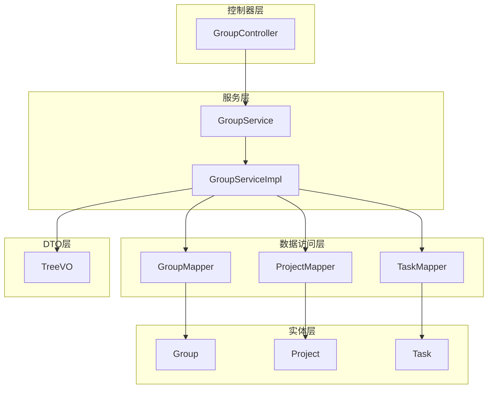
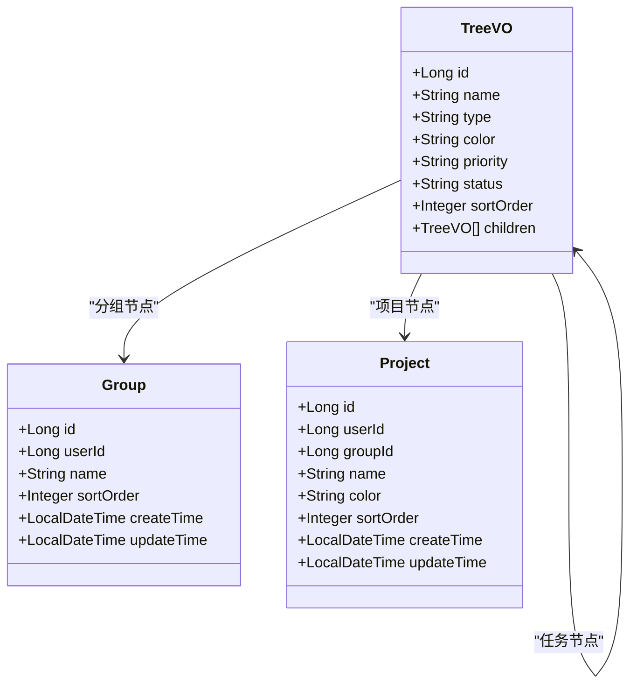
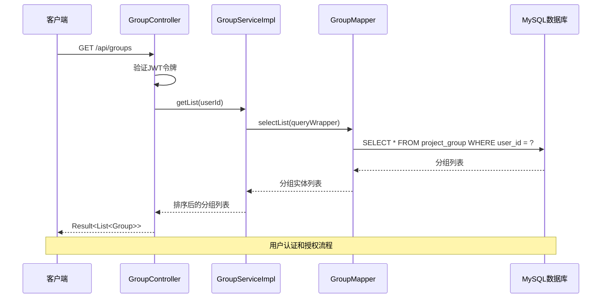
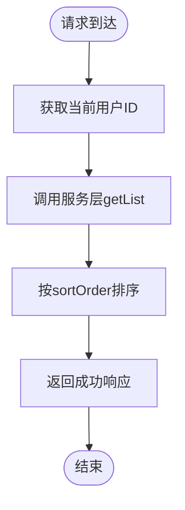
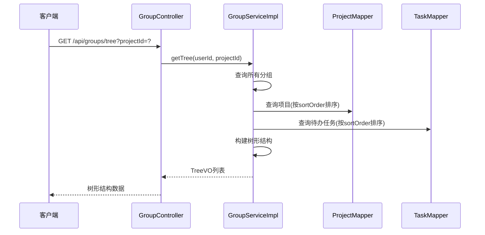
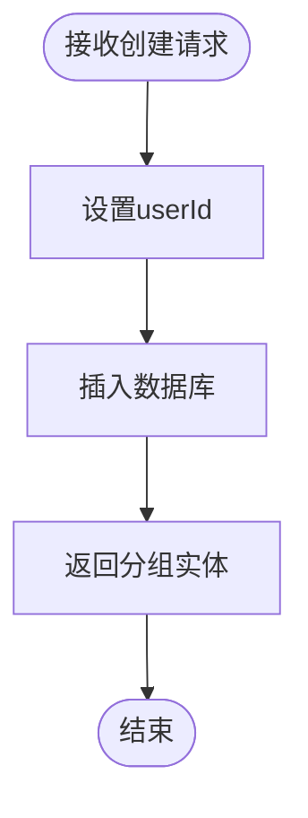
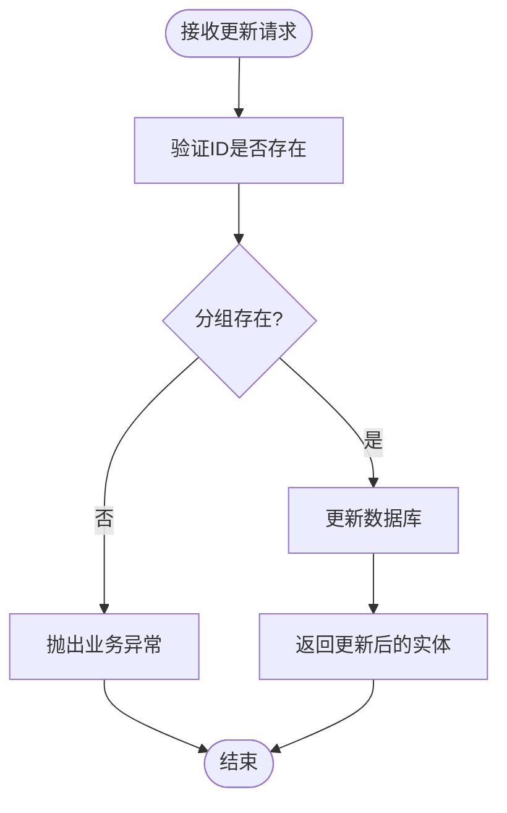
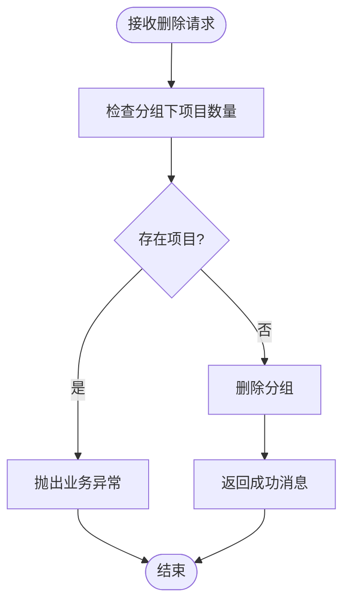
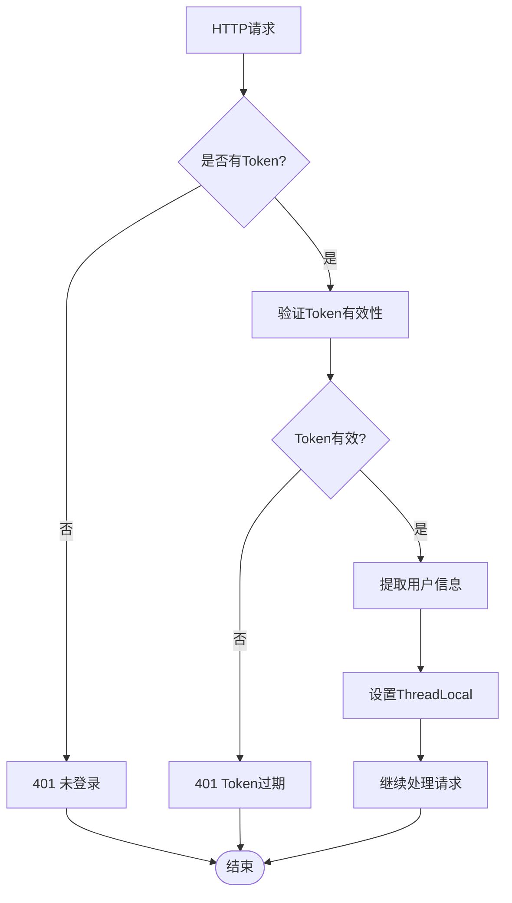
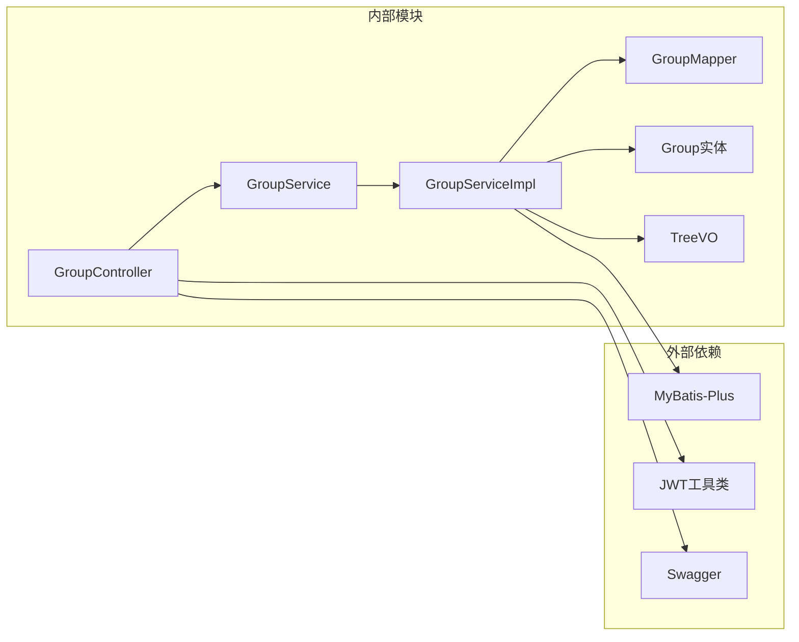

# 分组管理接口

<cite>
**本文档引用的文件**
- [GroupController.java](file://backend/src/main/java/com/newworld/controller/GroupController.java)
- [GroupService.java](file://backend/src/main/java/com/newworld/service/GroupService.java)
- [GroupServiceImpl.java](file://backend/src/main/java/com/newworld/service/impl/GroupServiceImpl.java)
- [Group.java](file://backend/src/main/java/com/newworld/entity/Group.java)
- [GroupMapper.java](file://backend/src/main/java/com/newworld/mapper/GroupMapper.java)
- [TreeVO.java](file://backend/src/main/java/com/newworld/dto/TreeVO.java)
- [Project.java](file://backend/src/main/java/com/newworld/entity/Project.java)
- [AuthInterceptor.java](file://backend/src/main/java/com/newworld/config/AuthInterceptor.java)
- [BusinessException.java](file://backend/src/main/java/com/newworld/common/exception/BusinessException.java)
- [Result.java](file://backend/src/main/java/com/newworld/common/Result.java)
- [application.yml](file://backend/src/main/resources/application.yml)
- [init.sql](file://backend/sql/init.sql)
- [group.js](file://frontend/src/api/group.js)
</cite>

## 目录
1. [简介](#简介)
2. [项目结构](#项目结构)
3. [核心组件](#核心组件)
4. [架构概览](#架构概览)
5. [详细组件分析](#详细组件分析)
6. [依赖分析](#依赖分析)
7. [性能考虑](#性能考虑)
8. [故障排除指南](#故障排除指南)
9. [结论](#结论)

## 简介

NewWorld 是一个个人工作计划管理工具，分组管理模块提供了完整的项目分组 CRUD 操作功能。该模块支持分组的层级结构管理、树形关系展示、项目关联以及权限控制。系统采用 Spring Boot + MyBatis-Plus 技术栈构建，提供 RESTful API 接口供前端调用。

## 项目结构

分组管理模块位于后端 Java 项目中，采用标准的分层架构设计：

**图表来源**
- [GroupController.java:1-59](file://backend/src/main/java/com/newworld/controller/GroupController.java#L1-L59)
- [GroupServiceImpl.java:1-140](file://backend/src/main/java/com/newworld/service/impl/GroupServiceImpl.java#L1-L140)
- [GroupMapper.java:1-10](file://backend/src/main/java/com/newworld/mapper/GroupMapper.java#L1-L10)

**章节来源**
- [GroupController.java:1-59](file://backend/src/main/java/com/newworld/controller/GroupController.java#L1-L59)
- [GroupService.java:1-35](file://backend/src/main/java/com/newworld/service/GroupService.java#L1-L35)

## 核心组件

### 分组实体模型

分组实体是整个分组管理的核心数据结构，包含以下关键字段：

| 字段名 | 类型 | 描述 | 约束条件 |
|--------|------|------|----------|
| id | Long | 分组ID | 主键，自增 |
| userId | Long | 用户ID | 外键关联用户表 |
| name | String | 分组名称 | 非空，最大100字符 |
| sortOrder | Integer | 排序号 | 默认0 |
| createTime | LocalDateTime | 创建时间 | 自动填充 |
| updateTime | LocalDateTime | 更新时间 | 自动填充 |

### 树形结构数据传输对象

TreeVO 用于前端导航树的数据传输，支持三层嵌套结构：

**图表来源**
- [TreeVO.java:1-101](file://backend/src/main/java/com/newworld/dto/TreeVO.java#L1-L101)
- [Group.java:1-84](file://backend/src/main/java/com/newworld/entity/Group.java#L1-L84)
- [Project.java:1-117](file://backend/src/main/java/com/newworld/entity/Project.java#L1-L117)

**章节来源**
- [Group.java:1-84](file://backend/src/main/java/com/newworld/entity/Group.java#L1-L84)
- [TreeVO.java:1-101](file://backend/src/main/java/com/newworld/dto/TreeVO.java#L1-L101)

## 架构概览

分组管理采用经典的 MVC 架构模式，通过控制器-服务-数据访问层的清晰分离实现功能：

**图表来源**
- [GroupController.java:23-28](file://backend/src/main/java/com/newworld/controller/GroupController.java#L23-L28)
- [GroupServiceImpl.java:33-39](file://backend/src/main/java/com/newworld/service/impl/GroupServiceImpl.java#L33-L39)
- [AuthInterceptor.java:30-58](file://backend/src/main/java/com/newworld/config/AuthInterceptor.java#L30-L58)

## 详细组件分析

### 控制器层 - GroupController

GroupController 提供了完整的分组管理 API 接口，所有接口都经过 JWT 认证拦截器验证。

#### GET /api/groups - 获取分组列表

**功能描述**: 返回当前用户的所有分组，按排序号升序排列。

**请求参数**: 无

**响应数据**: 
- 状态码: 200
- 数据: 分组实体数组

**实现逻辑**:

**图表来源**
- [GroupController.java:23-28](file://backend/src/main/java/com/newworld/controller/GroupController.java#L23-L28)
- [GroupServiceImpl.java:33-39](file://backend/src/main/java/com/newworld/service/impl/GroupServiceImpl.java#L33-L39)

#### GET /api/groups/tree - 获取树形结构

**功能描述**: 获取完整的树形结构（分组→项目→任务），支持按项目过滤。

**请求参数**:
- projectId: Long (可选) - 指定项目ID时只返回该项目的树形结构

**响应数据**: 
- 状态码: 200
- 数据: TreeVO 对象数组

**实现逻辑**:

**图表来源**
- [GroupController.java:30-35](file://backend/src/main/java/com/newworld/controller/GroupController.java#L30-L35)
- [GroupServiceImpl.java:41-111](file://backend/src/main/java/com/newworld/service/impl/GroupServiceImpl.java#L41-L111)

#### POST /api/groups - 创建分组

**功能描述**: 创建新的分组，自动设置用户ID和排序号。

**请求参数**:
- 请求体: Group 实体（不包含ID）

**响应数据**: 
- 状态码: 200
- 数据: 创建成功的分组实体

**实现逻辑**:

**图表来源**
- [GroupController.java:37-43](file://backend/src/main/java/com/newworld/controller/GroupController.java#L37-L43)
- [GroupServiceImpl.java:113-117](file://backend/src/main/java/com/newworld/service/impl/GroupServiceImpl.java#L113-L117)

#### PUT /api/groups/{id} - 更新分组

**功能描述**: 更新指定ID的分组信息。

**请求参数**:
- 路径参数: id - 分组ID
- 请求体: Group 实体（包含ID）

**响应数据**: 
- 状态码: 200
- 数据: 更新后的分组实体

**实现逻辑**:

**图表来源**
- [GroupController.java:45-50](file://backend/src/main/java/com/newworld/controller/GroupController.java#L45-L50)
- [GroupServiceImpl.java:119-127](file://backend/src/main/java/com/newworld/service/impl/GroupServiceImpl.java#L119-L127)

#### DELETE /api/groups/{id} - 删除分组

**功能描述**: 删除指定ID的分组，如果分组下存在项目则拒绝删除。

**请求参数**:
- 路径参数: id - 分组ID

**响应数据**: 
- 状态码: 200
- 数据: 成功消息

**实现逻辑**:

**图表来源**
- [GroupController.java:52-57](file://backend/src/main/java/com/newworld/controller/GroupController.java#L52-L57)
- [GroupServiceImpl.java:129-138](file://backend/src/main/java/com/newworld/service/impl/GroupServiceImpl.java#L129-L138)

**章节来源**
- [GroupController.java:1-59](file://backend/src/main/java/com/newworld/controller/GroupController.java#L1-L59)
- [GroupService.java:1-35](file://backend/src/main/java/com/newworld/service/GroupService.java#L1-L35)

### 服务层 - GroupServiceImpl

GroupServiceImpl 实现了分组管理的核心业务逻辑，包括数据查询、树形结构构建和业务规则验证。

#### 核心方法分析

**getList 方法**:
- 功能: 获取指定用户的分组列表
- 特点: 自动按排序号升序排列
- 权限: 严格基于 userId 进行数据隔离

**getTree 方法**:
- 功能: 构建完整的树形结构
- 数据来源: 分组、项目、任务三张表
- 过滤条件: 仅显示待办和进行中的任务
- 性能优化: 使用 Stream API 进行内存分组

**create 方法**:
- 功能: 创建新分组
- 特点: 直接插入数据库，无需复杂验证

**update 方法**:
- 功能: 更新分组信息
- 验证: 检查分组是否存在

**delete 方法**:
- 功能: 删除分组
- 保护: 防止删除仍有项目的分组

**章节来源**
- [GroupServiceImpl.java:1-140](file://backend/src/main/java/com/newworld/service/impl/GroupServiceImpl.java#L1-L140)

### 数据访问层 - GroupMapper

GroupMapper 继承 MyBatis-Plus 的 BaseMapper，提供标准的 CRUD 操作能力。通过注解配置，实现了与数据库表的映射关系。

**数据库表结构**:
- 表名: project_group
- 主键: id (BIGINT, AUTO_INCREMENT)
- 外键: user_id (FOREIGN KEY REFERENCES sys_user(id))

**章节来源**
- [GroupMapper.java:1-10](file://backend/src/main/java/com/newworld/mapper/GroupMapper.java#L1-L10)
- [init.sql:19-28](file://backend/sql/init.sql#L19-L28)

### 权限控制机制

系统采用 JWT Token 进行身份认证和权限控制：

**图表来源**
- [AuthInterceptor.java:30-72](file://backend/src/main/java/com/newworld/config/AuthInterceptor.java#L30-L72)

**章节来源**
- [AuthInterceptor.java:1-78](file://backend/src/main/java/com/newworld/config/AuthInterceptor.java#L1-L78)

## 依赖分析

分组管理模块的依赖关系清晰，遵循单一职责原则：

**图表来源**
- [GroupController.java:1-13](file://backend/src/main/java/com/newworld/controller/GroupController.java#L1-L13)
- [GroupServiceImpl.java:1-32](file://backend/src/main/java/com/newworld/service/impl/GroupServiceImpl.java#L1-L32)

### 错误处理机制

系统采用统一的异常处理策略：

**业务异常 BusinessException**:
- 用途: 处理业务逻辑错误
- 特点: 支持自定义状态码和消息
- 典型场景: 分组不存在、分组下有项目等

**全局异常处理器**:
- 位置: GlobalExceptionHandler.java
- 功能: 捕获并处理各种异常
- 输出: 统一的 JSON 响应格式

**章节来源**
- [BusinessException.java:1-24](file://backend/src/main/java/com/newworld/common/exception/BusinessException.java#L1-L24)

## 性能考虑

### 数据库索引优化

根据初始化脚本，系统在关键字段上建立了适当的索引：
- `idx_task_user_date`: (user_id, start_date, due_date) - 任务查询优化
- `idx_task_project`: (project_id) - 项目任务关联查询优化
- `idx_task_status`: (status) - 任务状态查询优化
- `idx_task_priority`: (priority) - 任务优先级查询优化

### 查询优化策略

1. **懒加载策略**: 树形结构按需查询，避免一次性加载所有数据
2. **内存分组**: 使用 Stream API 在内存中进行数据分组，减少数据库查询次数
3. **条件查询**: 所有查询都基于 userId 进行数据隔离
4. **排序优化**: 数据库层面进行排序，保证结果的稳定性

### 缓存策略

虽然当前实现未使用缓存，但系统已具备良好的扩展性：
- Redis 配置已在 application.yml 中启用
- 可在服务层添加缓存注解进行性能优化

## 故障排除指南

### 常见问题及解决方案

**1. 401 未登录错误**
- 症状: 所有接口返回 401 状态码
- 原因: 请求头缺少 Authorization 或 Token 无效
- 解决方案: 确保在每个请求中包含有效的 Bearer Token

**2. 403 权限不足**
- 症状: 访问其他用户的数据
- 原因: 数据查询基于 userId 进行隔离
- 解决方案: 确保使用正确的用户上下文

**3. 500 分组删除失败**
- 症状: 删除分组时报错"分组下存在项目，无法删除"
- 原因: 分组关联了项目数据
- 解决方案: 先删除或移动分组下的所有项目

**4. 数据库连接问题**
- 症状: 应用启动失败或查询超时
- 原因: 数据库配置错误或网络问题
- 解决方案: 检查 application.yml 中的数据库连接配置

**章节来源**
- [AuthInterceptor.java:37-49](file://backend/src/main/java/com/newworld/config/AuthInterceptor.java#L37-L49)
- [GroupServiceImpl.java:130-137](file://backend/src/main/java/com/newworld/service/impl/GroupServiceImpl.java#L130-L137)

## 结论

分组管理模块设计合理，实现了完整的 CRUD 操作和树形结构展示功能。系统采用分层架构设计，具有良好的可维护性和扩展性。通过 JWT 认证确保了数据的安全性，通过业务规则验证防止了数据不一致。

主要优势：
1. **清晰的架构设计**: 分层明确，职责分离
2. **完善的权限控制**: 基于用户ID的数据隔离
3. **灵活的树形结构**: 支持多层次的数据组织
4. **统一的响应格式**: 便于前端处理
5. **良好的错误处理**: 清晰的错误信息和状态码

建议的改进方向：
1. 添加分组排序接口支持动态重排
2. 实现分组统计信息功能
3. 添加分组复制和批量操作功能
4. 优化大数据量场景下的查询性能