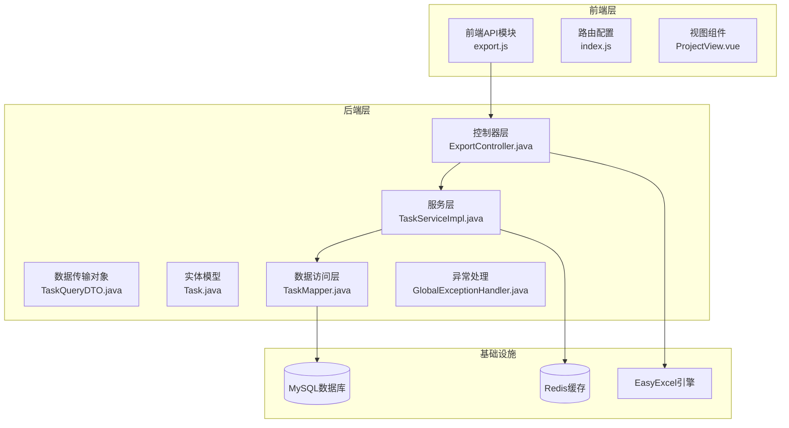
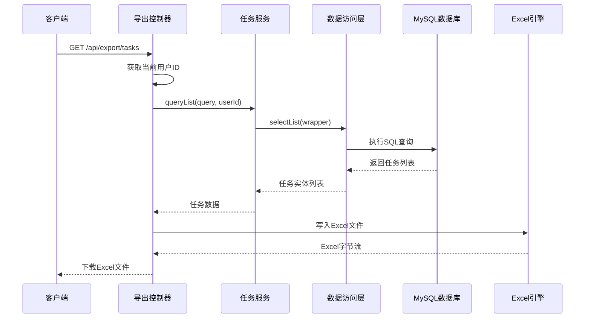
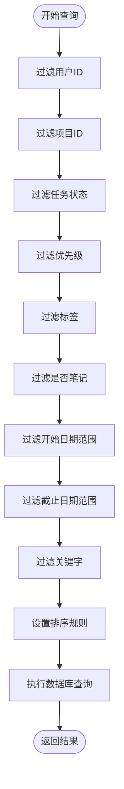
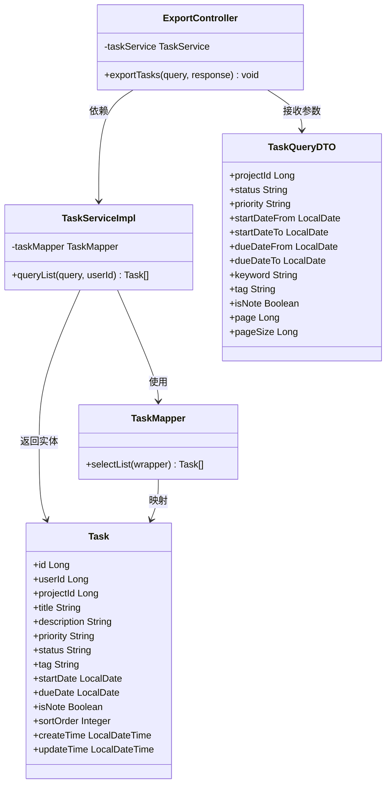
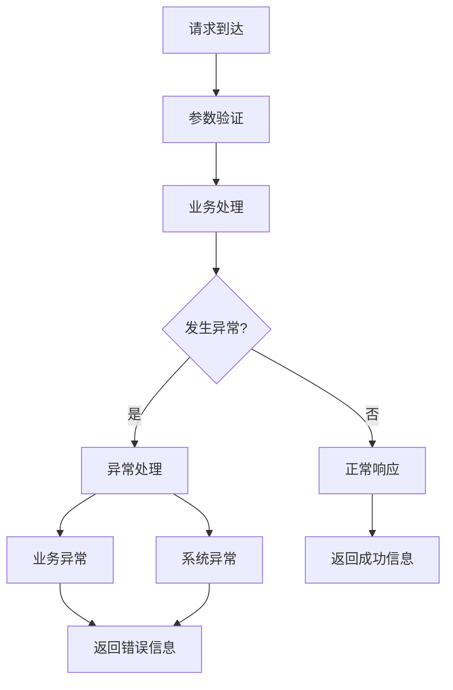

# 数据导出接口

<cite>
**本文档引用的文件**
- [ExportController.java](file://backend/src/main/java/com/newworld/controller/ExportController.java)
- [TaskServiceImpl.java](file://backend/src/main/java/com/newworld/service/impl/TaskServiceImpl.java)
- [TaskQueryDTO.java](file://backend/src/main/java/com/newworld/dto/TaskQueryDTO.java)
- [Task.java](file://backend/src/main/java/com/newworld/entity/Task.java)
- [TaskMapper.java](file://backend/src/main/java/com/newworld/mapper/TaskMapper.java)
- [GlobalExceptionHandler.java](file://backend/src/main/java/com/newworld/common/exception/GlobalExceptionHandler.java)
- [Result.java](file://backend/src/main/java/com/newworld/common/Result.java)
- [export.js](file://frontend/src/api/export.js)
- [application.yml](file://backend/src/main/resources/application.yml)
- [init.sql](file://backend/sql/init.sql)
</cite>

## 目录
1. [简介](#简介)
2. [项目结构](#项目结构)
3. [核心组件](#核心组件)
4. [架构概览](#架构概览)
5. [详细组件分析](#详细组件分析)
6. [依赖关系分析](#依赖关系分析)
7. [性能考虑](#性能考虑)
8. [故障排除指南](#故障排除指南)
9. [结论](#结论)

## 简介
本文档详细说明了新世界个人工作计划管理系统的数据导出接口，重点介绍Excel数据导出功能。系统提供了完整的任务数据导出能力，支持多种筛选条件和格式化输出。导出功能基于Spring Boot + MyBatis-Plus + EasyExcel技术栈实现，具备良好的扩展性和性能表现。

## 项目结构
系统采用典型的三层架构设计，后端使用Spring Boot框架，前端使用Vue.js技术栈，通过RESTful API进行数据交互。



**图表来源**
- [ExportController.java:1-47](file://backend/src/main/java/com/newworld/controller/ExportController.java#L1-L47)
- [TaskServiceImpl.java:1-194](file://backend/src/main/java/com/newworld/service/impl/TaskServiceImpl.java#L1-L194)
- [TaskQueryDTO.java:1-145](file://backend/src/main/java/com/newworld/dto/TaskQueryDTO.java#L1-L145)

**章节来源**
- [application.yml:1-75](file://backend/src/main/resources/application.yml#L1-L75)
- [init.sql:1-95](file://backend/sql/init.sql#L1-L95)

## 核心组件
系统的核心导出功能主要由以下组件构成：

### 导出控制器
ExportController负责处理Excel导出请求，提供RESTful API接口。

### 任务服务层
TaskServiceImpl实现复杂的查询逻辑，支持多维度筛选和排序。

### 数据传输对象
TaskQueryDTO定义了完整的查询参数结构，支持分页和筛选。

### 实体模型
Task实体映射数据库表结构，包含完整的任务信息字段。

**章节来源**
- [ExportController.java:22-46](file://backend/src/main/java/com/newworld/controller/ExportController.java#L22-L46)
- [TaskServiceImpl.java:23-44](file://backend/src/main/java/com/newworld/service/impl/TaskServiceImpl.java#L23-L44)
- [TaskQueryDTO.java:7-48](file://backend/src/main/java/com/newworld/dto/TaskQueryDTO.java#L7-L48)

## 架构概览



**图表来源**
- [ExportController.java:30-45](file://backend/src/main/java/com/newworld/controller/ExportController.java#L30-L45)
- [TaskServiceImpl.java:23-44](file://backend/src/main/java/com/newworld/service/impl/TaskServiceImpl.java#L23-L44)

系统采用MVC架构模式，各层职责清晰分离：

- **表示层**: 处理HTTP请求和响应，负责文件下载
- **业务层**: 实现复杂的查询逻辑和数据处理
- **数据访问层**: 封装数据库操作，提供数据持久化
- **基础设施**: 提供数据库连接、缓存支持和Excel处理能力

## 详细组件分析

### 导出控制器分析

ExportController是整个导出功能的核心入口，提供了简洁而强大的API接口。

#### 接口定义
- **路径**: `/api/export/tasks`
- **方法**: GET
- **功能**: 导出任务数据为Excel文件
- **认证**: 基于JWT的用户身份验证

#### 请求参数
接口支持丰富的筛选参数，所有参数均为可选：

| 参数名 | 类型 | 描述 | 示例值 |
|--------|------|------|--------|
| projectId | Long | 项目ID | 123 |
| status | String | 任务状态 | TODO/IN_PROGRESS/DONE/ARCHIVED |
| priority | String | 优先级 | RED/YELLOW/BLUE/FLAG/NONE |
| startDateFrom | Date | 开始日期起始 | 2024-01-01 |
| startDateTo | Date | 开始日期结束 | 2024-12-31 |
| dueDateFrom | Date | 截止日期起始 | 2024-01-01 |
| dueDateTo | Date | 截止日期结束 | 2024-12-31 |
| keyword | String | 搜索关键字 | 项目需求 |
| tag | String | 标签 | 前端开发 |
| isNote | Boolean | 是否为笔记 | true/false |
| page | Long | 页码 | 1 |
| pageSize | Long | 每页大小 | 100 |

#### 响应格式
- **Content-Type**: `application/vnd.openxmlformats-officedocument.spreadsheetml.sheet`
- **文件名**: `任务导出.xlsx`
- **字符编码**: UTF-8

**章节来源**
- [ExportController.java:30-45](file://backend/src/main/java/com/newworld/controller/ExportController.java#L30-L45)
- [TaskQueryDTO.java:13-47](file://backend/src/main/java/com/newworld/dto/TaskQueryDTO.java#L13-L47)

### 任务服务层分析

TaskServiceImpl实现了复杂的查询逻辑，支持多维度的数据筛选和排序。

#### 查询条件构建
服务层使用MyBatis-Plus的LambdaQueryWrapper构建动态查询条件：



**图表来源**
- [TaskServiceImpl.java:25-41](file://backend/src/main/java/com/newworld/service/impl/TaskServiceImpl.java#L25-L41)

#### 排序规则
查询结果按照以下顺序排序：
1. `sortOrder` 升序
2. `createTime` 降序

#### 分页处理
虽然接口支持分页参数，但导出功能会查询所有符合条件的数据，不进行分页限制。

**章节来源**
- [TaskServiceImpl.java:23-44](file://backend/src/main/java/com/newworld/service/impl/TaskServiceImpl.java#L23-L44)

### Excel文件生成

系统使用EasyExcel库进行高性能的Excel文件生成，支持自动列宽调整和流式写入。

#### 文件格式特性
- **文件类型**: `.xlsx` (Office Open XML格式)
- **工作表名称**: `任务列表`
- **列宽策略**: 自动匹配最长内容的列宽
- **内存优化**: 流式写入，避免大文件内存溢出

#### 字段映射规则
EasyExcel根据Task实体的字段注解自动生成Excel列，确保前后端字段一致性。

**章节来源**
- [ExportController.java:41-44](file://backend/src/main/java/com/newworld/controller/ExportController.java#L41-L44)

### 前端集成

前端通过Axios库调用导出接口，支持二进制文件下载。

#### API调用示例
```javascript
// 导出任务数据
export function exportTasks(params) {
  return request.get('/export/tasks', { 
    params, 
    responseType: 'blob' 
  })
}
```

#### 响应处理
前端接收到二进制文件流后，使用浏览器的文件下载机制自动保存文件。

**章节来源**
- [export.js:3-5](file://frontend/src/api/export.js#L3-L5)

## 依赖关系分析



**图表来源**
- [ExportController.java:25-28](file://backend/src/main/java/com/newworld/controller/ExportController.java#L25-L28)
- [TaskServiceImpl.java:20-21](file://backend/src/main/java/com/newworld/service/impl/TaskServiceImpl.java#L20-L21)
- [TaskQueryDTO.java:11-144](file://backend/src/main/java/com/newworld/dto/TaskQueryDTO.java#L11-L144)
- [Task.java:14-183](file://backend/src/main/java/com/newworld/entity/Task.java#L14-183)

系统的主要外部依赖包括：

- **EasyExcel**: 高性能Excel处理库
- **MyBatis-Plus**: ORM框架，简化数据库操作
- **MySQL驱动**: 关系型数据库连接
- **Redis客户端**: 缓存支持

**章节来源**
- [application.yml:10-30](file://backend/src/main/resources/application.yml#L10-L30)

## 性能考虑

### 数据库性能优化
系统在任务表上建立了多个复合索引以优化查询性能：

| 索引名称 | 列组合 | 用途 |
|----------|--------|------|
| idx_task_user_date | user_id, start_date, due_date | 用户+日期范围查询 |
| idx_task_project | project_id | 项目筛选查询 |
| idx_task_status | status | 状态筛选查询 |
| idx_task_priority | priority | 优先级筛选查询 |

### 内存优化策略
1. **流式写入**: EasyExcel支持流式写入，避免大文件占用过多内存
2. **无分页导出**: 导出功能查询所有符合条件的数据，确保完整性
3. **连接池管理**: 合理配置数据库连接池参数

### 并发处理
- **线程安全**: Excel写入操作在单线程上下文中执行
- **资源管理**: 及时释放数据库连接和文件流资源

## 故障排除指南

### 常见错误及解决方案

#### 1. 导出文件为空
**可能原因**:
- 用户权限不足
- 查询条件过于严格导致无数据

**解决方法**:
- 检查用户登录状态
- 放宽查询条件或清除筛选器

#### 2. Excel文件损坏
**可能原因**:
- 数据库连接异常
- 网络中断导致文件传输不完整

**解决方法**:
- 检查数据库连接状态
- 重新发起导出请求

#### 3. 内存溢出错误
**可能原因**:
- 导出数据量过大
- 系统内存不足

**解决方法**:
- 建议分批导出或缩小查询范围
- 调整JVM内存参数

### 异常处理机制

系统采用全局异常处理机制，统一处理各种运行时异常：



**图表来源**
- [GlobalExceptionHandler.java:17-33](file://backend/src/main/java/com/newworld/common/exception/GlobalExceptionHandler.java#L17-L33)

**章节来源**
- [GlobalExceptionHandler.java:17-33](file://backend/src/main/java/com/newworld/common/exception/GlobalExceptionHandler.java#L17-L33)

## 结论

新世界系统的数据导出接口设计合理，功能完善，具有以下特点：

### 技术优势
- **架构清晰**: 采用标准的MVC架构，职责分离明确
- **性能优秀**: 基于EasyExcel的高效Excel处理，支持流式写入
- **扩展性强**: 支持灵活的查询条件和排序规则
- **用户体验好**: 前后端分离，接口设计简洁易用

### 功能特性
- **多维筛选**: 支持项目、状态、优先级、日期范围等多种筛选条件
- **格式丰富**: 自动适配列宽，支持中文显示
- **安全可靠**: 基于JWT的身份验证，确保数据安全
- **错误处理**: 完善的异常处理机制，提供友好的错误信息

### 应用场景
该导出功能适用于以下场景：
- 任务数据备份和归档
- 项目管理报表生成
- 团队协作数据共享
- 数据迁移和导入准备

系统在保证功能完整性的同时，注重性能优化和用户体验，是一个成熟稳定的企业级应用组件。