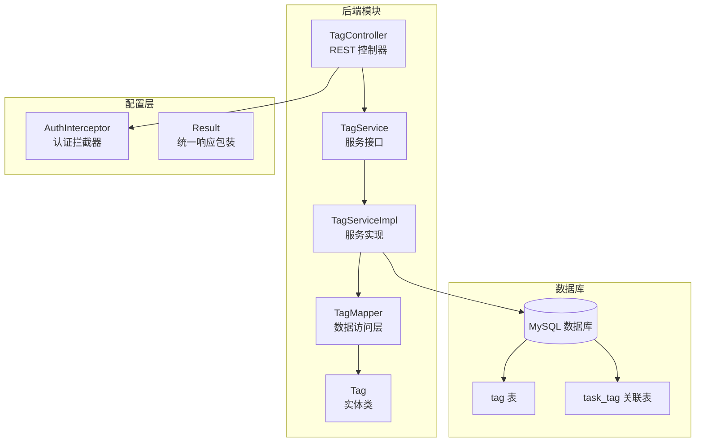
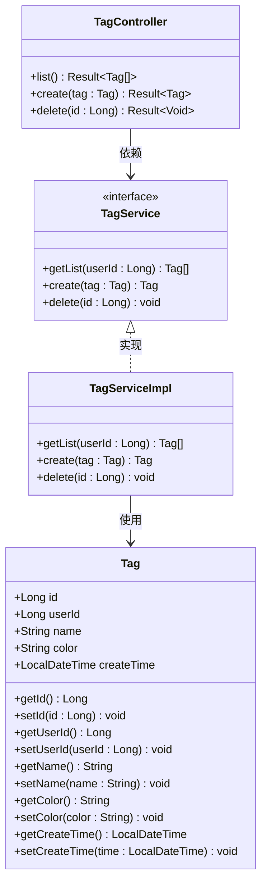
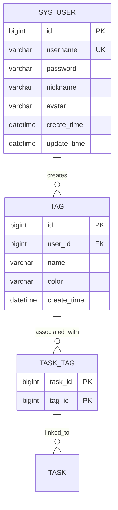
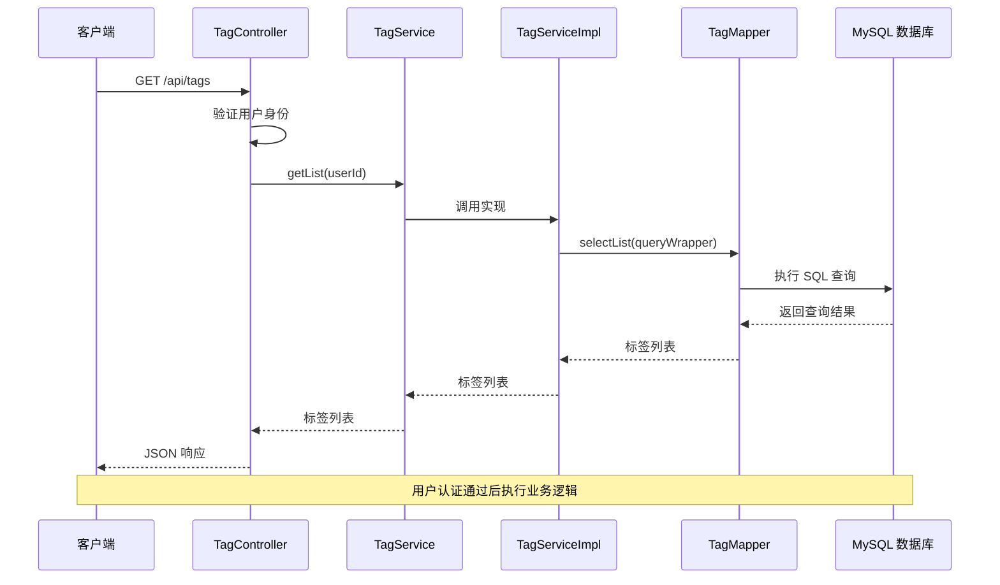
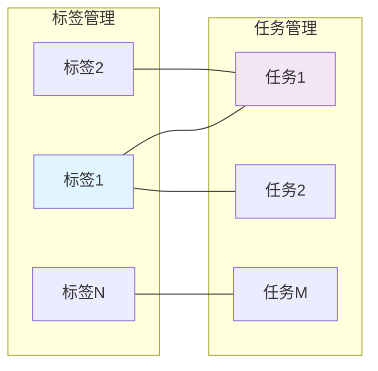
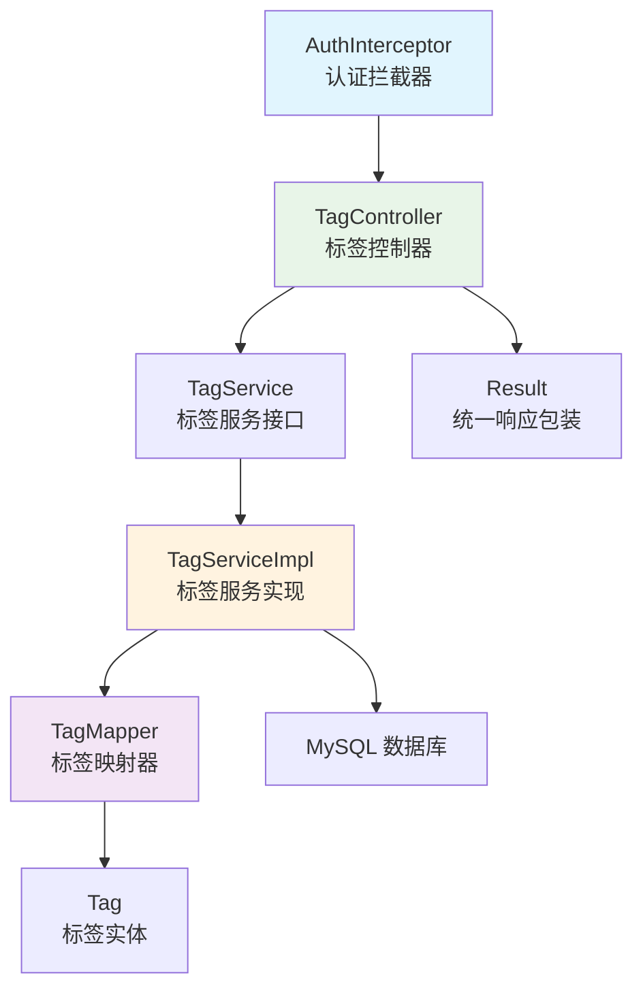

# 标签管理接口

<cite>
**本文档引用的文件**
- [Tag.java](file://backend/src/main/java/com/newworld/entity/Tag.java)
- [TagController.java](file://backend/src/main/java/com/newworld/controller/TagController.java)
- [TagService.java](file://backend/src/main/java/com/newworld/service/TagService.java)
- [TagServiceImpl.java](file://backend/src/main/java/com/newworld/service/impl/TagServiceImpl.java)
- [TagMapper.java](file://backend/src/main/java/com/newworld/mapper/TagMapper.java)
- [init.sql](file://backend/sql/init.sql)
- [Result.java](file://backend/src/main/java/com/newworld/common/Result.java)
- [AuthInterceptor.java](file://backend/src/main/java/com/newworld/config/AuthInterceptor.java)
- [tag.js](file://frontend/src/api/tag.js)
- [Task.java](file://backend/src/main/java/com/newworld/entity/Task.java)
</cite>

## 目录
1. [简介](#简介)
2. [项目结构](#项目结构)
3. [核心组件](#核心组件)
4. [架构概览](#架构概览)
5. [详细组件分析](#详细组件分析)
6. [依赖关系分析](#依赖关系分析)
7. [性能考虑](#性能考虑)
8. [故障排除指南](#故障排除指南)
9. [结论](#结论)

## 简介

NewWorld 是一个个人工作计划管理工具，标签管理接口是系统的核心功能之一。该接口提供了完整的标签 CRUD 操作，支持标签与任务的多对多关联关系，并具备搜索和过滤功能。标签系统采用 MySQL 数据库存储，通过 MyBatis-Plus 进行数据访问层操作。

## 项目结构

标签管理模块在项目中的组织结构如下：



**图表来源**
- [TagController.java:1-43](file://backend/src/main/java/com/newworld/controller/TagController.java#L1-L43)
- [TagServiceImpl.java:1-35](file://backend/src/main/java/com/newworld/service/impl/TagServiceImpl.java#L1-L35)
- [TagMapper.java:1-10](file://backend/src/main/java/com/newworld/mapper/TagMapper.java#L1-L10)

**章节来源**
- [TagController.java:1-43](file://backend/src/main/java/com/newworld/controller/TagController.java#L1-L43)
- [TagService.java:1-24](file://backend/src/main/java/com/newworld/service/TagService.java#L1-L24)
- [TagServiceImpl.java:1-35](file://backend/src/main/java/com/newworld/service/impl/TagServiceImpl.java#L1-L35)

## 核心组件

### 标签实体模型

标签实体是系统中最重要的数据模型，定义了标签的基本属性和业务逻辑：



**图表来源**
- [Tag.java:11-72](file://backend/src/main/java/com/newworld/entity/Tag.java#L11-L72)
- [TagController.java:16-42](file://backend/src/main/java/com/newworld/controller/TagController.java#L16-L42)
- [TagService.java:7-23](file://backend/src/main/java/com/newworld/service/TagService.java#L7-L23)
- [TagServiceImpl.java:13-34](file://backend/src/main/java/com/newworld/service/impl/TagServiceImpl.java#L13-L34)

### 数据库表结构

标签系统涉及三个核心表，形成了完整的标签管理机制：



**图表来源**
- [init.sql:68-84](file://backend/sql/init.sql#L68-L84)

**章节来源**
- [Tag.java:11-72](file://backend/src/main/java/com/newworld/entity/Tag.java#L11-L72)
- [init.sql:68-84](file://backend/sql/init.sql#L68-L84)

## 架构概览

标签管理接口采用经典的三层架构模式，实现了清晰的职责分离：



**图表来源**
- [TagController.java:21-26](file://backend/src/main/java/com/newworld/controller/TagController.java#L21-L26)
- [TagServiceImpl.java:18-22](file://backend/src/main/java/com/newworld/service/impl/TagServiceImpl.java#L18-L22)

**章节来源**
- [TagController.java:1-43](file://backend/src/main/java/com/newworld/controller/TagController.java#L1-L43)
- [TagServiceImpl.java:1-35](file://backend/src/main/java/com/newworld/service/impl/TagServiceImpl.java#L1-L35)

## 详细组件分析

### 标签实体字段定义

标签实体包含以下核心字段：

| 字段名 | 类型 | 必填 | 默认值 | 说明 |
|--------|------|------|--------|------|
| id | Long | 否 | 自增 | 标签唯一标识符 |
| userId | Long | 是 | 无 | 创建者用户ID |
| name | String | 是 | 无 | 标签名称，最大长度50字符 |
| color | String | 否 | '#409EFF' | 标签颜色，CSS颜色格式 |
| createTime | LocalDateTime | 否 | 当前时间 | 创建时间，自动填充 |

### 标签CRUD操作接口

#### 获取标签列表

**接口地址**: `GET /api/tags`

**请求参数**: 无

**响应数据**: 
```json
{
  "code": 200,
  "msg": "操作成功",
  "data": [
    {
      "id": 1,
      "userId": 1,
      "name": "工作",
      "color": "#409EFF",
      "createTime": "2024-01-01T00:00:00"
    },
    {
      "id": 2,
      "userId": 1,
      "name": "学习",
      "color": "#67C23A",
      "createTime": "2024-01-01T00:00:00"
    }
  ]
}
```

**实现流程**:
1. 通过认证拦截器获取当前用户ID
2. 调用服务层获取指定用户的标签列表
3. 返回统一响应格式

#### 创建标签

**接口地址**: `POST /api/tags`

**请求体参数**:
```json
{
  "name": "重要项目",
  "color": "#F56C6C"
}
```

**响应数据**:
```json
{
  "code": 200,
  "msg": "创建成功",
  "data": {
    "id": 3,
    "userId": 1,
    "name": "重要项目",
    "color": "#F56C6C",
    "createTime": "2024-01-01T00:00:00"
  }
}
```

**实现流程**:
1. 设置标签所属用户ID
2. 调用服务层创建标签
3. 返回创建成功的标签信息

#### 删除标签

**接口地址**: `DELETE /api/tags/{id}`

**路径参数**:
- id: Long - 标签ID

**响应数据**:
```json
{
  "code": 200,
  "msg": "删除成功",
  "data": null
}
```

**实现流程**:
1. 调用服务层删除指定ID的标签
2. 返回操作成功信息

### 标签与任务的多对多关联

标签系统支持标签与任务的多对多关联关系，通过中间表 `task_tag` 实现：



**关联表结构**:
- task_id: BIGINT - 任务ID（外键）
- tag_id: BIGINT - 标签ID（外键）

**章节来源**
- [init.sql:77-84](file://backend/sql/init.sql#L77-L84)
- [Task.java:41-42](file://backend/src/main/java/com/newworld/entity/Task.java#L41-L42)

### 搜索和过滤功能

当前实现支持基于用户ID的过滤查询，未来可扩展更多搜索功能：

**现有过滤**:
- 用户维度过滤：每个标签都绑定到特定用户
- ID精确查询：通过标签ID进行精确匹配

**扩展建议**:
- 名称模糊匹配：支持LIKE查询
- 颜色过滤：按颜色属性过滤
- 时间范围过滤：按创建时间范围过滤

### 标签统计信息和使用频率

当前版本未实现标签使用频率统计功能，可通过以下SQL查询实现：

```sql
SELECT 
    t.id,
    t.name,
    t.color,
    COUNT(tt.task_id) as usage_count
FROM tag t
LEFT JOIN task_tag tt ON t.id = tt.tag_id
GROUP BY t.id, t.name, t.color
ORDER BY usage_count DESC;
```

**章节来源**
- [TagServiceImpl.java:18-22](file://backend/src/main/java/com/newworld/service/impl/TagServiceImpl.java#L18-L22)

## 依赖关系分析

标签管理模块的依赖关系清晰明确：



**图表来源**
- [AuthInterceptor.java:19-77](file://backend/src/main/java/com/newworld/config/AuthInterceptor.java#L19-L77)
- [TagController.java:18-19](file://backend/src/main/java/com/newworld/controller/TagController.java#L18-L19)
- [TagServiceImpl.java:15-16](file://backend/src/main/java/com/newworld/service/impl/TagServiceImpl.java#L15-L16)

**章节来源**
- [AuthInterceptor.java:1-78](file://backend/src/main/java/com/newworld/config/AuthInterceptor.java#L1-L78)
- [TagController.java:1-43](file://backend/src/main/java/com/newworld/controller/TagController.java#L1-L43)

## 性能考虑

### 数据库优化

1. **索引策略**：
   - 任务表已建立多列复合索引用于查询优化
   - 标签表建议添加 `(user_id, name)` 复合索引

2. **查询优化**：
   - 使用条件查询避免全表扫描
   - 限制查询结果集大小

3. **连接优化**：
   - 标签与任务关联查询使用INNER JOIN
   - 避免N+1查询问题

### 缓存策略

建议实现以下缓存策略：
- 用户标签列表缓存
- 标签使用频率统计缓存
- 最近使用的标签缓存

## 故障排除指南

### 常见问题及解决方案

**1. 认证失败**
- 症状：返回401未授权错误
- 原因：缺少或无效的Authorization头
- 解决：确保请求头包含有效的Bearer Token

**2. 数据库连接异常**
- 症状：数据库连接超时或拒绝
- 原因：数据库服务不可用或配置错误
- 解决：检查数据库连接配置和网络连通性

**3. 标签重复创建**
- 症状：数据库约束冲突
- 原因：同一用户下标签名称重复
- 解决：在业务层添加重复检测逻辑

**章节来源**
- [AuthInterceptor.java:37-49](file://backend/src/main/java/com/newworld/config/AuthInterceptor.java#L37-L49)
- [Result.java:52-64](file://backend/src/main/java/com/newworld/common/Result.java#L52-L64)

## 结论

NewWorld 的标签管理接口设计合理，实现了完整的标签 CRUD 功能，并建立了标签与任务的多对多关联关系。系统采用分层架构设计，职责清晰，易于维护和扩展。

**主要优势**：
- 清晰的分层架构设计
- 完整的标签实体模型
- 支持标签与任务的多对多关联
- 统一的响应格式设计

**改进建议**：
- 添加标签名称重复检测机制
- 实现标签使用频率统计功能
- 扩展标签搜索和过滤功能
- 添加标签更新接口（PUT /api/tags/{id}）