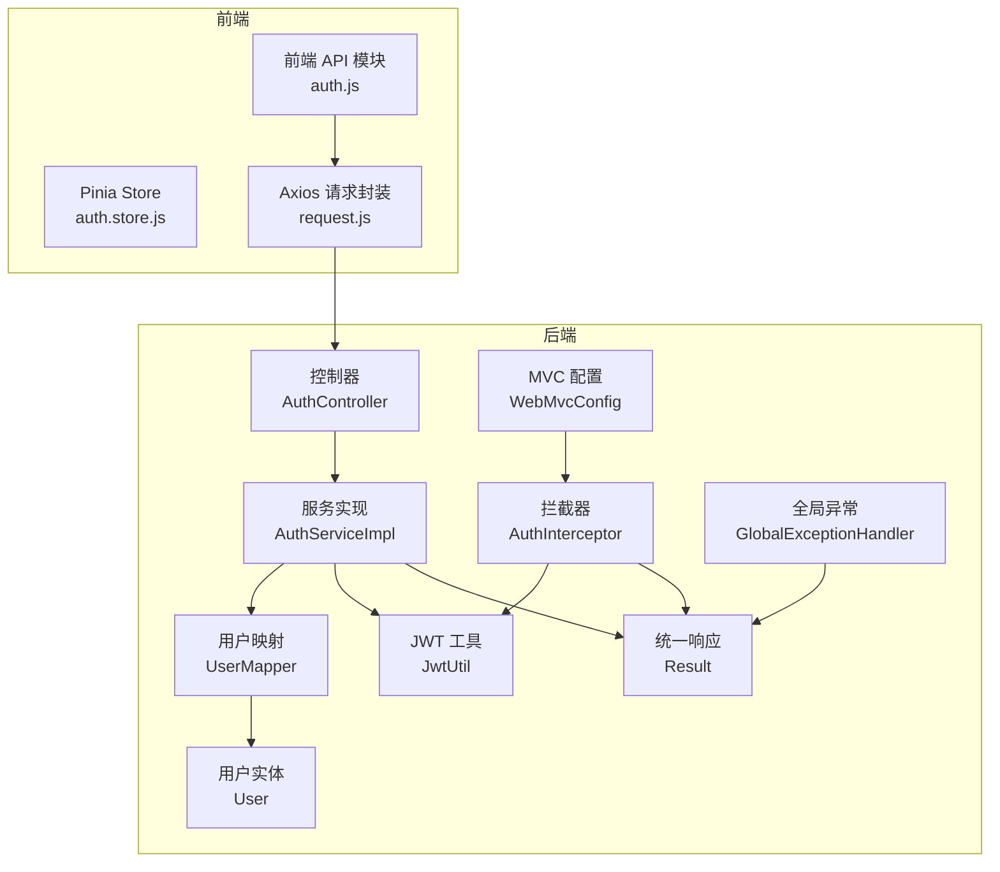
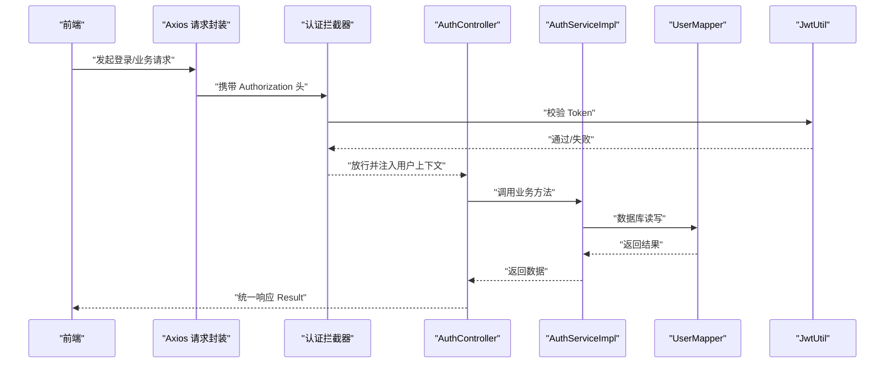
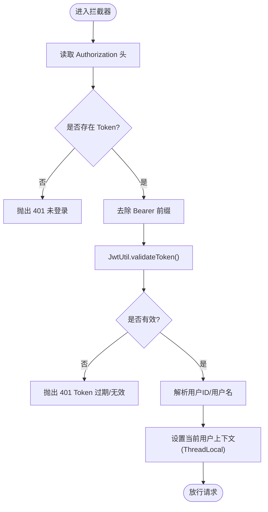
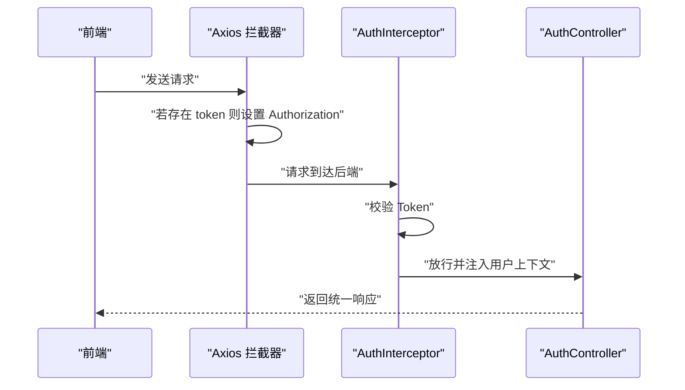
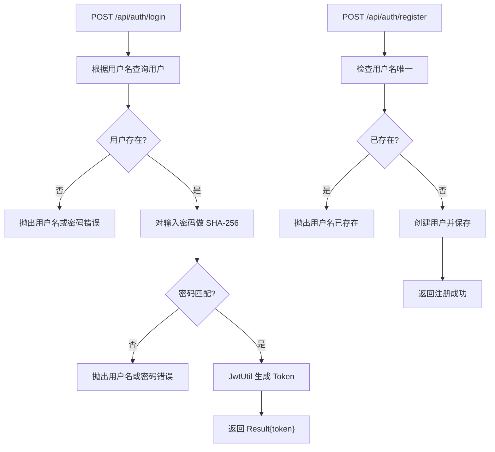
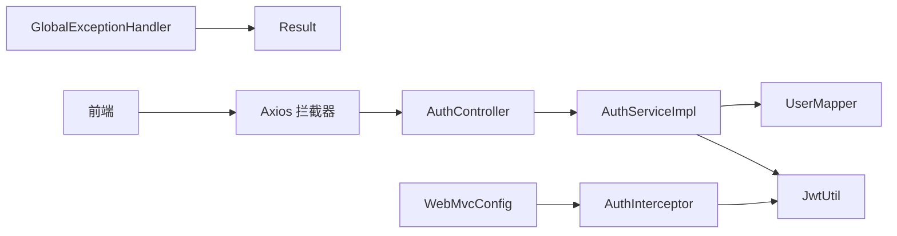

# 认证接口

<cite>
**本文引用的文件**
- [AuthController.java](file://backend/src/main/java/com/newworld/controller/AuthController.java)
- [AuthService.java](file://backend/src/main/java/com/newworld/service/AuthService.java)
- [AuthServiceImpl.java](file://backend/src/main/java/com/newworld/service/impl/AuthServiceImpl.java)
- [LoginRequest.java](file://backend/src/main/java/com/newworld/dto/LoginRequest.java)
- [JwtUtil.java](file://backend/src/main/java/com/newworld/common/JwtUtil.java)
- [AuthInterceptor.java](file://backend/src/main/java/com/newworld/config/AuthInterceptor.java)
- [WebMvcConfig.java](file://backend/src/main/java/com/newworld/config/WebMvcConfig.java)
- [Result.java](file://backend/src/main/java/com/newworld/common/Result.java)
- [GlobalExceptionHandler.java](file://backend/src/main/java/com/newworld/common/exception/GlobalExceptionHandler.java)
- [application.yml](file://backend/src/main/resources/application.yml)
- [User.java](file://backend/src/main/java/com/newworld/entity/User.java)
- [UserMapper.java](file://backend/src/main/java/com/newworld/mapper/UserMapper.java)
- [auth.js](file://frontend/src/api/auth.js)
- [auth.store.js](file://frontend/src/stores/auth.js)
- [request.js](file://frontend/src/utils/request.js)
</cite>

## 目录
1. [简介](#简介)
2. [项目结构](#项目结构)
3. [核心组件](#核心组件)
4. [架构总览](#架构总览)
5. [详细组件分析](#详细组件分析)
6. [依赖分析](#依赖分析)
7. [性能考量](#性能考量)
8. [故障排查指南](#故障排查指南)
9. [结论](#结论)
10. [附录](#附录)

## 简介
本文件为认证接口的详细API文档，覆盖用户登录、注册、退出与当前用户信息查询等能力。重点说明：
- 接口定义与请求/响应格式
- JWT Token 的生成、验证与失效处理
- 认证拦截器工作原理与请求头传递方式
- 常见错误处理与安全建议

## 项目结构
后端采用 Spring Boot + MyBatis-Plus 架构，认证相关模块分布如下：
- 控制层：AuthController 提供 /api/auth/* 接口
- 服务层：AuthService 及其实现类负责业务逻辑
- 基础设施：JwtUtil 提供 JWT 编解码；AuthInterceptor 实现全局认证拦截
- 配置：WebMvcConfig 注册拦截器与跨域策略
- 统一响应：Result 封装统一返回结构
- 异常处理：GlobalExceptionHandler 统一捕获业务异常

图表来源
- [AuthController.java:1-55](file://backend/src/main/java/com/newworld/controller/AuthController.java#L1-L55)
- [AuthServiceImpl.java:1-69](file://backend/src/main/java/com/newworld/service/impl/AuthServiceImpl.java#L1-L69)
- [JwtUtil.java:1-78](file://backend/src/main/java/com/newworld/common/JwtUtil.java#L1-L78)
- [AuthInterceptor.java:1-78](file://backend/src/main/java/com/newworld/config/AuthInterceptor.java#L1-L78)
- [WebMvcConfig.java:1-53](file://backend/src/main/java/com/newworld/config/WebMvcConfig.java#L1-L53)
- [Result.java:1-90](file://backend/src/main/java/com/newworld/common/Result.java#L1-L90)
- [GlobalExceptionHandler.java:1-35](file://backend/src/main/java/com/newworld/common/exception/GlobalExceptionHandler.java#L1-L35)
- [UserMapper.java:1-10](file://backend/src/main/java/com/newworld/mapper/UserMapper.java#L1-L10)
- [User.java:1-95](file://backend/src/main/java/com/newworld/entity/User.java#L1-L95)
- [auth.js:1-14](file://frontend/src/api/auth.js#L1-L14)
- [auth.store.js:1-41](file://frontend/src/stores/auth.store.js#L1-L41)
- [request.js:1-56](file://frontend/src/utils/request.js#L1-L56)

章节来源
- [AuthController.java:1-55](file://backend/src/main/java/com/newworld/controller/AuthController.java#L1-L55)
- [WebMvcConfig.java:1-53](file://backend/src/main/java/com/newworld/config/WebMvcConfig.java#L1-L53)

## 核心组件
- 认证控制器：提供登录、注册、获取当前用户信息、退出接口
- 认证服务：实现注册、登录校验与用户信息查询
- JWT 工具：生成、解析与校验 Token
- 认证拦截器：拦截请求，校验 Token 并注入当前用户上下文
- MVC 配置：注册拦截器与跨域策略
- 统一响应与异常处理：规范返回结构与错误码

章节来源
- [AuthController.java:1-55](file://backend/src/main/java/com/newworld/controller/AuthController.java#L1-L55)
- [AuthService.java:1-24](file://backend/src/main/java/com/newworld/service/AuthService.java#L1-L24)
- [AuthServiceImpl.java:1-69](file://backend/src/main/java/com/newworld/service/impl/AuthServiceImpl.java#L1-L69)
- [JwtUtil.java:1-78](file://backend/src/main/java/com/newworld/common/JwtUtil.java#L1-L78)
- [AuthInterceptor.java:1-78](file://backend/src/main/java/com/newworld/config/AuthInterceptor.java#L1-L78)
- [WebMvcConfig.java:1-53](file://backend/src/main/java/com/newworld/config/WebMvcConfig.java#L1-L53)
- [Result.java:1-90](file://backend/src/main/java/com/newworld/common/Result.java#L1-L90)
- [GlobalExceptionHandler.java:1-35](file://backend/src/main/java/com/newworld/common/exception/GlobalExceptionHandler.java#L1-L35)

## 架构总览
认证流程概览：
- 前端通过 Axios 发起请求，自动在请求头注入 Authorization: Bearer <token>
- 后端拦截器校验 Token，通过后将用户上下文放入当前线程
- 控制器调用服务层执行业务逻辑，返回统一响应结构

图表来源
- [AuthInterceptor.java:30-58](file://backend/src/main/java/com/newworld/config/AuthInterceptor.java#L30-L58)
- [AuthController.java:25-53](file://backend/src/main/java/com/newworld/controller/AuthController.java#L25-L53)
- [AuthServiceImpl.java:40-67](file://backend/src/main/java/com/newworld/service/impl/AuthServiceImpl.java#L40-L67)
- [JwtUtil.java:61-69](file://backend/src/main/java/com/newworld/common/JwtUtil.java#L61-L69)
- [request.js:9-19](file://frontend/src/utils/request.js#L9-L19)

## 详细组件分析

### 接口定义与使用说明

- 登录接口
  - 方法与路径：POST /api/auth/login
  - 请求体：LoginRequest（用户名、密码）
  - 成功响应：Result，data 包含 token 字段
  - 错误响应：Result，code 非 200，msg 描述错误
  - 状态码：200 表示成功；400/401/500 由全局异常处理器映射
  - 示例
    - 成功：返回包含 token 的 Result
    - 密码错误/用户名不存在：返回错误 Result
  - 安全提示：密码以明文传输前会进行 SHA-256 加密存储

- 注册接口
  - 方法与路径：POST /api/auth/register
  - 请求体：LoginRequest（用户名、密码）
  - 成功响应：Result，msg 表示“注册成功”
  - 错误响应：Result，如用户名已存在

- 获取当前用户信息
  - 方法与路径：GET /api/auth/user-info
  - 需要登录态（拦截器放行）
  - 成功响应：Result，data 为 User 对象（不包含密码）

- 退出接口
  - 方法与路径：POST /api/auth/logout
  - 需要登录态
  - 成功响应：Result，msg 表示“退出成功”

章节来源
- [AuthController.java:25-53](file://backend/src/main/java/com/newworld/controller/AuthController.java#L25-L53)
- [LoginRequest.java:1-37](file://backend/src/main/java/com/newworld/dto/LoginRequest.java#L1-L37)
- [Result.java:22-50](file://backend/src/main/java/com/newworld/common/Result.java#L22-L50)
- [GlobalExceptionHandler.java:17-21](file://backend/src/main/java/com/newworld/common/exception/GlobalExceptionHandler.java#L17-L21)
- [User.java:1-95](file://backend/src/main/java/com/newworld/entity/User.java#L1-L95)

### JWT Token 生成、验证与刷新机制

- 生成
  - 使用 JwtUtil 生成 Token，载荷包含用户 ID 与用户名，签名算法为 HS512，有效期由配置决定
- 验证
  - 拦截器从请求头 Authorization 中提取 Token，去除 Bearer 前缀后调用 JwtUtil.validateToken 校验
- 刷新
  - 当前实现未提供专用刷新接口；可按需扩展“刷新 Token”接口，或在前端检测到 401 时引导重新登录

图表来源
- [AuthInterceptor.java:30-58](file://backend/src/main/java/com/newworld/config/AuthInterceptor.java#L30-L58)
- [JwtUtil.java:61-69](file://backend/src/main/java/com/newworld/common/JwtUtil.java#L61-L69)

章节来源
- [JwtUtil.java:29-40](file://backend/src/main/java/com/newworld/common/JwtUtil.java#L29-L40)
- [application.yml:65-68](file://backend/src/main/resources/application.yml#L65-L68)
- [AuthInterceptor.java:37-49](file://backend/src/main/java/com/newworld/config/AuthInterceptor.java#L37-L49)

### 认证拦截器与请求头传递

- 拦截范围
  - 对 /api/** 生效，排除 /api/auth/login、/api/auth/register、/api/system/** 等
- 请求头传递
  - 前端在请求拦截中自动添加 Authorization: Bearer <token>
  - 后端从 Authorization 头解析并校验
- 上下文注入
  - 校验通过后将用户 ID 与用户名放入 ThreadLocal，供控制器读取

图表来源
- [WebMvcConfig.java:19-33](file://backend/src/main/java/com/newworld/config/WebMvcConfig.java#L19-L33)
- [request.js:9-19](file://frontend/src/utils/request.js#L9-L19)
- [AuthInterceptor.java:30-58](file://backend/src/main/java/com/newworld/config/AuthInterceptor.java#L30-L58)

章节来源
- [WebMvcConfig.java:19-33](file://backend/src/main/java/com/newworld/config/WebMvcConfig.java#L19-L33)
- [AuthInterceptor.java:30-58](file://backend/src/main/java/com/newworld/config/AuthInterceptor.java#L30-L58)
- [request.js:9-19](file://frontend/src/utils/request.js#L9-L19)

### 业务流程与数据模型

- 登录流程
  - 查询用户是否存在
  - 校验密码（SHA-256）
  - 生成并返回 Token
- 注册流程
  - 校验用户名唯一性
  - 创建用户并保存（密码 SHA-256）
- 用户信息查询
  - 通过拦截器注入的用户 ID 查询用户并返回（密码置空）

图表来源
- [AuthServiceImpl.java:40-57](file://backend/src/main/java/com/newworld/service/impl/AuthServiceImpl.java#L40-L57)
- [UserMapper.java:1-10](file://backend/src/main/java/com/newworld/mapper/UserMapper.java#L1-L10)
- [JwtUtil.java:29-40](file://backend/src/main/java/com/newworld/common/JwtUtil.java#L29-L40)

章节来源
- [AuthServiceImpl.java:24-57](file://backend/src/main/java/com/newworld/service/impl/AuthServiceImpl.java#L24-L57)
- [UserMapper.java:1-10](file://backend/src/main/java/com/newworld/mapper/UserMapper.java#L1-L10)
- [User.java:1-95](file://backend/src/main/java/com/newworld/entity/User.java#L1-L95)

### 前端集成要点
- 登录成功后将 token 写入本地存储，并在后续请求中自动附加 Authorization 头
- 401 时清除本地 token 并跳转至登录页
- 获取用户信息接口用于初始化用户资料

章节来源
- [auth.js:1-14](file://frontend/src/api/auth.js#L1-L14)
- [auth.store.js:1-41](file://frontend/src/stores/auth.store.js#L1-L41)
- [request.js:9-19](file://frontend/src/utils/request.js#L9-L19)

## 依赖分析
- 控制器依赖服务层与统一响应
- 服务层依赖 Mapper、JwtUtil 与异常处理
- 拦截器依赖 JwtUtil 与全局异常
- MVC 配置注册拦截器并排除特定路径
- 前端通过 Axios 统一注入 Authorization 头

图表来源
- [AuthController.java:1-55](file://backend/src/main/java/com/newworld/controller/AuthController.java#L1-L55)
- [AuthServiceImpl.java:1-69](file://backend/src/main/java/com/newworld/service/impl/AuthServiceImpl.java#L1-L69)
- [AuthInterceptor.java:1-78](file://backend/src/main/java/com/newworld/config/AuthInterceptor.java#L1-L78)
- [WebMvcConfig.java:1-53](file://backend/src/main/java/com/newworld/config/WebMvcConfig.java#L1-L53)
- [Result.java:1-90](file://backend/src/main/java/com/newworld/common/Result.java#L1-L90)
- [GlobalExceptionHandler.java:1-35](file://backend/src/main/java/com/newworld/common/exception/GlobalExceptionHandler.java#L1-L35)
- [request.js:9-19](file://frontend/src/utils/request.js#L9-L19)

章节来源
- [AuthController.java:1-55](file://backend/src/main/java/com/newworld/controller/AuthController.java#L1-L55)
- [AuthServiceImpl.java:1-69](file://backend/src/main/java/com/newworld/service/impl/AuthServiceImpl.java#L1-L69)
- [AuthInterceptor.java:1-78](file://backend/src/main/java/com/newworld/config/AuthInterceptor.java#L1-L78)
- [WebMvcConfig.java:1-53](file://backend/src/main/java/com/newworld/config/WebMvcConfig.java#L1-L53)
- [GlobalExceptionHandler.java:1-35](file://backend/src/main/java/com/newworld/common/exception/GlobalExceptionHandler.java#L1-L35)
- [request.js:9-19](file://frontend/src/utils/request.js#L9-L19)

## 性能考量
- Token 有效期默认 24 小时，可根据业务调整
- 拦截器每次请求都会校验 Token，建议保持合理的日志级别避免过多开销
- 前端统一注入 Authorization 头，减少重复代码与错误

## 故障排查指南
- 401 未登录/Token 无效
  - 检查前端是否正确设置 Authorization 头
  - 检查后端拦截器是否正确去除 Bearer 前缀
  - 检查 JWT secret 与 expiration 配置是否一致
- 用户名或密码错误
  - 确认用户名存在且密码 SHA-256 匹配
- 用户名已存在
  - 注册时检查用户名唯一性
- 服务器内部错误
  - 查看全局异常处理器返回的错误信息

章节来源
- [AuthInterceptor.java:37-49](file://backend/src/main/java/com/newworld/config/AuthInterceptor.java#L37-L49)
- [GlobalExceptionHandler.java:17-33](file://backend/src/main/java/com/newworld/common/exception/GlobalExceptionHandler.java#L17-L33)
- [application.yml:65-68](file://backend/src/main/resources/application.yml#L65-L68)

## 结论
本认证体系基于 JWT 实现，具备清晰的拦截链路与统一响应结构。登录/注册流程简单可靠，拦截器确保受保护接口的安全访问。建议后续补充 Token 刷新与登出清理策略，进一步提升用户体验与安全性。

## 附录

### 请求与响应示例（描述性）
- 登录成功
  - 请求：POST /api/auth/login，Body 包含用户名与密码
  - 响应：Result，code=200，data.token 存在
- 密码错误
  - 响应：Result，code 非 200，msg 为“用户名或密码错误”
- 未登录
  - 响应：Result，code=401，msg 为“未登录，请先登录”
- Token 过期/无效
  - 响应：Result，code=401，msg 为“Token 已过期或无效，请重新登录”

章节来源
- [AuthController.java:25-53](file://backend/src/main/java/com/newworld/controller/AuthController.java#L25-L53)
- [AuthServiceImpl.java:40-57](file://backend/src/main/java/com/newworld/service/impl/AuthServiceImpl.java#L40-L57)
- [AuthInterceptor.java:37-49](file://backend/src/main/java/com/newworld/config/AuthInterceptor.java#L37-L49)
- [Result.java:22-50](file://backend/src/main/java/com/newworld/common/Result.java#L22-L50)