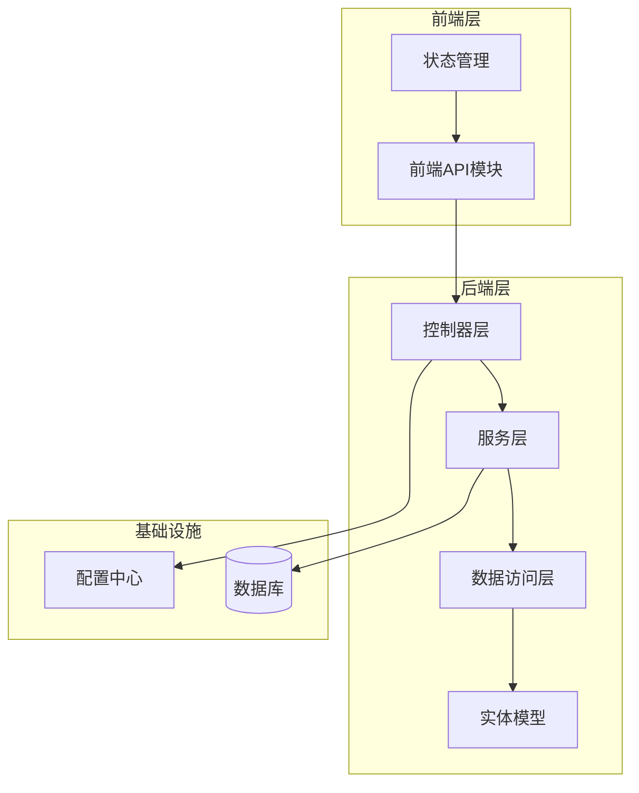
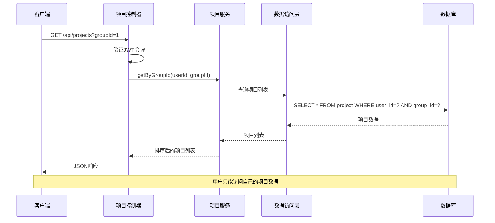
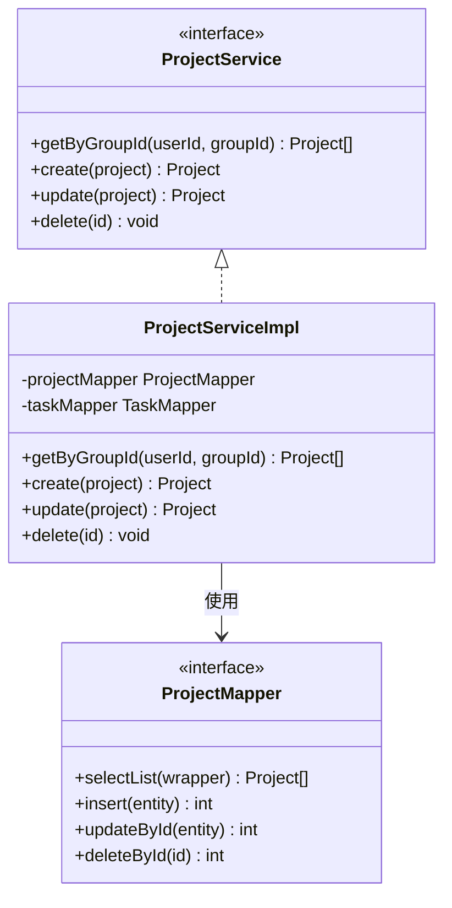
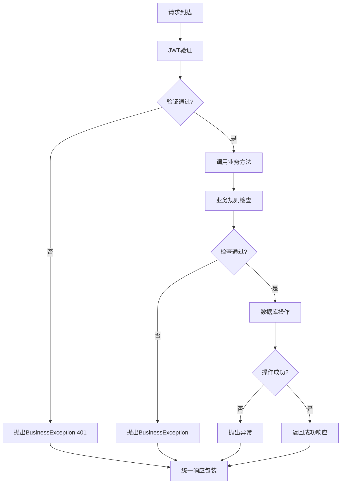
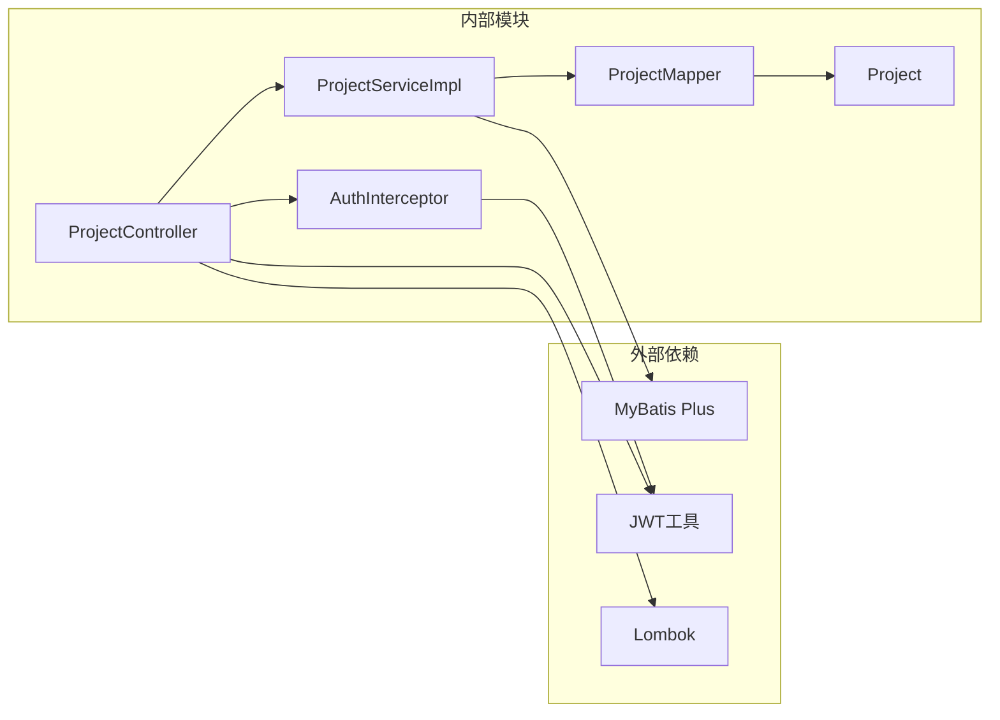

# 项目管理接口

<cite>
**本文档引用的文件**
- [ProjectController.java](file://backend/src/main/java/com/newworld/controller/ProjectController.java)
- [Project.java](file://backend/src/main/java/com/newworld/entity/Project.java)
- [ProjectServiceImpl.java](file://backend/src/main/java/com/newworld/service/impl/ProjectServiceImpl.java)
- [ProjectMapper.java](file://backend/src/main/java/com/newworld/mapper/ProjectMapper.java)
- [ProjectService.java](file://backend/src/main/java/com/newworld/service/ProjectService.java)
- [Result.java](file://backend/src/main/java/com/newworld/common/Result.java)
- [PageResult.java](file://backend/src/main/java/com/newworld/common/PageResult.java)
- [BusinessException.java](file://backend/src/main/java/com/newworld/common/exception/BusinessException.java)
- [AuthInterceptor.java](file://backend/src/main/java/com/newworld/config/AuthInterceptor.java)
- [Group.java](file://backend/src/main/java/com/newworld/entity/Group.java)
- [init.sql](file://backend/sql/init.sql)
- [project.js](file://frontend/src/api/project.js)
- [project.js](file://frontend/src/stores/project.js)
</cite>

## 目录
1. [简介](#简介)
2. [项目结构](#项目结构)
3. [核心组件](#核心组件)
4. [架构概览](#架构概览)
5. [详细组件分析](#详细组件分析)
6. [依赖关系分析](#依赖关系分析)
7. [性能考虑](#性能考虑)
8. [故障排除指南](#故障排除指南)
9. [结论](#结论)

## 简介

项目管理接口是NewWorld个人工作计划管理工具的核心功能模块，提供完整的项目CRUD操作能力。该系统采用Spring Boot + MyBatis Plus技术栈构建，支持基于分组的项目管理和权限控制机制。

## 项目结构

项目采用标准的MVC架构模式，主要分为以下层次：



**图表来源**
- [ProjectController.java:1-51](file://backend/src/main/java/com/newworld/controller/ProjectController.java#L1-L51)
- [ProjectServiceImpl.java:1-60](file://backend/src/main/java/com/newworld/service/impl/ProjectServiceImpl.java#L1-L60)
- [ProjectMapper.java:1-10](file://backend/src/main/java/com/newworld/mapper/ProjectMapper.java#L1-L10)

**章节来源**
- [ProjectController.java:1-51](file://backend/src/main/java/com/newworld/controller/ProjectController.java#L1-L51)
- [ProjectService.java:1-29](file://backend/src/main/java/com/newworld/service/ProjectService.java#L1-L29)

## 核心组件

### 项目实体模型

项目实体包含以下核心字段：

| 字段名 | 类型 | 必填 | 默认值 | 描述 |
|--------|------|------|--------|------|
| id | Long | 否 | - | 项目ID（自增主键） |
| userId | Long | 是 | - | 用户ID（外键） |
| groupId | Long | 是 | - | 分组ID（外键） |
| name | String | 是 | - | 项目名称（最大100字符） |
| color | String | 否 | #409EFF | 项目颜色（CSS颜色值） |
| description | String | 否 | - | 项目描述（最大500字符） |
| sortOrder | Integer | 否 | 0 | 排序号 |
| createTime | LocalDateTime | 否 | 当前时间 | 创建时间 |
| updateTime | LocalDateTime | 否 | 当前时间 | 更新时间 |

### 权限控制机制

系统通过JWT令牌进行身份认证和授权：
- 所有接口都需要有效的Authorization头
- 使用Bearer Token格式
- 通过AuthInterceptor拦截器验证令牌有效性
- 当前线程安全地存储用户信息

**章节来源**
- [Project.java:1-117](file://backend/src/main/java/com/newworld/entity/Project.java#L1-L117)
- [AuthInterceptor.java:1-78](file://backend/src/main/java/com/newworld/config/AuthInterceptor.java#L1-L78)

## 架构概览



**图表来源**
- [ProjectController.java:22-27](file://backend/src/main/java/com/newworld/controller/ProjectController.java#L22-L27)
- [ProjectServiceImpl.java:24-31](file://backend/src/main/java/com/newworld/service/impl/ProjectServiceImpl.java#L24-L31)

## 详细组件分析

### 控制器层

项目控制器提供四个核心REST接口：

#### GET /api/projects
**功能**：按分组获取项目列表
**参数**：
- groupId: Long（可选）- 分组ID
- Authorization: String（必需）- JWT令牌

**响应**：
```json
{
  "code": 200,
  "msg": "操作成功",
  "data": [
    {
      "id": 1,
      "userId": 1,
      "groupId": 1,
      "name": "项目名称",
      "color": "#409EFF",
      "description": "项目描述",
      "sortOrder": 0,
      "createTime": "2024-01-01T00:00:00",
      "updateTime": "2024-01-01T00:00:00"
    }
  ]
}
```

#### POST /api/projects
**功能**：创建新项目
**请求体**：
```json
{
  "groupId": 1,
  "name": "新项目",
  "color": "#409EFF",
  "description": "项目描述",
  "sortOrder": 0
}
```

**响应**：成功创建的项目对象

#### PUT /api/projects/{id}
**功能**：更新现有项目
**路径参数**：
- id: Long - 项目ID

**请求体**：项目更新数据（不包含ID字段）

**响应**：更新后的项目对象

#### DELETE /api/projects/{id}
**功能**：删除项目
**路径参数**：
- id: Long - 项目ID

**约束条件**：
- 项目下必须没有关联的任务才能删除
- 删除时会检查任务数量

**章节来源**
- [ProjectController.java:14-50](file://backend/src/main/java/com/newworld/controller/ProjectController.java#L14-L50)

### 服务层实现



**图表来源**
- [ProjectService.java:7-28](file://backend/src/main/java/com/newworld/service/ProjectService.java#L7-L28)
- [ProjectServiceImpl.java:15-59](file://backend/src/main/java/com/newworld/service/impl/ProjectServiceImpl.java#L15-L59)
- [ProjectMapper.java:7-9](file://backend/src/main/java/com/newworld/mapper/ProjectMapper.java#L7-L9)

**章节来源**
- [ProjectServiceImpl.java:15-59](file://backend/src/main/java/com/newworld/service/impl/ProjectServiceImpl.java#L15-L59)

### 数据访问层

项目映射器继承MyBatis Plus的BaseMapper，自动提供基本的CRUD操作：
- 自动SQL生成
- 条件构造器支持
- 乐观锁支持
- 逻辑删除支持

**章节来源**
- [ProjectMapper.java:1-10](file://backend/src/main/java/com/newworld/mapper/ProjectMapper.java#L1-L10)

### 错误处理机制

系统采用统一的异常处理机制：



**图表来源**
- [AuthInterceptor.java:30-58](file://backend/src/main/java/com/newworld/config/AuthInterceptor.java#L30-L58)
- [BusinessException.java:6-23](file://backend/src/main/java/com/newworld/common/exception/BusinessException.java#L6-L23)

**章节来源**
- [BusinessException.java:1-24](file://backend/src/main/java/com/newworld/common/exception/BusinessException.java#L1-L24)

## 依赖关系分析



**图表来源**
- [ProjectController.java:3-10](file://backend/src/main/java/com/newworld/controller/ProjectController.java#L3-L10)
- [ProjectServiceImpl.java:3-11](file://backend/src/main/java/com/newworld/service/impl/ProjectServiceImpl.java#L3-L11)

**章节来源**
- [ProjectController.java:1-51](file://backend/src/main/java/com/newworld/controller/ProjectController.java#L1-L51)
- [ProjectServiceImpl.java:1-60](file://backend/src/main/java/com/newworld/service/impl/ProjectServiceImpl.java#L1-L60)

## 性能考虑

### 数据库优化
- 项目表包含必要的索引以支持常用查询
- 外键约束确保数据完整性
- 排序字段支持快速排序操作

### 缓存策略
- 可在服务层添加缓存机制
- 对频繁访问的项目列表进行缓存
- 设置合理的缓存失效策略

### 并发控制
- 使用ThreadLocal存储当前用户信息
- 线程安全的JWT令牌解析
- 乐观锁支持防止并发修改冲突

## 故障排除指南

### 常见错误及解决方案

| 错误类型 | HTTP状态码 | 错误原因 | 解决方案 |
|----------|------------|----------|----------|
| 未登录 | 401 | Authorization头缺失或无效 | 检查JWT令牌格式和有效期 |
| 权限不足 | 403 | 用户无权访问目标资源 | 确认用户身份和资源归属 |
| 参数错误 | 400 | 请求参数格式不正确 | 检查请求体JSON格式 |
| 业务异常 | 500 | 业务逻辑错误 | 查看具体错误信息 |

### 调试建议
1. 检查JWT令牌的有效性和格式
2. 验证用户ID与项目ID的对应关系
3. 确认分组权限设置
4. 查看数据库连接状态

**章节来源**
- [AuthInterceptor.java:37-49](file://backend/src/main/java/com/newworld/config/AuthInterceptor.java#L37-L49)
- [BusinessException.java:10-18](file://backend/src/main/java/com/newworld/common/exception/BusinessException.java#L10-L18)

## 结论

项目管理接口提供了完整的CRUD操作能力，具有以下特点：

1. **安全性**：基于JWT的认证机制确保数据安全
2. **完整性**：通过外键约束和业务规则保证数据一致性
3. **扩展性**：清晰的分层架构便于功能扩展
4. **易用性**：统一的响应格式和错误处理机制

该接口设计符合RESTful规范，能够满足个人工作计划管理工具的核心需求，并为后续功能扩展奠定了良好的基础。