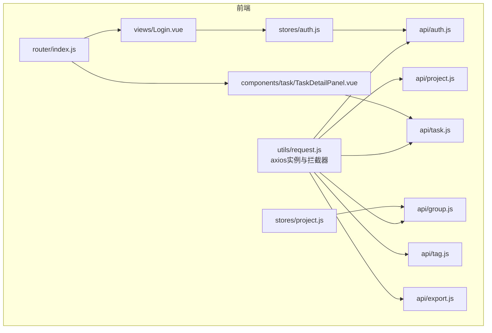
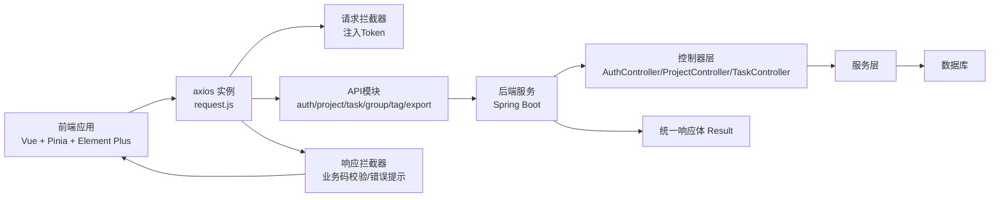
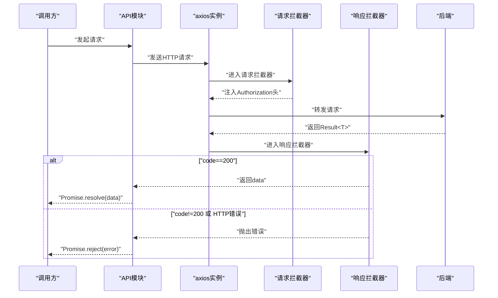
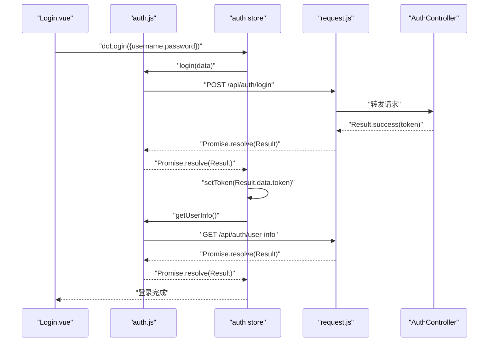
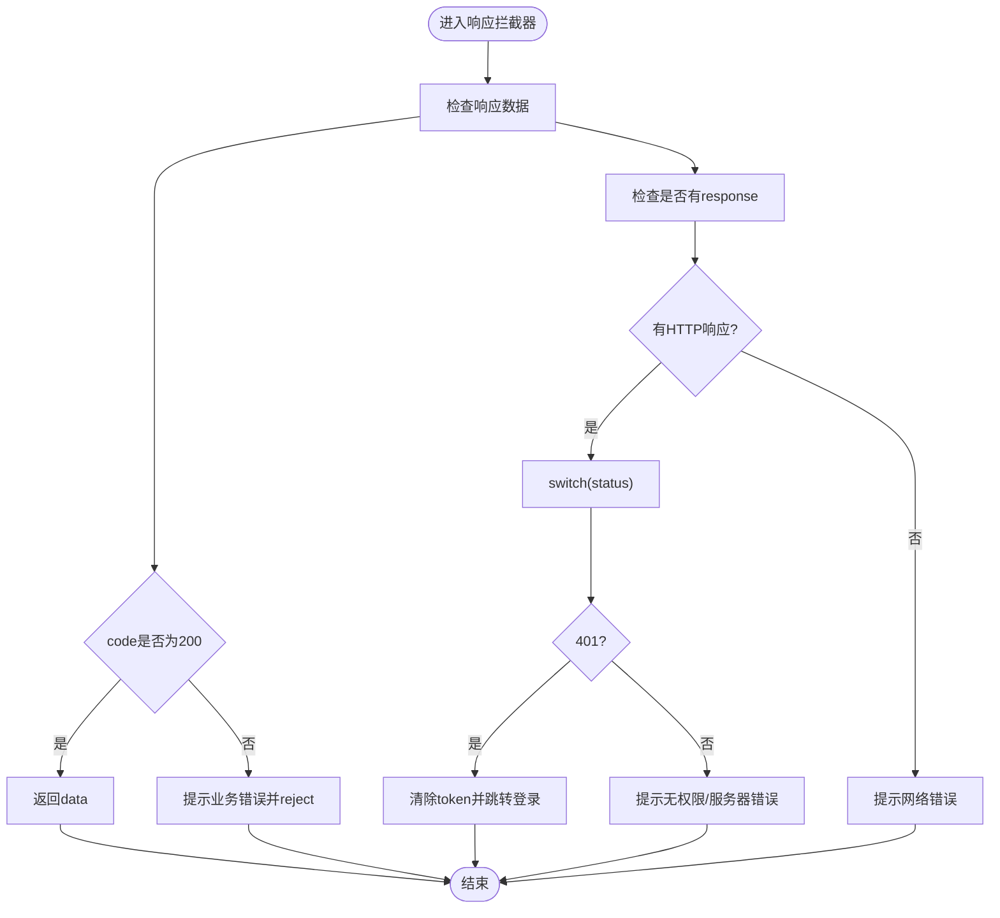
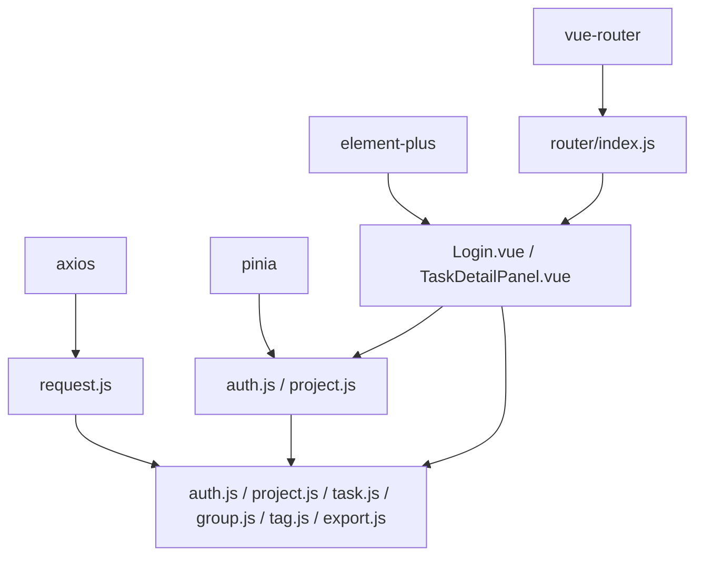

# API集成

<cite>
**本文引用的文件**
- [frontend/src/utils/request.js](file://frontend/src/utils/request.js)
- [frontend/src/api/auth.js](file://frontend/src/api/auth.js)
- [frontend/src/api/project.js](file://frontend/src/api/project.js)
- [frontend/src/api/task.js](file://frontend/src/api/task.js)
- [frontend/src/api/group.js](file://frontend/src/api/group.js)
- [frontend/src/api/tag.js](file://frontend/src/api/tag.js)
- [frontend/src/api/export.js](file://frontend/src/api/export.js)
- [frontend/src/stores/auth.js](file://frontend/src/stores/auth.js)
- [frontend/src/stores/project.js](file://frontend/src/stores/project.js)
- [frontend/src/views/Login.vue](file://frontend/src/views/Login.vue)
- [frontend/src/components/task/TaskDetailPanel.vue](file://frontend/src/components/task/TaskDetailPanel.vue)
- [frontend/src/router/index.js](file://frontend/src/router/index.js)
- [frontend/package.json](file://frontend/package.json)
- [backend/src/main/java/com/newworld/common/Result.java](file://backend/src/main/java/com/newworld/common/Result.java)
- [backend/src/main/java/com/newworld/controller/AuthController.java](file://backend/src/main/java/com/newworld/controller/AuthController.java)
- [backend/src/main/java/com/newworld/controller/ProjectController.java](file://backend/src/main/java/com/newworld/controller/ProjectController.java)
- [backend/src/main/java/com/newworld/controller/TaskController.java](file://backend/src/main/java/com/newworld/controller/TaskController.java)
</cite>

## 目录
1. [简介](#简介)
2. [项目结构](#项目结构)
3. [核心组件](#核心组件)
4. [架构总览](#架构总览)
5. [详细组件分析](#详细组件分析)
6. [依赖关系分析](#依赖关系分析)
7. [性能考虑](#性能考虑)
8. [故障排查指南](#故障排查指南)
9. [结论](#结论)
10. [附录](#附录)

## 简介
本指南面向前后端API集成场景，聚焦于前端对后端REST接口的封装与调用，涵盖以下主题：
- HTTP请求封装：基于 axios 的实例化、请求/响应拦截器、统一错误处理
- API模块设计：auth、project、task、group、tag、export 等模块的接口定义、参数传递与返回值处理
- 错误处理机制：网络错误、业务错误、状态码处理的统一方案
- 数据转换与验证：请求数据格式化、响应数据解析、类型检查
- 最佳实践：请求去重、超时处理、重试机制、缓存策略
- 对接流程：接口文档使用、联调测试、版本兼容性处理

## 项目结构
前端采用“工具层 + 模块层 + 状态层 + 视图层”的分层组织：
- 工具层：通用请求封装 request.js
- 模块层：各业务API模块（auth、project、task、group、tag、export）
- 状态层：Pinia Store（auth、project）
- 视图层：页面组件与交互逻辑（Login.vue、TaskDetailPanel.vue）
- 路由层：路由守卫与鉴权控制

图表来源
- [frontend/src/utils/request.js:1-56](file://frontend/src/utils/request.js#L1-L56)
- [frontend/src/api/auth.js:1-14](file://frontend/src/api/auth.js#L1-L14)
- [frontend/src/api/project.js:1-18](file://frontend/src/api/project.js#L1-L18)
- [frontend/src/api/task.js:1-54](file://frontend/src/api/task.js#L1-L54)
- [frontend/src/api/group.js:1-22](file://frontend/src/api/group.js#L1-L22)
- [frontend/src/api/tag.js:1-14](file://frontend/src/api/tag.js#L1-L14)
- [frontend/src/api/export.js:1-6](file://frontend/src/api/export.js#L1-L6)
- [frontend/src/stores/auth.js:1-41](file://frontend/src/stores/auth.js#L1-L41)
- [frontend/src/stores/project.js:1-26](file://frontend/src/stores/project.js#L1-L26)
- [frontend/src/views/Login.vue:1-203](file://frontend/src/views/Login.vue#L1-L203)
- [frontend/src/components/task/TaskDetailPanel.vue:1-169](file://frontend/src/components/task/TaskDetailPanel.vue#L1-L169)
- [frontend/src/router/index.js:1-50](file://frontend/src/router/index.js#L1-L50)

章节来源
- [frontend/src/utils/request.js:1-56](file://frontend/src/utils/request.js#L1-L56)
- [frontend/src/router/index.js:1-50](file://frontend/src/router/index.js#L1-L50)

## 核心组件
- axios实例与拦截器
  - 实例化：设置基础路径与超时
  - 请求拦截器：自动注入 Authorization 头（Bearer Token）
  - 响应拦截器：统一校验业务状态码、处理网络错误与HTTP状态码
- API模块
  - auth：登录、注册、获取用户信息
  - project：按分组查询、创建、更新、删除项目
  - task：列表、详情、创建、更新、删除、状态/优先级变更、复制、归档、转笔记、分享链接、搜索、统计
  - group：树形结构查询、增删改
  - tag：标签列表、创建、删除
  - export：导出任务为二进制流
- 状态管理
  - auth store：维护 token、用户信息、登录/注册/登出流程
  - project store：维护树形数据、选中项
- 视图与路由
  - 登录页：表单校验、提交、消息反馈
  - 任务详情面板：打开/关闭、编辑/删除、消息提示
  - 路由守卫：未登录跳转登录、已登录禁止重复进入登录页

章节来源
- [frontend/src/utils/request.js:1-56](file://frontend/src/utils/request.js#L1-L56)
- [frontend/src/api/auth.js:1-14](file://frontend/src/api/auth.js#L1-L14)
- [frontend/src/api/project.js:1-18](file://frontend/src/api/project.js#L1-L18)
- [frontend/src/api/task.js:1-54](file://frontend/src/api/task.js#L1-L54)
- [frontend/src/api/group.js:1-22](file://frontend/src/api/group.js#L1-L22)
- [frontend/src/api/tag.js:1-14](file://frontend/src/api/tag.js#L1-L14)
- [frontend/src/api/export.js:1-6](file://frontend/src/api/export.js#L1-L6)
- [frontend/src/stores/auth.js:1-41](file://frontend/src/stores/auth.js#L1-L41)
- [frontend/src/stores/project.js:1-26](file://frontend/src/stores/project.js#L1-L26)
- [frontend/src/views/Login.vue:1-203](file://frontend/src/views/Login.vue#L1-L203)
- [frontend/src/components/task/TaskDetailPanel.vue:1-169](file://frontend/src/components/task/TaskDetailPanel.vue#L1-L169)
- [frontend/src/router/index.js:1-50](file://frontend/src/router/index.js#L1-L50)

## 架构总览
前后端通过统一响应体 Result<T> 进行数据交换，前端拦截器统一处理业务状态与HTTP状态。

图表来源
- [frontend/src/utils/request.js:1-56](file://frontend/src/utils/request.js#L1-L56)
- [backend/src/main/java/com/newworld/common/Result.java:1-90](file://backend/src/main/java/com/newworld/common/Result.java#L1-L90)
- [backend/src/main/java/com/newworld/controller/AuthController.java:1-55](file://backend/src/main/java/com/newworld/controller/AuthController.java#L1-L55)
- [backend/src/main/java/com/newworld/controller/ProjectController.java:1-51](file://backend/src/main/java/com/newworld/controller/ProjectController.java#L1-L51)
- [backend/src/main/java/com/newworld/controller/TaskController.java:1-112](file://backend/src/main/java/com/newworld/controller/TaskController.java#L1-L112)

## 详细组件分析

### HTTP请求封装与拦截器
- 实例化配置
  - 基础路径：/api
  - 超时：30秒
- 请求拦截器
  - 从本地存储读取 token，并在请求头添加 Authorization: Bearer
- 响应拦截器
  - 业务层：校验后端返回的 code 字段，非200时统一弹窗提示并抛出异常
  - 网络层：根据HTTP状态码分类处理（401清空token并跳转登录、403无权限、500服务器错误等），否则提示网络错误

图表来源
- [frontend/src/utils/request.js:1-56](file://frontend/src/utils/request.js#L1-L56)
- [backend/src/main/java/com/newworld/common/Result.java:1-90](file://backend/src/main/java/com/newworld/common/Result.java#L1-L90)

章节来源
- [frontend/src/utils/request.js:1-56](file://frontend/src/utils/request.js#L1-L56)
- [backend/src/main/java/com/newworld/common/Result.java:1-90](file://backend/src/main/java/com/newworld/common/Result.java#L1-L90)

### API模块设计与调用

#### 认证模块（auth）
- 接口定义
  - POST /api/auth/login：登录，返回包含 token 的数据
  - POST /api/auth/register：注册
  - GET /api/auth/user-info：获取当前用户信息
- 参数与返回
  - 参数：JSON对象（如用户名、密码）
  - 返回：Result<T>，前端拦截器统一处理
- 使用示例
  - 登录页通过 Pinia store 调用登录接口，成功后保存 token 并拉取用户信息

图表来源
- [frontend/src/views/Login.vue:125-157](file://frontend/src/views/Login.vue#L125-L157)
- [frontend/src/stores/auth.js:16-31](file://frontend/src/stores/auth.js#L16-L31)
- [frontend/src/api/auth.js:1-14](file://frontend/src/api/auth.js#L1-L14)
- [frontend/src/utils/request.js:1-56](file://frontend/src/utils/request.js#L1-L56)
- [backend/src/main/java/com/newworld/controller/AuthController.java:25-47](file://backend/src/main/java/com/newworld/controller/AuthController.java#L25-L47)

章节来源
- [frontend/src/api/auth.js:1-14](file://frontend/src/api/auth.js#L1-L14)
- [frontend/src/stores/auth.js:1-41](file://frontend/src/stores/auth.js#L1-L41)
- [frontend/src/views/Login.vue:1-203](file://frontend/src/views/Login.vue#L1-L203)
- [backend/src/main/java/com/newworld/controller/AuthController.java:1-55](file://backend/src/main/java/com/newworld/controller/AuthController.java#L1-L55)

#### 项目模块（project）
- 接口定义
  - GET /api/projects?groupId=...：按分组查询项目列表
  - POST /api/projects：创建项目
  - PUT /api/projects/{id}：更新项目
  - DELETE /api/projects/{id}：删除项目
- 参数与返回
  - 查询：params 传入 groupId
  - 创建/更新：Body 传入 Project 对象
  - 返回：Result<List<Project>> 或 Result<Project>

章节来源
- [frontend/src/api/project.js:1-18](file://frontend/src/api/project.js#L1-L18)
- [backend/src/main/java/com/newworld/controller/ProjectController.java:1-51](file://backend/src/main/java/com/newworld/controller/ProjectController.java#L1-L51)

#### 任务模块（task）
- 接口定义
  - GET /api/tasks：查询任务列表（支持分页/筛选参数）
  - GET /api/tasks/{id}：获取单个任务
  - POST /api/tasks：创建任务
  - PUT /api/tasks/{id}：更新任务
  - DELETE /api/tasks/{id}：删除任务
  - PUT /api/tasks/{id}/status：更新状态
  - PUT /api/tasks/{id}/priority：设置优先级
  - PUT /api/tasks/{id}/duplicate：复制任务
  - PUT /api/tasks/{id}/archive：归档任务
  - PUT /api/tasks/{id}/convert-note：转为笔记
  - GET /api/tasks/{id}/share-link：生成分享链接
  - GET /api/tasks/search?keyword=...：搜索任务
  - GET /api/tasks/statistics：任务统计
- 参数与返回
  - 列表/详情/搜索：params 或 pathVariable
  - 状态/优先级：Body 传入 { status/priority }
  - 统计：返回 Result<TaskStatisticsVO>
  - 分享链接：返回 Result<Map<String,String>>

章节来源
- [frontend/src/api/task.js:1-54](file://frontend/src/api/task.js#L1-L54)
- [backend/src/main/java/com/newworld/controller/TaskController.java:1-112](file://backend/src/main/java/com/newworld/controller/TaskController.java#L1-L112)

#### 分组与标签模块（group/tag）
- 分组（group）
  - GET /api/groups：获取分组列表
  - GET /api/groups/tree?projectId=...：获取树形结构
  - POST/PUT/DELETE：同REST风格
- 标签（tag）
  - GET /api/tags：标签列表
  - POST /api/tags：创建
  - DELETE /api/tags/{id}：删除

章节来源
- [frontend/src/api/group.js:1-22](file://frontend/src/api/group.js#L1-L22)
- [frontend/src/api/tag.js:1-14](file://frontend/src/api/tag.js#L1-L14)

#### 导出模块（export）
- 接口定义
  - GET /api/export/tasks：导出任务为二进制流
- 参数与返回
  - params：导出条件
  - responseType: 'blob'

章节来源
- [frontend/src/api/export.js:1-6](file://frontend/src/api/export.js#L1-L6)

### 错误处理机制
- 业务错误
  - 后端 Result.code 非200：拦截器统一提示 msg 并 reject
- 网络错误
  - 有 error.response：按HTTP状态码分类处理（401清空token并跳转登录、403无权限、500服务器错误等）
  - 无 error.response：提示网络错误
- 前端UI反馈
  - 登录页与任务详情面板使用 Element Plus 提示与确认框

图表来源
- [frontend/src/utils/request.js:21-53](file://frontend/src/utils/request.js#L21-L53)

章节来源
- [frontend/src/utils/request.js:1-56](file://frontend/src/utils/request.js#L1-L56)
- [frontend/src/views/Login.vue:125-157](file://frontend/src/views/Login.vue#L125-L157)
- [frontend/src/components/task/TaskDetailPanel.vue:95-100](file://frontend/src/components/task/TaskDetailPanel.vue#L95-L100)

### 数据转换与验证
- 请求数据格式化
  - axios 默认以 JSON 发送；如需 FormData，可在调用处自行构造并设置 Content-Type
- 响应数据解析
  - 拦截器统一返回 response.data，前端按 Result<T> 结构读取 data
- 类型检查与校验
  - 登录页使用 Element Plus 表单规则进行字段长度与一致性校验
  - 建议在调用前对参数进行轻量校验（如必填、范围）

章节来源
- [frontend/src/views/Login.vue:88-117](file://frontend/src/views/Login.vue#L88-L117)

### API调用最佳实践
- 请求去重
  - 在调用层引入请求去重策略（如基于URL+参数的缓存键），避免重复请求
- 超时处理
  - axios 已设置全局超时；对长耗时接口可考虑单独配置或在调用层增加超时包装
- 重试机制
  - 对幂等请求（GET/DELETE）可加入指数退避重试；对非幂等请求谨慎重试
- 缓存策略
  - 列表类接口可采用内存缓存或LRU缓存，结合“失效/刷新”策略
- 错误恢复
  - 401时统一清理本地token并跳转登录；403提示无权限；网络错误提示用户检查网络

章节来源
- [frontend/src/utils/request.js:4-7](file://frontend/src/utils/request.js#L4-L7)
- [frontend/src/router/index.js:38-47](file://frontend/src/router/index.js#L38-L47)

### 与后端接口对接流程
- 接口文档
  - 后端使用 Swagger/OpenAPI 注解标注接口语义与参数，前端据此编写API模块
- 联调测试
  - 前端通过 /api 前缀代理到后端，确保拦截器生效
  - 登录成功后携带 token 访问受保护接口
- 版本兼容性
  - 建议后端以 /api/v1、/api/v2 等路径区分版本，前端统一切换 baseURL
  - 若后端返回字段调整，前端需在拦截器或DTO层做兼容映射

章节来源
- [backend/src/main/java/com/newworld/controller/AuthController.java:1-55](file://backend/src/main/java/com/newworld/controller/AuthController.java#L1-L55)
- [backend/src/main/java/com/newworld/controller/ProjectController.java:1-51](file://backend/src/main/java/com/newworld/controller/ProjectController.java#L1-L51)
- [backend/src/main/java/com/newworld/controller/TaskController.java:1-112](file://backend/src/main/java/com/newworld/controller/TaskController.java#L1-L112)
- [frontend/src/utils/request.js:5-6](file://frontend/src/utils/request.js#L5-L6)

## 依赖关系分析
- 前端依赖
  - axios：HTTP客户端
  - element-plus：UI与消息提示
  - pinia：状态管理
  - vue、vue-router：框架与路由
- 模块间耦合
  - API模块仅依赖 request.js，低耦合
  - Store通过API模块间接依赖 request.js
  - 视图组件通过 Store/API模块间接依赖 request.js

图表来源
- [frontend/package.json:11-24](file://frontend/package.json#L11-L24)
- [frontend/src/utils/request.js:1-56](file://frontend/src/utils/request.js#L1-L56)
- [frontend/src/api/auth.js:1-14](file://frontend/src/api/auth.js#L1-L14)
- [frontend/src/api/project.js:1-18](file://frontend/src/api/project.js#L1-L18)
- [frontend/src/api/task.js:1-54](file://frontend/src/api/task.js#L1-L54)
- [frontend/src/api/group.js:1-22](file://frontend/src/api/group.js#L1-L22)
- [frontend/src/api/tag.js:1-14](file://frontend/src/api/tag.js#L1-L14)
- [frontend/src/api/export.js:1-6](file://frontend/src/api/export.js#L1-L6)
- [frontend/src/stores/auth.js:1-41](file://frontend/src/stores/auth.js#L1-L41)
- [frontend/src/stores/project.js:1-26](file://frontend/src/stores/project.js#L1-L26)
- [frontend/src/views/Login.vue:1-203](file://frontend/src/views/Login.vue#L1-L203)
- [frontend/src/components/task/TaskDetailPanel.vue:1-169](file://frontend/src/components/task/TaskDetailPanel.vue#L1-L169)
- [frontend/src/router/index.js:1-50](file://frontend/src/router/index.js#L1-L50)

章节来源
- [frontend/package.json:1-30](file://frontend/package.json#L1-L30)

## 性能考虑
- 减少不必要的请求：合并请求、批量加载、延迟加载
- 合理使用缓存：列表数据缓存、详情数据短期缓存
- 控制并发：限制同时进行的请求数量，避免阻塞
- 优化渲染：虚拟滚动、懒加载组件
- 资源压缩：构建时启用Gzip/Brotli

## 故障排查指南
- 登录后仍被重定向到登录页
  - 检查路由守卫是否正确读取 localStorage 中的 token
  - 确认后端是否正确颁发 token
- 401错误频繁出现
  - 检查请求拦截器是否正确注入 Authorization 头
  - 确认后端JWT过期策略与前端token持久化
- 业务错误提示不准确
  - 检查后端 Result.msg 是否正确设置
  - 确认前端拦截器是否正确读取并展示 msg
- 网络错误
  - 检查代理配置与跨域设置
  - 确认后端服务可用性与防火墙策略

章节来源
- [frontend/src/router/index.js:38-47](file://frontend/src/router/index.js#L38-L47)
- [frontend/src/utils/request.js:32-51](file://frontend/src/utils/request.js#L32-L51)
- [backend/src/main/java/com/newworld/common/Result.java:52-64](file://backend/src/main/java/com/newworld/common/Result.java#L52-L64)

## 结论
本项目通过统一的 axios 实例与拦截器，实现了前后端一致的错误处理与鉴权机制；API模块清晰地按业务划分，配合 Pinia Store 与路由守卫，形成了可维护、可扩展的前端API集成方案。建议在现有基础上进一步完善请求去重、缓存与重试策略，并在联调阶段严格遵循接口文档，确保版本演进的稳定性。

## 附录
- 关键文件清单
  - 请求封装：frontend/src/utils/request.js
  - 认证API：frontend/src/api/auth.js
  - 项目API：frontend/src/api/project.js
  - 任务API：frontend/src/api/task.js
  - 分组API：frontend/src/api/group.js
  - 标签API：frontend/src/api/tag.js
  - 导出API：frontend/src/api/export.js
  - 认证状态：frontend/src/stores/auth.js
  - 项目状态：frontend/src/stores/project.js
  - 登录视图：frontend/src/views/Login.vue
  - 任务详情面板：frontend/src/components/task/TaskDetailPanel.vue
  - 路由配置：frontend/src/router/index.js
  - 依赖声明：frontend/package.json
  - 统一响应体：backend/src/main/java/com/newworld/common/Result.java
  - 认证控制器：backend/src/main/java/com/newworld/controller/AuthController.java
  - 项目控制器：backend/src/main/java/com/newworld/controller/ProjectController.java
  - 任务控制器：backend/src/main/java/com/newworld/controller/TaskController.java