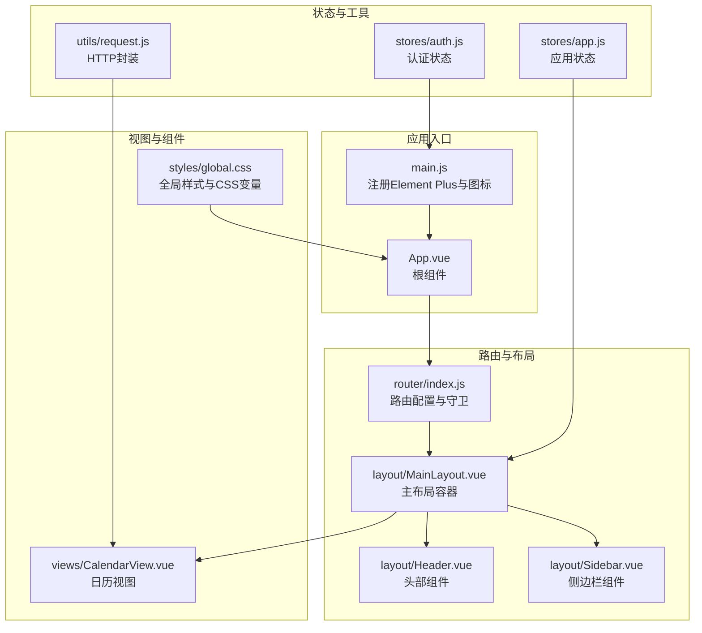
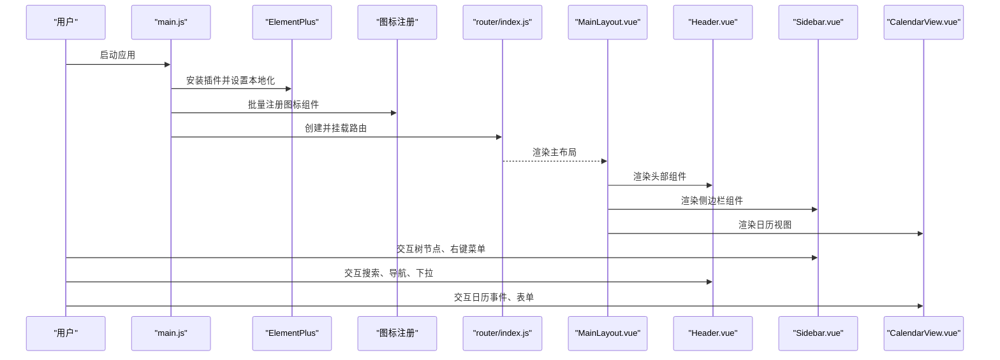
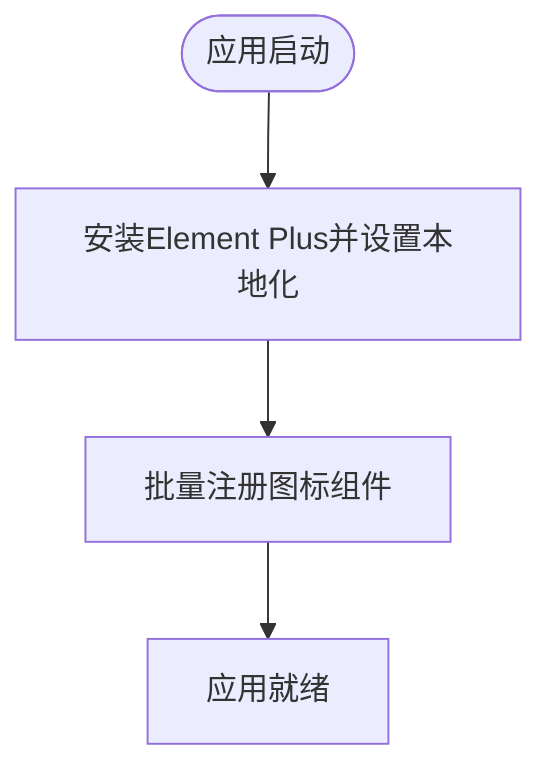
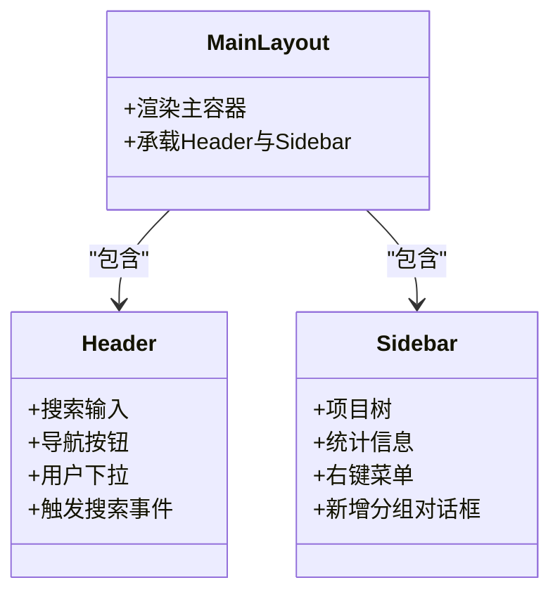
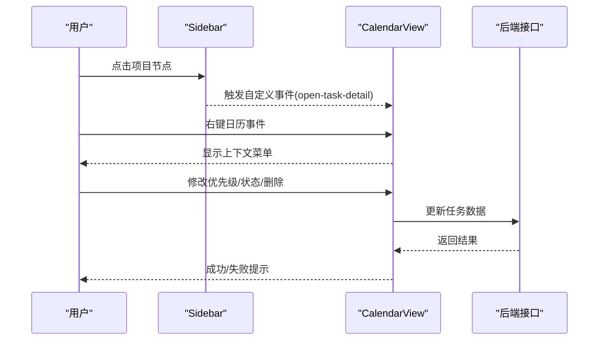
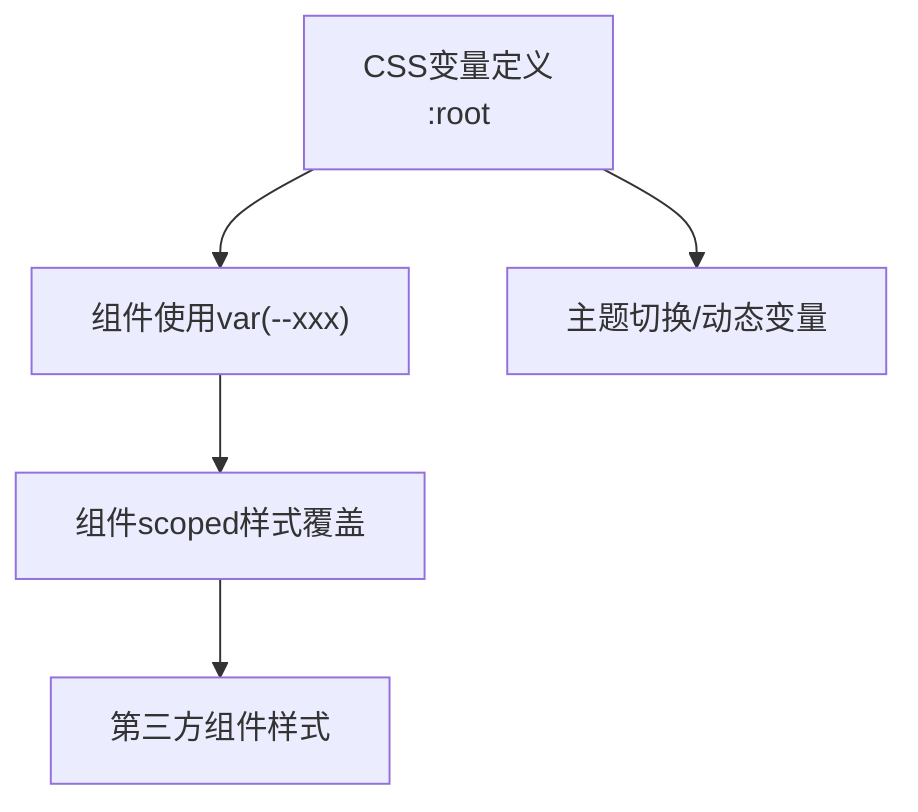
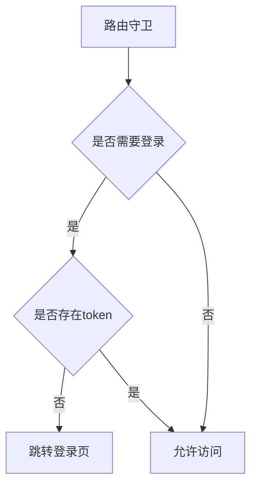
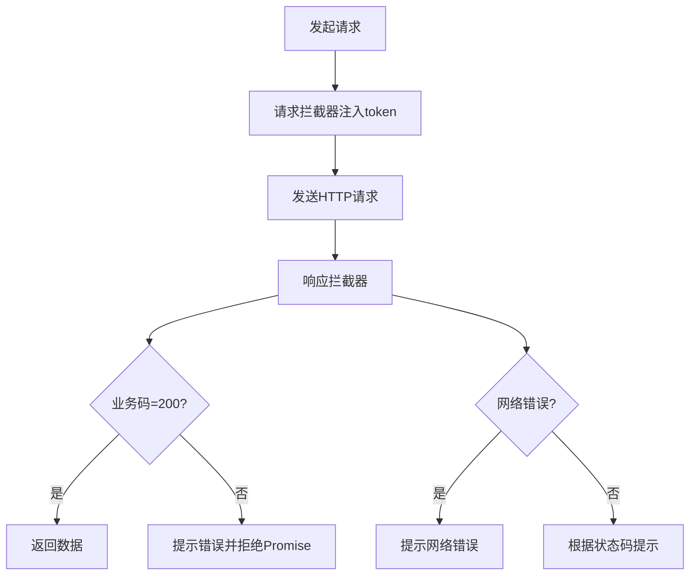
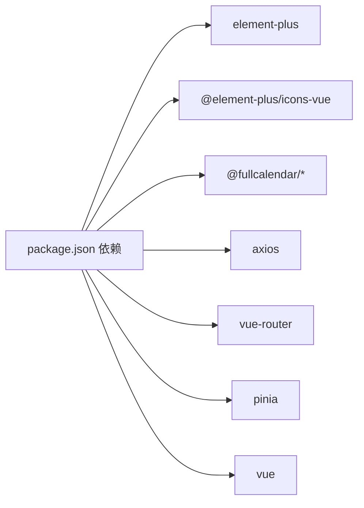

# UI组件库

<cite>
**本文引用的文件**
- [package.json](file://frontend/package.json)
- [vite.config.js](file://frontend/vite.config.js)
- [main.js](file://frontend/src/main.js)
- [App.vue](file://frontend/src/App.vue)
- [global.css](file://frontend/src/styles/global.css)
- [Header.vue](file://frontend/src/layout/Header.vue)
- [MainLayout.vue](file://frontend/src/layout/MainLayout.vue)
- [Sidebar.vue](file://frontend/src/layout/Sidebar.vue)
- [CalendarView.vue](file://frontend/src/views/CalendarView.vue)
- [index.js](file://frontend/src/router/index.js)
- [request.js](file://frontend/src/utils/request.js)
- [app.js](file://frontend/src/stores/app.js)
- [auth.js](file://frontend/src/stores/auth.js)
</cite>

## 目录
1. [简介](#简介)
2. [项目结构](#项目结构)
3. [核心组件](#核心组件)
4. [架构总览](#架构总览)
5. [详细组件分析](#详细组件分析)
6. [依赖分析](#依赖分析)
7. [性能考虑](#性能考虑)
8. [故障排查指南](#故障排查指南)
9. [结论](#结论)
10. [附录](#附录)

## 简介
本指南围绕前端UI组件库（以Element Plus为核心）在本项目的集成与配置展开，涵盖按需引入、主题与国际化、样式系统管理（CSS变量、覆盖策略、响应式）、可访问性设计（键盘导航、屏幕阅读器支持、色彩对比度）、最佳实践（组件复用、样式隔离、动画与交互反馈），以及与第三方UI库的集成策略（组件替换、样式冲突解决、功能扩展）。同时结合项目中的布局、日历视图、图标注册、路由与状态管理等模块，给出可操作的实施建议。

## 项目结构
前端采用Vue 3 + Vite + Pinia + Vue Router技术栈，Element Plus作为主要UI库，配合FullCalendar实现日历能力。全局样式通过CSS变量集中管理，组件间通过事件总线与Pinia共享状态。

**图表来源**
- [main.js:1-22](file://frontend/src/main.js#L1-L22)
- [App.vue:1-16](file://frontend/src/App.vue#L1-L16)
- [index.js:1-50](file://frontend/src/router/index.js#L1-L50)
- [MainLayout.vue:1-39](file://frontend/src/layout/MainLayout.vue#L1-L39)
- [Header.vue:1-87](file://frontend/src/layout/Header.vue#L1-L87)
- [Sidebar.vue:1-250](file://frontend/src/layout/Sidebar.vue#L1-L250)
- [CalendarView.vue:1-451](file://frontend/src/views/CalendarView.vue#L1-L451)
- [global.css:1-167](file://frontend/src/styles/global.css#L1-L167)
- [app.js:1-18](file://frontend/src/stores/app.js#L1-L18)
- [auth.js:1-41](file://frontend/src/stores/auth.js#L1-L41)
- [request.js:1-56](file://frontend/src/utils/request.js#L1-L56)

**章节来源**
- [main.js:1-22](file://frontend/src/main.js#L1-L22)
- [App.vue:1-16](file://frontend/src/App.vue#L1-L16)
- [index.js:1-50](file://frontend/src/router/index.js#L1-L50)
- [global.css:1-167](file://frontend/src/styles/global.css#L1-L167)

## 核心组件
- Element Plus集成：在应用入口完成Element Plus安装、本地化语言配置与图标批量注册，确保全站统一风格与一致的交互体验。
- 布局组件：MainLayout负责整体布局，Header提供搜索、导航与用户信息，Sidebar提供项目树、统计与上下文菜单。
- 视图组件：CalendarView集成FullCalendar，提供拖拽、调整大小、右键菜单、任务表单等能力，并通过事件总线与侧边栏联动。
- 全局样式：通过CSS变量集中管理主题色、间距、字体与组件样式，便于主题定制与一致性维护。
- 状态管理：Pinia Store管理应用状态（如侧边栏折叠）与认证状态（token、用户信息）。
- 工具层：HTTP封装统一注入Token、错误处理与消息提示，提升开发效率与用户体验。

**章节来源**
- [main.js:1-22](file://frontend/src/main.js#L1-L22)
- [Header.vue:1-87](file://frontend/src/layout/Header.vue#L1-L87)
- [Sidebar.vue:1-250](file://frontend/src/layout/Sidebar.vue#L1-L250)
- [CalendarView.vue:1-451](file://frontend/src/views/CalendarView.vue#L1-L451)
- [global.css:1-167](file://frontend/src/styles/global.css#L1-L167)
- [app.js:1-18](file://frontend/src/stores/app.js#L1-L18)
- [auth.js:1-41](file://frontend/src/stores/auth.js#L1-L41)
- [request.js:1-56](file://frontend/src/utils/request.js#L1-L56)

## 架构总览
下图展示从应用启动到视图渲染的关键流程，包括Element Plus初始化、图标注册、路由守卫、布局装配与视图加载。

**图表来源**
- [main.js:1-22](file://frontend/src/main.js#L1-L22)
- [index.js:1-50](file://frontend/src/router/index.js#L1-L50)
- [MainLayout.vue:1-39](file://frontend/src/layout/MainLayout.vue#L1-L39)
- [Header.vue:1-87](file://frontend/src/layout/Header.vue#L1-L87)
- [Sidebar.vue:1-250](file://frontend/src/layout/Sidebar.vue#L1-L250)
- [CalendarView.vue:1-451](file://frontend/src/views/CalendarView.vue#L1-L451)

## 详细组件分析

### Element Plus集成与配置
- 安装与本地化：在应用入口安装Element Plus并设置本地化语言，保证组件文案与交互符合中文环境。
- 图标注册：遍历图标集合并在全局注册，避免在各组件中重复导入。
- 按需引入建议：当前项目直接引入完整样式，若需优化打包体积，可在构建工具中启用按需引入与自动导入，减少未使用样式的打包。

**图表来源**
- [main.js:1-22](file://frontend/src/main.js#L1-L22)

**章节来源**
- [main.js:1-22](file://frontend/src/main.js#L1-L22)

### 布局与导航组件
- MainLayout：负责主容器、内容区滚动与整体背景，承载Header与Sidebar。
- Header：包含折叠按钮、搜索输入、导航按钮与用户下拉菜单；通过事件总线向日历视图传递搜索关键词。
- Sidebar：提供项目树、快速统计、右键菜单与分组对话框；通过Teleport将上下文菜单挂载至body，避免定位与层级问题。

**图表来源**
- [MainLayout.vue:1-39](file://frontend/src/layout/MainLayout.vue#L1-L39)
- [Header.vue:1-87](file://frontend/src/layout/Header.vue#L1-L87)
- [Sidebar.vue:1-250](file://frontend/src/layout/Sidebar.vue#L1-L250)

**章节来源**
- [MainLayout.vue:1-39](file://frontend/src/layout/MainLayout.vue#L1-L39)
- [Header.vue:1-87](file://frontend/src/layout/Header.vue#L1-L87)
- [Sidebar.vue:1-250](file://frontend/src/layout/Sidebar.vue#L1-L250)

### 日历视图与交互
- FullCalendar集成：通过@fullcalendar/vue3与多个插件实现月份/周/日视图、可拖拽与调整大小、右键菜单与事件点击。
- 事件处理：日期点击创建任务、事件拖拽与调整大小更新后端、右键菜单执行优先级、状态变更、复制、归档、转换与删除。
- 表单与校验：基于Element Plus表单组件，包含必填校验与提交逻辑。
- 动画与过渡：使用Vue过渡类名实现面板滑入滑出与淡入淡出效果。

**图表来源**
- [Sidebar.vue:117-127](file://frontend/src/layout/Sidebar.vue#L117-L127)
- [CalendarView.vue:234-247](file://frontend/src/views/CalendarView.vue#L234-L247)
- [CalendarView.vue:294-364](file://frontend/src/views/CalendarView.vue#L294-L364)

**章节来源**
- [CalendarView.vue:1-451](file://frontend/src/views/CalendarView.vue#L1-L451)

### 样式系统与主题定制
- CSS变量：在全局样式中定义主题变量（如主色、边框、文本、优先级色、侧边栏与卡片背景），组件通过var(--xxx)引用，便于统一主题与动态切换。
- 样式覆盖：针对第三方组件（如FullCalendar）提供scoped样式覆盖，确保与全局变量协同工作。
- 响应式设计：通过容器高度、flex布局与滚动区域实现自适应；可进一步在媒体查询中细化断点。

**图表来源**
- [global.css:1-167](file://frontend/src/styles/global.css#L1-L167)

**章节来源**
- [global.css:1-167](file://frontend/src/styles/global.css#L1-L167)

### 国际化与无障碍设计
- 国际化：Element Plus在入口处设置本地化语言，确保组件文案与交互符合中文环境。
- 无障碍：建议为可交互元素提供键盘可达性（Tab顺序、Enter激活）、为图标与按钮提供aria-label或替代文本；确保颜色对比度满足WCAG AA以上标准（文本与背景对比度至少4.5:1）。

**章节来源**
- [main.js:5](file://frontend/src/main.js#L5)

### 状态管理与路由
- 路由守卫：根据localStorage中的token判断是否放行，未登录跳转登录页，已登录禁止重复进入登录页。
- 应用状态：通过Pinia Store管理侧边栏折叠状态与搜索关键词，供Header与Sidebar共享。
- 认证状态：管理token与用户信息，提供登录、注册、获取用户信息与登出方法。

**图表来源**
- [index.js:37-47](file://frontend/src/router/index.js#L37-L47)
- [app.js:1-18](file://frontend/src/stores/app.js#L1-L18)
- [auth.js:1-41](file://frontend/src/stores/auth.js#L1-L41)

**章节来源**
- [index.js:1-50](file://frontend/src/router/index.js#L1-L50)
- [app.js:1-18](file://frontend/src/stores/app.js#L1-L18)
- [auth.js:1-41](file://frontend/src/stores/auth.js#L1-L41)

### HTTP封装与错误处理
- 请求拦截：自动注入Authorization头（Bearer token）。
- 响应拦截：统一处理业务码、HTTP状态码与网络异常，调用Element Plus的消息组件提示用户。
- 会话管理：对401状态清除token并跳转登录页。

**图表来源**
- [request.js:1-56](file://frontend/src/utils/request.js#L1-L56)

**章节来源**
- [request.js:1-56](file://frontend/src/utils/request.js#L1-L56)

## 依赖分析
- Element Plus：提供UI基础组件与本地化支持。
- FullCalendar系列：提供日历视图与交互能力。
- Axios：统一HTTP请求与响应处理。
- Vue生态：Vue 3、Vue Router、Pinia。

**图表来源**
- [package.json:11-24](file://frontend/package.json#L11-L24)

**章节来源**
- [package.json:1-30](file://frontend/package.json#L1-L30)

## 性能考虑
- 按需引入：在Vite中配置Element Plus按需引入与自动导入，减少首屏包体。
- 图标按需：仅注册使用到的图标，避免全局注册全部图标导致体积增大。
- 组件懒加载：路由组件使用动态导入，降低初始加载压力。
- 样式优化：合并与压缩CSS，避免重复定义；合理使用CSS变量减少样式计算成本。
- 事件监听：在组件卸载时移除全局事件监听，防止内存泄漏。

## 故障排查指南
- 登录态失效：HTTP拦截器检测401后清除token并跳转登录页，确认后端返回的业务码与状态码一致。
- 搜索无结果：检查Header组件是否正确派发搜索事件，CalendarView是否监听并过滤事件。
- 右键菜单不显示：确认Sidebar与CalendarView中Teleport挂载位置与事件绑定，确保点击外部可关闭。
- 样式冲突：检查组件scoped样式与第三方组件类名的优先级，必要时使用深度选择器或!important（谨慎使用）。

**章节来源**
- [request.js:32-52](file://frontend/src/utils/request.js#L32-L52)
- [Header.vue:55-59](file://frontend/src/layout/Header.vue#L55-L59)
- [CalendarView.vue:411-412](file://frontend/src/views/CalendarView.vue#L411-L412)

## 结论
本项目以Element Plus为核心，结合Pinia与Vue Router实现了清晰的布局与交互体系；通过CSS变量统一主题与样式覆盖，辅以FullCalendar实现丰富的日历能力。建议后续推进按需引入、图标裁剪与组件懒加载，持续完善无障碍与可访问性，以获得更佳的性能与用户体验。

## 附录
- 构建配置：Vite别名指向src目录，开发服务器代理/api到后端，输出目录为dist。
- 全局样式：定义主题变量与第三方组件覆盖样式，提供滚动条与过渡动画。

**章节来源**
- [vite.config.js:1-26](file://frontend/vite.config.js#L1-L26)
- [global.css:1-167](file://frontend/src/styles/global.css#L1-L167)