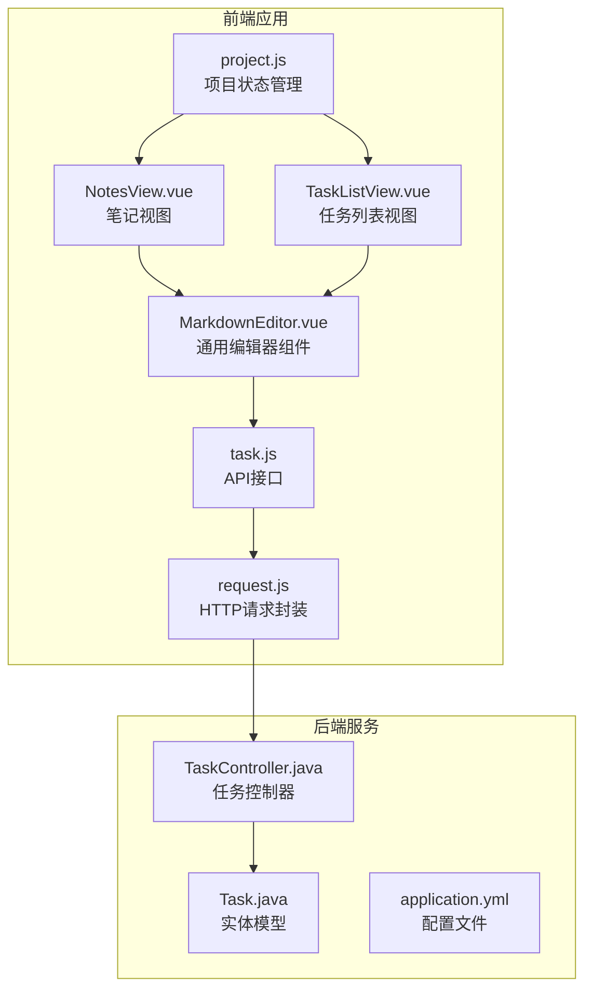
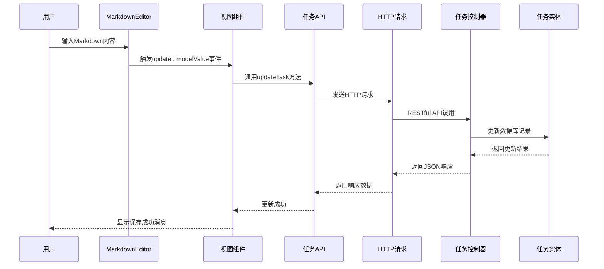
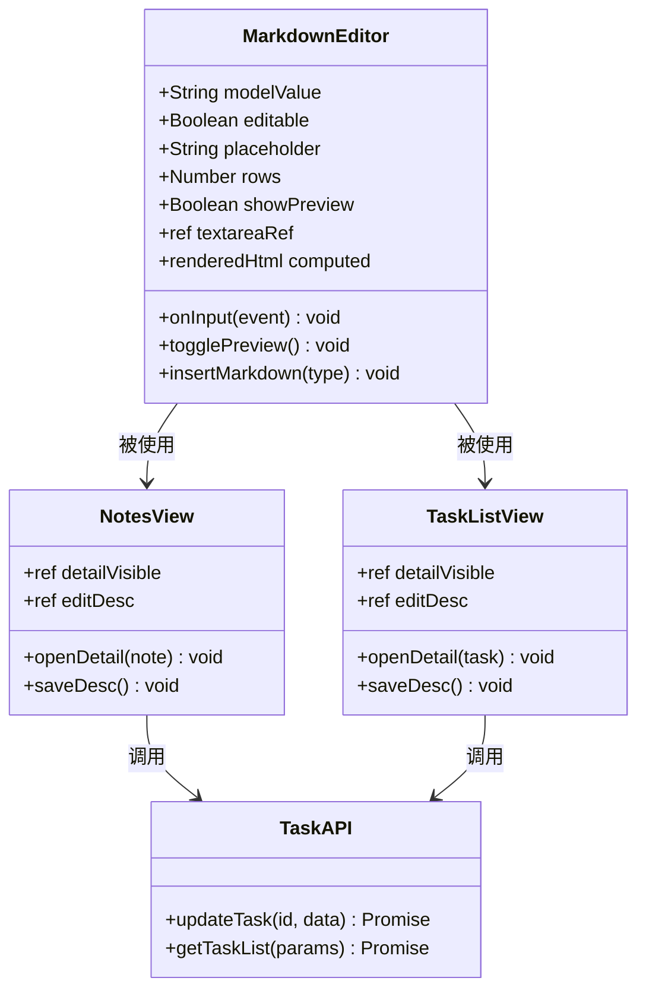
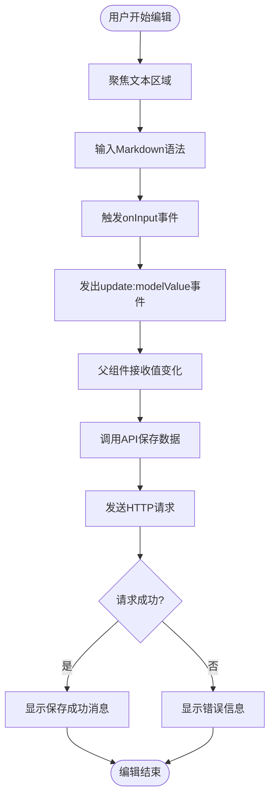
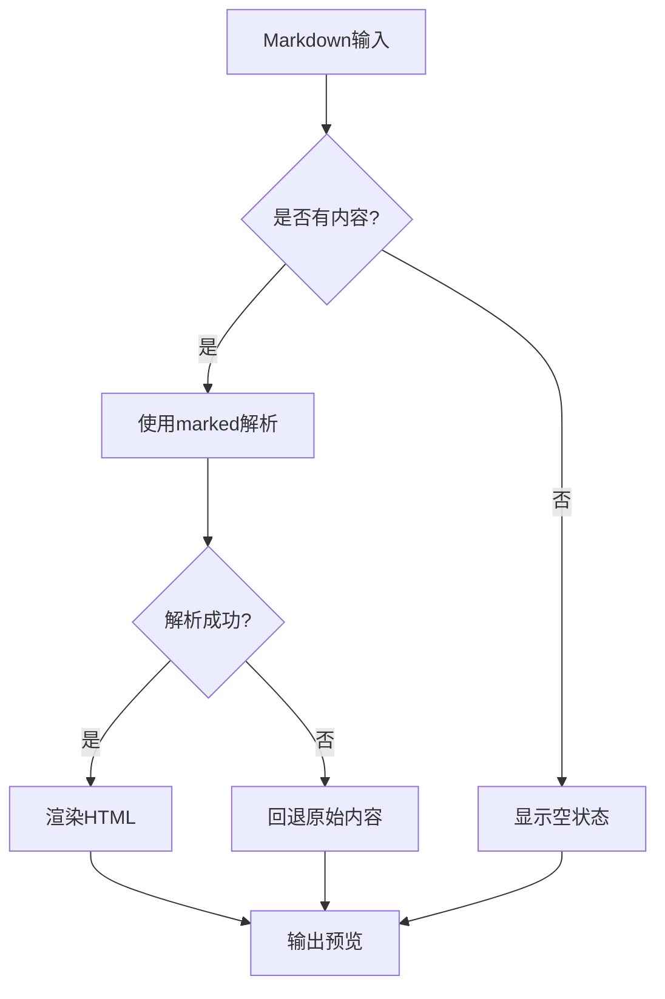
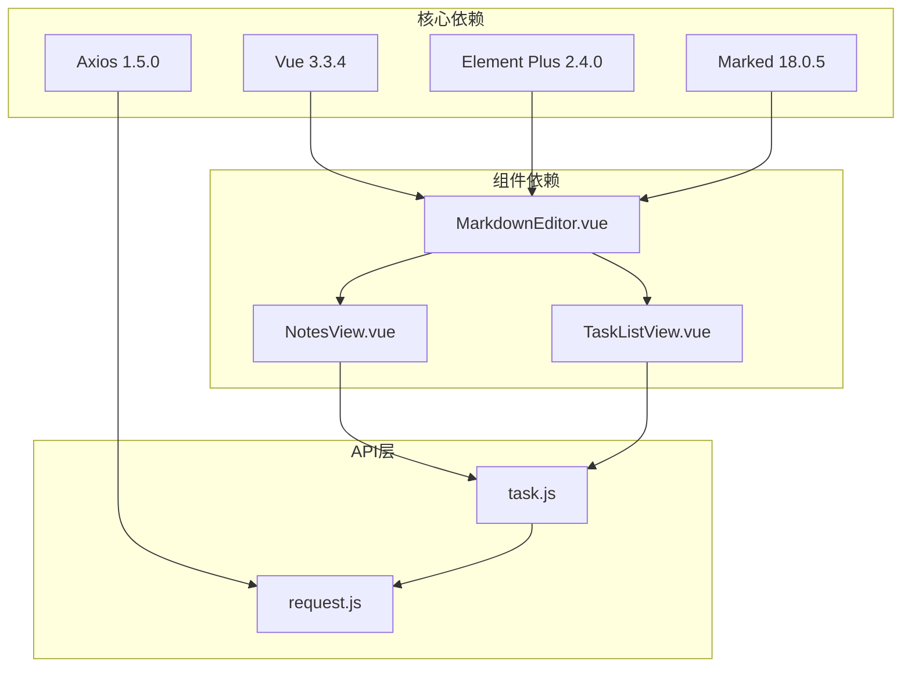
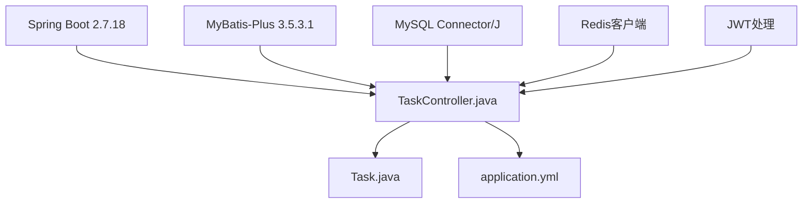

# Markdown编辑器组件

<cite>
**本文档引用的文件**
- [MarkdownEditor.vue](file://frontend/src/components/common/MarkdownEditor.vue)
- [NotesView.vue](file://frontend/src/views/NotesView.vue)
- [TaskListView.vue](file://frontend/src/views/TaskListView.vue)
- [task.js](file://frontend/src/api/task.js)
- [Task.java](file://backend/src/main/java/com/newworld/entity/Task.java)
- [TaskController.java](file://backend/src/main/java/com/newworld/controller/TaskController.java)
- [request.js](file://frontend/src/utils/request.js)
- [project.js](file://frontend/src/stores/project.js)
- [application.yml](file://backend/src/main/resources/application.yml)
- [package.json](file://frontend/package.json)
- [pom.xml](file://backend/pom.xml)
</cite>

## 目录
1. [简介](#简介)
2. [项目结构](#项目结构)
3. [核心组件](#核心组件)
4. [架构概览](#架构概览)
5. [详细组件分析](#详细组件分析)
6. [依赖关系分析](#依赖关系分析)
7. [性能考虑](#性能考虑)
8. [故障排除指南](#故障排除指南)
9. [结论](#结论)

## 简介

Markdown编辑器组件是NewWorld个人工作计划管理工具中的核心功能模块，提供了一个完整的Markdown编辑和预览解决方案。该组件支持实时预览、多种Markdown语法格式化、工具栏快捷操作等功能，广泛应用于任务管理和笔记管理场景中。

该组件采用Vue 3 Composition API实现，集成了marked解析库进行Markdown到HTML的转换，并提供了直观的用户界面和丰富的编辑功能。

## 项目结构

NewWorld项目采用前后端分离架构，Markdown编辑器组件位于前端项目的通用组件目录中，通过API接口与后端服务进行数据交互。

**图表来源**
- [MarkdownEditor.vue:1-226](file://frontend/src/components/common/MarkdownEditor.vue#L1-L226)
- [NotesView.vue:1-420](file://frontend/src/views/NotesView.vue#L1-L420)
- [TaskListView.vue:1-526](file://frontend/src/views/TaskListView.vue#L1-L526)

**章节来源**
- [MarkdownEditor.vue:1-226](file://frontend/src/components/common/MarkdownEditor.vue#L1-L226)
- [NotesView.vue:1-420](file://frontend/src/views/NotesView.vue#L1-L420)
- [TaskListView.vue:1-526](file://frontend/src/views/TaskListView.vue#L1-L526)

## 核心组件

Markdown编辑器组件是整个系统的核心功能模块，具有以下主要特性：

### 主要功能特性
- **实时Markdown解析**：使用marked库进行实时渲染
- **双模式编辑**：编辑模式和预览模式切换
- **工具栏快捷操作**：支持粗体、斜体、标题、列表等格式
- **响应式设计**：适配不同屏幕尺寸
- **可配置参数**：支持禁用编辑、自定义占位符等

### 技术实现特点
- 基于Vue 3 Composition API
- 使用Element Plus作为UI框架
- 支持双向数据绑定
- 内置错误处理机制

**章节来源**
- [MarkdownEditor.vue:51-133](file://frontend/src/components/common/MarkdownEditor.vue#L51-L133)

## 架构概览

Markdown编辑器组件在整个系统架构中扮演着重要的角色，它通过API接口与后端服务进行数据交互，同时在多个业务视图中复用。

**图表来源**
- [MarkdownEditor.vue:67-73](file://frontend/src/components/common/MarkdownEditor.vue#L67-L73)
- [task.js:15-17](file://frontend/src/api/task.js#L15-L17)
- [TaskController.java:48-52](file://backend/src/main/java/com/newworld/controller/TaskController.java#L48-L52)

## 详细组件分析

### MarkdownEditor组件架构

**图表来源**
- [MarkdownEditor.vue:55-62](file://frontend/src/components/common/MarkdownEditor.vue#L55-L62)
- [NotesView.vue:156-240](file://frontend/src/views/NotesView.vue#L156-L240)
- [TaskListView.vue:219-335](file://frontend/src/views/TaskListView.vue#L219-L335)

### 编辑流程分析

**图表来源**
- [MarkdownEditor.vue:67-69](file://frontend/src/components/common/MarkdownEditor.vue#L67-L69)
- [NotesView.vue:228-239](file://frontend/src/views/NotesView.vue#L228-L239)
- [TaskListView.vue:322-335](file://frontend/src/views/TaskListView.vue#L322-L335)

### 工具栏功能实现

Markdown编辑器提供了丰富的工具栏快捷操作功能：

| 功能 | 快捷键 | 语法示例 | 实现方式 |
|------|--------|----------|----------|
| 粗体 | **Bold** | `**粗体文字**` | 插入双星号包围 |
| 斜体 | *Italic* | `*斜体文字*` | 插入单星号包围 |
| 标题 | H2 | `\n## 标题\n` | 插入二级标题语法 |
| 无序列表 | ☰ | `\n- 列表项\n` | 插入连字符语法 |
| 有序列表 | #. | `\n1. 列表项\n` | 插入数字序号语法 |
| 引用 | " | `\n> 引用文字\n` | 插入大于号语法 |
| 代码块 | </> | `\n\`\`\`\n代码\n\`\`\`\n` | 插入三反引号语法 |
| 链接 | 🔗 | `[链接文字](url)` | 插入链接语法 |

**章节来源**
- [MarkdownEditor.vue:84-132](file://frontend/src/components/common/MarkdownEditor.vue#L84-L132)

### 预览机制分析

**图表来源**
- [MarkdownEditor.vue:75-82](file://frontend/src/components/common/MarkdownEditor.vue#L75-L82)

**章节来源**
- [MarkdownEditor.vue:75-82](file://frontend/src/components/common/MarkdownEditor.vue#L75-L82)

## 依赖关系分析

### 前端依赖关系

**图表来源**
- [package.json:11-25](file://frontend/package.json#L11-L25)
- [MarkdownEditor.vue:52-53](file://frontend/src/components/common/MarkdownEditor.vue#L52-L53)

### 后端依赖关系

**图表来源**
- [pom.xml:31-96](file://backend/pom.xml#L31-L96)
- [TaskController.java:1-112](file://backend/src/main/java/com/newworld/controller/TaskController.java#L1-L112)

**章节来源**
- [package.json:11-25](file://frontend/package.json#L11-L25)
- [pom.xml:31-96](file://backend/pom.xml#L31-L96)

## 性能考虑

### 渲染性能优化

1. **懒加载策略**：预览内容仅在需要时渲染
2. **计算属性缓存**：使用Vue计算属性避免重复解析
3. **防抖处理**：输入事件处理函数经过优化
4. **内存管理**：及时清理DOM引用和事件监听器

### 网络性能优化

1. **HTTP请求优化**：统一的请求拦截器处理
2. **错误重试机制**：自动处理部分网络异常
3. **超时控制**：30秒超时设置防止长时间等待
4. **Token管理**：自动注入认证头信息

### 前端性能最佳实践

- 使用Composition API提升组件复用性
- 合理使用v-if/v-show控制DOM渲染
- 优化样式作用域减少CSS冲突
- 实现适当的节流和防抖机制

## 故障排除指南

### 常见问题及解决方案

#### 预览功能异常
**问题症状**：Markdown内容无法正确渲染为HTML
**可能原因**：
- marked库版本不兼容
- Markdown语法错误
- DOM渲染异常

**解决步骤**：
1. 检查marked库版本兼容性
2. 验证Markdown语法格式
3. 查看浏览器控制台错误信息
4. 确认DOM元素存在且可访问

#### 编辑器无法输入
**问题症状**：文本区域无法响应键盘输入
**可能原因**：
- v-model绑定问题
- 事件监听器冲突
- 组件状态异常

**解决步骤**：
1. 检查props传递是否正确
2. 验证事件处理器绑定
3. 确认组件状态同步
4. 查看Vue DevTools调试信息

#### API请求失败
**问题症状**：保存操作返回错误
**可能原因**：
- 网络连接问题
- 认证令牌过期
- 后端服务异常

**解决步骤**：
1. 检查网络连接状态
2. 验证localStorage中的token
3. 查看后端服务日志
4. 确认API接口可用性

**章节来源**
- [MarkdownEditor.vue:77-81](file://frontend/src/components/common/MarkdownEditor.vue#L77-L81)
- [request.js:22-54](file://frontend/src/utils/request.js#L22-L54)

## 结论

Markdown编辑器组件作为NewWorld项目的核心功能模块，展现了现代前端开发的最佳实践。该组件通过简洁的API设计、完善的错误处理机制和优秀的用户体验，在任务管理和笔记管理场景中发挥着重要作用。

### 主要优势
- **高度可复用**：在多个业务视图中统一使用
- **功能完整**：涵盖Markdown编辑的各个方面
- **性能优秀**：优化的渲染和数据处理机制
- **易于维护**：清晰的代码结构和文档

### 技术亮点
- 基于Vue 3 Composition API的现代化实现
- 完善的TypeScript类型支持
- 优雅的错误处理和边界情况处理
- 与后端API的无缝集成

该组件为后续的功能扩展和维护奠定了良好的基础，是整个NewWorld项目的重要组成部分。