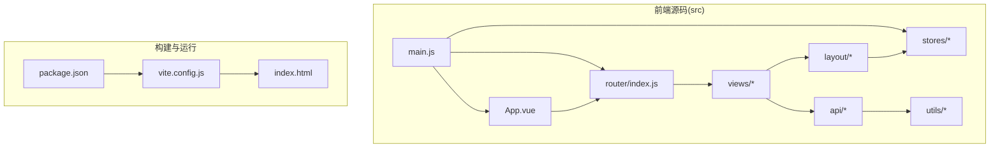
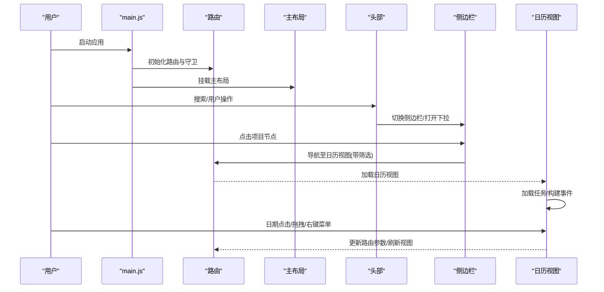
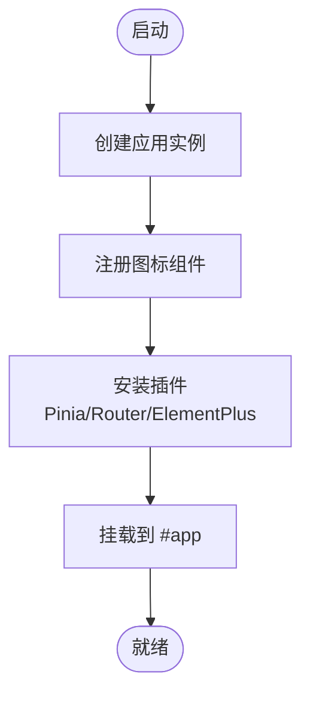
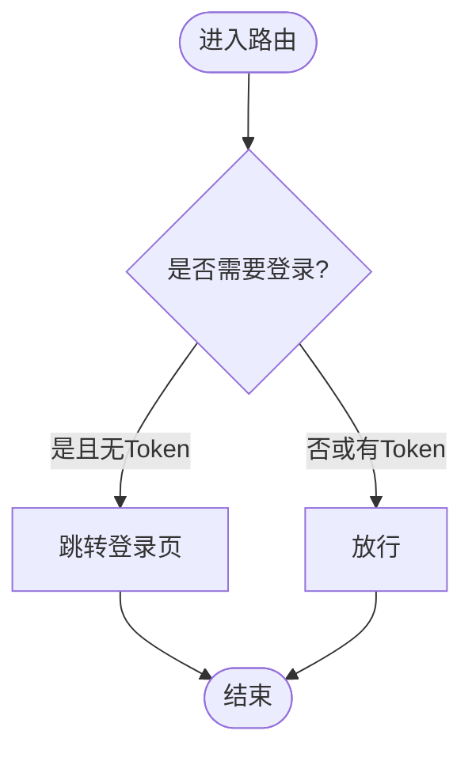
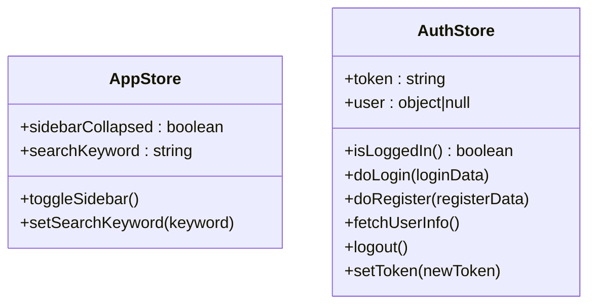
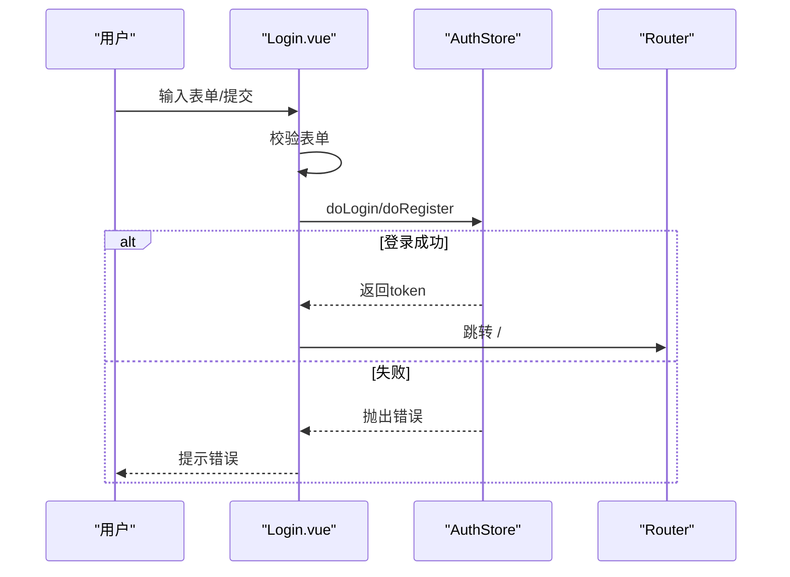
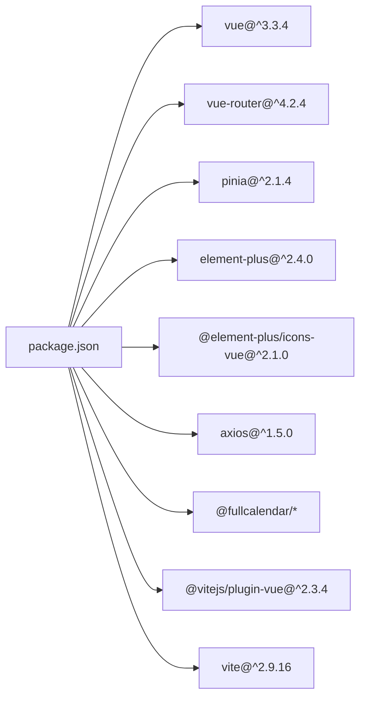

# Vue 3 应用架构

<cite>
**本文引用的文件**
- [frontend/src/main.js](file://frontend/src/main.js)
- [frontend/src/App.vue](file://frontend/src/App.vue)
- [frontend/vite.config.js](file://frontend/vite.config.js)
- [frontend/package.json](file://frontend/package.json)
- [frontend/src/router/index.js](file://frontend/src/router/index.js)
- [frontend/src/stores/app.js](file://frontend/src/stores/app.js)
- [frontend/src/stores/auth.js](file://frontend/src/stores/auth.js)
- [frontend/src/layout/MainLayout.vue](file://frontend/src/layout/MainLayout.vue)
- [frontend/src/layout/Header.vue](file://frontend/src/layout/Header.vue)
- [frontend/src/layout/Sidebar.vue](file://frontend/src/layout/Sidebar.vue)
- [frontend/src/views/Login.vue](file://frontend/src/views/Login.vue)
- [frontend/src/views/CalendarView.vue](file://frontend/src/views/CalendarView.vue)
- [frontend/src/utils/request.js](file://frontend/src/utils/request.js)
- [frontend/src/api/auth.js](file://frontend/src/api/auth.js)
</cite>

## 目录
1. [引言](#引言)
2. [项目结构](#项目结构)
3. [核心组件](#核心组件)
4. [架构总览](#架构总览)
5. [详细组件分析](#详细组件分析)
6. [依赖关系分析](#依赖关系分析)
7. [性能考虑](#性能考虑)
8. [故障排查指南](#故障排查指南)
9. [结论](#结论)
10. [附录](#附录)

## 引言
本文件系统性梳理该 Vue 3 单页应用（SPA）的架构设计与实现要点，覆盖应用入口、根组件、路由与状态管理、UI 组件体系、HTTP 请求封装、以及 Vite 构建配置。文档同时总结 Composition API 的使用模式、开发与生产环境差异、以及可落地的性能优化实践，帮助开发者快速理解并高效迭代。

## 项目结构
前端工程位于 frontend 目录，采用按功能域划分的目录组织方式：
- src/api：后端接口封装，按业务模块拆分
- src/components：通用组件（当前仓库未包含）
- src/layout：布局组件（主布局、侧边栏、头部）
- src/router：路由定义与导航守卫
- src/stores：状态管理（Pinia Store）
- src/utils：通用工具（HTTP 请求拦截器）
- src/views：页面视图（登录、日历、项目视图等）
- 入口：main.js、App.vue、index.html、vite.config.js、package.json

图表来源
- [frontend/src/main.js:1-22](file://frontend/src/main.js#L1-L22)
- [frontend/src/App.vue:1-16](file://frontend/src/App.vue#L1-L16)
- [frontend/src/router/index.js:1-50](file://frontend/src/router/index.js#L1-L50)
- [frontend/vite.config.js:1-26](file://frontend/vite.config.js#L1-L26)
- [frontend/package.json:1-30](file://frontend/package.json#L1-L30)

章节来源
- [frontend/src/main.js:1-22](file://frontend/src/main.js#L1-L22)
- [frontend/src/App.vue:1-16](file://frontend/src/App.vue#L1-L16)
- [frontend/vite.config.js:1-26](file://frontend/vite.config.js#L1-L26)
- [frontend/package.json:1-30](file://frontend/package.json#L1-L30)

## 核心组件
- 应用入口与初始化：在入口文件中创建应用实例、挂载插件（Pinia、Router、Element Plus）、注册图标、注入全局样式，并挂载到 DOM。
- 根组件：最外层容器，仅包含路由出口，承载页面切换。
- 路由系统：基于 History 模式的动态路由，支持嵌套路由与导航守卫，实现登录态控制。
- 状态管理：Pinia 函数式 Store，分别管理应用状态（如侧边栏折叠、搜索关键字）与认证状态（token、用户信息、登录/登出流程）。
- 视图与布局：登录页、日历视图、主布局、头部、侧边栏；侧边栏联动项目树与统计信息，头部提供搜索与用户操作。
- HTTP 封装：基于 Axios 的请求实例，统一注入 Authorization 头、集中处理错误与鉴权失效跳转。

章节来源
- [frontend/src/main.js:1-22](file://frontend/src/main.js#L1-L22)
- [frontend/src/App.vue:1-16](file://frontend/src/App.vue#L1-L16)
- [frontend/src/router/index.js:1-50](file://frontend/src/router/index.js#L1-L50)
- [frontend/src/stores/app.js:1-18](file://frontend/src/stores/app.js#L1-L18)
- [frontend/src/stores/auth.js:1-41](file://frontend/src/stores/auth.js#L1-L41)
- [frontend/src/layout/MainLayout.vue:1-39](file://frontend/src/layout/MainLayout.vue#L1-L39)
- [frontend/src/layout/Header.vue:1-87](file://frontend/src/layout/Header.vue#L1-L87)
- [frontend/src/layout/Sidebar.vue:1-250](file://frontend/src/layout/Sidebar.vue#L1-L250)
- [frontend/src/views/Login.vue:1-203](file://frontend/src/views/Login.vue#L1-L203)
- [frontend/src/views/CalendarView.vue:1-451](file://frontend/src/views/CalendarView.vue#L1-L451)
- [frontend/src/utils/request.js:1-56](file://frontend/src/utils/request.js#L1-L56)
- [frontend/src/api/auth.js:1-14](file://frontend/src/api/auth.js#L1-L14)

## 架构总览
该应用采用“入口初始化 → 路由驱动 → 组件渲染 → 状态与服务协同”的 SPA 架构。核心交互链路如下：

图表来源
- [frontend/src/main.js:1-22](file://frontend/src/main.js#L1-L22)
- [frontend/src/router/index.js:1-50](file://frontend/src/router/index.js#L1-L50)
- [frontend/src/layout/MainLayout.vue:1-39](file://frontend/src/layout/MainLayout.vue#L1-L39)
- [frontend/src/layout/Header.vue:1-87](file://frontend/src/layout/Header.vue#L1-L87)
- [frontend/src/layout/Sidebar.vue:1-250](file://frontend/src/layout/Sidebar.vue#L1-L250)
- [frontend/src/views/CalendarView.vue:1-451](file://frontend/src/views/CalendarView.vue#L1-L451)

## 详细组件分析

### 应用入口与初始化（main.js）
- 创建应用实例并引入插件：Pinia、Router、Element Plus（含中文本地化）
- 动态注册 Element Plus 图标组件
- 全局样式注入与挂载

图表来源
- [frontend/src/main.js:1-22](file://frontend/src/main.js#L1-L22)

章节来源
- [frontend/src/main.js:1-22](file://frontend/src/main.js#L1-L22)

### 根组件（App.vue）
- 作为路由出口容器，承载页面切换
- 全局样式定义基础 HTML/Body 高度与字体

章节来源
- [frontend/src/App.vue:1-16](file://frontend/src/App.vue#L1-L16)

### 路由系统（router/index.js）
- 定义登录页与主布局嵌套路由
- 使用动态导入实现路由级别的代码分割
- 导航守卫根据本地 token 控制访问与跳转

图表来源
- [frontend/src/router/index.js:38-47](file://frontend/src/router/index.js#L38-L47)

章节来源
- [frontend/src/router/index.js:1-50](file://frontend/src/router/index.js#L1-L50)

### 状态管理（Pinia Store）
- 应用状态（app.js）：侧边栏折叠、搜索关键字，提供切换与设置方法
- 认证状态（auth.js）：token、用户信息、登录/注册/登出、获取用户信息

图表来源
- [frontend/src/stores/app.js:1-18](file://frontend/src/stores/app.js#L1-L18)
- [frontend/src/stores/auth.js:1-41](file://frontend/src/stores/auth.js#L1-L41)

章节来源
- [frontend/src/stores/app.js:1-18](file://frontend/src/stores/app.js#L1-L18)
- [frontend/src/stores/auth.js:1-41](file://frontend/src/stores/auth.js#L1-L41)

### 登录视图（views/Login.vue）
- 使用 Composition API：ref、reactive、computed、onMounted
- 表单校验规则动态生成，支持注册/登录模式切换
- 调用认证 Store 执行登录/注册，成功后跳转首页

图表来源
- [frontend/src/views/Login.vue:68-157](file://frontend/src/views/Login.vue#L68-L157)
- [frontend/src/stores/auth.js:16-31](file://frontend/src/stores/auth.js#L16-L31)
- [frontend/src/router/index.js:38-47](file://frontend/src/router/index.js#L38-L47)

章节来源
- [frontend/src/views/Login.vue:1-203](file://frontend/src/views/Login.vue#L1-L203)
- [frontend/src/stores/auth.js:1-41](file://frontend/src/stores/auth.js#L1-L41)

### 主布局与头部（layout/MainLayout.vue、layout/Header.vue）
- MainLayout：左右布局，左侧 Sidebar，右侧为主内容区，包含 Header 与 router-view
- Header：提供搜索框、日历/项目导航、用户下拉菜单（登出）

章节来源
- [frontend/src/layout/MainLayout.vue:1-39](file://frontend/src/layout/MainLayout.vue#L1-L39)
- [frontend/src/layout/Header.vue:1-87](file://frontend/src/layout/Header.vue#L1-L87)

### 侧边栏（layout/Sidebar.vue）
- 展示任务统计与项目树，支持节点点击导航、右键菜单、分组创建/删除
- 通过 Project Store 获取树数据，调用 API 获取统计数据

章节来源
- [frontend/src/layout/Sidebar.vue:1-250](file://frontend/src/layout/Sidebar.vue#L1-L250)

### 日历视图（views/CalendarView.vue）
- 基于 FullCalendar 的日程展示与交互，支持拖拽、调整大小、右键菜单
- 支持任务创建、编辑、删除、状态与优先级变更
- 通过自定义事件与 Header/Sidebar 通信，实现跨组件联动

章节来源
- [frontend/src/views/CalendarView.vue:1-451](file://frontend/src/views/CalendarView.vue#L1-L451)

### HTTP 请求封装（utils/request.js）
- Axios 实例：baseURL 指向 /api，统一注入 Authorization 头
- 统一错误处理：401 清理 token 并跳转登录，403/500 等提示对应错误，网络异常统一提示

章节来源
- [frontend/src/utils/request.js:1-56](file://frontend/src/utils/request.js#L1-L56)

### 认证 API（api/auth.js）
- 对接后端认证接口：登录、注册、获取用户信息

章节来源
- [frontend/src/api/auth.js:1-14](file://frontend/src/api/auth.js#L1-L14)

## 依赖关系分析
- 运行时依赖：Vue 3、Vue Router、Pinia、Element Plus 及其图标、Axios、FullCalendar 生态
- 开发依赖：Vite 插件、Vue 语法支持
- 构建产物：dist 目录，静态资源放置于 assets 子目录

图表来源
- [frontend/package.json:11-28](file://frontend/package.json#L11-L28)

章节来源
- [frontend/package.json:1-30](file://frontend/package.json#L1-L30)

## 性能考虑
- 代码分割与懒加载
  - 路由级别懒加载：登录页与各视图均通过动态导入实现按需加载，减少首屏体积
  - 日历视图内部也存在按需导入搜索接口，避免非必要模块常驻
- 构建输出
  - 构建目录：outDir=dist，静态资源目录：assetsDir=assets
- 运行时优化建议
  - 合理使用 computed 与 reactive，避免不必要的响应式开销
  - 在 FullCalendar 中仅在必要时刷新事件数组，减少渲染压力
  - 使用 Teleport 减少 DOM 层级深度，提升复杂弹窗/菜单的渲染效率
  - 对高频事件（如滚动、窗口尺寸变化）进行节流/防抖
- 缓存策略
  - 本地存储：token 与搜索关键字持久化，提升二次访问体验
  - 组件级缓存：对不频繁变动的数据进行缓存，避免重复请求
- 资源压缩
  - 生产构建默认启用压缩，建议结合 CDN 与 Gzip/Brotli 传输优化

章节来源
- [frontend/src/router/index.js:7,23,25:7-29](file://frontend/src/router/index.js#L7-L29)
- [frontend/src/views/CalendarView.vue:403](file://frontend/src/views/CalendarView.vue#L403)
- [frontend/vite.config.js:21-24](file://frontend/vite.config.js#L21-L24)
- [frontend/src/stores/app.js:5-6](file://frontend/src/stores/app.js#L5-L6)
- [frontend/src/stores/auth.js:6](file://frontend/src/stores/auth.js#L6)

## 故障排查指南
- 登录失败/401
  - 检查请求拦截器是否正确注入 Authorization 头
  - 确认后端返回的 code 字段与统一响应结构一致
  - 若出现 401，确认本地 token 是否被清理，页面是否跳转登录
- 路由跳转异常
  - 核对导航守卫逻辑与 requiresAuth 元信息
  - 确认 History 模式下服务器静态资源代理配置
- 日历交互异常
  - 检查 FullCalendar 事件绑定与右键菜单监听是否在组件挂载时注册
  - 确认拖拽/调整大小回调中的 revert 逻辑与刷新流程
- 侧边栏/头部联动问题
  - 确认自定义事件监听与移除是否成对出现
  - 检查 Store 数据更新后是否触发视图刷新

章节来源
- [frontend/src/utils/request.js:10-53](file://frontend/src/utils/request.js#L10-L53)
- [frontend/src/router/index.js:38-47](file://frontend/src/router/index.js#L38-L47)
- [frontend/src/views/CalendarView.vue:234-247](file://frontend/src/views/CalendarView.vue#L234-L247)
- [frontend/src/layout/Sidebar.vue:176](file://frontend/src/layout/Sidebar.vue#L176)
- [frontend/src/layout/Header.vue:55-66](file://frontend/src/layout/Header.vue#L55-L66)

## 结论
该 Vue 3 应用以清晰的目录结构、完善的路由与状态管理、以及良好的 HTTP 封装为基础，实现了从登录到日程管理的完整 SPA 流程。通过路由与组件层面的懒加载、构建输出配置与运行时优化策略，整体具备较好的可维护性与性能表现。后续可在国际化、主题系统、服务端渲染与测试体系方面进一步完善。

## 附录
- 开发与生产差异
  - 开发：本地端口 3000，代理 /api 到后端 8080
  - 生产：构建输出 dist/assets，建议配合 Nginx/CDN 提供静态资源服务
- 关键实现路径参考
  - 应用入口与插件注册：[frontend/src/main.js:1-22](file://frontend/src/main.js#L1-L22)
  - 根组件与路由出口：[frontend/src/App.vue:1-16](file://frontend/src/App.vue#L1-L16)
  - 路由与导航守卫：[frontend/src/router/index.js:1-50](file://frontend/src/router/index.js#L1-L50)
  - 应用状态 Store：[frontend/src/stores/app.js:1-18](file://frontend/src/stores/app.js#L1-L18)
  - 认证状态 Store：[frontend/src/stores/auth.js:1-41](file://frontend/src/stores/auth.js#L1-L41)
  - 登录视图与表单校验：[frontend/src/views/Login.vue:1-203](file://frontend/src/views/Login.vue#L1-L203)
  - 主布局与头部：[frontend/src/layout/MainLayout.vue:1-39](file://frontend/src/layout/MainLayout.vue#L1-L39)、[frontend/src/layout/Header.vue:1-87](file://frontend/src/layout/Header.vue#L1-L87)
  - 侧边栏与项目树：[frontend/src/layout/Sidebar.vue:1-250](file://frontend/src/layout/Sidebar.vue#L1-L250)
  - 日历视图与交互：[frontend/src/views/CalendarView.vue:1-451](file://frontend/src/views/CalendarView.vue#L1-L451)
  - HTTP 请求封装：[frontend/src/utils/request.js:1-56](file://frontend/src/utils/request.js#L1-L56)
  - 认证 API：[frontend/src/api/auth.js:1-14](file://frontend/src/api/auth.js#L1-L14)
  - Vite 构建配置：[frontend/vite.config.js:1-26](file://frontend/vite.config.js#L1-L26)
  - 依赖与脚本：[frontend/package.json:1-30](file://frontend/package.json#L1-L30)