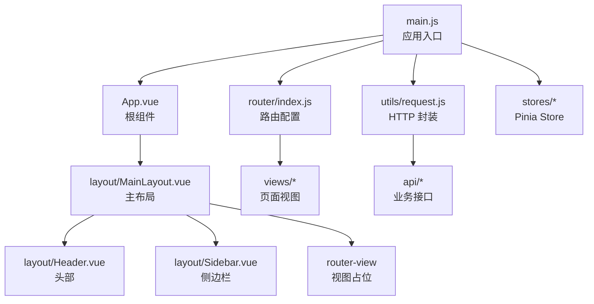
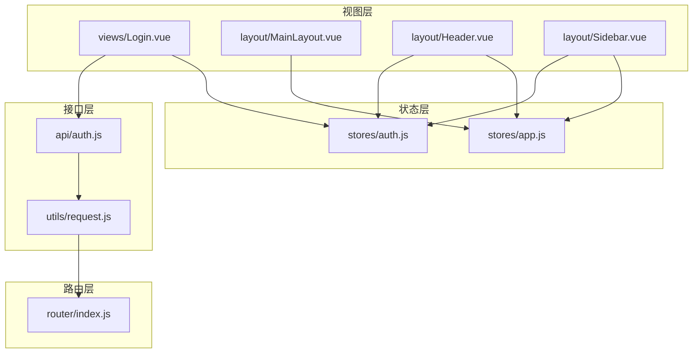
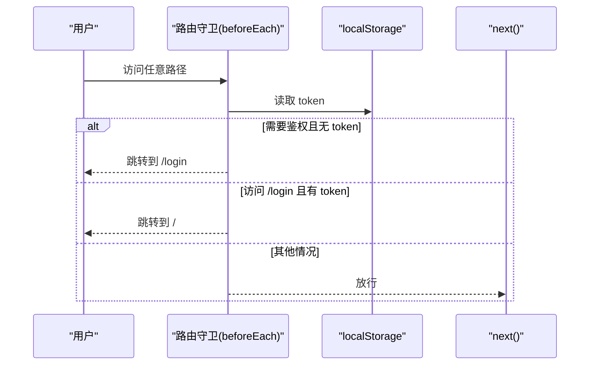
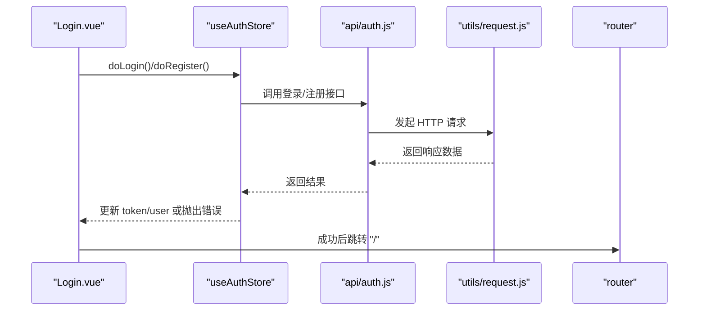
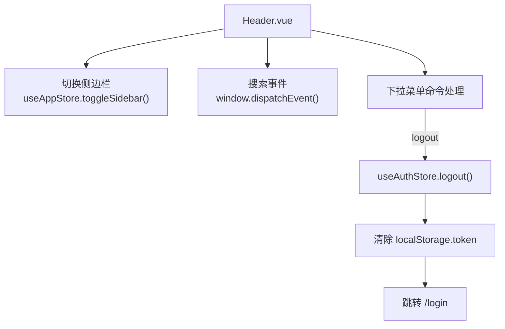
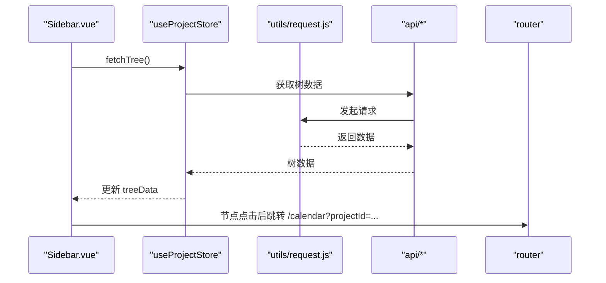
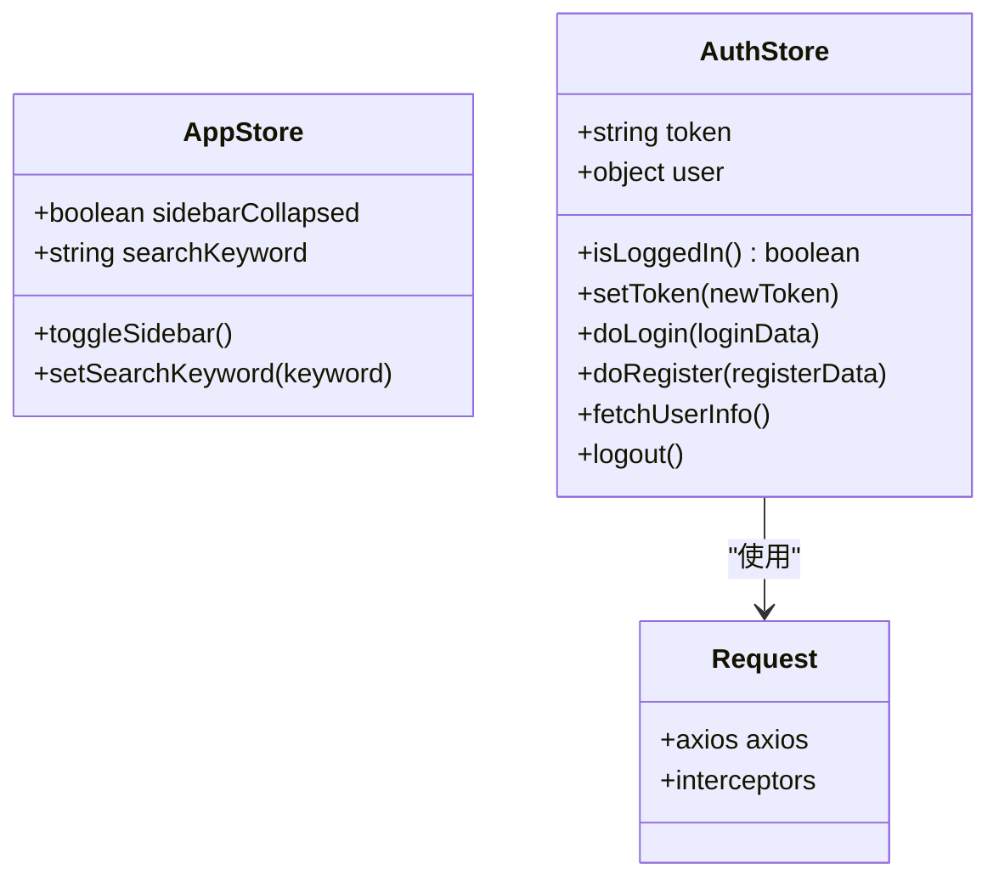
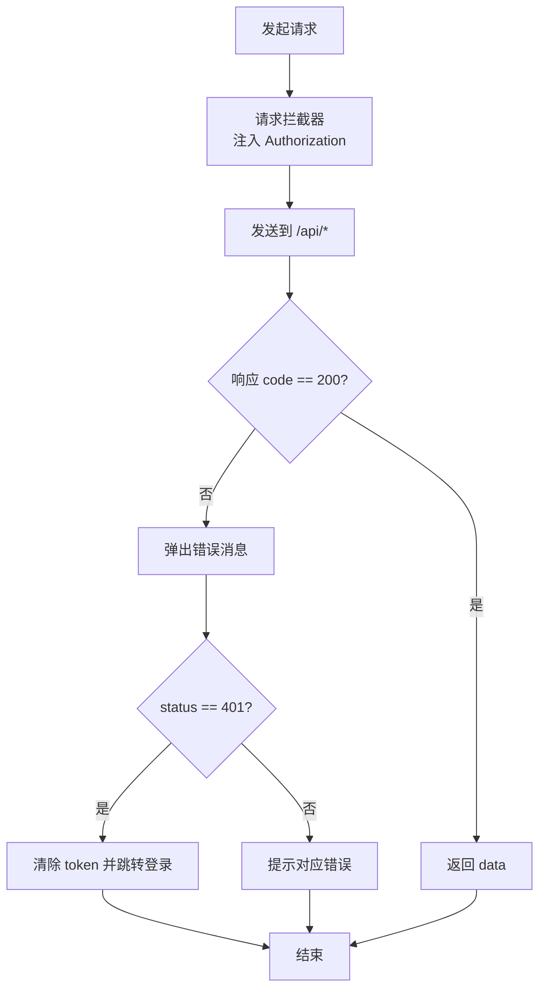
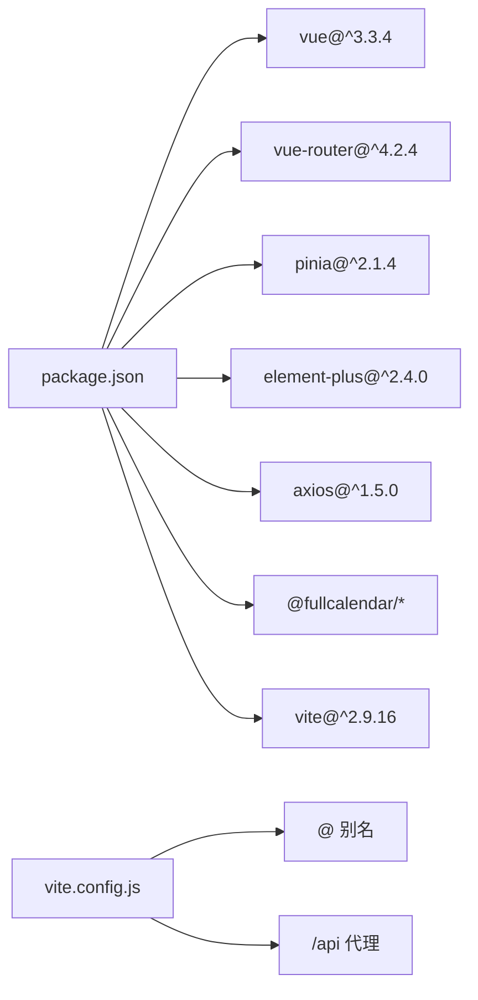

# 前端开发

<cite>
**本文引用的文件**
- [main.js](file://frontend/src/main.js)
- [App.vue](file://frontend/src/App.vue)
- [package.json](file://frontend/package.json)
- [vite.config.js](file://frontend/vite.config.js)
- [router/index.js](file://frontend/src/router/index.js)
- [stores/auth.js](file://frontend/src/stores/auth.js)
- [stores/app.js](file://frontend/src/stores/app.js)
- [utils/request.js](file://frontend/src/utils/request.js)
- [api/auth.js](file://frontend/src/api/auth.js)
- [layout/MainLayout.vue](file://frontend/src/layout/MainLayout.vue)
- [layout/Header.vue](file://frontend/src/layout/Header.vue)
- [layout/Sidebar.vue](file://frontend/src/layout/Sidebar.vue)
- [views/Login.vue](file://frontend/src/views/Login.vue)
- [styles/global.css](file://frontend/src/styles/global.css)
</cite>

## 目录
1. [引言](#引言)
2. [项目结构](#项目结构)
3. [核心组件](#核心组件)
4. [架构总览](#架构总览)
5. [详细组件分析](#详细组件分析)
6. [依赖关系分析](#依赖关系分析)
7. [性能考虑](#性能考虑)
8. [故障排查指南](#故障排查指南)
9. [结论](#结论)
10. [附录](#附录)

## 引言
本指南面向新世界项目的前端开发团队，系统性讲解基于 Vue 3 的单页应用（SPA）架构设计与实现要点，涵盖：
- 单页应用结构与路由体系
- 组件化开发模式与布局组件
- Composition API 使用：setup、响应式引用、计算属性与侦听器
- Pinia 状态管理：store 设计、状态持久化、异步 action
- 路由系统：配置、导航守卫、动态路由加载
- 后端 API 集成：HTTP 请求封装、统一错误处理、数据转换
- UI 组件库：Element Plus 的使用与定制，以及自定义组件开发建议

## 项目结构
前端采用 Vite 构建工具，目录组织遵循“按功能域划分”的模块化思路：
- 应用入口与全局配置：main.js、App.vue、vite.config.js、package.json
- 路由：src/router/index.js
- 状态管理：src/stores 下的多个 store
- API 层：src/api 下按业务模块拆分的接口文件
- 工具层：src/utils/request.js 封装 axios
- 视图与布局：src/views 与 src/layout
- 样式：src/styles/global.css 提供主题变量与通用样式

图表来源
- [main.js:1-22](file://frontend/src/main.js#L1-L22)
- [App.vue:1-16](file://frontend/src/App.vue#L1-L16)
- [router/index.js:1-50](file://frontend/src/router/index.js#L1-L50)
- [utils/request.js:1-56](file://frontend/src/utils/request.js#L1-L56)
- [stores/auth.js:1-41](file://frontend/src/stores/auth.js#L1-L41)
- [stores/app.js:1-18](file://frontend/src/stores/app.js#L1-L18)
- [layout/MainLayout.vue:1-39](file://frontend/src/layout/MainLayout.vue#L1-L39)
- [layout/Header.vue:1-87](file://frontend/src/layout/Header.vue#L1-L87)
- [layout/Sidebar.vue:1-250](file://frontend/src/layout/Sidebar.vue#L1-L250)

章节来源
- [main.js:1-22](file://frontend/src/main.js#L1-L22)
- [package.json:1-30](file://frontend/package.json#L1-L30)
- [vite.config.js:1-26](file://frontend/vite.config.js#L1-L26)

## 核心组件
- 应用入口与插件注册：在入口文件中完成 Vue 实例创建、Pinia、路由、Element Plus 插件注册，并批量注册图标组件。
- 根组件：App.vue 仅包含路由出口，实现 SPA 的页面切换。
- 全局样式：通过 CSS 变量集中管理主题色、尺寸与组件样式，便于定制。

章节来源
- [main.js:1-22](file://frontend/src/main.js#L1-L22)
- [App.vue:1-16](file://frontend/src/App.vue#L1-L16)
- [styles/global.css:1-167](file://frontend/src/styles/global.css#L1-L167)

## 架构总览
整体架构围绕“视图层（Vue 组件）—状态层（Pinia）—接口层（Axios 封装）—路由层（Vue Router）”展开，Element Plus 提供基础 UI 能力，Vite 提供开发与构建支持。

图表来源
- [views/Login.vue:1-203](file://frontend/src/views/Login.vue#L1-L203)
- [layout/MainLayout.vue:1-39](file://frontend/src/layout/MainLayout.vue#L1-L39)
- [layout/Header.vue:1-87](file://frontend/src/layout/Header.vue#L1-L87)
- [layout/Sidebar.vue:1-250](file://frontend/src/layout/Sidebar.vue#L1-L250)
- [stores/app.js:1-18](file://frontend/src/stores/app.js#L1-L18)
- [stores/auth.js:1-41](file://frontend/src/stores/auth.js#L1-L41)
- [utils/request.js:1-56](file://frontend/src/utils/request.js#L1-L56)
- [api/auth.js:1-14](file://frontend/src/api/auth.js#L1-L14)
- [router/index.js:1-50](file://frontend/src/router/index.js#L1-L50)

## 详细组件分析

### 路由系统与导航守卫
- 路由配置：采用 history 模式，定义登录页与主布局下的子路由（日历视图、项目总览），并设置 meta 字段标识是否需要鉴权。
- 动态路由加载：使用路由懒加载按需加载视图组件，减少首屏体积。
- 导航守卫：在 beforeEach 中读取本地 token，未登录访问受保护路由跳转登录；已登录访问登录页则跳转首页。

图表来源
- [router/index.js:37-47](file://frontend/src/router/index.js#L37-L47)

章节来源
- [router/index.js:1-50](file://frontend/src/router/index.js#L1-L50)

### 登录视图与认证流程
- 表单与校验：使用 Element Plus 表单组件，基于响应式数据与计算属性生成规则，支持注册/登录模式切换与密码一致性校验。
- 行为逻辑：提交前进行表单校验，调用 Pinia 认证 store 的异步 action 完成登录或注册，成功后跳转首页并显示消息。
- 交互细节：Enter 键触发提交，按钮 loading 状态控制，异常时统一提示。

图表来源
- [views/Login.vue:125-157](file://frontend/src/views/Login.vue#L125-L157)
- [stores/auth.js:16-31](file://frontend/src/stores/auth.js#L16-L31)
- [api/auth.js:1-14](file://frontend/src/api/auth.js#L1-L14)
- [utils/request.js:1-56](file://frontend/src/utils/request.js#L1-L56)

章节来源
- [views/Login.vue:1-203](file://frontend/src/views/Login.vue#L1-L203)
- [stores/auth.js:1-41](file://frontend/src/stores/auth.js#L1-L41)
- [api/auth.js:1-14](file://frontend/src/api/auth.js#L1-L14)

### 主布局与头部组件
- 主布局：MainLayout 将侧边栏、头部与内容区组合，内容区通过 router-view 渲染当前路由视图。
- 头部：提供折叠侧边栏、搜索框、导航按钮与用户下拉菜单；点击退出登录会清空 token 并跳转登录页。

图表来源
- [layout/Header.vue:43-66](file://frontend/src/layout/Header.vue#L43-L66)
- [stores/app.js:8-10](file://frontend/src/stores/app.js#L8-L10)
- [stores/auth.js:33-37](file://frontend/src/stores/auth.js#L33-L37)

章节来源
- [layout/MainLayout.vue:1-39](file://frontend/src/layout/MainLayout.vue#L1-L39)
- [layout/Header.vue:1-87](file://frontend/src/layout/Header.vue#L1-L87)
- [stores/app.js:1-18](file://frontend/src/stores/app.js#L1-L18)
- [stores/auth.js:1-41](file://frontend/src/stores/auth.js#L1-L41)

### 侧边栏与项目树
- 侧边栏：展示快速统计、项目树与上下文菜单；支持折叠/展开、节点点击跳转、右键菜单操作（新建、重命名、删除）。
- 数据与行为：挂载时加载项目树与任务统计；通过自定义事件向外部组件广播任务详情打开指令；删除节点前二次确认。

图表来源
- [layout/Sidebar.vue:90-181](file://frontend/src/layout/Sidebar.vue#L90-L181)
- [layout/Sidebar.vue:117-127](file://frontend/src/layout/Sidebar.vue#L117-L127)

章节来源
- [layout/Sidebar.vue:1-250](file://frontend/src/layout/Sidebar.vue#L1-L250)

### 状态管理（Pinia）
- 应用状态（app）：维护侧边栏折叠状态与搜索关键词，提供切换与设置方法。
- 认证状态（auth）：维护 token 与用户信息，提供登录、注册、获取用户信息、登出与 token 设置；token 默认从 localStorage 初始化，更新时同步持久化。

图表来源
- [stores/app.js:1-18](file://frontend/src/stores/app.js#L1-L18)
- [stores/auth.js:1-41](file://frontend/src/stores/auth.js#L1-L41)
- [utils/request.js:1-56](file://frontend/src/utils/request.js#L1-L56)

章节来源
- [stores/app.js:1-18](file://frontend/src/stores/app.js#L1-L18)
- [stores/auth.js:1-41](file://frontend/src/stores/auth.js#L1-L41)

### HTTP 请求封装与错误处理
- 基础配置：baseURL 指向 /api，超时时间设定；请求头自动注入 Authorization: Bearer token。
- 统一错误处理：响应拦截器对非 200 状态码统一提示；401 自动清理 token 并跳转登录；网络异常统一提示。
- 接口文件：以模块化方式导出业务接口，如登录、注册、用户信息等。

图表来源
- [utils/request.js:4-53](file://frontend/src/utils/request.js#L4-L53)
- [api/auth.js:1-14](file://frontend/src/api/auth.js#L1-L14)

章节来源
- [utils/request.js:1-56](file://frontend/src/utils/request.js#L1-L56)
- [api/auth.js:1-14](file://frontend/src/api/auth.js#L1-L14)

### UI 组件库与样式定制
- Element Plus：全局安装并设置中文语言包；批量注册图标组件；在各视图中直接使用表单、按钮、树形控件、对话框等。
- 样式定制：通过 CSS 变量集中管理主题色、尺寸、组件样式；为 FullCalendar、上下文菜单、滑入面板等提供样式覆盖。

章节来源
- [main.js:3-20](file://frontend/src/main.js#L3-L20)
- [styles/global.css:1-167](file://frontend/src/styles/global.css#L1-L167)

## 依赖关系分析
- 开发与构建：Vite 提供开发服务器与打包能力，配置了别名与代理，将 /api 代理至后端服务。
- 运行时依赖：Vue 3、Vue Router、Pinia、Element Plus、Axios、FullCalendar 等。
- 项目脚本：dev、build、preview 三类常用命令。

图表来源
- [package.json:11-28](file://frontend/package.json#L11-L28)
- [vite.config.js:7-20](file://frontend/vite.config.js#L7-L20)

章节来源
- [package.json:1-30](file://frontend/package.json#L1-L30)
- [vite.config.js:1-26](file://frontend/vite.config.js#L1-L26)

## 性能考虑
- 路由懒加载：通过动态 import 减少首屏资源加载。
- 组件拆分：布局与视图分离，避免单文件过大。
- 状态最小化：Pinia store 仅存放必要状态，避免冗余响应式开销。
- 请求缓存：可在 utils/request.js 中增加缓存策略或在 store 中做幂等请求合并。
- 图标与第三方库：按需引入，避免全量打包。

## 故障排查指南
- 登录后无法进入受保护页面
  - 检查路由守卫是否正确读取 token，确认登录成功后 token 是否写入 localStorage。
- 401 未授权频繁出现
  - 检查请求拦截器是否正确注入 Authorization 头，确认后端 JWT 生效时间与刷新机制。
- 接口报错但无提示
  - 检查响应拦截器的错误分支与默认消息，确保网络异常与服务端错误均被处理。
- 侧边栏不显示或点击无反应
  - 检查项目树数据加载是否成功，确认节点点击事件与路由跳转逻辑。

章节来源
- [router/index.js:37-47](file://frontend/src/router/index.js#L37-L47)
- [utils/request.js:21-53](file://frontend/src/utils/request.js#L21-L53)
- [layout/Sidebar.vue:178-181](file://frontend/src/layout/Sidebar.vue#L178-L181)

## 结论
本项目以 Vue 3 + Pinia + Element Plus 为基础，结合路由守卫与 Axios 封装，构建了清晰的单页应用架构。通过模块化的 store、接口与组件，实现了认证、布局、导航与交互的解耦。建议后续在状态持久化、缓存策略与国际化方面进一步完善，以提升用户体验与可维护性。

## 附录
- 快速开始
  - 安装依赖：npm install
  - 开发运行：npm run dev（默认端口 3000）
  - 构建产物：npm run build（输出至 dist）
- 关键路径参考
  - 应用入口：[main.js:1-22](file://frontend/src/main.js#L1-L22)
  - 根组件：[App.vue:1-16](file://frontend/src/App.vue#L1-L16)
  - 路由配置：[router/index.js:1-50](file://frontend/src/router/index.js#L1-L50)
  - 认证 store：[stores/auth.js:1-41](file://frontend/src/stores/auth.js#L1-L41)
  - 应用 store：[stores/app.js:1-18](file://frontend/src/stores/app.js#L1-L18)
  - 请求封装：[utils/request.js:1-56](file://frontend/src/utils/request.js#L1-L56)
  - 登录视图：[views/Login.vue:1-203](file://frontend/src/views/Login.vue#L1-L203)
  - 主布局：[layout/MainLayout.vue:1-39](file://frontend/src/layout/MainLayout.vue#L1-L39)
  - 头部组件：[layout/Header.vue:1-87](file://frontend/src/layout/Header.vue#L1-L87)
  - 侧边栏组件：[layout/Sidebar.vue:1-250](file://frontend/src/layout/Sidebar.vue#L1-L250)
  - 全局样式：[styles/global.css:1-167](file://frontend/src/styles/global.css#L1-L167)