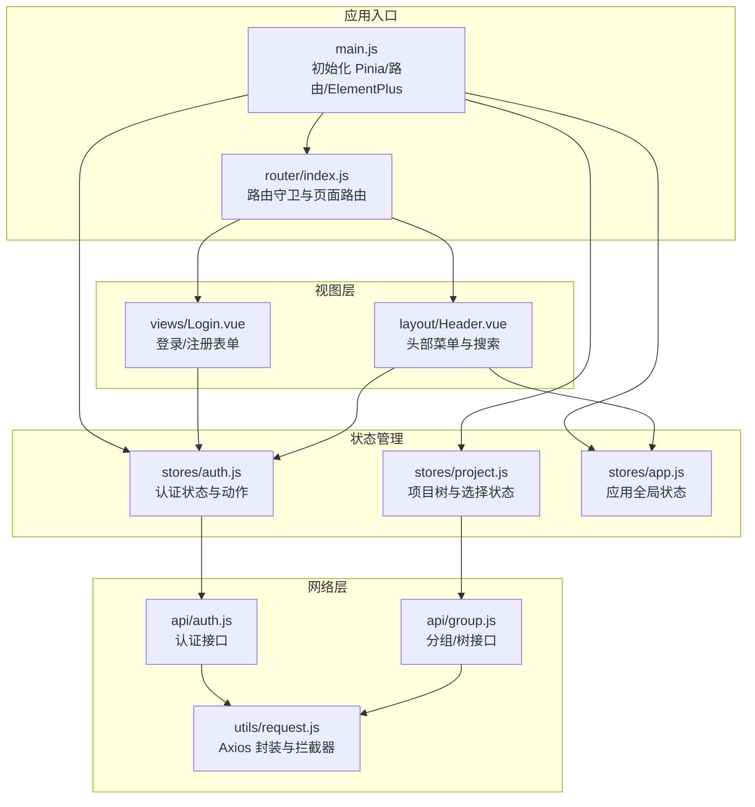
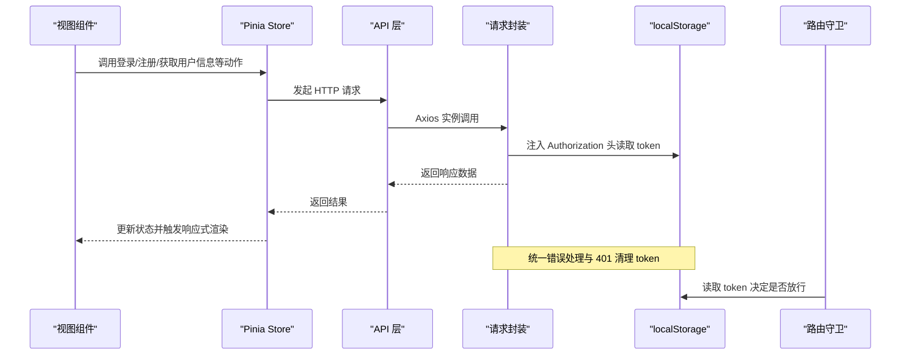
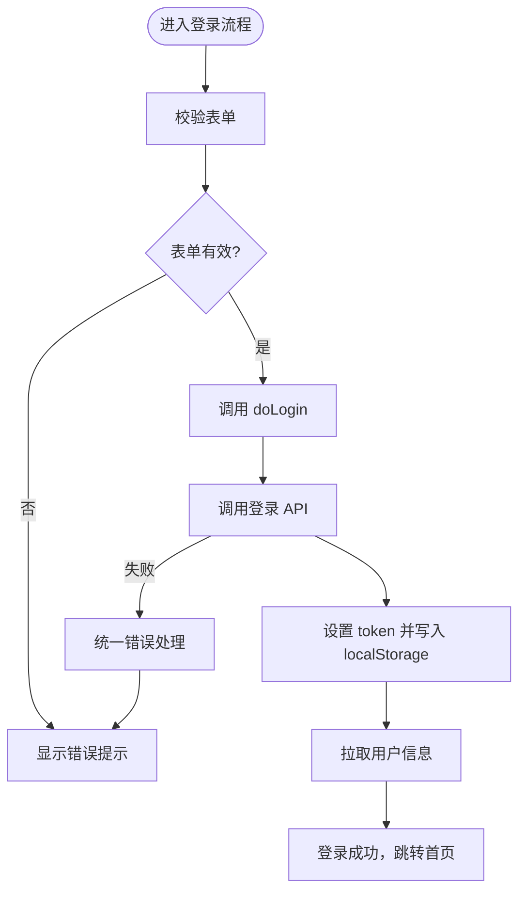
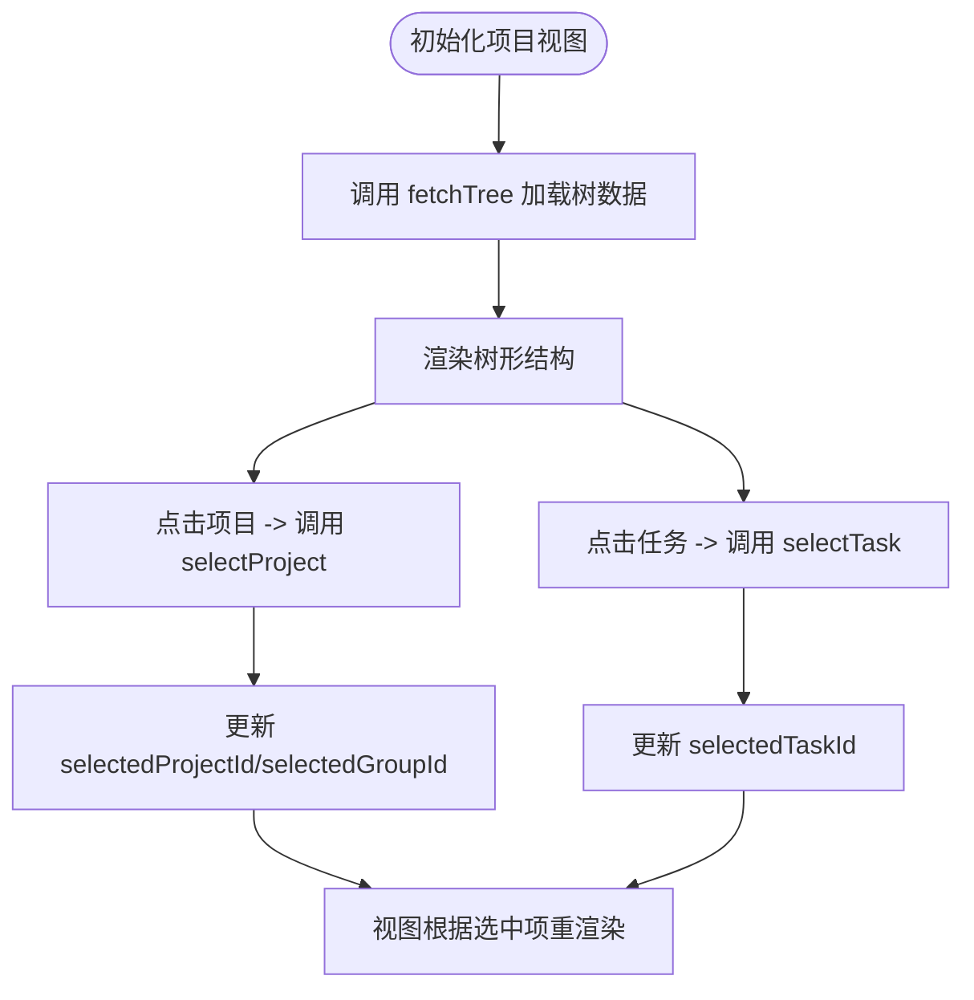
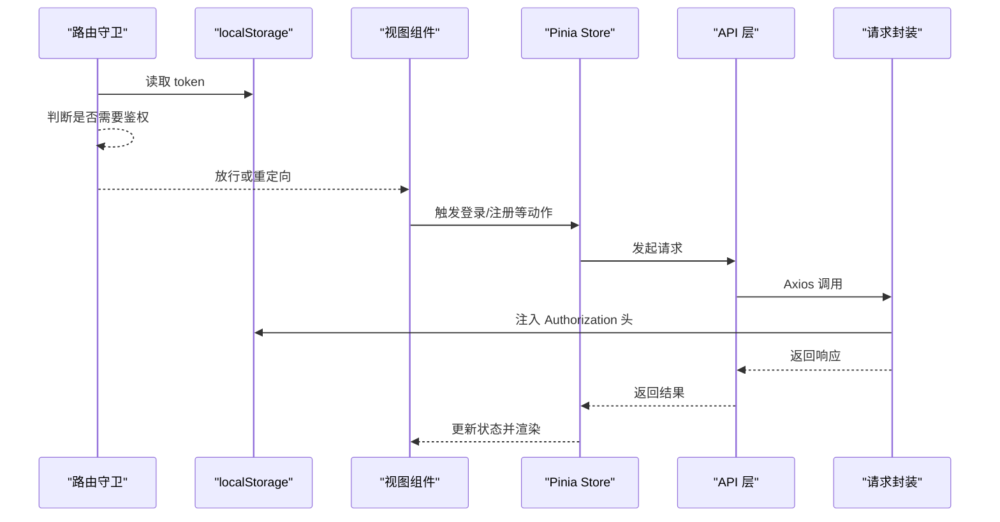
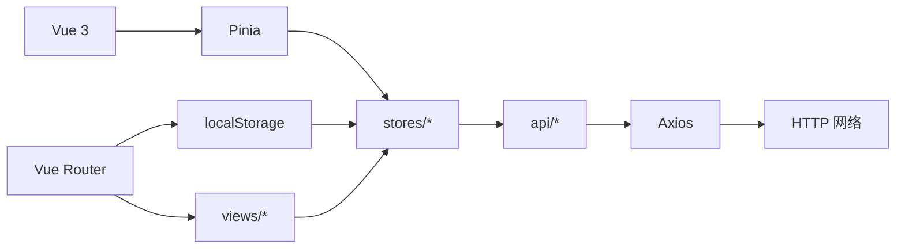

# 状态管理

<cite>
**本文引用的文件**
- [frontend/src/stores/auth.js](file://frontend/src/stores/auth.js)
- [frontend/src/stores/project.js](file://frontend/src/stores/project.js)
- [frontend/src/stores/app.js](file://frontend/src/stores/app.js)
- [frontend/src/main.js](file://frontend/src/main.js)
- [frontend/src/utils/request.js](file://frontend/src/utils/request.js)
- [frontend/src/api/auth.js](file://frontend/src/api/auth.js)
- [frontend/src/api/group.js](file://frontend/src/api/group.js)
- [frontend/src/views/Login.vue](file://frontend/src/views/Login.vue)
- [frontend/src/layout/Header.vue](file://frontend/src/layout/Header.vue)
- [frontend/src/router/index.js](file://frontend/src/router/index.js)
- [frontend/package.json](file://frontend/package.json)
</cite>

## 目录
1. [简介](#简介)
2. [项目结构](#项目结构)
3. [核心组件](#核心组件)
4. [架构总览](#架构总览)
5. [详细组件分析](#详细组件分析)
6. [依赖关系分析](#依赖关系分析)
7. [性能考虑](#性能考虑)
8. [故障排除指南](#故障排除指南)
9. [结论](#结论)
10. [附录](#附录)

## 简介
本指南围绕前端仓库中的 Pinia 状态管理实现进行系统性梳理，重点覆盖以下方面：
- Store 的设计理念与在 Vue 3 中的应用：如何通过组合式 API 定义 store、状态与 action 的组织方式
- 各模块功能详解：认证（auth）、项目树（project）、应用全局（app）的状态与行为
- 响应式更新机制：状态变更追踪、computed 属性使用、watch 监听器配置建议
- 异步 action 处理：API 调用、loading 状态、错误处理
- 状态持久化：localStorage 的使用策略
- 最佳实践：模块化设计、状态规范化、性能优化

本指南以实际源码为依据，避免臆测，确保读者能从零开始理解并扩展该状态管理方案。

## 项目结构
前端采用模块化目录组织，状态管理位于 stores 目录，配合 API 层、路由与视图层协同工作。核心入口在 main.js 中初始化 Pinia 并挂载应用；路由守卫结合 localStorage 实现鉴权控制；请求封装统一注入 token 并集中处理错误。

图表来源
- [frontend/src/main.js:1-22](file://frontend/src/main.js#L1-L22)
- [frontend/src/router/index.js:1-50](file://frontend/src/router/index.js#L1-L50)
- [frontend/src/stores/auth.js:1-41](file://frontend/src/stores/auth.js#L1-L41)
- [frontend/src/stores/project.js:1-26](file://frontend/src/stores/project.js#L1-L26)
- [frontend/src/stores/app.js:1-18](file://frontend/src/stores/app.js#L1-L18)
- [frontend/src/utils/request.js:1-56](file://frontend/src/utils/request.js#L1-L56)
- [frontend/src/api/auth.js:1-14](file://frontend/src/api/auth.js#L1-L14)
- [frontend/src/api/group.js:1-22](file://frontend/src/api/group.js#L1-L22)
- [frontend/src/views/Login.vue:1-203](file://frontend/src/views/Login.vue#L1-L203)
- [frontend/src/layout/Header.vue:1-87](file://frontend/src/layout/Header.vue#L1-L87)

章节来源
- [frontend/src/main.js:1-22](file://frontend/src/main.js#L1-L22)
- [frontend/src/router/index.js:1-50](file://frontend/src/router/index.js#L1-L50)

## 核心组件
本项目包含三个核心 store：认证（auth）、项目树（project）、应用全局（app）。它们均采用组合式 API 的 defineStore 形式，返回响应式状态与动作函数，便于在组件中直接解构使用。

- 认证 store（auth）
  - 状态：token、user
  - 动作：doLogin、doRegister、fetchUserInfo、logout、setToken、isLoggedIn
  - 特点：基于 localStorage 持久化 token，登录后拉取用户信息，登出时清理 token

- 项目 store（project）
  - 状态：treeData、selectedProjectId、selectedGroupId、selectedTaskId
  - 动作：fetchTree、selectProject、selectTask
  - 特点：负责项目树数据与当前选中项状态，支持按项目或任务切换

- 应用 store（app）
  - 状态：sidebarCollapsed、searchKeyword
  - 动作：toggleSidebar、setSearchKeyword
  - 特点：管理侧边栏折叠与全局搜索关键词

章节来源
- [frontend/src/stores/auth.js:1-41](file://frontend/src/stores/auth.js#L1-L41)
- [frontend/src/stores/project.js:1-26](file://frontend/src/stores/project.js#L1-L26)
- [frontend/src/stores/app.js:1-18](file://frontend/src/stores/app.js#L1-L18)

## 架构总览
下图展示从视图到状态管理再到 API 的完整调用链路，以及鉴权与错误处理的关键节点。

图表来源
- [frontend/src/views/Login.vue:125-157](file://frontend/src/views/Login.vue#L125-L157)
- [frontend/src/stores/auth.js:16-31](file://frontend/src/stores/auth.js#L16-L31)
- [frontend/src/api/auth.js:1-14](file://frontend/src/api/auth.js#L1-L14)
- [frontend/src/utils/request.js:9-53](file://frontend/src/utils/request.js#L9-L53)
- [frontend/src/router/index.js:38-47](file://frontend/src/router/index.js#L38-L47)

## 详细组件分析

### 认证 store（auth）
- 设计理念
  - 使用组合式 API 定义 store，返回状态与动作，便于在组件中直接解构使用
  - 通过 ref 创建响应式状态，动作内部完成 token 持久化与用户信息拉取
- 关键状态与动作
  - 状态：token、user
  - 动作：doLogin、doRegister、fetchUserInfo、logout、setToken、isLoggedIn
- 响应式与持久化
  - 登录成功后 setToken 将 token 写入 localStorage，并同步到 store
  - fetchUserInfo 拉取用户信息并写入 user
  - logout 清空 token 与 user，并移除 localStorage 中的 token
- 错误处理
  - 登录/注册/获取用户信息等异步动作在组件中捕获错误并提示
  - 请求封装统一处理非 200 状态码与 401 场景，自动清理 token 并跳转登录页

图表来源
- [frontend/src/views/Login.vue:125-157](file://frontend/src/views/Login.vue#L125-L157)
- [frontend/src/stores/auth.js:16-31](file://frontend/src/stores/auth.js#L16-L31)
- [frontend/src/utils/request.js:21-53](file://frontend/src/utils/request.js#L21-L53)

章节来源
- [frontend/src/stores/auth.js:1-41](file://frontend/src/stores/auth.js#L1-L41)
- [frontend/src/views/Login.vue:125-157](file://frontend/src/views/Login.vue#L125-L157)
- [frontend/src/utils/request.js:1-56](file://frontend/src/utils/request.js#L1-L56)

### 项目 store（project）
- 设计理念
  - 专注于项目树数据与当前选中项状态，动作简洁明确，便于在视图中切换项目/任务
- 关键状态与动作
  - 状态：treeData、selectedProjectId、selectedGroupId、selectedTaskId
  - 动作：fetchTree、selectProject、selectTask
- 数据流
  - fetchTree 通过 API 获取树形数据并写入 treeData
  - selectProject/selectTask 更新当前选中项，供视图层高亮与导航使用

图表来源
- [frontend/src/stores/project.js:11-24](file://frontend/src/stores/project.js#L11-L24)
- [frontend/src/api/group.js:7-9](file://frontend/src/api/group.js#L7-L9)

章节来源
- [frontend/src/stores/project.js:1-26](file://frontend/src/stores/project.js#L1-L26)
- [frontend/src/api/group.js:1-22](file://frontend/src/api/group.js#L1-L22)

### 应用 store（app）
- 设计理念
  - 提供应用级的轻量状态，如侧边栏折叠与全局搜索关键词
- 关键状态与动作
  - 状态：sidebarCollapsed、searchKeyword
  - 动作：toggleSidebar、setSearchKeyword
- 使用场景
  - Header 组件通过 appStore 控制侧边栏折叠
  - 搜索框绑定 searchKeyword，用于跨组件通信或事件派发

章节来源
- [frontend/src/stores/app.js:1-18](file://frontend/src/stores/app.js#L1-L18)
- [frontend/src/layout/Header.vue:4-53](file://frontend/src/layout/Header.vue#L4-L53)

### 网络层与鉴权
- 请求封装（utils/request.js）
  - 创建 Axios 实例，设置基础路径与超时
  - 请求拦截器：从 localStorage 读取 token 并注入 Authorization 头
  - 响应拦截器：统一处理非 200 状态码与常见 HTTP 错误，401 自动清理 token 并跳转登录页
- 鉴权守卫（router/index.js）
  - 在路由守卫中读取 localStorage 中的 token，决定是否放行
  - 登录页与受保护页面之间进行跳转控制

图表来源
- [frontend/src/router/index.js:38-47](file://frontend/src/router/index.js#L38-L47)
- [frontend/src/utils/request.js:9-53](file://frontend/src/utils/request.js#L9-L53)
- [frontend/src/stores/auth.js:16-31](file://frontend/src/stores/auth.js#L16-L31)

章节来源
- [frontend/src/utils/request.js:1-56](file://frontend/src/utils/request.js#L1-L56)
- [frontend/src/router/index.js:1-50](file://frontend/src/router/index.js#L1-L50)

## 依赖关系分析
- 模块耦合
  - 视图层仅依赖对应 store，store 依赖 API 层，API 层依赖请求封装
  - 路由守卫与 localStorage 协同实现鉴权，避免在业务逻辑中重复处理
- 外部依赖
  - Pinia：提供响应式 store 与 devtools 支持
  - Element Plus：UI 组件与消息提示
  - Axios：HTTP 请求封装与拦截器
  - Vue Router：路由与鉴权守卫

图表来源
- [frontend/src/main.js:1-22](file://frontend/src/main.js#L1-L22)
- [frontend/src/stores/auth.js:1-41](file://frontend/src/stores/auth.js#L1-L41)
- [frontend/src/stores/project.js:1-26](file://frontend/src/stores/project.js#L1-L26)
- [frontend/src/stores/app.js:1-18](file://frontend/src/stores/app.js#L1-L18)
- [frontend/src/api/auth.js:1-14](file://frontend/src/api/auth.js#L1-L14)
- [frontend/src/api/group.js:1-22](file://frontend/src/api/group.js#L1-L22)
- [frontend/src/utils/request.js:1-56](file://frontend/src/utils/request.js#L1-L56)
- [frontend/src/router/index.js:1-50](file://frontend/src/router/index.js#L1-L50)

章节来源
- [frontend/package.json:11-24](file://frontend/package.json#L11-L24)

## 性能考虑
- 响应式粒度
  - 将大对象拆分为细粒度状态，减少不必要的重渲染
  - 对于只读数据可使用只读 ref 或计算属性
- 异步操作
  - 在组件中使用 loading 状态避免重复提交
  - 合理缓存 API 结果，避免频繁重复请求
- 存储策略
  - localStorage 仅存储必要字段（如 token），避免存储大型对象
  - 对于复杂状态，优先使用内存 store，必要时再持久化关键字段
- 组件更新
  - 使用 shallowRef/shallowReactive 仅在确有必要时提升性能
  - 避免在模板中直接调用昂贵的计算属性或动作

## 故障排除指南
- 登录后无法访问受保护页面
  - 检查路由守卫是否正确读取 localStorage 中的 token
  - 确认登录动作是否成功写入 token 并触发用户信息拉取
- 401 未自动跳转登录页
  - 检查请求拦截器是否正确注入 Authorization 头
  - 确认响应拦截器对 401 的处理逻辑是否执行（清理 token 并跳转）
- 用户信息未更新
  - 确认登录后是否调用了 fetchUserInfo
  - 检查 getUserInfo 接口返回的数据结构是否符合预期
- 侧边栏状态不同步
  - 确认 Header 组件是否正确使用 appStore 的 toggleSidebar
  - 检查组件是否正确响应 store 的变化

章节来源
- [frontend/src/router/index.js:38-47](file://frontend/src/router/index.js#L38-L47)
- [frontend/src/utils/request.js:32-47](file://frontend/src/utils/request.js#L32-L47)
- [frontend/src/stores/auth.js:16-31](file://frontend/src/stores/auth.js#L16-L31)
- [frontend/src/layout/Header.vue:4-53](file://frontend/src/layout/Header.vue#L4-L53)

## 结论
本项目采用组合式 API 的 Pinia store，实现了清晰的模块化状态管理：认证、项目树与应用全局状态分别独立维护，配合统一的请求封装与路由鉴权守卫，形成从视图到状态再到 API 的完整闭环。通过 localStorage 持久化 token，结合响应式更新机制，保证了良好的用户体验与开发体验。建议在后续迭代中进一步规范化状态结构、引入更细粒度的缓存策略与错误边界，并持续优化性能与可维护性。

## 附录
- 状态持久化最佳实践
  - 仅持久化必要字段（如 token），避免存储大型对象
  - 对于复杂状态，优先使用内存 store，必要时再持久化关键字段
  - 在应用启动时从 localStorage 初始化 store，避免重复请求
- 模块化设计建议
  - 将 store 按领域划分（如用户、项目、任务），保持单一职责
  - 动作命名语义化，避免在 store 内处理 UI 逻辑
- 性能优化建议
  - 使用浅拷贝与不可变更新，减少深拷贝开销
  - 合理使用计算属性与懒加载，避免在模板中执行复杂逻辑
  - 对高频更新的状态进行节流或防抖