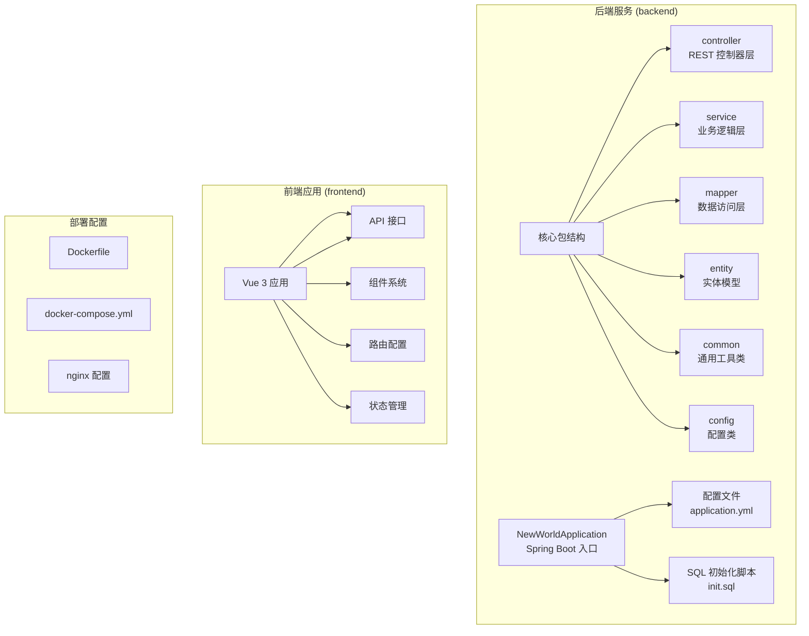
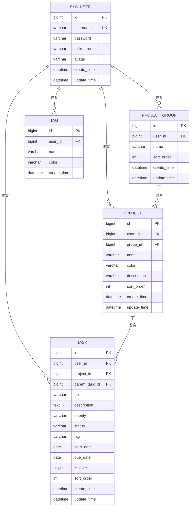
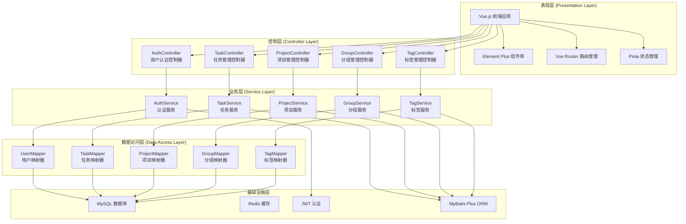
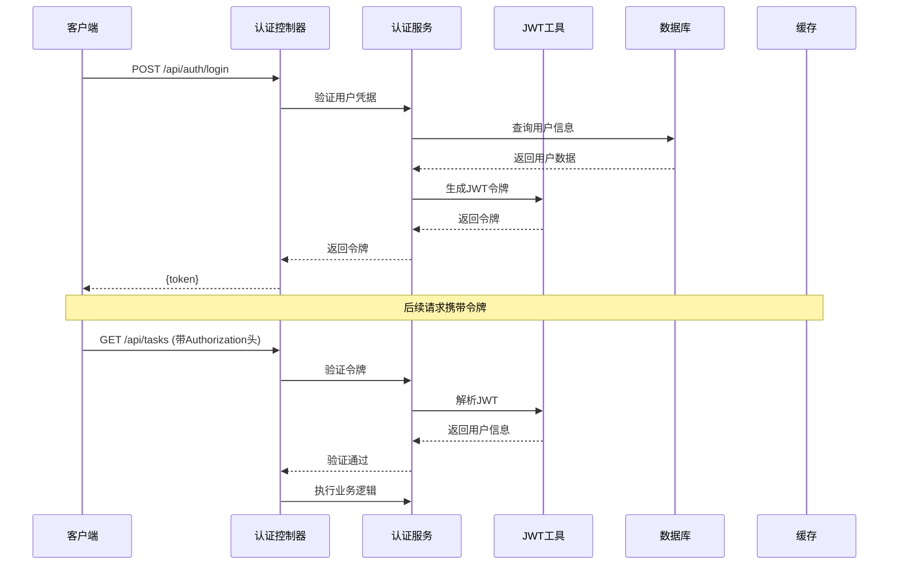
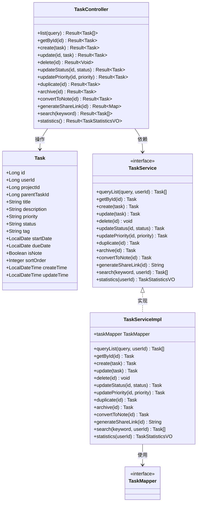
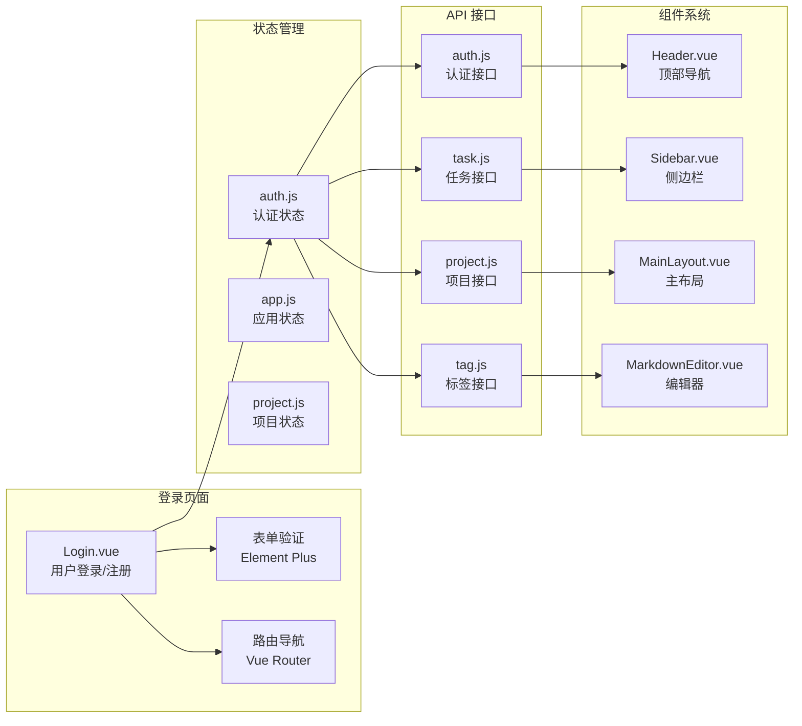

# 笔记管理系统

<cite>
**本文档引用的文件**
- [NewWorldApplication.java](file://backend/src/main/java/com/newworld/NewWorldApplication.java)
- [pom.xml](file://backend/pom.xml)
- [init.sql](file://backend/sql/init.sql)
- [application.yml](file://backend/src/main/resources/application.yml)
- [Task.java](file://backend/src/main/java/com/newworld/entity/Task.java)
- [TaskController.java](file://backend/src/main/java/com/newworld/controller/TaskController.java)
- [TaskService.java](file://backend/src/main/java/com/newworld/service/TaskService.java)
- [TaskServiceImpl.java](file://backend/src/main/java/com/newworld/service/impl/TaskServiceImpl.java)
- [TaskMapper.java](file://backend/src/main/java/com/newworld/mapper/TaskMapper.java)
- [User.java](file://backend/src/main/java/com/newworld/entity/User.java)
- [AuthController.java](file://backend/src/main/java/com/newworld/controller/AuthController.java)
- [JwtUtil.java](file://backend/src/main/java/com/newworld/common/JwtUtil.java)
- [AuthInterceptor.java](file://backend/src/main/java/com/newworld/config/AuthInterceptor.java)
- [Login.vue](file://frontend/src/views/Login.vue)
- [package.json](file://frontend/package.json)
</cite>

## 目录
1. [简介](#简介)
2. [项目结构](#项目结构)
3. [核心组件](#核心组件)
4. [架构概览](#架构概览)
5. [详细组件分析](#详细组件分析)
6. [依赖分析](#依赖分析)
7. [性能考虑](#性能考虑)
8. [故障排除指南](#故障排除指南)
9. [结论](#结论)

## 简介

NewWorld 是一个基于 Spring Boot 和 Vue.js 开发的个人工作计划管理与笔记管理系统。该系统提供了完整的任务管理、项目分组、标签管理和用户认证功能，支持任务与笔记的灵活切换，并具备数据导出等实用功能。

系统采用前后端分离架构，后端使用 Java Spring Boot 技术栈，前端使用 Vue 3 + Element Plus 构建现代化的用户界面。数据库采用 MySQL，配合 MyBatis-Plus 进行数据持久化操作。

## 项目结构

项目采用标准的 Maven 多模块结构，分为后端服务和前端应用两个主要部分：



**图表来源**
- [NewWorldApplication.java:1-13](file://backend/src/main/java/com/newworld/NewWorldApplication.java#L1-L13)
- [application.yml:1-75](file://backend/src/main/resources/application.yml#L1-L75)

**章节来源**
- [NewWorldApplication.java:1-13](file://backend/src/main/java/com/newworld/NewWorldApplication.java#L1-L13)
- [pom.xml:1-117](file://backend/pom.xml#L1-L117)
- [application.yml:1-75](file://backend/src/main/resources/application.yml#L1-L75)

## 核心组件

### 数据模型设计

系统采用关系型数据库设计，核心数据模型包括用户、项目分组、项目、任务和标签五个主要实体：



**图表来源**
- [init.sql:8-95](file://backend/sql/init.sql#L8-L95)

### 任务管理核心功能

系统的核心是任务管理功能，支持完整的任务生命周期管理：

- **任务状态管理**：支持 INCOMPLETE（未完成）、DONE（已完成）、SHELVED（已归档）
- **优先级管理**：支持 RED（紧急）、YELLOW（高优先级）、BLUE（普通）、FLAG（标记）、NONE（无）
- **笔记与任务切换**：通过 is_note 字段区分任务和笔记
- **搜索功能**：支持按标题和描述进行全文搜索

**章节来源**
- [Task.java:1-184](file://backend/src/main/java/com/newworld/entity/Task.java#L1-L184)
- [TaskController.java:1-112](file://backend/src/main/java/com/newworld/controller/TaskController.java#L1-L112)
- [TaskServiceImpl.java:1-202](file://backend/src/main/java/com/newworld/service/impl/TaskServiceImpl.java#L1-L202)

## 架构概览

系统采用经典的三层架构模式，结合现代微服务设计理念：



**图表来源**
- [AuthController.java:1-73](file://backend/src/main/java/com/newworld/controller/AuthController.java#L1-L73)
- [TaskController.java:1-112](file://backend/src/main/java/com/newworld/controller/TaskController.java#L1-L112)
- [TaskServiceImpl.java:1-202](file://backend/src/main/java/com/newworld/service/impl/TaskServiceImpl.java#L1-L202)
- [application.yml:1-75](file://backend/src/main/resources/application.yml#L1-L75)

## 详细组件分析

### 认证授权系统

系统采用 JWT（JSON Web Token）进行用户身份验证和授权管理：



**图表来源**
- [AuthController.java:27-34](file://backend/src/main/java/com/newworld/controller/AuthController.java#L27-L34)
- [JwtUtil.java:29-40](file://backend/src/main/java/com/newworld/common/JwtUtil.java#L29-L40)
- [AuthInterceptor.java:30-58](file://backend/src/main/java/com/newworld/config/AuthInterceptor.java#L30-L58)

系统的关键特性包括：

- **令牌生成**：使用 HS512 算法对用户ID和用户名进行签名
- **令牌验证**：自动验证令牌的有效性和过期时间
- **拦截器机制**：全局拦截所有受保护的 API 请求
- **线程安全**：使用 ThreadLocal 存储当前用户上下文

**章节来源**
- [JwtUtil.java:1-78](file://backend/src/main/java/com/newworld/common/JwtUtil.java#L1-L78)
- [AuthInterceptor.java:1-78](file://backend/src/main/java/com/newworld/config/AuthInterceptor.java#L1-L78)
- [AuthController.java:1-73](file://backend/src/main/java/com/newworld/controller/AuthController.java#L1-L73)

### 任务管理系统

任务管理是系统的核心功能，提供了完整的工作流管理能力：



**图表来源**
- [Task.java:1-184](file://backend/src/main/java/com/newworld/entity/Task.java#L1-L184)
- [TaskController.java:1-112](file://backend/src/main/java/com/newworld/controller/TaskController.java#L1-L112)
- [TaskService.java:1-76](file://backend/src/main/java/com/newworld/service/TaskService.java#L1-L76)
- [TaskServiceImpl.java:1-202](file://backend/src/main/java/com/newworld/service/impl/TaskServiceImpl.java#L1-L202)
- [TaskMapper.java:1-10](file://backend/src/main/java/com/newworld/mapper/TaskMapper.java#L1-L10)

系统支持的主要操作包括：

- **CRUD 操作**：完整的任务增删改查功能
- **状态管理**：动态更新任务状态和优先级
- **批量操作**：支持任务复制、归档和转换为笔记
- **搜索功能**：支持关键词搜索和高级筛选
- **统计分析**：提供任务完成情况的统计报表

**章节来源**
- [TaskController.java:1-112](file://backend/src/main/java/com/newworld/controller/TaskController.java#L1-L112)
- [TaskServiceImpl.java:1-202](file://backend/src/main/java/com/newworld/service/impl/TaskServiceImpl.java#L1-L202)
- [TaskService.java:1-76](file://backend/src/main/java/com/newworld/service/TaskService.java#L1-L76)

### 前端用户界面

前端采用现代化的 Vue 3 技术栈构建，提供了直观易用的用户界面：



**图表来源**
- [Login.vue:1-203](file://frontend/src/views/Login.vue#L1-L203)
- [package.json:1-31](file://frontend/package.json#L1-L31)

前端技术栈包括：

- **Vue 3 + Composition API**：现代化的响应式开发
- **Element Plus**：丰富的 UI 组件库
- **Vue Router**：客户端路由管理
- **Pinia**：状态管理
- **Axios**：HTTP 请求处理
- **Marked**：Markdown 渲染

**章节来源**
- [Login.vue:1-203](file://frontend/src/views/Login.vue#L1-L203)
- [package.json:1-31](file://frontend/package.json#L1-L31)

## 依赖分析

系统采用 Maven 作为构建工具，依赖管理清晰明确：

```mermaid
graph TB
subgraph "Spring Boot 生态"
A[Spring Boot Starter Web<br/>Web 应用基础]
B[Spring Boot Starter Data Redis<br/>Redis 缓存]
C[Spring Boot Starter Validation<br/>数据验证]
D[MyBatis-Plus Boot Starter<br/>ORM 框架]
end
subgraph "第三方库"
E[Knife4j OpenAPI<br/>API 文档]
F[Hutool 工具库<br/>Java 工具集]
G[EasyExcel<br/>Excel 处理]
H[JWT (JJWT)<br/>令牌处理]
I[Lombok<br/>简化代码]
end
subgraph "数据库相关"
J[MySQL Connector/J<br/>数据库驱动]
end
subgraph "前端依赖"
K[@element-plus/icons-vue<br/>图标]
L[@fullcalendar/*<br/>日历组件]
M[axios<br/>HTTP 客户端]
N[pinia<br/>状态管理]
O[vue-router<br/>路由]
end
A --> D
A --> E
A --> F
A --> G
A --> H
A --> I
A --> J
K --> M
K --> N
K --> O
```

**图表来源**
- [pom.xml:31-96](file://backend/pom.xml#L31-L96)
- [package.json:11-29](file://frontend/package.json#L11-L29)

**章节来源**
- [pom.xml:1-117](file://backend/pom.xml#L1-L117)
- [package.json:1-31](file://frontend/package.json#L1-L31)

## 性能考虑

系统在设计时充分考虑了性能优化：

### 数据库优化
- **索引策略**：为常用查询字段建立复合索引
- **查询优化**：使用 MyBatis-Plus 的条件构造器进行高效查询
- **连接池配置**：合理配置数据库连接池参数

### 缓存策略
- **Redis 缓存**：用于存储用户会话和热点数据
- **查询缓存**：减少重复查询的数据库压力

### 并发处理
- **线程安全**：使用 ThreadLocal 确保用户上下文的线程安全
- **异步处理**：对于耗时操作采用异步处理方式

## 故障排除指南

### 常见问题及解决方案

**认证相关问题**
- **401 未授权错误**：检查 JWT 令牌是否正确传递和格式是否正确
- **令牌过期**：重新登录获取新的访问令牌
- **跨域问题**：检查 CORS 配置和预检请求处理

**数据库连接问题**
- **连接超时**：检查数据库连接字符串和网络连通性
- **连接池耗尽**：调整连接池大小和超时配置
- **SQL 异常**：检查 SQL 语句和数据类型匹配

**前端交互问题**
- **页面空白**：检查 API 端点和网络请求
- **组件渲染异常**：检查 Vue 组件的 props 和事件绑定
- **状态同步问题**：检查 Pinia 状态管理和响应式更新

**章节来源**
- [AuthInterceptor.java:37-49](file://backend/src/main/java/com/newworld/config/AuthInterceptor.java#L37-L49)
- [application.yml:11-30](file://backend/src/main/resources/application.yml#L11-L30)

## 结论

NewWorld 笔记管理系统是一个功能完善、架构清晰的现代化应用。系统采用前后端分离的设计模式，结合 Spring Boot 和 Vue.js 技术栈，提供了优秀的用户体验和良好的可维护性。

系统的主要优势包括：

1. **完整的功能覆盖**：从用户认证到任务管理的全流程支持
2. **现代化的技术栈**：采用最新的前端和后端技术
3. **良好的扩展性**：模块化的架构便于功能扩展
4. **完善的文档**：基于 Knife4j 的 API 文档和注释
5. **生产就绪**：包含 Docker 部署配置和 Nginx 反向代理

未来可以考虑的功能增强方向：
- 添加任务依赖关系管理
- 实现任务评论和协作功能
- 增强数据导入导出功能
- 添加移动端应用支持
- 实现任务提醒和通知系统