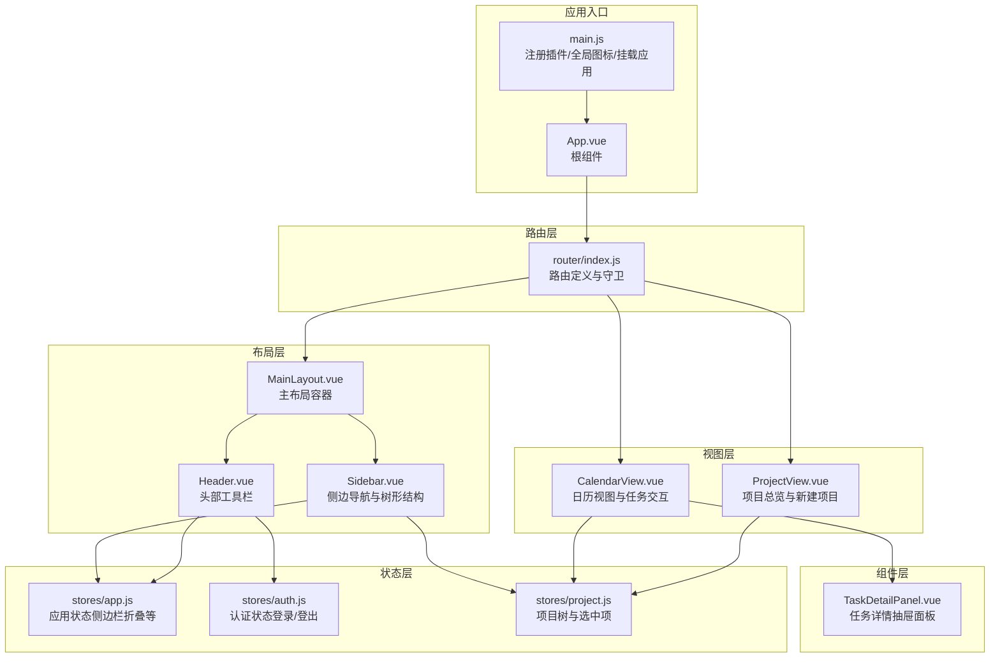
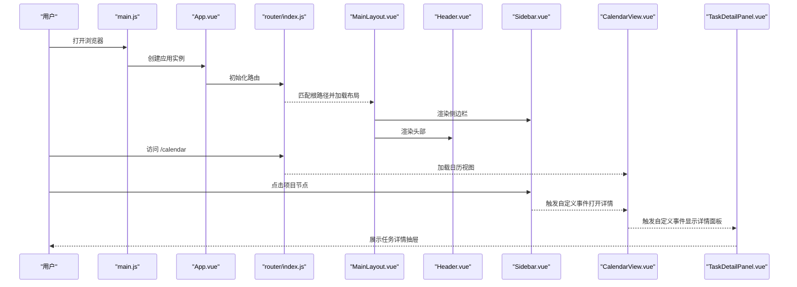
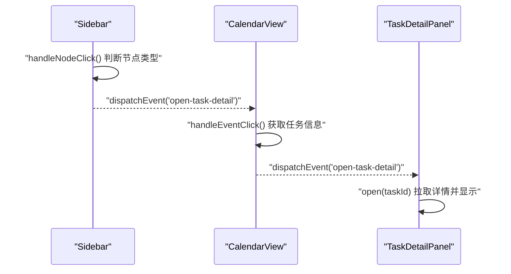
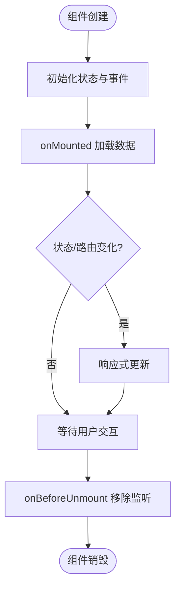
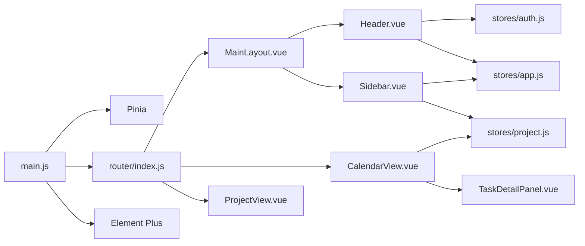

# 组件系统

<cite>
**本文引用的文件**
- [frontend/src/layout/MainLayout.vue](file://frontend/src/layout/MainLayout.vue)
- [frontend/src/layout/Header.vue](file://frontend/src/layout/Header.vue)
- [frontend/src/layout/Sidebar.vue](file://frontend/src/layout/Sidebar.vue)
- [frontend/src/components/task/TaskDetailPanel.vue](file://frontend/src/components/task/TaskDetailPanel.vue)
- [frontend/src/views/CalendarView.vue](file://frontend/src/views/CalendarView.vue)
- [frontend/src/views/ProjectView.vue](file://frontend/src/views/ProjectView.vue)
- [frontend/src/stores/app.js](file://frontend/src/stores/app.js)
- [frontend/src/stores/auth.js](file://frontend/src/stores/auth.js)
- [frontend/src/stores/project.js](file://frontend/src/stores/project.js)
- [frontend/src/router/index.js](file://frontend/src/router/index.js)
- [frontend/src/main.js](file://frontend/src/main.js)
- [frontend/src/App.vue](file://frontend/src/App.vue)
</cite>

## 目录
1. [引言](#引言)
2. [项目结构](#项目结构)
3. [核心组件](#核心组件)
4. [架构总览](#架构总览)
5. [详细组件分析](#详细组件分析)
6. [依赖关系分析](#依赖关系分析)
7. [性能考虑](#性能考虑)
8. [故障排查指南](#故障排查指南)
9. [结论](#结论)
10. [附录](#附录)

## 引言
本指南面向希望系统化掌握该Vue前端组件体系的开发者与产品同学，围绕以下目标展开：  
- 明确组件分类与设计原则（布局组件、业务组件、通用组件）  
- 解释组件间通信方式（props、事件、provide/inject 的替代实践）  
- 说明生命周期管理（创建、挂载、更新、销毁）  
- 提供复用性设计（可配置参数、插槽、作用域插槽）  
- 总结最佳实践（命名规范、文件组织、样式管理、文档编写）

## 项目结构
前端采用“布局层-视图层-组件层-状态层-路由层”的分层组织方式，配合Pinia状态管理与Element Plus UI库，形成清晰的职责边界。



图表来源
- [frontend/src/main.js:1-22](file://frontend/src/main.js#L1-L22)
- [frontend/src/App.vue:1-16](file://frontend/src/App.vue#L1-L16)
- [frontend/src/router/index.js:1-50](file://frontend/src/router/index.js#L1-L50)
- [frontend/src/layout/MainLayout.vue:1-39](file://frontend/src/layout/MainLayout.vue#L1-L39)
- [frontend/src/layout/Header.vue:1-87](file://frontend/src/layout/Header.vue#L1-L87)
- [frontend/src/layout/Sidebar.vue:1-250](file://frontend/src/layout/Sidebar.vue#L1-L250)
- [frontend/src/views/CalendarView.vue:1-451](file://frontend/src/views/CalendarView.vue#L1-L451)
- [frontend/src/views/ProjectView.vue:1-130](file://frontend/src/views/ProjectView.vue#L1-L130)
- [frontend/src/components/task/TaskDetailPanel.vue:1-169](file://frontend/src/components/task/TaskDetailPanel.vue#L1-L169)
- [frontend/src/stores/app.js:1-18](file://frontend/src/stores/app.js#L1-L18)
- [frontend/src/stores/auth.js:1-41](file://frontend/src/stores/auth.js#L1-L41)
- [frontend/src/stores/project.js:1-26](file://frontend/src/stores/project.js#L1-L26)

章节来源
- [frontend/src/main.js:1-22](file://frontend/src/main.js#L1-L22)
- [frontend/src/App.vue:1-16](file://frontend/src/App.vue#L1-L16)
- [frontend/src/router/index.js:1-50](file://frontend/src/router/index.js#L1-L50)

## 核心组件
本项目的核心组件分为三类：  
- 布局组件：MainLayout、Sidebar、Header，负责整体页面骨架与导航  
- 业务组件：CalendarView、ProjectView、TaskDetailPanel，承载具体业务逻辑与数据流  
- 通用组件：以Element Plus为基础的按钮、输入框、对话框、树形控件等，作为通用UI原子能力

设计原则
- 单一职责：每个组件只负责一个明确的功能域  
- 可组合性：通过插槽与事件实现灵活组合  
- 可配置性：通过属性与方法暴露必要的可变参数  
- 可测试性：尽量减少副作用，便于单元测试与集成测试

章节来源
- [frontend/src/layout/MainLayout.vue:1-39](file://frontend/src/layout/MainLayout.vue#L1-L39)
- [frontend/src/layout/Header.vue:1-87](file://frontend/src/layout/Header.vue#L1-L87)
- [frontend/src/layout/Sidebar.vue:1-250](file://frontend/src/layout/Sidebar.vue#L1-L250)
- [frontend/src/views/CalendarView.vue:1-451](file://frontend/src/views/CalendarView.vue#L1-L451)
- [frontend/src/views/ProjectView.vue:1-130](file://frontend/src/views/ProjectView.vue#L1-L130)
- [frontend/src/components/task/TaskDetailPanel.vue:1-169](file://frontend/src/components/task/TaskDetailPanel.vue#L1-L169)

## 架构总览
下图展示从应用启动到页面渲染、状态驱动与事件交互的整体流程。



图表来源
- [frontend/src/main.js:1-22](file://frontend/src/main.js#L1-L22)
- [frontend/src/App.vue:1-16](file://frontend/src/App.vue#L1-L16)
- [frontend/src/router/index.js:1-50](file://frontend/src/router/index.js#L1-L50)
- [frontend/src/layout/MainLayout.vue:1-39](file://frontend/src/layout/MainLayout.vue#L1-L39)
- [frontend/src/layout/Header.vue:1-87](file://frontend/src/layout/Header.vue#L1-L87)
- [frontend/src/layout/Sidebar.vue:117-127](file://frontend/src/layout/Sidebar.vue#L117-L127)
- [frontend/src/views/CalendarView.vue:259-265](file://frontend/src/views/CalendarView.vue#L259-L265)
- [frontend/src/components/task/TaskDetailPanel.vue:80-84](file://frontend/src/components/task/TaskDetailPanel.vue#L80-L84)

## 详细组件分析

### 布局组件：MainLayout、Sidebar、Header
- MainLayout：作为页面容器，协调侧边栏与内容区，内部包含Header与router-view，统一管理高度与滚动区域  
- Sidebar：负责项目树、快捷统计、上下文菜单与分组操作；通过项目状态存储与路由联动  
- Header：提供搜索、导航与用户下拉菜单；通过应用状态控制侧边栏折叠

组件间通信
- Props：子组件接收来自父组件的状态或配置（如树形控件的props映射）  
- 事件：Header通过自定义事件向全局广播搜索关键词；Sidebar通过自定义事件通知打开任务详情  
- 依赖注入：当前项目未使用provide/inject，而是通过全局事件与Pinia共享状态

生命周期管理
- onMounted：加载初始数据（项目树、统计数据）  
- onBeforeUnmount：清理事件监听器，避免内存泄漏

```mermaid
classDiagram
class MainLayout {
+模板 : "侧边栏 + 主区域"
+样式 : "flex布局, 高度100vh"
}
class Sidebar {
+状态 : "treeData, stats, contextMenu"
+行为 : "fetchTree(), handleNodeClick(), handleContextMenu()"
+事件 : "open-task-detail"
}
class Header {
+状态 : "searchKeyword"
+行为 : "doSearch(), handleCommand()"
+事件 : "search-tasks"
}
MainLayout --> Sidebar : "包含"
MainLayout --> Header : "包含"
Sidebar --> "全局事件" : "dispatchEvent"
Header --> "全局事件" : "dispatchEvent"
```

图表来源
- [frontend/src/layout/MainLayout.vue:1-39](file://frontend/src/layout/MainLayout.vue#L1-L39)
- [frontend/src/layout/Sidebar.vue:90-182](file://frontend/src/layout/Sidebar.vue#L90-L182)
- [frontend/src/layout/Header.vue:43-67](file://frontend/src/layout/Header.vue#L43-L67)

章节来源
- [frontend/src/layout/MainLayout.vue:1-39](file://frontend/src/layout/MainLayout.vue#L1-L39)
- [frontend/src/layout/Sidebar.vue:1-250](file://frontend/src/layout/Sidebar.vue#L1-L250)
- [frontend/src/layout/Header.vue:1-87](file://frontend/src/layout/Header.vue#L1-L87)

### 业务组件：CalendarView、ProjectView、TaskDetailPanel
- CalendarView：基于FullCalendar的可视化日程视图，支持拖拽、调整大小、右键菜单、任务表单  
- ProjectView：项目卡片展示与新建项目对话框，支持按分组聚合与统计  
- TaskDetailPanel：任务详情抽屉面板，支持编辑与删除，通过Teleport提升层级

组件间通信
- 全局事件：CalendarView与Sidebar均通过window自定义事件进行跨组件通信  
- 路由参数：Sidebar根据项目ID跳转至日历视图并携带查询参数  
- Pinia状态：多个组件共享项目树与选中项状态



图表来源
- [frontend/src/layout/Sidebar.vue:117-127](file://frontend/src/layout/Sidebar.vue#L117-L127)
- [frontend/src/views/CalendarView.vue:259-265](file://frontend/src/views/CalendarView.vue#L259-L265)
- [frontend/src/components/task/TaskDetailPanel.vue:80-112](file://frontend/src/components/task/TaskDetailPanel.vue#L80-L112)

章节来源
- [frontend/src/views/CalendarView.vue:1-451](file://frontend/src/views/CalendarView.vue#L1-L451)
- [frontend/src/views/ProjectView.vue:1-130](file://frontend/src/views/ProjectView.vue#L1-L130)
- [frontend/src/components/task/TaskDetailPanel.vue:1-169](file://frontend/src/components/task/TaskDetailPanel.vue#L1-L169)

### 生命周期管理
- 创建：组件初始化状态与响应式数据（如ref/reactive）  
- 挂载：onMounted中发起异步请求（加载项目树、统计数据、任务列表）  
- 更新：通过Pinia状态变更触发响应式更新；路由变化时刷新筛选条件  
- 销毁：onBeforeUnmount中移除全局事件监听，防止内存泄漏



图表来源
- [frontend/src/layout/Sidebar.vue:178-182](file://frontend/src/layout/Sidebar.vue#L178-L182)
- [frontend/src/views/CalendarView.vue:417-429](file://frontend/src/views/CalendarView.vue#L417-L429)
- [frontend/src/components/task/TaskDetailPanel.vue:106-112](file://frontend/src/components/task/TaskDetailPanel.vue#L106-L112)

章节来源
- [frontend/src/layout/Sidebar.vue:90-182](file://frontend/src/layout/Sidebar.vue#L90-L182)
- [frontend/src/views/CalendarView.vue:104-429](file://frontend/src/views/CalendarView.vue#L104-L429)
- [frontend/src/components/task/TaskDetailPanel.vue:55-112](file://frontend/src/components/task/TaskDetailPanel.vue#L55-L112)

### 复用性设计
- 可配置参数：通过属性传入（如树形控件的props映射），在Sidebar中体现  
- 插槽与作用域插槽：CalendarView中对FullCalendar事件钩子扩展，实现右键菜单与优先级设置  
- Teleport：TaskDetailPanel与日历右键菜单通过Teleport脱离父容器，提升层级与交互体验  
- 全局事件：跨组件解耦通信，降低耦合度，提高复用性

章节来源
- [frontend/src/layout/Sidebar.vue:108-115](file://frontend/src/layout/Sidebar.vue#L108-L115)
- [frontend/src/views/CalendarView.vue:234-247](file://frontend/src/views/CalendarView.vue#L234-L247)
- [frontend/src/components/task/TaskDetailPanel.vue:2-52](file://frontend/src/components/task/TaskDetailPanel.vue#L2-L52)

## 依赖关系分析
- 应用入口依赖：main.js注册Pinia、路由、Element Plus与全局图标  
- 路由依赖：router/index.js定义嵌套路由与鉴权守卫  
- 布局依赖：MainLayout依赖Header与Sidebar；Sidebar依赖项目状态存储；Header依赖认证状态存储  
- 视图依赖：CalendarView依赖项目选项与任务API；TaskDetailPanel依赖任务API  
- 事件依赖：Sidebar与CalendarView之间通过全局事件解耦



图表来源
- [frontend/src/main.js:1-22](file://frontend/src/main.js#L1-L22)
- [frontend/src/router/index.js:1-50](file://frontend/src/router/index.js#L1-L50)
- [frontend/src/layout/MainLayout.vue:1-39](file://frontend/src/layout/MainLayout.vue#L1-L39)
- [frontend/src/layout/Header.vue:46-52](file://frontend/src/layout/Header.vue#L46-L52)
- [frontend/src/layout/Sidebar.vue:94-102](file://frontend/src/layout/Sidebar.vue#L94-L102)
- [frontend/src/views/CalendarView.vue:124-125](file://frontend/src/views/CalendarView.vue#L124-L125)
- [frontend/src/components/task/TaskDetailPanel.vue:57-58](file://frontend/src/components/task/TaskDetailPanel.vue#L57-L58)

章节来源
- [frontend/src/main.js:1-22](file://frontend/src/main.js#L1-L22)
- [frontend/src/router/index.js:1-50](file://frontend/src/router/index.js#L1-L50)
- [frontend/src/stores/app.js:1-18](file://frontend/src/stores/app.js#L1-L18)
- [frontend/src/stores/auth.js:1-41](file://frontend/src/stores/auth.js#L1-L41)
- [frontend/src/stores/project.js:1-26](file://frontend/src/stores/project.js#L1-L26)

## 性能考虑
- 懒加载与按需引入：路由采用动态导入，减少首屏体积  
- 事件监听清理：在组件卸载时移除全局事件，避免内存泄漏  
- 数据缓存与节流：在日历视图中对API调用进行合并与结果缓存  
- DOM层级优化：使用Teleport减少深层DOM嵌套带来的重绘成本  
- 样式作用域：scoped样式避免全局污染，同时注意避免过度复杂的选择器

## 故障排查指南
常见问题与定位建议
- 无法打开任务详情：检查Sidebar与CalendarView之间的自定义事件是否正确派发与监听  
  - 参考路径：[frontend/src/layout/Sidebar.vue:124-126](file://frontend/src/layout/Sidebar.vue#L124-L126)、[frontend/src/views/CalendarView.vue:263-263](file://frontend/src/views/CalendarView.vue#L263-L263)、[frontend/src/components/task/TaskDetailPanel.vue:106-112](file://frontend/src/components/task/TaskDetailPanel.vue#L106-L112)
- 项目树不更新：确认Sidebar与ProjectView是否调用了项目树刷新方法  
  - 参考路径：[frontend/src/layout/Sidebar.vue:151-151](file://frontend/src/layout/Sidebar.vue#L151-L151)、[frontend/src/views/ProjectView.vue:106-106](file://frontend/src/views/ProjectView.vue#L106-L106)
- 登录后跳转异常：检查路由守卫逻辑与token读取位置  
  - 参考路径：[frontend/src/router/index.js:38-47](file://frontend/src/router/index.js#L38-L47)
- 侧边栏宽度异常：检查CSS变量与折叠状态切换  
  - 参考路径：[frontend/src/stores/app.js:8-10](file://frontend/src/stores/app.js#L8-L10)、[frontend/src/layout/Sidebar.vue:196-196](file://frontend/src/layout/Sidebar.vue#L196-L196)

章节来源
- [frontend/src/layout/Sidebar.vue:117-127](file://frontend/src/layout/Sidebar.vue#L117-L127)
- [frontend/src/views/CalendarView.vue:259-265](file://frontend/src/views/CalendarView.vue#L259-L265)
- [frontend/src/components/task/TaskDetailPanel.vue:106-112](file://frontend/src/components/task/TaskDetailPanel.vue#L106-L112)
- [frontend/src/views/ProjectView.vue:106-106](file://frontend/src/views/ProjectView.vue#L106-L106)
- [frontend/src/router/index.js:38-47](file://frontend/src/router/index.js#L38-L47)
- [frontend/src/stores/app.js:8-10](file://frontend/src/stores/app.js#L8-L10)

## 结论
本组件系统通过清晰的分层与解耦设计，实现了布局、业务与通用组件的协同工作。推荐继续强化以下方面：  
- 在需要跨层级共享状态时，逐步引入provide/inject与更细粒度的store模块  
- 对高频交互（如日历拖拽）增加防抖与批处理策略  
- 补充组件文档与变更日志，提升团队协作效率

## 附录

### 最佳实践清单
- 命名规范：组件文件采用PascalCase，导出名称与文件同名；事件命名使用动词短语  
- 文件组织：按功能域划分目录（layout、views、components、stores、api），避免交叉依赖  
- 样式管理：优先使用scoped样式与CSS变量；复杂主题通过构建时替换变量实现  
- 文档编写：为关键组件补充README，说明props、events、slots与使用示例  
- 测试策略：为store与API封装提供Mock，确保组件可独立测试