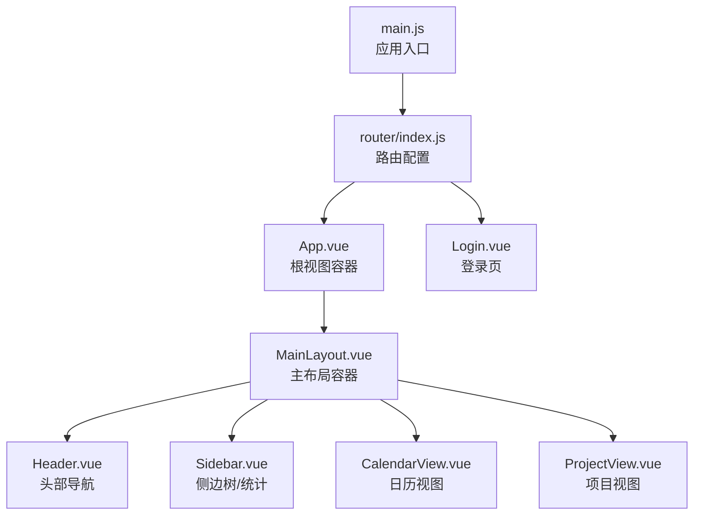
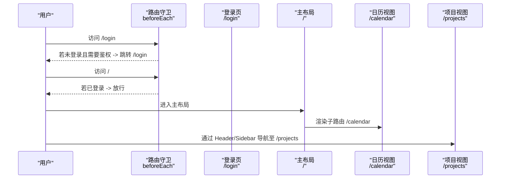
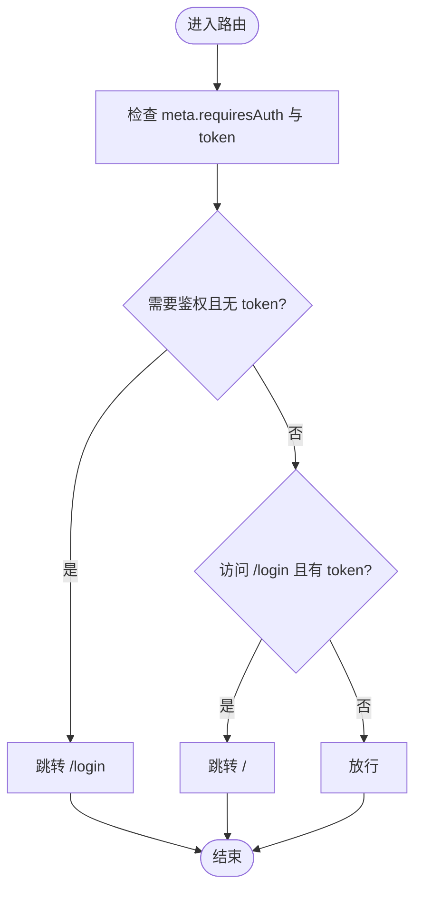
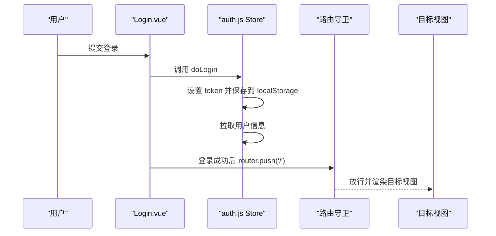
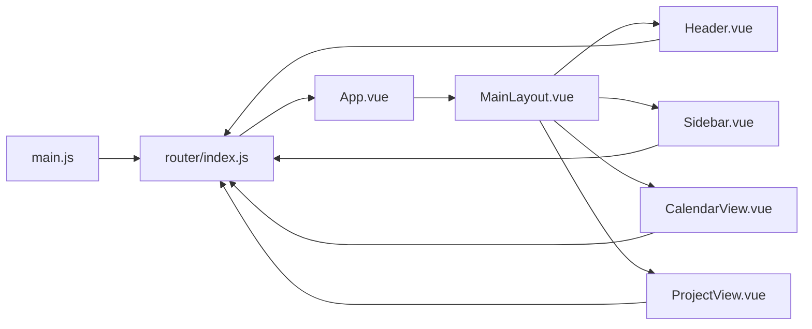

# 路由系统

<cite>
**本文引用的文件**
- [frontend/src/router/index.js](file://frontend/src/router/index.js)
- [frontend/src/main.js](file://frontend/src/main.js)
- [frontend/src/App.vue](file://frontend/src/App.vue)
- [frontend/src/layout/MainLayout.vue](file://frontend/src/layout/MainLayout.vue)
- [frontend/src/layout/Header.vue](file://frontend/src/layout/Header.vue)
- [frontend/src/layout/Sidebar.vue](file://frontend/src/layout/Sidebar.vue)
- [frontend/src/views/Login.vue](file://frontend/src/views/Login.vue)
- [frontend/src/views/CalendarView.vue](file://frontend/src/views/CalendarView.vue)
- [frontend/src/views/ProjectView.vue](file://frontend/src/views/ProjectView.vue)
- [frontend/src/stores/auth.js](file://frontend/src/stores/auth.js)
- [frontend/src/stores/project.js](file://frontend/src/stores/project.js)
- [frontend/src/api/auth.js](file://frontend/src/api/auth.js)
- [frontend/package.json](file://frontend/package.json)
</cite>

## 目录
1. [简介](#简介)
2. [项目结构](#项目结构)
3. [核心组件](#核心组件)
4. [架构总览](#架构总览)
5. [详细组件分析](#详细组件分析)
6. [依赖关系分析](#依赖关系分析)
7. [性能考虑](#性能考虑)
8. [故障排查指南](#故障排查指南)
9. [结论](#结论)
10. [附录](#附录)

## 简介
本指南围绕前端路由系统（基于 Vue Router 4）展开，系统性讲解路由配置设计、嵌套路由、动态路由、路由守卫、参数传递、懒加载、导航最佳实践以及与权限控制的结合。通过仓库中的实际实现，帮助读者快速掌握从入门到进阶的完整知识体系。

## 项目结构
前端路由系统位于 frontend/src/router/index.js，采用模块化组织：
- 路由表 routes：定义路径、组件、元信息（meta）
- 历史模式 history：使用 HTML5 History 模式
- 全局前置守卫 beforeEach：统一鉴权逻辑
- 嵌套路由：根路径 '/' 下挂载主布局 MainLayout，子路由包含日历与项目视图
- 组件懒加载：使用动态导入实现按需加载

图表来源
- [frontend/src/main.js:1-22](file://frontend/src/main.js#L1-L22)
- [frontend/src/router/index.js:1-50](file://frontend/src/router/index.js#L1-L50)
- [frontend/src/App.vue:1-16](file://frontend/src/App.vue#L1-L16)
- [frontend/src/layout/MainLayout.vue:1-39](file://frontend/src/layout/MainLayout.vue#L1-L39)
- [frontend/src/layout/Header.vue:1-87](file://frontend/src/layout/Header.vue#L1-L87)
- [frontend/src/layout/Sidebar.vue:1-250](file://frontend/src/layout/Sidebar.vue#L1-L250)
- [frontend/src/views/CalendarView.vue:1-451](file://frontend/src/views/CalendarView.vue#L1-L451)
- [frontend/src/views/ProjectView.vue:1-130](file://frontend/src/views/ProjectView.vue#L1-L130)
- [frontend/src/views/Login.vue:1-203](file://frontend/src/views/Login.vue#L1-L203)

章节来源
- [frontend/src/router/index.js:1-50](file://frontend/src/router/index.js#L1-L50)
- [frontend/src/main.js:1-22](file://frontend/src/main.js#L1-L22)

## 核心组件
- 路由表 routes
  - 登录页：路径 /login，组件懒加载，meta 标记不需要鉴权
  - 根布局：路径 /，组件 MainLayout，redirect 到 /calendar，children 定义子路由
  - 子路由：日历 calendar 与项目 projects，均懒加载
- 全局前置守卫 beforeEach
  - 读取本地 token，判断是否需要鉴权
  - 未登录访问受保护路由则跳转登录；已登录访问登录页则跳转首页
- 应用入口 main.js
  - 注册 Element Plus、图标、Pinia、路由实例
  - 将路由挂载到应用实例

章节来源
- [frontend/src/router/index.js:1-50](file://frontend/src/router/index.js#L1-L50)
- [frontend/src/main.js:1-22](file://frontend/src/main.js#L1-L22)

## 架构总览
路由系统采用“单页应用 + 嵌套路由 + 懒加载”的架构：
- 单页应用：App.vue 中仅保留 <router-view />
- 嵌套路由：根路由下挂载主布局，子路由承载具体页面
- 懒加载：路由组件通过动态导入实现代码分割
- 导航：Header 与 Sidebar 提供声明式导航；Login 页面提供编程式导航

图表来源
- [frontend/src/router/index.js:37-47](file://frontend/src/router/index.js#L37-L47)
- [frontend/src/views/Login.vue:144-151](file://frontend/src/views/Login.vue#L144-L151)
- [frontend/src/layout/Header.vue:18-26](file://frontend/src/layout/Header.vue#L18-L26)
- [frontend/src/layout/Sidebar.vue:117-127](file://frontend/src/layout/Sidebar.vue#L117-L127)

## 详细组件分析

### 路由表与嵌套路由
- 路由表 routes
  - 登录页：/login，组件懒加载，meta.requiresAuth=false
  - 根路由：/，组件 MainLayout，redirect 到 /calendar
  - 子路由：calendar 与 projects，均懒加载
- 历史模式：createWebHistory
- 全局守卫：beforeEach 实现基础鉴权

图表来源
- [frontend/src/router/index.js:37-47](file://frontend/src/router/index.js#L37-L47)

章节来源
- [frontend/src/router/index.js:1-50](file://frontend/src/router/index.js#L1-L50)

### 路由守卫详解
- 全局前置守卫 beforeEach
  - 作用：统一处理登录态与页面访问控制
  - 逻辑：根据 to.meta.requiresAuth 与 localStorage 中 token 决定跳转或放行
- 路由独享守卫与组件内守卫
  - 当前实现未使用路由独享守卫与组件内守卫
  - 可扩展点：在特定路由添加 beforeEnter 或在组件内使用导航守卫钩子

章节来源
- [frontend/src/router/index.js:37-47](file://frontend/src/router/index.js#L37-L47)

### 参数传递与动态路由
- 查询参数 query
  - CalendarView 通过 route.query.projectId 获取项目过滤条件
  - Sidebar 在节点点击时通过 router.push({ path, query }) 传递 projectId
  - Header 的搜索通过自定义事件向 CalendarView 传递关键词
- 动态路由
  - 当前未使用动态参数（如 :id），但可扩展为 /task/:id 的详情页
- props 传参
  - 当前未使用 props 传参，可在需要时改为 props: true 或 props: route => ({ id: route.params.id })

章节来源
- [frontend/src/views/CalendarView.vue:126-130](file://frontend/src/views/CalendarView.vue#L126-L130)
- [frontend/src/views/CalendarView.vue:202-207](file://frontend/src/views/CalendarView.vue#L202-L207)
- [frontend/src/layout/Sidebar.vue:117-127](file://frontend/src/layout/Sidebar.vue#L117-L127)
- [frontend/src/layout/Header.vue:55-59](file://frontend/src/layout/Header.vue#L55-L59)

### 路由懒加载与代码分割
- 懒加载实现
  - 所有路由组件均通过动态导入实现懒加载
  - 优点：减少首屏体积，提升加载速度
- 预加载策略
  - 当前未实现预加载（如 prefetch），可在需要时引入 vue-router 的预加载机制
- 代码分割
  - 通过动态导入自动触发代码分割，浏览器按需下载对应 chunk

章节来源
- [frontend/src/router/index.js:7-7](file://frontend/src/router/index.js#L7-L7)
- [frontend/src/router/index.js:19-19](file://frontend/src/router/index.js#L19-L19)
- [frontend/src/router/index.js:25-25](file://frontend/src/router/index.js#L25-L25)

### 导航最佳实践
- 声明式导航
  - 使用 <router-link> 或 <el-button @click="router.push(...)>" 实现
  - Header 中的日历与项目按钮、Sidebar 中的节点点击均采用编程式导航
- 编程式导航
  - Login.vue 在登录成功后使用 router.push('/') 返回首页
  - Sidebar 在节点点击时使用 router.push({ path, query }) 传递查询参数
- 面包屑导航
  - 当前未实现专用面包屑组件，可通过监听路由变化与 meta.title 动态生成

章节来源
- [frontend/src/views/Login.vue:144-151](file://frontend/src/views/Login.vue#L144-L151)
- [frontend/src/layout/Header.vue:18-26](file://frontend/src/layout/Header.vue#L18-L26)
- [frontend/src/layout/Sidebar.vue:117-127](file://frontend/src/layout/Sidebar.vue#L117-L127)

### 权限控制与动态路由
- 基础权限控制
  - 通过 meta.requiresAuth 与 localStorage 中 token 控制访问
  - 登录成功后设置 token 并拉取用户信息
- 动态路由生成与菜单渲染
  - 当前未实现后端动态路由与菜单渲染
  - 可扩展思路：后端返回路由配置，前端动态注入 routes；或根据用户角色渲染 Sidebar 菜单
- 访问控制
  - 可在 beforeEach 中增加更细粒度的权限校验（如角色、资源权限）

图表来源
- [frontend/src/views/Login.vue:137-151](file://frontend/src/views/Login.vue#L137-L151)
- [frontend/src/stores/auth.js:16-31](file://frontend/src/stores/auth.js#L16-L31)
- [frontend/src/router/index.js:37-47](file://frontend/src/router/index.js#L37-L47)

章节来源
- [frontend/src/stores/auth.js:1-41](file://frontend/src/stores/auth.js#L1-L41)
- [frontend/src/api/auth.js:1-14](file://frontend/src/api/auth.js#L1-L14)

## 依赖关系分析
- 路由依赖
  - main.js 引入并挂载 router
  - App.vue 作为根视图容器，内部渲染 <router-view />
  - MainLayout.vue 作为嵌套布局，内部再次渲染 <router-view />
- 组件依赖
  - Header 与 Sidebar 依赖路由与 Pinia Store
  - CalendarView 依赖路由查询参数与 API
  - ProjectView 依赖路由与项目 Store

图表来源
- [frontend/src/main.js:1-22](file://frontend/src/main.js#L1-L22)
- [frontend/src/router/index.js:1-50](file://frontend/src/router/index.js#L1-L50)
- [frontend/src/App.vue:1-16](file://frontend/src/App.vue#L1-L16)
- [frontend/src/layout/MainLayout.vue:1-39](file://frontend/src/layout/MainLayout.vue#L1-L39)
- [frontend/src/layout/Header.vue:1-87](file://frontend/src/layout/Header.vue#L1-L87)
- [frontend/src/layout/Sidebar.vue:1-250](file://frontend/src/layout/Sidebar.vue#L1-L250)
- [frontend/src/views/CalendarView.vue:1-451](file://frontend/src/views/CalendarView.vue#L1-L451)
- [frontend/src/views/ProjectView.vue:1-130](file://frontend/src/views/ProjectView.vue#L1-L130)

章节来源
- [frontend/src/main.js:1-22](file://frontend/src/main.js#L1-L22)
- [frontend/src/router/index.js:1-50](file://frontend/src/router/index.js#L1-L50)

## 性能考虑
- 代码分割与懒加载
  - 已通过动态导入实现，建议保持现状
- 预加载策略
  - 可在用户空闲时预加载高频路由对应的 chunk
- 路由守卫开销
  - beforeEach 逻辑简单，避免复杂同步操作
- 视图切换
  - 合理使用 keep-alive（当前未使用）以减少重复渲染

## 故障排查指南
- 登录后无法进入受保护页面
  - 检查 localStorage 中 token 是否正确存储
  - 确认路由守卫逻辑与 meta.requiresAuth 配置
- 登录页循环跳转
  - 检查已登录时访问 /login 的跳转逻辑
- 查询参数无效
  - 确认 Sidebar 与 CalendarView 对 route.query 的使用是否一致
- 路由懒加载失败
  - 检查动态导入语法与打包配置

章节来源
- [frontend/src/router/index.js:37-47](file://frontend/src/router/index.js#L37-L47)
- [frontend/src/stores/auth.js:11-14](file://frontend/src/stores/auth.js#L11-L14)
- [frontend/src/layout/Sidebar.vue:117-127](file://frontend/src/layout/Sidebar.vue#L117-L127)
- [frontend/src/views/CalendarView.vue:202-207](file://frontend/src/views/CalendarView.vue#L202-L207)

## 结论
该路由系统以简洁清晰的方式实现了基础鉴权、嵌套路由与懒加载，配合 Header、Sidebar 与视图组件形成了完整的导航体验。后续可在动态路由、权限细化、面包屑与预加载等方面进一步增强。

## 附录
- 技术栈
  - Vue 3、Vue Router 4、Pinia、Element Plus
- 关键实现位置
  - 路由配置：[frontend/src/router/index.js:1-50](file://frontend/src/router/index.js#L1-L50)
  - 应用入口：[frontend/src/main.js:1-22](file://frontend/src/main.js#L1-L22)
  - 登录流程：[frontend/src/views/Login.vue:125-151](file://frontend/src/views/Login.vue#L125-L151)
  - 鉴权 Store：[frontend/src/stores/auth.js:1-41](file://frontend/src/stores/auth.js#L1-L41)
  - 项目树 Store：[frontend/src/stores/project.js:1-26](file://frontend/src/stores/project.js#L1-L26)
  - 登录 API：[frontend/src/api/auth.js:1-14](file://frontend/src/api/auth.js#L1-L14)
  - 依赖版本：[frontend/package.json:11-24](file://frontend/package.json#L11-L24)