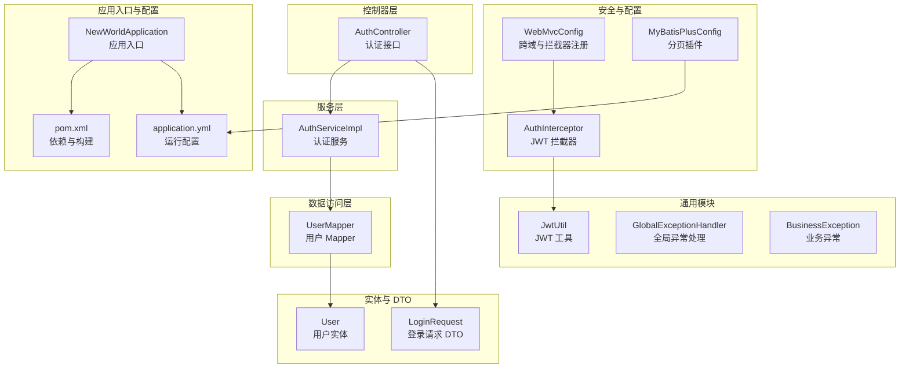
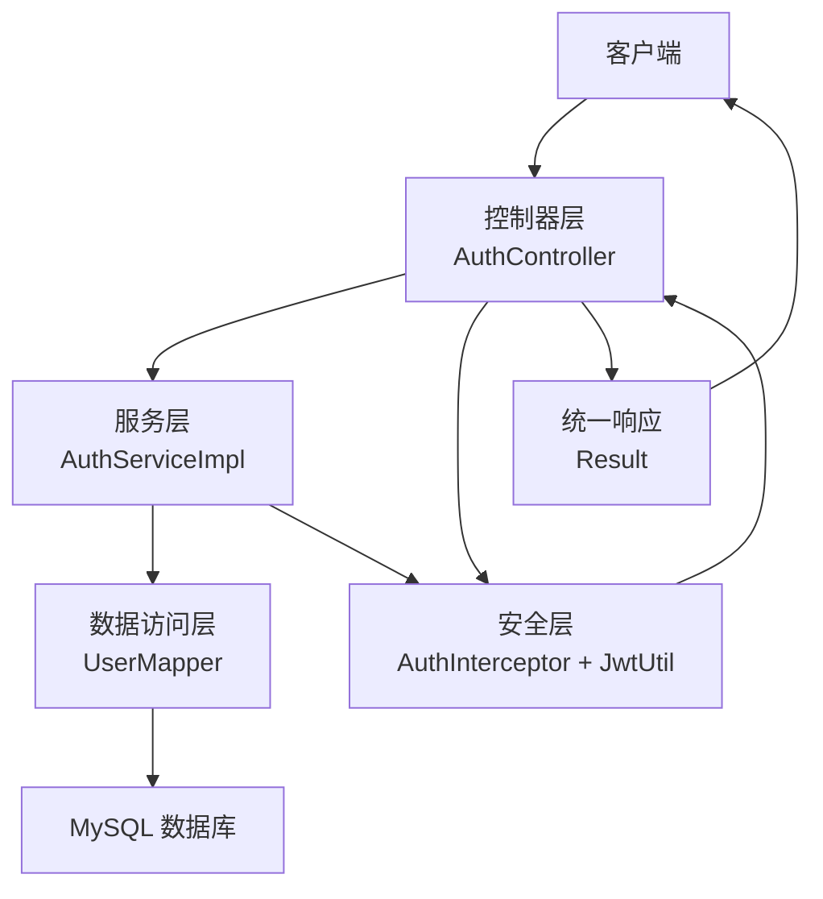
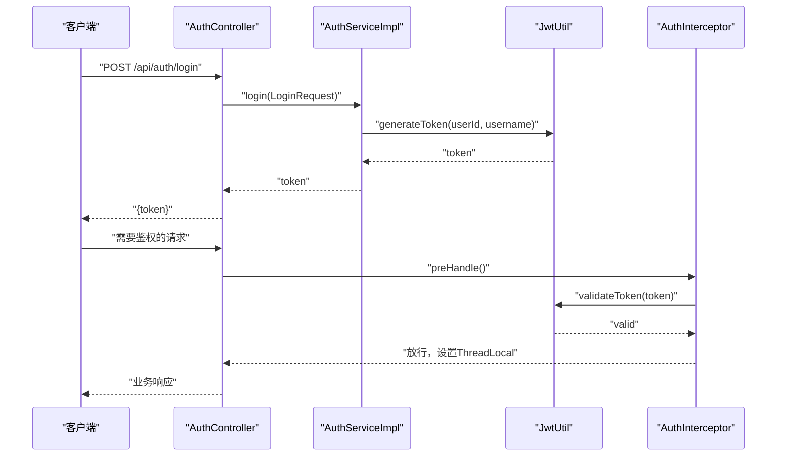
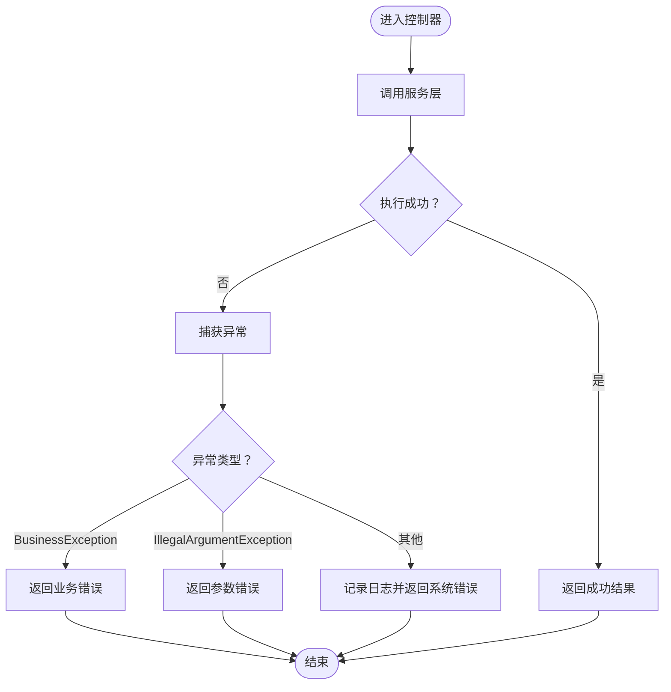
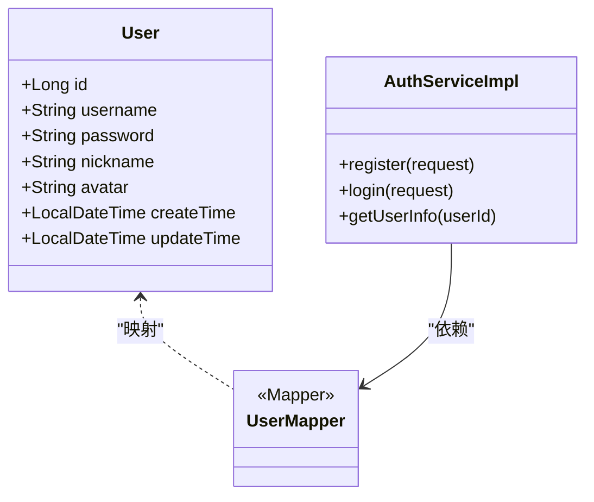
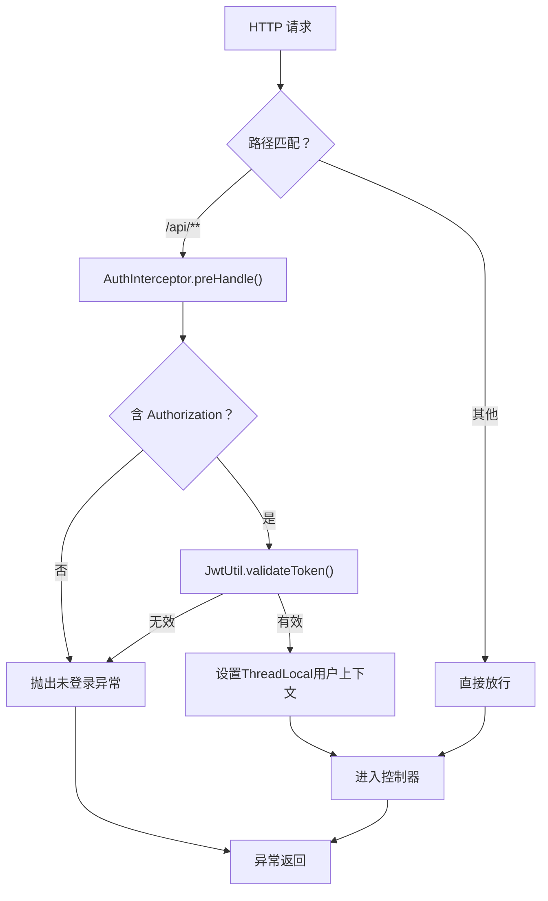
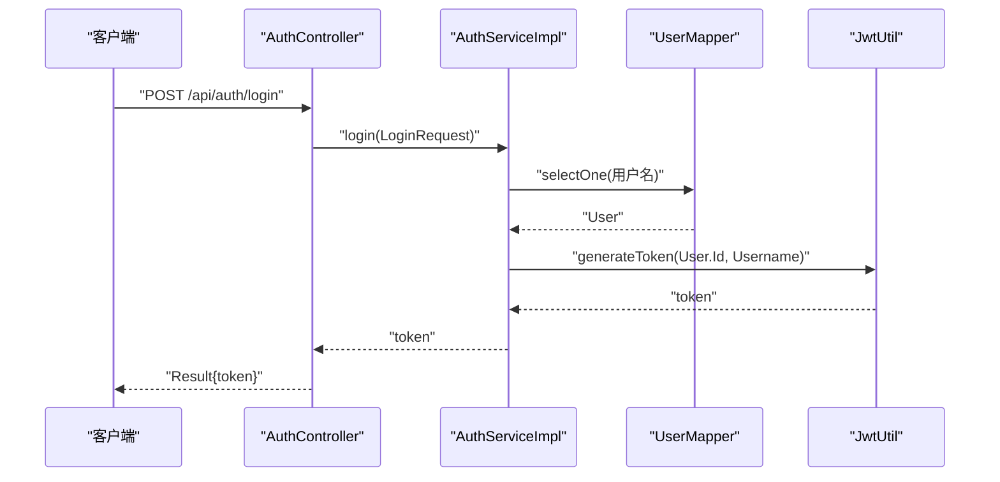
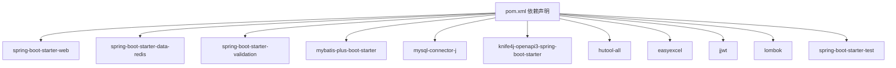

# 后端开发

<cite>
**本文引用的文件**
- [NewWorldApplication.java](file://backend/src/main/java/com/newworld/NewWorldApplication.java)
- [pom.xml](file://backend/pom.xml)
- [application.yml](file://backend/src/main/resources/application.yml)
- [init.sql](file://backend/sql/init.sql)
- [JwtUtil.java](file://backend/src/main/java/com/newworld/common/JwtUtil.java)
- [GlobalExceptionHandler.java](file://backend/src/main/java/com/newworld/common/exception/GlobalExceptionHandler.java)
- [BusinessException.java](file://backend/src/main/java/com/newworld/common/exception/BusinessException.java)
- [AuthInterceptor.java](file://backend/src/main/java/com/newworld/config/AuthInterceptor.java)
- [WebMvcConfig.java](file://backend/src/main/java/com/newworld/config/WebMvcConfig.java)
- [MyBatisPlusConfig.java](file://backend/src/main/java/com/newworld/config/MyBatisPlusConfig.java)
- [AuthController.java](file://backend/src/main/java/com/newworld/controller/AuthController.java)
- [AuthServiceImpl.java](file://backend/src/main/java/com/newworld/service/impl/AuthServiceImpl.java)
- [User.java](file://backend/src/main/java/com/newworld/entity/User.java)
- [UserMapper.java](file://backend/src/main/java/com/newworld/mapper/UserMapper.java)
- [LoginRequest.java](file://backend/src/main/java/com/newworld/dto/LoginRequest.java)
</cite>

## 目录
1. [简介](#简介)
2. [项目结构](#项目结构)
3. [核心组件](#核心组件)
4. [架构总览](#架构总览)
5. [详细组件分析](#详细组件分析)
6. [依赖分析](#依赖分析)
7. [性能考虑](#性能考虑)
8. [故障排查指南](#故障排查指南)
9. [结论](#结论)
10. [附录：API 接口文档](#附录api-接口文档)

## 简介
本指南面向新世界项目的后端开发者，系统讲解基于 Spring Boot 的三层架构设计（控制器层、服务层、数据访问层），MyBatis Plus 的实体映射与分页配置，JWT 认证机制（生成、校验、拦截器集成），以及全局异常处理、跨域与拦截器配置。同时提供认证、项目、任务等核心功能的接口设计与实现路径指引，帮助快速上手与扩展。

## 项目结构
后端采用标准 Spring Boot 结构，按领域与层次组织代码：
- 应用入口与配置：入口类、Maven 依赖、运行配置
- 通用模块：公共工具、异常体系、结果封装
- 安全与配置：JWT 工具、拦截器、Web MVC 配置、MyBatis Plus 分页插件
- 控制器层：对外暴露 REST API
- 服务层：业务逻辑编排
- 数据访问层：Mapper 接口与 XML 映射
- 实体模型：MyBatis Plus 实体类
- DTO：请求参数对象
- 初始化脚本：数据库建表与索引

图表来源
- [NewWorldApplication.java:1-13](file://backend/src/main/java/com/newworld/NewWorldApplication.java#L1-L13)
- [pom.xml:1-117](file://backend/pom.xml#L1-L117)
- [application.yml:1-75](file://backend/src/main/resources/application.yml#L1-L75)
- [JwtUtil.java:1-78](file://backend/src/main/java/com/newworld/common/JwtUtil.java#L1-L78)
- [GlobalExceptionHandler.java:1-35](file://backend/src/main/java/com/newworld/common/exception/GlobalExceptionHandler.java#L1-L35)
- [BusinessException.java:1-24](file://backend/src/main/java/com/newworld/common/exception/BusinessException.java#L1-L24)
- [AuthInterceptor.java:1-78](file://backend/src/main/java/com/newworld/config/AuthInterceptor.java#L1-L78)
- [WebMvcConfig.java:1-53](file://backend/src/main/java/com/newworld/config/WebMvcConfig.java#L1-L53)
- [MyBatisPlusConfig.java:1-22](file://backend/src/main/java/com/newworld/config/MyBatisPlusConfig.java#L1-L22)
- [AuthController.java:1-55](file://backend/src/main/java/com/newworld/controller/AuthController.java#L1-L55)
- [AuthServiceImpl.java:1-69](file://backend/src/main/java/com/newworld/service/impl/AuthServiceImpl.java#L1-L69)
- [User.java:1-95](file://backend/src/main/java/com/newworld/entity/User.java#L1-L95)
- [UserMapper.java:1-10](file://backend/src/main/java/com/newworld/mapper/UserMapper.java#L1-L10)
- [LoginRequest.java:1-37](file://backend/src/main/java/com/newworld/dto/LoginRequest.java#L1-L37)

章节来源
- [NewWorldApplication.java:1-13](file://backend/src/main/java/com/newworld/NewWorldApplication.java#L1-L13)
- [pom.xml:1-117](file://backend/pom.xml#L1-L117)
- [application.yml:1-75](file://backend/src/main/resources/application.yml#L1-L75)

## 核心组件
- 应用入口：启动 Spring Boot 应用
- 配置中心：数据源、Redis、MyBatis Plus、Knife4j、JWT、日志等
- 安全体系：JWT 工具、拦截器、全局异常处理
- 数据访问：MyBatis Plus 配置与分页插件
- 控制器与服务：认证接口与业务实现
- 实体与 Mapper：用户实体与基础 Mapper

章节来源
- [NewWorldApplication.java:1-13](file://backend/src/main/java/com/newworld/NewWorldApplication.java#L1-L13)
- [application.yml:1-75](file://backend/src/main/resources/application.yml#L1-L75)
- [JwtUtil.java:1-78](file://backend/src/main/java/com/newworld/common/JwtUtil.java#L1-L78)
- [AuthInterceptor.java:1-78](file://backend/src/main/java/com/newworld/config/AuthInterceptor.java#L1-L78)
- [GlobalExceptionHandler.java:1-35](file://backend/src/main/java/com/newworld/common/exception/GlobalExceptionHandler.java#L1-L35)
- [MyBatisPlusConfig.java:1-22](file://backend/src/main/java/com/newworld/config/MyBatisPlusConfig.java#L1-L22)
- [AuthController.java:1-55](file://backend/src/main/java/com/newworld/controller/AuthController.java#L1-L55)
- [AuthServiceImpl.java:1-69](file://backend/src/main/java/com/newworld/service/impl/AuthServiceImpl.java#L1-L69)
- [User.java:1-95](file://backend/src/main/java/com/newworld/entity/User.java#L1-L95)
- [UserMapper.java:1-10](file://backend/src/main/java/com/newworld/mapper/UserMapper.java#L1-L10)

## 架构总览
后端采用经典的分层架构：
- 表现层：控制器接收请求，返回统一响应包装
- 领域服务：封装业务规则与流程
- 数据访问：通过 MyBatis Plus 与数据库交互
- 安全与基础设施：JWT 拦截器、全局异常处理、跨域与静态资源

图表来源
- [AuthController.java:1-55](file://backend/src/main/java/com/newworld/controller/AuthController.java#L1-L55)
- [AuthServiceImpl.java:1-69](file://backend/src/main/java/com/newworld/service/impl/AuthServiceImpl.java#L1-L69)
- [UserMapper.java:1-10](file://backend/src/main/java/com/newworld/mapper/UserMapper.java#L1-L10)
- [JwtUtil.java:1-78](file://backend/src/main/java/com/newworld/common/JwtUtil.java#L1-L78)
- [AuthInterceptor.java:1-78](file://backend/src/main/java/com/newworld/config/AuthInterceptor.java#L1-L78)

## 详细组件分析

### JWT 认证机制
- Token 生成：包含用户标识与用户名，设置签发时间与过期时间，使用对称密钥签名
- Token 校验：解析签名、检查过期与主题，异常时记录告警
- 拦截器集成：从请求头提取 Token，去除前缀，校验后将用户上下文存入 ThreadLocal，供后续业务使用
- 统一异常：拦截器在缺失或无效 Token 时抛出业务异常，由全局异常处理器统一返回

图表来源
- [AuthController.java:25-32](file://backend/src/main/java/com/newworld/controller/AuthController.java#L25-L32)
- [AuthServiceImpl.java:40-57](file://backend/src/main/java/com/newworld/service/impl/AuthServiceImpl.java#L40-L57)
- [JwtUtil.java:26-40](file://backend/src/main/java/com/newworld/common/JwtUtil.java#L26-L40)
- [AuthInterceptor.java:30-58](file://backend/src/main/java/com/newworld/config/AuthInterceptor.java#L30-L58)

章节来源
- [JwtUtil.java:1-78](file://backend/src/main/java/com/newworld/common/JwtUtil.java#L1-L78)
- [AuthInterceptor.java:1-78](file://backend/src/main/java/com/newworld/config/AuthInterceptor.java#L1-L78)
- [AuthController.java:1-55](file://backend/src/main/java/com/newworld/controller/AuthController.java#L1-L55)
- [AuthServiceImpl.java:1-69](file://backend/src/main/java/com/newworld/service/impl/AuthServiceImpl.java#L1-L69)

### 全局异常处理
- 捕获业务异常：返回带业务码的结果
- 参数异常：返回 400
- 其他异常：记录错误日志并返回通用错误提示

图表来源
- [GlobalExceptionHandler.java:17-33](file://backend/src/main/java/com/newworld/common/exception/GlobalExceptionHandler.java#L17-L33)
- [BusinessException.java:6-23](file://backend/src/main/java/com/newworld/common/exception/BusinessException.java#L6-L23)

章节来源
- [GlobalExceptionHandler.java:1-35](file://backend/src/main/java/com/newworld/common/exception/GlobalExceptionHandler.java#L1-L35)
- [BusinessException.java:1-24](file://backend/src/main/java/com/newworld/common/exception/BusinessException.java#L1-L24)

### MyBatis Plus 使用与分页
- 实体映射：通过注解标注表名、主键策略、自动填充字段
- Mapper 设计：继承基础 Mapper 接口，即可获得常用 CRUD
- SQL 编写：支持 XML 映射文件；也可使用条件构造器进行动态查询
- 分页查询：配置分页插件，底层自动改写 SQL 并注入分页参数

图表来源
- [User.java:11-37](file://backend/src/main/java/com/newworld/entity/User.java#L11-L37)
- [UserMapper.java:7-9](file://backend/src/main/java/com/newworld/mapper/UserMapper.java#L7-L9)
- [AuthServiceImpl.java:14-68](file://backend/src/main/java/com/newworld/service/impl/AuthServiceImpl.java#L14-L68)

章节来源
- [MyBatisPlusConfig.java:1-22](file://backend/src/main/java/com/newworld/config/MyBatisPlusConfig.java#L1-L22)
- [application.yml:36-50](file://backend/src/main/resources/application.yml#L36-L50)
- [User.java:1-95](file://backend/src/main/java/com/newworld/entity/User.java#L1-L95)
- [UserMapper.java:1-10](file://backend/src/main/java/com/newworld/mapper/UserMapper.java#L1-L10)
- [AuthServiceImpl.java:1-69](file://backend/src/main/java/com/newworld/service/impl/AuthServiceImpl.java#L1-L69)

### Web 安全与跨域配置
- 拦截器注册：对 /api/** 路径启用 JWT 校验，排除登录、注册与文档相关路径
- 跨域策略：允许任意来源、方法与头部，支持凭据与预检缓存
- 静态资源：Knife4j 文档资源映射

图表来源
- [WebMvcConfig.java:19-43](file://backend/src/main/java/com/newworld/config/WebMvcConfig.java#L19-L43)
- [AuthInterceptor.java:30-58](file://backend/src/main/java/com/newworld/config/AuthInterceptor.java#L30-L58)
- [JwtUtil.java:61-69](file://backend/src/main/java/com/newworld/common/JwtUtil.java#L61-L69)

章节来源
- [WebMvcConfig.java:1-53](file://backend/src/main/java/com/newworld/config/WebMvcConfig.java#L1-L53)
- [AuthInterceptor.java:1-78](file://backend/src/main/java/com/newworld/config/AuthInterceptor.java#L1-L78)

### 控制器层：认证接口
- 登录：校验用户名与密码，签发 Token
- 注册：检查重复、加密存储、创建用户
- 获取当前用户信息：从拦截器 ThreadLocal 读取用户 ID 查询用户详情
- 退出：占位接口（可扩展 Token 黑名单）

图表来源
- [AuthController.java:25-32](file://backend/src/main/java/com/newworld/controller/AuthController.java#L25-L32)
- [AuthServiceImpl.java:40-57](file://backend/src/main/java/com/newworld/service/impl/AuthServiceImpl.java#L40-L57)
- [UserMapper.java:7-9](file://backend/src/main/java/com/newworld/mapper/UserMapper.java#L7-L9)
- [JwtUtil.java:26-40](file://backend/src/main/java/com/newworld/common/JwtUtil.java#L26-L40)

章节来源
- [AuthController.java:1-55](file://backend/src/main/java/com/newworld/controller/AuthController.java#L1-L55)
- [AuthServiceImpl.java:1-69](file://backend/src/main/java/com/newworld/service/impl/AuthServiceImpl.java#L1-L69)
- [LoginRequest.java:1-37](file://backend/src/main/java/com/newworld/dto/LoginRequest.java#L1-L37)

## 依赖分析
- 运行时依赖：Spring Web、Redis、Validation、MyBatis Plus、MySQL 驱动、Knife4j、Hutool、EasyExcel、JJWT、Lombok
- 构建产物：打包名为 newworld，排除 Lombok 注解处理器

图表来源
- [pom.xml:31-96](file://backend/pom.xml#L31-L96)

章节来源
- [pom.xml:1-117](file://backend/pom.xml#L1-L117)

## 性能考虑
- 数据库索引：任务表按用户与日期、项目、状态、优先级建立索引，提升查询性能
- 分页插件：开启 MyBatis Plus 分页内核，避免一次性加载大结果集
- 日志级别：针对业务包与框架包设置不同日志级别，平衡可观测性与性能
- 跨域与预检：合理配置允许方法与缓存时间，减少重复握手开销

章节来源
- [init.sql:86-90](file://backend/sql/init.sql#L86-L90)
- [MyBatisPlusConfig.java:15-20](file://backend/src/main/java/com/newworld/config/MyBatisPlusConfig.java#L15-L20)
- [application.yml:70-75](file://backend/src/main/resources/application.yml#L70-L75)
- [WebMvcConfig.java:35-43](file://backend/src/main/java/com/newworld/config/WebMvcConfig.java#L35-L43)

## 故障排查指南
- 未登录/Token 失效：拦截器检测到缺失或无效 Token，抛出业务异常，统一返回 401
- 参数非法：参数校验失败触发全局异常，返回 400
- 服务器内部错误：未捕获异常统一返回 500，并记录错误日志
- 数据库连接：确认数据源与驱动配置正确，网络可达
- 文档访问：Knife4j 文档路径为 /swagger-ui.html 或 /v3/api-docs

章节来源
- [AuthInterceptor.java:37-49](file://backend/src/main/java/com/newworld/config/AuthInterceptor.java#L37-L49)
- [GlobalExceptionHandler.java:17-33](file://backend/src/main/java/com/newworld/common/exception/GlobalExceptionHandler.java#L17-L33)
- [application.yml:51-64](file://backend/src/main/resources/application.yml#L51-L64)

## 结论
本项目以清晰的分层架构、完善的基础设施与一致的响应规范，提供了可扩展的后端骨架。JWT 拦截器与全局异常处理确保了安全与稳定性；MyBatis Plus 与分页插件提升了数据访问效率。建议在后续迭代中补充 Token 刷新、审计日志与缓存策略，持续优化性能与可维护性。

## 附录：API 接口文档

- 认证管理
  - 登录
    - 方法与路径：POST /api/auth/login
    - 请求体：LoginRequest（用户名、密码）
    - 返回：Result<Map<String,String>>，包含 token
  - 注册
    - 方法与路径：POST /api/auth/register
    - 请求体：LoginRequest（用户名、密码）
    - 返回：Result<Void>
  - 获取当前用户信息
    - 方法与路径：GET /api/auth/user-info
    - 返回：Result<User>
  - 退出登录
    - 方法与路径：POST /api/auth/logout
    - 返回：Result<Void>

章节来源
- [AuthController.java:25-53](file://backend/src/main/java/com/newworld/controller/AuthController.java#L25-L53)
- [LoginRequest.java:10-37](file://backend/src/main/java/com/newworld/dto/LoginRequest.java#L10-L37)