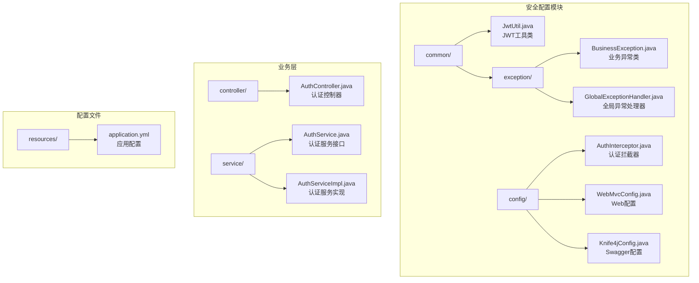
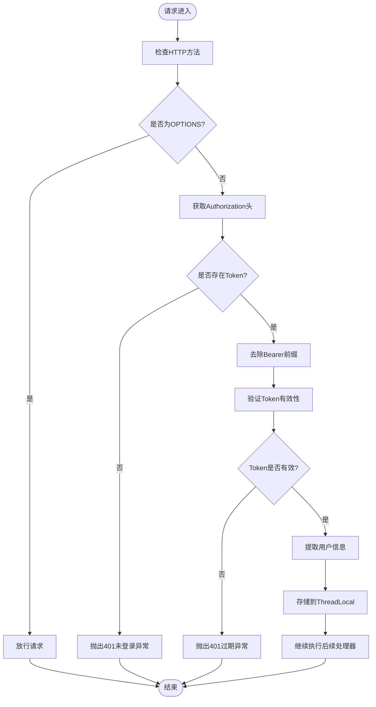
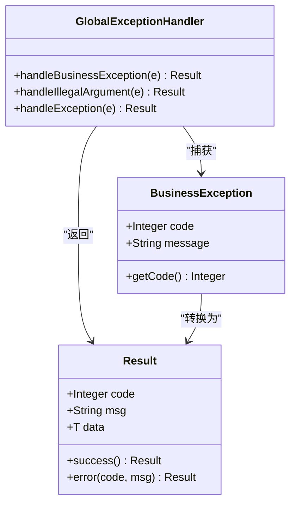
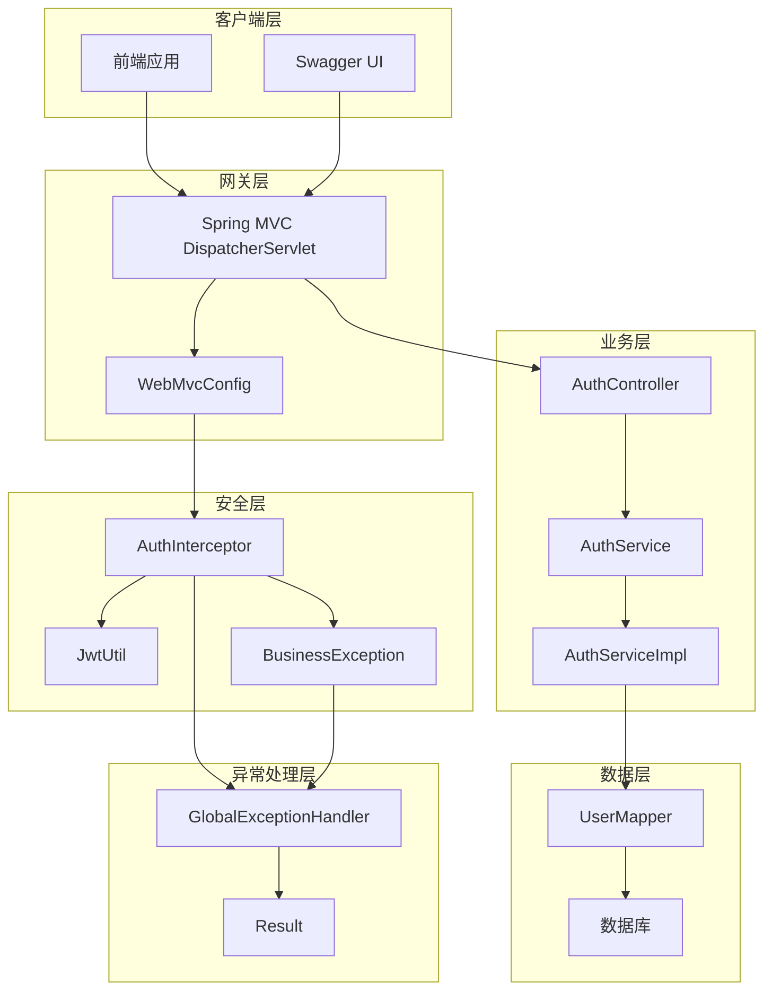
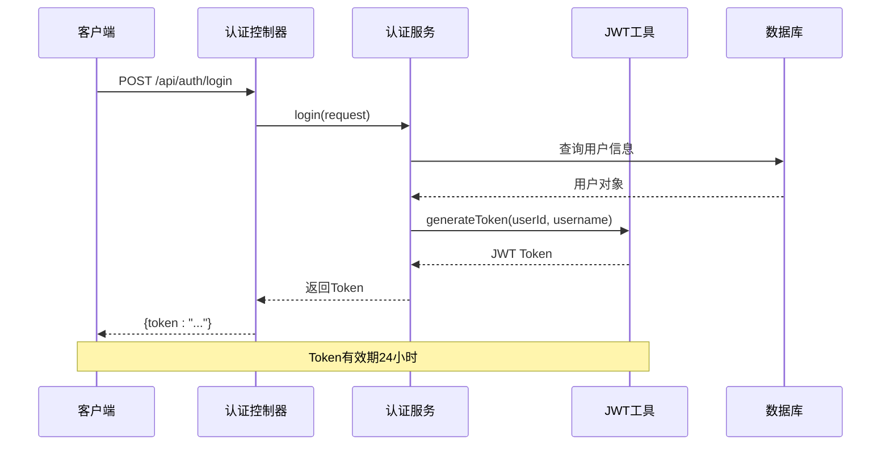
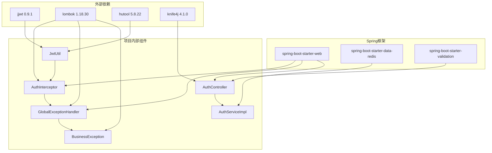

# 安全配置

<cite>
**本文档引用的文件**
- [JwtUtil.java](file://backend/src/main/java/com/newworld/common/JwtUtil.java)
- [AuthInterceptor.java](file://backend/src/main/java/com/newworld/config/AuthInterceptor.java)
- [WebMvcConfig.java](file://backend/src/main/java/com/newworld/config/WebMvcConfig.java)
- [GlobalExceptionHandler.java](file://backend/src/main/java/com/newworld/common/exception/GlobalExceptionHandler.java)
- [BusinessException.java](file://backend/src/main/java/com/newworld/common/exception/BusinessException.java)
- [AuthController.java](file://backend/src/main/java/com/newworld/controller/AuthController.java)
- [AuthServiceImpl.java](file://backend/src/main/java/com/newworld/service/impl/AuthServiceImpl.java)
- [application.yml](file://backend/src/main/resources/application.yml)
- [Result.java](file://backend/src/main/java/com/newworld/common/Result.java)
- [LoginRequest.java](file://backend/src/main/java/com/newworld/dto/LoginRequest.java)
- [AuthService.java](file://backend/src/main/java/com/newworld/service/AuthService.java)
- [Knife4jConfig.java](file://backend/src/main/java/com/newworld/config/Knife4jConfig.java)
- [NewWorldApplication.java](file://backend/src/main/java/com/newworld/NewWorldApplication.java)
- [pom.xml](file://backend/pom.xml)
</cite>

## 目录
1. [简介](#简介)
2. [项目结构](#项目结构)
3. [核心组件](#核心组件)
4. [架构概览](#架构概览)
5. [详细组件分析](#详细组件分析)
6. [依赖关系分析](#依赖关系分析)
7. [性能考虑](#性能考虑)
8. [故障排除指南](#故障排除指南)
9. [最佳实践](#最佳实践)
10. [结论](#结论)

## 简介

新世界项目的安全配置采用JWT（JSON Web Token）认证机制，结合Spring MVC拦截器实现统一的权限控制。该系统通过自定义拦截器对API请求进行身份验证，使用全局异常处理器统一处理各种异常情况，并配置了CORS跨域支持和Swagger接口文档。

本项目的核心安全特性包括：
- 基于JWT的无状态认证机制
- 自定义拦截器实现权限验证
- 全局异常处理机制
- CORS跨域配置
- 统一的响应格式

## 项目结构

新世界项目的安全配置主要分布在以下目录结构中：



**图表来源**
- [JwtUtil.java:1-78](file://backend/src/main/java/com/newworld/common/JwtUtil.java#L1-L78)
- [AuthInterceptor.java:1-78](file://backend/src/main/java/com/newworld/config/AuthInterceptor.java#L1-L78)
- [WebMvcConfig.java:1-53](file://backend/src/main/java/com/newworld/config/WebMvcConfig.java#L1-L53)

**章节来源**
- [NewWorldApplication.java:1-13](file://backend/src/main/java/com/newworld/NewWorldApplication.java#L1-L13)
- [application.yml:1-75](file://backend/src/main/resources/application.yml#L1-L75)

## 核心组件

### JWT认证机制

JWT（JSON Web Token）是本项目实现无状态认证的核心技术。JWT由三部分组成：头部（Header）、载荷（Payload）和签名（Signature），通过点号连接形成紧凑的字符串。

#### JWT配置参数

| 参数名称 | 默认值 | 描述 |
|---------|--------|------|
| jwt.secret | NewWorldSecretKey2024!@#$%^&*()ForPersonalUse | JWT签名密钥 |
| jwt.expiration | 86400000 | Token有效期（毫秒），默认24小时 |

#### Token结构

JWT Token包含以下关键信息：
- **头部（Header）**：包含算法和类型信息
- **载荷（Payload）**：包含用户标识和声明信息
- **签名（Signature）**：用于验证Token完整性

**章节来源**
- [JwtUtil.java:20-24](file://backend/src/main/java/com/newworld/common/JwtUtil.java#L20-L24)
- [application.yml:65-68](file://backend/src/main/resources/application.yml#L65-L68)

### 自定义拦截器AuthInterceptor

AuthInterceptor是本项目的核心安全组件，实现了基于Spring MVC的HandlerInterceptor接口，负责对所有API请求进行统一的身份验证。

#### 拦截器配置

拦截器配置规则：
- **拦截路径**：/api/**
- **排除路径**：登录、注册、系统管理、Swagger文档等公开接口
- **预检请求放行**：OPTIONS方法自动放行

#### 权限验证流程



**图表来源**
- [AuthInterceptor.java:30-58](file://backend/src/main/java/com/newworld/config/AuthInterceptor.java#L30-L58)

**章节来源**
- [AuthInterceptor.java:1-78](file://backend/src/main/java/com/newworld/config/AuthInterceptor.java#L1-L78)
- [WebMvcConfig.java:19-33](file://backend/src/main/java/com/newworld/config/WebMvcConfig.java#L19-L33)

### 全局异常处理机制

全局异常处理器提供了统一的异常处理策略，确保所有异常都能得到适当的处理和响应。

#### 异常处理策略

| 异常类型 | 处理方式 | HTTP状态码 |
|---------|---------|-----------|
| BusinessException | 返回业务异常信息 | 由业务异常定义 |
| IllegalArgumentException | 返回参数异常信息 | 400 |
| Exception | 返回服务器内部错误 | 500 |

#### 异常响应格式

所有异常响应都遵循统一的Result格式：



**图表来源**
- [GlobalExceptionHandler.java:12-34](file://backend/src/main/java/com/newworld/common/exception/GlobalExceptionHandler.java#L12-L34)
- [Result.java:8-89](file://backend/src/main/java/com/newworld/common/Result.java#L8-L89)

**章节来源**
- [GlobalExceptionHandler.java:1-35](file://backend/src/main/java/com/newworld/common/exception/GlobalExceptionHandler.java#L1-L35)
- [BusinessException.java:1-24](file://backend/src/main/java/com/newworld/common/exception/BusinessException.java#L1-L24)

### CORS跨域配置

项目配置了全面的CORS（跨域资源共享）支持，允许前端应用从不同域名访问后端API。

#### CORS配置详情

| 配置项 | 值 | 说明 |
|-------|-----|------|
| 映射范围 | /** | 对所有路径生效 |
| 允许来源 | * | 允许任意域名 |
| 允许方法 | GET, POST, PUT, DELETE, OPTIONS | 支持常用HTTP方法 |
| 允许头 | * | 允许任意请求头 |
| 凭据支持 | true | 支持携带Cookie和认证头 |
| 缓存时间 | 3600秒 | 预检请求缓存时长 |

**章节来源**
- [WebMvcConfig.java:35-43](file://backend/src/main/java/com/newworld/config/WebMvcConfig.java#L35-L43)

## 架构概览

新世界的整体安全架构采用分层设计，各组件职责明确，协作完成完整的认证授权流程。



**图表来源**
- [AuthInterceptor.java:19-77](file://backend/src/main/java/com/newworld/config/AuthInterceptor.java#L19-L77)
- [AuthController.java:20-54](file://backend/src/main/java/com/newworld/controller/AuthController.java#L20-L54)
- [GlobalExceptionHandler.java:12-34](file://backend/src/main/java/com/newworld/common/exception/GlobalExceptionHandler.java#L12-L34)

## 详细组件分析

### JWT工具类JwtUtil

JwtUtil是JWT认证机制的核心实现，提供了完整的Token生成、验证和解析功能。

#### 核心功能实现

1. **Token生成**：使用HS512算法对用户信息进行签名
2. **Token验证**：验证签名完整性和有效期
3. **用户信息提取**：从Token中解析用户ID和用户名

#### Token生命周期管理



**图表来源**
- [AuthController.java:25-32](file://backend/src/main/java/com/newworld/controller/AuthController.java#L25-L32)
- [AuthServiceImpl.java:40-57](file://backend/src/main/java/com/newworld/service/impl/AuthServiceImpl.java#L40-L57)
- [JwtUtil.java:29-40](file://backend/src/main/java/com/newworld/common/JwtUtil.java#L29-L40)

**章节来源**
- [JwtUtil.java:1-78](file://backend/src/main/java/com/newworld/common/JwtUtil.java#L1-L78)
- [AuthServiceImpl.java:1-69](file://backend/src/main/java/com/newworld/service/impl/AuthServiceImpl.java#L1-L69)

### 认证拦截器AuthInterceptor

AuthInterceptor实现了完整的请求拦截和权限验证逻辑，是整个安全体系的核心组件。

#### 线程安全设计

拦截器使用ThreadLocal变量存储当前用户的上下文信息，避免了多线程环境下的数据污染问题：

- `currentUserId`：存储当前登录用户的ID
- `currentUsername`：存储当前登录用户的用户名

#### 请求处理流程

```mermaid
flowchart TD
A[preHandle方法开始] --> B{检查HTTP方法}
B --> C{是否为OPTIONS?}
C --> |是| D[直接放行]
C --> |否| E[获取Authorization头]
E --> F{是否有Token?}
F --> |否| G[抛出BusinessException(401)]
F --> |是| H[去除Bearer前缀]
H --> I[验证Token有效性]
I --> J{Token是否有效?}
J --> |否| K[抛出BusinessException(401)]
J --> |是| L[提取用户信息]
L --> M[存储到ThreadLocal]
M --> N[继续执行后续处理器]
D --> O[afterCompletion清理]
G --> O
K --> O
N --> O
```

**图表来源**
- [AuthInterceptor.java:30-64](file://backend/src/main/java/com/newworld/config/AuthInterceptor.java#L30-L64)

**章节来源**
- [AuthInterceptor.java:1-78](file://backend/src/main/java/com/newworld/config/AuthInterceptor.java#L1-L78)

### WebMvcConfig配置

WebMvcConfig负责配置Spring MVC的各种行为，包括拦截器注册、CORS设置和静态资源处理。

#### 拦截器注册配置

拦截器注册规则体现了最小权限原则：
- **必须认证**：/api/** 路径下的所有接口都需要认证
- **公开访问**：登录、注册、系统管理等接口无需认证
- **文档访问**：Swagger UI和相关资源无需认证

#### CORS配置策略

CORS配置采用了宽松但安全的策略：
- 允许任意域名访问，便于开发调试
- 支持凭据传递，满足Cookie认证需求
- 设置合理的缓存时间，减少预检请求开销

**章节来源**
- [WebMvcConfig.java:1-53](file://backend/src/main/java/com/newworld/config/WebMvcConfig.java#L1-L53)

### 全局异常处理GlobalExceptionHandler

GlobalExceptionHandler提供了统一的异常处理机制，确保所有异常都能被正确处理并返回标准格式的响应。

#### 异常分类处理

1. **业务异常**：由业务逻辑抛出的异常，包含具体的错误码和消息
2. **参数异常**：输入参数验证失败，返回400状态码
3. **系统异常**：未预期的系统错误，返回500状态码

#### 响应标准化

所有异常响应都遵循统一的Result格式，包含状态码、消息和数据字段，便于前端统一处理。

**章节来源**
- [GlobalExceptionHandler.java:1-35](file://backend/src/main/java/com/newworld/common/exception/GlobalExceptionHandler.java#L1-L35)
- [Result.java:1-90](file://backend/src/main/java/com/newworld/common/Result.java#L1-L90)

## 依赖关系分析

新世界项目的安全配置涉及多个组件之间的复杂依赖关系，这些关系构成了完整的安全体系。



**图表来源**
- [pom.xml:31-96](file://backend/pom.xml#L31-L96)
- [JwtUtil.java:1-10](file://backend/src/main/java/com/newworld/common/JwtUtil.java#L1-L10)
- [AuthInterceptor.java:1-12](file://backend/src/main/java/com/newworld/config/AuthInterceptor.java#L1-L12)

### 关键依赖关系

1. **JWT依赖**：项目使用jjwt库实现JWT的生成和验证
2. **工具类依赖**：Hutool库提供加密和工具函数支持
3. **注解支持**：Lombok简化实体类和异常类的代码
4. **文档支持**：Knife4j提供增强的Swagger UI体验

**章节来源**
- [pom.xml:21-29](file://backend/pom.xml#L21-L29)

## 性能考虑

在设计和实现安全配置时，需要充分考虑性能影响和优化策略。

### Token验证性能

JWT验证操作相对轻量，主要消耗在：
- 密钥验证计算
- 字符串解析操作
- 时间戳比较

### 线程安全优化

ThreadLocal变量的使用避免了同步开销，但需要注意：
- 在请求结束后及时清理ThreadLocal变量
- 避免在异步任务中使用ThreadLocal存储

### 缓存策略

建议在Redis中实现Token黑名单缓存，用于快速检测失效Token：
- 存储Token的过期时间
- 提供批量查询接口
- 实现自动过期清理机制

## 故障排除指南

### 常见安全问题及解决方案

#### 1. Token过期问题

**症状**：用户登录后一段时间内出现401未登录错误

**原因分析**：
- Token有效期已过期
- 服务器时间与客户端时间不一致
- Token被意外修改

**解决方案**：
- 检查JWT配置中的expiration参数
- 确保服务器时间同步
- 验证Token传输过程中的完整性

#### 2. 跨域访问失败

**症状**：前端应用无法访问后端API，出现CORS错误

**原因分析**：
- CORS配置不正确
- 预检请求处理不当
- 安全策略过于严格

**解决方案**：
- 检查allowedOriginPatterns配置
- 确认预检请求的OPTIONS方法处理
- 调整allowedHeaders和allowedMethods设置

#### 3. 权限验证失败

**症状**：已登录用户仍然收到401未登录错误

**原因分析**：
- Authorization头格式不正确
- Token被意外修改
- ThreadLocal变量未正确清理

**解决方案**：
- 确认Token格式为"Bearer {token}"
- 检查Token传输过程
- 验证拦截器的afterCompletion方法执行

**章节来源**
- [AuthInterceptor.java:37-58](file://backend/src/main/java/com/newworld/config/AuthInterceptor.java#L37-L58)
- [WebMvcConfig.java:35-43](file://backend/src/main/java/com/newworld/config/WebMvcConfig.java#L35-L43)

### 调试技巧

1. **启用详细日志**：在application.yml中调整日志级别
2. **使用Swagger测试**：通过Swagger UI验证API调用
3. **检查网络请求**：确认Authorization头的正确性
4. **监控Token状态**：验证Token的有效性和过期时间

## 最佳实践

### 安全配置最佳实践

#### 1. JWT配置优化

- **密钥管理**：使用强随机密钥，定期轮换
- **有效期设置**：根据业务需求合理设置Token有效期
- **签名算法**：使用HS512等强加密算法

#### 2. 拦截器配置

- **精确匹配**：使用精确的路径模式避免误拦截
- **排除列表维护**：定期更新公开接口列表
- **预检请求处理**：确保CORS预检请求正常通过

#### 3. 异常处理

- **异常分类**：区分业务异常和系统异常
- **响应格式**：保持统一的响应格式
- **日志记录**：详细记录异常信息便于排查

#### 4. CORS配置

- **生产环境限制**：在生产环境中限制允许的域名
- **凭据安全**：谨慎使用allowCredentials选项
- **缓存优化**：合理设置maxAge参数

### 常见安全问题解决方案

#### 1. CSRF防护

虽然JWT本身具有CSRF防护能力，但仍建议：
- 使用SameSite Cookie属性
- 实施双重提交令牌
- 验证Referer头

#### 2. XSS防护

- 对用户输入进行严格的验证和过滤
- 使用内容安全策略（CSP）
- 实施输出编码

#### 3. 重放攻击防护

- 实施Nonce机制
- 使用时间戳验证
- 实施Token刷新限制

#### 4. 会话固定攻击

- 登录成功后立即更换会话ID
- 清理会话中的敏感信息
- 实施会话超时机制

## 结论

新世界项目的安全配置展现了现代Web应用的安全设计理念，通过JWT认证、拦截器权限控制、全局异常处理和CORS跨域支持，构建了一个完整而高效的安全体系。

### 主要优势

1. **无状态认证**：JWT实现无状态认证，便于水平扩展
2. **统一安全控制**：拦截器提供统一的权限验证入口
3. **异常处理标准化**：全局异常处理器确保异常处理的一致性
4. **开发友好**：完善的Swagger文档支持开发调试

### 改进建议

1. **增强安全配置**：在生产环境中限制CORS配置
2. **实施Token刷新**：添加Token刷新机制提升用户体验
3. **增加审计日志**：记录重要的安全事件便于追踪
4. **实施速率限制**：防止暴力破解和DDoS攻击

该安全配置方案为新世界项目提供了坚实的安全基础，既保证了系统的安全性，又保持了良好的开发体验和扩展性。