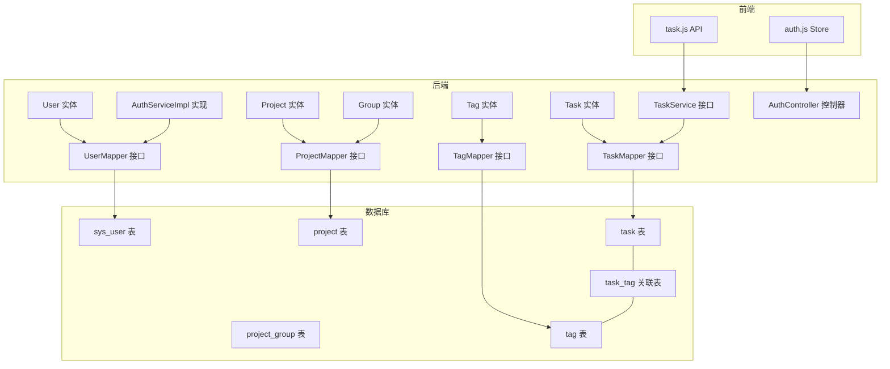
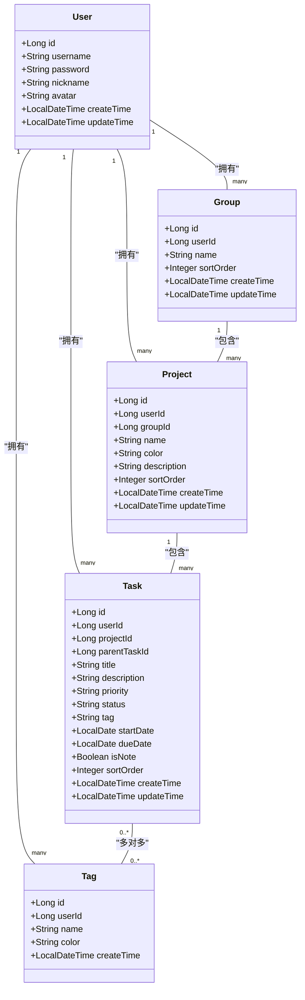
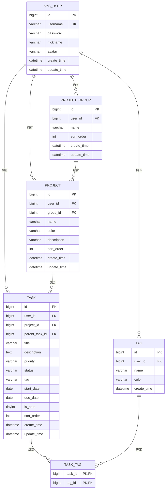

# 实体模型

<cite>
**本文引用的文件**
- [User.java](file://backend/src/main/java/com/newworld/entity/User.java)
- [Project.java](file://backend/src/main/java/com/newworld/entity/Project.java)
- [Task.java](file://backend/src/main/java/com/newworld/entity/Task.java)
- [Group.java](file://backend/src/main/java/com/newworld/entity/Group.java)
- [Tag.java](file://backend/src/main/java/com/newworld/entity/Tag.java)
- [init.sql](file://backend/sql/init.sql)
- [AuthServiceImpl.java](file://backend/src/main/java/com/newworld/service/impl/AuthServiceImpl.java)
- [TaskService.java](file://backend/src/main/java/com/newworld/service/TaskService.java)
- [TaskMapper.java](file://backend/src/main/java/com/newworld/mapper/TaskMapper.java)
- [auth.js](file://frontend/src/stores/auth.js)
- [task.js](file://frontend/src/api/task.js)
</cite>

## 目录
1. [简介](#简介)
2. [项目结构](#项目结构)
3. [核心实体](#核心实体)
4. [架构总览](#架构总览)
5. [详细组件分析](#详细组件分析)
6. [依赖关系分析](#依赖关系分析)
7. [性能考量](#性能考量)
8. [故障排查指南](#故障排查指南)
9. [结论](#结论)

## 简介
本文件系统性梳理新世界项目的核心实体模型，覆盖用户(User)、项目(Project)、任务(Task)、分组(Group)与标签(Tag)五大实体。文档从设计理念、字段定义、约束条件、业务规则出发，阐述实体间的一对一、一对多与多对多关系映射，并结合后端服务与前端交互给出使用示例与最佳实践，帮助开发者快速理解并正确使用实体模型。

## 项目结构
后端采用标准的分层架构：entity(实体)、mapper(持久层)、service(服务层)、controller(控制层)、dto(数据传输对象)、common(通用工具)等模块清晰分离；数据库初始化脚本定义了完整的表结构、外键约束与索引策略；前端通过 Pinia Store 与 Axios 封装的 API 与后端交互。

图表来源
- [User.java:11-13](file://backend/src/main/java/com/newworld/entity/User.java#L11-L13)
- [Project.java:11-13](file://backend/src/main/java/com/newworld/entity/Project.java#L11-L13)
- [Task.java:12-14](file://backend/src/main/java/com/newworld/entity/Task.java#L12-L14)
- [Group.java:11-13](file://backend/src/main/java/com/newworld/entity/Group.java#L11-L13)
- [Tag.java:11-13](file://backend/src/main/java/com/newworld/entity/Tag.java#L11-L13)
- [TaskMapper.java:7-9](file://backend/src/main/java/com/newworld/mapper/TaskMapper.java#L7-L9)
- [AuthServiceImpl.java:14-21](file://backend/src/main/java/com/newworld/service/impl/AuthServiceImpl.java#L14-L21)
- [TaskService.java:9-76](file://backend/src/main/java/com/newworld/service/TaskService.java#L9-L76)
- [init.sql:8-95](file://backend/sql/init.sql#L8-L95)
- [auth.js:1-41](file://frontend/src/stores/auth.js#L1-L41)
- [task.js:1-54](file://frontend/src/api/task.js#L1-L54)

章节来源
- [init.sql:1-95](file://backend/sql/init.sql#L1-L95)

## 核心实体
本节按实体维度逐一说明字段、类型、约束与业务规则，并给出常见使用场景与最佳实践。

- 用户(User)
  - 字段与类型
    - id: Long 主键自增
    - username: String 唯一，非空
    - password: String 非空，加密存储
    - nickname: String 可选
    - avatar: String 可选
    - createTime/updateTime: LocalDateTime 自动填充
  - 约束与规则
    - username 唯一且非空
    - 密码采用 SHA-256 加密存储
    - createTime/updateTime 由框架自动维护
  - 使用示例
    - 注册时校验用户名唯一性并写入加密密码
    - 登录时比对加密后的密码并签发 JWT
    - 返回用户信息时清除敏感字段
  - 最佳实践
    - 永远不要明文存储密码
    - 在返回给前端的数据中移除敏感字段
    - 使用统一的加密工具进行密码处理

- 项目分组(Group)
  - 字段与类型
    - id: Long 主键自增
    - userId: Long 外键，指向 sys_user
    - name: String 非空
    - sortOrder: Integer 排序号
    - createTime/updateTime: LocalDateTime 自动填充
  - 约束与规则
    - 外键 user_id 引用 sys_user(id)，级联删除
    - 支持排序展示
  - 使用示例
    - 为用户创建分组，用于归类项目
    - 分组删除时，其下项目会级联删除
  - 最佳实践
    - 合理设置排序号以支持灵活展示
    - 保持分组命名简洁明确

- 项目(Project)
  - 字段与类型
    - id: Long 主键自增
    - userId: Long 外键，指向 sys_user
    - groupId: Long 外键，指向 project_group
    - name: String 非空
    - color: String 默认颜色
    - description: String 可选
    - sortOrder: Integer 排序号
    - createTime/updateTime: LocalDateTime 自动填充
  - 约束与规则
    - 外键 user_id 引用 sys_user(id)，级联删除
    - 外键 group_id 引用 project_group(id)，级联删除
    - 支持排序与颜色标识
  - 使用示例
    - 将项目归属到指定分组
    - 通过排序号控制展示顺序
  - 最佳实践
    - 为项目设置合适的颜色便于视觉识别
    - 合理使用描述字段补充项目背景

- 任务(Task)
  - 字段与类型
    - id: Long 主键自增
    - userId: Long 外键，指向 sys_user
    - projectId: Long 外键，指向 project（可为空）
    - parentTaskId: Long 外键，指向 task（可为空），支持父子任务
    - title: String 非空
    - description: Text 可选
    - priority: String 默认 NONE，取值范围包含 RED/YELLOW/BLUE/FLAG/NONE
    - status: String 默认 TODO，取值范围包含 TODO/IN_PROGRESS/DONE/ARCHIVED
    - tag: String 标签简述
    - startDate/dueDate: LocalDate 可选
    - isNote: Boolean 默认 0（任务），1（笔记）
    - sortOrder: Integer 排序号
    - createTime/updateTime: LocalDateTime 自动填充
  - 约束与规则
    - 外键 user_id 引用 sys_user(id)，级联删除
    - 外键 project_id 引用 project(id)，删除时置空
    - 外键 parent_task_id 引用 task(id)，删除时置空
    - 支持优先级与状态枚举式管理
    - 支持将任务转换为笔记
  - 使用示例
    - 创建任务并设置优先级与状态
    - 通过 parentTaskId 构建子任务树
    - 将任务标记为笔记
  - 最佳实践
    - 使用优先级与状态字段驱动看板视图
    - 合理使用 isNote 区分任务与笔记
    - 为高频查询建立索引（见数据库脚本）

- 标签(Tag)
  - 字段与类型
    - id: Long 主键自增
    - userId: Long 外键，指向 sys_user
    - name: String 非空
    - color: String 默认颜色
    - createTime: LocalDateTime 自动填充
  - 约束与规则
    - 外键 user_id 引用 sys_user(id)，级联删除
    - 支持颜色标识
  - 使用示例
    - 为任务打标签，支持多对多关联
  - 最佳实践
    - 标签命名规范，避免重复
    - 使用颜色提升辨识度

章节来源
- [User.java:11-95](file://backend/src/main/java/com/newworld/entity/User.java#L11-L95)
- [Project.java:11-117](file://backend/src/main/java/com/newworld/entity/Project.java#L11-L117)
- [Task.java:12-184](file://backend/src/main/java/com/newworld/entity/Task.java#L12-L184)
- [Group.java:11-84](file://backend/src/main/java/com/newworld/entity/Group.java#L11-L84)
- [Tag.java:11-72](file://backend/src/main/java/com/newworld/entity/Tag.java#L11-L72)
- [init.sql:8-95](file://backend/sql/init.sql#L8-L95)

## 架构总览
实体模型遵循“领域驱动”的分层设计，后端通过 MyBatis-Plus 的注解映射数据库表，服务层封装业务逻辑，控制器负责对外接口，前端通过 API 与后端交互。数据库层面通过外键与索引保证数据一致性与查询性能。

图表来源
- [User.java:11-95](file://backend/src/main/java/com/newworld/entity/User.java#L11-L95)
- [Group.java:11-84](file://backend/src/main/java/com/newworld/entity/Group.java#L11-L84)
- [Project.java:11-117](file://backend/src/main/java/com/newworld/entity/Project.java#L11-L117)
- [Task.java:12-184](file://backend/src/main/java/com/newworld/entity/Task.java#L12-L184)
- [Tag.java:11-72](file://backend/src/main/java/com/newworld/entity/Tag.java#L11-L72)

## 详细组件分析

### 用户实体(User)
- 设计理念
  - 作为系统基础身份实体，承载认证与授权所需的基本信息
  - 通过自动填充字段简化生命周期管理
- 字段与约束
  - username 唯一非空，确保登录唯一性
  - password 加密存储，保障安全
  - createTime/updateTime 自动维护，减少手工赋值
- 业务规则
  - 注册时检查用户名唯一性
  - 登录时比对加密密码
  - 返回用户信息时清除敏感字段
- 使用示例
  - 注册流程：校验唯一性 -> 加密密码 -> 写入数据库
  - 登录流程：查询用户 -> 加密比对 -> 生成 Token
  - 安全输出：返回前清理密码字段
- 最佳实践
  - 统一使用 SHA-256 进行密码加密
  - 前端不接收或显示密码字段
  - 使用拦截器获取当前用户 ID

章节来源
- [User.java:11-95](file://backend/src/main/java/com/newworld/entity/User.java#L11-L95)
- [AuthServiceImpl.java:23-67](file://backend/src/main/java/com/newworld/service/impl/AuthServiceImpl.java#L23-L67)
- [auth.js:16-31](file://frontend/src/stores/auth.js#L16-L31)

### 项目分组实体(Group)
- 设计理念
  - 为项目提供逻辑分组能力，便于用户组织与导航
- 字段与约束
  - 外键 user_id 级联删除，保证数据一致性
  - 支持排序号，便于灵活展示
- 业务规则
  - 分组属于单个用户
  - 删除分组时，其下项目级联删除
- 使用示例
  - 创建分组并设置排序号
  - 将项目移动到不同分组
- 最佳实践
  - 分组命名简洁明确
  - 合理使用排序号提升用户体验

章节来源
- [Group.java:11-84](file://backend/src/main/java/com/newworld/entity/Group.java#L11-L84)
- [init.sql:19-43](file://backend/sql/init.sql#L19-L43)

### 项目实体(Project)
- 设计理念
  - 承载任务集合的容器，支持颜色与描述增强可视化与可读性
- 字段与约束
  - 外键 user_id 与 group_id 级联删除
  - 支持排序与颜色标识
- 业务规则
  - 项目必须归属于用户与分组
  - 支持排序展示
- 使用示例
  - 创建项目并分配颜色与描述
  - 通过排序号控制展示顺序
- 最佳实践
  - 颜色应与项目类型匹配，提升识别效率
  - 合理使用描述补充项目背景

章节来源
- [Project.java:11-117](file://backend/src/main/java/com/newworld/entity/Project.java#L11-L117)
- [init.sql:30-43](file://backend/sql/init.sql#L30-L43)

### 任务实体(Task)
- 设计理念
  - 核心业务实体，支持优先级、状态、时间与父子任务关系
- 字段与约束
  - 外键 user_id 级联删除
  - 外键 project_id 删除置空，parent_task_id 删除置空
  - 支持优先级与状态枚举
  - 支持 isNote 标记笔记
- 业务规则
  - 支持任务树结构（父子任务）
  - 支持状态流转（TODO/IN_PROGRESS/DONE/ARCHIVED）
  - 支持优先级管理（RED/YELLOW/BLUE/FLAG/NONE）
- 使用示例
  - 创建任务并设置优先级与状态
  - 构建父子任务树
  - 将任务转换为笔记
- 最佳实践
  - 使用优先级与状态驱动看板视图
  - 为高频查询建立索引（见数据库脚本）

章节来源
- [Task.java:12-184](file://backend/src/main/java/com/newworld/entity/Task.java#L12-L184)
- [TaskService.java:9-76](file://backend/src/main/java/com/newworld/service/TaskService.java#L9-L76)
- [TaskMapper.java:7-9](file://backend/src/main/java/com/newworld/mapper/TaskMapper.java#L7-L9)
- [init.sql:45-65](file://backend/sql/init.sql#L45-L65)

### 标签实体(Tag)与多对多关系
- 设计理念
  - 为任务提供轻量级分类能力，支持颜色标识
- 字段与约束
  - 外键 user_id 级联删除
  - 通过 task_tag 关联表实现多对多
- 业务规则
  - 标签属于单个用户
  - 任务可绑定多个标签
- 使用示例
  - 创建标签并设置颜色
  - 为任务添加/移除标签
- 最佳实践
  - 标签命名规范，避免重复
  - 使用颜色提升辨识度

章节来源
- [Tag.java:11-72](file://backend/src/main/java/com/newworld/entity/Tag.java#L11-L72)
- [init.sql:67-84](file://backend/sql/init.sql#L67-L84)

### 前端交互与实体使用
- 认证流程
  - 前端通过 auth.js Store 管理 token 与用户信息
  - 登录成功后拉取用户信息并缓存
- 任务操作
  - 前端通过 task.js API 与后端交互
  - 支持查询、创建、更新、删除、状态变更、优先级变更、复制、归档、转换为笔记、分享链接生成、搜索与统计等
- 最佳实践
  - 前端仅消费后端返回的实体字段，避免直接构造敏感字段
  - 对用户输入进行前端校验，后端进行二次校验

章节来源
- [auth.js:1-41](file://frontend/src/stores/auth.js#L1-L41)
- [task.js:1-54](file://frontend/src/api/task.js#L1-L54)

## 依赖关系分析
- 实体与数据库表映射
  - User 映射 sys_user
  - Group 映射 project_group
  - Project 映射 project
  - Task 映射 task
  - Tag 映射 tag
  - 多对多通过 task_tag 关联表实现
- 外键与级联
  - user_id 引用 sys_user(id)，删除时级联
  - group_id 引用 project_group(id)，删除时级联
  - project_id 引用 project(id)，删除时置空
  - parent_task_id 引用 task(id)，删除时置空
- 索引优化
  - 为 task(user_id, start_date, due_date)、project_id、status、priority 建立索引，提升查询性能

图表来源
- [init.sql:8-95](file://backend/sql/init.sql#L8-L95)

章节来源
- [init.sql:8-95](file://backend/sql/init.sql#L8-L95)

## 性能考量
- 索引策略
  - 为 task(user_id, start_date, due_date)、project_id、status、priority 建立索引，有助于任务查询与统计
- 外键删除策略
  - 分组与用户删除时级联删除，降低孤儿数据风险
  - 项目与父任务删除时置空，避免级联破坏任务树完整性
- 时间字段
  - 使用自动填充字段减少手工赋值开销，同时便于审计与统计

## 故障排查指南
- 用户名冲突
  - 现象：注册时报用户名已存在
  - 处理：检查用户名唯一性后再插入
- 密码错误
  - 现象：登录失败
  - 处理：确认加密算法一致，前后端一致使用 SHA-256
- 外键约束异常
  - 现象：删除用户/分组时报外键约束
  - 处理：确认删除策略（级联/置空），或先迁移相关数据
- 任务树断裂
  - 现象：父子任务关系丢失
  - 处理：检查 parent_task_id 删除策略（置空），避免误删

章节来源
- [AuthServiceImpl.java:23-67](file://backend/src/main/java/com/newworld/service/impl/AuthServiceImpl.java#L23-L67)
- [init.sql:27-64](file://backend/sql/init.sql#L27-L64)

## 结论
新世界项目的实体模型围绕用户、分组、项目、任务与标签构建，通过清晰的字段定义、严格的约束与合理的外键策略，实现了从身份管理到任务协作的完整闭环。配合数据库索引与服务层业务封装，既保证了数据一致性，也兼顾了查询性能与扩展性。建议在后续迭代中持续完善标签体系与任务树管理，进一步提升用户体验与系统可维护性。