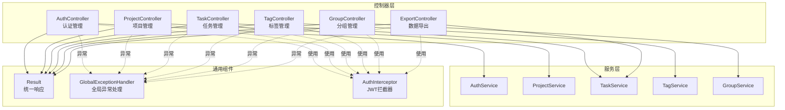
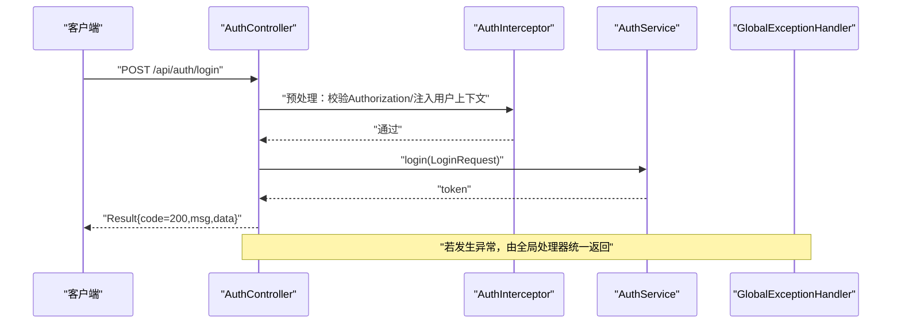
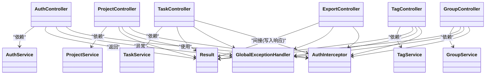

# 控制器层

<cite>
**本文引用的文件**
- [AuthController.java](file://backend/src/main/java/com/newworld/controller/AuthController.java)
- [ProjectController.java](file://backend/src/main/java/com/newworld/controller/ProjectController.java)
- [TaskController.java](file://backend/src/main/java/com/newworld/controller/TaskController.java)
- [TagController.java](file://backend/src/main/java/com/newworld/controller/TagController.java)
- [ExportController.java](file://backend/src/main/java/com/newworld/controller/ExportController.java)
- [GroupController.java](file://backend/src/main/java/com/newworld/controller/GroupController.java)
- [AuthService.java](file://backend/src/main/java/com/newworld/service/AuthService.java)
- [ProjectService.java](file://backend/src/main/java/com/newworld/service/ProjectService.java)
- [TaskService.java](file://backend/src/main/java/com/newworld/service/TaskService.java)
- [TagService.java](file://backend/src/main/java/com/newworld/service/TagService.java)
- [GroupService.java](file://backend/src/main/java/com/newworld/service/GroupService.java)
- [AuthServiceImpl.java](file://backend/src/main/java/com/newworld/service/impl/AuthServiceImpl.java)
- [ProjectServiceImpl.java](file://backend/src/main/java/com/newworld/service/impl/ProjectServiceImpl.java)
- [TaskServiceImpl.java](file://backend/src/main/java/com/newworld/service/impl/TaskServiceImpl.java)
- [TagServiceImpl.java](file://backend/src/main/java/com/newworld/service/impl/TagServiceImpl.java)
- [GroupServiceImpl.java](file://backend/src/main/java/com/newworld/service/impl/GroupServiceImpl.java)
- [LoginRequest.java](file://backend/src/main/java/com/newworld/dto/LoginRequest.java)
- [TaskQueryDTO.java](file://backend/src/main/java/com/newworld/dto/TaskQueryDTO.java)
- [TreeVO.java](file://backend/src/main/java/com/newworld/dto/TreeVO.java)
- [User.java](file://backend/src/main/java/com/newworld/entity/User.java)
- [Project.java](file://backend/src/main/java/com/newworld/entity/Project.java)
- [Task.java](file://backend/src/main/java/com/newworld/entity/Task.java)
- [Tag.java](file://backend/src/main/java/com/newworld/entity/Tag.java)
- [Group.java](file://backend/src/main/java/com/newworld/entity/Group.java)
- [Result.java](file://backend/src/main/java/com/newworld/common/Result.java)
- [GlobalExceptionHandler.java](file://backend/src/main/java/com/newworld/common/exception/GlobalExceptionHandler.java)
- [AuthInterceptor.java](file://backend/src/main/java/com/newworld/config/AuthInterceptor.java)
</cite>

## 目录
1. [引言](#引言)
2. [项目结构](#项目结构)
3. [核心组件](#核心组件)
4. [架构总览](#架构总览)
5. [详细组件分析](#详细组件分析)
6. [依赖分析](#依赖分析)
7. [性能考虑](#性能考虑)
8. [故障排查指南](#故障排查指南)
9. [结论](#结论)
10. [附录：API 定义与示例](#附录api-定义与示例)

## 引言
本文件聚焦于新世界项目的“控制器层”，系统性梳理各控制器的职责边界、API 设计、参数校验与错误处理机制，并给出调用示例与响应格式说明。控制器层通过统一响应包装与全局异常处理，确保对外接口的一致性与可维护性。

## 项目结构
控制器层位于后端模块的 controller 包中，围绕认证、项目、任务、标签、分组与数据导出六大领域提供 REST 接口；配合 DTO、Entity、Service 层完成业务编排与数据持久化。

图表来源
- [AuthController.java:1-55](file://backend/src/main/java/com/newworld/controller/AuthController.java#L1-L55)
- [ProjectController.java:1-51](file://backend/src/main/java/com/newworld/controller/ProjectController.java#L1-L51)
- [TaskController.java:1-112](file://backend/src/main/java/com/newworld/controller/TaskController.java#L1-L112)
- [TagController.java:1-43](file://backend/src/main/java/com/newworld/controller/TagController.java#L1-L43)
- [ExportController.java:1-47](file://backend/src/main/java/com/newworld/controller/ExportController.java#L1-L47)
- [GroupController.java:1-59](file://backend/src/main/java/com/newworld/controller/GroupController.java#L1-L59)
- [Result.java:1-90](file://backend/src/main/java/com/newworld/common/Result.java#L1-L90)
- [GlobalExceptionHandler.java:1-35](file://backend/src/main/java/com/newworld/common/exception/GlobalExceptionHandler.java#L1-L35)
- [AuthInterceptor.java:1-78](file://backend/src/main/java/com/newworld/config/AuthInterceptor.java#L1-L78)

章节来源
- [AuthController.java:1-55](file://backend/src/main/java/com/newworld/controller/AuthController.java#L1-L55)
- [ProjectController.java:1-51](file://backend/src/main/java/com/newworld/controller/ProjectController.java#L1-L51)
- [TaskController.java:1-112](file://backend/src/main/java/com/newworld/controller/TaskController.java#L1-L112)
- [TagController.java:1-43](file://backend/src/main/java/com/newworld/controller/TagController.java#L1-L43)
- [ExportController.java:1-47](file://backend/src/main/java/com/newworld/controller/ExportController.java#L1-L47)
- [GroupController.java:1-59](file://backend/src/main/java/com/newworld/controller/GroupController.java#L1-L59)

## 核心组件
- 统一响应包装 Result：所有控制器返回值均封装为 Result，包含状态码、消息与数据字段，便于前端统一处理。
- 全局异常处理 GlobalExceptionHandler：集中捕获业务异常、参数异常与系统异常，返回标准化错误响应。
- JWT 拦截器 AuthInterceptor：在进入控制器前校验 Authorization 头部，解析并注入当前用户上下文，未登录时抛出业务异常。

章节来源
- [Result.java:1-90](file://backend/src/main/java/com/newworld/common/Result.java#L1-L90)
- [GlobalExceptionHandler.java:1-35](file://backend/src/main/java/com/newworld/common/exception/GlobalExceptionHandler.java#L1-L35)
- [AuthInterceptor.java:1-78](file://backend/src/main/java/com/newworld/config/AuthInterceptor.java#L1-L78)

## 架构总览
控制器层遵循“薄控制器、厚服务”的设计原则：控制器仅负责参数接收、鉴权上下文注入、调用服务层与组装统一响应；复杂业务逻辑下沉至服务层；异常通过全局处理器统一收敛。

图表来源
- [AuthController.java:25-32](file://backend/src/main/java/com/newworld/controller/AuthController.java#L25-L32)
- [AuthInterceptor.java:30-58](file://backend/src/main/java/com/newworld/config/AuthInterceptor.java#L30-L58)
- [AuthService.java:14-17](file://backend/src/main/java/com/newworld/service/AuthService.java#L14-L17)
- [GlobalExceptionHandler.java:17-21](file://backend/src/main/java/com/newworld/common/exception/GlobalExceptionHandler.java#L17-L21)

## 详细组件分析

### 认证控制器 AuthController
- 职责：提供登录、注册、查询当前用户信息、退出登录等接口。
- 关键点：
  - 使用 @Valid 对请求体进行参数校验（如 LoginRequest 的非空约束）。
  - 通过 AuthInterceptor.getCurrentUserId() 获取当前用户 ID，用于后续业务操作。
  - 返回统一 Result 包装，成功时 code=200，msg 表示操作结果，data 可选承载具体数据。
- 异常处理：未登录或 Token 无效时，拦截器抛出业务异常，被全局异常处理器捕获并返回标准错误响应。

章节来源
- [AuthController.java:1-55](file://backend/src/main/java/com/newworld/controller/AuthController.java#L1-L55)
- [LoginRequest.java:1-37](file://backend/src/main/java/com/newworld/dto/LoginRequest.java#L1-L37)
- [AuthInterceptor.java:66-72](file://backend/src/main/java/com/newworld/config/AuthInterceptor.java#L66-L72)
- [GlobalExceptionHandler.java:17-21](file://backend/src/main/java/com/newworld/common/exception/GlobalExceptionHandler.java#L17-L21)

### 项目控制器 ProjectController
- 职责：按分组获取项目列表、新建项目、更新项目、删除项目。
- 关键点：
  - 列表查询支持可选分组过滤参数。
  - 新建项目时自动注入当前用户 ID。
  - 所有变更均返回统一 Result。
- 参数与校验：GET 参数通过 @RequestParam 注入；新增/更新请求体通过服务层进一步校验。

章节来源
- [ProjectController.java:1-51](file://backend/src/main/java/com/newworld/controller/ProjectController.java#L1-L51)
- [ProjectService.java:1-29](file://backend/src/main/java/com/newworld/service/ProjectService.java#L1-L29)
- [Project.java:1-117](file://backend/src/main/java/com/newworld/entity/Project.java#L1-L117)

### 任务控制器 TaskController
- 职责：任务全生命周期管理与扩展操作（状态/优先级更新、复制、归档、转笔记、生成分享链接、搜索、统计）。
- 关键点：
  - 列表查询支持多维条件（项目、状态、优先级、日期区间、关键字、标签、是否笔记）与分页。
  - 搜索与统计均基于当前用户上下文。
  - 多个“子操作”接口（如 /status、/priority、/duplicate 等）通过请求体传参。
- 参数与校验：TaskQueryDTO 提供丰富查询参数；部分操作通过 Map<String,String> 接收简单键值对。

章节来源
- [TaskController.java:1-112](file://backend/src/main/java/com/newworld/controller/TaskController.java#L1-L112)
- [TaskService.java:1-76](file://backend/src/main/java/com/newworld/service/TaskService.java#L1-L76)
- [TaskQueryDTO.java:1-145](file://backend/src/main/java/com/newworld/dto/TaskQueryDTO.java#L1-L145)
- [Task.java:1-184](file://backend/src/main/java/com/newworld/entity/Task.java#L1-L184)

### 标签控制器 TagController
- 职责：获取标签列表、新建标签、删除标签。
- 关键点：
  - 新建标签时自动注入当前用户 ID。
  - 返回统一 Result。

章节来源
- [TagController.java:1-43](file://backend/src/main/java/com/newworld/controller/TagController.java#L1-L43)
- [TagService.java](file://backend/src/main/java/com/newworld/service/TagService.java)
- [Tag.java:1-72](file://backend/src/main/java/com/newworld/entity/Tag.java#L1-L72)

### 分组控制器 GroupController
- 职责：获取分组列表、树形结构（分组→项目→任务）、新建分组、更新分组、删除分组。
- 关键点：
  - 树形结构接口支持按项目 ID 过滤。
  - 新建分组时自动注入当前用户 ID。
  - 返回统一 Result。

章节来源
- [GroupController.java:1-59](file://backend/src/main/java/com/newworld/controller/GroupController.java#L1-L59)
- [GroupService.java](file://backend/src/main/java/com/newworld/service/GroupService.java)
- [TreeVO.java:1-101](file://backend/src/main/java/com/newworld/dto/TreeVO.java#L1-L101)
- [Group.java:1-84](file://backend/src/main/java/com/newworld/entity/Group.java#L1-L84)

### 导出控制器 ExportController
- 职责：将任务数据导出为 Excel 文件。
- 关键点：
  - 基于 EasyExcel 写入响应流，设置合适的 Content-Type 与下载头。
  - 查询参数来自 TaskQueryDTO，结合当前用户上下文筛选数据。
  - 直接向 HttpServletResponse 输出二进制流，不返回 Result。

章节来源
- [ExportController.java:1-47](file://backend/src/main/java/com/newworld/controller/ExportController.java#L1-L47)
- [TaskService.java:14-14](file://backend/src/main/java/com/newworld/service/TaskService.java#L14-L14)

## 依赖分析
- 控制器与服务层：各控制器通过 @Autowired 注入对应服务接口，实现松耦合。
- 服务层与实体/DTO：服务层接收 DTO 并返回/持久化实体对象。
- 统一响应与异常：控制器统一返回 Result；异常通过全局处理器收敛。
- 鉴权链路：控制器依赖 AuthInterceptor 注入用户上下文，拦截器依赖 JWT 工具校验 Token。

图表来源
- [AuthController.java:1-55](file://backend/src/main/java/com/newworld/controller/AuthController.java#L1-L55)
- [ProjectController.java:1-51](file://backend/src/main/java/com/newworld/controller/ProjectController.java#L1-L51)
- [TaskController.java:1-112](file://backend/src/main/java/com/newworld/controller/TaskController.java#L1-L112)
- [TagController.java:1-43](file://backend/src/main/java/com/newworld/controller/TagController.java#L1-L43)
- [ExportController.java:1-47](file://backend/src/main/java/com/newworld/controller/ExportController.java#L1-L47)
- [Result.java:1-90](file://backend/src/main/java/com/newworld/common/Result.java#L1-L90)
- [GlobalExceptionHandler.java:1-35](file://backend/src/main/java/com/newworld/common/exception/GlobalExceptionHandler.java#L1-L35)
- [AuthInterceptor.java:1-78](file://backend/src/main/java/com/newworld/config/AuthInterceptor.java#L1-L78)

## 性能考虑
- 列表查询与导出：TaskController 的列表查询支持分页参数，建议前端合理设置 page 与 pageSize，避免一次性拉取过多数据。
- 导出性能：ExportController 直接写入响应流，注意控制查询范围与并发量，避免阻塞线程池。
- 缓存策略：对于高频读取的静态数据（如标签、分组），可在服务层引入缓存以降低数据库压力。
- 日志与监控：全局异常处理器记录日志，建议结合监控系统追踪异常趋势与耗时指标。

## 故障排查指南
- 未登录/Token 失效：AuthInterceptor 抛出业务异常，返回 401；检查请求头 Authorization 是否携带 Bearer Token。
- 参数非法：拦截器识别非法参数时返回 400；检查请求体与查询参数格式。
- 服务器内部错误：未知异常统一返回 500；查看服务端日志定位具体异常堆栈。
- 控制器返回结构：所有控制器返回 Result，前端应统一解析 code 与 msg 字段，data 中承载实际数据。

章节来源
- [AuthInterceptor.java:37-49](file://backend/src/main/java/com/newworld/config/AuthInterceptor.java#L37-L49)
- [GlobalExceptionHandler.java:17-33](file://backend/src/main/java/com/newworld/common/exception/GlobalExceptionHandler.java#L17-L33)
- [Result.java:22-64](file://backend/src/main/java/com/newworld/common/Result.java#L22-L64)

## 结论
控制器层通过清晰的职责划分、统一的响应与异常处理机制，以及严格的鉴权与参数校验，构建了稳定可靠的接口层。配合服务层的业务编排与 DTO/Entity 的数据契约，整体架构具备良好的可扩展性与可维护性。

## 附录：API 定义与示例

### 统一响应结构
- 成功：code=200，msg 为操作提示，data 可选承载具体数据。
- 失败：code 为错误码（如 400/401/500），msg 为错误描述。

章节来源
- [Result.java:22-64](file://backend/src/main/java/com/newworld/common/Result.java#L22-L64)

### 认证管理
- 登录
  - 方法与路径：POST /api/auth/login
  - 请求体：LoginRequest（username、password）
  - 响应：Result{code,msg,data:{token}}
- 注册
  - 方法与路径：POST /api/auth/register
  - 请求体：LoginRequest
  - 响应：Result{code,msg}
- 获取当前用户信息
  - 方法与路径：GET /api/auth/user-info
  - 响应：Result{code,msg,data:User}
- 退出登录
  - 方法与路径：POST /api/auth/logout
  - 响应：Result{code,msg}

章节来源
- [AuthController.java:25-53](file://backend/src/main/java/com/newworld/controller/AuthController.java#L25-L53)
- [LoginRequest.java:10-37](file://backend/src/main/java/com/newworld/dto/LoginRequest.java#L10-L37)
- [User.java:11-95](file://backend/src/main/java/com/newworld/entity/User.java#L11-L95)

### 项目管理
- 按分组获取项目列表
  - 方法与路径：GET /api/projects?groupId=Long
  - 响应：Result{code,msg,data:List<Project>}
- 新建项目
  - 方法与路径：POST /api/projects
  - 请求体：Project（不含 userId）
  - 响应：Result{code,msg,data:Project}
- 更新项目
  - 方法与路径：PUT /api/projects/{id}
  - 请求体：Project（包含 id）
  - 响应：Result{code,msg,data:Project}
- 删除项目
  - 方法与路径：DELETE /api/projects/{id}
  - 响应：Result{code,msg}

章节来源
- [ProjectController.java:22-49](file://backend/src/main/java/com/newworld/controller/ProjectController.java#L22-L49)
- [Project.java:11-117](file://backend/src/main/java/com/newworld/entity/Project.java#L11-L117)

### 任务管理
- 查询任务列表
  - 方法与路径：GET /api/tasks
  - 查询参数：TaskQueryDTO（projectId、status、priority、startDateFrom、startDateTo、dueDateFrom、dueDateTo、keyword、tag、isNote、page、pageSize）
  - 响应：Result{code,msg,data:List<Task>}
- 获取单个任务
  - 方法与路径：GET /api/tasks/{id}
  - 响应：Result{code,msg,data:Task}
- 新建任务
  - 方法与路径：POST /api/tasks
  - 请求体：Task（不含 userId）
  - 响应：Result{code,msg,data:Task}
- 更新任务
  - 方法与路径：PUT /api/tasks/{id}
  - 请求体：Task（包含 id）
  - 响应：Result{code,msg,data:Task}
- 删除任务
  - 方法与路径：DELETE /api/tasks/{id}
  - 响应：Result{code,msg}
- 更新任务状态
  - 方法与路径：PUT /api/tasks/{id}/status
  - 请求体：{status:String}
  - 响应：Result{code,msg,data:Task}
- 设置任务优先级
  - 方法与路径：PUT /api/tasks/{id}/priority
  - 请求体：{priority:String}
  - 响应：Result{code,msg,data:Task}
- 创建任务副本
  - 方法与路径：PUT /api/tasks/{id}/duplicate
  - 响应：Result{code,msg,data:Task}
- 归档任务
  - 方法与路径：PUT /api/tasks/{id}/archive
  - 响应：Result{code,msg,data:Task}
- 转换为笔记
  - 方法与路径：PUT /api/tasks/{id}/convert-note
  - 响应：Result{code,msg,data:Task}
- 生成分享链接
  - 方法与路径：GET /api/tasks/{id}/share-link
  - 响应：Result{code,msg,data:{link:String}}
- 搜索任务
  - 方法与路径：GET /api/tasks/search?keyword=String
  - 响应：Result{code,msg,data:List<Task>}
- 任务统计
  - 方法与路径：GET /api/tasks/statistics
  - 响应：Result{code,msg,data:TaskStatisticsVO}

章节来源
- [TaskController.java:25-110](file://backend/src/main/java/com/newworld/controller/TaskController.java#L25-L110)
- [TaskQueryDTO.java:10-145](file://backend/src/main/java/com/newworld/dto/TaskQueryDTO.java#L10-L145)
- [Task.java:11-184](file://backend/src/main/java/com/newworld/entity/Task.java#L11-L184)

### 标签管理
- 获取标签列表
  - 方法与路径：GET /api/tags
  - 响应：Result{code,msg,data:List<Tag>}
- 新建标签
  - 方法与路径：POST /api/tags
  - 请求体：Tag（不含 userId）
  - 响应：Result{code,msg,data:Tag}
- 删除标签
  - 方法与路径：DELETE /api/tags/{id}
  - 响应：Result{code,msg}

章节来源
- [TagController.java:21-41](file://backend/src/main/java/com/newworld/controller/TagController.java#L21-L41)
- [Tag.java:11-72](file://backend/src/main/java/com/newworld/entity/Tag.java#L11-L72)

### 分组管理
- 获取分组列表
  - 方法与路径：GET /api/groups
  - 响应：Result{code,msg,data:List<Group>}
- 获取树形结构
  - 方法与路径：GET /api/groups/tree?projectId=Long
  - 响应：Result{code,msg,data:List<TreeVO>}
- 新建分组
  - 方法与路径：POST /api/groups
  - 请求体：Group（不含 userId）
  - 响应：Result{code,msg,data:Group}
- 更新分组
  - 方法与路径：PUT /api/groups/{id}
  - 请求体：Group（包含 id）
  - 响应：Result{code,msg,data:Group}
- 删除分组
  - 方法与路径：DELETE /api/groups/{id}
  - 响应：Result{code,msg}

章节来源
- [GroupController.java:23-57](file://backend/src/main/java/com/newworld/controller/GroupController.java#L23-L57)
- [TreeVO.java:10-101](file://backend/src/main/java/com/newworld/dto/TreeVO.java#L10-L101)
- [Group.java:11-84](file://backend/src/main/java/com/newworld/entity/Group.java#L11-L84)

### 数据导出
- 导出任务为 Excel
  - 方法与路径：GET /api/export/tasks
  - 查询参数：TaskQueryDTO（同任务列表查询）
  - 响应：HTTP 200，Content-Disposition: attachment; filename*.xlsx，正文为 Excel 流

章节来源
- [ExportController.java:30-45](file://backend/src/main/java/com/newworld/controller/ExportController.java#L30-L45)

### 请求头与鉴权
- Authorization: Bearer <token>
- 未携带或无效的 Token 将触发 401 业务异常

章节来源
- [AuthInterceptor.java:37-49](file://backend/src/main/java/com/newworld/config/AuthInterceptor.java#L37-L49)