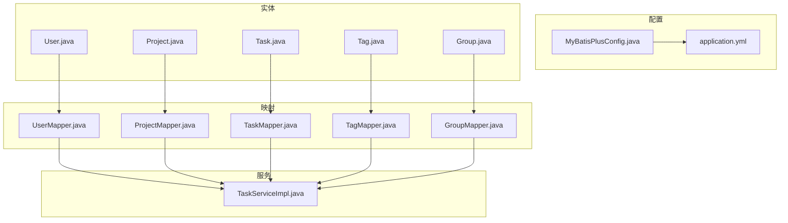
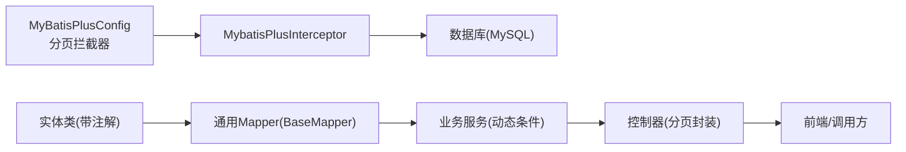
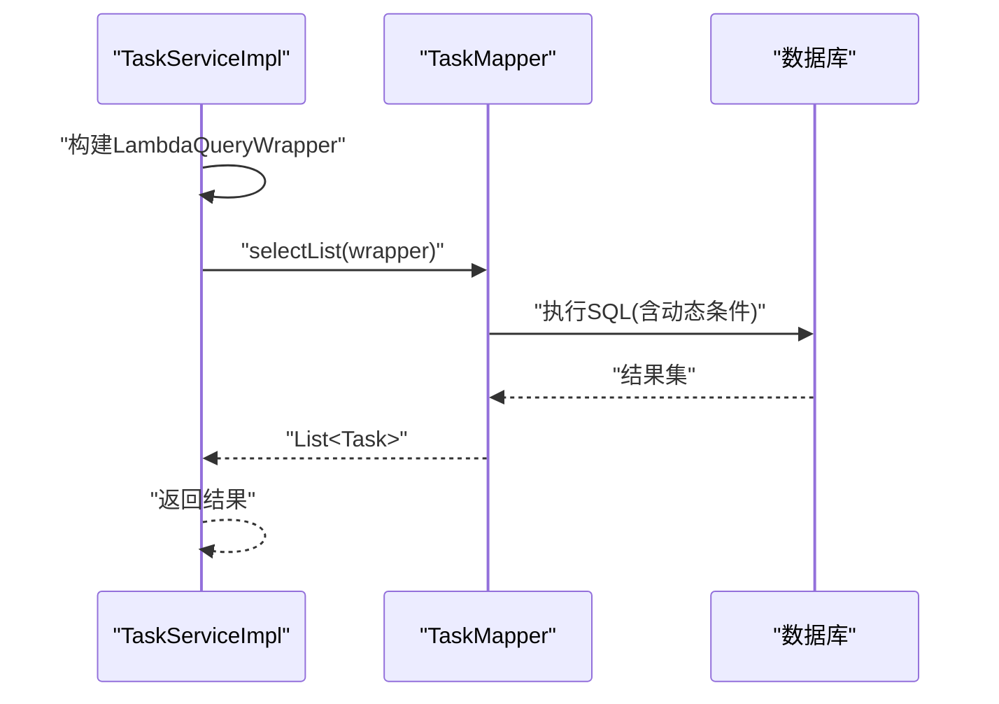
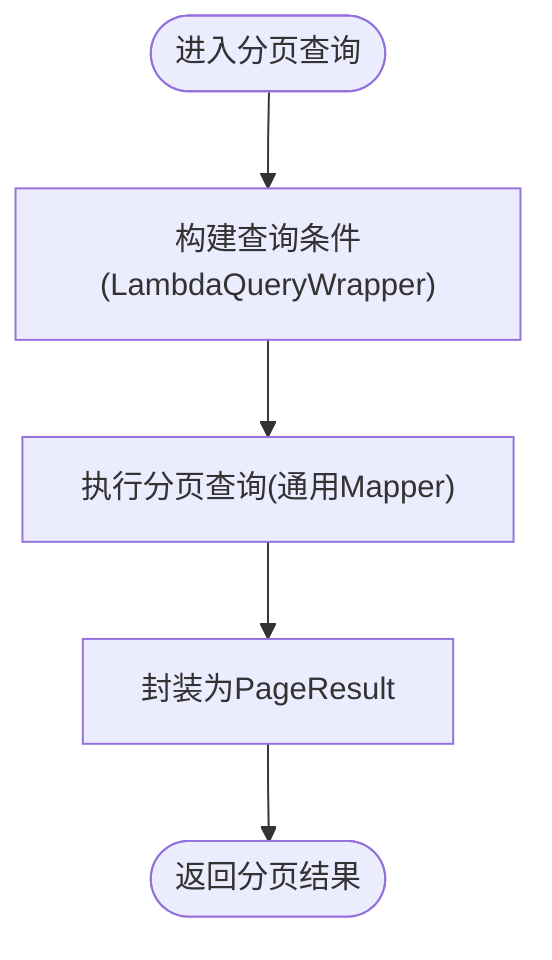
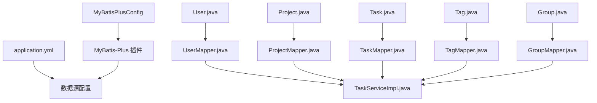

# 数据访问层

<cite>
**本文引用的文件**
- [MyBatisPlusConfig.java](file://backend/src/main/java/com/newworld/config/MyBatisPlusConfig.java)
- [application.yml](file://backend/src/main/resources/application.yml)
- [User.java](file://backend/src/main/java/com/newworld/entity/User.java)
- [Project.java](file://backend/src/main/java/com/newworld/entity/Project.java)
- [Task.java](file://backend/src/main/java/com/newworld/entity/Task.java)
- [Tag.java](file://backend/src/main/java/com/newworld/entity/Tag.java)
- [Group.java](file://backend/src/main/java/com/newworld/entity/Group.java)
- [UserMapper.java](file://backend/src/main/java/com/newworld/mapper/UserMapper.java)
- [ProjectMapper.java](file://backend/src/main/java/com/newworld/mapper/ProjectMapper.java)
- [TaskMapper.java](file://backend/src/main/java/com/newworld/mapper/TaskMapper.java)
- [TagMapper.java](file://backend/src/main/java/com/newworld/mapper/TagMapper.java)
- [GroupMapper.java](file://backend/src/main/java/com/newworld/mapper/GroupMapper.java)
- [TaskServiceImpl.java](file://backend/src/main/java/com/newworld/service/impl/TaskServiceImpl.java)
- [PageResult.java](file://backend/src/main/java/com/newworld/common/PageResult.java)
- [init.sql](file://backend/sql/init.sql)
</cite>

## 目录
1. [简介](#简介)
2. [项目结构](#项目结构)
3. [核心组件](#核心组件)
4. [架构总览](#架构总览)
5. [详细组件分析](#详细组件分析)
6. [依赖分析](#依赖分析)
7. [性能考虑](#性能考虑)
8. [故障排查指南](#故障排查指南)
9. [结论](#结论)
10. [附录](#附录)

## 简介
本文件聚焦于新世界项目的数据访问层，系统性阐述 MyBatis-Plus 的配置与使用，涵盖数据库连接配置、实体映射、通用 Mapper 接口、各 Mapper 查询设计、动态 SQL 编写规范、分页查询实现以及数据访问最佳实践（性能优化、索引设计、查询优化）。读者可据此快速理解并高效扩展数据访问能力。

## 项目结构
数据访问层位于后端模块 backend 中，采用“实体-映射-服务”三层结构：
- 实体层：定义与数据库表对应的实体类，标注 MyBatis-Plus 表名与字段元信息。
- 映射层：基于 BaseMapper 的通用 Mapper 接口，提供 CRUD 能力。
- 服务层：通过注入 Mapper 执行业务逻辑，组合动态条件构造器实现复杂查询。

图表来源
- [MyBatisPlusConfig.java:1-22](file://backend/src/main/java/com/newworld/config/MyBatisPlusConfig.java#L1-L22)
- [application.yml:1-75](file://backend/src/main/resources/application.yml#L1-L75)
- [User.java:1-95](file://backend/src/main/java/com/newworld/entity/User.java#L1-L95)
- [Project.java:1-117](file://backend/src/main/java/com/newworld/entity/Project.java#L1-L117)
- [Task.java:1-184](file://backend/src/main/java/com/newworld/entity/Task.java#L1-L184)
- [Tag.java:1-72](file://backend/src/main/java/com/newworld/entity/Tag.java#L1-L72)
- [Group.java:1-84](file://backend/src/main/java/com/newworld/entity/Group.java#L1-L84)
- [UserMapper.java:1-10](file://backend/src/main/java/com/newworld/mapper/UserMapper.java#L1-L10)
- [ProjectMapper.java:1-10](file://backend/src/main/java/com/newworld/mapper/ProjectMapper.java#L1-L10)
- [TaskMapper.java:1-10](file://backend/src/main/java/com/newworld/mapper/TaskMapper.java#L1-L10)
- [TagMapper.java:1-10](file://backend/src/main/java/com/newworld/mapper/TagMapper.java#L1-L10)
- [GroupMapper.java:1-10](file://backend/src/main/java/com/newworld/mapper/GroupMapper.java#L1-L10)
- [TaskServiceImpl.java:1-194](file://backend/src/main/java/com/newworld/service/impl/TaskServiceImpl.java#L1-L194)

章节来源
- [MyBatisPlusConfig.java:1-22](file://backend/src/main/java/com/newworld/config/MyBatisPlusConfig.java#L1-L22)
- [application.yml:1-75](file://backend/src/main/resources/application.yml#L1-L75)

## 核心组件
- MyBatis-Plus 配置：启用分页插件，统一拦截处理分页请求。
- 数据源配置：MySQL 连接参数、驱动、账号密码等。
- 实体映射：通过注解声明表名、主键策略、自动填充字段等。
- 通用 Mapper：各 Mapper 继承 BaseMapper，天然具备基础 CRUD。
- 动态查询：在服务层使用 LambdaQueryWrapper 构建条件链，支持多字段、范围、模糊与组合查询。
- 分页封装：PageResult 提供分页返回结构，便于控制器输出。

章节来源
- [MyBatisPlusConfig.java:15-20](file://backend/src/main/java/com/newworld/config/MyBatisPlusConfig.java#L15-L20)
- [application.yml:10-16](file://backend/src/main/resources/application.yml#L10-L16)
- [application.yml:36-50](file://backend/src/main/resources/application.yml#L36-L50)
- [User.java:11](file://backend/src/main/java/com/newworld/entity/User.java#L11)
- [Project.java:11](file://backend/src/main/java/com/newworld/entity/Project.java#L11)
- [Task.java:12](file://backend/src/main/java/com/newworld/entity/Task.java#L12)
- [Tag.java:11](file://backend/src/main/java/com/newworld/entity/Tag.java#L11)
- [Group.java:11](file://backend/src/main/java/com/newworld/entity/Group.java#L11)
- [UserMapper.java:7-9](file://backend/src/main/java/com/newworld/mapper/UserMapper.java#L7-L9)
- [ProjectMapper.java:7-9](file://backend/src/main/java/com/newworld/mapper/ProjectMapper.java#L7-L9)
- [TaskMapper.java:7-9](file://backend/src/main/java/com/newworld/mapper/TaskMapper.java#L7-L9)
- [TagMapper.java:7-9](file://backend/src/main/java/com/newworld/mapper/TagMapper.java#L7-L9)
- [GroupMapper.java:7-9](file://backend/src/main/java/com/newworld/mapper/GroupMapper.java#L7-L9)
- [TaskServiceImpl.java:23-44](file://backend/src/main/java/com/newworld/service/impl/TaskServiceImpl.java#L23-L44)
- [PageResult.java:13-35](file://backend/src/main/java/com/newworld/common/PageResult.java#L13-L35)

## 架构总览
数据访问层遵循“配置-实体-映射-服务”的分层设计，MyBatis-Plus 在配置阶段注入分页拦截器，在运行期对分页查询进行增强；服务层通过通用 Mapper 执行数据操作，并以动态条件构建器实现灵活查询。

图表来源
- [MyBatisPlusConfig.java:15-20](file://backend/src/main/java/com/newworld/config/MyBatisPlusConfig.java#L15-L20)
- [application.yml:36-50](file://backend/src/main/resources/application.yml#L36-L50)
- [User.java:11](file://backend/src/main/java/com/newworld/entity/User.java#L11)
- [Project.java:11](file://backend/src/main/java/com/newworld/entity/Project.java#L11)
- [Task.java:12](file://backend/src/main/java/com/newworld/entity/Task.java#L12)
- [Tag.java:11](file://backend/src/main/java/com/newworld/entity/Tag.java#L11)
- [Group.java:11](file://backend/src/main/java/com/newworld/entity/Group.java#L11)
- [UserMapper.java:7-9](file://backend/src/main/java/com/newworld/mapper/UserMapper.java#L7-L9)
- [ProjectMapper.java:7-9](file://backend/src/main/java/com/newworld/mapper/ProjectMapper.java#L7-L9)
- [TaskMapper.java:7-9](file://backend/src/main/java/com/newworld/mapper/TaskMapper.java#L7-L9)
- [TagMapper.java:7-9](file://backend/src/main/java/com/newworld/mapper/TagMapper.java#L7-L9)
- [GroupMapper.java:7-9](file://backend/src/main/java/com/newworld/mapper/GroupMapper.java#L7-L9)
- [TaskServiceImpl.java:23-44](file://backend/src/main/java/com/newworld/service/impl/TaskServiceImpl.java#L23-L44)
- [PageResult.java:13-35](file://backend/src/main/java/com/newworld/common/PageResult.java#L13-L35)

## 详细组件分析

### MyBatis-Plus 配置与使用
- 分页插件：在配置类中注册 MybatisPlusInterceptor，并添加 PaginationInnerInterceptor，使分页查询自动生效。
- 全局配置：在 application.yml 中设置 Mapper XML 位置、类型别名包、驼峰映射、日志实现、全局 ID 类型与逻辑删除字段等。

章节来源
- [MyBatisPlusConfig.java:15-20](file://backend/src/main/java/com/newworld/config/MyBatisPlusConfig.java#L15-L20)
- [application.yml:36-50](file://backend/src/main/resources/application.yml#L36-L50)

### 数据库连接配置
- 数据源：driver-class-name、url、username、password 指定 MySQL 连接参数。
- MyBatis-Plus：mapper-locations、type-aliases-package、map-underscore-to-camel-case、cache-enabled、log-impl 等配置项明确映射与日志行为。
- 全局配置：id-type、logic-delete-field、logic-delete-value、logic-not-delete-value 控制主键策略与软删除。

章节来源
- [application.yml:10-16](file://backend/src/main/resources/application.yml#L10-L16)
- [application.yml:36-50](file://backend/src/main/resources/application.yml#L36-L50)

### 实体映射配置
- 表名注解：@TableName 指定与数据库表的对应关系。
- 主键策略：@TableId(type = IdType.AUTO) 使用数据库自增。
- 自动填充：@TableField(fill = FieldFill.INSERT/INSERT_UPDATE) 配置创建与更新时间自动填充。
- 字段映射：驼峰命名由全局配置开启，避免手动映射。

章节来源
- [User.java:11](file://backend/src/main/java/com/newworld/entity/User.java#L11)
- [User.java:31](file://backend/src/main/java/com/newworld/entity/User.java#L31)
- [User.java:35](file://backend/src/main/java/com/newworld/entity/User.java#L35)
- [Project.java:11](file://backend/src/main/java/com/newworld/entity/Project.java#L11)
- [Project.java:37](file://backend/src/main/java/com/newworld/entity/Project.java#L37)
- [Project.java:41](file://backend/src/main/java/com/newworld/entity/Project.java#L41)
- [Task.java:12](file://backend/src/main/java/com/newworld/entity/Task.java#L12)
- [Task.java:56](file://backend/src/main/java/com/newworld/entity/Task.java#L56)
- [Task.java:60](file://backend/src/main/java/com/newworld/entity/Task.java#L60)
- [Tag.java:11](file://backend/src/main/java/com/newworld/entity/Tag.java#L11)
- [Tag.java:28](file://backend/src/main/java/com/newworld/entity/Tag.java#L28)
- [Group.java:11](file://backend/src/main/java/com/newworld/entity/Group.java#L11)
- [Group.java:28](file://backend/src/main/java/com/newworld/entity/Group.java#L28)
- [Group.java:32](file://backend/src/main/java/com/newworld/entity/Group.java#L32)

### 通用 Mapper 接口设计
- 各 Mapper 均继承 BaseMapper<T>，天然具备 insert、selectById、selectList、selectCount、updateById、deleteById 等通用方法。
- 无需编写 XML，即可满足常规 CRUD 场景；复杂查询通过服务层动态条件构造器实现。

章节来源
- [UserMapper.java:7-9](file://backend/src/main/java/com/newworld/mapper/UserMapper.java#L7-L9)
- [ProjectMapper.java:7-9](file://backend/src/main/java/com/newworld/mapper/ProjectMapper.java#L7-L9)
- [TaskMapper.java:7-9](file://backend/src/main/java/com/newworld/mapper/TaskMapper.java#L7-L9)
- [TagMapper.java:7-9](file://backend/src/main/java/com/newworld/mapper/TagMapper.java#L7-L9)
- [GroupMapper.java:7-9](file://backend/src/main/java/com/newworld/mapper/GroupMapper.java#L7-L9)

### 各 Mapper 查询方法与动态 SQL 设计
- TaskServiceImpl 展示了典型动态查询模式：
  - 多条件拼装：eq/like/ge/le/or/and 等链式组合，支持空值判断与字符串判空。
  - 范围查询：起止日期区间过滤。
  - 组合查询：关键词同时匹配标题与描述。
  - 排序规则：先按排序号升序，再按创建时间降序。
- 其他实体（User、Project、Tag、Group）均采用通用 Mapper，若需定制查询，可在对应 Mapper 中新增 XML 或在服务层继续沿用动态条件构造器。

图表来源
- [TaskServiceImpl.java:23-44](file://backend/src/main/java/com/newworld/service/impl/TaskServiceImpl.java#L23-L44)
- [TaskMapper.java:7-9](file://backend/src/main/java/com/newworld/mapper/TaskMapper.java#L7-L9)

章节来源
- [TaskServiceImpl.java:23-44](file://backend/src/main/java/com/newworld/service/impl/TaskServiceImpl.java#L23-L44)

### SQL 语句编写规范与动态 SQL
- 规范建议：
  - 明确 SELECT 列，避免使用 SELECT *。
  - WHERE 条件尽量使用索引列，减少函数包裹导致的索引失效。
  - LIKE 通配符使用在右侧，必要时结合前缀索引或全文索引。
  - 使用 BETWEEN 替代多个 OR 条件，提升可读性与执行效率。
  - 对频繁查询的维度建立复合索引，如任务表的用户+日期+截止日期。
- 动态 SQL：通过 LambdaQueryWrapper 的链式 API 实现，自动拼接 AND/OR、区间、模糊匹配等，减少手写 SQL 出错概率。

章节来源
- [TaskServiceImpl.java:23-44](file://backend/src/main/java/com/newworld/service/impl/TaskServiceImpl.java#L23-L44)
- [init.sql:86-91](file://backend/sql/init.sql#L86-L91)

### 分页查询实现
- 分页拦截：MyBatis-Plus 分页插件自动拦截分页请求，注入分页上下文。
- 返回封装：PageResult 提供 records、total、page、pageSize 字段，便于前后端交互。
- 使用流程：服务层接收分页参数，构造查询条件，调用通用 Mapper 的分页查询方法，最终包装为 PageResult 返回。

图表来源
- [MyBatisPlusConfig.java:15-20](file://backend/src/main/java/com/newworld/config/MyBatisPlusConfig.java#L15-L20)
- [PageResult.java:13-35](file://backend/src/main/java/com/newworld/common/PageResult.java#L13-L35)

章节来源
- [MyBatisPlusConfig.java:15-20](file://backend/src/main/java/com/newworld/config/MyBatisPlusConfig.java#L15-L20)
- [PageResult.java:13-35](file://backend/src/main/java/com/newworld/common/PageResult.java#L13-L35)

## 依赖分析
- 配置依赖：MyBatisPlusConfig 依赖 MyBatis-Plus 分页插件；application.yml 提供数据源与 MyBatis-Plus 全局配置。
- 实体依赖：各实体类通过注解声明表名与字段元信息，影响通用 Mapper 的 SQL 生成与字段映射。
- 映射依赖：各 Mapper 继承 BaseMapper，获得通用 CRUD 方法；复杂查询依赖服务层动态条件构造器。
- 服务依赖：TaskServiceImpl 注入 TaskMapper 并组合多种查询场景，体现服务层对数据访问层的封装与复用。

图表来源
- [MyBatisPlusConfig.java:15-20](file://backend/src/main/java/com/newworld/config/MyBatisPlusConfig.java#L15-L20)
- [application.yml:10-16](file://backend/src/main/resources/application.yml#L10-L16)
- [application.yml:36-50](file://backend/src/main/resources/application.yml#L36-L50)
- [User.java:11](file://backend/src/main/java/com/newworld/entity/User.java#L11)
- [Project.java:11](file://backend/src/main/java/com/newworld/entity/Project.java#L11)
- [Task.java:12](file://backend/src/main/java/com/newworld/entity/Task.java#L12)
- [Tag.java:11](file://backend/src/main/java/com/newworld/entity/Tag.java#L11)
- [Group.java:11](file://backend/src/main/java/com/newworld/entity/Group.java#L11)
- [UserMapper.java:7-9](file://backend/src/main/java/com/newworld/mapper/UserMapper.java#L7-L9)
- [ProjectMapper.java:7-9](file://backend/src/main/java/com/newworld/mapper/ProjectMapper.java#L7-L9)
- [TaskMapper.java:7-9](file://backend/src/main/java/com/newworld/mapper/TaskMapper.java#L7-L9)
- [TagMapper.java:7-9](file://backend/src/main/java/com/newworld/mapper/TagMapper.java#L7-L9)
- [GroupMapper.java:7-9](file://backend/src/main/java/com/newworld/mapper/GroupMapper.java#L7-L9)
- [TaskServiceImpl.java:20-21](file://backend/src/main/java/com/newworld/service/impl/TaskServiceImpl.java#L20-L21)

章节来源
- [MyBatisPlusConfig.java:15-20](file://backend/src/main/java/com/newworld/config/MyBatisPlusConfig.java#L15-L20)
- [application.yml:10-16](file://backend/src/main/resources/application.yml#L10-L16)
- [application.yml:36-50](file://backend/src/main/resources/application.yml#L36-L50)
- [TaskServiceImpl.java:20-21](file://backend/src/main/java/com/newworld/service/impl/TaskServiceImpl.java#L20-L21)

## 性能考虑
- 索引设计：
  - 任务表已建立用户+开始日期+截止日期复合索引，有利于按用户与日期范围查询。
  - 可根据实际查询维度补充索引，如按状态、优先级、项目等维度建立单列或复合索引。
- 查询优化：
  - 使用精确相等条件优先于范围查询，减少扫描行数。
  - LIKE 通配符尽量放右侧，必要时使用前缀索引或搜索引擎替代。
  - 避免在 WHERE 子句中对列使用函数或表达式，防止索引失效。
- 通用 Mapper 优化：
  - 尽量使用 selectList/selectCount 的条件组合，避免一次性加载全表。
  - 对高频统计查询，可考虑缓存中间结果或物化视图。
- 分页优化：
  - 大数据量分页时，避免 deep paging（超大 offset），可采用基于游标的分页策略。
  - 合理设置每页大小，避免单页过大导致内存压力。

章节来源
- [init.sql:86-91](file://backend/sql/init.sql#L86-L91)
- [TaskServiceImpl.java:23-44](file://backend/src/main/java/com/newworld/service/impl/TaskServiceImpl.java#L23-L44)

## 故障排查指南
- 分页不生效：
  - 检查 MyBatis-Plus 分页插件是否正确注册。
  - 确认查询方法是否返回分页对象（如 Page<T>）。
- 查询结果异常：
  - 检查动态条件构造器的 eq/like/ge/le 参数是否传入空值或空字符串。
  - 确认实体注解的表名与字段映射是否与数据库一致。
- 数据库连接失败：
  - 核对 application.yml 中的 driver-class-name、url、username、password。
- 逻辑删除未生效：
  - 确认全局配置中的逻辑删除字段、值与实体软删除字段一致。

章节来源
- [MyBatisPlusConfig.java:15-20](file://backend/src/main/java/com/newworld/config/MyBatisPlusConfig.java#L15-L20)
- [application.yml:36-50](file://backend/src/main/resources/application.yml#L36-L50)
- [TaskServiceImpl.java:23-44](file://backend/src/main/java/com/newworld/service/impl/TaskServiceImpl.java#L23-L44)

## 结论
本数据访问层以 MyBatis-Plus 为核心，通过通用 Mapper 与动态条件构造器实现高内聚、低耦合的数据访问能力。配合完善的索引与查询优化策略，能够有效支撑任务、项目、标签与分组等核心业务的日常查询与维护需求。后续可在现有基础上按需扩展复杂查询与统计分析，持续提升性能与可维护性。

## 附录
- 初始化脚本包含数据库、表结构、索引与默认用户，可作为本地开发与测试环境的基准。
- PageResult 提供标准分页返回结构，便于前后端约定与统一处理。

章节来源
- [init.sql:1-95](file://backend/sql/init.sql#L1-L95)
- [PageResult.java:13-35](file://backend/src/main/java/com/newworld/common/PageResult.java#L13-L35)