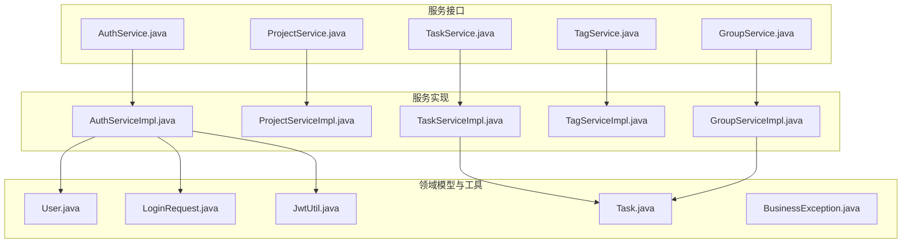
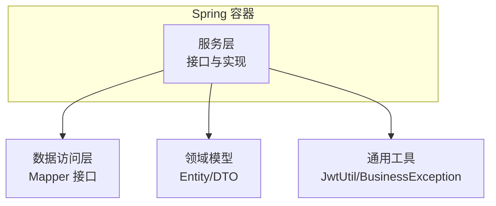
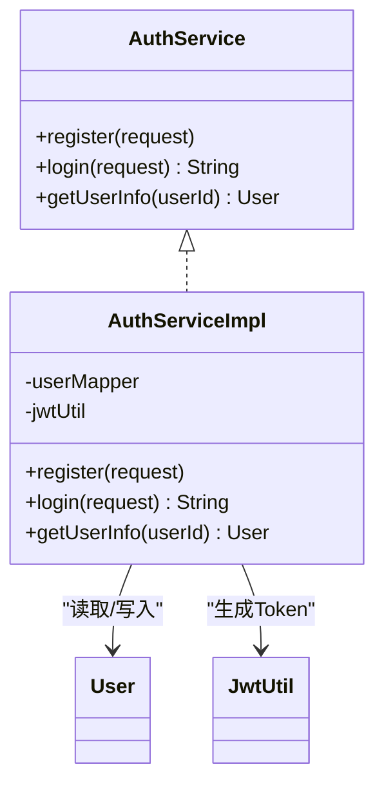
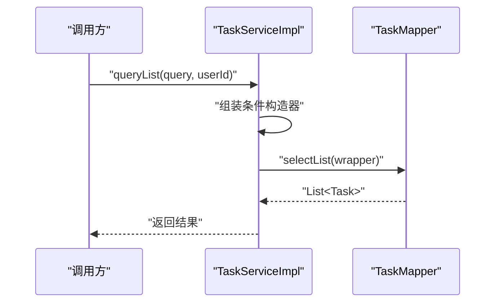
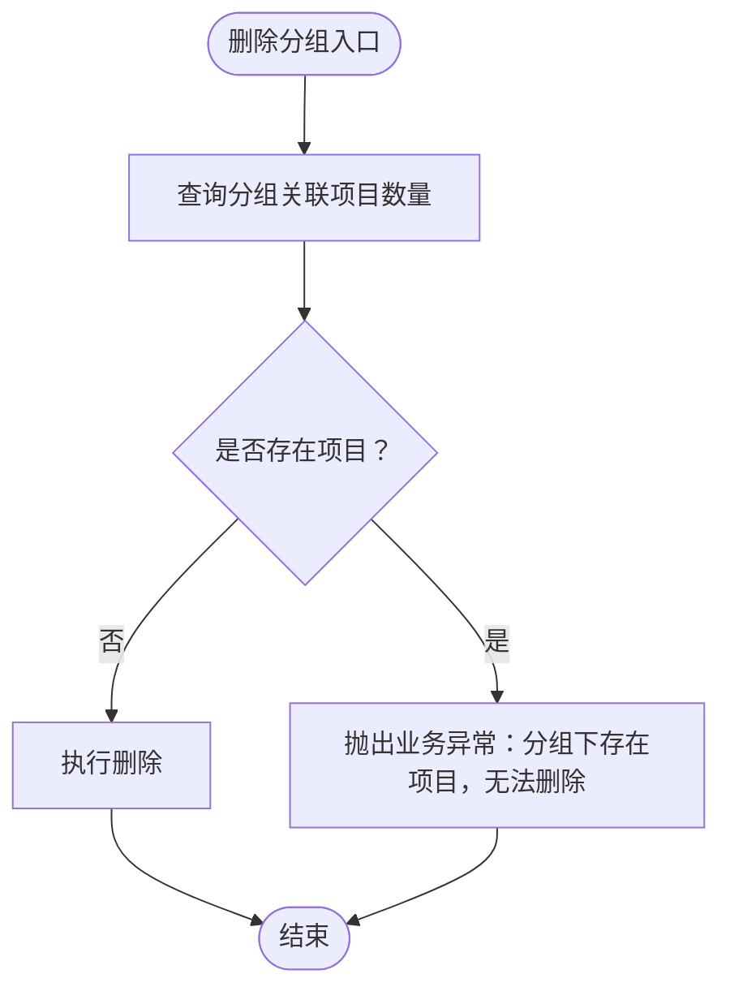
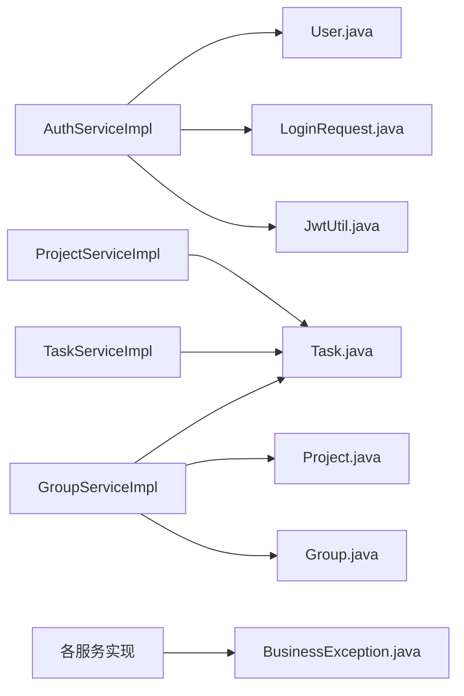

# 服务层

<cite>
**本文引用的文件**
- [AuthService.java](file://backend/src/main/java/com/newworld/service/AuthService.java)
- [AuthServiceImpl.java](file://backend/src/main/java/com/newworld/service/impl/AuthServiceImpl.java)
- [ProjectService.java](file://backend/src/main/java/com/newworld/service/ProjectService.java)
- [ProjectServiceImpl.java](file://backend/src/main/java/com/newworld/service/impl/ProjectServiceImpl.java)
- [TaskService.java](file://backend/src/main/java/com/newworld/service/TaskService.java)
- [TaskServiceImpl.java](file://backend/src/main/java/com/newworld/service/impl/TaskServiceImpl.java)
- [TagService.java](file://backend/src/main/java/com/newworld/service/TagService.java)
- [TagServiceImpl.java](file://backend/src/main/java/com/newworld/service/impl/TagServiceImpl.java)
- [GroupService.java](file://backend/src/main/java/com/newworld/service/GroupService.java)
- [GroupServiceImpl.java](file://backend/src/main/java/com/newworld/service/impl/GroupServiceImpl.java)
- [User.java](file://backend/src/main/java/com/newworld/entity/User.java)
- [Task.java](file://backend/src/main/java/com/newworld/entity/Task.java)
- [LoginRequest.java](file://backend/src/main/java/com/newworld/dto/LoginRequest.java)
- [JwtUtil.java](file://backend/src/main/java/com/newworld/common/JwtUtil.java)
- [BusinessException.java](file://backend/src/main/java/com/newworld/common/exception/BusinessException.java)
</cite>

## 目录
1. [引言](#引言)
2. [项目结构](#项目结构)
3. [核心组件](#核心组件)
4. [架构总览](#架构总览)
5. [详细组件分析](#详细组件分析)
6. [依赖分析](#依赖分析)
7. [性能考虑](#性能考虑)
8. [故障排查指南](#故障排查指南)
9. [结论](#结论)
10. [附录](#附录)

## 引言
本文件系统性梳理新世界项目的服务层设计与实现，覆盖认证服务、项目服务、任务服务、标签服务与分组服务五大模块。文档重点阐述各服务接口的职责边界、业务逻辑封装方式、数据校验与异常处理策略，并给出调用示例、依赖注入与缓存建议、以及性能优化实践，帮助开发者在不深入源码细节的情况下快速理解并正确使用服务层。

## 项目结构
服务层位于后端 Java 源码的 service 与 service/impl 包中，采用“接口 + 实现类”的分层设计，配合 DTO、Entity、Mapper 等基础设施完成业务编排。整体结构清晰、职责单一，便于扩展与维护。

图表来源
- [AuthService.java:1-24](file://backend/src/main/java/com/newworld/service/AuthService.java#L1-L24)
- [AuthServiceImpl.java:1-69](file://backend/src/main/java/com/newworld/service/impl/AuthServiceImpl.java#L1-L69)
- [ProjectService.java:1-29](file://backend/src/main/java/com/newworld/service/ProjectService.java#L1-L29)
- [ProjectServiceImpl.java:1-60](file://backend/src/main/java/com/newworld/service/impl/ProjectServiceImpl.java#L1-L60)
- [TaskService.java:1-76](file://backend/src/main/java/com/newworld/service/TaskService.java#L1-L76)
- [TaskServiceImpl.java:1-194](file://backend/src/main/java/com/newworld/service/impl/TaskServiceImpl.java#L1-L194)
- [TagService.java:1-24](file://backend/src/main/java/com/newworld/service/TagService.java#L1-L24)
- [TagServiceImpl.java:1-35](file://backend/src/main/java/com/newworld/service/impl/TagServiceImpl.java#L1-L35)
- [GroupService.java:1-35](file://backend/src/main/java/com/newworld/service/GroupService.java#L1-L35)
- [GroupServiceImpl.java:1-140](file://backend/src/main/java/com/newworld/service/impl/GroupServiceImpl.java#L1-L140)
- [User.java:1-95](file://backend/src/main/java/com/newworld/entity/User.java#L1-L95)
- [Task.java:1-184](file://backend/src/main/java/com/newworld/entity/Task.java#L1-L184)
- [LoginRequest.java:1-37](file://backend/src/main/java/com/newworld/dto/LoginRequest.java#L1-L37)
- [JwtUtil.java:1-78](file://backend/src/main/java/com/newworld/common/JwtUtil.java#L1-L78)
- [BusinessException.java:1-24](file://backend/src/main/java/com/newworld/common/exception/BusinessException.java#L1-L24)

章节来源
- [AuthService.java:1-24](file://backend/src/main/java/com/newworld/service/AuthService.java#L1-L24)
- [ProjectService.java:1-29](file://backend/src/main/java/com/newworld/service/ProjectService.java#L1-L29)
- [TaskService.java:1-76](file://backend/src/main/java/com/newworld/service/TaskService.java#L1-L76)
- [TagService.java:1-24](file://backend/src/main/java/com/newworld/service/TagService.java#L1-L24)
- [GroupService.java:1-35](file://backend/src/main/java/com/newworld/service/GroupService.java#L1-L35)

## 核心组件
- 认证服务：负责用户注册、登录与个人信息查询；登录成功后签发 JWT。
- 项目服务：按分组维度查询项目、创建/更新/删除项目；删除前校验是否存在关联任务。
- 任务服务：复杂查询、状态/优先级更新、复制、归档、转笔记、生成分享链接、搜索与统计。
- 标签服务：按用户查询标签、创建与删除标签。
- 分组服务：查询分组、构建树形结构（分组-项目-任务）、创建/更新/删除分组；删除前校验是否存在关联项目。

章节来源
- [AuthService.java:6-23](file://backend/src/main/java/com/newworld/service/AuthService.java#L6-L23)
- [ProjectService.java:7-28](file://backend/src/main/java/com/newworld/service/ProjectService.java#L7-L28)
- [TaskService.java:9-75](file://backend/src/main/java/com/newworld/service/TaskService.java#L9-L75)
- [TagService.java:7-23](file://backend/src/main/java/com/newworld/service/TagService.java#L7-L23)
- [GroupService.java:8-34](file://backend/src/main/java/com/newworld/service/GroupService.java#L8-L34)

## 架构总览
服务层通过 Spring 组件化装配，实现类以注解方式声明为服务 Bean，接口作为对外契约。各实现类通过 Mapper 完成数据库访问，统一使用业务异常进行错误传播，避免直接抛出底层异常。

图表来源
- [AuthServiceImpl.java:14-21](file://backend/src/main/java/com/newworld/service/impl/AuthServiceImpl.java#L14-L21)
- [ProjectServiceImpl.java:15-22](file://backend/src/main/java/com/newworld/service/impl/ProjectServiceImpl.java#L15-L22)
- [TaskServiceImpl.java:17-21](file://backend/src/main/java/com/newworld/service/impl/TaskServiceImpl.java#L17-L21)
- [TagServiceImpl.java:12-16](file://backend/src/main/java/com/newworld/service/impl/TagServiceImpl.java#L12-L16)
- [GroupServiceImpl.java:21-31](file://backend/src/main/java/com/newworld/service/impl/GroupServiceImpl.java#L21-L31)
- [JwtUtil.java:15-24](file://backend/src/main/java/com/newworld/common/JwtUtil.java#L15-L24)
- [BusinessException.java:6-22](file://backend/src/main/java/com/newworld/common/exception/BusinessException.java#L6-L22)

## 详细组件分析

### 认证服务（AuthService）
- 职责边界
  - 注册：检查用户名唯一性，对明文密码进行摘要加密后入库。
  - 登录：根据用户名查找用户，比对加密后的密码，成功则签发 JWT。
  - 获取用户信息：按 ID 查询用户并脱敏返回。
- 关键点
  - 密码安全：使用摘要算法加密存储。
  - Token 策略：基于配置生成过期时间可控的 JWT。
  - 错误处理：用户名/密码错误、用户不存在等场景抛出业务异常。
- 依赖关系
  - 使用用户 Mapper 进行读写。
  - 使用 JWT 工具生成 Token。
  - 使用业务异常统一错误语义。

图表来源
- [AuthService.java:6-23](file://backend/src/main/java/com/newworld/service/AuthService.java#L6-L23)
- [AuthServiceImpl.java:14-67](file://backend/src/main/java/com/newworld/service/impl/AuthServiceImpl.java#L14-L67)
- [User.java:13-37](file://backend/src/main/java/com/newworld/entity/User.java#L13-L37)
- [JwtUtil.java:29-40](file://backend/src/main/java/com/newworld/common/JwtUtil.java#L29-L40)

章节来源
- [AuthService.java:6-23](file://backend/src/main/java/com/newworld/service/AuthService.java#L6-L23)
- [AuthServiceImpl.java:23-67](file://backend/src/main/java/com/newworld/service/impl/AuthServiceImpl.java#L23-L67)
- [LoginRequest.java:13-19](file://backend/src/main/java/com/newworld/dto/LoginRequest.java#L13-L19)
- [JwtUtil.java:29-40](file://backend/src/main/java/com/newworld/common/JwtUtil.java#L29-L40)
- [BusinessException.java:10-18](file://backend/src/main/java/com/newworld/common/exception/BusinessException.java#L10-L18)

### 项目服务（ProjectService）
- 职责边界
  - 按分组获取项目列表，支持排序。
  - 创建/更新/删除项目。
- 关键点
  - 删除前置校验：若项目下存在任务则禁止删除。
  - 更新前先查重，避免空更新。
- 依赖关系
  - 使用项目 Mapper 与任务 Mapper 协作。

图表来源
- [ProjectServiceImpl.java:49-58](file://backend/src/main/java/com/newworld/service/impl/ProjectServiceImpl.java#L49-L58)

章节来源
- [ProjectService.java:7-28](file://backend/src/main/java/com/newworld/service/ProjectService.java#L7-L28)
- [ProjectServiceImpl.java:24-58](file://backend/src/main/java/com/newworld/service/impl/ProjectServiceImpl.java#L24-L58)

### 任务服务（TaskService）
- 职责边界
  - 列表查询：支持项目、状态、优先级、标签、是否为笔记、起止日期、关键词等多维过滤。
  - 单条查询、创建、更新、删除。
  - 状态与优先级更新、复制、归档、转笔记。
  - 生成分享链接（UUID 截断拼接）。
  - 搜索与统计：按状态统计总数。
- 关键点
  - 默认值填充：未设置优先级默认 NONE，状态默认 TODO，是否为笔记默认 false。
  - 查询链路：使用条件构造器组合多条件，保证 SQL 可控与可维护。
  - 统计聚合：分别统计各状态数量并汇总。
- 依赖关系
  - 使用任务 Mapper 完成 CRUD 与统计。

图表来源
- [TaskServiceImpl.java:24-44](file://backend/src/main/java/com/newworld/service/impl/TaskServiceImpl.java#L24-L44)

章节来源
- [TaskService.java:9-75](file://backend/src/main/java/com/newworld/service/TaskService.java#L9-L75)
- [TaskServiceImpl.java:23-194](file://backend/src/main/java/com/newworld/service/impl/TaskServiceImpl.java#L23-L194)
- [Task.java:14-62](file://backend/src/main/java/com/newworld/entity/Task.java#L14-L62)

### 标签服务（TagService）
- 职责边界
  - 按用户查询标签列表。
  - 创建与删除标签。
- 关键点
  - 简单直白的 CRUD，适合扩展更多标签相关功能（如去重、批量导入等）。

章节来源
- [TagService.java:7-23](file://backend/src/main/java/com/newworld/service/TagService.java#L7-L23)
- [TagServiceImpl.java:18-34](file://backend/src/main/java/com/newworld/service/impl/TagServiceImpl.java#L18-L34)

### 分组服务（GroupService）
- 职责边界
  - 查询分组列表并排序。
  - 构建树形结构：分组 -> 项目 -> 任务（仅 TODO/IN_PROGRESS），支持按项目 ID 过滤。
  - 创建/更新/删除分组。
- 关键点
  - 树构建：通过 Map 分组聚合，逐层组装节点，最终输出 TreeVO 结构。
  - 删除前置校验：若分组下存在项目则禁止删除。
- 依赖关系
  - 使用分组、项目、任务 Mapper 协同。

图表来源
- [GroupServiceImpl.java:129-138](file://backend/src/main/java/com/newworld/service/impl/GroupServiceImpl.java#L129-L138)

章节来源
- [GroupService.java:8-34](file://backend/src/main/java/com/newworld/service/GroupService.java#L8-L34)
- [GroupServiceImpl.java:33-138](file://backend/src/main/java/com/newworld/service/impl/GroupServiceImpl.java#L33-L138)

## 依赖分析
- 组件内聚与耦合
  - 各服务实现类内部职责明确，与 Mapper 的耦合度适中，便于单元测试与替换。
- 外部依赖
  - JWT 工具用于认证令牌生成与解析。
  - 业务异常用于统一错误语义，便于上层控制器捕获与响应。
- 可能的循环依赖
  - 当前实现未见循环依赖迹象；若后续引入跨服务调用，需谨慎设计接口边界。

图表来源
- [AuthServiceImpl.java:17-21](file://backend/src/main/java/com/newworld/service/impl/AuthServiceImpl.java#L17-L21)
- [ProjectServiceImpl.java:18-22](file://backend/src/main/java/com/newworld/service/impl/ProjectServiceImpl.java#L18-L22)
- [TaskServiceImpl.java:20-21](file://backend/src/main/java/com/newworld/service/impl/TaskServiceImpl.java#L20-L21)
- [GroupServiceImpl.java:24-31](file://backend/src/main/java/com/newworld/service/impl/GroupServiceImpl.java#L24-L31)
- [JwtUtil.java:15-24](file://backend/src/main/java/com/newworld/common/JwtUtil.java#L15-L24)
- [BusinessException.java:6-22](file://backend/src/main/java/com/newworld/common/exception/BusinessException.java#L6-L22)

## 性能考虑
- 查询优化
  - 任务查询使用条件构造器动态拼装，建议在高频字段（如 userId、status、priority、projectId）建立合适索引，减少全表扫描。
  - 树形构建采用一次查询 + 内存聚合，注意大数据量下的内存占用与排序成本。
- 写入优化
  - 批量插入/更新可通过 MyBatis Plus 提供的批量方法降低往返次数（如需扩展）。
- 缓存策略
  - 建议对热点数据（如用户信息、常用分组/项目列表）引入本地缓存或 Redis 缓存，结合失效策略与一致性控制。
- 并发与事务
  - 当前实现未显式声明事务，涉及多表写入或强一致需求时，应在服务层或接口层增加事务管理，确保原子性。
- 日志与监控
  - 对关键路径（登录、任务状态变更、树构建）埋点日志与指标，便于定位性能瓶颈。

## 故障排查指南
- 常见错误类型
  - 用户名或密码错误：登录失败时抛出业务异常，需检查用户名是否存在及密码是否匹配。
  - 资源不存在：任务/项目/分组查询不到时抛出业务异常，需确认 ID 与用户上下文。
  - 关联约束：删除失败提示存在关联资源，需先清理子资源。
- 定位手段
  - 检查服务实现中的条件判断与异常抛出位置。
  - 结合 DTO 参数校验（如登录请求的非空校验）与业务异常消息快速定位问题。
- 修复建议
  - 在控制器层统一捕获业务异常并返回标准响应。
  - 对外部输入进行必要校验，避免无效参数进入服务层。

章节来源
- [AuthServiceImpl.java:40-56](file://backend/src/main/java/com/newworld/service/impl/AuthServiceImpl.java#L40-L56)
- [TaskServiceImpl.java:46-53](file://backend/src/main/java/com/newworld/service/impl/TaskServiceImpl.java#L46-L53)
- [ProjectServiceImpl.java:48-57](file://backend/src/main/java/com/newworld/service/impl/ProjectServiceImpl.java#L48-L57)
- [GroupServiceImpl.java:129-138](file://backend/src/main/java/com/newworld/service/impl/GroupServiceImpl.java#L129-L138)
- [LoginRequest.java:13-19](file://backend/src/main/java/com/newworld/dto/LoginRequest.java#L13-L19)
- [BusinessException.java:10-18](file://backend/src/main/java/com/newworld/common/exception/BusinessException.java#L10-L18)

## 结论
服务层以清晰的接口抽象与稳健的实现策略支撑了新世界项目的核心业务。通过统一的业务异常与 JWT 工具，实现了良好的错误处理与认证机制；通过条件构造器与树形构建，兼顾了查询灵活性与前端展示需求。建议在后续迭代中补充事务管理、缓存与索引优化，持续提升稳定性与性能表现。

## 附录
- 调用示例（步骤说明）
  - 认证流程
    - 注册：准备登录请求对象，调用认证服务注册接口。
    - 登录：提交登录请求，接收返回的 JWT。
    - 获取用户信息：携带用户 ID 调用获取用户信息接口。
  - 任务流程
    - 查询：构造查询 DTO，调用任务查询接口获取列表。
    - 更新：调用状态/优先级更新接口，或直接更新实体后调用更新接口。
    - 复制/归档/转笔记：按需调用对应接口。
  - 分组与树
    - 获取树：调用分组服务的树形结构接口，传入用户 ID 与可选项目 ID。
- 最佳实践
  - 依赖注入：服务实现类通过注解自动装配 Mapper，保持构造简洁。
  - 缓存策略：对高频读取的数据引入缓存，注意失效与更新一致性。
  - 性能优化：为高频查询字段建立索引，避免 N+1 查询，合理分页。
  - 事务管理：在需要强一致性的操作中启用事务，确保原子性与数据一致性。