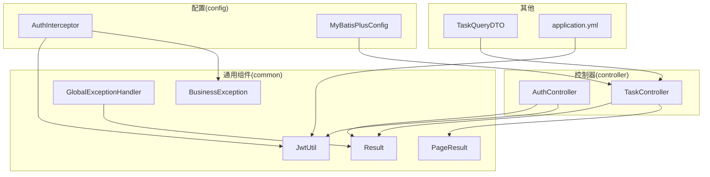
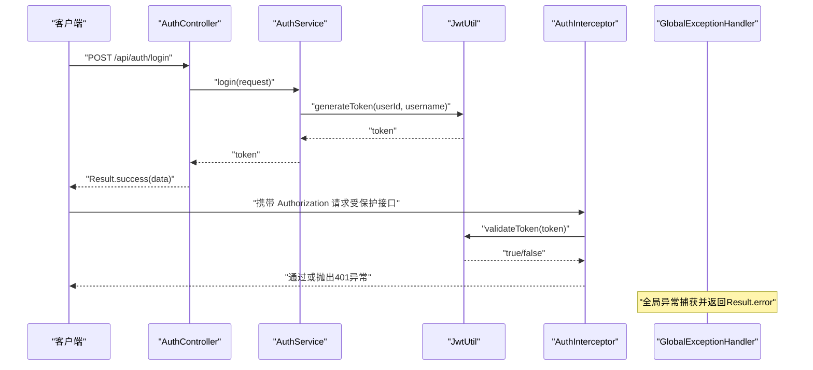
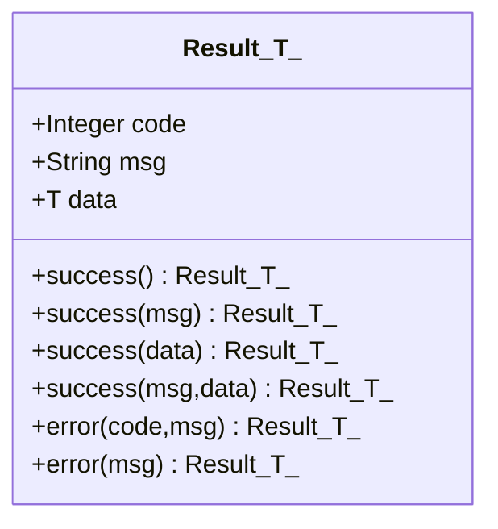
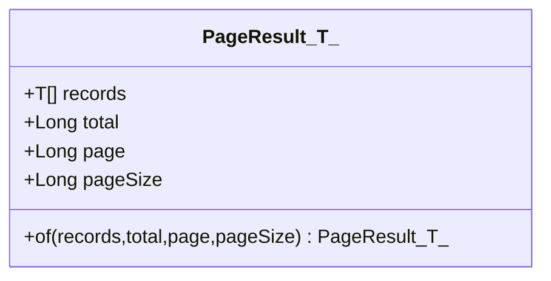
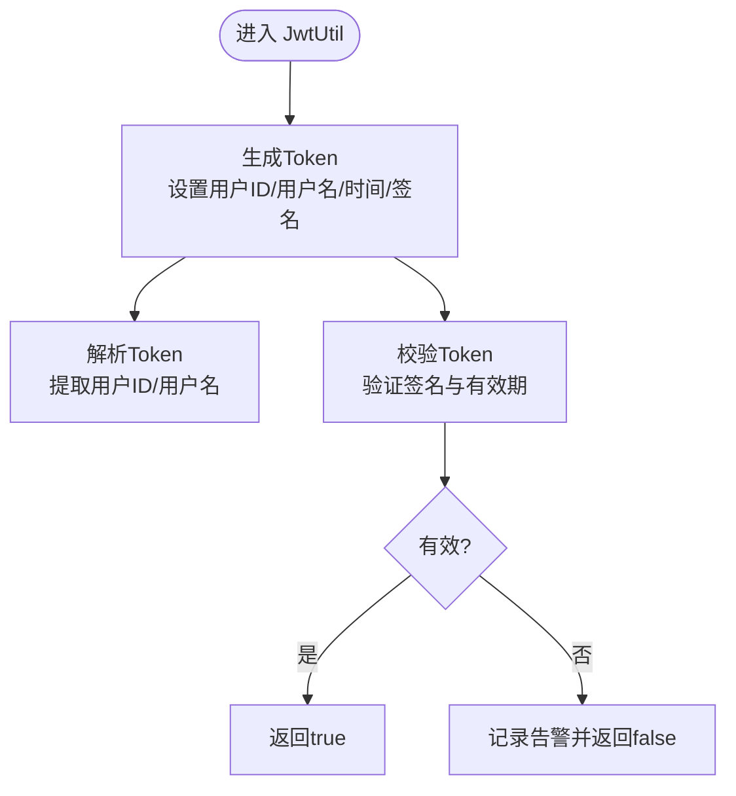
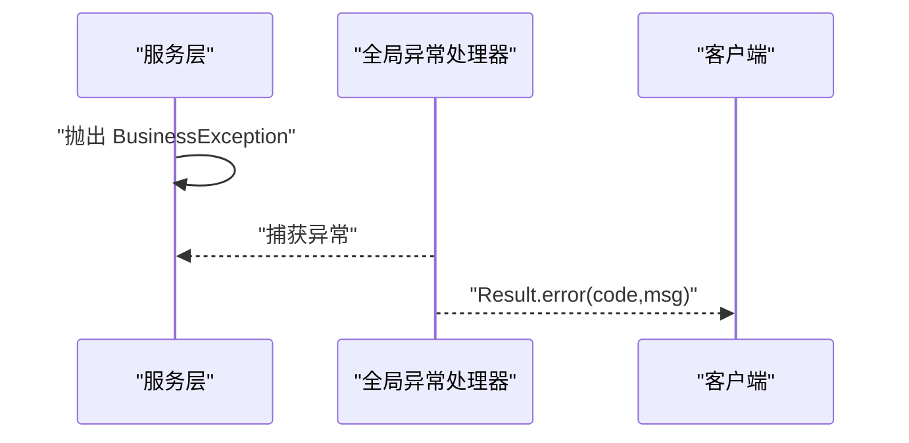
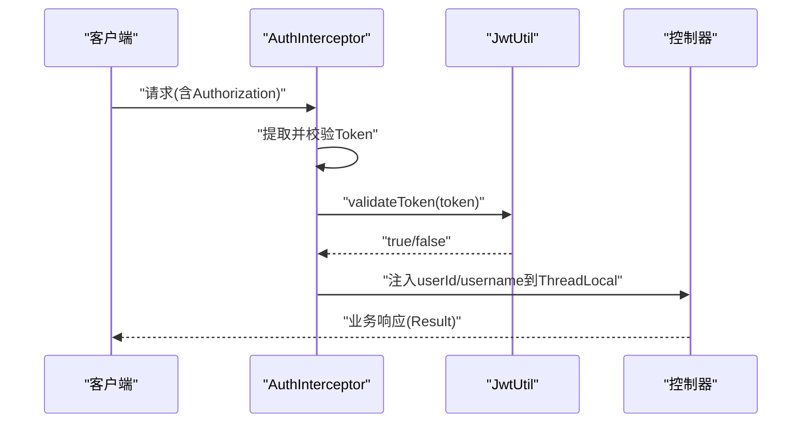
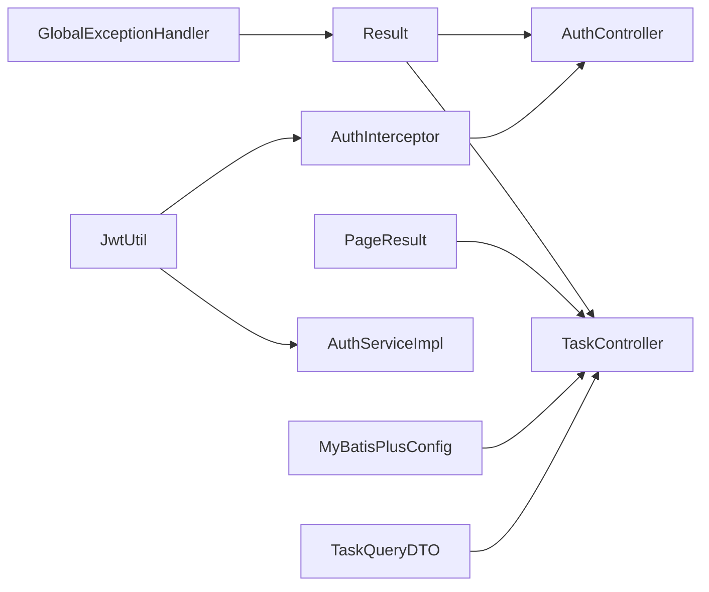

# 通用组件

<cite>
**本文引用的文件**
- [Result.java](file://backend/src/main/java/com/newworld/common/Result.java)
- [PageResult.java](file://backend/src/main/java/com/newworld/common/PageResult.java)
- [JwtUtil.java](file://backend/src/main/java/com/newworld/common/JwtUtil.java)
- [BusinessException.java](file://backend/src/main/java/com/newworld/common/exception/BusinessException.java)
- [GlobalExceptionHandler.java](file://backend/src/main/java/com/newworld/common/exception/GlobalExceptionHandler.java)
- [AuthInterceptor.java](file://backend/src/main/java/com/newworld/config/AuthInterceptor.java)
- [MyBatisPlusConfig.java](file://backend/src/main/java/com/newworld/config/MyBatisPlusConfig.java)
- [application.yml](file://backend/src/main/resources/application.yml)
- [AuthController.java](file://backend/src/main/java/com/newworld/controller/AuthController.java)
- [TaskController.java](file://backend/src/main/java/com/newworld/controller/TaskController.java)
- [TaskQueryDTO.java](file://backend/src/main/java/com/newworld/dto/TaskQueryDTO.java)
- [TaskService.java](file://backend/src/main/java/com/newworld/service/TaskService.java)
</cite>

## 目录
1. [简介](#简介)
2. [项目结构](#项目结构)
3. [核心组件](#核心组件)
4. [架构总览](#架构总览)
5. [详细组件分析](#详细组件分析)
6. [依赖分析](#依赖分析)
7. [性能考虑](#性能考虑)
8. [故障排查指南](#故障排查指南)
9. [结论](#结论)
10. [附录](#附录)

## 简介
本文件聚焦新世界项目的“通用组件”，系统性阐述两类统一响应封装与一套JWT工具类的设计理念、使用方式与最佳实践。重点包括：
- Result：统一的成功/失败响应封装，支持无数据、带数据、自定义消息的成功形式，以及可定制状态码的失败形式。
- PageResult：统一的分页响应封装，提供记录列表、总数、页码与每页条数等字段。
- JwtUtil：基于Hutool与Java JWT库的令牌生成、解析与校验工具，配合拦截器实现鉴权。
- 全局异常处理：将业务异常映射为统一响应，保证前后端一致的错误语义。

这些组件广泛应用于控制器层，确保接口返回风格一致、鉴权流程可控、分页数据标准化。

## 项目结构
通用组件位于后端模块的common包中，并与配置、控制器、服务层协同工作：
- common：Result、PageResult、JwtUtil、异常类与全局异常处理器
- config：鉴权拦截器与MyBatis-Plus分页插件配置
- controller：各业务控制器返回统一响应
- dto：查询参数对象，包含分页字段
- service：业务接口，供控制器调用

**图示来源**
- [Result.java:1-90](file://backend/src/main/java/com/newworld/common/Result.java#L1-L90)
- [PageResult.java:1-36](file://backend/src/main/java/com/newworld/common/PageResult.java#L1-L36)
- [JwtUtil.java:1-78](file://backend/src/main/java/com/newworld/common/JwtUtil.java#L1-L78)
- [BusinessException.java:1-24](file://backend/src/main/java/com/newworld/common/exception/BusinessException.java#L1-L24)
- [GlobalExceptionHandler.java:1-35](file://backend/src/main/java/com/newworld/common/exception/GlobalExceptionHandler.java#L1-L35)
- [AuthInterceptor.java:1-78](file://backend/src/main/java/com/newworld/config/AuthInterceptor.java#L1-L78)
- [MyBatisPlusConfig.java:1-22](file://backend/src/main/java/com/newworld/config/MyBatisPlusConfig.java#L1-L22)
- [application.yml:65-68](file://backend/src/main/resources/application.yml#L65-L68)
- [AuthController.java:1-55](file://backend/src/main/java/com/newworld/controller/AuthController.java#L1-L55)
- [TaskController.java:1-112](file://backend/src/main/java/com/newworld/controller/TaskController.java#L1-L112)
- [TaskQueryDTO.java:1-145](file://backend/src/main/java/com/newworld/dto/TaskQueryDTO.java#L1-L145)

**章节来源**
- [Result.java:1-90](file://backend/src/main/java/com/newworld/common/Result.java#L1-L90)
- [PageResult.java:1-36](file://backend/src/main/java/com/newworld/common/PageResult.java#L1-L36)
- [JwtUtil.java:1-78](file://backend/src/main/java/com/newworld/common/JwtUtil.java#L1-L78)
- [AuthInterceptor.java:1-78](file://backend/src/main/java/com/newworld/config/AuthInterceptor.java#L1-L78)
- [MyBatisPlusConfig.java:1-22](file://backend/src/main/java/com/newworld/config/MyBatisPlusConfig.java#L1-L22)
- [application.yml:65-68](file://backend/src/main/resources/application.yml#L65-L68)
- [AuthController.java:1-55](file://backend/src/main/java/com/newworld/controller/AuthController.java#L1-L55)
- [TaskController.java:1-112](file://backend/src/main/java/com/newworld/controller/TaskController.java#L1-L112)
- [TaskQueryDTO.java:1-145](file://backend/src/main/java/com/newworld/dto/TaskQueryDTO.java#L1-L145)

## 核心组件
- Result<T>：提供静态工厂方法用于快速构造成功与失败响应；成功重载支持无数据、仅消息、仅数据、消息+数据；失败重载支持默认500与自定义状态码。
- PageResult<T>：提供of工厂方法，封装records、total、page、pageSize四个字段，便于前端分页渲染。
- JwtUtil：读取配置中的密钥与过期时间，生成包含用户标识与附加信息的JWT；提供从Token解析用户ID与用户名的方法；提供令牌有效性校验。
- 全局异常处理：将业务异常映射为Result.error(code, msg)，参数异常映射为400，其他异常映射为500，统一输出。

**章节来源**
- [Result.java:22-64](file://backend/src/main/java/com/newworld/common/Result.java#L22-L64)
- [PageResult.java:27-34](file://backend/src/main/java/com/newworld/common/PageResult.java#L27-L34)
- [JwtUtil.java:29-76](file://backend/src/main/java/com/newworld/common/JwtUtil.java#L29-L76)
- [GlobalExceptionHandler.java:17-33](file://backend/src/main/java/com/newworld/common/exception/GlobalExceptionHandler.java#L17-L33)

## 架构总览
下图展示鉴权拦截、JWT工具与控制器之间的交互，以及异常处理如何贯穿整个流程。

**图示来源**
- [AuthController.java:27-31](file://backend/src/main/java/com/newworld/controller/AuthController.java#L27-L31)
- [AuthServiceImpl.java:55-56](file://backend/src/main/java/com/newworld/service/impl/AuthServiceImpl.java#L55-L56)
- [JwtUtil.java:29-40](file://backend/src/main/java/com/newworld/common/JwtUtil.java#L29-L40)
- [AuthInterceptor.java:37-49](file://backend/src/main/java/com/newworld/config/AuthInterceptor.java#L37-L49)
- [GlobalExceptionHandler.java:17-21](file://backend/src/main/java/com/newworld/common/exception/GlobalExceptionHandler.java#L17-L21)

## 详细组件分析

### Result<T> 统一响应封装
- 设计要点
  - 泛型T承载任意数据类型，满足不同接口返回体差异。
  - 成功与失败分别提供多重重载，覆盖常见场景：仅消息、仅数据、消息+数据、自定义状态码。
  - 字段清晰：code、msg、data，便于前端统一解析与提示。
- 使用建议
  - 成功响应：优先使用带消息与数据的重载，提升用户体验。
  - 失败响应：业务异常使用BusinessException抛出，由全局异常处理器统一转为Result.error(code, msg)。
- 典型调用路径
  - 登录成功返回token包装：[AuthController.java:27-31](file://backend/src/main/java/com/newworld/controller/AuthController.java#L27-L31)
  - 注册成功返回空数据：[AuthController.java:35-38](file://backend/src/main/java/com/newworld/controller/AuthController.java#L35-L38)
  - 获取用户信息返回实体：[AuthController.java:42-46](file://backend/src/main/java/com/newworld/controller/AuthController.java#L42-L46)

**图示来源**
- [Result.java:9-88](file://backend/src/main/java/com/newworld/common/Result.java#L9-L88)

**章节来源**
- [Result.java:22-64](file://backend/src/main/java/com/newworld/common/Result.java#L22-L64)
- [AuthController.java:27-31](file://backend/src/main/java/com/newworld/controller/AuthController.java#L27-L31)
- [AuthController.java:35-38](file://backend/src/main/java/com/newworld/controller/AuthController.java#L35-L38)
- [AuthController.java:42-46](file://backend/src/main/java/com/newworld/controller/AuthController.java#L42-L46)

### PageResult<T> 分页响应封装
- 设计要点
  - 四字段标准化：records、total、page、pageSize，便于前端分页组件直接消费。
  - of工厂方法集中创建，避免分散构造带来的不一致性。
- 使用建议
  - 与MyBatis-Plus分页插件配合，服务层返回IPage，控制器再转为PageResult。
  - 若业务需要自定义分页字段，可在服务层组装后再传入of。
- 典型调用路径
  - 控制器返回分页结果：[TaskController.java:25-31](file://backend/src/main/java/com/newworld/controller/TaskController.java#L25-L31)
  - 查询参数包含分页字段：[TaskQueryDTO.java:43-47](file://backend/src/main/java/com/newworld/dto/TaskQueryDTO.java#L43-L47)

**图示来源**
- [PageResult.java:13-34](file://backend/src/main/java/com/newworld/common/PageResult.java#L13-L34)

**章节来源**
- [PageResult.java:27-34](file://backend/src/main/java/com/newworld/common/PageResult.java#L27-L34)
- [TaskController.java:25-31](file://backend/src/main/java/com/newworld/controller/TaskController.java#L25-L31)
- [TaskQueryDTO.java:43-47](file://backend/src/main/java/com/newworld/dto/TaskQueryDTO.java#L43-L47)

### JwtUtil JWT工具类
- 功能概览
  - 生成Token：包含用户ID、用户名、签发时间、过期时间与签名。
  - 解析Token：从Token中提取用户ID与用户名。
  - 校验Token：验证签名与有效期，异常时记录告警日志。
- 配置项
  - 密钥与过期时间来源于配置文件，便于环境差异化部署。
- 典型调用路径
  - 登录生成Token：[AuthServiceImpl.java:55-56](file://backend/src/main/java/com/newworld/service/impl/AuthServiceImpl.java#L55-L56)
  - 拦截器校验Token并注入上下文：[AuthInterceptor.java:37-52](file://backend/src/main/java/com/newworld/config/AuthInterceptor.java#L37-L52)
  - 配置文件加载密钥与过期时间：[application.yml:65-68](file://backend/src/main/resources/application.yml#L65-L68)

**图示来源**
- [JwtUtil.java:29-76](file://backend/src/main/java/com/newworld/common/JwtUtil.java#L29-L76)

**章节来源**
- [JwtUtil.java:29-76](file://backend/src/main/java/com/newworld/common/JwtUtil.java#L29-L76)
- [application.yml:65-68](file://backend/src/main/resources/application.yml#L65-L68)
- [AuthServiceImpl.java:55-56](file://backend/src/main/java/com/newworld/service/impl/AuthServiceImpl.java#L55-L56)
- [AuthInterceptor.java:37-52](file://backend/src/main/java/com/newworld/config/AuthInterceptor.java#L37-L52)

### 全局异常处理与业务异常
- 全局异常处理器
  - 捕获业务异常：映射为Result.error(code, msg)，保留业务状态码。
  - 参数异常：映射为400。
  - 其他异常：映射为500。
- 业务异常
  - BusinessException支持自定义状态码与消息，便于区分业务错误类型。
- 典型调用路径
  - 抛出业务异常：[AuthServiceImpl.java:28-29](file://backend/src/main/java/com/newworld/service/impl/AuthServiceImpl.java#L28-L29)
  - 全局捕获并返回统一响应：[GlobalExceptionHandler.java:17-21](file://backend/src/main/java/com/newworld/common/exception/GlobalExceptionHandler.java#L17-L21)

**图示来源**
- [BusinessException.java:10-18](file://backend/src/main/java/com/newworld/common/exception/BusinessException.java#L10-L18)
- [GlobalExceptionHandler.java:17-21](file://backend/src/main/java/com/newworld/common/exception/GlobalExceptionHandler.java#L17-L21)

**章节来源**
- [BusinessException.java:10-18](file://backend/src/main/java/com/newworld/common/exception/BusinessException.java#L10-L18)
- [GlobalExceptionHandler.java:17-21](file://backend/src/main/java/com/newworld/common/exception/GlobalExceptionHandler.java#L17-L21)
- [AuthServiceImpl.java:28-29](file://backend/src/main/java/com/newworld/service/impl/AuthServiceImpl.java#L28-L29)

### 鉴权拦截器与上下文注入
- 功能概览
  - 从请求头提取Authorization，去除Bearer前缀后进行Token校验。
  - 校验通过后，从Token解析用户ID与用户名，存入ThreadLocal，供后续控制器使用。
  - 请求完成后清理ThreadLocal，避免内存泄漏。
- 典型调用路径
  - 拦截器预处理：[AuthInterceptor.java:30-58](file://backend/src/main/java/com/newworld/config/AuthInterceptor.java#L30-L58)
  - 获取当前用户ID：[AuthController.java:44-44](file://backend/src/main/java/com/newworld/controller/AuthController.java#L44-L44)

**图示来源**
- [AuthInterceptor.java:30-58](file://backend/src/main/java/com/newworld/config/AuthInterceptor.java#L30-L58)
- [JwtUtil.java:61-69](file://backend/src/main/java/com/newworld/common/JwtUtil.java#L61-L69)
- [AuthController.java:42-46](file://backend/src/main/java/com/newworld/controller/AuthController.java#L42-L46)

**章节来源**
- [AuthInterceptor.java:30-58](file://backend/src/main/java/com/newworld/config/AuthInterceptor.java#L30-L58)
- [AuthController.java:42-46](file://backend/src/main/java/com/newworld/controller/AuthController.java#L42-L46)

## 依赖分析
- Result与PageResult均为纯数据封装，无外部依赖，耦合度低，复用性强。
- JwtUtil依赖配置文件中的密钥与过期时间，依赖JWT库进行签名与解析。
- 全局异常处理器依赖Result进行统一输出。
- 鉴权拦截器依赖JwtUtil进行Token校验，并依赖ThreadLocal传递用户上下文。
- MyBatis-Plus分页插件与控制器查询参数配合，形成标准分页链路。

**图示来源**
- [Result.java:1-90](file://backend/src/main/java/com/newworld/common/Result.java#L1-L90)
- [PageResult.java:1-36](file://backend/src/main/java/com/newworld/common/PageResult.java#L1-L36)
- [JwtUtil.java:1-78](file://backend/src/main/java/com/newworld/common/JwtUtil.java#L1-L78)
- [AuthInterceptor.java:1-78](file://backend/src/main/java/com/newworld/config/AuthInterceptor.java#L1-L78)
- [MyBatisPlusConfig.java:1-22](file://backend/src/main/java/com/newworld/config/MyBatisPlusConfig.java#L1-L22)
- [TaskController.java:1-112](file://backend/src/main/java/com/newworld/controller/TaskController.java#L1-L112)
- [TaskQueryDTO.java:1-145](file://backend/src/main/java/com/newworld/dto/TaskQueryDTO.java#L1-L145)

**章节来源**
- [Result.java:1-90](file://backend/src/main/java/com/newworld/common/Result.java#L1-L90)
- [PageResult.java:1-36](file://backend/src/main/java/com/newworld/common/PageResult.java#L1-L36)
- [JwtUtil.java:1-78](file://backend/src/main/java/com/newworld/common/JwtUtil.java#L1-L78)
- [AuthInterceptor.java:1-78](file://backend/src/main/java/com/newworld/config/AuthInterceptor.java#L1-L78)
- [MyBatisPlusConfig.java:1-22](file://backend/src/main/java/com/newworld/config/MyBatisPlusConfig.java#L1-L22)
- [TaskController.java:1-112](file://backend/src/main/java/com/newworld/controller/TaskController.java#L1-L112)
- [TaskQueryDTO.java:1-145](file://backend/src/main/java/com/newworld/dto/TaskQueryDTO.java#L1-L145)

## 性能考虑
- Token生成与解析
  - HS512签名算法安全性高但计算开销略大于HS256；若对性能敏感且可接受风险，可评估更换算法。
  - 过期时间建议按业务场景调整，默认24小时较为合理。
- 分页查询
  - 合理设置每页条数上限，避免一次性返回过多数据导致内存压力。
  - 对高频查询建立索引，减少数据库扫描。
- 异常处理
  - 全局异常处理器避免重复逻辑，减少分支判断，提高吞吐。

[本节为通用指导，无需特定文件引用]

## 故障排查指南
- 登录后无法访问受保护接口
  - 检查请求头是否包含Authorization且格式为Bearer token。
  - 校验Token是否过期或被篡改。
  - 查看拦截器日志，确认Token校验失败原因。
- 返回统一错误格式
  - 业务异常应抛出BusinessException，确保状态码与消息正确映射。
  - 参数异常会返回400，其他异常返回500。
- 分页数据为空或总数不正确
  - 确认查询参数page与pageSize是否传入。
  - 检查服务层是否正确使用分页插件并返回IPage。
  - 核对PageResult.of的参数顺序与类型。

**章节来源**
- [AuthInterceptor.java:37-49](file://backend/src/main/java/com/newworld/config/AuthInterceptor.java#L37-L49)
- [GlobalExceptionHandler.java:17-33](file://backend/src/main/java/com/newworld/common/exception/GlobalExceptionHandler.java#L17-L33)
- [TaskQueryDTO.java:43-47](file://backend/src/main/java/com/newworld/dto/TaskQueryDTO.java#L43-L47)
- [MyBatisPlusConfig.java:15-20](file://backend/src/main/java/com/newworld/config/MyBatisPlusConfig.java#L15-L20)

## 结论
Result与PageResult提供了统一的响应与分页格式，显著提升了前后端协作效率与一致性；JwtUtil结合拦截器实现了轻量级无状态鉴权；全局异常处理保障了错误语义的统一。三者配合，使项目具备良好的可维护性与扩展性。

[本节为总结，无需特定文件引用]

## 附录

### 使用示例与扩展方法
- 统一响应使用
  - 成功返回：参考登录接口返回token包装：[AuthController.java:27-31](file://backend/src/main/java/com/newworld/controller/AuthController.java#L27-L31)
  - 成功返回实体：参考获取用户信息：[AuthController.java:42-46](file://backend/src/main/java/com/newworld/controller/AuthController.java#L42-L46)
  - 成功返回空数据：参考注册成功：[AuthController.java:35-38](file://backend/src/main/java/com/newworld/controller/AuthController.java#L35-L38)
  - 失败返回：参考业务异常抛出与全局映射：[AuthServiceImpl.java:28-29](file://backend/src/main/java/com/newworld/service/impl/AuthServiceImpl.java#L28-L29)、[GlobalExceptionHandler.java:17-21](file://backend/src/main/java/com/newworld/common/exception/GlobalExceptionHandler.java#L17-L21)
- 分页响应使用
  - 控制器返回分页结果：[TaskController.java:25-31](file://backend/src/main/java/com/newworld/controller/TaskController.java#L25-L31)
  - 查询参数分页字段：[TaskQueryDTO.java:43-47](file://backend/src/main/java/com/newworld/dto/TaskQueryDTO.java#L43-L47)
  - 分页插件配置：[MyBatisPlusConfig.java:15-20](file://backend/src/main/java/com/newworld/config/MyBatisPlusConfig.java#L15-L20)
- JWT工具使用
  - 生成Token：[AuthServiceImpl.java:55-56](file://backend/src/main/java/com/newworld/service/impl/AuthServiceImpl.java#L55-L56)
  - 校验Token：[AuthInterceptor.java:47-49](file://backend/src/main/java/com/newworld/config/AuthInterceptor.java#L47-L49)
  - 配置密钥与过期时间：[application.yml:65-68](file://backend/src/main/resources/application.yml#L65-L68)

**章节来源**
- [AuthController.java:27-31](file://backend/src/main/java/com/newworld/controller/AuthController.java#L27-L31)
- [AuthController.java:35-38](file://backend/src/main/java/com/newworld/controller/AuthController.java#L35-L38)
- [AuthController.java:42-46](file://backend/src/main/java/com/newworld/controller/AuthController.java#L42-L46)
- [AuthServiceImpl.java:28-29](file://backend/src/main/java/com/newworld/service/impl/AuthServiceImpl.java#L28-L29)
- [GlobalExceptionHandler.java:17-21](file://backend/src/main/java/com/newworld/common/exception/GlobalExceptionHandler.java#L17-L21)
- [TaskController.java:25-31](file://backend/src/main/java/com/newworld/controller/TaskController.java#L25-L31)
- [TaskQueryDTO.java:43-47](file://backend/src/main/java/com/newworld/dto/TaskQueryDTO.java#L43-L47)
- [MyBatisPlusConfig.java:15-20](file://backend/src/main/java/com/newworld/config/MyBatisPlusConfig.java#L15-L20)
- [AuthServiceImpl.java:55-56](file://backend/src/main/java/com/newworld/service/impl/AuthServiceImpl.java#L55-L56)
- [AuthInterceptor.java:47-49](file://backend/src/main/java/com/newworld/config/AuthInterceptor.java#L47-L49)
- [application.yml:65-68](file://backend/src/main/resources/application.yml#L65-L68)