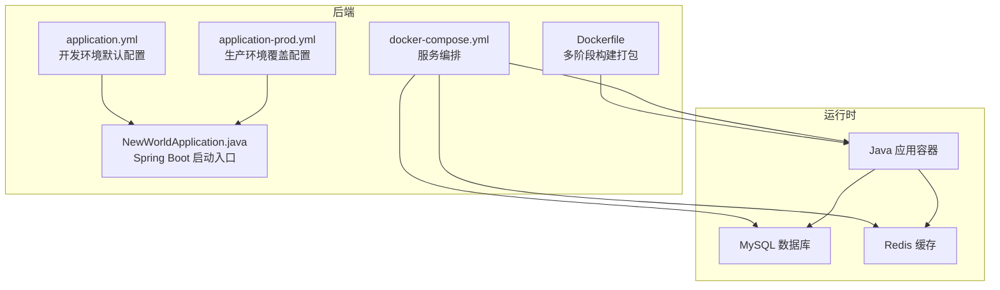
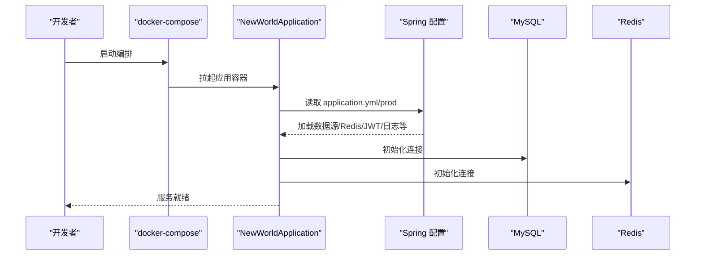
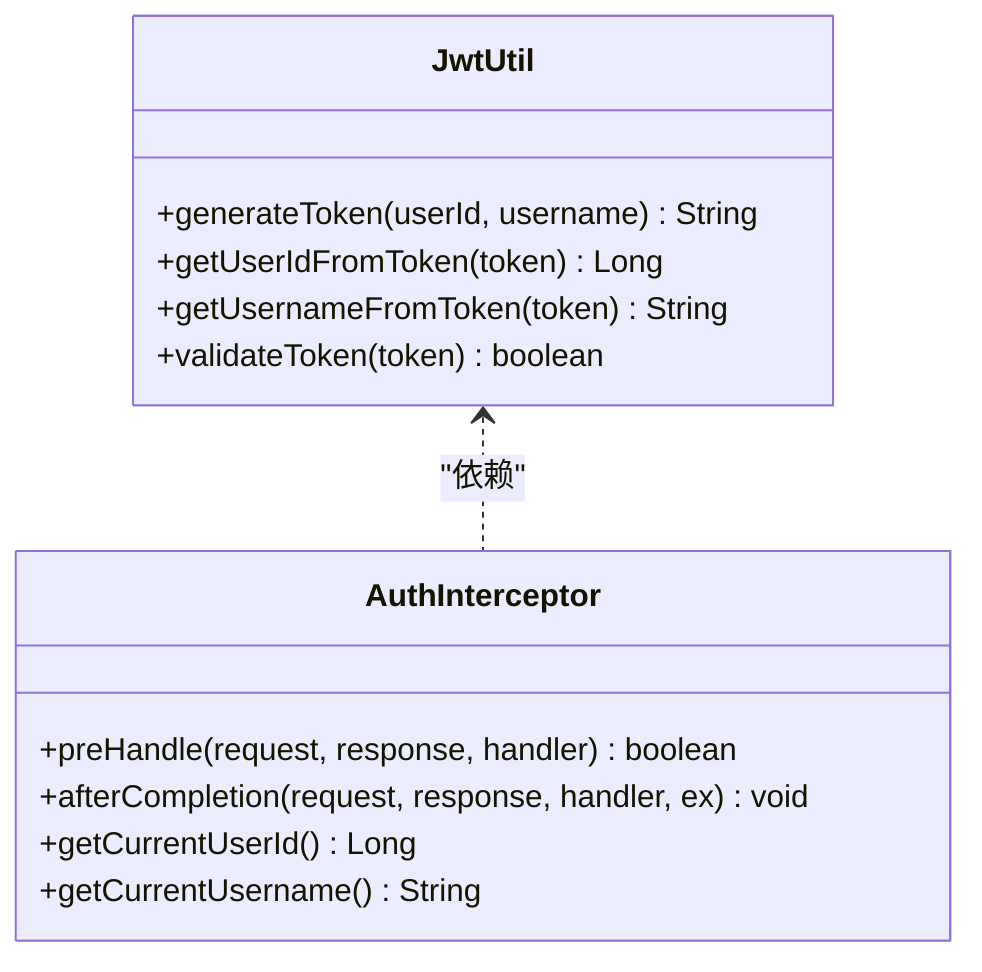
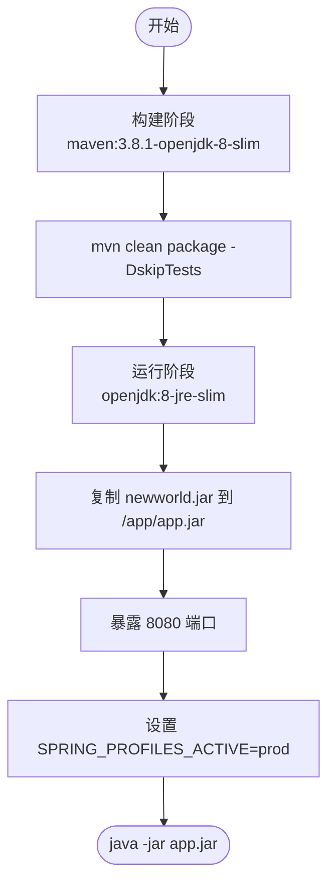
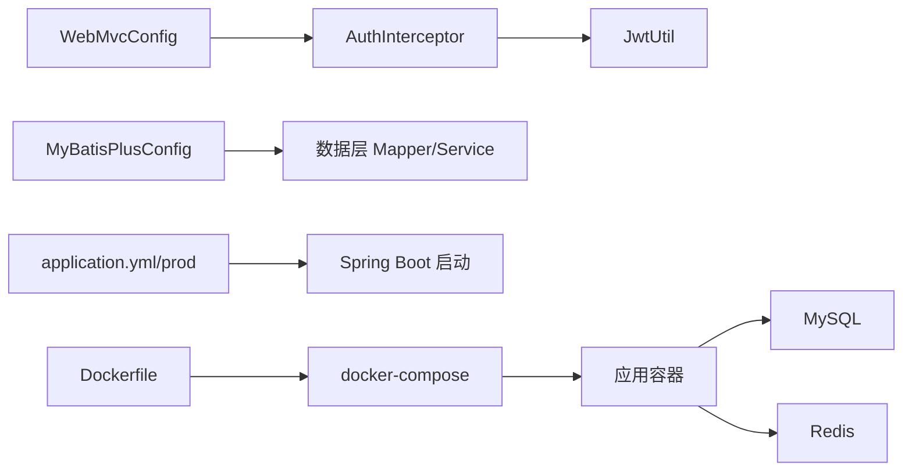

# 项目配置

<cite>
**本文引用的文件**
- [backend/pom.xml](file://backend/pom.xml)
- [backend/src/main/resources/application.yml](file://backend/src/main/resources/application.yml)
- [backend/src/main/resources/application-prod.yml](file://backend/src/main/resources/application-prod.yml)
- [backend/Dockerfile](file://backend/Dockerfile)
- [docker-compose.yml](file://docker-compose.yml)
- [backend/src/main/java/com/newworld/NewWorldApplication.java](file://backend/src/main/java/com/newworld/NewWorldApplication.java)
- [backend/src/main/java/com/newworld/config/WebMvcConfig.java](file://backend/src/main/java/com/newworld/config/WebMvcConfig.java)
- [backend/src/main/java/com/newworld/config/MyBatisPlusConfig.java](file://backend/src/main/java/com/newworld/config/MyBatisPlusConfig.java)
- [backend/src/main/java/com/newworld/config/AuthInterceptor.java](file://backend/src/main/java/com/newworld/config/AuthInterceptor.java)
- [backend/src/main/java/com/newworld/common/JwtUtil.java](file://backend/src/main/java/com/newworld/common/JwtUtil.java)
- [backend/src/main/java/com/newworld/config/Knife4jConfig.java](file://backend/src/main/java/com/newworld/config/Knife4jConfig.java)
- [deploy/start.sh](file://deploy/start.sh)
- [deploy/start.bat](file://deploy/start.bat)
</cite>

## 目录
1. [简介](#简介)
2. [项目结构](#项目结构)
3. [核心组件](#核心组件)
4. [架构总览](#架构总览)
5. [详细组件分析](#详细组件分析)
6. [依赖关系分析](#依赖关系分析)
7. [性能考虑](#性能考虑)
8. [故障排查指南](#故障排查指南)
9. [结论](#结论)
10. [附录](#附录)

## 简介
本文件系统性梳理“新世界”项目的配置体系，覆盖 Maven POM 依赖与构建、Spring Boot 多环境配置、数据库与缓存连接、JWT 安全配置、Docker 容器化与编排，以及配置最佳实践与常见问题处理建议。目标是帮助开发者快速理解并正确部署与维护该应用。

## 项目结构
后端采用 Spring Boot 单体架构，配置集中在 resources 下的 application.yml 及 application-prod.yml；容器化通过 Dockerfile 和 docker-compose.yml 实现一键启动。

图表来源
- [backend/src/main/resources/application.yml:1-75](file://backend/src/main/resources/application.yml#L1-L75)
- [backend/src/main/resources/application-prod.yml:1-24](file://backend/src/main/resources/application-prod.yml#L1-L24)
- [backend/Dockerfile:1-14](file://backend/Dockerfile#L1-L14)
- [docker-compose.yml:1-14](file://docker-compose.yml#L1-L14)
- [backend/src/main/java/com/newworld/NewWorldApplication.java:1-13](file://backend/src/main/java/com/newworld/NewWorldApplication.java#L1-L13)

章节来源
- [backend/src/main/resources/application.yml:1-75](file://backend/src/main/resources/application.yml#L1-L75)
- [backend/src/main/resources/application-prod.yml:1-24](file://backend/src/main/resources/application-prod.yml#L1-L24)
- [backend/Dockerfile:1-14](file://backend/Dockerfile#L1-L14)
- [docker-compose.yml:1-14](file://docker-compose.yml#L1-L14)
- [backend/src/main/java/com/newworld/NewWorldApplication.java:1-13](file://backend/src/main/java/com/newworld/NewWorldApplication.java#L1-L13)

## 核心组件
- Maven 构建与依赖：统一父工程版本、集中属性管理、关键依赖（Web、Redis、MyBatis-Plus、Knife4j、JWT、Hutool、EasyExcel、Lombok）。
- Spring Boot 配置：开发环境默认配置与生产环境覆盖配置分离；通过 profiles 切换。
- 安全与认证：JWT 工具类与拦截器，实现 Token 校验与用户上下文注入。
- ORM 与分页：MyBatis-Plus 分页插件配置。
- 文档与跨域：Knife4j/Swagger 文档与 CORS 全局配置。
- 容器化：多阶段 Dockerfile 打包，docker-compose 编排应用、数据库与缓存。

章节来源
- [backend/pom.xml:1-117](file://backend/pom.xml#L1-L117)
- [backend/src/main/resources/application.yml:1-75](file://backend/src/main/resources/application.yml#L1-L75)
- [backend/src/main/resources/application-prod.yml:1-24](file://backend/src/main/resources/application-prod.yml#L1-L24)
- [backend/src/main/java/com/newworld/common/JwtUtil.java:1-78](file://backend/src/main/java/com/newworld/common/JwtUtil.java#L1-L78)
- [backend/src/main/java/com/newworld/config/AuthInterceptor.java:1-78](file://backend/src/main/java/com/newworld/config/AuthInterceptor.java#L1-L78)
- [backend/src/main/java/com/newworld/config/MyBatisPlusConfig.java:1-22](file://backend/src/main/java/com/newworld/config/MyBatisPlusConfig.java#L1-L22)
- [backend/src/main/java/com/newworld/config/Knife4jConfig.java:1-27](file://backend/src/main/java/com/newworld/config/Knife4jConfig.java#L1-L27)
- [backend/src/main/java/com/newworld/config/WebMvcConfig.java:1-53](file://backend/src/main/java/com/newworld/config/WebMvcConfig.java#L1-L53)

## 架构总览
下图展示配置驱动的应用启动流程与外部依赖关系。

图表来源
- [docker-compose.yml:1-14](file://docker-compose.yml#L1-L14)
- [backend/src/main/java/com/newworld/NewWorldApplication.java:1-13](file://backend/src/main/java/com/newworld/NewWorldApplication.java#L1-L13)
- [backend/src/main/resources/application.yml:1-75](file://backend/src/main/resources/application.yml#L1-L75)
- [backend/src/main/resources/application-prod.yml:1-24](file://backend/src/main/resources/application-prod.yml#L1-L24)

## 详细组件分析

### Maven POM 配置与依赖管理
- 父工程与 Java 版本：继承 spring-boot-starter-parent，Java 1.8。
- 关键依赖：
  - Web、Redis、Validation、Test。
  - MyBatis-Plus Starter、MySQL Connector、Knife4j、Hutool、EasyExcel、JWT、JAXB API、Lombok。
- 插件：
  - spring-boot-maven-plugin，排除 Lombok 注解处理器以避免打包后缺失。
- 构建产物命名：finalName=newworld，输出 newworld.jar。

章节来源
- [backend/pom.xml:1-117](file://backend/pom.xml#L1-L117)

### Spring Boot 配置文件结构与环境差异
- 开发环境（application.yml）
  - 服务器端口、上下文路径、应用名。
  - 数据源：驱动、URL、账号密码。
  - Redis：主机、端口、密码、数据库索引、超时与连接池参数。
  - Jackson：日期格式与时区。
  - MyBatis-Plus：映射文件位置、类型别名包、驼峰映射、禁用缓存、控制台日志实现、全局逻辑删除字段与值。
  - Knife4j：UI 路径、API 文档路径、语言与功能开关。
  - JWT：密钥与过期时间。
  - 日志：按包设置级别。
- 生产环境（application-prod.yml）
  - 数据源与 Redis 密码通过环境变量注入（${VAR:默认值}），便于容器化部署。
  - MyBatis-Plus 使用 SLF4J 日志实现。
  - 日志级别降低为 info。

章节来源
- [backend/src/main/resources/application.yml:1-75](file://backend/src/main/resources/application.yml#L1-L75)
- [backend/src/main/resources/application-prod.yml:1-24](file://backend/src/main/resources/application-prod.yml#L1-L24)

### 数据库连接配置
- 驱动类名与 JDBC URL 包含时区、字符集、SSL 等参数。
- 开发环境使用明文凭据；生产环境通过环境变量注入密码。
- MyBatis-Plus：
  - 映射文件目录 classpath:mapper/*.xml。
  - 类型别名包 com.newworld.entity。
  - 驼峰映射、禁用二级缓存、开启控制台日志（开发）。
  - 全局逻辑删除字段与值配置。

章节来源
- [backend/src/main/resources/application.yml:10-50](file://backend/src/main/resources/application.yml#L10-L50)
- [backend/src/main/resources/application-prod.yml:4-20](file://backend/src/main/resources/application-prod.yml#L4-L20)

### Redis 连接配置
- 主机、端口、密码、数据库索引。
- 连接超时与 Lettuce 连接池参数（最大活跃、最大等待、最大空闲、最小空闲）。
- 生产环境密码支持环境变量覆盖。

章节来源
- [backend/src/main/resources/application.yml:17-30](file://backend/src/main/resources/application.yml#L17-L30)
- [backend/src/main/resources/application-prod.yml:11-16](file://backend/src/main/resources/application-prod.yml#L11-L16)

### JWT 密钥与过期时间配置
- 密钥与过期时间（毫秒）在配置文件中定义。
- JwtUtil 通过 @Value 注入密钥与过期时间，负责签发、解析与校验。
- AuthInterceptor 在拦截器链中校验 Authorization 头中的 Token，并将用户信息放入线程本地存储。

图表来源
- [backend/src/main/java/com/newworld/common/JwtUtil.java:1-78](file://backend/src/main/java/com/newworld/common/JwtUtil.java#L1-L78)
- [backend/src/main/java/com/newworld/config/AuthInterceptor.java:1-78](file://backend/src/main/java/com/newworld/config/AuthInterceptor.java#L1-L78)

章节来源
- [backend/src/main/resources/application.yml:65-69](file://backend/src/main/resources/application.yml#L65-L69)
- [backend/src/main/java/com/newworld/common/JwtUtil.java:1-78](file://backend/src/main/java/com/newworld/common/JwtUtil.java#L1-L78)
- [backend/src/main/java/com/newworld/config/AuthInterceptor.java:1-78](file://backend/src/main/java/com/newworld/config/AuthInterceptor.java#L1-L78)

### MyBatis-Plus 分页配置
- 注册 MybatisPlusInterceptor 并添加分页内核（MySQL）。
- 与全局配置配合，实现自动分页与逻辑删除。

章节来源
- [backend/src/main/java/com/newworld/config/MyBatisPlusConfig.java:1-22](file://backend/src/main/java/com/newworld/config/MyBatisPlusConfig.java#L1-L22)
- [backend/src/main/resources/application.yml:36-50](file://backend/src/main/resources/application.yml#L36-L50)

### 跨域与静态资源配置
- 全局跨域：允许所有来源、方法、头与凭证，预检缓存 1 小时。
- 拦截器：对 /api/** 路由启用认证拦截，排除登录、注册、系统接口、Swagger UI、静态资源等。
- 静态资源：Swagger 文档与 webjars 资源映射。

章节来源
- [backend/src/main/java/com/newworld/config/WebMvcConfig.java:1-53](file://backend/src/main/java/com/newworld/config/WebMvcConfig.java#L1-L53)

### Knife4j/Swagger 文档配置
- 自定义 OpenAPI 信息（标题、版本、描述、联系人、许可证）。
- application.yml 中定义 UI 与 API 文档路径。

章节来源
- [backend/src/main/java/com/newworld/config/Knife4jConfig.java:1-27](file://backend/src/main/java/com/newworld/config/Knife4jConfig.java#L1-L27)
- [backend/src/main/resources/application.yml:51-64](file://backend/src/main/resources/application.yml#L51-L64)

### Docker 容器化配置
- 多阶段构建：
  - 第一阶段：maven:3.8.1-openjdk-8-slim，下载依赖并编译打包。
  - 第二阶段：openjdk:8-jre-slim，复制 jar 至运行时镜像。
- 暴露端口 8080，设置环境变量 SPRING_PROFILES_ACTIVE=prod。
- docker-compose：
  - 构建上下文指向 backend，Dockerfile 指定。
  - 映射宿主 8080:8080。
  - 设置 SPRING_PROFILES_ACTIVE=prod。
  - 重启策略 unless-stopped。

图表来源
- [backend/Dockerfile:1-14](file://backend/Dockerfile#L1-L14)

章节来源
- [backend/Dockerfile:1-14](file://backend/Dockerfile#L1-L14)
- [docker-compose.yml:1-14](file://docker-compose.yml#L1-L14)

### 启动脚本
- start.sh/start.bat：调用 docker-compose up -d 启动 MySQL、Redis 与应用容器，并提示访问地址与文档地址。

章节来源
- [deploy/start.sh:1-8](file://deploy/start.sh#L1-L8)
- [deploy/start.bat:1-9](file://deploy/start.bat#L1-L9)

## 依赖关系分析
- 组件耦合：
  - JwtUtil 与 AuthInterceptor 强耦合（认证链路）。
  - WebMvcConfig 依赖 AuthInterceptor。
  - MyBatisPlusConfig 与数据层交互。
- 外部依赖：
  - MySQL、Redis 作为运行时依赖。
  - Knife4j 提供文档能力。
- 配置耦合：
  - application.yml 与 application-prod.yml 通过 profiles 解耦。
  - Dockerfile 与 docker-compose 通过环境变量与端口映射耦合。

图表来源
- [backend/src/main/java/com/newworld/config/WebMvcConfig.java:1-53](file://backend/src/main/java/com/newworld/config/WebMvcConfig.java#L1-L53)
- [backend/src/main/java/com/newworld/config/AuthInterceptor.java:1-78](file://backend/src/main/java/com/newworld/config/AuthInterceptor.java#L1-L78)
- [backend/src/main/java/com/newworld/common/JwtUtil.java:1-78](file://backend/src/main/java/com/newworld/common/JwtUtil.java#L1-L78)
- [backend/src/main/java/com/newworld/config/MyBatisPlusConfig.java:1-22](file://backend/src/main/java/com/newworld/config/MyBatisPlusConfig.java#L1-L22)
- [backend/src/main/resources/application.yml:1-75](file://backend/src/main/resources/application.yml#L1-L75)
- [backend/src/main/resources/application-prod.yml:1-24](file://backend/src/main/resources/application-prod.yml#L1-L24)
- [backend/Dockerfile:1-14](file://backend/Dockerfile#L1-L14)
- [docker-compose.yml:1-14](file://docker-compose.yml#L1-L14)

## 性能考虑
- 日志级别：开发环境开启 debug，生产环境降为 info，减少日志开销。
- MyBatis-Plus：开发环境开启控制台日志便于调试；生产环境切换为 SLF4J，避免控制台输出影响性能。
- Redis 连接池：合理设置最大活跃、最大空闲与等待时间，避免连接争用。
- 分页：使用 MyBatis-Plus 分页内核，避免一次性加载大结果集。
- Docker 层：多阶段构建减小镜像体积，提升拉取与启动速度。

## 故障排查指南
- 启动失败（端口占用）
  - 检查宿主机 8080 端口是否被占用；修改 docker-compose 端口映射或释放端口。
- 数据库连接失败
  - 确认 application.yml 或环境变量中的数据库 URL、账号、密码正确；检查网络连通性与防火墙。
- Redis 连接失败
  - 确认 Redis 主机、端口、密码与数据库索引；检查容器网络与防火墙。
- JWT 校验失败
  - 确认密钥与过期时间一致；检查客户端是否携带正确的 Authorization Bearer Token。
- Swagger 文档不可见
  - 确认 application.yml 中 UI 与 API 文档路径配置正确；检查跨域与静态资源映射。
- Docker 构建失败
  - 清理 Maven 依赖缓存后重试；确保网络可访问 Maven 仓库；确认 JDK 与 Maven 版本匹配。

章节来源
- [backend/src/main/resources/application.yml:1-75](file://backend/src/main/resources/application.yml#L1-L75)
- [backend/src/main/resources/application-prod.yml:1-24](file://backend/src/main/resources/application-prod.yml#L1-L24)
- [backend/src/main/java/com/newworld/common/JwtUtil.java:1-78](file://backend/src/main/java/com/newworld/common/JwtUtil.java#L1-L78)
- [backend/src/main/java/com/newworld/config/AuthInterceptor.java:1-78](file://backend/src/main/java/com/newworld/config/AuthInterceptor.java#L1-L78)
- [backend/Dockerfile:1-14](file://backend/Dockerfile#L1-L14)
- [docker-compose.yml:1-14](file://docker-compose.yml#L1-L14)

## 结论
本项目通过清晰的多环境配置、完善的依赖与构建管理、健壮的安全与认证机制、以及标准化的容器化与编排方案，实现了从开发到生产的无缝衔接。遵循本文的最佳实践与故障排查建议，可显著提升部署效率与运维稳定性。

## 附录
- 配置最佳实践
  - 生产环境敏感信息使用环境变量注入，避免硬编码。
  - 开发与生产日志级别差异化，生产环境避免 debug。
  - Docker 镜像多阶段构建，减少体积与攻击面。
  - 使用 profiles 管理环境差异，保持配置简洁可维护。
- 常见配置项清单
  - 数据库：driver-class-name、url、username、password
  - Redis：host、port、password、database、timeout、pool 参数
  - MyBatis-Plus：mapper-locations、type-aliases-package、map-underscore-to-camel-case、cache-enabled、log-impl、全局逻辑删除
  - JWT：secret、expiration
  - 日志：包级别与输出实现
  - Swagger/Knife4j：UI 路径、API 文档路径、语言与功能开关