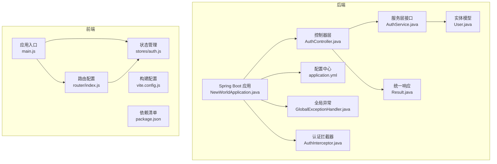
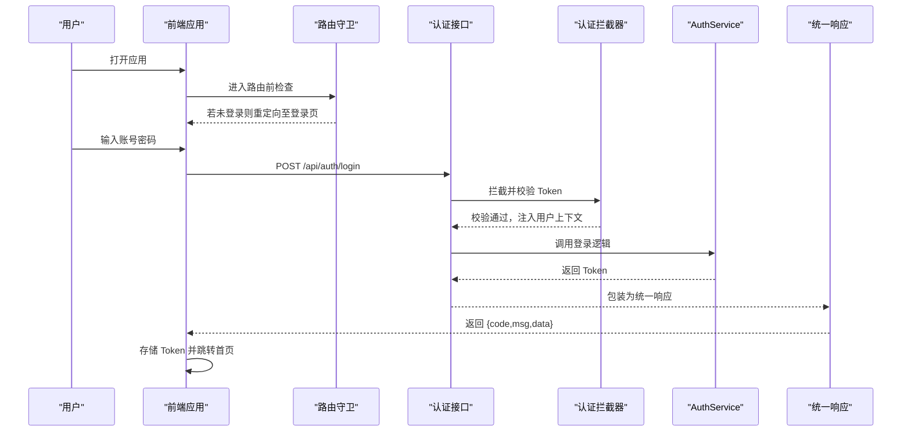
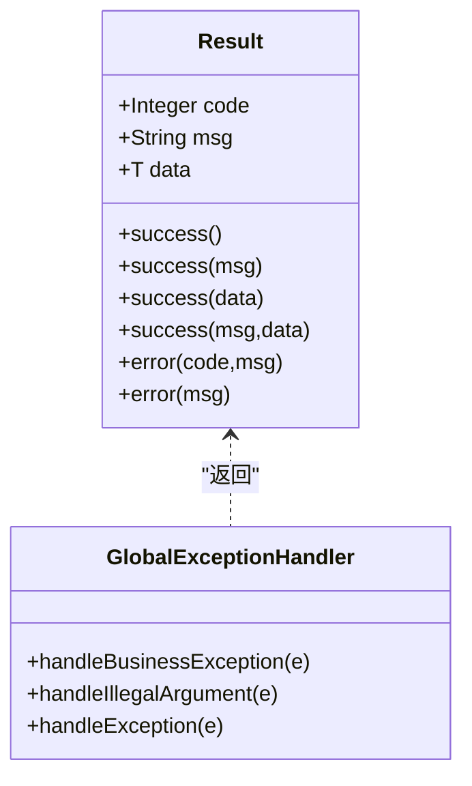
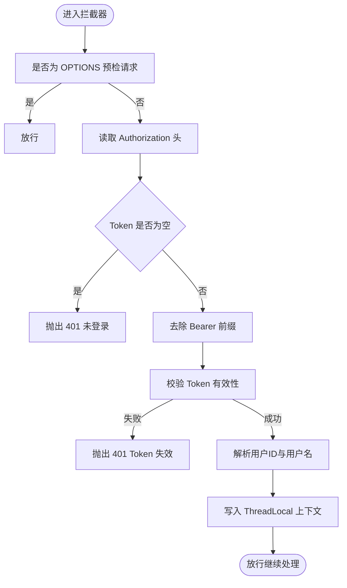
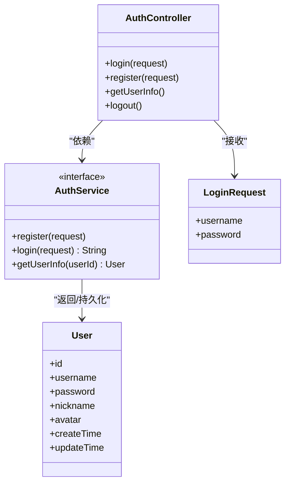
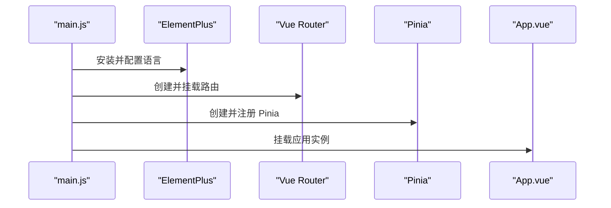
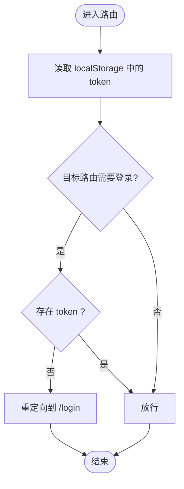
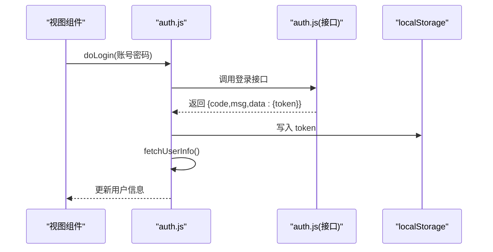
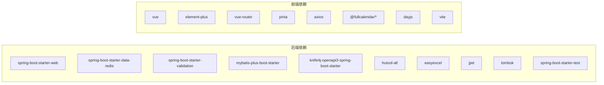

# 开发指南

<cite>
**本文引用的文件**
- [NewWorldApplication.java](file://backend/src/main/java/com/newworld/NewWorldApplication.java)
- [pom.xml](file://backend/pom.xml)
- [application.yml](file://backend/src/main/resources/application.yml)
- [Result.java](file://backend/src/main/java/com/newworld/common/Result.java)
- [GlobalExceptionHandler.java](file://backend/src/main/java/com/newworld/common/exception/GlobalExceptionHandler.java)
- [AuthInterceptor.java](file://backend/src/main/java/com/newworld/config/AuthInterceptor.java)
- [AuthController.java](file://backend/src/main/java/com/newworld/controller/AuthController.java)
- [AuthService.java](file://backend/src/main/java/com/newworld/service/AuthService.java)
- [User.java](file://backend/src/main/java/com/newworld/entity/User.java)
- [LoginRequest.java](file://backend/src/main/java/com/newworld/dto/LoginRequest.java)
- [main.js](file://frontend/src/main.js)
- [package.json](file://frontend/package.json)
- [vite.config.js](file://frontend/vite.config.js)
- [index.js](file://frontend/src/router/index.js)
- [auth.js](file://frontend/src/stores/auth.js)
</cite>

## 目录
1. [简介](#简介)
2. [项目结构](#项目结构)
3. [核心组件](#核心组件)
4. [架构总览](#架构总览)
5. [详细组件分析](#详细组件分析)
6. [依赖分析](#依赖分析)
7. [性能考虑](#性能考虑)
8. [故障排查指南](#故障排查指南)
9. [结论](#结论)
10. [附录](#附录)

## 简介
本开发指南面向“新世界”项目的后端与前端团队，目标是帮助开发者快速理解并高效参与项目开发。内容涵盖：
- Java 后端编码规范与最佳实践（包结构、命名、注释、异常处理、统一响应）
- Vue.js 前端开发规范（目录组织、路由与状态管理、API 调用）
- Git 工作流与分支管理策略（功能开发、代码评审、版本发布）
- 常见开发场景解决方案（新功能、Bug 修复、性能优化）
- 测试策略与质量保障（单元、集成、端到端）
- 代码重构与维护建议

## 项目结构
项目采用前后端分离架构：
- 后端：Spring Boot + MyBatis-Plus + Knife4j（OpenAPI/Swagger 文档）
- 前端：Vue 3 + Vite + Element Plus + Pinia + Vue Router
- 配置：MySQL + Redis；JWT 令牌鉴权；全局异常处理与统一响应

图表来源
- [NewWorldApplication.java:1-13](file://backend/src/main/java/com/newworld/NewWorldApplication.java#L1-L13)
- [application.yml:1-75](file://backend/src/main/resources/application.yml#L1-L75)
- [AuthController.java:1-55](file://backend/src/main/java/com/newworld/controller/AuthController.java#L1-L55)
- [AuthService.java:1-24](file://backend/src/main/java/com/newworld/service/AuthService.java#L1-L24)
- [User.java:1-95](file://backend/src/main/java/com/newworld/entity/User.java#L1-L95)
- [Result.java:1-90](file://backend/src/main/java/com/newworld/common/Result.java#L1-L90)
- [GlobalExceptionHandler.java:1-35](file://backend/src/main/java/com/newworld/common/exception/GlobalExceptionHandler.java#L1-L35)
- [AuthInterceptor.java:1-78](file://backend/src/main/java/com/newworld/config/AuthInterceptor.java#L1-L78)
- [main.js:1-22](file://frontend/src/main.js#L1-L22)
- [index.js:1-50](file://frontend/src/router/index.js#L1-L50)
- [auth.js:1-41](file://frontend/src/stores/auth.js#L1-L41)
- [vite.config.js:1-26](file://frontend/vite.config.js#L1-L26)
- [package.json:1-30](file://frontend/package.json#L1-L30)

章节来源
- [NewWorldApplication.java:1-13](file://backend/src/main/java/com/newworld/NewWorldApplication.java#L1-L13)
- [pom.xml:1-117](file://backend/pom.xml#L1-L117)
- [application.yml:1-75](file://backend/src/main/resources/application.yml#L1-L75)
- [main.js:1-22](file://frontend/src/main.js#L1-L22)
- [package.json:1-30](file://frontend/package.json#L1-L30)
- [vite.config.js:1-26](file://frontend/vite.config.js#L1-L26)

## 核心组件
- 统一响应体：封装通用的 code/msg/data 结构，便于前端统一处理。
- 全局异常处理：集中捕获业务异常、参数异常与系统异常，返回标准化错误。
- 认证拦截器：校验 JWT，注入当前用户上下文，支持放行预检请求。
- 控制器层：暴露认证相关接口，使用 Swagger 注解标注接口信息。
- 实体模型：基于 MyBatis-Plus 注解映射数据库表，自动填充字段。
- 前端入口与路由：注册 Element Plus、Pinia、路由守卫，实现登录态控制。

章节来源
- [Result.java:1-90](file://backend/src/main/java/com/newworld/common/Result.java#L1-L90)
- [GlobalExceptionHandler.java:1-35](file://backend/src/main/java/com/newworld/common/exception/GlobalExceptionHandler.java#L1-L35)
- [AuthInterceptor.java:1-78](file://backend/src/main/java/com/newworld/config/AuthInterceptor.java#L1-L78)
- [AuthController.java:1-55](file://backend/src/main/java/com/newworld/controller/AuthController.java#L1-L55)
- [User.java:1-95](file://backend/src/main/java/com/newworld/entity/User.java#L1-L95)
- [main.js:1-22](file://frontend/src/main.js#L1-L22)
- [index.js:1-50](file://frontend/src/router/index.js#L1-L50)

## 架构总览
后端通过 Spring MVC 暴露 REST 接口，前端通过 Axios 发起请求，路由守卫与 Pinia 状态管理控制登录态与页面跳转。JWT 用于会话认证，全局异常与统一响应确保前后端交互一致性。

图表来源
- [AuthController.java:1-55](file://backend/src/main/java/com/newworld/controller/AuthController.java#L1-L55)
- [AuthInterceptor.java:1-78](file://backend/src/main/java/com/newworld/config/AuthInterceptor.java#L1-L78)
- [AuthService.java:1-24](file://backend/src/main/java/com/newworld/service/AuthService.java#L1-L24)
- [Result.java:1-90](file://backend/src/main/java/com/newworld/common/Result.java#L1-L90)
- [index.js:1-50](file://frontend/src/router/index.js#L1-L50)
- [auth.js:1-41](file://frontend/src/stores/auth.js#L1-L41)

## 详细组件分析

### 后端组件

#### 统一响应与异常处理
- 统一响应体包含状态码、消息与数据，提供多种静态工厂方法，简化调用方构造。
- 全局异常处理器按类型分发处理，记录日志并返回标准化错误。

图表来源
- [Result.java:1-90](file://backend/src/main/java/com/newworld/common/Result.java#L1-L90)
- [GlobalExceptionHandler.java:1-35](file://backend/src/main/java/com/newworld/common/exception/GlobalExceptionHandler.java#L1-L35)

章节来源
- [Result.java:1-90](file://backend/src/main/java/com/newworld/common/Result.java#L1-L90)
- [GlobalExceptionHandler.java:1-35](file://backend/src/main/java/com/newworld/common/exception/GlobalExceptionHandler.java#L1-L35)

#### 认证拦截器与上下文
- 拦截器从请求头提取并校验 JWT，去除 Bearer 前缀，校验失败抛出业务异常。
- 使用 ThreadLocal 存储当前用户 ID 与用户名，避免线程安全问题；请求结束后清理。

图表来源
- [AuthInterceptor.java:1-78](file://backend/src/main/java/com/newworld/config/AuthInterceptor.java#L1-L78)

章节来源
- [AuthInterceptor.java:1-78](file://backend/src/main/java/com/newworld/config/AuthInterceptor.java#L1-L78)

#### 控制器与 DTO/Entity
- 控制器使用 Swagger 注解描述接口，返回统一响应。
- DTO 用于参数校验，实体映射数据库表，自动填充创建/更新时间。

图表来源
- [AuthController.java:1-55](file://backend/src/main/java/com/newworld/controller/AuthController.java#L1-L55)
- [AuthService.java:1-24](file://backend/src/main/java/com/newworld/service/AuthService.java#L1-L24)
- [LoginRequest.java:1-37](file://backend/src/main/java/com/newworld/dto/LoginRequest.java#L1-L37)
- [User.java:1-95](file://backend/src/main/java/com/newworld/entity/User.java#L1-L95)

章节来源
- [AuthController.java:1-55](file://backend/src/main/java/com/newworld/controller/AuthController.java#L1-L55)
- [AuthService.java:1-24](file://backend/src/main/java/com/newworld/service/AuthService.java#L1-L24)
- [LoginRequest.java:1-37](file://backend/src/main/java/com/newworld/dto/LoginRequest.java#L1-L37)
- [User.java:1-95](file://backend/src/main/java/com/newworld/entity/User.java#L1-L95)

### 前端组件

#### 应用入口与 UI 框架
- 注册 Element Plus 及中文语言包，全局图标批量注册，挂载 Pinia 与路由。

图表来源
- [main.js:1-22](file://frontend/src/main.js#L1-L22)

章节来源
- [main.js:1-22](file://frontend/src/main.js#L1-L22)

#### 路由与登录态控制
- 路由守卫根据是否存在 Token 决定是否放行或重定向至登录页。
- 登录成功后写入本地存储，进入主布局。

图表来源
- [index.js:1-50](file://frontend/src/router/index.js#L1-L50)

章节来源
- [index.js:1-50](file://frontend/src/router/index.js#L1-L50)

#### 状态管理与 API 调用
- Pinia Store 封装登录、注册、获取用户信息与登出逻辑，统一处理 Token 的存取与清理。
- API 层通过 axios 发送请求，配合后端统一响应结构。

图表来源
- [auth.js:1-41](file://frontend/src/stores/auth.js#L1-L41)

章节来源
- [auth.js:1-41](file://frontend/src/stores/auth.js#L1-L41)

## 依赖分析
- 后端依赖：Spring Boot Web、Redis、Validation、MyBatis-Plus、Knife4j、Hutool、EasyExcel、JWT、Lombok、JUnit。
- 前端依赖：Vue 3、Element Plus、Vue Router、Pinia、Axios、FullCalendar、Day.js、Vite。

图表来源
- [pom.xml:31-96](file://backend/pom.xml#L31-L96)
- [package.json:11-28](file://frontend/package.json#L11-L28)

章节来源
- [pom.xml:1-117](file://backend/pom.xml#L1-L117)
- [package.json:1-30](file://frontend/package.json#L1-L30)

## 性能考虑
- 后端
  - 合理使用缓存：结合 Redis 缓存热点数据，减少数据库压力。
  - SQL 优化：利用 MyBatis-Plus 分页与条件构造器，避免 N+1 查询。
  - 日志级别：生产环境降低框架日志级别，仅保留必要级别以减少 IO。
  - 异步任务：对非关键路径操作（如导出、通知）采用异步处理。
- 前端
  - 组件懒加载：路由级组件按需加载，减少首屏体积。
  - 图标与 UI 组件：按需引入，避免全量打包。
  - 请求合并与节流：对高频请求进行去抖/节流处理。
  - 构建优化：开启产物压缩与资源分包策略。

## 故障排查指南
- 登录后无法访问受保护页面
  - 检查路由守卫是否正确读取 localStorage 中的 token。
  - 确认后端拦截器是否正确解析 Authorization 头并写入 ThreadLocal。
- Token 无效或过期
  - 核对前端是否在请求头中携带 Bearer Token。
  - 检查后端 JWT 密钥与过期时间配置。
- 统一响应未生效
  - 确认控制器返回值包装为 Result。
  - 检查全局异常处理器是否正确捕获并返回错误响应。
- 数据库连接失败
  - 校验 application.yml 中的数据库与 Redis 地址、端口、密码。
- 前端跨域问题
  - 检查 vite 代理配置是否指向后端服务地址。

章节来源
- [index.js:1-50](file://frontend/src/router/index.js#L1-L50)
- [AuthInterceptor.java:1-78](file://backend/src/main/java/com/newworld/config/AuthInterceptor.java#L1-L78)
- [application.yml:1-75](file://backend/src/main/resources/application.yml#L1-L75)
- [vite.config.js:1-26](file://frontend/vite.config.js#L1-L26)

## 结论
本指南提供了新世界项目从架构到实现、从前端到后端的开发要点与最佳实践。建议团队在日常开发中严格遵循统一响应、异常处理、认证拦截与命名规范，配合完善的 Git 工作流与测试策略，持续提升代码质量与交付效率。

## 附录

### 代码规范与最佳实践

- Java 后端编码规范
  - 包结构：按层次划分 controller、service、mapper、entity、dto、common、config。
  - 类命名：使用帕斯卡命名法；接口以 I 前缀或以 er 结尾（如 AuthService）。
  - 方法命名：动词短语，清晰表达意图；布尔方法以 is/has/can 前缀。
  - 注释：类与公共方法使用 Swagger 注解描述；复杂逻辑添加行内注释。
  - 异常：自定义业务异常 BusinessException，统一由 GlobalExceptionHandler 处理。
  - 统一响应：所有接口返回 Result<T>，保持前后端一致的数据结构。
  - 参数校验：DTO 使用 javax.validation 注解进行非空与格式校验。
  - 日志：使用 SLF4J 输出日志，区分 warn/error 级别，避免敏感信息泄露。
  - 配置：application.yml 中集中管理数据库、Redis、JWT、Knife4j 等配置。

- Vue.js 前端开发规范
  - 目录组织：views/components/layout/stores/utils/api/router/styles。
  - 组件命名：PascalCase；页面组件以 View 结尾；通用组件以 Common 前缀。
  - 状态管理：Pinia Store 模块化拆分，避免在组件中直接发起网络请求。
  - 路由守卫：在 router/index.js 中集中处理登录态与页面标题。
  - API 调用：在 api 目录下按模块划分接口文件，统一处理请求与响应。
  - 样式：全局样式在 styles/global.css 中维护，组件样式局部作用域化。
  - 构建：Vite 配置代理、别名与输出目录，确保开发与生产一致性。

- 命名约定
  - 后端：类名大驼峰；方法小驼峰；常量全大写下划分；包名全小写。
  - 前端：变量与函数小驼峰；组件 PascalCase；CSS 类名 kebab-case。

- 注释标准
  - 类与方法：使用 Swagger 注解描述用途、参数与返回值。
  - 复杂逻辑：在关键步骤添加简要注释，解释设计动机与边界条件。
  - TODO/FIXME：使用明确标记并在后续迭代中解决。

### 开发工具推荐与配置
- IDE 设置
  - IntelliJ IDEA：启用 Lombok 插件；配置 Google JavaFormat 或 Alibaba Java Coding Guidelines 插件；启用 Maven 视图。
  - VS Code：安装 Vetur/Vue Language Features、ESLint、Prettier、Bracket Pair Colorizer。
- 插件推荐
  - 后端：MyBatis Log、Rainbow Brackets、String Manipulation。
  - 前端：Auto Rename Tag、Bracket Pair Colorizer、ES7+ React/Redux Snippets。
- 调试技巧
  - 后端：断点定位在 Controller -> Service -> Mapper 层，逐步验证参数与返回值。
  - 前端：使用 Vue DevTools 检查组件状态与 Pinia Store；Network 面板观察接口响应。

### Git 工作流程与分支管理策略
- 分支模型
  - main/master：稳定发布分支。
  - develop：开发主分支，合并功能分支。
  - feature/*：功能开发分支，完成后合并至 develop。
  - hotfix/*：线上紧急修复分支，同时合并回 main 与 develop。
- 功能开发流程
  - 从 develop 新建 feature/* 分支，提交前先 rebase 主干最新变更。
  - 提交信息格式：type(scope): subject（如 feat(auth): 添加登录接口）。
- 代码评审流程
  - 提交 Pull Request 至 develop，至少一名同事评审通过后方可合并。
  - 评审关注点：代码可读性、异常处理、安全性、性能与测试覆盖。
- 版本发布流程
  - 在 main 合并 develop 后打标签并发布，更新 CHANGELOG。

### 常见开发场景解决方案
- 新功能开发
  - 设计 DTO/VO 与 Entity，编写 Mapper XML 与 Service 接口实现。
  - 在 Controller 中新增接口，使用 Swagger 注解完善文档。
  - 前端新建路由与组件，接入 Pinia Store 与 API 文件。
- Bug 修复
  - 明确问题现象与复现步骤，定位到具体模块与方法。
  - 补充单元测试或集成测试，修复后回归验证。
- 性能优化
  - 后端：索引优化、SQL 优化、缓存命中率提升、异步化。
  - 前端：懒加载、按需引入、图片与静态资源压缩。

### 测试策略与质量保证
- 单元测试
  - 后端：使用 JUnit 与 Mockito 对 Service 方法进行隔离测试。
  - 前端：使用 Vitest/Jest 对组合式函数与纯函数进行测试。
- 集成测试
  - 后端：启动嵌入式数据库与 Redis，测试完整流程。
  - 前端：使用 Cypress 或 Playwright 进行端到端测试。
- 质量门禁
  - 代码覆盖率阈值、SonarQube 扫描、CI 自动化检查。

### 代码重构与维护最佳实践
- 重构原则：小步快跑、保持功能不变、充分测试。
- 抽象与解耦：提取公共逻辑到工具类或服务层；避免重复代码。
- 文档同步：注释与文档随代码同步更新，保持一致性。
- 版本兼容：升级依赖时评估破坏性变更，制定迁移计划。