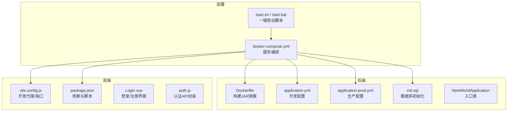
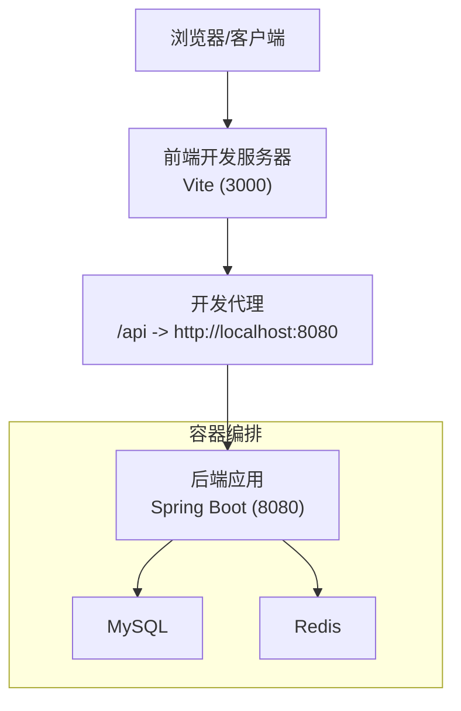
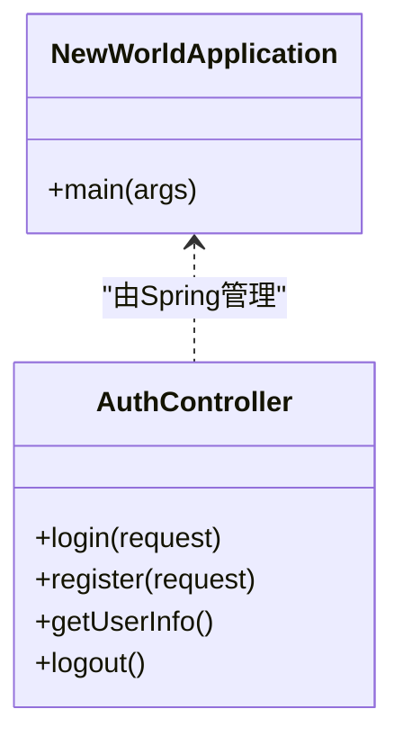
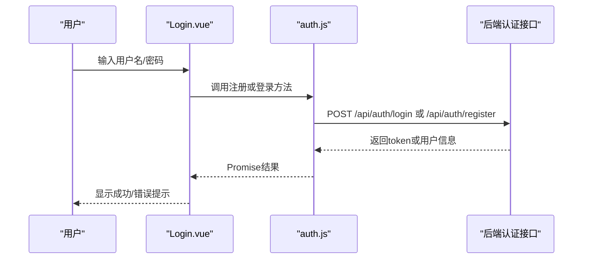
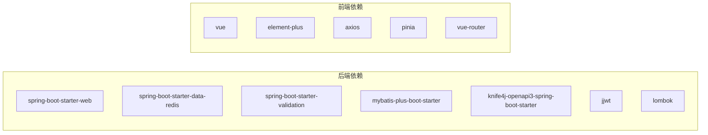
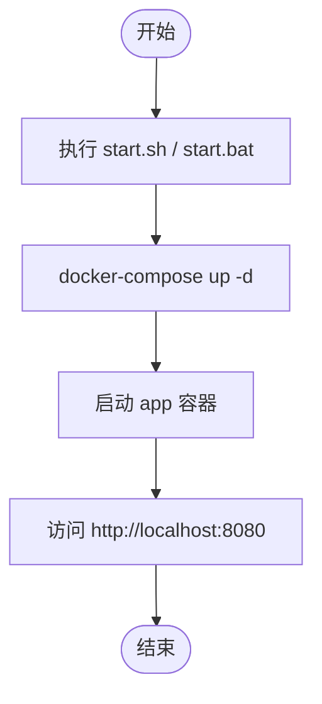

# 快速开始

<cite>
**本文引用的文件**
- [docker-compose.yml](file://docker-compose.yml)
- [backend/Dockerfile](file://backend/Dockerfile)
- [backend/pom.xml](file://backend/pom.xml)
- [backend/src/main/resources/application.yml](file://backend/src/main/resources/application.yml)
- [backend/src/main/resources/application-prod.yml](file://backend/src/main/resources/application-prod.yml)
- [backend/sql/init.sql](file://backend/sql/init.sql)
- [backend/src/main/java/com/newworld/NewWorldApplication.java](file://backend/src/main/java/com/newworld/NewWorldApplication.java)
- [backend/src/main/java/com/newworld/controller/AuthController.java](file://backend/src/main/java/com/newworld/controller/AuthController.java)
- [frontend/vite.config.js](file://frontend/vite.config.js)
- [frontend/package.json](file://frontend/package.json)
- [frontend/src/api/auth.js](file://frontend/src/api/auth.js)
- [frontend/src/views/Login.vue](file://frontend/src/views/Login.vue)
- [deploy/start.sh](file://deploy/start.sh)
- [deploy/start.bat](file://deploy/start.bat)
</cite>

## 目录
1. [简介](#简介)
2. [项目结构](#项目结构)
3. [核心组件](#核心组件)
4. [架构总览](#架构总览)
5. [详细组件分析](#详细组件分析)
6. [依赖关系分析](#依赖关系分析)
7. [性能考虑](#性能考虑)
8. [故障排除指南](#故障排除指南)
9. [结论](#结论)
10. [附录](#附录)

## 简介
本指南面向新手开发者，帮助你在30分钟内成功运行“新世界”项目。你将获得：
- 环境要求与版本说明（Java 8+、Node.js、MySQL、Redis）
- 本地开发环境搭建步骤（数据库初始化、后端依赖安装、前端依赖安装）
- 完整启动流程（Docker Compose一键启动与手动启动）
- 常见问题排查与解决方案
- 基本使用示例（用户注册/登录、创建项目与任务）

## 项目结构
项目采用前后端分离架构，包含后端Spring Boot应用、前端Vue 3应用、数据库初始化脚本以及一键部署脚本。

图表来源
- [docker-compose.yml:1-14](file://docker-compose.yml#L1-L14)
- [backend/Dockerfile:1-14](file://backend/Dockerfile#L1-L14)
- [backend/src/main/resources/application.yml:1-75](file://backend/src/main/resources/application.yml#L1-L75)
- [backend/src/main/resources/application-prod.yml:1-24](file://backend/src/main/resources/application-prod.yml#L1-L24)
- [backend/sql/init.sql:1-95](file://backend/sql/init.sql#L1-L95)
- [frontend/vite.config.js:1-26](file://frontend/vite.config.js#L1-L26)
- [frontend/package.json:1-30](file://frontend/package.json#L1-L30)
- [deploy/start.sh:1-8](file://deploy/start.sh#L1-L8)
- [deploy/start.bat:1-9](file://deploy/start.bat#L1-L9)

章节来源
- [docker-compose.yml:1-14](file://docker-compose.yml#L1-L14)
- [backend/Dockerfile:1-14](file://backend/Dockerfile#L1-L14)
- [backend/src/main/resources/application.yml:1-75](file://backend/src/main/resources/application.yml#L1-L75)
- [backend/src/main/resources/application-prod.yml:1-24](file://backend/src/main/resources/application-prod.yml#L1-L24)
- [backend/sql/init.sql:1-95](file://backend/sql/init.sql#L1-L95)
- [frontend/vite.config.js:1-26](file://frontend/vite.config.js#L1-L26)
- [frontend/package.json:1-30](file://frontend/package.json#L1-L30)
- [deploy/start.sh:1-8](file://deploy/start.sh#L1-L8)
- [deploy/start.bat:1-9](file://deploy/start.bat#L1-L9)

## 核心组件
- 后端：基于Spring Boot 2.7.18，使用MyBatis-Plus、Knife4j、Redis、JWT等技术栈。
- 前端：基于Vue 3 + Vite，使用Element Plus、Axios、Pinia、Vue Router等。
- 数据库：MySQL 8+，提供初始化SQL脚本。
- 缓存：Redis，用于会话与缓存。
- 部署：Docker Compose一键编排，支持Windows/Linux。

章节来源
- [backend/pom.xml:1-117](file://backend/pom.xml#L1-L117)
- [frontend/package.json:1-30](file://frontend/package.json#L1-L30)
- [backend/sql/init.sql:1-95](file://backend/sql/init.sql#L1-L95)

## 架构总览
系统通过Docker Compose统一编排后端应用、MySQL与Redis服务，前端通过Vite开发服务器代理到后端API。

图表来源
- [frontend/vite.config.js:12-20](file://frontend/vite.config.js#L12-L20)
- [backend/src/main/resources/application.yml:1-75](file://backend/src/main/resources/application.yml#L1-L75)
- [docker-compose.yml:1-14](file://docker-compose.yml#L1-L14)

## 详细组件分析

### 后端应用
- 入口类负责启动Spring Boot应用。
- 开发配置文件定义了数据源、Redis、MyBatis-Plus、Knife4j、JWT、日志等参数。
- 生产配置文件通过环境变量覆盖敏感信息，便于容器化部署。
- 初始化SQL脚本包含数据库创建、表结构与索引、默认管理员账户。

图表来源
- [backend/src/main/java/com/newworld/NewWorldApplication.java:1-13](file://backend/src/main/java/com/newworld/NewWorldApplication.java#L1-L13)
- [backend/src/main/java/com/newworld/controller/AuthController.java:1-55](file://backend/src/main/java/com/newworld/controller/AuthController.java#L1-L55)

章节来源
- [backend/src/main/java/com/newworld/NewWorldApplication.java:1-13](file://backend/src/main/java/com/newworld/NewWorldApplication.java#L1-L13)
- [backend/src/main/java/com/newworld/controller/AuthController.java:1-55](file://backend/src/main/java/com/newworld/controller/AuthController.java#L1-L55)
- [backend/src/main/resources/application.yml:1-75](file://backend/src/main/resources/application.yml#L1-L75)
- [backend/src/main/resources/application-prod.yml:1-24](file://backend/src/main/resources/application-prod.yml#L1-L24)
- [backend/sql/init.sql:1-95](file://backend/sql/init.sql#L1-L95)

### 前端应用
- Vite开发服务器默认监听3000端口，并通过代理将/api请求转发至后端8080端口。
- 登录页面提供注册/登录切换，调用认证API完成用户态管理。
- 使用Element Plus组件库与Pinia进行状态管理。

图表来源
- [frontend/src/views/Login.vue:125-157](file://frontend/src/views/Login.vue#L125-L157)
- [frontend/src/api/auth.js:1-14](file://frontend/src/api/auth.js#L1-L14)
- [backend/src/main/java/com/newworld/controller/AuthController.java:25-39](file://backend/src/main/java/com/newworld/controller/AuthController.java#L25-L39)

章节来源
- [frontend/vite.config.js:1-26](file://frontend/vite.config.js#L1-L26)
- [frontend/src/views/Login.vue:1-203](file://frontend/src/views/Login.vue#L1-L203)
- [frontend/src/api/auth.js:1-14](file://frontend/src/api/auth.js#L1-L14)
- [backend/src/main/java/com/newworld/controller/AuthController.java:1-55](file://backend/src/main/java/com/newworld/controller/AuthController.java#L1-L55)

### 数据库与缓存
- MySQL数据库初始化脚本包含用户、项目分组、项目、任务、标签及关联表，并建立常用索引。
- Redis配置在开发与生产配置中分别给出默认值与环境变量覆盖方案。

章节来源
- [backend/sql/init.sql:1-95](file://backend/sql/init.sql#L1-L95)
- [backend/src/main/resources/application.yml:10-30](file://backend/src/main/resources/application.yml#L10-L30)
- [backend/src/main/resources/application-prod.yml:4-16](file://backend/src/main/resources/application-prod.yml#L4-L16)

## 依赖关系分析
后端依赖包括Web、Redis、Validation、MyBatis-Plus、Knife4j、JWT、Lombok等；前端依赖Vue 3、Element Plus、Axios、Pinia、Vue Router等。

图表来源
- [backend/pom.xml:31-96](file://backend/pom.xml#L31-L96)
- [frontend/package.json:11-28](file://frontend/package.json#L11-L28)

章节来源
- [backend/pom.xml:1-117](file://backend/pom.xml#L1-L117)
- [frontend/package.json:1-30](file://frontend/package.json#L1-L30)

## 性能考虑
- 后端使用MyBatis-Plus与索引优化查询性能（任务表已建立多列索引）。
- Redis用于会话与缓存，建议在生产环境中配置合适的连接池与超时策略。
- 前端开发服务器启用代理以减少跨域问题，生产构建输出至dist目录。

章节来源
- [backend/sql/init.sql:86-90](file://backend/sql/init.sql#L86-L90)
- [backend/src/main/resources/application.yml:17-30](file://backend/src/main/resources/application.yml#L17-L30)
- [frontend/vite.config.js:21-24](file://frontend/vite.config.js#L21-L24)

## 故障排除指南
- 端口冲突
  - 后端默认端口8080；前端开发端口3000。若被占用，请修改相应配置文件中的端口号。
  - 参考路径：[后端端口配置:1-5](file://backend/src/main/resources/application.yml#L1-L5)，[前端端口配置:12-14](file://frontend/vite.config.js#L12-L14)
- 数据库连接失败
  - 检查MySQL主机、端口、用户名、密码是否正确；确认数据库已初始化。
  - 参考路径：[开发配置:11-16](file://backend/src/main/resources/application.yml#L11-L16)，[生产配置:5-9](file://backend/src/main/resources/application-prod.yml#L5-L9)，[初始化脚本:1-95](file://backend/sql/init.sql#L1-L95)
- Redis连接失败
  - 检查Redis主机、端口、密码；确认Redis服务可用。
  - 参考路径：[开发配置:17-23](file://backend/src/main/resources/application.yml#L17-L23)，[生产配置:11-16](file://backend/src/main/resources/application-prod.yml#L11-L16)
- Swagger文档无法访问
  - 默认路径为/doc.html；确认后端已启动且未被防火墙拦截。
  - 参考路径：[后端配置:51-64](file://backend/src/main/resources/application.yml#L51-L64)
- 前端代理无效
  - 确认Vite代理配置指向后端8080端口；浏览器访问前端开发服务器3000端口。
  - 参考路径：[Vite代理配置:14-19](file://frontend/vite.config.js#L14-L19)
- Docker Compose启动失败
  - 确认Docker已安装并运行；检查compose文件语法与权限。
  - 参考路径：[Compose文件:1-14](file://docker-compose.yml#L1-L14)，[一键启动脚本:1-8](file://deploy/start.sh#L1-L8)

章节来源
- [backend/src/main/resources/application.yml:1-75](file://backend/src/main/resources/application.yml#L1-L75)
- [backend/src/main/resources/application-prod.yml:1-24](file://backend/src/main/resources/application-prod.yml#L1-L24)
- [backend/sql/init.sql:1-95](file://backend/sql/init.sql#L1-L95)
- [frontend/vite.config.js:1-26](file://frontend/vite.config.js#L1-L26)
- [docker-compose.yml:1-14](file://docker-compose.yml#L1-L14)
- [deploy/start.sh:1-8](file://deploy/start.sh#L1-L8)

## 结论
通过本指南，你可以快速完成环境准备、数据库初始化、后端与前端依赖安装，并使用Docker Compose一键启动或手动启动方式运行项目。遇到问题时，可依据故障排除指南逐项排查。建议在本地开发完成后，结合生产配置文件进行容器化部署。

## 附录

### 环境要求与版本说明
- Java：1.8（后端使用OpenJDK 8构建）
- Maven：3.8.1（用于打包）
- Node.js：16+（推荐使用NVM管理版本）
- MySQL：8+（需初始化数据库与表结构）
- Redis：无强制版本要求（按默认配置即可）
- Docker：用于一键启动（可选）

章节来源
- [backend/Dockerfile:1-14](file://backend/Dockerfile#L1-L14)
- [backend/pom.xml:21-29](file://backend/pom.xml#L21-L29)
- [frontend/package.json:1-30](file://frontend/package.json#L1-L30)
- [backend/sql/init.sql:1-95](file://backend/sql/init.sql#L1-L95)

### 本地开发环境搭建步骤
- 准备数据库
  - 创建数据库与表结构：执行初始化SQL脚本。
  - 参考路径：[初始化脚本:1-95](file://backend/sql/init.sql#L1-L95)
- 安装后端依赖
  - 使用Maven构建JAR包（跳过测试）。
  - 参考路径：[POM文件:99-115](file://backend/pom.xml#L99-L115)
- 安装前端依赖
  - 使用npm/yarn安装依赖。
  - 参考路径：[前端依赖:11-28](file://frontend/package.json#L11-L28)
- 启动后端
  - 运行Spring Boot入口类或使用Maven插件启动。
  - 参考路径：[入口类:1-13](file://backend/src/main/java/com/newworld/NewWorldApplication.java#L1-L13)
- 启动前端
  - 启动Vite开发服务器，默认监听3000端口。
  - 参考路径：[Vite配置:12-14](file://frontend/vite.config.js#L12-L14)

章节来源
- [backend/sql/init.sql:1-95](file://backend/sql/init.sql#L1-L95)
- [backend/pom.xml:99-115](file://backend/pom.xml#L99-L115)
- [frontend/package.json:1-30](file://frontend/package.json#L1-L30)
- [backend/src/main/java/com/newworld/NewWorldApplication.java:1-13](file://backend/src/main/java/com/newworld/NewWorldApplication.java#L1-L13)
- [frontend/vite.config.js:1-26](file://frontend/vite.config.js#L1-L26)

### 完整启动流程

#### 方式一：Docker Compose一键启动
- 执行一键启动脚本（Windows或Linux均可）。
- 访问地址：http://localhost:8080
- Swagger文档：http://localhost:8080/doc.html
- 参考路径：[一键启动脚本:1-8](file://deploy/start.sh#L1-L8)，[Compose文件:1-14](file://docker-compose.yml#L1-L14)

图表来源
- [deploy/start.sh:1-8](file://deploy/start.sh#L1-L8)
- [deploy/start.bat:1-9](file://deploy/start.bat#L1-L9)
- [docker-compose.yml:1-14](file://docker-compose.yml#L1-L14)

#### 方式二：手动启动
- 启动MySQL与Redis（可使用Docker或本地安装）
- 启动后端应用（Spring Boot）
- 启动前端开发服务器（Vite）
- 参考路径：[后端配置:1-75](file://backend/src/main/resources/application.yml#L1-L75)，[前端配置:1-26](file://frontend/vite.config.js#L1-L26)

章节来源
- [backend/src/main/resources/application.yml:1-75](file://backend/src/main/resources/application.yml#L1-L75)
- [frontend/vite.config.js:1-26](file://frontend/vite.config.js#L1-L26)
- [deploy/start.sh:1-8](file://deploy/start.sh#L1-L8)

### 基本使用示例
- 用户注册/登录
  - 在登录页输入用户名与密码，点击注册或登录按钮。
  - 成功后前端会显示提示并跳转首页。
  - 参考路径：[登录页面:125-157](file://frontend/src/views/Login.vue#L125-L157)，[认证API:1-14](file://frontend/src/api/auth.js#L1-L14)，[后端控制器:25-39](file://backend/src/main/java/com/newworld/controller/AuthController.java#L25-L39)
- 创建项目与任务
  - 登录后进入项目视图，使用项目/任务组件进行创建与管理。
  - 参考路径：[前端项目视图](file://frontend/src/views/ProjectView.vue)，[前端任务详情面板](file://frontend/src/components/task/TaskDetailPanel.vue)

章节来源
- [frontend/src/views/Login.vue:1-203](file://frontend/src/views/Login.vue#L1-L203)
- [frontend/src/api/auth.js:1-14](file://frontend/src/api/auth.js#L1-L14)
- [backend/src/main/java/com/newworld/controller/AuthController.java:1-55](file://backend/src/main/java/com/newworld/controller/AuthController.java#L1-L55)