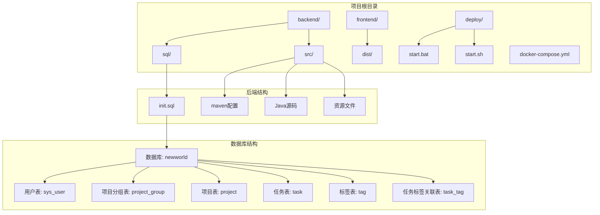
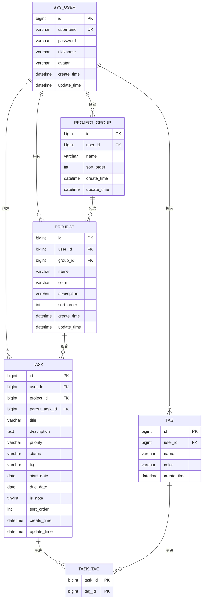
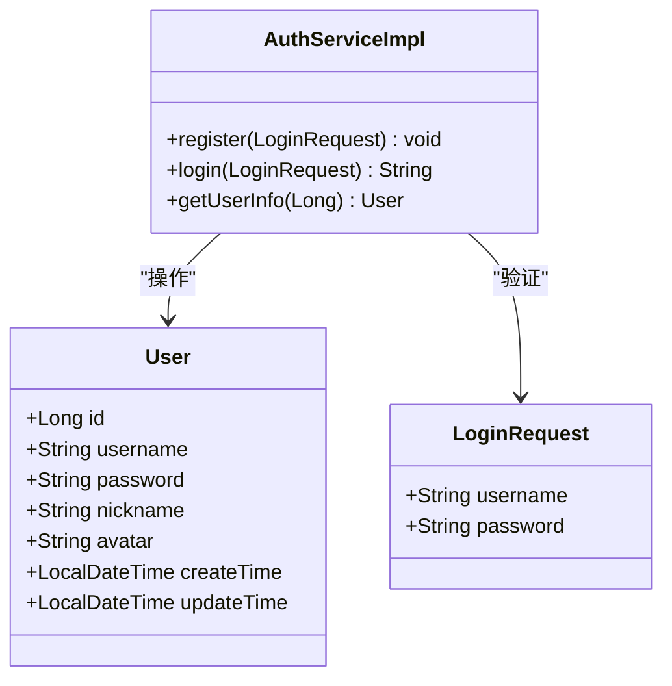
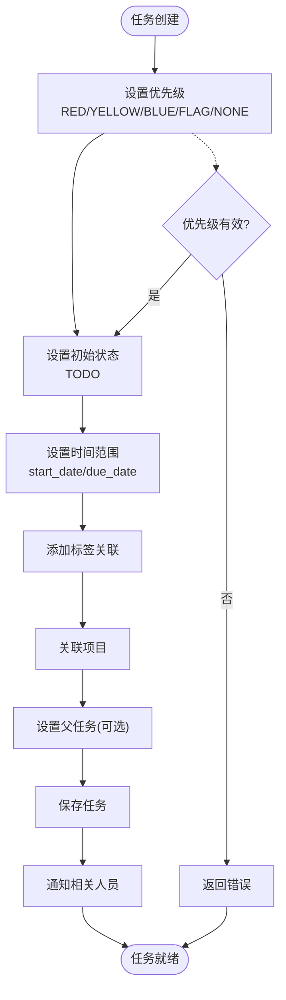
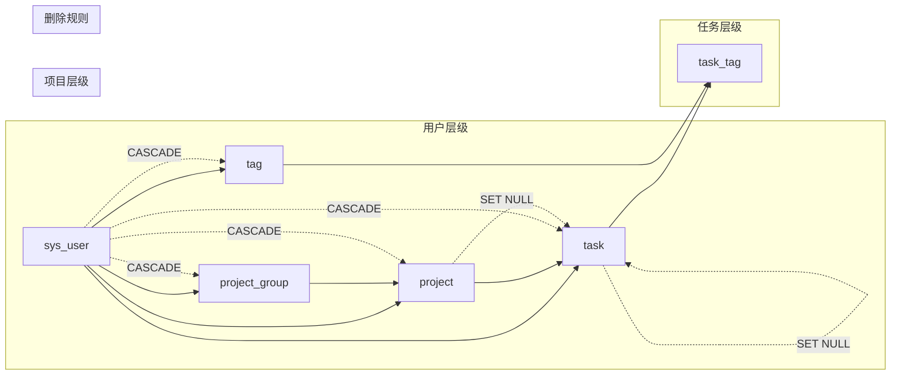
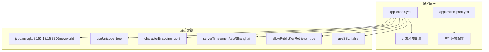

# 数据库初始化脚本

<cite>
**本文档引用的文件**
- [init.sql](file://backend/sql/init.sql)
- [application.yml](file://backend/src/main/resources/application.yml)
- [application-prod.yml](file://backend/src/main/resources/application-prod.yml)
- [User.java](file://backend/src/main/java/com/newworld/entity/User.java)
- [AuthServiceImpl.java](file://backend/src/main/java/com/newworld/service/impl/AuthServiceImpl.java)
- [LoginRequest.java](file://backend/src/main/java/com/newworld/dto/LoginRequest.java)
- [docker-compose.yml](file://docker-compose.yml)
- [Dockerfile](file://backend/Dockerfile)
- [Task.java](file://backend/src/main/java/com/newworld/entity/Task.java)
- [Project.java](file://backend/src/main/java/com/newworld/entity/Project.java)
- [Tag.java](file://backend/src/main/java/com/newworld/entity/Tag.java)
- [Group.java](file://backend/src/main/java/com/newworld/entity/Group.java)
</cite>

## 目录
1. [简介](#简介)
2. [项目结构](#项目结构)
3. [核心组件](#核心组件)
4. [架构概览](#架构概览)
5. [详细组件分析](#详细组件分析)
6. [依赖分析](#依赖分析)
7. [性能考虑](#性能考虑)
8. [故障排除指南](#故障排除指南)
9. [结论](#结论)
10. [附录](#附录)

## 简介

新世界项目的数据库初始化脚本是系统启动和运行的基础，负责创建完整的数据库结构和初始数据。该脚本采用MySQL语法编写，包含了完整的数据库模式设计，从用户管理系统到任务跟踪功能的完整实现。

本脚本的核心目标是：
- 建立规范的数据库结构，支持用户、项目、任务等核心业务功能
- 提供完整的数据完整性约束，确保业务逻辑的正确性
- 预置管理员账户，便于系统初始化和测试
- 优化查询性能，通过合理的索引设计提升系统响应速度

## 项目结构

新世界项目采用标准的Maven三层架构设计，数据库初始化脚本位于后端模块的sql目录中：

**图表来源**
- [init.sql:1-95](file://backend/sql/init.sql#L1-L95)
- [application.yml:1-75](file://backend/src/main/resources/application.yml#L1-L75)

**章节来源**
- [init.sql:1-95](file://backend/sql/init.sql#L1-L95)
- [application.yml:1-75](file://backend/src/main/resources/application.yml#L1-L75)

## 核心组件

### 数据库实例创建

脚本首先创建名为 `newworld` 的数据库实例，采用 `utf8mb4` 字符集和 `utf8mb4_unicode_ci` 排序规则。这种选择确保了对所有Unicode字符的完整支持，包括表情符号和各种语言的文字。

### 表结构设计

系统包含6个核心表，每个表都经过精心设计以满足特定的业务需求：

1. **用户表 (sys_user)**: 存储系统用户信息，支持用户名唯一性和密码加密存储
2. **项目分组表 (project_group)**: 支持用户自定义项目分组，提供灵活的项目组织方式
3. **项目表 (project)**: 存储具体的项目信息，支持颜色标记和描述功能
4. **任务表 (task)**: 核心业务表，支持复杂的任务管理功能，包括优先级、状态、标签等
5. **标签表 (tag)**: 支持任务标签管理，提供任务分类功能
6. **任务标签关联表 (task_tag)**: 实现任务与标签的多对多关系

**章节来源**
- [init.sql:8-84](file://backend/sql/init.sql#L8-L84)
- [User.java:1-95](file://backend/src/main/java/com/newworld/entity/User.java#L1-L95)
- [Task.java:1-184](file://backend/src/main/java/com/newworld/entity/Task.java#L1-L184)

## 架构概览

新世界项目的数据库架构采用了标准化的关系型设计，确保了数据的一致性和完整性：

**图表来源**
- [init.sql:9-84](file://backend/sql/init.sql#L9-L84)
- [User.java:11](file://backend/src/main/java/com/newworld/entity/User.java#L11)
- [Task.java:12](file://backend/src/main/java/com/newworld/entity/Task.java#L12)
- [Project.java:11](file://backend/src/main/java/com/newworld/entity/Project.java#L11)
- [Tag.java:11](file://backend/src/main/java/com/newworld/entity/Tag.java#L11)
- [Group.java:11](file://backend/src/main/java/com/newworld/entity/Group.java#L11)

## 详细组件分析

### 用户管理系统

用户表是整个系统的基石，设计了完整的用户信息存储和管理机制：

**图表来源**
- [User.java:13-95](file://backend/src/main/java/com/newworld/entity/User.java#L13-L95)
- [AuthServiceImpl.java:15-69](file://backend/src/main/java/com/newworld/service/impl/AuthServiceImpl.java#L15-L69)
- [LoginRequest.java:11-37](file://backend/src/main/java/com/newworld/dto/LoginRequest.java#L11-L37)

#### 默认管理员用户创建

脚本在第92-94行预置了默认管理员账户，采用SHA-256加密算法进行密码保护：

- **用户名**: admin
- **密码**: 240be518fabd2724ddb6f04eeb1da5967448d7e831c08c8fa822809f74c720a9
- **昵称**: 管理员

密码采用SHA-256哈希算法加密存储，确保即使数据库泄露，攻击者也无法直接获取明文密码。

**章节来源**
- [init.sql:92-94](file://backend/sql/init.sql#L92-L94)
- [AuthServiceImpl.java:35](file://backend/src/main/java/com/newworld/service/impl/AuthServiceImpl.java#L35)
- [AuthServiceImpl.java:50](file://backend/src/main/java/com/newworld/service/impl/AuthServiceImpl.java#L50)

### 任务管理系统

任务表是系统的核心，设计了复杂的状态管理和优先级体系：

**图表来源**
- [init.sql:46-65](file://backend/sql/init.sql#L46-L65)
- [Task.java:35-51](file://backend/src/main/java/com/newworld/entity/Task.java#L35-L51)

#### 索引优化策略

脚本创建了4个关键索引以优化查询性能：

1. **复合索引**: `idx_task_user_date` (user_id, start_date, due_date)
2. **单列索引**: `idx_task_project` (project_id)
3. **单列索引**: `idx_task_status` (status)
4. **单列索引**: `idx_task_priority` (priority)

这些索引专门针对任务查询场景进行了优化，包括用户任务查询、项目过滤、状态统计和优先级排序等常用操作。

**章节来源**
- [init.sql:86-91](file://backend/sql/init.sql#L86-L91)
- [Task.java:16-62](file://backend/src/main/java/com/newworld/entity/Task.java#L16-L62)

### 关系完整性约束

系统通过外键约束确保数据的完整性和一致性：

**图表来源**
- [init.sql:27](file://backend/sql/init.sql#L27)
- [init.sql:42](file://backend/sql/init.sql#L42)
- [init.sql:63](file://backend/sql/init.sql#L63)
- [init.sql:64](file://backend/sql/init.sql#L64)

**章节来源**
- [init.sql:27](file://backend/sql/init.sql#L27)
- [init.sql:42](file://backend/sql/init.sql#L42)
- [init.sql:63](file://backend/sql/init.sql#L63)
- [init.sql:64](file://backend/sql/init.sql#L64)

## 依赖分析

### 数据库连接配置

系统使用Spring Boot的自动配置机制管理数据库连接：

**图表来源**
- [application.yml:13](file://backend/src/main/resources/application.yml#L13)
- [application-prod.yml:7](file://backend/src/main/resources/application-prod.yml#L7)

### 外部依赖关系

系统依赖以下外部服务：

1. **MySQL数据库**: 版本8.0+，支持utf8mb4字符集
2. **Redis缓存**: 用于会话管理和缓存加速
3. **Docker容器化**: 支持一键部署和扩展

**章节来源**
- [application.yml:10-15](file://backend/src/main/resources/application.yml#L10-L15)
- [application.yml:17-29](file://backend/src/main/resources/application.yml#L17-L29)
- [docker-compose.yml:1-14](file://docker-compose.yml#L1-L14)

## 性能考虑

### 字符集选择策略

系统采用 `utf8mb4` 字符集而非传统的 `utf8`，主要基于以下考虑：

1. **完整的UTF-8支持**: `utf8mb4` 支持4字节UTF-8编码，能够正确存储表情符号和特殊Unicode字符
2. **向后兼容性**: MySQL中的 `utf8` 实际上是 `utf8mb3`，限制了字符存储范围
3. **国际化支持**: 确保多语言环境下的数据完整性

### 查询性能优化

通过合理的索引设计和表结构优化，系统在以下场景下具有优异的性能表现：

1. **用户任务查询**: 通过 `idx_task_user_date` 索引快速定位用户的所有任务
2. **项目过滤**: 使用 `idx_task_project` 索引实现高效的项目筛选
3. **状态统计**: 通过 `idx_task_status` 和 `idx_task_priority` 索引支持快速的状态和优先级统计

## 故障排除指南

### 常见安装问题

#### 数据库连接失败
**症状**: 应用启动时报数据库连接错误
**解决方案**:
1. 检查MySQL服务器是否正常运行
2. 验证数据库URL、用户名和密码配置
3. 确认防火墙设置允许端口访问

#### 字符集不匹配
**症状**: 中文显示乱码或特殊字符无法正确存储
**解决方案**:
1. 确认MySQL服务器字符集设置为 `utf8mb4`
2. 检查客户端连接参数中的字符集配置
3. 重新执行初始化脚本

#### 权限不足
**症状**: 执行初始化脚本时报权限错误
**解决方案**:
1. 使用具有足够权限的数据库用户执行脚本
2. 确认用户对目标数据库有CREATE、ALTER、DROP权限
3. 检查MySQL的 `local-infile` 设置

### 数据迁移和升级

当需要升级现有数据库时，建议遵循以下步骤：

1. **备份现有数据**: 使用 `mysqldump` 工具备份完整数据库
2. **检查兼容性**: 确认新版本MySQL对现有SQL语法的支持
3. **执行升级脚本**: 逐步应用增量升级脚本
4. **验证数据完整性**: 运行数据校验查询确认升级成功

**章节来源**
- [application.yml:13](file://backend/src/main/resources/application.yml#L13)
- [application-prod.yml:7](file://backend/src/main/resources/application-prod.yml#L7)

## 结论

新世界项目的数据库初始化脚本展现了现代Web应用数据库设计的最佳实践。通过精心设计的表结构、完善的约束机制和优化的索引策略，系统能够在保证数据完整性的同时提供优秀的性能表现。

脚本的主要优势包括：
- **完整的功能覆盖**: 从用户管理到任务跟踪的全栈支持
- **安全的设计理念**: 密码加密存储和权限控制机制
- **性能优化**: 合理的索引设计和查询优化
- **可维护性**: 清晰的表结构和外键关系

对于新用户来说，按照本文档的指导进行数据库初始化，可以确保系统获得最佳的运行效果。

## 附录

### 执行步骤指南

#### 准备工作
1. 确保MySQL服务器版本为8.0或更高
2. 准备具有足够权限的数据库用户
3. 配置好网络连接和防火墙设置

#### 执行步骤
1. 连接到MySQL服务器
2. 执行初始化脚本
3. 验证表结构和数据完整性
4. 启动应用程序服务

#### 验证方法
1. 检查数据库是否存在
2. 验证所有表是否创建成功
3. 确认默认管理员用户存在
4. 测试基本的CRUD操作

### 备份和恢复建议

#### 定期备份策略
1. **全量备份**: 每周执行一次完整的数据库备份
2. **增量备份**: 每日执行增量备份，保留最近7天的日志
3. **自动化脚本**: 编写备份脚本并设置定时任务

#### 恢复流程
1. **数据恢复**: 使用 `mysql` 命令恢复备份文件
2. **验证恢复**: 检查数据完整性和业务功能
3. **监控告警**: 设置数据库健康监控和告警机制