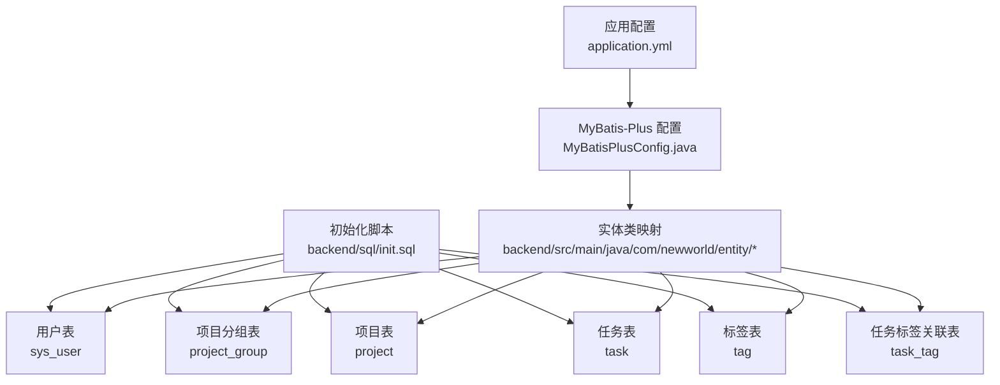
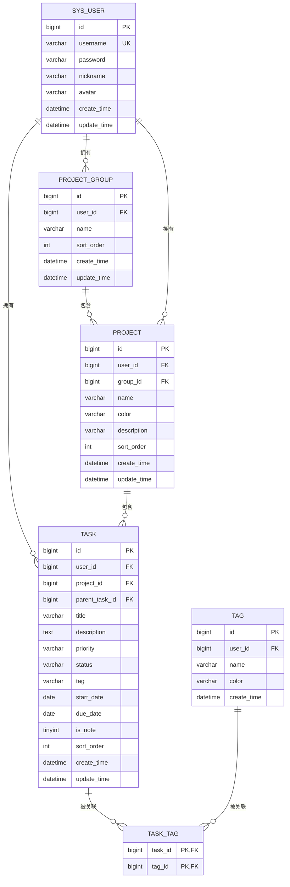
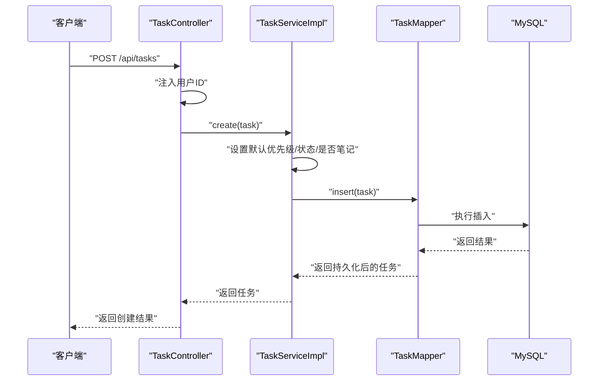
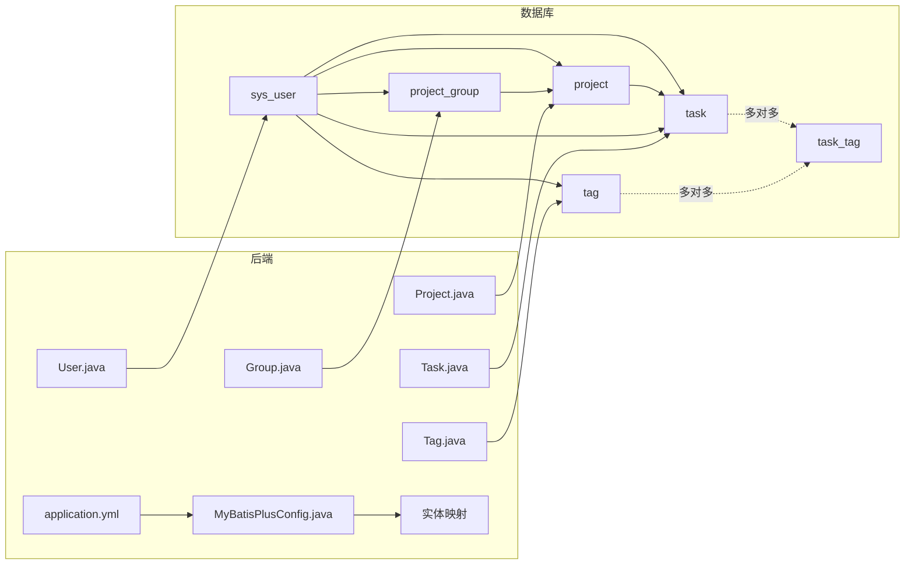

# 数据库表结构

<cite>
**本文引用的文件**
- [init.sql](file://backend/sql/init.sql)
- [User.java](file://backend/src/main/java/com/newworld/entity/User.java)
- [Group.java](file://backend/src/main/java/com/newworld/entity/Group.java)
- [Project.java](file://backend/src/main/java/com/newworld/entity/Project.java)
- [Task.java](file://backend/src/main/java/com/newworld/entity/Task.java)
- [Tag.java](file://backend/src/main/java/com/newworld/entity/Tag.java)
- [application.yml](file://backend/src/main/resources/application.yml)
- [MyBatisPlusConfig.java](file://backend/src/main/java/com/newworld/config/MyBatisPlusConfig.java)
- [TaskController.java](file://backend/src/main/java/com/newworld/controller/TaskController.java)
- [TaskServiceImpl.java](file://backend/src/main/java/com/newworld/service/impl/TaskServiceImpl.java)
- [TaskQueryDTO.java](file://backend/src/main/java/com/newworld/dto/TaskQueryDTO.java)
- [TaskStatisticsVO.java](file://backend/src/main/java/com/newworld/dto/TaskStatisticsVO.java)
</cite>

## 目录
1. [简介](#简介)
2. [项目结构](#项目结构)
3. [核心组件](#核心组件)
4. [架构总览](#架构总览)
5. [详细组件分析](#详细组件分析)
6. [依赖分析](#依赖分析)
7. [性能考虑](#性能考虑)
8. [故障排查指南](#故障排查指南)
9. [结论](#结论)
10. [附录](#附录)

## 简介
本文件系统性梳理“新世界”项目的数据库表结构，覆盖用户表、项目分组表、项目表、任务表、标签表及任务标签关联表。文档从字段定义、数据类型、约束条件、注释与业务含义出发，解释设计考量（如外键关系、状态/优先级枚举、颜色字段），并给出ER图与索引设计说明。同时结合后端实体类与配置，明确Java对象与数据库表的映射关系。

## 项目结构
数据库初始化脚本位于 backend/sql/init.sql，定义了完整的表结构、约束与索引；实体类位于 backend/src/main/java/com/newworld/entity 下，采用 MyBatis-Plus 注解映射到对应表；应用配置文件 backend/src/main/resources/application.yml 指定 MySQL 连接与 MyBatis-Plus 全局配置。

**图表来源**
- [init.sql:1-95](file://backend/sql/init.sql#L1-L95)
- [application.yml:1-75](file://backend/src/main/resources/application.yml#L1-L75)
- [MyBatisPlusConfig.java:1-22](file://backend/src/main/java/com/newworld/config/MyBatisPlusConfig.java#L1-L22)

**章节来源**
- [init.sql:1-95](file://backend/sql/init.sql#L1-L95)
- [application.yml:1-75](file://backend/src/main/resources/application.yml#L1-L75)

## 核心组件
本节对六个核心表逐一进行字段级说明，并解释其业务含义与设计取舍。

- sys_user 用户表
  - 字段与约束
    - id：BIGINT，主键，自增，注释“用户ID”
    - username：VARCHAR(50)，非空，唯一，注释“用户名”
    - password：VARCHAR(255)，非空，注释“密码（加密存储）”
    - nickname：VARCHAR(50)，可空，注释“昵称”
    - avatar：VARCHAR(500)，可空，注释“头像”
    - create_time：DATETIME，默认 CURRENT_TIMESTAMP，注释“创建时间”
    - update_time：DATETIME，默认 CURRENT_TIMESTAMP ON UPDATE CURRENT_TIMESTAMP，注释“更新时间”
  - 设计说明
    - 使用自增主键，保证全局唯一性
    - username 唯一约束确保登录名不重复
    - 密码字段足够长以容纳哈希值
    - 头像路径允许较长字符串以支持不同存储策略
    - 时间字段统一使用默认值，便于审计与排序
  - 业务含义
    - 存储用户身份与认证信息，支撑登录与权限控制

- project_group 项目分组表
  - 字段与约束
    - id：BIGINT，主键，自增，注释“分组ID”
    - user_id：BIGINT，非空，注释“用户ID”，外键引用 sys_user(id)，级联删除
    - name：VARCHAR(100)，非空，注释“分组名称”
    - sort_order：INT，默认 0，注释“排序号”
    - create_time：DATETIME，默认 CURRENT_TIMESTAMP
    - update_time：DATETIME，默认 CURRENT_TIMESTAMP ON UPDATE CURRENT_TIMESTAMP
  - 设计说明
    - 外键 user_id 强制分组归属用户，防止跨用户访问
    - 排序号用于前端展示顺序控制
    - 统一时间戳便于排序与审计
  - 业务含义
    - 将用户的项目按逻辑分组，提升组织与检索效率

- project 项目表
  - 字段与约束
    - id：BIGINT，主键，自增，注释“项目ID”
    - user_id：BIGINT，非空，注释“用户ID”，外键引用 sys_user(id)，级联删除
    - group_id：BIGINT，非空，注释“分组ID”，外键引用 project_group(id)，级联删除
    - name：VARCHAR(100)，非空，注释“项目名称”
    - color：VARCHAR(20)，默认 “#409EFF”，注释“项目颜色”
    - description：VARCHAR(500)，可空，注释“项目描述”
    - sort_order：INT，默认 0，注释“排序号”
    - create_time：DATETIME，默认 CURRENT_TIMESTAMP
    - update_time：DATETIME，默认 CURRENT_TIMESTAMP ON UPDATE CURRENT_TIMESTAMP
  - 设计说明
    - 双外键确保项目归属用户与分组，避免脏数据
    - 颜色字段用于前端可视化区分项目
    - 默认排序号与时间戳便于排序与展示
  - 业务含义
    - 定义具体的工作单元，承载任务集合

- task 任务表（核心表）
  - 字段与约束
    - id：BIGINT，主键，自增，注释“任务ID”
    - user_id：BIGINT，非空，注释“用户ID”，外键引用 sys_user(id)，级联删除
    - project_id：BIGINT，可空，注释“项目ID”，外键引用 project(id)，删除设为空
    - parent_task_id：BIGINT，可空，注释“关联主任务ID”，自引用外键，删除设为空
    - title：VARCHAR(200)，非空，注释“任务标题”
    - description：TEXT，可空，注释“任务描述（多文本内容）”
    - priority：VARCHAR(20)，默认 “NONE”，注释“优先级: RED/YELLOW/BLUE/FLAG/NONE”
    - status：VARCHAR(20)，默认 “TODO”，注释“状态: TODO/IN_PROGRESS/DONE/ARCHIVED”
    - tag：VARCHAR(100)，可空，注释“标签”
    - start_date：DATE，可空，注释“开始日期”
    - due_date：DATE，可空，注释“截止日期”
    - is_note：TINYINT(1)，默认 0，注释“是否为笔记”
    - sort_order：INT，默认 0，注释“排序号”
    - create_time：DATETIME，默认 CURRENT_TIMESTAMP
    - update_time：DATETIME，默认 CURRENT_TIMESTAMP ON UPDATE CURRENT_TIMESTAMP
  - 设计说明
    - 优先级与状态均为枚举型字符串，便于灵活扩展与前端展示
    - is_note 字段用于区分任务与笔记，简化业务分支
    - 自引用 parent_task_id 支持父子任务关系，删除设为空避免级联破坏
    - 外键 project_id 删除设为空，保留任务但解除项目绑定
  - 业务含义
    - 承载具体的工作项，支持优先级、状态、时间与标签管理

- tag 标签表
  - 字段与约束
    - id：BIGINT，主键，自增，注释“标签ID”
    - user_id：BIGINT，非空，注释“用户ID”，外键引用 sys_user(id)，级联删除
    - name：VARCHAR(50)，非空，注释“标签名称”
    - color：VARCHAR(20)，默认 “#409EFF”，注释“标签颜色”
    - create_time：DATETIME，默认 CURRENT_TIMESTAMP
  - 设计说明
    - 标签与用户强关联，避免跨用户标签冲突
    - 颜色字段用于前端高亮显示
  - 业务含义
    - 提供轻量标签体系，支持多任务多标签关联

- task_tag 任务标签关联表
  - 字段与约束
    - task_id：BIGINT，非空，注释“任务ID”，联合主键之一
    - tag_id：BIGINT，非空，注释“标签ID”，联合主键之一
    - 联合主键(task_id, tag_id)
    - 外键 task_id 引用 task(id)，级联删除
    - 外键 tag_id 引用 tag(id)，级联删除
  - 设计说明
    - 联合主键保证同一任务不可重复绑定同一标签
    - 双外键级联删除确保数据一致性
  - 业务含义
    - 实现任务与标签的多对多关系

**章节来源**
- [init.sql:8-95](file://backend/sql/init.sql#L8-L95)
- [User.java:1-95](file://backend/src/main/java/com/newworld/entity/User.java#L1-L95)
- [Group.java:1-84](file://backend/src/main/java/com/newworld/entity/Group.java#L1-L84)
- [Project.java:1-117](file://backend/src/main/java/com/newworld/entity/Project.java#L1-L117)
- [Task.java:1-184](file://backend/src/main/java/com/newworld/entity/Task.java#L1-L184)
- [Tag.java:1-72](file://backend/src/main/java/com/newworld/entity/Tag.java#L1-L72)

## 架构总览
下图展示六个表之间的关系与引用关系，体现用户、分组、项目、任务、标签及其关联的完整数据模型。

**图表来源**
- [init.sql:8-95](file://backend/sql/init.sql#L8-L95)

## 详细组件分析

### 表：sys_user 用户表
- 字段设计要点
  - 主键自增，保证唯一性
  - username 唯一，避免重复登录名
  - password 字段长度充足，适配多种哈希算法输出
  - 时间字段默认值便于审计与排序
- Java 映射
  - 实体类通过 @TableName("sys_user") 映射，MyBatis-Plus 自动填充时间字段
- 业务影响
  - 登录鉴权与权限边界的基础

**章节来源**
- [init.sql:9-17](file://backend/sql/init.sql#L9-L17)
- [User.java:11-37](file://backend/src/main/java/com/newworld/entity/User.java#L11-L37)
- [application.yml:36-49](file://backend/src/main/resources/application.yml#L36-L49)

### 表：project_group 项目分组表
- 字段设计要点
  - 外键 user_id 级联删除，保障数据一致性
  - sort_order 支持灵活排序
  - 统一时间戳便于排序与审计
- Java 映射
  - 实体类通过 @TableName("project_group") 映射

**章节来源**
- [init.sql:20-28](file://backend/sql/init.sql#L20-L28)
- [Group.java:11-34](file://backend/src/main/java/com/newworld/entity/Group.java#L11-L34)

### 表：project 项目表
- 字段设计要点
  - 双外键 user_id 与 group_id，确保归属关系
  - color 字段用于前端可视化
  - 删除时 project.id 的外键行为为 SET NULL，避免强制删除任务
- Java 映射
  - 实体类通过 @TableName("project") 映射

**章节来源**
- [init.sql:31-43](file://backend/sql/init.sql#L31-L43)
- [Project.java:11-43](file://backend/src/main/java/com/newworld/entity/Project.java#L11-L43)

### 表：task 任务表（核心表）
- 字段设计要点
  - 优先级与状态枚举字符串，便于扩展与前端展示
  - is_note 区分任务与笔记，简化业务分支
  - 自引用 parent_task_id 支持父子任务关系
  - 外键 project_id 删除设为空，保留任务但解除项目绑定
- Java 映射
  - 实体类通过 @TableName("task") 映射，MyBatis-Plus 自动填充时间字段
- 查询与统计
  - 控制器与服务层提供多维查询、状态变更、优先级调整、复制、归档、转笔记、分享链接生成与统计功能

**图表来源**
- [TaskController.java:39-45](file://backend/src/main/java/com/newworld/controller/TaskController.java#L39-L45)
- [TaskServiceImpl.java:56-68](file://backend/src/main/java/com/newworld/service/impl/TaskServiceImpl.java#L56-L68)

**章节来源**
- [init.sql:46-65](file://backend/sql/init.sql#L46-L65)
- [Task.java:12-62](file://backend/src/main/java/com/newworld/entity/Task.java#L12-L62)
- [TaskController.java:1-112](file://backend/src/main/java/com/newworld/controller/TaskController.java#L1-L112)
- [TaskServiceImpl.java:1-194](file://backend/src/main/java/com/newworld/service/impl/TaskServiceImpl.java#L1-L194)
- [TaskQueryDTO.java:1-145](file://backend/src/main/java/com/newworld/dto/TaskQueryDTO.java#L1-L145)
- [TaskStatisticsVO.java:1-66](file://backend/src/main/java/com/newworld/dto/TaskStatisticsVO.java#L1-L66)

### 表：tag 标签表
- 字段设计要点
  - 标签与用户强关联，避免跨用户标签冲突
  - color 字段用于前端高亮显示
- Java 映射
  - 实体类通过 @TableName("tag") 映射

**章节来源**
- [init.sql:68-75](file://backend/sql/init.sql#L68-L75)
- [Tag.java:11-31](file://backend/src/main/java/com/newworld/entity/Tag.java#L11-L31)

### 表：task_tag 任务标签关联表
- 字段设计要点
  - 联合主键保证同一任务不可重复绑定同一标签
  - 双外键级联删除确保数据一致性
- Java 映射
  - 该表为关联表，通常由框架或业务代码维护，无需单独实体类映射

**章节来源**
- [init.sql:77-84](file://backend/sql/init.sql#L77-L84)

## 依赖分析
- 外键依赖
  - project.user_id → sys_user(id)（级联删除）
  - project.group_id → project_group(id)（级联删除）
  - task.user_id → sys_user(id)（级联删除）
  - task.project_id → project(id)（删除设为空）
  - task.parent_task_id → task(id)（删除设为空）
  - tag.user_id → sys_user(id)（级联删除）
  - task_tag.task_id → task(id)（级联删除）
  - task_tag.tag_id → tag(id)（级联删除）
- 索引依赖
  - idx_task_user_date(task.user_id, start_date, due_date)
  - idx_task_project(task.project_id)
  - idx_task_status(task.status)
  - idx_task_priority(task.priority)
- Java 映射与配置
  - 实体类通过 @TableName 映射到表
  - MyBatis-Plus 全局配置启用自动填充与分页插件
  - 应用配置指定 MySQL 驱动、URL、账号密码与 MyBatis-Plus 参数

**图表来源**
- [init.sql:8-95](file://backend/sql/init.sql#L8-L95)
- [User.java:11-37](file://backend/src/main/java/com/newworld/entity/User.java#L11-L37)
- [Group.java:11-34](file://backend/src/main/java/com/newworld/entity/Group.java#L11-L34)
- [Project.java:11-43](file://backend/src/main/java/com/newworld/entity/Project.java#L11-L43)
- [Task.java:12-62](file://backend/src/main/java/com/newworld/entity/Task.java#L12-L62)
- [Tag.java:11-31](file://backend/src/main/java/com/newworld/entity/Tag.java#L11-L31)
- [MyBatisPlusConfig.java:1-22](file://backend/src/main/java/com/newworld/config/MyBatisPlusConfig.java#L1-L22)
- [application.yml:36-49](file://backend/src/main/resources/application.yml#L36-L49)

**章节来源**
- [init.sql:86-91](file://backend/sql/init.sql#L86-L91)
- [application.yml:36-49](file://backend/src/main/resources/application.yml#L36-L49)
- [MyBatisPlusConfig.java:1-22](file://backend/src/main/java/com/newworld/config/MyBatisPlusConfig.java#L1-L22)

## 性能考虑
- 索引设计
  - idx_task_user_date：复合索引覆盖用户+日期范围查询，适合按用户与起止日期筛选任务
  - idx_task_project：加速按项目过滤的任务查询
  - idx_task_status：加速按状态统计与筛选
  - idx_task_priority：加速按优先级筛选
- 字段长度与字符集
  - 字符集选择 utf8mb4，兼容四字节表情符号，满足国际化与现代输入需求
  - 各字段长度根据业务内容合理设定，兼顾存储与查询效率
- 分页与查询
  - MyBatis-Plus 分页插件启用，配合查询 DTO 的分页参数，避免一次性加载大量数据
- 写入优化
  - 自动填充 create_time/update_time，减少业务层重复赋值
  - 任务默认值在服务层设置，保证一致性

**章节来源**
- [init.sql:4-4](file://backend/sql/init.sql#L4-L4)
- [init.sql:86-91](file://backend/sql/init.sql#L86-L91)
- [application.yml:36-49](file://backend/src/main/resources/application.yml#L36-L49)
- [MyBatisPlusConfig.java:15-20](file://backend/src/main/java/com/newworld/config/MyBatisPlusConfig.java#L15-L20)
- [TaskQueryDTO.java:43-47](file://backend/src/main/java/com/newworld/dto/TaskQueryDTO.java#L43-L47)

## 故障排查指南
- 常见错误与定位
  - 外键约束失败：检查被引用记录是否存在，确认删除策略（SET NULL 或 CASCADE）
  - 唯一约束冲突：username 冲突需修改用户名
  - 默认值缺失：创建任务时未设置优先级/状态/是否笔记，服务层会补默认值
  - 查询无结果：确认用户上下文与查询参数（状态、优先级、日期范围、关键词）
- 关键流程验证
  - 创建任务：控制器注入用户ID，服务层设置默认值并持久化
  - 更新任务：先校验存在性，再更新
  - 统计任务：按状态分别计数，汇总总数
- 相关实现参考
  - 任务创建与默认值设置
  - 任务更新与删除校验
  - 任务状态与优先级更新
  - 任务统计与分页查询

**章节来源**
- [TaskController.java:39-59](file://backend/src/main/java/com/newworld/controller/TaskController.java#L39-L59)
- [TaskServiceImpl.java:56-87](file://backend/src/main/java/com/newworld/service/impl/TaskServiceImpl.java#L56-L87)
- [TaskServiceImpl.java:176-192](file://backend/src/main/java/com/newworld/service/impl/TaskServiceImpl.java#L176-L192)

## 结论
本数据库设计围绕“用户—分组—项目—任务—标签”的层级关系展开，通过外键约束与索引组合，既保证数据一致性，又兼顾查询性能。字段长度与字符集的选择满足现代应用需求；枚举型字符串便于扩展与前端展示。结合 MyBatis-Plus 的自动填充与分页能力，整体架构清晰、可维护性强。

## 附录
- 数据库连接与 MyBatis-Plus 配置
  - 数据源驱动与 URL、账号密码在 application.yml 中配置
  - MyBatis-Plus 开启分页插件与驼峰映射，全局 ID 类型为自增
- 实体类映射
  - 各实体类通过 @TableName 映射到对应表，字段命名遵循驼峰规则

**章节来源**
- [application.yml:10-49](file://backend/src/main/resources/application.yml#L10-L49)
- [MyBatisPlusConfig.java:15-20](file://backend/src/main/java/com/newworld/config/MyBatisPlusConfig.java#L15-L20)