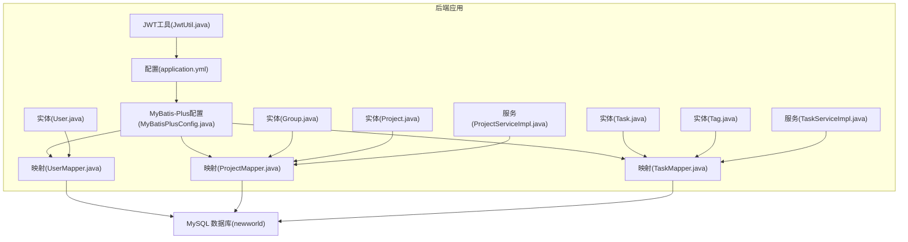
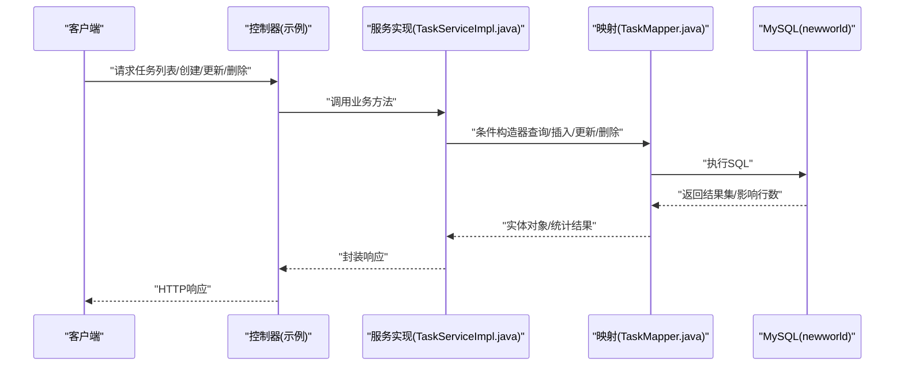
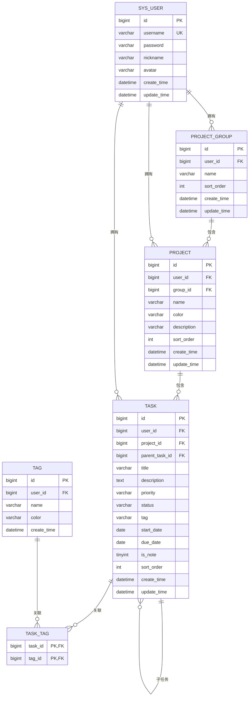
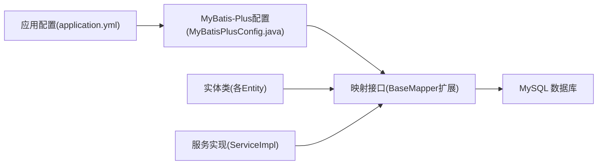

# 数据库设计

<cite>
**本文引用的文件**
- [init.sql](file://backend/sql/init.sql)
- [application.yml](file://backend/src/main/resources/application.yml)
- [MyBatisPlusConfig.java](file://backend/src/main/java/com/newworld/config/MyBatisPlusConfig.java)
- [User.java](file://backend/src/main/java/com/newworld/entity/User.java)
- [Group.java](file://backend/src/main/java/com/newworld/entity/Group.java)
- [Project.java](file://backend/src/main/java/com/newworld/entity/Project.java)
- [Task.java](file://backend/src/main/java/com/newworld/entity/Task.java)
- [Tag.java](file://backend/src/main/java/com/newworld/entity/Tag.java)
- [TaskMapper.java](file://backend/src/main/java/com/newworld/mapper/TaskMapper.java)
- [ProjectMapper.java](file://backend/src/main/java/com/newworld/mapper/ProjectMapper.java)
- [UserMapper.java](file://backend/src/main/java/com/newworld/mapper/UserMapper.java)
- [TaskServiceImpl.java](file://backend/src/main/java/com/newworld/service/impl/TaskServiceImpl.java)
- [ProjectServiceImpl.java](file://backend/src/main/java/com/newworld/service/impl/ProjectServiceImpl.java)
- [JwtUtil.java](file://backend/src/main/java/com/newworld/common/JwtUtil.java)
</cite>

## 目录
1. [简介](#简介)
2. [项目结构](#项目结构)
3. [核心组件](#核心组件)
4. [架构总览](#架构总览)
5. [详细组件分析](#详细组件分析)
6. [依赖分析](#依赖分析)
7. [性能考虑](#性能考虑)
8. [故障排查指南](#故障排查指南)
9. [结论](#结论)
10. [附录](#附录)

## 简介
本设计文档面向“新世界”项目，系统化阐述数据库整体设计思路与实现细节。项目采用关系型数据库作为持久化存储，结合 MySQL 与 MyBatis-Plus 进行 ORM 映射与分页支持；通过明确的表结构、主外键约束与索引策略，保障数据一致性与查询效率。同时，文档涵盖用户、项目分组、项目、任务、标签等核心表的字段定义、约束与索引设计，并说明表间关系（一对一、一对多、多对多）的实现方式，最后给出初始化脚本的使用指南与常见问题排查建议。

## 项目结构
后端基于 Spring Boot + MyBatis-Plus 构建，数据库初始化脚本位于 backend/sql/init.sql，应用配置位于 backend/src/main/resources/application.yml，实体类位于 backend/src/main/java/com/newworld/entity，Mapper 接口位于 backend/src/main/java/com/newworld/mapper，业务服务位于 backend/src/main/java/com/newworld/service/impl。

图表来源
- [application.yml:10-50](file://backend/src/main/resources/application.yml#L10-L50)
- [MyBatisPlusConfig.java:15-20](file://backend/src/main/java/com/newworld/config/MyBatisPlusConfig.java#L15-L20)
- [User.java:11](file://backend/src/main/java/com/newworld/entity/User.java#L11)
- [Group.java:11](file://backend/src/main/java/com/newworld/entity/Group.java#L11)
- [Project.java:11](file://backend/src/main/java/com/newworld/entity/Project.java#L11)
- [Task.java:12](file://backend/src/main/java/com/newworld/entity/Task.java#L12)
- [Tag.java:11](file://backend/src/main/java/com/newworld/entity/Tag.java#L11)
- [UserMapper.java:7](file://backend/src/main/java/com/newworld/mapper/UserMapper.java#L7)
- [ProjectMapper.java:7](file://backend/src/main/java/com/newworld/mapper/ProjectMapper.java#L7)
- [TaskMapper.java:7](file://backend/src/main/java/com/newworld/mapper/TaskMapper.java#L7)
- [TaskServiceImpl.java:17](file://backend/src/main/java/com/newworld/service/impl/TaskServiceImpl.java#L17)
- [ProjectServiceImpl.java:15](file://backend/src/main/java/com/newworld/service/impl/ProjectServiceImpl.java#L15)
- [JwtUtil.java:20-24](file://backend/src/main/java/com/newworld/common/JwtUtil.java#L20-L24)

章节来源
- [application.yml:10-50](file://backend/src/main/resources/application.yml#L10-L50)
- [MyBatisPlusConfig.java:15-20](file://backend/src/main/java/com/newworld/config/MyBatisPlusConfig.java#L15-L20)

## 核心组件
本节聚焦数据库初始化脚本与实体类映射，梳理核心表结构与约束。

- 数据库选择与优势
  - 关系型数据库（MySQL）：结构化强、ACID 事务、SQL 查询成熟稳定，适合任务与项目管理的数据模型与复杂关联查询。
  - MyBatis-Plus：简化 CRUD、自动填充、分页插件、逻辑删除等特性，降低样板代码，提升开发效率。
  - 字符集与排序规则：utf8mb4 与统一校对规则，满足多语言与排序一致性需求。

- 初始化脚本要点
  - 创建数据库 newworld 并设置字符集与排序规则。
  - 定义用户表、项目分组表、项目表、任务表、标签表及任务标签关联表。
  - 建立外键约束与索引，插入默认管理员用户示例数据。

章节来源
- [init.sql:1-95](file://backend/sql/init.sql#L1-L95)
- [application.yml:10-50](file://backend/src/main/resources/application.yml#L10-L50)

## 架构总览
数据库层与应用层交互流程如下：

图表来源
- [TaskServiceImpl.java:23-44](file://backend/src/main/java/com/newworld/service/impl/TaskServiceImpl.java#L23-L44)
- [TaskMapper.java:7](file://backend/src/main/java/com/newworld/mapper/TaskMapper.java#L7)
- [application.yml:10-50](file://backend/src/main/resources/application.yml#L10-L50)

## 详细组件分析

### 用户表（sys_user）
- 设计目标：存储用户基本信息与认证凭据。
- 字段与约束
  - 主键：id（自增）
  - 唯一性：username
  - 时间字段：create_time、update_time（自动填充）
- 索引：无显式索引（可按需在 username 上建立唯一索引，已在约束中体现）
- 外键：无（独立实体）

章节来源
- [init.sql:8-17](file://backend/sql/init.sql#L8-L17)
- [User.java:11-37](file://backend/src/main/java/com/newworld/entity/User.java#L11-L37)

### 项目分组表（project_group）
- 设计目标：按用户维度对项目进行分组，支持排序展示。
- 字段与约束
  - 主键：id（自增）
  - 外键：user_id → sys_user(id)（级联删除）
  - 时间字段：create_time、update_time
- 索引：无显式索引
- 关系：一对一（分组属于用户），一对多（分组包含多个项目）

章节来源
- [init.sql:19-28](file://backend/sql/init.sql#L19-L28)
- [Group.java:11-34](file://backend/src/main/java/com/newworld/entity/Group.java#L11-L34)

### 项目表（project）
- 设计目标：承载具体项目信息，归属用户与分组。
- 字段与约束
  - 主键：id（自增）
  - 外键：user_id → sys_user(id)、group_id → project_group(id)（均级联删除）
  - 默认值：color 默认值
  - 时间字段：create_time、update_time
- 索引：无显式索引
- 关系：一对一（项目属于用户）、一对一（项目属于分组）、一对多（项目包含多个任务）

章节来源
- [init.sql:30-43](file://backend/sql/init.sql#L30-L43)
- [Project.java:11-43](file://backend/src/main/java/com/newworld/entity/Project.java#L11-L43)

### 任务表（task，核心表）
- 设计目标：记录任务与笔记，支持优先级、状态、日期、标签等属性。
- 字段与约束
  - 主键：id（自增）
  - 外键：user_id → sys_user(id)、project_id → project(id)（删除设空）、parent_task_id → task(id)（删除设空）
  - 默认值：priority 默认 NONE、status 默认 TODO、is_note 默认 0
  - 时间字段：create_time、update_time
- 索引：已建立复合索引 idx_task_user_date、idx_task_project、idx_task_status、idx_task_priority
- 关系：一对一（任务属于用户）、一对多（项目包含多个任务）、一对一（任务可关联父任务，形成树形结构）

图表来源
- [init.sql:8-91](file://backend/sql/init.sql#L8-L91)
- [Task.java:12-62](file://backend/src/main/java/com/newworld/entity/Task.java#L12-L62)

章节来源
- [init.sql:45-65](file://backend/sql/init.sql#L45-L65)
- [Task.java:12-62](file://backend/src/main/java/com/newworld/entity/Task.java#L12-L62)

### 标签表（tag）
- 设计目标：为任务提供灵活的标签能力。
- 字段与约束
  - 主键：id（自增）
  - 外键：user_id → sys_user(id)（级联删除）
  - 默认值：color 默认值
  - 时间字段：create_time
- 索引：无显式索引
- 关系：一对一（标签属于用户）、多对多（标签与任务通过关联表）

章节来源
- [init.sql:67-75](file://backend/sql/init.sql#L67-L75)
- [Tag.java:11-31](file://backend/src/main/java/com/newworld/entity/Tag.java#L11-L31)

### 任务标签关联表（task_tag，多对多）
- 设计目标：实现任务与标签的多对多关系。
- 字段与约束
  - 复合主键：(task_id, tag_id)
  - 外键：task_id → task(id)、tag_id → tag(id)（均级联删除）
- 索引：无显式索引
- 关系：多对多（任务-标签）

章节来源
- [init.sql:77-84](file://backend/sql/init.sql#L77-L84)

### 表间关系与约束总结
- 一对一：sys_user → project_group、sys_user → project、sys_user → tag
- 一对多：project_group → project、project → task、sys_user → task、sys_user → project
- 多对多：task ↔ tag（通过 task_tag 关联）
- 级联策略：
  - 删除用户时级联删除其分组、项目、任务、标签；
  - 删除项目或任务时，外键设为空或级联删除，视具体场景而定。

章节来源
- [init.sql:27](file://backend/sql/init.sql#L27)
- [init.sql:42](file://backend/sql/init.sql#L42)
- [init.sql:63-64](file://backend/sql/init.sql#L63-L64)
- [init.sql:74](file://backend/sql/init.sql#L74)
- [init.sql:82-83](file://backend/sql/init.sql#L82-L83)

### 数据完整性约束
- 主键：所有表均有自增主键
- 外键：明确的外键关系与删除策略
- 唯一性：用户名唯一
- 检查约束：未使用显式 CHECK 约束，通过默认值与业务层控制保证取值范围（如优先级、状态枚举）

章节来源
- [init.sql:11](file://backend/sql/init.sql#L11)
- [init.sql:27](file://backend/sql/init.sql#L27)
- [init.sql:42](file://backend/sql/init.sql#L42)
- [init.sql:63-64](file://backend/sql/init.sql#L63-L64)
- [init.sql:74](file://backend/sql/init.sql#L74)
- [init.sql:82-83](file://backend/sql/init.sql#L82-L83)

### 查询与索引策略
- 已建立索引
  - idx_task_user_date：覆盖用户+起止日期，用于按用户与日期范围检索任务
  - idx_task_project：加速项目维度查询
  - idx_task_status：加速状态筛选
  - idx_task_priority：加速优先级筛选
- 建议补充索引
  - 在 project.user_id、project.group_id 上建立索引，提升项目查询性能
  - 在 tag.user_id 上建立索引，提升标签查询性能
  - 在 task.parent_task_id 上建立索引，提升父子任务查询性能

章节来源
- [init.sql:86-91](file://backend/sql/init.sql#L86-L91)
- [TaskServiceImpl.java:23-44](file://backend/src/main/java/com/newworld/service/impl/TaskServiceImpl.java#L23-L44)

## 依赖分析
- 应用配置
  - 数据源：MySQL 驱动、URL、账号密码
  - Redis：用于缓存与会话（项目中存在 Redis 配置，但未在数据库层直接使用）
  - MyBatis-Plus：Mapper 扫描路径、驼峰映射、分页插件、逻辑删除字段
- 实体与映射
  - 实体类通过注解映射到对应表名
  - Mapper 继承 BaseMapper，自动获得通用 CRUD 能力
- 服务层
  - 通过 LambdaQueryWrapper 构造复杂查询条件
  - 业务层对状态、优先级等字段进行默认值处理

图表来源
- [application.yml:10-50](file://backend/src/main/resources/application.yml#L10-L50)
- [MyBatisPlusConfig.java:15-20](file://backend/src/main/java/com/newworld/config/MyBatisPlusConfig.java#L15-L20)
- [User.java:11](file://backend/src/main/java/com/newworld/entity/User.java#L11)
- [Project.java:11](file://backend/src/main/java/com/newworld/entity/Project.java#L11)
- [Task.java:12](file://backend/src/main/java/com/newworld/entity/Task.java#L12)
- [Tag.java:11](file://backend/src/main/java/com/newworld/entity/Tag.java#L11)
- [UserMapper.java:7](file://backend/src/main/java/com/newworld/mapper/UserMapper.java#L7)
- [ProjectMapper.java:7](file://backend/src/main/java/com/newworld/mapper/ProjectMapper.java#L7)
- [TaskMapper.java:7](file://backend/src/main/java/com/newworld/mapper/TaskMapper.java#L7)

章节来源
- [application.yml:10-50](file://backend/src/main/resources/application.yml#L10-L50)
- [MyBatisPlusConfig.java:15-20](file://backend/src/main/java/com/newworld/config/MyBatisPlusConfig.java#L15-L20)

## 性能考虑
- 索引优化
  - 已有索引覆盖高频查询维度（用户+日期、项目、状态、优先级）
  - 建议针对项目与标签的用户维度增加索引，减少全表扫描
- 查询优化
  - 使用条件构造器（LambdaQueryWrapper）构建精准查询，避免 N+1 查询
  - 对于树形父子任务查询，建议在 parent_task_id 建立索引
- 缓存策略
  - 项目中存在 Redis 配置，可用于热点数据缓存（如用户信息、常用查询结果），但当前数据库层未直接集成
- 分页与逻辑删除
  - MyBatis-Plus 提供分页插件与逻辑删除配置，建议在大数据量场景启用分页并合理使用逻辑删除

章节来源
- [init.sql:86-91](file://backend/sql/init.sql#L86-L91)
- [TaskServiceImpl.java:23-44](file://backend/src/main/java/com/newworld/service/impl/TaskServiceImpl.java#L23-L44)
- [MyBatisPlusConfig.java:15-20](file://backend/src/main/java/com/newworld/config/MyBatisPlusConfig.java#L15-L20)
- [application.yml:17-29](file://backend/src/main/resources/application.yml#L17-L29)

## 故障排查指南
- 认证与授权
  - JWT 密钥与过期时间在配置文件中定义，若登录异常，检查密钥与过期时间配置
- 数据库连接
  - 确认 JDBC URL、用户名、密码正确；确保数据库已创建且字符集为 utf8mb4
- 外键约束错误
  - 删除项目前需确认项目下无任务；违反外键约束会导致删除失败
- 查询异常
  - 若查询结果为空，检查查询条件与索引是否匹配；必要时调整条件或补充索引
- 默认值与枚举
  - 任务优先级与状态存在默认值，若出现非法值，检查业务层赋值逻辑

章节来源
- [application.yml:10-16](file://backend/src/main/resources/application.yml#L10-L16)
- [application.yml:65-68](file://backend/src/main/resources/application.yml#L65-L68)
- [ProjectServiceImpl.java:50-58](file://backend/src/main/java/com/newworld/service/impl/ProjectServiceImpl.java#L50-L58)
- [TaskServiceImpl.java:56-68](file://backend/src/main/java/com/newworld/service/impl/TaskServiceImpl.java#L56-L68)

## 结论
本数据库设计方案以关系型数据库为核心，结合 MyBatis-Plus 的 ORM 能力，实现了用户、项目分组、项目、任务、标签等核心实体的清晰建模与完整约束。通过合理的外键关系与索引策略，兼顾了数据一致性与查询性能。建议在后续迭代中根据实际查询模式进一步完善索引与缓存策略，并持续优化业务层的默认值与校验逻辑，以提升系统的稳定性与可维护性。

## 附录

### 初始化脚本使用指南
- 执行步骤
  - 在 MySQL 中执行 backend/sql/init.sql 文件，完成数据库与表结构创建、索引建立与默认用户插入
- 注意事项
  - 确保 MySQL 版本兼容 utf8mb4 与外键功能
  - 如需修改默认管理员密码，请在插入语句处更新密码字段（注意加密存储）
- 参考路径
  - [init.sql:1-95](file://backend/sql/init.sql#L1-L95)

章节来源
- [init.sql:1-95](file://backend/sql/init.sql#L1-L95)