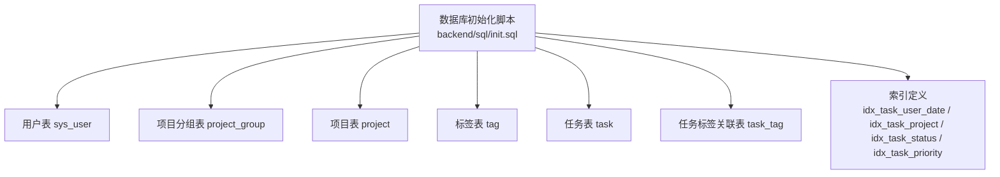
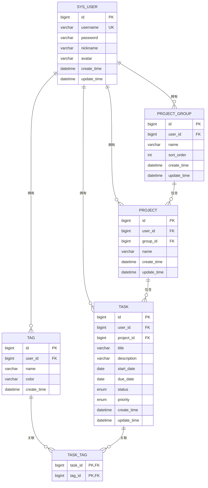
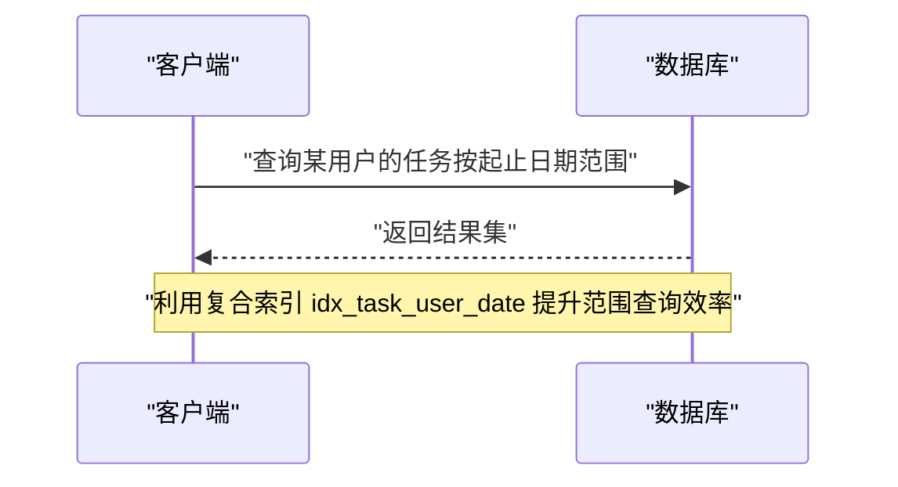
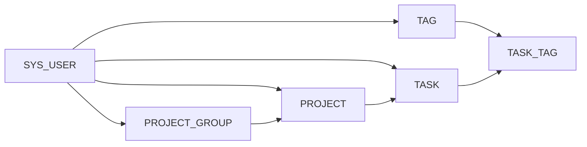

# 约束与索引

<cite>
**本文引用的文件**
- [init.sql](file://backend/sql/init.sql)
- [Task.java](file://backend/src/main/java/com/newworld/entity/Task.java)
- [Project.java](file://backend/src/main/java/com/newworld/entity/Project.java)
- [Tag.java](file://backend/src/main/java/com/newworld/entity/Tag.java)
- [User.java](file://backend/src/main/java/com/newworld/entity/User.java)
- [Group.java](file://backend/src/main/java/com/newworld/entity/Group.java)
</cite>

## 目录
1. [简介](#简介)
2. [项目结构](#项目结构)
3. [核心组件](#核心组件)
4. [架构总览](#架构总览)
5. [详细组件分析](#详细组件分析)
6. [依赖关系分析](#依赖关系分析)
7. [性能考量](#性能考量)
8. [故障排查指南](#故障排查指南)
9. [结论](#结论)
10. [附录](#附录)

## 简介
本文件面向“新世界”项目的数据库层，系统化梳理并解释数据库中使用的各类约束与索引设计。内容涵盖主键、外键、唯一性、非空与默认值约束的设计目的与业务意义，并结合现有索引（单列与复合索引）给出选择原则、使用效果分析与优化建议。目标是帮助开发者在理解业务需求的基础上，做出更合理的数据库设计与调优决策。

## 项目结构
数据库初始化脚本集中于后端 SQL 脚本文件，定义了用户、项目分组、项目、标签、任务及任务标签关联表的结构与约束；同时包含若干索引以支撑常见查询场景。实体类位于 Java 后端工程中，用于映射数据库表结构与字段。

**图示来源**
- [init.sql:1-94](file://backend/sql/init.sql#L1-L94)

**章节来源**
- [init.sql:1-94](file://backend/sql/init.sql#L1-L94)

## 核心组件
本节从约束与索引两个维度，逐表解析设计要点与业务意义。

- 主键约束（PRIMARY KEY）
  - 设计目的：唯一标识每条记录，确保行级不可重复。
  - 业务意义：用户、分组、项目、标签、任务及关联表均采用自增主键，保障业务对象的唯一性与可定位性。
  - 典型位置：各表的 id 字段均为主键。

- 外键约束（FOREIGN KEY）
  - 设计目的：保证参照完整性，防止悬挂引用。
  - 业务意义：项目分组与标签均通过 user_id 关联到用户；任务与项目、标签之间存在多处外键；任务标签关联表对 task 与 tag 均设置外键，配合联合主键实现多对多关系的稳定维护。
  - 删除策略：所有外键均配置级联删除，确保删除父记录时自动清理子记录，避免脏数据。

- 唯一性约束（UNIQUE）
  - 设计目的：限制字段取值唯一，避免重复。
  - 业务意义：用户名唯一，确保用户标识的唯一性与登录入口的确定性；其他唯一约束通常用于业务层面的唯一标识（例如业务编码），此处以用户名为例。

- 非空约束（NOT NULL）
  - 设计目的：强制关键字段必须有值，减少空值带来的歧义与异常。
  - 业务意义：用户名、密码、分组名称、项目名称等关键字段均设为非空，确保基础信息完整。

- 默认值约束（DEFAULT）
  - 设计目的：为字段提供缺省值，降低插入时的显式赋值负担。
  - 业务意义：时间戳字段普遍使用默认值，简化创建与更新流程；排序号等数值字段也采用默认值，便于初始状态的一致性。

- 索引设计
  - 单列索引：针对高频过滤字段建立索引，如按项目 ID 过滤任务、按状态或优先级筛选任务。
  - 复合索引：围绕常用查询条件组合建立复合索引，如按用户+开始日期+截止日期的复合索引，提升范围查询与排序效率。
  - 选择原则：综合查询频率、过滤效果（选择性）、维护成本（写入开销）与存储成本进行取舍。

**章节来源**
- [init.sql:8-94](file://backend/sql/init.sql#L8-L94)

## 架构总览
下图展示数据库层的表结构与约束关系，突出外键与索引在查询路径中的作用。

**图示来源**
- [init.sql:8-84](file://backend/sql/init.sql#L8-L84)

## 详细组件分析

### 用户表（sys_user）
- 约束要点
  - 主键：id 自增唯一。
  - 唯一性：username 唯一，确保用户标识唯一。
  - 非空：username、password 必填。
  - 默认值：时间戳字段使用默认值。
- 业务意义
  - 用户名唯一性是登录与权限控制的基础；密码字段非空且加密存储，保障账户安全。
- 索引影响
  - 该表主要通过主键访问，常规查询较少，无需额外索引。

**章节来源**
- [init.sql:9-17](file://backend/sql/init.sql#L9-L17)

### 项目分组表（project_group）
- 约束要点
  - 主键：id 自增唯一。
  - 外键：user_id 引用 sys_user(id)，删除时级联。
  - 非空：user_id、name 必填。
  - 默认值：时间戳字段使用默认值。
- 业务意义
  - 将项目按用户维度分组，支持多用户隔离与个性化排序。
- 索引影响
  - 常见按用户查询分组列表，可考虑在 user_id 上建立索引以提升查询效率。

**章节来源**
- [init.sql:19-28](file://backend/sql/init.sql#L19-L28)

### 项目表（project）
- 约束要点
  - 主键：id 自增唯一。
  - 外键：user_id 引用 sys_user(id)，group_id 引用 project_group(id)，删除时级联。
  - 非空：user_id、name 必填。
  - 默认值：时间戳字段使用默认值。
- 业务意义
  - 项目归属用户与分组，支持层级化组织与权限控制。
- 索引影响
  - 按用户与分组查询项目较为常见，可在 user_id 与 group_id 上分别建立索引。

**章节来源**
- [init.sql:30-41](file://backend/sql/init.sql#L30-L41)

### 标签表（tag）
- 约束要点
  - 主键：id 自增唯一。
  - 外键：user_id 引用 sys_user(id)，删除时级联。
  - 默认值：时间戳字段使用默认值。
- 业务意义
  - 为任务打标，支持多维筛选与统计。
- 索引影响
  - 按用户查询标签较为常见，可在 user_id 上建立索引。

**章节来源**
- [init.sql:62-75](file://backend/sql/init.sql#L62-L75)

### 任务表（task）
- 约束要点
  - 主键：id 自增唯一。
  - 外键：user_id 引用 sys_user(id)，project_id 引用 project(id)，删除时级联。
  - 非空：user_id、title 必填。
  - 默认值：时间戳字段使用默认值。
- 索引要点
  - 单列索引：按项目 ID、状态、优先级建立索引。
  - 复合索引：按用户+开始日期+截止日期建立复合索引，覆盖常见范围查询与排序。
- 业务意义
  - 任务是核心实体，承载计划、执行与统计功能；多字段索引直接服务于查询与报表场景。
- 查询路径示意

**图示来源**
- [init.sql:86-90](file://backend/sql/init.sql#L86-L90)

**章节来源**
- [init.sql:43-60](file://backend/sql/init.sql#L43-L60)
- [init.sql:86-90](file://backend/sql/init.sql#L86-L90)

### 任务标签关联表（task_tag）
- 约束要点
  - 联合主键：(task_id, tag_id)。
  - 外键：task_id 引用 task(id)，tag_id 引用 tag(id)，删除时级联。
- 业务意义
  - 实现任务与标签的多对多关系，支持灵活标注与检索。
- 索引影响
  - 联合主键已覆盖查询路径，通常无需额外索引。

**章节来源**
- [init.sql:77-84](file://backend/sql/init.sql#L77-L84)

## 依赖关系分析
- 表间依赖
  - 任务依赖用户与项目；项目依赖用户与分组；标签依赖用户；任务标签关联依赖任务与标签。
- 级联删除
  - 所有外键均配置删除级联，确保删除父记录时自动清理子记录，降低数据不一致风险。
- 索引依赖
  - 查询路径高度依赖现有索引，尤其是任务表的复合索引与单列索引，直接影响查询性能。

**图示来源**
- [init.sql:19-84](file://backend/sql/init.sql#L19-L84)

**章节来源**
- [init.sql:19-84](file://backend/sql/init.sql#L19-L84)

## 性能考量
- 索引选择原则
  - 查询频率：高频率过滤字段优先建索引。
  - 过滤效果：高选择性的字段（区分度高）更适合建索引。
  - 维护成本：索引会增加写入开销（插入/更新/删除），需权衡。
  - 存储成本：复合索引占用更多空间，应避免冗余。
- 现状评估
  - 已有单列索引覆盖项目、状态、优先级等高频过滤字段。
  - 复合索引覆盖用户+起止日期范围查询，有助于排序与范围扫描。
- 优化建议
  - 对 project_group 的 user_id 建立索引，提升按用户查询分组的效率。
  - 对 project 的 user_id 与 group_id 建立索引，提升按用户与分组查询项目的效率。
  - 对 tag 的 user_id 建立索引，提升按用户查询标签的效率。
  - 定期分析慢查询日志，结合执行计划评估索引使用情况，必要时调整索引组合。

[本节为通用性能指导，不直接分析具体文件]

## 故障排查指南
- 常见问题
  - 外键约束错误：插入或更新时提示违反外键约束，检查父记录是否存在、字段类型是否匹配。
  - 唯一性冲突：用户名重复导致插入失败，确认用户名唯一性约束。
  - 索引失效：查询未命中预期索引，检查查询条件是否与索引列顺序一致，避免在索引列上使用函数或隐式转换。
- 排查步骤
  - 使用 EXPLAIN 分析 SQL 执行计划，确认索引使用情况。
  - 检查数据字典，确认表结构与约束定义是否符合预期。
  - 结合业务场景验证索引选择是否合理，必要时调整索引或查询语句。

[本节为通用排查指导，不直接分析具体文件]

## 结论
本设计以“任务为中心”的业务模型为核心，通过主键、外键、唯一性、非空与默认值约束确保数据完整性与一致性；通过单列与复合索引覆盖高频查询场景，兼顾查询效率与维护成本。建议在现有基础上进一步完善分组、项目与标签的索引覆盖，并持续监控查询性能，动态优化索引策略。

[本节为总结性内容，不直接分析具体文件]

## 附录
- 实体类与数据库字段映射参考
  - 任务实体与任务表字段对应关系可用于校验索引与查询条件的合理性。
  - 项目实体与项目表字段对应关系可用于校验分组与项目查询的索引设计。
  - 标签实体与标签表字段对应关系可用于校验标签查询的索引设计。
  - 用户与分组实体与对应表字段对应关系可用于校验用户维度查询的索引设计。

**章节来源**
- [Task.java:1-200](file://backend/src/main/java/com/newworld/entity/Task.java#L1-L200)
- [Project.java:1-200](file://backend/src/main/java/com/newworld/entity/Project.java#L1-L200)
- [Tag.java:1-200](file://backend/src/main/java/com/newworld/entity/Tag.java#L1-L200)
- [User.java:1-200](file://backend/src/main/java/com/newworld/entity/User.java#L1-L200)
- [Group.java:1-200](file://backend/src/main/java/com/newworld/entity/Group.java#L1-L200)