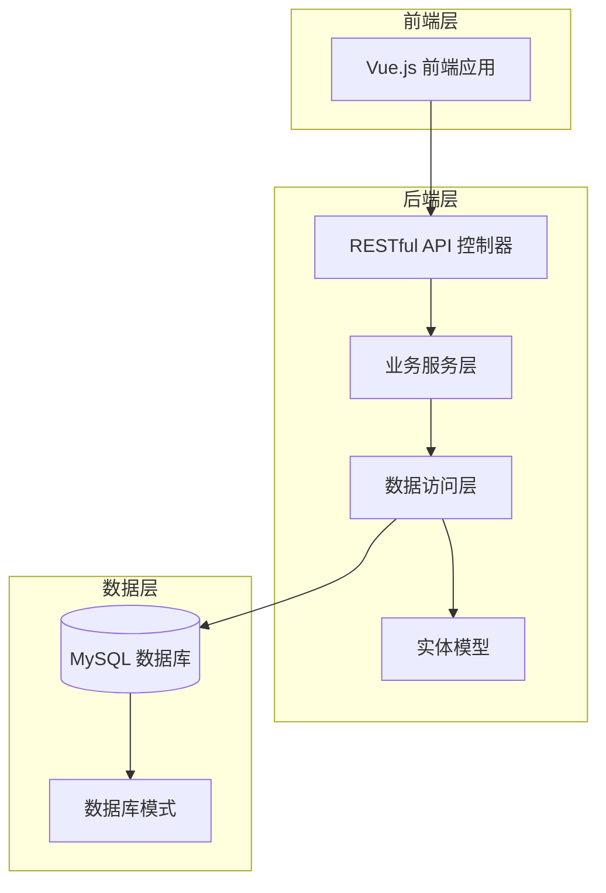
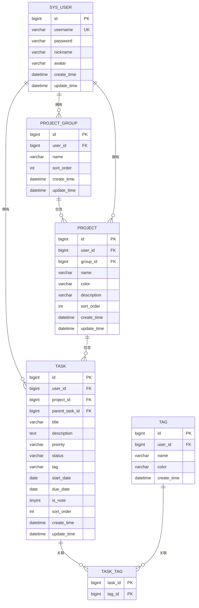
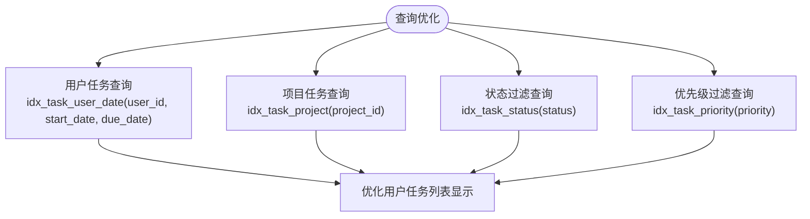
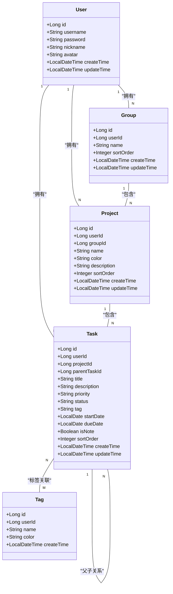
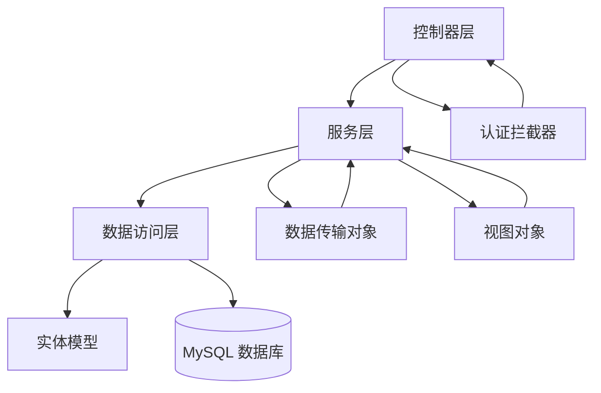

# 表关系设计

<cite>
**本文档引用的文件**
- [init.sql](file://backend/sql/init.sql)
- [User.java](file://backend/src/main/java/com/newworld/entity/User.java)
- [Group.java](file://backend/src/main/java/com/newworld/entity/Group.java)
- [Project.java](file://backend/src/main/java/com/newworld/entity/Project.java)
- [Task.java](file://backend/src/main/java/com/newworld/entity/Task.java)
- [Tag.java](file://backend/src/main/java/com/newworld/entity/Tag.java)
- [TaskQueryDTO.java](file://backend/src/main/java/com/newworld/dto/TaskQueryDTO.java)
- [TaskServiceImpl.java](file://backend/src/main/java/com/newworld/service/impl/TaskServiceImpl.java)
- [TaskController.java](file://backend/src/main/java/com/newworld/controller/TaskController.java)
- [ProjectController.java](file://backend/src/main/java/com/newworld/controller/ProjectController.java)
- [GroupController.java](file://backend/src/main/java/com/newworld/controller/GroupController.java)
- [TreeVO.java](file://backend/src/main/java/com/newworld/dto/TreeVO.java)
</cite>

## 目录
1. [简介](#简介)
2. [项目结构](#项目结构)
3. [核心组件](#核心组件)
4. [架构概览](#架构概览)
5. [详细组件分析](#详细组件分析)
6. [依赖分析](#依赖分析)
7. [性能考虑](#性能考虑)
8. [故障排除指南](#故障排除指南)
9. [结论](#结论)

## 简介

新世界项目是一个个人工作计划管理工具，采用MySQL数据库存储用户、项目、任务和标签等核心数据。本文档详细说明数据库中各个表之间的关系设计，包括一对一、一对多、多对多关系的实现方式，并重点解释关键的外键约束策略和自关联关系设计。

## 项目结构

项目采用典型的三层架构设计，包含以下主要模块：



**图表来源**
- [TaskController.java:1-112](file://backend/src/main/java/com/newworld/controller/TaskController.java#L1-L112)
- [ProjectController.java:1-51](file://backend/src/main/java/com/newworld/controller/ProjectController.java#L1-L51)
- [GroupController.java:1-59](file://backend/src/main/java/com/newworld/controller/GroupController.java#L1-L59)

**章节来源**
- [TaskController.java:1-112](file://backend/src/main/java/com/newworld/controller/TaskController.java#L1-L112)
- [ProjectController.java:1-51](file://backend/src/main/java/com/newworld/controller/ProjectController.java#L1-L51)
- [GroupController.java:1-59](file://backend/src/main/java/com/newworld/controller/GroupController.java#L1-L59)

## 核心组件

系统包含五个核心实体表，每个表都设计有完整的生命周期字段和索引优化：

### 用户表 (sys_user)
- 主键：id (BIGINT, 自增)
- 关键字段：username(唯一), password, nickname, avatar
- 时间字段：create_time, update_time
- 特点：支持唯一用户名约束，便于用户认证

### 项目分组表 (project_group)
- 主键：id (BIGINT, 自增)
- 外键：user_id → sys_user(id) (CASCADE 删除)
- 关键字段：name, sort_order
- 时间字段：create_time, update_time

### 项目表 (project)
- 主键：id (BIGINT, 自增)
- 外键：user_id → sys_user(id) (CASCADE 删除)
- 外键：group_id → project_group(id) (CASCADE 删除)
- 关键字段：name, color, description, sort_order

### 任务表 (task)
- 主键：id (BIGINT, 自增)
- 外键：user_id → sys_user(id) (CASCADE 删除)
- 外键：project_id → project(id) (SET NULL)
- 外键：parent_task_id → task(id) (SET NULL)
- 关键字段：title, description, priority, status, tag, dates
- 特殊字段：is_note (笔记标记), sort_order

### 标签表 (tag)
- 主键：id (BIGINT, 自增)
- 外键：user_id → sys_user(id) (CASCADE 删除)
- 关键字段：name, color

### 任务标签关联表 (task_tag)
- 复合主键：(task_id, tag_id)
- 外键：task_id → task(id) (CASCADE 删除)
- 外键：tag_id → tag(id) (CASCADE 删除)

**章节来源**
- [init.sql:8-95](file://backend/sql/init.sql#L8-L95)
- [User.java:1-95](file://backend/src/main/java/com/newworld/entity/User.java#L1-L95)
- [Group.java:1-84](file://backend/src/main/java/com/newworld/entity/Group.java#L1-L84)
- [Project.java:1-117](file://backend/src/main/java/com/newworld/entity/Project.java#L1-L117)
- [Task.java:1-184](file://backend/src/main/java/com/newworld/entity/Task.java#L1-L184)
- [Tag.java:1-72](file://backend/src/main/java/com/newworld/entity/Tag.java#L1-L72)

## 架构概览

系统采用清晰的层次化关系设计，体现了从用户到任务的完整数据流：



**图表来源**
- [init.sql:8-95](file://backend/sql/init.sql#L8-L95)

## 详细组件分析

### 关系设计详解

#### 一对一关系
系统中存在隐式的用户配置一对一关系：
- 每个用户对应其个人设置和偏好
- 通过user_id字段在相关表中体现一对一约束

#### 一对多关系

**用户 → 项目分组 (1:N)**
- 一个用户可以创建多个项目分组
- 分组表通过user_id外键关联到用户表
- 删除用户时自动删除其所有分组（CASCADE）

**用户 → 项目 (1:N)**
- 一个用户可以拥有多个项目
- 项目表通过user_id外键关联到用户表
- 删除用户时自动删除其所有项目（CASCADE）

**项目分组 → 项目 (1:N)**
- 一个分组可以包含多个项目
- 项目表通过group_id外键关联到分组表
- 删除分组时自动删除其所有项目（CASCADE）

**用户 → 任务 (1:N)**
- 一个用户可以创建多个任务
- 任务表通过user_id外键关联到用户表
- 删除用户时自动删除其所有任务（CASCADE）

#### 多对一关系

**任务 → 项目 (N:1)**
- 多个任务可以属于同一个项目
- 任务表通过project_id外键关联到项目表
- 删除项目时，任务的project_id被设置为NULL（SET NULL）
- 这种设计允许任务独立于项目存在，便于任务迁移和重新分类

**用户 → 任务 (N:1)**
- 多个任务可以由同一个用户创建
- 任务表通过user_id外键关联到用户表
- 删除用户时自动删除其所有任务（CASCADE）

#### 多对多关系

**任务 ↔ 标签 (M:N)**
- 一个任务可以有多个标签
- 一个标签可以应用于多个任务
- 通过task_tag中间表实现关联
- 删除任务或标签时，自动删除关联记录（CASCADE）

#### 自关联关系

**任务 → 任务 (N:N)**
- 任务可以有父任务，形成任务层级结构
- 任务表通过parent_task_id外键自关联
- 删除父任务时，子任务的parent_task_id被设置为NULL（SET NULL）
- 支持无限层级的任务组织，便于复杂项目的分解

### 外键约束策略选择

#### CASCADE 级联删除策略
适用于以下场景：
- 用户与其创建的所有数据（分组、项目、任务）应该同时删除
- 标签与其关联的任务关系应该同时清理
- 项目与其包含的任务关系应该同时维护

**选择原因：**
- 避免孤儿数据，保持数据完整性
- 简化业务逻辑，无需手动清理关联数据
- 符合用户视角的数据管理习惯

#### SET NULL 设置策略
适用于以下场景：
- 项目被删除时，任务仍需保留但需要移除项目归属
- 父任务被删除时，子任务仍需保留但需要移除层级关系

**选择原因：**
- 允许数据的灵活迁移和重组
- 保持任务的独立性和可恢复性
- 支持任务的重新分类和重新组织

### 索引设计

系统建立了多个复合索引以优化查询性能：



**图表来源**
- [init.sql:86-90](file://backend/sql/init.sql#L86-L90)

**章节来源**
- [init.sql:86-95](file://backend/sql/init.sql#L86-L95)

### SQL 查询示例

#### 复杂 JOIN 查询示例

**查询用户所有任务及其项目信息：**
```sql
SELECT t.*, p.name as project_name, p.color
FROM task t
LEFT JOIN project p ON t.project_id = p.id
WHERE t.user_id = ?
ORDER BY t.create_time DESC
```

**查询任务层级结构：**
```sql
SELECT t1.*, t2.title as parent_title
FROM task t1
LEFT JOIN task t2 ON t1.parent_task_id = t2.id
WHERE t1.user_id = ? AND t1.project_id = ?
ORDER BY t1.sort_order
```

**查询任务标签关联：**
```sql
SELECT t.*, tg.name as tag_name, tg.color
FROM task t
INNER JOIN task_tag tt ON t.id = tt.task_id
INNER JOIN tag tg ON tt.tag_id = tg.id
WHERE t.user_id = ?
```

### 数据模型类图



**图表来源**
- [User.java:1-95](file://backend/src/main/java/com/newworld/entity/User.java#L1-L95)
- [Group.java:1-84](file://backend/src/main/java/com/newworld/entity/Group.java#L1-L84)
- [Project.java:1-117](file://backend/src/main/java/com/newworld/entity/Project.java#L1-L117)
- [Task.java:1-184](file://backend/src/main/java/com/newworld/entity/Task.java#L1-L184)
- [Tag.java:1-72](file://backend/src/main/java/com/newworld/entity/Tag.java#L1-L72)

**章节来源**
- [User.java:1-95](file://backend/src/main/java/com/newworld/entity/User.java#L1-L95)
- [Group.java:1-84](file://backend/src/main/java/com/newworld/entity/Group.java#L1-L84)
- [Project.java:1-117](file://backend/src/main/java/com/newworld/entity/Project.java#L1-L117)
- [Task.java:1-184](file://backend/src/main/java/com/newworld/entity/Task.java#L1-L184)
- [Tag.java:1-72](file://backend/src/main/java/com/newworld/entity/Tag.java#L1-L72)

## 依赖分析

系统遵循清晰的依赖层次结构：



**图表来源**
- [TaskController.java:1-112](file://backend/src/main/java/com/newworld/controller/TaskController.java#L1-L112)
- [TaskServiceImpl.java:1-194](file://backend/src/main/java/com/newworld/service/impl/TaskServiceImpl.java#L1-L194)

### 组件耦合度分析

- **低耦合设计**：各层之间通过接口和抽象类解耦
- **高内聚实现**：每个包专注于特定功能领域
- **依赖注入**：通过Spring框架实现松散耦合

**章节来源**
- [TaskController.java:1-112](file://backend/src/main/java/com/newworld/controller/TaskController.java#L1-L112)
- [TaskServiceImpl.java:1-194](file://backend/src/main/java/com/newworld/service/impl/TaskServiceImpl.java#L1-L194)

## 性能考虑

### 查询优化策略

1. **索引优化**
   - 用户任务查询：复合索引(user_id, start_date, due_date)
   - 项目过滤：单列索引(project_id)
   - 状态过滤：单列索引(status)
   - 优先级过滤：单列索引(priority)

2. **分页查询**
   - 默认每页100条记录，避免大数据量一次性加载
   - 支持关键词搜索和条件过滤

3. **缓存策略**
   - 前端缓存常用数据
   - 后端查询结果缓存短期高频数据

### 扩展性设计

- 支持无限层级的任务组织
- 灵活的标签系统支持多标签组合
- 可扩展的状态和优先级枚举值

## 故障排除指南

### 常见问题及解决方案

**1. 外键约束冲突**
- 症状：删除用户时报外键约束错误
- 解决方案：使用CASCADE删除策略自动清理关联数据

**2. 任务层级丢失**
- 症状：父任务删除后子任务无法找到父级
- 解决方案：使用SET NULL策略保持子任务完整性

**3. 查询性能问题**
- 症状：大量任务查询响应缓慢
- 解决方案：利用现有索引优化查询条件

**4. 数据一致性问题**
- 症状：任务状态异常或重复
- 解决方案：通过业务层验证和事务控制保证数据一致性

**章节来源**
- [TaskServiceImpl.java:176-192](file://backend/src/main/java/com/newworld/service/impl/TaskServiceImpl.java#L176-L192)

## 结论

新世界项目的数据库设计体现了良好的关系规范化原则和实用的业务需求平衡。通过精心设计的外键约束策略、合理的索引优化和清晰的层次化关系，系统能够有效支持个人工作计划管理的核心功能。

关键设计亮点包括：
- 清晰的用户 → 分组 → 项目 → 任务的层级关系
- 灵活的任务标签多对多关联
- 智能的外键约束策略选择
- 完善的查询性能优化
- 可扩展的数据模型设计

这种设计既满足了当前的功能需求，又为未来的功能扩展和性能优化奠定了坚实基础。