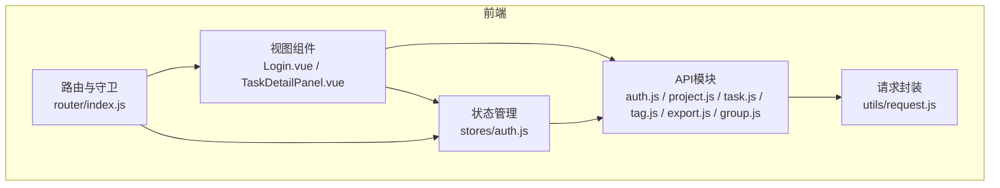
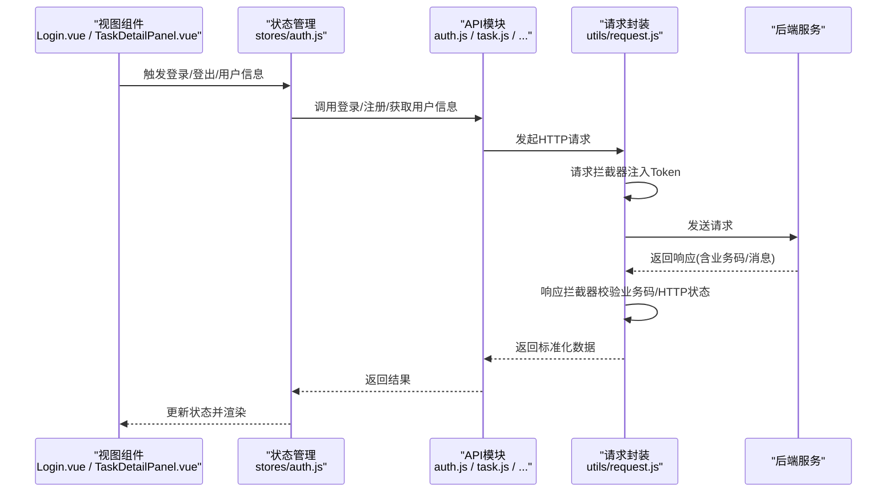
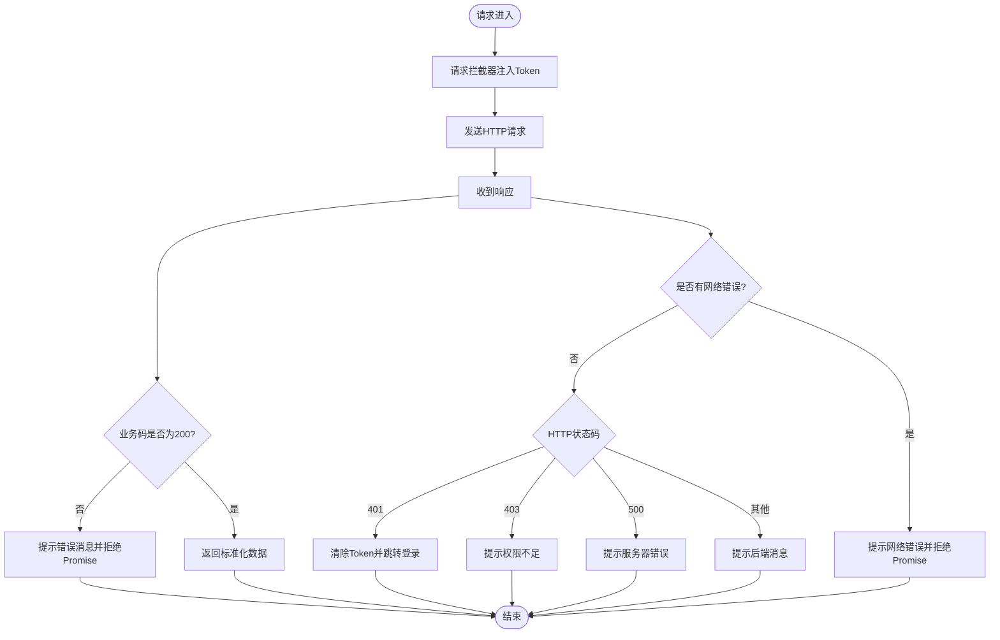
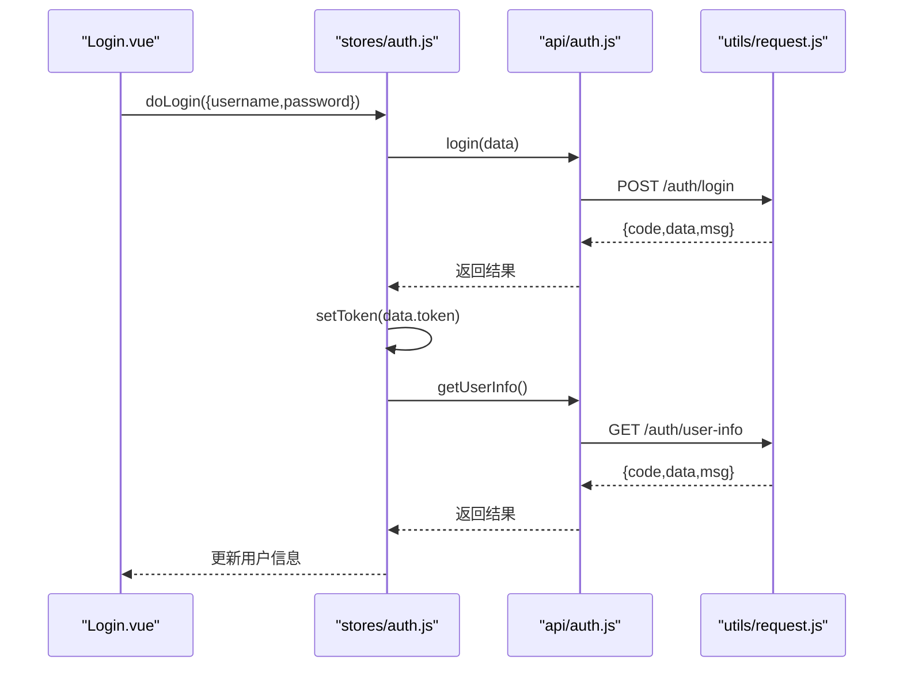
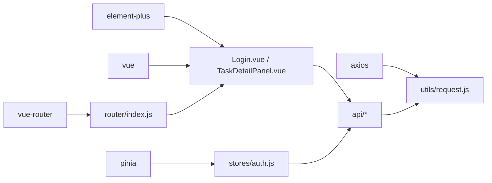

# API集成

<cite>
**本文引用的文件**
- [frontend/src/utils/request.js](file://frontend/src/utils/request.js)
- [frontend/src/api/auth.js](file://frontend/src/api/auth.js)
- [frontend/src/api/project.js](file://frontend/src/api/project.js)
- [frontend/src/api/task.js](file://frontend/src/api/task.js)
- [frontend/src/api/tag.js](file://frontend/src/api/tag.js)
- [frontend/src/api/export.js](file://frontend/src/api/export.js)
- [frontend/src/api/group.js](file://frontend/src/api/group.js)
- [frontend/src/stores/auth.js](file://frontend/src/stores/auth.js)
- [frontend/src/router/index.js](file://frontend/src/router/index.js)
- [frontend/src/views/Login.vue](file://frontend/src/views/Login.vue)
- [frontend/src/components/task/TaskDetailPanel.vue](file://frontend/src/components/task/TaskDetailPanel.vue)
- [frontend/package.json](file://frontend/package.json)
</cite>

## 目录
1. [简介](#简介)
2. [项目结构](#项目结构)
3. [核心组件](#核心组件)
4. [架构总览](#架构总览)
5. [详细组件分析](#详细组件分析)
6. [依赖分析](#依赖分析)
7. [性能考虑](#性能考虑)
8. [故障排查指南](#故障排查指南)
9. [结论](#结论)
10. [附录](#附录)

## 简介
本文件面向“新世界”项目的前端API集成，系统性说明HTTP请求封装与API服务模块设计，覆盖请求/响应拦截器、错误处理机制、接口模块化组织（认证、项目、任务、标签、导出等）、请求配置与响应处理（请求头、参数序列化、数据转换）、错误策略（网络、业务、用户友好提示）、最佳实践（请求去重、缓存、性能优化），并提供可直接落地的集成示例与调试方法。

## 项目结构
前端采用“请求封装层 + 模块化API层 + 状态管理 + 视图组件”的分层设计：
- 请求封装层：统一的HTTP客户端，内置拦截器与错误处理
- API层：按领域拆分的模块化接口（auth、project、task、tag、export、group）
- 状态管理：Pinia Store（如认证态、应用态）
- 路由与守卫：基于路由元信息控制鉴权
- 视图组件：通过API层发起请求，展示结果或触发交互

图表来源
- [frontend/src/views/Login.vue:1-203](file://frontend/src/views/Login.vue#L1-L203)
- [frontend/src/components/task/TaskDetailPanel.vue:1-169](file://frontend/src/components/task/TaskDetailPanel.vue#L1-L169)
- [frontend/src/stores/auth.js:1-41](file://frontend/src/stores/auth.js#L1-L41)
- [frontend/src/router/index.js:1-50](file://frontend/src/router/index.js#L1-L50)
- [frontend/src/api/auth.js:1-14](file://frontend/src/api/auth.js#L1-L14)
- [frontend/src/api/project.js:1-18](file://frontend/src/api/project.js#L1-L18)
- [frontend/src/api/task.js:1-54](file://frontend/src/api/task.js#L1-L54)
- [frontend/src/api/tag.js:1-14](file://frontend/src/api/tag.js#L1-L14)
- [frontend/src/api/export.js:1-6](file://frontend/src/api/export.js#L1-L6)
- [frontend/src/api/group.js:1-22](file://frontend/src/api/group.js#L1-L22)
- [frontend/src/utils/request.js:1-56](file://frontend/src/utils/request.js#L1-L56)

章节来源
- [frontend/src/utils/request.js:1-56](file://frontend/src/utils/request.js#L1-L56)
- [frontend/src/api/auth.js:1-14](file://frontend/src/api/auth.js#L1-L14)
- [frontend/src/api/project.js:1-18](file://frontend/src/api/project.js#L1-L18)
- [frontend/src/api/task.js:1-54](file://frontend/src/api/task.js#L1-L54)
- [frontend/src/api/tag.js:1-14](file://frontend/src/api/tag.js#L1-L14)
- [frontend/src/api/export.js:1-6](file://frontend/src/api/export.js#L1-L6)
- [frontend/src/api/group.js:1-22](file://frontend/src/api/group.js#L1-L22)
- [frontend/src/stores/auth.js:1-41](file://frontend/src/stores/auth.js#L1-L41)
- [frontend/src/router/index.js:1-50](file://frontend/src/router/index.js#L1-L50)
- [frontend/src/views/Login.vue:1-203](file://frontend/src/views/Login.vue#L1-L203)
- [frontend/src/components/task/TaskDetailPanel.vue:1-169](file://frontend/src/components/task/TaskDetailPanel.vue#L1-L169)
- [frontend/package.json:1-30](file://frontend/package.json#L1-L30)

## 核心组件
- 请求封装（utils/request.js）
  - 创建Axios实例，设置基础路径与超时
  - 请求拦截器：从本地存储注入认证令牌到请求头
  - 响应拦截器：统一校验业务码；对不同HTTP状态码做用户友好提示；网络异常统一提示
- API模块（frontend/src/api/*）
  - 认证模块：登录、注册、获取用户信息
  - 项目模块：列表、创建、更新、删除
  - 任务模块：列表、详情、创建、更新、删除、状态/优先级变更、复制、归档、转记事、分享链接、搜索、统计
  - 标签模块：列表、创建、删除
  - 导出模块：任务导出（二进制）
  - 分组模块：列表、树形结构、创建、更新、删除
- 状态管理（stores/auth.js）
  - 维护token与用户信息，提供登录、注册、拉取用户信息、登出能力
- 路由与守卫（router/index.js）
  - 基于meta.requiresAuth控制是否需要登录；登录页与已登录页互斥跳转
- 视图组件（Login.vue、TaskDetailPanel.vue）
  - 登录表单提交触发认证流程
  - 任务详情面板通过API获取任务详情并渲染

章节来源
- [frontend/src/utils/request.js:1-56](file://frontend/src/utils/request.js#L1-L56)
- [frontend/src/api/auth.js:1-14](file://frontend/src/api/auth.js#L1-L14)
- [frontend/src/api/project.js:1-18](file://frontend/src/api/project.js#L1-L18)
- [frontend/src/api/task.js:1-54](file://frontend/src/api/task.js#L1-L54)
- [frontend/src/api/tag.js:1-14](file://frontend/src/api/tag.js#L1-L14)
- [frontend/src/api/export.js:1-6](file://frontend/src/api/export.js#L1-L6)
- [frontend/src/api/group.js:1-22](file://frontend/src/api/group.js#L1-L22)
- [frontend/src/stores/auth.js:1-41](file://frontend/src/stores/auth.js#L1-L41)
- [frontend/src/router/index.js:1-50](file://frontend/src/router/index.js#L1-L50)
- [frontend/src/views/Login.vue:1-203](file://frontend/src/views/Login.vue#L1-L203)
- [frontend/src/components/task/TaskDetailPanel.vue:1-169](file://frontend/src/components/task/TaskDetailPanel.vue#L1-L169)

## 架构总览
下图展示了从前端组件到API模块再到请求封装的整体调用链路，以及鉴权与错误处理的关键节点。

图表来源
- [frontend/src/views/Login.vue:1-203](file://frontend/src/views/Login.vue#L1-L203)
- [frontend/src/components/task/TaskDetailPanel.vue:1-169](file://frontend/src/components/task/TaskDetailPanel.vue#L1-L169)
- [frontend/src/stores/auth.js:1-41](file://frontend/src/stores/auth.js#L1-L41)
- [frontend/src/api/auth.js:1-14](file://frontend/src/api/auth.js#L1-L14)
- [frontend/src/api/task.js:1-54](file://frontend/src/api/task.js#L1-L54)
- [frontend/src/utils/request.js:1-56](file://frontend/src/utils/request.js#L1-L56)

## 详细组件分析

### 请求封装与拦截器
- Axios实例配置
  - 基础路径：/api
  - 超时：30秒
- 请求拦截器
  - 从localStorage读取token并在请求头添加Authorization: Bearer ...
- 响应拦截器
  - 业务码校验：非200时统一提示并拒绝Promise
  - HTTP状态处理：401清空token并跳转登录；403提示权限不足；500提示服务器错误；其他状态按后端返回消息提示
  - 网络异常：提示网络错误

图表来源
- [frontend/src/utils/request.js:1-56](file://frontend/src/utils/request.js#L1-L56)

章节来源
- [frontend/src/utils/request.js:1-56](file://frontend/src/utils/request.js#L1-L56)

### 认证接口模块（auth）
- 接口职责
  - 登录：提交用户名/密码获取token
  - 注册：提交用户名/密码
  - 获取用户信息：携带token获取当前用户
- 使用方式
  - 在登录页通过store触发登录，成功后持久化token并拉取用户信息
  - 在路由守卫中读取token决定页面跳转

图表来源
- [frontend/src/views/Login.vue:1-203](file://frontend/src/views/Login.vue#L1-L203)
- [frontend/src/stores/auth.js:1-41](file://frontend/src/stores/auth.js#L1-L41)
- [frontend/src/api/auth.js:1-14](file://frontend/src/api/auth.js#L1-L14)
- [frontend/src/utils/request.js:1-56](file://frontend/src/utils/request.js#L1-L56)

章节来源
- [frontend/src/api/auth.js:1-14](file://frontend/src/api/auth.js#L1-L14)
- [frontend/src/stores/auth.js:1-41](file://frontend/src/stores/auth.js#L1-L41)
- [frontend/src/router/index.js:1-50](file://frontend/src/router/index.js#L1-L50)
- [frontend/src/views/Login.vue:1-203](file://frontend/src/views/Login.vue#L1-L203)

### 项目接口模块（project）
- 接口职责
  - 获取项目列表（支持按分组过滤）
  - 创建/更新/删除项目
- 参数与序列化
  - 列表查询通过params传参
  - 新增/更新通过请求体传参

章节来源
- [frontend/src/api/project.js:1-18](file://frontend/src/api/project.js#L1-L18)

### 任务接口模块（task）
- 接口职责
  - 列表查询、按ID查询、创建、更新、删除
  - 状态变更、优先级变更、复制、归档、转记事
  - 分享链接生成、关键词搜索、统计信息
- 参数与序列化
  - 多数接口使用params传递查询条件
  - 部分PUT接口向后端发送JSON对象（如状态、优先级）

章节来源
- [frontend/src/api/task.js:1-54](file://frontend/src/api/task.js#L1-L54)

### 标签接口模块（tag）
- 接口职责
  - 获取标签列表、创建标签、删除标签

章节来源
- [frontend/src/api/tag.js:1-14](file://frontend/src/api/tag.js#L1-L14)

### 导出接口模块（export）
- 接口职责
  - 任务导出（responseType: blob）
- 注意事项
  - 二进制响应需正确处理下载

章节来源
- [frontend/src/api/export.js:1-6](file://frontend/src/api/export.js#L1-L6)

### 分组接口模块（group）
- 接口职责
  - 获取列表、树形结构、创建、更新、删除

章节来源
- [frontend/src/api/group.js:1-22](file://frontend/src/api/group.js#L1-L22)

### 错误处理策略
- 业务错误
  - 后端返回非200时，统一提示消息并中断后续流程
- 网络错误
  - 未捕获到response时提示网络错误
- 权限与会话
  - 401自动清理token并跳转登录页
  - 403提示权限不足
  - 500提示服务器错误

章节来源
- [frontend/src/utils/request.js:1-56](file://frontend/src/utils/request.js#L1-L56)

### 请求配置与响应处理
- 请求头
  - 自动注入Authorization: Bearer <token>
- 参数序列化
  - 查询参数通过params传入
  - 请求体通过data传入
- 数据转换
  - 响应拦截器统一返回后端标准化数据结构

章节来源
- [frontend/src/utils/request.js:1-56](file://frontend/src/utils/request.js#L1-L56)
- [frontend/src/api/project.js:1-18](file://frontend/src/api/project.js#L1-L18)
- [frontend/src/api/task.js:1-54](file://frontend/src/api/task.js#L1-L54)
- [frontend/src/api/export.js:1-6](file://frontend/src/api/export.js#L1-L6)

### 最佳实践
- 请求去重
  - 可结合业务场景引入请求去重策略（例如基于URL+参数的唯一键）避免重复请求
- 缓存策略
  - 对只读列表/静态数据可采用内存缓存；对实时数据建议短时缓存并配合失效策略
- 性能优化
  - 合理设置超时与重试
  - 对高频请求合并或节流
  - 仅在必要时刷新全局状态，减少不必要的UI重渲染
- 用户体验
  - 在关键操作前显示加载态，完成后提示成功/失败
  - 对401场景提供一键跳转登录入口

[本节为通用指导，无需特定文件引用]

## 依赖分析
- 外部依赖
  - axios：HTTP客户端
  - element-plus：UI与消息提示
  - vue、vue-router、pinia：前端框架与状态管理
- 内部依赖关系
  - API模块依赖请求封装
  - 视图组件依赖API模块与状态管理
  - 路由守卫依赖localStorage中的token

图表来源
- [frontend/package.json:1-30](file://frontend/package.json#L1-L30)
- [frontend/src/utils/request.js:1-56](file://frontend/src/utils/request.js#L1-L56)
- [frontend/src/api/auth.js:1-14](file://frontend/src/api/auth.js#L1-L14)
- [frontend/src/api/project.js:1-18](file://frontend/src/api/project.js#L1-L18)
- [frontend/src/api/task.js:1-54](file://frontend/src/api/task.js#L1-L54)
- [frontend/src/api/tag.js:1-14](file://frontend/src/api/tag.js#L1-L14)
- [frontend/src/api/export.js:1-6](file://frontend/src/api/export.js#L1-L6)
- [frontend/src/api/group.js:1-22](file://frontend/src/api/group.js#L1-L22)
- [frontend/src/stores/auth.js:1-41](file://frontend/src/stores/auth.js#L1-L41)
- [frontend/src/router/index.js:1-50](file://frontend/src/router/index.js#L1-L50)
- [frontend/src/views/Login.vue:1-203](file://frontend/src/views/Login.vue#L1-L203)
- [frontend/src/components/task/TaskDetailPanel.vue:1-169](file://frontend/src/components/task/TaskDetailPanel.vue#L1-L169)

章节来源
- [frontend/package.json:1-30](file://frontend/package.json#L1-L30)

## 性能考虑
- 合理设置超时与重试次数，避免长时间阻塞UI
- 对高频只读接口启用短时缓存，降低后端压力
- 控制并发请求数量，避免雪崩效应
- 对大体积导出接口（如任务导出）注意分页与进度提示

[本节为通用指导，无需特定文件引用]

## 故障排查指南
- 登录后立即跳转登录
  - 检查401分支逻辑是否被触发（可能token无效或过期）
  - 确认请求拦截器是否正确注入Authorization头
- 提示“请求失败”
  - 检查后端返回的业务码是否为200
  - 查看响应拦截器对msg字段的处理
- 网络错误
  - 确认基础路径/baseURL是否正确
  - 检查跨域与代理配置
- 导出失败
  - 确认responseType为blob且后端返回二进制流

章节来源
- [frontend/src/utils/request.js:1-56](file://frontend/src/utils/request.js#L1-L56)
- [frontend/src/api/export.js:1-6](file://frontend/src/api/export.js#L1-L6)

## 结论
本API集成方案通过统一的请求封装与模块化的API设计，实现了清晰的职责分离与一致的错误处理体验。配合Pinia状态管理与路由守卫，能够快速构建安全、稳定、易维护的前端功能。建议在实际开发中进一步完善请求去重、缓存与性能监控，持续提升用户体验与系统稳定性。

## 附录

### API集成示例（步骤说明）
- 登录流程
  - 在登录页收集用户名/密码
  - 调用认证store的登录方法，内部调用登录API
  - 成功后持久化token并拉取用户信息
  - 跳转首页
- 获取任务详情
  - 在任务详情面板中根据任务ID调用任务详情API
  - 将返回数据渲染到面板
- 导出任务
  - 调用导出API，指定params并设置responseType为blob
  - 使用浏览器下载二进制响应

章节来源
- [frontend/src/views/Login.vue:1-203](file://frontend/src/views/Login.vue#L1-L203)
- [frontend/src/stores/auth.js:1-41](file://frontend/src/stores/auth.js#L1-L41)
- [frontend/src/api/task.js:1-54](file://frontend/src/api/task.js#L1-L54)
- [frontend/src/api/export.js:1-6](file://frontend/src/api/export.js#L1-L6)

### 调试方法
- 浏览器开发者工具
  - Network：观察请求头（Authorization）、响应体（code/msg/data）、状态码
  - Console：查看拦截器抛出的错误与提示
- 本地存储
  - 检查localStorage中的token是否存在与有效
- 日志与断点
  - 在请求拦截器与响应拦截器中设置断点，定位问题发生点

章节来源
- [frontend/src/utils/request.js:1-56](file://frontend/src/utils/request.js#L1-L56)
- [frontend/src/router/index.js:1-50](file://frontend/src/router/index.js#L1-L50)