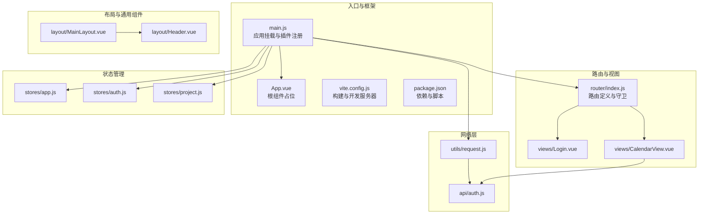
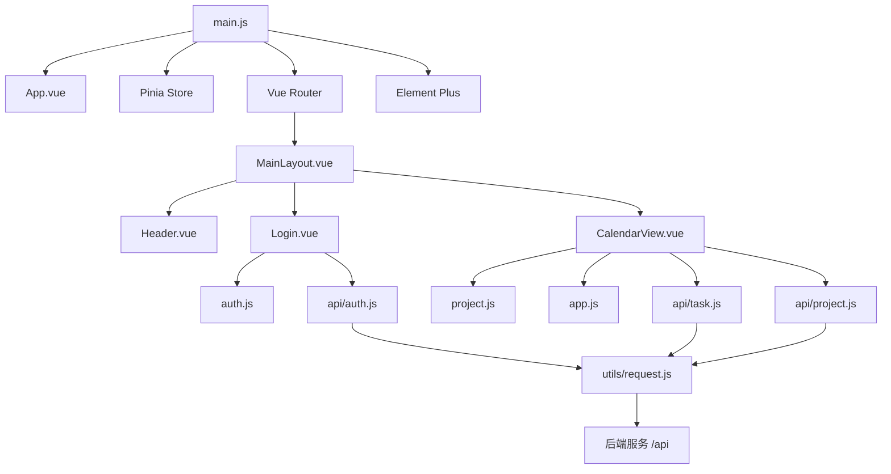
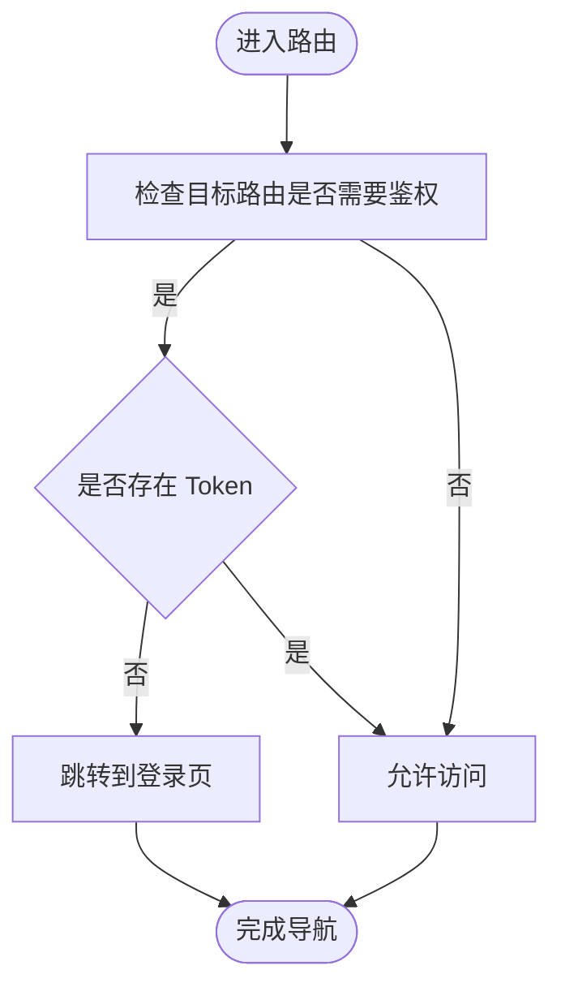
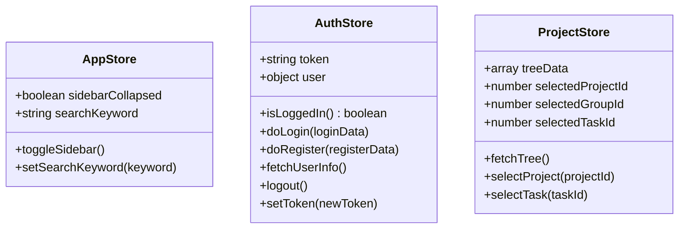
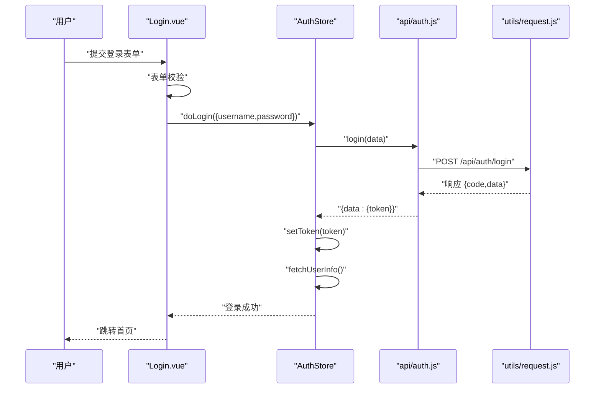
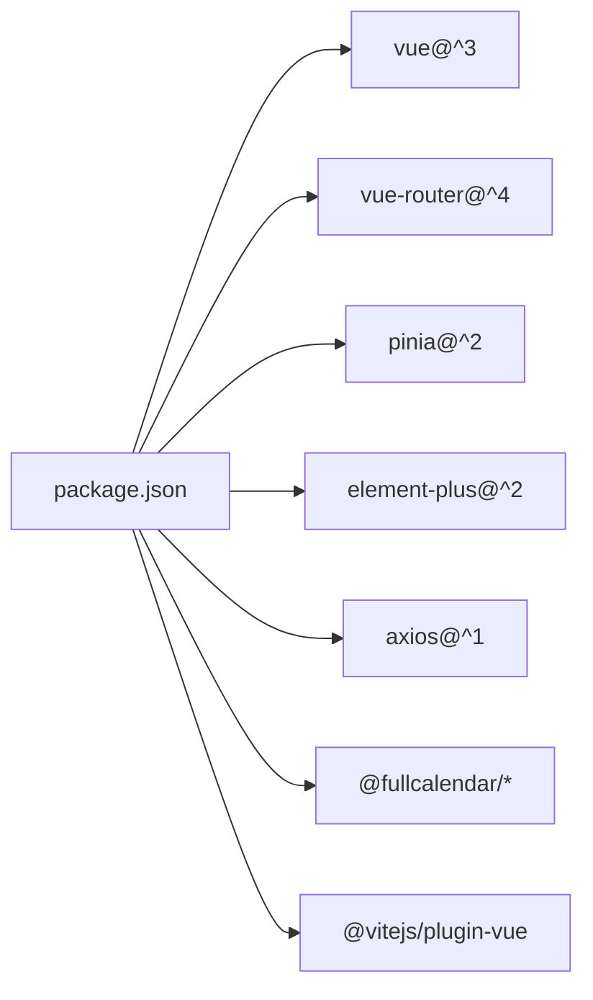

# 前端架构

<cite>
**本文引用的文件**
- [main.js](file://frontend/src/main.js)
- [App.vue](file://frontend/src/App.vue)
- [vite.config.js](file://frontend/vite.config.js)
- [package.json](file://frontend/package.json)
- [router/index.js](file://frontend/src/router/index.js)
- [layout/MainLayout.vue](file://frontend/src/layout/MainLayout.vue)
- [layout/Header.vue](file://frontend/src/layout/Header.vue)
- [stores/app.js](file://frontend/src/stores/app.js)
- [stores/auth.js](file://frontend/src/stores/auth.js)
- [stores/project.js](file://frontend/src/stores/project.js)
- [utils/request.js](file://frontend/src/utils/request.js)
- [api/auth.js](file://frontend/src/api/auth.js)
- [views/Login.vue](file://frontend/src/views/Login.vue)
- [views/CalendarView.vue](file://frontend/src/views/CalendarView.vue)
</cite>

## 目录
1. [引言](#引言)
2. [项目结构](#项目结构)
3. [核心组件](#核心组件)
4. [架构总览](#架构总览)
5. [详细组件分析](#详细组件分析)
6. [依赖分析](#依赖分析)
7. [性能考虑](#性能考虑)
8. [故障排查指南](#故障排查指南)
9. [结论](#结论)
10. [附录](#附录)

## 引言
本文件面向“新世界”项目的前端团队与相关干系人，系统性梳理基于 Vue 3 的单页应用（SPA）架构设计，涵盖组件化与模块化组织方式、Composition API 使用模式、Pinia 状态管理、路由系统、构建工具 Vite 配置与优化策略，以及组件通信模式。文档同时提供架构图与组件关系图，帮助读者快速把握前端各模块的组织结构与交互关系。

## 项目结构
前端采用以功能域为中心的目录组织方式：按页面视图、布局组件、状态仓库、路由、API 封装与工具库划分模块，便于扩展与维护。

图表来源
- [main.js:1-22](file://frontend/src/main.js#L1-L22)
- [App.vue:1-16](file://frontend/src/App.vue#L1-L16)
- [vite.config.js:1-26](file://frontend/vite.config.js#L1-L26)
- [package.json:1-30](file://frontend/package.json#L1-L30)
- [router/index.js:1-50](file://frontend/src/router/index.js#L1-L50)
- [layout/MainLayout.vue:1-39](file://frontend/src/layout/MainLayout.vue#L1-L39)
- [layout/Header.vue:1-87](file://frontend/src/layout/Header.vue#L1-L87)
- [stores/app.js:1-18](file://frontend/src/stores/app.js#L1-L18)
- [stores/auth.js:1-41](file://frontend/src/stores/auth.js#L1-L41)
- [stores/project.js:1-26](file://frontend/src/stores/project.js#L1-L26)
- [utils/request.js:1-56](file://frontend/src/utils/request.js#L1-L56)
- [api/auth.js:1-14](file://frontend/src/api/auth.js#L1-L14)

章节来源
- [main.js:1-22](file://frontend/src/main.js#L1-L22)
- [vite.config.js:1-26](file://frontend/vite.config.js#L1-L26)
- [package.json:1-30](file://frontend/package.json#L1-L30)

## 核心组件
- 应用入口与插件注册：在入口文件中完成 Vue 实例创建、Pinia、路由、Element Plus 国际化与全局样式的挂载，统一注册图标组件，保证运行时环境初始化完整。
- 根组件：通过路由出口承载页面切换。
- 构建与开发：Vite 提供开发服务器、代理与构建输出配置，支持路径别名与 API 代理到后端服务。
- 路由系统：定义登录页与主布局嵌套路由，设置导航守卫实现鉴权控制。
- 布局组件：主布局容器包含侧边栏与内容区；头部组件提供搜索、导航与用户下拉菜单。
- 状态管理：三个 Store 分别负责应用态（侧边栏、搜索）、认证态（token、用户信息、登录/注册/登出）、项目树与选中项。
- 网络层：Axios 实例封装请求与响应拦截器，统注 Token 与错误处理。
- 视图组件：登录页与日历视图，前者负责用户认证流程，后者集成 FullCalendar 完成任务可视化与交互。

章节来源
- [main.js:1-22](file://frontend/src/main.js#L1-L22)
- [App.vue:1-16](file://frontend/src/App.vue#L1-L16)
- [vite.config.js:1-26](file://frontend/vite.config.js#L1-L26)
- [router/index.js:1-50](file://frontend/src/router/index.js#L1-L50)
- [layout/MainLayout.vue:1-39](file://frontend/src/layout/MainLayout.vue#L1-L39)
- [layout/Header.vue:1-87](file://frontend/src/layout/Header.vue#L1-L87)
- [stores/app.js:1-18](file://frontend/src/stores/app.js#L1-L18)
- [stores/auth.js:1-41](file://frontend/src/stores/auth.js#L1-L41)
- [stores/project.js:1-26](file://frontend/src/stores/project.js#L1-L26)
- [utils/request.js:1-56](file://frontend/src/utils/request.js#L1-L56)
- [api/auth.js:1-14](file://frontend/src/api/auth.js#L1-L14)
- [views/Login.vue:1-203](file://frontend/src/views/Login.vue#L1-L203)
- [views/CalendarView.vue:1-451](file://frontend/src/views/CalendarView.vue#L1-L451)

## 架构总览
下图展示了前端从入口到视图、状态与网络层的整体交互关系。

图表来源
- [main.js:1-22](file://frontend/src/main.js#L1-L22)
- [App.vue:1-16](file://frontend/src/App.vue#L1-L16)
- [router/index.js:1-50](file://frontend/src/router/index.js#L1-L50)
- [layout/MainLayout.vue:1-39](file://frontend/src/layout/MainLayout.vue#L1-L39)
- [layout/Header.vue:1-87](file://frontend/src/layout/Header.vue#L1-L87)
- [stores/auth.js:1-41](file://frontend/src/stores/auth.js#L1-L41)
- [stores/project.js:1-26](file://frontend/src/stores/project.js#L1-L26)
- [stores/app.js:1-18](file://frontend/src/stores/app.js#L1-L18)
- [utils/request.js:1-56](file://frontend/src/utils/request.js#L1-L56)
- [api/auth.js:1-14](file://frontend/src/api/auth.js#L1-L14)

## 详细组件分析

### 应用入口与插件注册
- 初始化顺序：创建应用实例 → 注册 Element Plus 及中文语言包 → 注册图标组件 → 挂载 Pinia 与路由 → 挂载根节点。
- 全局样式：引入全局样式文件，确保主题与基础样式一致。
- 插件生态：Vue 3 + Vue Router + Pinia + Element Plus，形成完整的前端技术栈。

章节来源
- [main.js:1-22](file://frontend/src/main.js#L1-L22)

### 根组件与路由出口
- 根组件仅包含路由出口，页面切换由路由驱动。
- 主布局作为默认子路由的容器，承载侧边栏与内容区域。

章节来源
- [App.vue:1-16](file://frontend/src/App.vue#L1-L16)
- [router/index.js:1-50](file://frontend/src/router/index.js#L1-L50)
- [layout/MainLayout.vue:1-39](file://frontend/src/layout/MainLayout.vue#L1-L39)

### 路由系统与导航守卫
- 路由配置：
  - 登录页：独立路由，无需鉴权。
  - 主布局：根路径重定向至日历视图，包含日历与项目两个子路由。
- 导航守卫：
  - 未登录访问受保护路由跳转登录页。
  - 已登录访问登录页跳转首页。
  - 登录页与受保护路由互斥。

图表来源
- [router/index.js:37-47](file://frontend/src/router/index.js#L37-L47)

章节来源
- [router/index.js:1-50](file://frontend/src/router/index.js#L1-L50)

### 布局与头部组件
- 主布局：左侧侧边栏、右侧内容区，内容区包含头部与路由出口。
- 头部组件：
  - 侧边栏折叠切换：通过应用 Store 切换状态。
  - 全局搜索：输入关键词后向窗口派发搜索事件，日历视图监听并执行搜索。
  - 导航与用户操作：跳转到日历/项目视图，下拉菜单触发登出并返回登录页。

章节来源
- [layout/MainLayout.vue:1-39](file://frontend/src/layout/MainLayout.vue#L1-L39)
- [layout/Header.vue:1-87](file://frontend/src/layout/Header.vue#L1-L87)
- [stores/app.js:1-18](file://frontend/src/stores/app.js#L1-L18)
- [stores/auth.js:1-41](file://frontend/src/stores/auth.js#L1-L41)

### 状态管理（Pinia）
- 设计原则：
  - 单一职责：每个 Store 聚焦一个领域（应用态、认证态、项目态）。
  - 组合式函数风格：使用 defineStore 返回响应式数据与方法，便于在组件中直接解构使用。
  - 数据持久化：认证 Token 写入本地存储，应用态如侧边栏折叠状态可按需持久化。
- 认证 Store：
  - 状态：token、user。
  - 方法：登录、注册、获取用户信息、登出、设置 Token。
  - 与网络层协作：调用 API 层，统一写入本地存储。
- 应用 Store：
  - 状态：侧边栏折叠、搜索关键词。
  - 方法：切换侧边栏、设置搜索关键词。
- 项目 Store：
  - 状态：树形数据、选中的项目/分组/任务 ID。
  - 方法：加载树、选择项目/任务。

图表来源
- [stores/app.js:1-18](file://frontend/src/stores/app.js#L1-L18)
- [stores/auth.js:1-41](file://frontend/src/stores/auth.js#L1-L41)
- [stores/project.js:1-26](file://frontend/src/stores/project.js#L1-L26)

章节来源
- [stores/app.js:1-18](file://frontend/src/stores/app.js#L1-L18)
- [stores/auth.js:1-41](file://frontend/src/stores/auth.js#L1-L41)
- [stores/project.js:1-26](file://frontend/src/stores/project.js#L1-L26)

### 组件通信模式
- Props 传递：父组件向子组件传递只读数据或回调函数，保持单向数据流。
- 事件发射：子组件通过 emit 向父组件传递变更或用户行为，避免跨层级耦合。
- provide/inject：适用于跨多层级共享的上下文（如主题、用户信息），但当前代码未见显式使用，建议在需要深度共享时采用该模式。
- 日历视图与头部的事件通信：头部通过自定义事件向窗口广播搜索关键词，日历视图监听并在渲染前过滤事件源数据。

章节来源
- [layout/Header.vue:55-59](file://frontend/src/layout/Header.vue#L55-L59)
- [views/CalendarView.vue:400-409](file://frontend/src/views/CalendarView.vue#L400-L409)

### 网络层与 API 封装
- Axios 实例：
  - 基础地址：/api，超时时间 30 秒。
  - 请求拦截：自动注入 Authorization 头（若存在 Token）。
  - 响应拦截：统一校验 code 字段，非 200 统一弹窗提示；401 自动清空 Token 并跳转登录页；其他错误分类处理。
- API 层：
  - 认证相关：登录、注册、获取用户信息。
  - 日历视图依赖的任务与项目 API 在日历组件内按需导入，降低初始包体体积。

章节来源
- [utils/request.js:1-56](file://frontend/src/utils/request.js#L1-L56)
- [api/auth.js:1-14](file://frontend/src/api/auth.js#L1-L14)
- [views/CalendarView.vue:123-124](file://frontend/src/views/CalendarView.vue#L123-L124)

### 视图组件与交互
- 登录页：
  - 表单验证：基于 Element Plus 表单规则，支持注册模式下的二次密码校验。
  - 登录/注册流程：调用认证 Store，成功后提示并跳转首页。
- 日历视图：
  - 集成 FullCalendar：支持日期点击新建任务、拖拽调整时间、右键菜单批量操作（优先级、状态、复制、归档、转换为笔记、编辑、删除）。
  - 项目筛选：根据路由查询参数过滤日历事件。
  - 搜索联动：接收窗口搜索事件，按关键词检索并刷新日历。

图表来源
- [views/Login.vue:125-157](file://frontend/src/views/Login.vue#L125-L157)
- [stores/auth.js:16-31](file://frontend/src/stores/auth.js#L16-L31)
- [api/auth.js:3-5](file://frontend/src/api/auth.js#L3-L5)
- [utils/request.js:22-30](file://frontend/src/utils/request.js#L22-L30)

章节来源
- [views/Login.vue:1-203](file://frontend/src/views/Login.vue#L1-L203)
- [views/CalendarView.vue:1-451](file://frontend/src/views/CalendarView.vue#L1-L451)

## 依赖分析
- 运行时依赖：Vue 3、Vue Router、Pinia、Element Plus、Axios、FullCalendar 生态等。
- 开发依赖：Vite、@vitejs/plugin-vue。
- 依赖关系：入口文件集中注册插件；路由与视图组件依赖状态与网络层；视图组件之间通过事件与路由进行解耦协作。

图表来源
- [package.json:11-28](file://frontend/package.json#L11-L28)

章节来源
- [package.json:1-30](file://frontend/package.json#L1-L30)

## 性能考虑
- 代码分割与懒加载：路由与视图组件均采用动态导入，减少首屏体积。
- 资源别名：Vite 配置 @ 指向 src，提升导入效率与可维护性。
- 构建输出：指定输出目录与静态资源目录，便于部署与缓存策略制定。
- 网络层优化：统一拦截器减少重复逻辑，按需导入 API 降低初始包体。

章节来源
- [router/index.js:7,25](file://frontend/src/router/index.js#L7,L25)
- [vite.config.js:7-11](file://frontend/vite.config.js#L7-L11)
- [vite.config.js:21-24](file://frontend/vite.config.js#L21-L24)
- [views/CalendarView.vue:123-124](file://frontend/src/views/CalendarView.vue#L123-L124)

## 故障排查指南
- 登录失败/401：
  - 检查本地 Token 是否存在且有效；响应拦截器会自动清空并跳转登录页。
  - 查看后端返回的 code 与 msg 字段，确认业务异常原因。
- 网络错误：
  - 检查 Vite 代理配置是否正确指向后端服务；确认 /api 前缀是否匹配。
  - 确认超时时间与请求头 Authorization 是否按预期注入。
- 路由跳转异常：
  - 检查导航守卫逻辑与路由元信息 requiresAuth 设置。
  - 确认登录/登出后是否正确更新本地存储与路由状态。

章节来源
- [utils/request.js:31-53](file://frontend/src/utils/request.js#L31-L53)
- [router/index.js:38-47](file://frontend/src/router/index.js#L38-L47)
- [vite.config.js:14-19](file://frontend/vite.config.js#L14-L19)

## 结论
本前端架构以 Vue 3 + Composition API 为核心，结合 Pinia 实现清晰的状态域划分，配合 Vue Router 的嵌套路由与导航守卫，形成稳定的 SPA 基座。通过 Axios 统一网络层与 Vite 的工程化能力，实现了良好的开发体验与可维护性。后续可在以下方面持续演进：组件间通信引入 provide/inject 以支持更深层上下文共享；对大型视图组件进一步拆分与按需加载；完善错误边界与监控埋点，提升稳定性与可观测性。

## 附录
- 构建与预览命令：dev/build/preview。
- 本地开发端口与代理：3000 端口，/api 代理至后端 8080。
- 路由清单：登录页、日历视图、项目视图（主布局嵌套）。

章节来源
- [package.json:6-10](file://frontend/package.json#L6-L10)
- [vite.config.js:12-20](file://frontend/vite.config.js#L12-L20)
- [router/index.js:3-30](file://frontend/src/router/index.js#L3-L30)