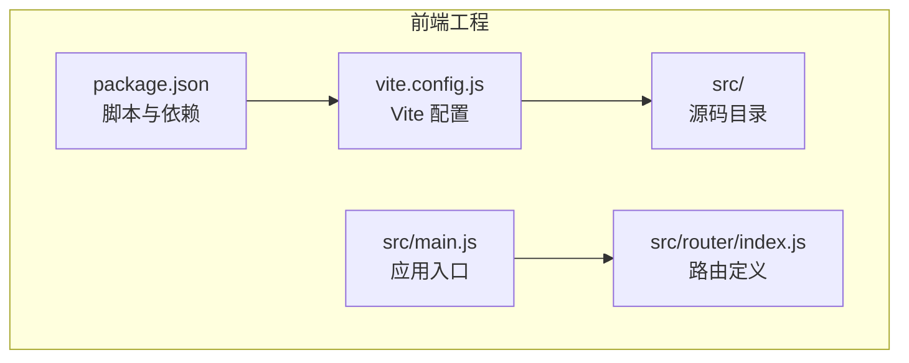
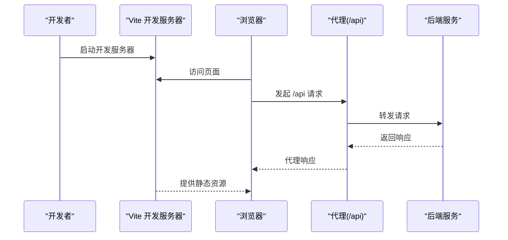
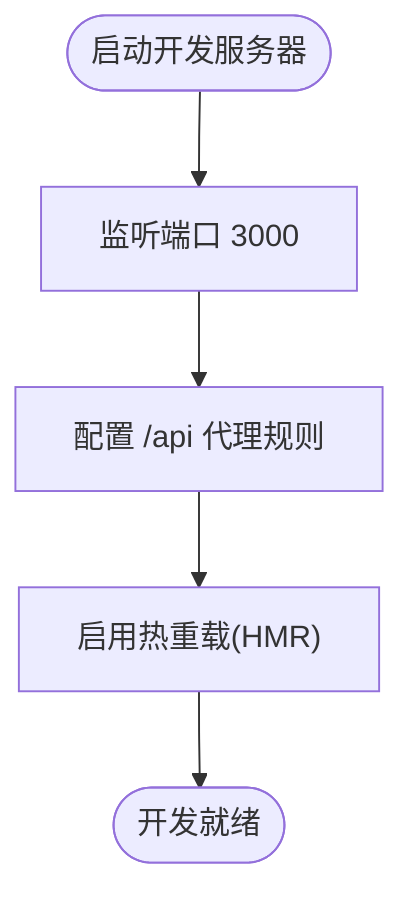
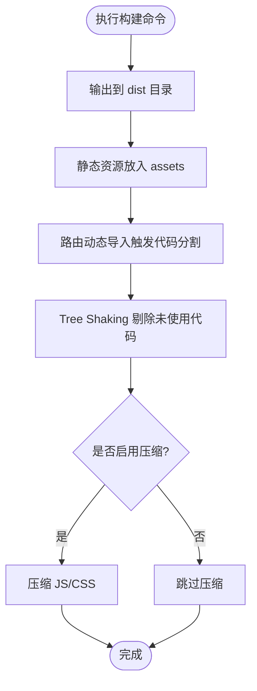
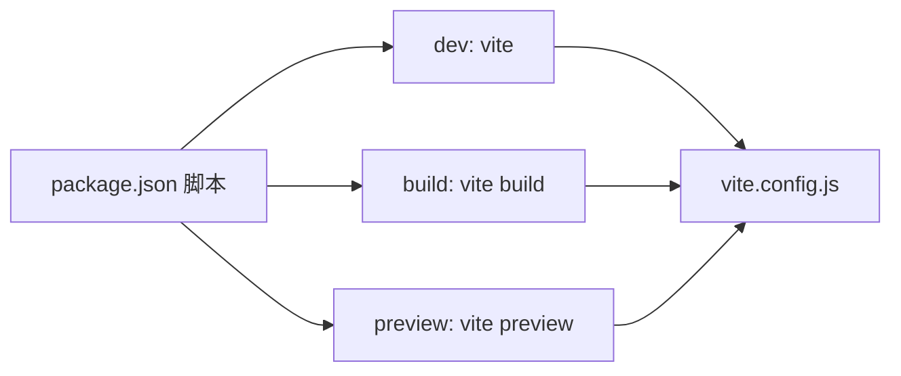

# 构建工具

<cite>
**本文引用的文件**
- [vite.config.js](file://frontend/vite.config.js)
- [package.json](file://frontend/package.json)
- [main.js](file://frontend/src/main.js)
- [index.js](file://frontend/src/router/index.js)
</cite>

## 目录
1. [简介](#简介)
2. [项目结构](#项目结构)
3. [核心组件](#核心组件)
4. [架构总览](#架构总览)
5. [详细组件分析](#详细组件分析)
6. [依赖分析](#依赖分析)
7. [性能考虑](#性能考虑)
8. [故障排查指南](#故障排查指南)
9. [结论](#结论)
10. [附录](#附录)

## 简介
本文件面向“新世界”前端工程，系统化梳理基于 Vite 的构建工具配置与优化策略，覆盖开发服务器、代理、热重载、打包优化（代码分割、Tree Shaking、压缩）、静态资源处理（图片、字体、CSS）、环境变量配置（开发/生产差异）、插件生态（Vue 插件、ESLint 插件、构建优化插件）以及构建性能优化与部署配置建议。内容以仓库现有配置为基础，结合最佳实践给出可操作的指导。

## 项目结构
前端工程采用 Vite 作为构建核心，关键配置集中在根目录的构建配置文件中，并通过包管理脚本统一入口。路由采用 Vue Router 的异步加载实现代码分割；应用入口注册了状态管理、UI 组件库与全局样式，形成清晰的模块边界与职责划分。

图表来源
- [vite.config.js:1-26](file://frontend/vite.config.js#L1-L26)
- [package.json:1-30](file://frontend/package.json#L1-L30)
- [main.js:1-22](file://frontend/src/main.js#L1-L22)
- [index.js:1-50](file://frontend/src/router/index.js#L1-L50)

章节来源
- [vite.config.js:1-26](file://frontend/vite.config.js#L1-L26)
- [package.json:1-30](file://frontend/package.json#L1-L30)

## 核心组件
- 开发服务器与代理
  - 开发端口：3000
  - 本地 API 代理：将以 “/api” 开头的请求转发到后端服务地址，支持跨域变更
- 打包输出
  - 输出目录：dist
  - 静态资源目录：assets
- 路径别名
  - 使用 “@” 指向 src 目录，提升导入可读性
- 插件生态
  - Vue 单文件组件支持：@vitejs/plugin-vue
- 路由与代码分割
  - 路由采用动态导入，天然实现按需加载与代码分割

章节来源
- [vite.config.js:5-25](file://frontend/vite.config.js#L5-L25)
- [package.json:6-10](file://frontend/package.json#L6-L10)
- [index.js:7,23](file://frontend/src/router/index.js#L7,L23)

## 架构总览
下图展示从开发到生产的典型流程：开发者通过 npm/yarn 脚本启动 Vite 开发服务器，浏览器发起请求；开发服务器根据代理规则将 API 请求转发至后端；页面在运行时通过动态导入实现路由级代码分割；构建阶段生成静态产物并输出到 dist 目录。

图表来源
- [vite.config.js:12-20](file://frontend/vite.config.js#L12-L20)
- [package.json:6-10](file://frontend/package.json#L6-L10)

## 详细组件分析

### 开发服务器与代理
- 端口与代理
  - 开发端口固定为 3000，便于统一协作与容器映射
  - 代理规则将 “/api” 前缀请求转发至本地后端地址，changeOrigin 保证 Host 头正确
- 热重载机制
  - Vite 默认启用模块热替换（HMR），无需额外配置即可实现页面局部刷新
- 环境变量
  - 当前未显式声明环境变量文件；如需区分开发/生产，可在根目录新增 .env.* 文件并通过 Vite 自动注入

图表来源
- [vite.config.js:12-20](file://frontend/vite.config.js#L12-L20)

章节来源
- [vite.config.js:12-20](file://frontend/vite.config.js#L12-L20)

### 打包与代码分割
- 输出目录
  - 构建产物输出到 dist，静态资源位于 assets 子目录
- 代码分割
  - 路由采用动态导入，实现按需加载与自然的代码分割
- Tree Shaking
  - 项目使用 ES Module 导入导出，配合打包器可进行无用代码剔除
- 压缩策略
  - 当前未配置压缩插件；可在生产构建中引入压缩插件以减小体积

图表来源
- [vite.config.js:21-24](file://frontend/vite.config.js#L21-L24)
- [index.js:7,23](file://frontend/src/router/index.js#L7,L23)

章节来源
- [vite.config.js:21-24](file://frontend/vite.config.js#L21-L24)
- [index.js:7,23](file://frontend/src/router/index.js#L7,L23)

### 静态资源处理
- 图片与字体
  - 建议在构建中对图片进行压缩与格式优化（例如 WebP），字体采用 WOFF2 以降低体积
- CSS
  - 全局样式在入口集中引入；建议拆分业务样式与通用样式，减少重复打包
- 资源指纹
  - 可通过构建配置为产物添加哈希后缀，提升缓存命中与更新可控性

章节来源
- [main.js:9](file://frontend/src/main.js#L9)

### 环境变量配置
- 当前未发现 .env.* 文件；建议新增
  - .env.development：开发环境变量（如 API 基础地址）
  - .env.production：生产环境变量（如 CDN 地址、埋点开关）
- Vite 将自动注入以 VITE_ 前缀命名的变量，可在代码中通过 import.meta.env 使用

章节来源
- [vite.config.js:5-25](file://frontend/vite.config.js#L5-L25)

### 插件生态系统
- Vue 插件
  - 已启用 @vitejs/plugin-vue，支持单文件组件与模板编译
- ESLint 插件
  - 可选：安装 @typescript-eslint/eslint-plugin 与 eslint-plugin-vue，配合 .eslintrc 配置进行代码质量检查
- 构建优化插件
  - 可选：引入 vite-plugin-svg-icons 实现 SVG 图标优化；vite-plugin-imagemin 进行图片压缩；rollup-plugin-visualizer 生成打包可视化报告

章节来源
- [vite.config.js:6](file://frontend/vite.config.js#L6)
- [package.json:25-28](file://frontend/package.json#L25-L28)

## 依赖分析
- 脚本命令
  - dev：启动开发服务器
  - build：执行生产构建
  - preview：预览生产构建结果
- 运行时依赖
  - Vue 3、Vue Router、Pinia、Element Plus、Axios 等
- 开发依赖
  - Vite 与 @vitejs/plugin-vue

图表来源
- [package.json:6-10](file://frontend/package.json#L6-L10)
- [vite.config.js:5-25](file://frontend/vite.config.js#L5-L25)

章节来源
- [package.json:1-30](file://frontend/package.json#L1-L30)

## 性能考虑
- 代码分割
  - 利用路由动态导入与第三方库的按需加载，避免一次性加载全部资源
- Tree Shaking
  - 使用 ESM 并保持无副作用模块，确保打包器正确识别可移除代码
- 压缩与资源优化
  - 生产构建启用压缩；图片与字体采用现代格式与压缩策略
- 缓存策略
  - 为静态资源添加内容哈希，结合长期缓存与失效策略
- 依赖拆分
  - 将稳定不变的依赖单独打包，提升缓存复用率

## 故障排查指南
- 代理无效或跨域失败
  - 检查代理目标地址与 changeOrigin 设置；确认后端服务已启动且可访问
- 热重载不生效
  - 确认未禁用 HMR；检查浏览器控制台是否存在语法错误导致的模块加载失败
- 构建产物过大
  - 分析打包可视化报告，定位大体积依赖与重复模块；开启压缩与资源优化
- 路由懒加载异常
  - 确保动态导入语法正确；检查路由层级与命名是否冲突

章节来源
- [vite.config.js:12-20](file://frontend/vite.config.js#L12-L20)
- [index.js:38-47](file://frontend/src/router/index.js#L38-L47)

## 结论
当前项目已具备基础的 Vite 开发与构建能力：明确的开发服务器与代理、合理的打包输出、良好的路由代码分割实践。建议进一步完善环境变量管理、引入资源优化与压缩插件，并通过可视化分析持续优化构建性能，以满足生产环境对体积与加载速度的要求。

## 附录
- 部署配置建议
  - 将 dist 目录部署至 Nginx/Apache 等静态服务器；配置 Gzip/Brotli 压缩与缓存头
  - 若后端为独立服务，确保代理规则与域名一致，避免跨域问题
- 参考脚本命令
  - 开发：npm run dev
  - 构建：npm run build
  - 预览：npm run preview

章节来源
- [package.json:6-10](file://frontend/package.json#L6-L10)