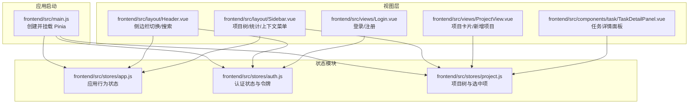
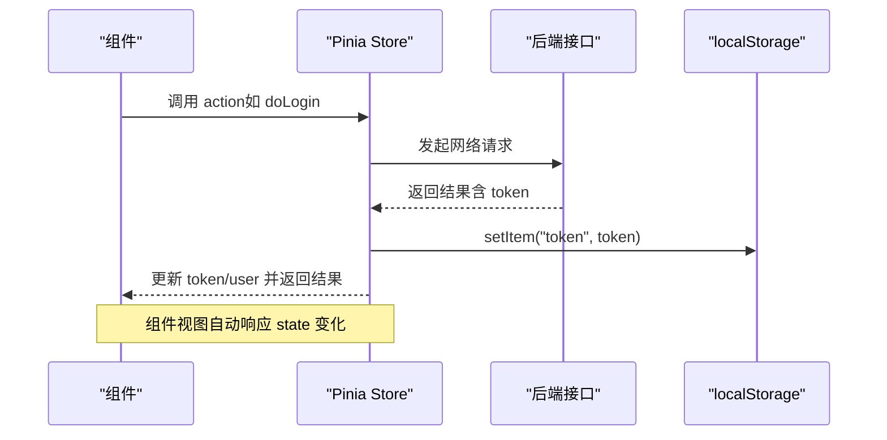
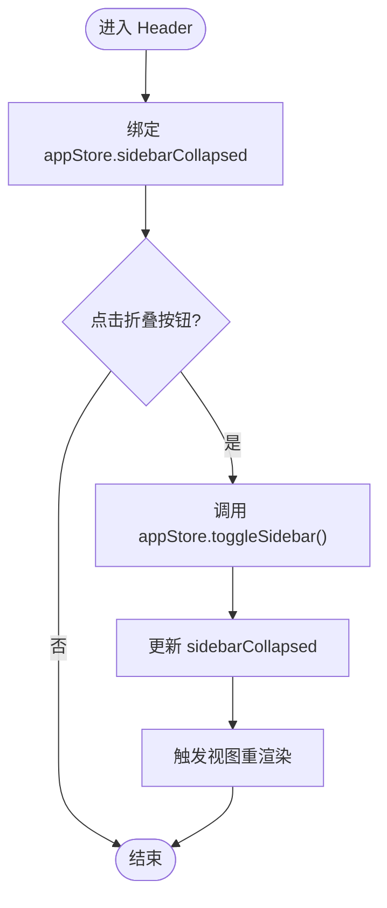
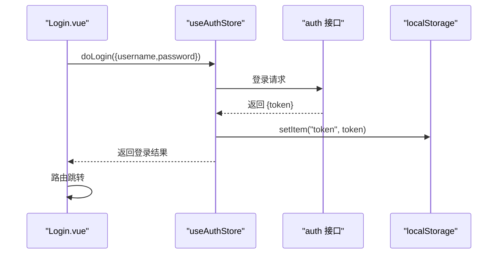
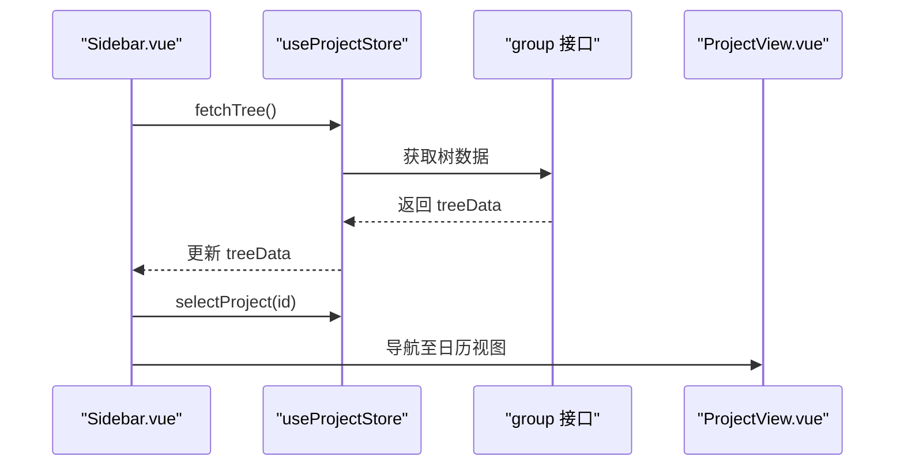
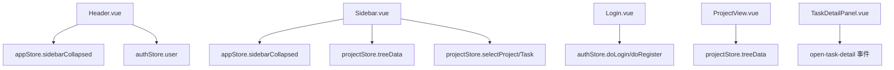
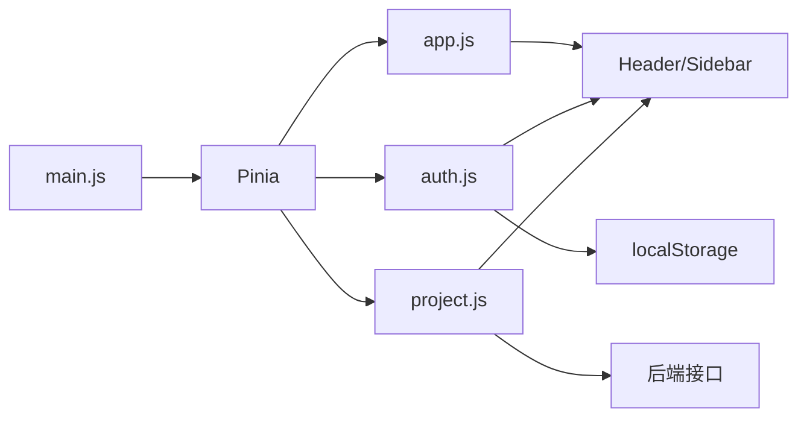

# 状态管理

<cite>
**本文引用的文件**
- [frontend/src/main.js](file://frontend/src/main.js)
- [frontend/src/stores/app.js](file://frontend/src/stores/app.js)
- [frontend/src/stores/auth.js](file://frontend/src/stores/auth.js)
- [frontend/src/stores/project.js](file://frontend/src/stores/project.js)
- [frontend/src/layout/Header.vue](file://frontend/src/layout/Header.vue)
- [frontend/src/layout/Sidebar.vue](file://frontend/src/layout/Sidebar.vue)
- [frontend/src/views/Login.vue](file://frontend/src/views/Login.vue)
- [frontend/src/views/ProjectView.vue](file://frontend/src/views/ProjectView.vue)
- [frontend/src/components/task/TaskDetailPanel.vue](file://frontend/src/components/task/TaskDetailPanel.vue)
</cite>

## 目录
1. [简介](#简介)
2. [项目结构](#项目结构)
3. [核心组件](#核心组件)
4. [架构总览](#架构总览)
5. [详细组件分析](#详细组件分析)
6. [依赖分析](#依赖分析)
7. [性能考虑](#性能考虑)
8. [故障排查指南](#故障排查指南)
9. [结论](#结论)
10. [附录](#附录)

## 简介
本文件系统性梳理新世界前端的 Pinia 状态管理方案，覆盖应用状态(app)、认证状态(auth)、项目状态(project)等模块的职责划分与协作方式；解释响应式数据设计（state、getter、action）与持久化策略（localStorage/sessionStorage），并给出组件与 store 的绑定与同步机制、跨组件共享最佳实践、使用示例与调试技巧。

## 项目结构
- 状态管理入口：在应用启动时挂载 Pinia，确保全局可注入。
- Store 模块：按领域拆分为 app、auth、project 三个模块，分别负责界面行为、认证流程与项目树数据。
- 组件集成：Header、Sidebar、Login、ProjectView、TaskDetailPanel 等组件通过组合式 API 使用对应 store，完成数据驱动与交互。

图表来源
- [frontend/src/main.js:18](file://frontend/src/main.js#L18)
- [frontend/src/stores/app.js:4-17](file://frontend/src/stores/app.js#L4-L17)
- [frontend/src/stores/auth.js:5-40](file://frontend/src/stores/auth.js#L5-L40)
- [frontend/src/stores/project.js:5-25](file://frontend/src/stores/project.js#L5-L25)
- [frontend/src/layout/Header.vue:46-52](file://frontend/src/layout/Header.vue#L46-L52)
- [frontend/src/layout/Sidebar.vue:93-102](file://frontend/src/layout/Sidebar.vue#L93-L102)
- [frontend/src/views/Login.vue:70-76](file://frontend/src/views/Login.vue#L70-L76)
- [frontend/src/views/ProjectView.vue:68-74](file://frontend/src/views/ProjectView.vue#L68-L74)
- [frontend/src/components/task/TaskDetailPanel.vue:56-100](file://frontend/src/components/task/TaskDetailPanel.vue#L56-L100)

章节来源
- [frontend/src/main.js:18](file://frontend/src/main.js#L18)
- [frontend/src/stores/app.js:4-17](file://frontend/src/stores/app.js#L4-L17)
- [frontend/src/stores/auth.js:5-40](file://frontend/src/stores/auth.js#L5-L40)
- [frontend/src/stores/project.js:5-25](file://frontend/src/stores/project.js#L5-L25)

## 核心组件
- 应用状态(app)
  - 职责：维护侧边栏折叠状态、搜索关键词等界面行为数据。
  - 关键字段：sidebarCollapsed、searchKeyword。
  - 关键动作：toggleSidebar、setSearchKeyword。
- 认证状态(auth)
  - 职责：维护登录态、用户信息、令牌持久化与登录/注册/登出流程。
  - 关键字段：token、user。
  - 关键动作：isLoggedIn、setToken、doLogin、doRegister、fetchUserInfo、logout。
- 项目状态(project)
  - 职责：维护项目树数据、当前选中的项目/任务等上下文。
  - 关键字段：treeData、selectedProjectId、selectedGroupId、selectedTaskId。
  - 关键动作：fetchTree、selectProject、selectTask。

章节来源
- [frontend/src/stores/app.js:4-17](file://frontend/src/stores/app.js#L4-L17)
- [frontend/src/stores/auth.js:5-40](file://frontend/src/stores/auth.js#L5-L40)
- [frontend/src/stores/project.js:5-25](file://frontend/src/stores/project.js#L5-L25)

## 架构总览
- 响应式数据模型：每个 store 使用组合式 API 定义 ref 类型的 state，自动具备响应式能力。
- getter 计算属性：auth 模块提供 isLoggedIn 作为派生状态；组件中可直接使用 computed 或直接访问。
- action 方法：封装业务逻辑（如登录、注册、获取用户信息、加载项目树），统一处理副作用与持久化。
- 持久化策略：auth 模块使用 localStorage 存储 token；app 模块未显式持久化，适合会话内状态。
- 同步机制：组件通过 store 实例直接读写 state，配合事件总线或路由参数实现跨组件联动。

图表来源
- [frontend/src/stores/auth.js:16-31](file://frontend/src/stores/auth.js#L16-L31)
- [frontend/src/stores/auth.js:11-14](file://frontend/src/stores/auth.js#L11-L14)

## 详细组件分析

### 应用状态(app)分析
- 设计要点
  - 使用 ref 定义 sidebarCollapsed 与 searchKeyword，保证响应式更新。
  - 提供 toggleSidebar 与 setSearchKeyword 动作，便于 Header/Sidebar 组件调用。
- 数据流
  - Header 绑定 appStore.sidebarCollapsed 控制侧边栏折叠按钮。
  - Header 通过 appStore.toggleSidebar 切换状态。
- 性能建议
  - 仅存储必要 UI 状态，避免冗余计算。
  - 对频繁变更的状态使用细粒度更新，减少无关渲染。

图表来源
- [frontend/src/layout/Header.vue:4-6](file://frontend/src/layout/Header.vue#L4-L6)
- [frontend/src/stores/app.js:8-10](file://frontend/src/stores/app.js#L8-L10)

章节来源
- [frontend/src/stores/app.js:4-17](file://frontend/src/stores/app.js#L4-L17)
- [frontend/src/layout/Header.vue:4-6](file://frontend/src/layout/Header.vue#L4-L6)

### 认证状态(auth)分析
- 设计要点
  - 初始化从 localStorage 读取 token，实现刷新后保持登录态。
  - doLogin 成功后设置 token 并拉取用户信息；logout 清空 token 与用户信息。
  - 提供 isLoggedIn 作为派生状态，便于权限控制。
- 数据流
  - Login 页面通过 useAuthStore 调用 doLogin/doRegister，成功后跳转首页。
  - Header 下拉菜单触发 logout，清空本地状态并跳转登录页。
- 持久化策略
  - token 写入 localStorage，支持跨会话持久化。
  - 用户信息 user 由接口返回，不持久化到本地。

图表来源
- [frontend/src/views/Login.vue:137-151](file://frontend/src/views/Login.vue#L137-L151)
- [frontend/src/stores/auth.js:16-21](file://frontend/src/stores/auth.js#L16-L21)
- [frontend/src/stores/auth.js:11-14](file://frontend/src/stores/auth.js#L11-L14)

章节来源
- [frontend/src/stores/auth.js:5-40](file://frontend/src/stores/auth.js#L5-L40)
- [frontend/src/views/Login.vue:137-151](file://frontend/src/views/Login.vue#L137-L151)

### 项目状态(project)分析
- 设计要点
  - treeData 存储项目树结构；selectedProjectId/selectedTaskId 保存当前上下文。
  - fetchTree 从后端获取树数据；selectProject/selectTask 更新选中项。
- 数据流
  - Sidebar 首次挂载时调用 fetchTree 加载树；点击节点后更新选中项并导航。
  - ProjectView 展示项目卡片，提交后重新拉取树数据。
  - TaskDetailPanel 通过窗口事件打开任务详情，展示任务信息。
- 性能建议
  - 树数据量大时考虑懒加载或分页；对高频操作使用防抖。
  - 选中项变更仅影响相关组件，避免全量重绘。

图表来源
- [frontend/src/layout/Sidebar.vue:178-181](file://frontend/src/layout/Sidebar.vue#L178-L181)
- [frontend/src/stores/project.js:11-14](file://frontend/src/stores/project.js#L11-L14)
- [frontend/src/layout/Sidebar.vue:117-127](file://frontend/src/layout/Sidebar.vue#L117-L127)

章节来源
- [frontend/src/stores/project.js:5-25](file://frontend/src/stores/project.js#L5-L25)
- [frontend/src/layout/Sidebar.vue:178-181](file://frontend/src/layout/Sidebar.vue#L178-L181)
- [frontend/src/views/ProjectView.vue:110-114](file://frontend/src/views/ProjectView.vue#L110-L114)

### 组件与 store 的绑定与同步
- Header
  - 读取 appStore.sidebarCollapsed 控制折叠按钮；调用 appStore.toggleSidebar。
  - 读取 authStore.user 显示用户信息；调用 authStore.logout。
- Sidebar
  - 读取 appStore.sidebarCollapsed 控制布局样式；读取 projectStore.treeData 渲染树。
  - 节点点击触发 projectStore.selectProject/selectTask，并通过自定义事件打开任务详情。
- Login
  - 通过 authStore.doLogin/doRegister 完成认证流程。
- ProjectView
  - 读取 projectStore.treeData 渲染项目卡片；提交后重新 fetchTree。
- TaskDetailPanel
  - 监听窗口事件 open-task-detail，根据 taskId 请求详情并展示。

图表来源
- [frontend/src/layout/Header.vue:4-6](file://frontend/src/layout/Header.vue#L4-L6)
- [frontend/src/layout/Header.vue:28-31](file://frontend/src/layout/Header.vue#L28-L31)
- [frontend/src/layout/Sidebar.vue:2-6](file://frontend/src/layout/Sidebar.vue#L2-L6)
- [frontend/src/layout/Sidebar.vue:35-56](file://frontend/src/layout/Sidebar.vue#L35-L56)
- [frontend/src/layout/Sidebar.vue:117-127](file://frontend/src/layout/Sidebar.vue#L117-L127)
- [frontend/src/views/Login.vue:137-151](file://frontend/src/views/Login.vue#L137-L151)
- [frontend/src/views/ProjectView.vue:110-114](file://frontend/src/views/ProjectView.vue#L110-L114)
- [frontend/src/components/task/TaskDetailPanel.vue:102-112](file://frontend/src/components/task/TaskDetailPanel.vue#L102-L112)

章节来源
- [frontend/src/layout/Header.vue:4-6](file://frontend/src/layout/Header.vue#L4-L6)
- [frontend/src/layout/Header.vue:28-31](file://frontend/src/layout/Header.vue#L28-L31)
- [frontend/src/layout/Sidebar.vue:35-56](file://frontend/src/layout/Sidebar.vue#L35-L56)
- [frontend/src/layout/Sidebar.vue:117-127](file://frontend/src/layout/Sidebar.vue#L117-L127)
- [frontend/src/views/Login.vue:137-151](file://frontend/src/views/Login.vue#L137-L151)
- [frontend/src/views/ProjectView.vue:110-114](file://frontend/src/views/ProjectView.vue#L110-L114)
- [frontend/src/components/task/TaskDetailPanel.vue:102-112](file://frontend/src/components/task/TaskDetailPanel.vue#L102-L112)

## 依赖分析
- 入口依赖：main.js 仅负责安装 Pinia，不直接依赖各 store。
- 模块内聚：各 store 仅暴露必要的 state/action，降低耦合。
- 组件依赖：视图组件通过组合式 API 引入对应 store，形成单向数据流。
- 外部依赖：auth.store 依赖 localStorage；project.store 依赖后端接口；UI 组件依赖 Element Plus。

图表来源
- [frontend/src/main.js:18](file://frontend/src/main.js#L18)
- [frontend/src/stores/auth.js:6](file://frontend/src/stores/auth.js#L6)
- [frontend/src/stores/project.js:12](file://frontend/src/stores/project.js#L12)

章节来源
- [frontend/src/main.js:18](file://frontend/src/main.js#L18)
- [frontend/src/stores/auth.js:6](file://frontend/src/stores/auth.js#L6)
- [frontend/src/stores/project.js:12](file://frontend/src/stores/project.js#L12)

## 性能考虑
- 响应式粒度：仅在需要的组件中读取相关 state，避免不必要的重渲染。
- 异步加载：对树数据与统计信息采用懒加载与缓存策略，减少重复请求。
- 事件通信：使用窗口事件在非父子组件间传递简单数据，避免深层 props 传递。
- 持久化策略：仅对必要数据（如 token）使用 localStorage，避免过度持久化导致的同步复杂度。

## 故障排查指南
- 登录后无法显示用户信息
  - 检查 doLogin 是否正确设置 token 并调用 fetchUserInfo。
  - 确认后端返回的用户信息结构与 store 中 user 字段匹配。
- 侧边栏切换无效
  - 确认 Header 中是否正确调用 appStore.toggleSidebar。
  - 检查 sidebarCollapsed 的绑定是否生效。
- 项目树不更新
  - 确认 Sidebar/ProjectView 在关键操作后调用了 projectStore.fetchTree。
  - 检查后端接口返回的树结构格式是否符合预期。
- 任务详情面板不弹出
  - 确认 Sidebar 在点击任务节点时是否正确派发 open-task-detail 事件。
  - 检查 TaskDetailPanel 是否正确监听该事件并在卸载时移除监听。

章节来源
- [frontend/src/stores/auth.js:16-31](file://frontend/src/stores/auth.js#L16-L31)
- [frontend/src/layout/Header.vue:4-6](file://frontend/src/layout/Header.vue#L4-L6)
- [frontend/src/layout/Sidebar.vue:117-127](file://frontend/src/layout/Sidebar.vue#L117-L127)
- [frontend/src/components/task/TaskDetailPanel.vue:102-112](file://frontend/src/components/task/TaskDetailPanel.vue#L102-L112)

## 结论
本项目采用 Pinia 进行状态管理，遵循“按领域拆分”的模块化组织方式，结合组合式 API 的响应式数据设计，实现了清晰的职责边界与良好的可维护性。通过 localStorage 与后端接口的协同，兼顾了会话持久化与实时数据一致性。建议在后续迭代中引入更完善的错误处理与缓存策略，以进一步提升用户体验与性能表现。

## 附录
- 使用示例（路径指引）
  - 登录流程：[frontend/src/views/Login.vue:137-151](file://frontend/src/views/Login.vue#L137-L151)
  - 设置 token 并持久化：[frontend/src/stores/auth.js:11-14](file://frontend/src/stores/auth.js#L11-L14)
  - 获取项目树并渲染：[frontend/src/layout/Sidebar.vue:178-181](file://frontend/src/layout/Sidebar.vue#L178-L181)
  - 打开任务详情面板：[frontend/src/components/task/TaskDetailPanel.vue:102-112](file://frontend/src/components/task/TaskDetailPanel.vue#L102-L112)
- 调试技巧
  - 在浏览器开发者工具中查看 Pinia Store 的 state 变化，定位问题。
  - 使用 Vue DevTools 观察组件渲染次数与 props/state 变更。
  - 对异步 action 添加 try/catch 并记录错误日志，便于追踪。