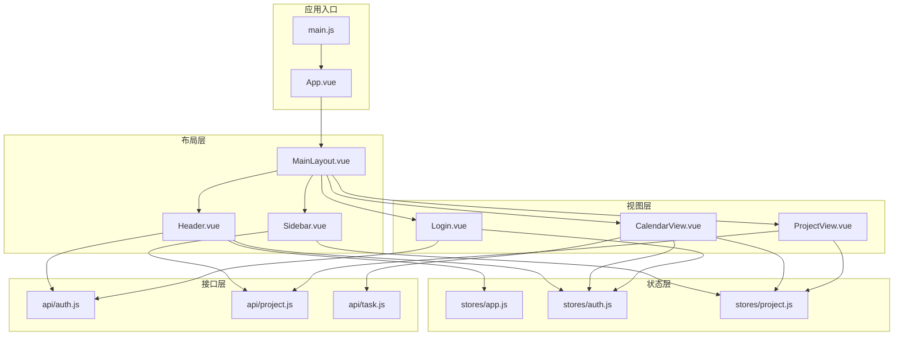
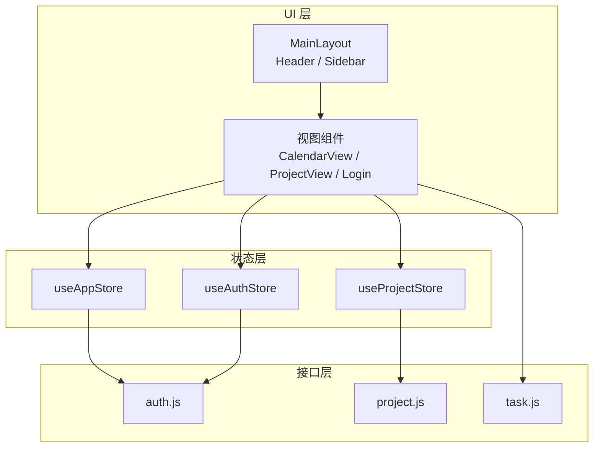
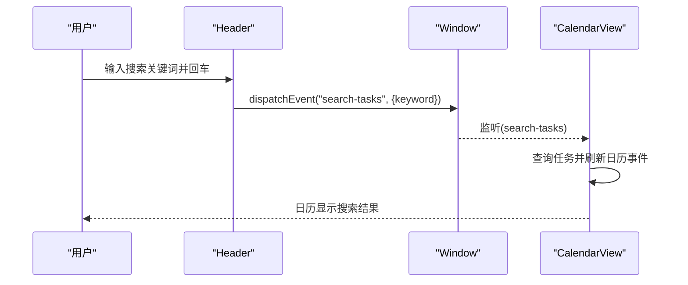
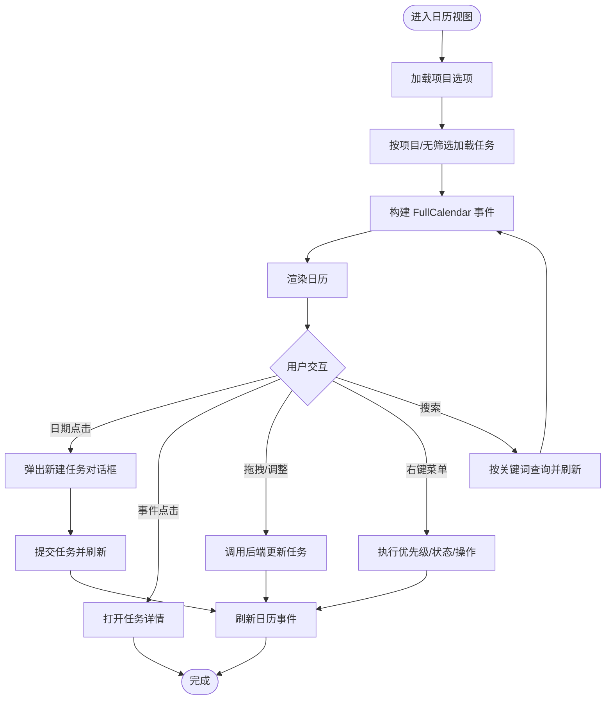
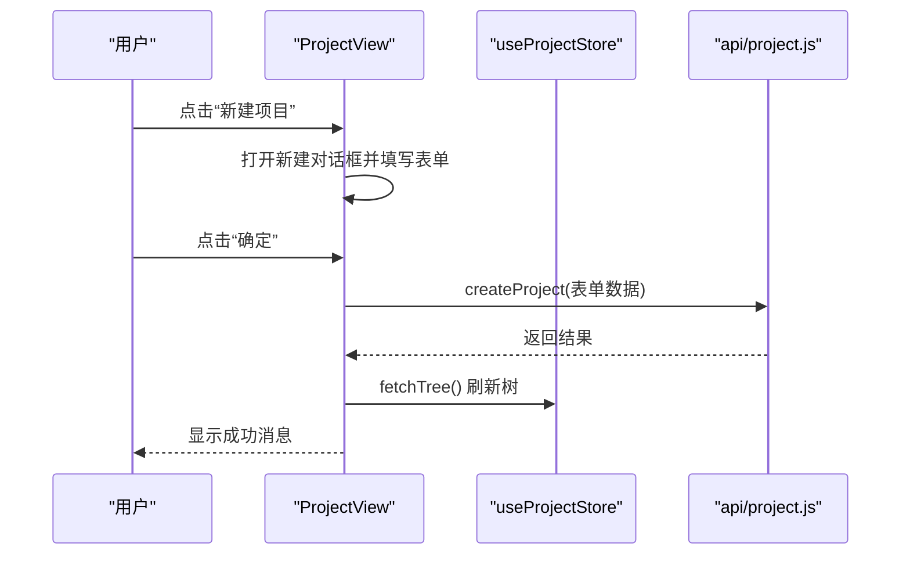
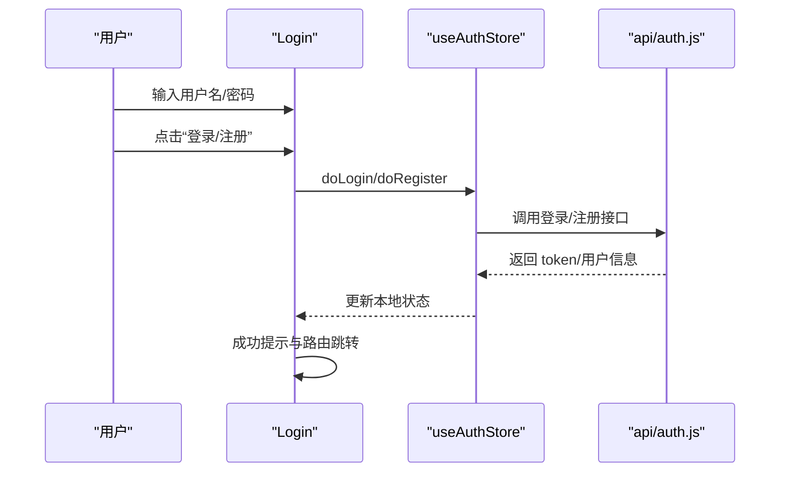
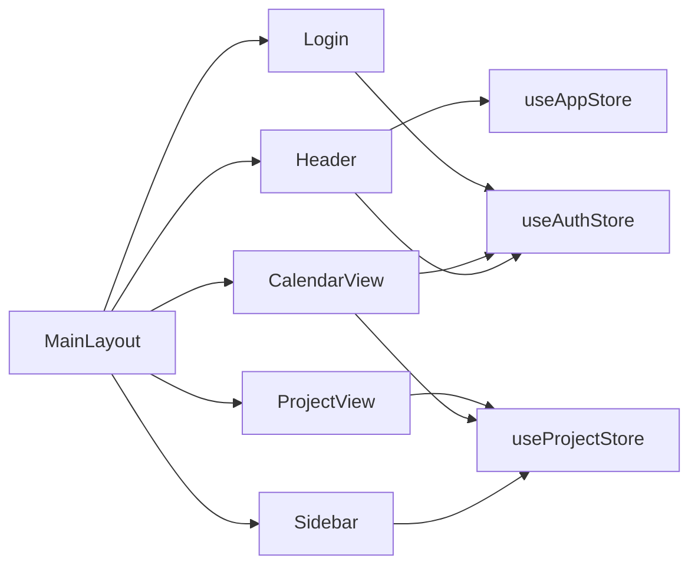

# 组件系统

<cite>
**本文引用的文件**
- [App.vue](file://frontend/src/App.vue)
- [main.js](file://frontend/src/main.js)
- [MainLayout.vue](file://frontend/src/layout/MainLayout.vue)
- [Header.vue](file://frontend/src/layout/Header.vue)
- [Sidebar.vue](file://frontend/src/layout/Sidebar.vue)
- [CalendarView.vue](file://frontend/src/views/CalendarView.vue)
- [ProjectView.vue](file://frontend/src/views/ProjectView.vue)
- [Login.vue](file://frontend/src/views/Login.vue)
- [app.js](file://frontend/src/stores/app.js)
- [auth.js](file://frontend/src/stores/auth.js)
- [project.js](file://frontend/src/stores/project.js)
- [task.js](file://frontend/src/api/task.js)
- [project.js](file://frontend/src/api/project.js)
- [auth.js](file://frontend/src/api/auth.js)
</cite>

## 目录
1. [引言](#引言)
2. [项目结构](#项目结构)
3. [核心组件](#核心组件)
4. [架构总览](#架构总览)
5. [详细组件分析](#详细组件分析)
6. [依赖分析](#依赖分析)
7. [性能考虑](#性能考虑)
8. [故障排查指南](#故障排查指南)
9. [结论](#结论)
10. [附录：使用示例与集成指南](#附录使用示例与集成指南)

## 引言
本文件系统性梳理新世界项目的前端组件体系，重点覆盖以下方面：
- Vue 3 组件的层级与组织方式（布局层、视图层）
- 主布局组件与头部、侧边栏的职责划分与交互
- 视图组件（日历视图、项目视图、登录视图）的功能实现与数据流
- 组件间通信机制（路由、状态管理、自定义事件）
- 复用策略与最佳实践（命名规范、文件组织、代码风格）
- 使用示例与集成指南

## 项目结构
前端采用“布局层 + 视图层 + 状态层 + 接口层”的分层组织方式：
- 布局层：MainLayout、Header、Sidebar
- 视图层：CalendarView、ProjectView、Login
- 状态层：Pinia Store（app、auth、project）
- 接口层：各模块 API 模块（auth、project、task）

图表来源
- [main.js:1-22](file://frontend/src/main.js#L1-L22)
- [App.vue:1-16](file://frontend/src/App.vue#L1-L16)
- [MainLayout.vue:1-39](file://frontend/src/layout/MainLayout.vue#L1-L39)
- [Header.vue:1-87](file://frontend/src/layout/Header.vue#L1-L87)
- [Sidebar.vue:1-250](file://frontend/src/layout/Sidebar.vue#L1-L250)
- [CalendarView.vue:1-451](file://frontend/src/views/CalendarView.vue#L1-L451)
- [ProjectView.vue:1-130](file://frontend/src/views/ProjectView.vue#L1-L130)
- [Login.vue:1-203](file://frontend/src/views/Login.vue#L1-L203)
- [app.js:1-18](file://frontend/src/stores/app.js#L1-L18)
- [auth.js:1-41](file://frontend/src/stores/auth.js#L1-L41)
- [project.js:1-26](file://frontend/src/stores/project.js#L1-L26)

章节来源
- [main.js:1-22](file://frontend/src/main.js#L1-L22)
- [App.vue:1-16](file://frontend/src/App.vue#L1-L16)

## 核心组件
- 应用入口与全局配置：在入口文件中注册 Element Plus、图标、Pinia、路由，并挂载应用。
- 布局组件：MainLayout 作为根布局容器，组合 Header 与 Sidebar；内容区通过 router-view 渲染当前视图。
- 视图组件：CalendarView 提供日历视图与任务操作；ProjectView 展示项目树与统计；Login 提供登录/注册表单。
- 状态管理：Pinia Store 分别维护应用状态（侧边栏折叠）、认证状态（token、用户信息）、项目树与选中项。

章节来源
- [main.js:1-22](file://frontend/src/main.js#L1-L22)
- [MainLayout.vue:1-39](file://frontend/src/layout/MainLayout.vue#L1-L39)
- [Header.vue:1-87](file://frontend/src/layout/Header.vue#L1-L87)
- [Sidebar.vue:1-250](file://frontend/src/layout/Sidebar.vue#L1-L250)
- [CalendarView.vue:1-451](file://frontend/src/views/CalendarView.vue#L1-L451)
- [ProjectView.vue:1-130](file://frontend/src/views/ProjectView.vue#L1-L130)
- [Login.vue:1-203](file://frontend/src/views/Login.vue#L1-L203)
- [app.js:1-18](file://frontend/src/stores/app.js#L1-L18)
- [auth.js:1-41](file://frontend/src/stores/auth.js#L1-L41)
- [project.js:1-26](file://frontend/src/stores/project.js#L1-L26)

## 架构总览
组件系统遵循“布局容器 + 视图 + 状态 + 接口”的分层设计，组件间通过 Pinia 状态共享、路由导航与自定义事件进行协作。

图表来源
- [MainLayout.vue:1-39](file://frontend/src/layout/MainLayout.vue#L1-L39)
- [Header.vue:1-87](file://frontend/src/layout/Header.vue#L1-L87)
- [Sidebar.vue:1-250](file://frontend/src/layout/Sidebar.vue#L1-L250)
- [CalendarView.vue:1-451](file://frontend/src/views/CalendarView.vue#L1-L451)
- [ProjectView.vue:1-130](file://frontend/src/views/ProjectView.vue#L1-L130)
- [Login.vue:1-203](file://frontend/src/views/Login.vue#L1-L203)
- [app.js:1-18](file://frontend/src/stores/app.js#L1-L18)
- [auth.js:1-41](file://frontend/src/stores/auth.js#L1-L41)
- [project.js:1-26](file://frontend/src/stores/project.js#L1-L26)

## 详细组件分析

### 布局组件：MainLayout、Header、Sidebar
- MainLayout：负责整体布局与区域划分，包含侧边栏、主内容区与路由视图渲染。
- Header：提供搜索、导航按钮与用户下拉菜单；通过自定义事件向全局广播搜索关键词；触发登出后跳转登录页。
- Sidebar：展示任务统计、项目树与上下文菜单；支持节点点击进入日历视图或打开任务详情；支持右键菜单操作（新建、重命名、删除）。

图表来源
- [Header.vue:55-59](file://frontend/src/layout/Header.vue#L55-L59)
- [CalendarView.vue:400-409](file://frontend/src/views/CalendarView.vue#L400-L409)

章节来源
- [MainLayout.vue:1-39](file://frontend/src/layout/MainLayout.vue#L1-L39)
- [Header.vue:1-87](file://frontend/src/layout/Header.vue#L1-L87)
- [Sidebar.vue:1-250](file://frontend/src/layout/Sidebar.vue#L1-L250)

### 视图组件：CalendarView（日历视图）
- 功能要点
  - 集成 FullCalendar，支持月/周/日视图切换、拖拽调整日期、拖拽调整持续时间、右键上下文菜单。
  - 支持任务优先级设置、状态变更、复制、归档、转换为笔记、编辑与删除等操作。
  - 通过路由查询参数过滤项目；支持搜索关键词筛选任务。
- 数据流
  - 从后端加载任务列表，构建 FullCalendar 事件数组；根据项目筛选或搜索关键词动态刷新。
  - 通过自定义事件打开任务详情面板（可扩展）。

图表来源
- [CalendarView.vue:154-207](file://frontend/src/views/CalendarView.vue#L154-L207)
- [CalendarView.vue:250-292](file://frontend/src/views/CalendarView.vue#L250-L292)
- [CalendarView.vue:294-364](file://frontend/src/views/CalendarView.vue#L294-L364)
- [CalendarView.vue:400-409](file://frontend/src/views/CalendarView.vue#L400-L409)

章节来源
- [CalendarView.vue:1-451](file://frontend/src/views/CalendarView.vue#L1-L451)

### 视图组件：ProjectView（项目视图）
- 功能要点
  - 展示分组与项目卡片，统计各项目任务状态数量。
  - 支持新建项目，选择所属分组、颜色与描述。
- 数据流
  - 从项目树 Store 获取数据；提交成功后刷新树结构。

图表来源
- [ProjectView.vue:89-108](file://frontend/src/views/ProjectView.vue#L89-L108)
- [project.js:11-14](file://frontend/src/stores/project.js#L11-L14)

章节来源
- [ProjectView.vue:1-130](file://frontend/src/views/ProjectView.vue#L1-L130)
- [project.js:1-26](file://frontend/src/stores/project.js#L1-L26)

### 视图组件：Login（登录视图）
- 功能要点
  - 登录/注册双模式切换；表单校验；提交成功后跳转首页或提示切换模式。
- 数据流
  - 通过认证 Store 调用登录/注册接口；成功后持久化 token 并获取用户信息。

图表来源
- [Login.vue:125-157](file://frontend/src/views/Login.vue#L125-L157)
- [auth.js:16-31](file://frontend/src/stores/auth.js#L16-L31)

章节来源
- [Login.vue:1-203](file://frontend/src/views/Login.vue#L1-L203)
- [auth.js:1-41](file://frontend/src/stores/auth.js#L1-L41)

### 组件间通信机制
- Props 传递：视图组件通过路由参数接收项目筛选条件；侧边栏节点数据通过 Element Plus Tree 的 props 传递。
- 事件发射：Header 通过自定义事件广播搜索关键词；Sidebar/CalendarView 通过自定义事件打开任务详情。
- 插槽（Slots）：Element Plus 组件使用具名插槽（如 el-dialog 的 footer、el-tree 的默认插槽）。
- 状态共享：Pinia Store 在多组件间共享应用状态与业务数据。

章节来源
- [Header.vue:55-59](file://frontend/src/layout/Header.vue#L55-L59)
- [Sidebar.vue:117-127](file://frontend/src/layout/Sidebar.vue#L117-L127)
- [CalendarView.vue:260-265](file://frontend/src/views/CalendarView.vue#L260-L265)

### 复用策略与最佳实践
- 文件组织
  - 布局组件集中于 layout 目录，视图组件集中于 views 目录，避免跨层耦合。
  - Store 与 API 模块分别位于 stores 与 api 目录，便于维护与测试。
- 命名规范
  - 组件文件采用 PascalCase（如 MainLayout.vue），便于区分与导入。
  - Store 使用 useXxx 形式导出，统一风格。
- 代码风格
  - 使用 Composition API 与 <script setup>，减少样板代码。
  - 合理拆分逻辑函数（如构建事件、处理交互），提升可读性与可测性。
- 可扩展性
  - 自定义事件用于弱耦合通信；路由参数用于轻量状态传递；Pinia 用于跨组件共享状态。

## 依赖分析
- 组件依赖
  - MainLayout 依赖 Header 与 Sidebar；视图组件依赖对应 Store 与 API。
- 外部依赖
  - Element Plus 提供 UI 组件库与图标；FullCalendar 提供日历能力。
- 状态依赖
  - useAuthStore 管理认证态；useProjectStore 管理项目树与选中项；useAppStore 管理应用行为（如侧边栏折叠）。

图表来源
- [MainLayout.vue:13-16](file://frontend/src/layout/MainLayout.vue#L13-L16)
- [Header.vue:46-52](file://frontend/src/layout/Header.vue#L46-L52)
- [Sidebar.vue:94-102](file://frontend/src/layout/Sidebar.vue#L94-L102)
- [CalendarView.vue:104-124](file://frontend/src/views/CalendarView.vue#L104-L124)
- [ProjectView.vue:69-71](file://frontend/src/views/ProjectView.vue#L69-L71)
- [Login.vue:71-73](file://frontend/src/views/Login.vue#L71-L73)

章节来源
- [main.js:1-22](file://frontend/src/main.js#L1-L22)

## 性能考虑
- 虚拟滚动与懒加载：对于大型项目树或长列表，建议引入虚拟滚动或分页加载以降低首屏压力。
- 事件节流与防抖：搜索与窗口尺寸变化等高频事件应加入防抖/节流，避免频繁请求。
- 状态缓存：Pinia Store 中缓存常用数据（如项目树），减少重复请求。
- 组件卸载清理：确保在组件卸载时移除全局事件监听器，防止内存泄漏。

## 故障排查指南
- 登录失败
  - 检查认证接口返回与错误提示；确认 token 是否正确写入本地存储。
- 日历无法刷新
  - 检查路由查询参数是否传入项目 ID；确认事件构建逻辑与后端字段映射。
- 侧边栏右键菜单不消失
  - 确认点击外部关闭逻辑是否绑定到 document；避免事件冒泡导致误判。
- 任务详情未打开
  - 检查自定义事件派发与监听是否在同一窗口上下文中；确认事件名一致性。

章节来源
- [auth.js:33-37](file://frontend/src/stores/auth.js#L33-L37)
- [CalendarView.vue:425-429](file://frontend/src/views/CalendarView.vue#L425-L429)
- [Sidebar.vue:175-176](file://frontend/src/layout/Sidebar.vue#L175-L176)

## 结论
新世界项目的组件系统以布局容器为核心，结合视图组件与状态管理，形成清晰的分层架构。通过 Pinia、路由与自定义事件实现松耦合通信，配合 Element Plus 与 FullCalendar 提升开发效率与用户体验。建议在后续迭代中进一步完善任务详情面板、优化性能与可访问性，并加强单元测试覆盖。

## 附录：使用示例与集成指南
- 集成步骤
  - 在入口文件注册应用、Pinia、路由与 Element Plus。
  - 在路由中配置视图组件路径，确保 MainLayout 包裹路由视图。
  - 在需要的视图中注入对应 Store，并调用相应 API 完成数据加载与更新。
- 示例场景
  - 从侧边栏点击项目进入日历视图并按项目筛选：通过路由查询参数传递项目 ID，日历视图据此加载任务。
  - 在头部输入关键词并回车，日历视图监听搜索事件并刷新事件列表。
  - 登录成功后，认证 Store 写入 token 并跳转至首页。

章节来源
- [main.js:1-22](file://frontend/src/main.js#L1-L22)
- [MainLayout.vue:1-39](file://frontend/src/layout/MainLayout.vue#L1-L39)
- [Header.vue:19-26](file://frontend/src/layout/Header.vue#L19-L26)
- [Sidebar.vue:117-127](file://frontend/src/layout/Sidebar.vue#L117-L127)
- [CalendarView.vue:414-419](file://frontend/src/views/CalendarView.vue#L414-L419)