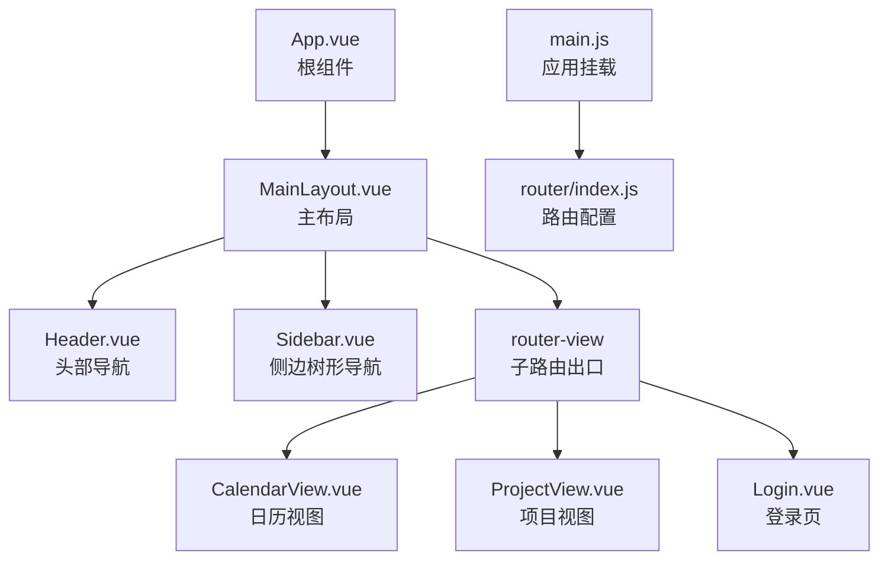
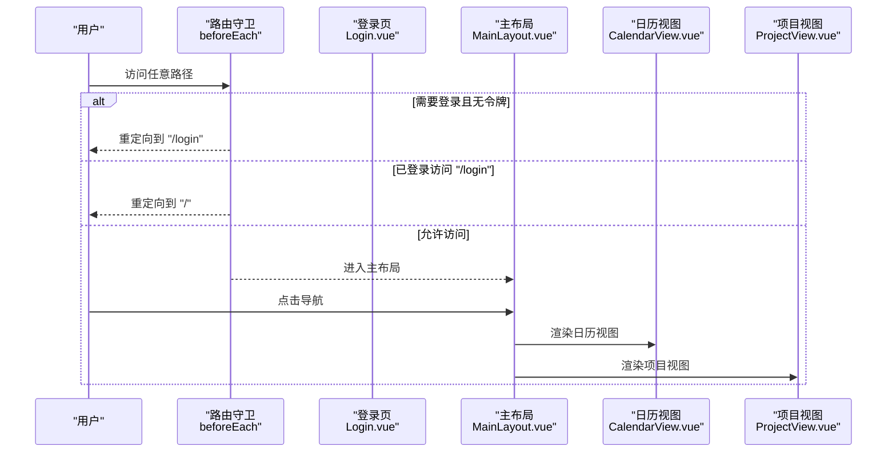
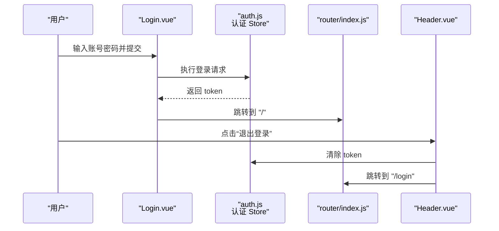
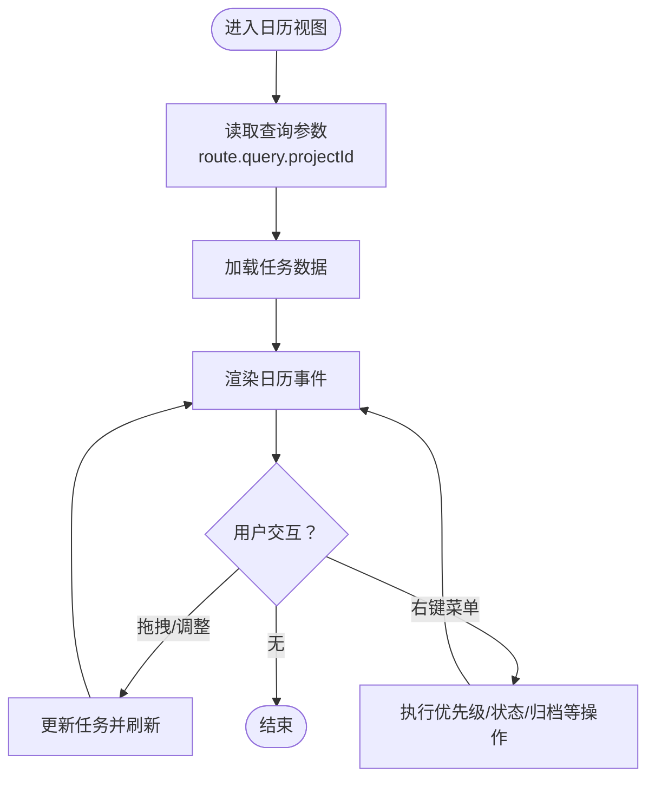
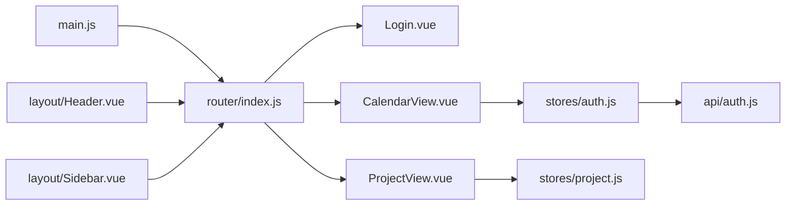

# 路由系统

<cite>
**本文引用的文件**
- [frontend/src/router/index.js](file://frontend/src/router/index.js)
- [frontend/src/main.js](file://frontend/src/main.js)
- [frontend/src/App.vue](file://frontend/src/App.vue)
- [frontend/src/layout/MainLayout.vue](file://frontend/src/layout/MainLayout.vue)
- [frontend/src/layout/Header.vue](file://frontend/src/layout/Header.vue)
- [frontend/src/layout/Sidebar.vue](file://frontend/src/layout/Sidebar.vue)
- [frontend/src/views/Login.vue](file://frontend/src/views/Login.vue)
- [frontend/src/views/CalendarView.vue](file://frontend/src/views/CalendarView.vue)
- [frontend/src/views/ProjectView.vue](file://frontend/src/views/ProjectView.vue)
- [frontend/src/stores/auth.js](file://frontend/src/stores/auth.js)
- [frontend/src/stores/app.js](file://frontend/src/stores/app.js)
- [frontend/src/stores/project.js](file://frontend/src/stores/project.js)
- [frontend/src/api/auth.js](file://frontend/src/api/auth.js)
</cite>

## 目录
1. [简介](#简介)
2. [项目结构](#项目结构)
3. [核心组件](#核心组件)
4. [架构总览](#架构总览)
5. [详细组件分析](#详细组件分析)
6. [依赖分析](#依赖分析)
7. [性能考虑](#性能考虑)
8. [故障排查指南](#故障排查指南)
9. [结论](#结论)
10. [附录](#附录)

## 简介
本文件面向“新世界”项目的前端路由系统，基于 Vue Router 进行配置与设计，覆盖以下主题：
- 路由表定义与嵌套路由
- 路由参数与查询字符串处理
- 导航控制（编程式与声明式）
- 全局前置守卫与鉴权逻辑
- 动态路由与懒加载
- 路由元信息（meta）的使用场景
- 实际导航与交互流程示例

## 项目结构
前端路由位于 frontend/src/router/index.js，应用入口在 frontend/src/main.js，根组件为 frontend/src/App.vue；页面布局由 MainLayout.vue 提供，包含 Header 与 Sidebar；视图组件包括 Login、CalendarView、ProjectView 等。

图表来源
- [frontend/src/App.vue:1-16](file://frontend/src/App.vue#L1-L16)
- [frontend/src/layout/MainLayout.vue:1-39](file://frontend/src/layout/MainLayout.vue#L1-L39)
- [frontend/src/layout/Header.vue:1-87](file://frontend/src/layout/Header.vue#L1-L87)
- [frontend/src/layout/Sidebar.vue:1-250](file://frontend/src/layout/Sidebar.vue#L1-L250)
- [frontend/src/views/CalendarView.vue:1-451](file://frontend/src/views/CalendarView.vue#L1-L451)
- [frontend/src/views/ProjectView.vue:1-130](file://frontend/src/views/ProjectView.vue#L1-L130)
- [frontend/src/views/Login.vue:1-203](file://frontend/src/views/Login.vue#L1-L203)
- [frontend/src/main.js:1-22](file://frontend/src/main.js#L1-L22)
- [frontend/src/router/index.js:1-50](file://frontend/src/router/index.js#L1-L50)

章节来源
- [frontend/src/router/index.js:1-50](file://frontend/src/router/index.js#L1-L50)
- [frontend/src/main.js:1-22](file://frontend/src/main.js#L1-L22)
- [frontend/src/App.vue:1-16](file://frontend/src/App.vue#L1-L16)

## 核心组件
- 路由器实例：在路由模块中创建并导出，使用 HTML5 历史模式，包含登录页与主布局的嵌套路由。
- 全局前置守卫：统一校验登录态与访问权限，未登录访问受保护路由时重定向至登录页；已登录访问登录页时重定向至首页。
- 主布局：包含侧边栏、头部与内容区，通过 router-view 渲染当前子路由。
- 视图组件：登录页、日历视图、项目视图等，均通过编程式导航或声明式导航进行路由跳转。

章节来源
- [frontend/src/router/index.js:1-50](file://frontend/src/router/index.js#L1-L50)
- [frontend/src/layout/MainLayout.vue:1-39](file://frontend/src/layout/MainLayout.vue#L1-L39)
- [frontend/src/views/Login.vue:1-203](file://frontend/src/views/Login.vue#L1-L203)
- [frontend/src/views/CalendarView.vue:1-451](file://frontend/src/views/CalendarView.vue#L1-L451)
- [frontend/src/views/ProjectView.vue:1-130](file://frontend/src/views/ProjectView.vue#L1-L130)

## 架构总览
路由系统采用集中式配置，结合全局守卫实现鉴权与导航控制。主布局承载导航与内容展示，视图组件负责业务逻辑与数据交互。

图表来源
- [frontend/src/router/index.js:37-47](file://frontend/src/router/index.js#L37-L47)
- [frontend/src/views/Login.vue:144-151](file://frontend/src/views/Login.vue#L144-L151)
- [frontend/src/layout/MainLayout.vue:1-11](file://frontend/src/layout/MainLayout.vue#L1-L11)
- [frontend/src/views/CalendarView.vue:1-451](file://frontend/src/views/CalendarView.vue#L1-L451)
- [frontend/src/views/ProjectView.vue:1-130](file://frontend/src/views/ProjectView.vue#L1-L130)

## 详细组件分析

### 路由表与嵌套路由
- 登录页路由：独立页面，meta 中设置 requiresAuth=false，支持直接访问。
- 主布局路由：根路径 "/" 对应主布局，内部包含子路由 children，包含日历视图与项目视图两个子页面。
- 子路由 meta：为每个子路由设置标题，用于页面标题或面包屑等用途。
- 重定向：主路由 redirect 指向默认子路由，提升用户体验。

章节来源
- [frontend/src/router/index.js:3-30](file://frontend/src/router/index.js#L3-L30)

### 路由参数与查询字符串处理
- 查询字符串：CalendarView 通过 useRoute 获取 route.query，支持从侧边栏或项目卡片传递 projectId 参数，实现按项目过滤日程。
- 编程式导航：Header 与 Sidebar 在用户操作时调用 router.push 或 router.push({ query })，携带查询参数实现筛选与跳转。
- 项目卡片点击：ProjectView 将 projectId 作为查询参数附加到 "/calendar"，实现从项目视图进入日历视图并自动筛选。

章节来源
- [frontend/src/views/CalendarView.vue:126-126](file://frontend/src/views/CalendarView.vue#L126-L126)
- [frontend/src/views/CalendarView.vue:202-207](file://frontend/src/views/CalendarView.vue#L202-L207)
- [frontend/src/layout/Header.vue:19-26](file://frontend/src/layout/Header.vue#L19-L26)
- [frontend/src/layout/Sidebar.vue:117-127](file://frontend/src/layout/Sidebar.vue#L117-L127)
- [frontend/src/views/ProjectView.vue:20-20](file://frontend/src/views/ProjectView.vue#L20-L20)

### 导航控制机制
- 声明式导航：通过 <router-link> 或模板中的点击事件触发 router.push，实现页面跳转。
- 编程式导航：在组件中注入 useRouter，使用 push、replace 等方法进行跳转与参数传递。
- 顶部导航：Header 提供“日历/项目”按钮，点击后 push 到对应路径。
- 侧边栏导航：Sidebar 根据节点类型（项目/任务）执行不同跳转策略，项目节点携带查询参数进入日历视图。

章节来源
- [frontend/src/layout/Header.vue:19-26](file://frontend/src/layout/Header.vue#L19-L26)
- [frontend/src/layout/Sidebar.vue:117-127](file://frontend/src/layout/Sidebar.vue#L117-L127)
- [frontend/src/views/ProjectView.vue:20-20](file://frontend/src/views/ProjectView.vue#L20-L20)

### 导航守卫实现
- 全局前置守卫：在 beforeEach 中读取本地存储的 token，判断目标路由是否需要登录；若需要而无 token，则重定向到登录页；若已登录访问登录页，则重定向到首页；否则放行。
- 组件内守卫：当前代码未使用 beforeRouteEnter/Update/Leave 等组件内守卫，如需细粒度控制可扩展。
- 路由独享守卫：当前代码未使用路由级别的 beforeEnter 守卫，如需对特定路由增加权限校验可扩展。

章节来源
- [frontend/src/router/index.js:37-47](file://frontend/src/router/index.js#L37-L47)

### 动态路由与懒加载
- 懒加载组件：各路由 component 使用函数返回动态 import，实现按需加载，减少首屏体积。
- 动态生成路由：当前未实现运行时动态生成路由，如需根据用户角色或权限动态增删路由，可在应用初始化阶段根据后端返回的权限清单构建路由表并调用 router.addRoute 动态添加。

章节来源
- [frontend/src/router/index.js:7-7](file://frontend/src/router/index.js#L7-L7)
- [frontend/src/router/index.js:19-19](file://frontend/src/router/index.js#L19-L19)
- [frontend/src/router/index.js:25-25](file://frontend/src/router/index.js#L25-L25)

### 路由元信息（meta）使用
- 权限控制：requiresAuth 控制是否需要登录；登录页设为 false，主布局及其子路由设为 true。
- 页面标题：子路由 meta 中设置 title，可用于页面标题或面包屑导航。
- 面包屑：当前未实现面包屑组件，可基于路由层级与 meta.title 构建面包屑导航。

章节来源
- [frontend/src/router/index.js:8-8](file://frontend/src/router/index.js#L8-L8)
- [frontend/src/router/index.js:13-13](file://frontend/src/router/index.js#L13-L13)
- [frontend/src/router/index.js:20-20](file://frontend/src/router/index.js#L20-L20)

### 登录与登出流程
- 登录：Login 组件通过表单校验后调用认证 Store 的登录方法，成功后写入 token 并跳转到首页 "/"。
- 登出：Header 下拉菜单触发登出，清空 token 并跳转到登录页。

图表来源
- [frontend/src/views/Login.vue:144-151](file://frontend/src/views/Login.vue#L144-L151)
- [frontend/src/stores/auth.js:16-21](file://frontend/src/stores/auth.js#L16-L21)
- [frontend/src/stores/auth.js:33-37](file://frontend/src/stores/auth.js#L33-L37)
- [frontend/src/layout/Header.vue:61-66](file://frontend/src/layout/Header.vue#L61-L66)
- [frontend/src/router/index.js:37-47](file://frontend/src/router/index.js#L37-L47)

### 日历视图与查询参数联动
- 初始化：组件挂载时读取 route.query.projectId 并刷新日程数据。
- 排期变更：拖拽/调整事件时根据当前查询参数刷新数据。
- 右键菜单：根据上下文任务 ID 更新优先级/状态/归档等，并按查询参数刷新。

图表来源
- [frontend/src/views/CalendarView.vue:126-126](file://frontend/src/views/CalendarView.vue#L126-L126)
- [frontend/src/views/CalendarView.vue:202-207](file://frontend/src/views/CalendarView.vue#L202-L207)
- [frontend/src/views/CalendarView.vue:268-292](file://frontend/src/views/CalendarView.vue#L268-L292)
- [frontend/src/views/CalendarView.vue:295-338](file://frontend/src/views/CalendarView.vue#L295-L338)

## 依赖分析
- 应用入口 main.js 引入并安装 router 插件，确保路由能力可用。
- 主布局 MainLayout.vue 包含 Header 与 Sidebar，二者均依赖 router 进行导航。
- 视图组件通过 useRoute/useRouter 获取路由信息与执行导航。
- 认证 Store 与 API 层配合，提供登录/注册/获取用户信息能力，支撑全局守卫的鉴权逻辑。

图表来源
- [frontend/src/main.js:18-19](file://frontend/src/main.js#L18-L19)
- [frontend/src/router/index.js:1-50](file://frontend/src/router/index.js#L1-L50)
- [frontend/src/views/Login.vue:75-76](file://frontend/src/views/Login.vue#L75-L76)
- [frontend/src/views/CalendarView.vue:106-106](file://frontend/src/views/CalendarView.vue#L106-L106)
- [frontend/src/views/ProjectView.vue:68-74](file://frontend/src/views/ProjectView.vue#L68-L74)
- [frontend/src/layout/Header.vue:44-52](file://frontend/src/layout/Header.vue#L44-L52)
- [frontend/src/layout/Sidebar.vue:92-102](file://frontend/src/layout/Sidebar.vue#L92-L102)
- [frontend/src/stores/auth.js:1-41](file://frontend/src/stores/auth.js#L1-L41)
- [frontend/src/stores/project.js:1-26](file://frontend/src/stores/project.js#L1-L26)
- [frontend/src/api/auth.js:1-14](file://frontend/src/api/auth.js#L1-L14)

章节来源
- [frontend/src/main.js:1-22](file://frontend/src/main.js#L1-L22)
- [frontend/src/router/index.js:1-50](file://frontend/src/router/index.js#L1-L50)
- [frontend/src/layout/MainLayout.vue:1-39](file://frontend/src/layout/MainLayout.vue#L1-L39)
- [frontend/src/layout/Header.vue:1-87](file://frontend/src/layout/Header.vue#L1-L87)
- [frontend/src/layout/Sidebar.vue:1-250](file://frontend/src/layout/Sidebar.vue#L1-L250)
- [frontend/src/views/Login.vue:1-203](file://frontend/src/views/Login.vue#L1-L203)
- [frontend/src/views/CalendarView.vue:1-451](file://frontend/src/views/CalendarView.vue#L1-L451)
- [frontend/src/views/ProjectView.vue:1-130](file://frontend/src/views/ProjectView.vue#L1-L130)
- [frontend/src/stores/auth.js:1-41](file://frontend/src/stores/auth.js#L1-L41)
- [frontend/src/stores/project.js:1-26](file://frontend/src/stores/project.js#L1-L26)
- [frontend/src/api/auth.js:1-14](file://frontend/src/api/auth.js#L1-L14)

## 性能考虑
- 懒加载组件：路由组件采用动态 import，减少初始包体，提升首屏加载速度。
- 路由守卫轻量：仅读取本地 token，避免复杂计算，保证守卫执行效率。
- 数据按需加载：日历视图根据查询参数按项目筛选数据，避免一次性加载全部数据。

## 故障排查指南
- 无法进入受保护页面
  - 检查本地是否存在有效 token；若无则会被重定向到登录页。
  - 确认路由 meta.requiresAuth 设置正确。
- 已登录却无法访问登录页
  - 确认守卫逻辑是否将已登录用户重定向到首页。
- 日历视图未显示筛选结果
  - 检查侧边栏或项目卡片是否正确传递了查询参数 projectId。
  - 确认组件挂载时是否读取并使用了 route.query。
- 登录/登出异常
  - 检查认证 Store 是否正确写入/清除 token。
  - 确认登录成功后是否执行了正确的路由跳转。

章节来源
- [frontend/src/router/index.js:37-47](file://frontend/src/router/index.js#L37-L47)
- [frontend/src/views/Login.vue:144-151](file://frontend/src/views/Login.vue#L144-L151)
- [frontend/src/layout/Header.vue:61-66](file://frontend/src/layout/Header.vue#L61-L66)
- [frontend/src/views/CalendarView.vue:126-126](file://frontend/src/views/CalendarView.vue#L126-L126)
- [frontend/src/stores/auth.js:11-14](file://frontend/src/stores/auth.js#L11-L14)
- [frontend/src/stores/auth.js:33-37](file://frontend/src/stores/auth.js#L33-L37)

## 结论
本路由系统以简洁清晰的方式实现了基础鉴权、嵌套路由与懒加载，满足当前业务需求。后续可扩展点包括：组件内守卫与路由独享守卫、动态路由生成、面包屑导航与页面标题管理等，以进一步提升安全性与用户体验。

## 附录
- 路由配置示例（路径引用）
  - [路由表定义与嵌套路由:3-30](file://frontend/src/router/index.js#L3-L30)
  - [全局前置守卫:37-47](file://frontend/src/router/index.js#L37-L47)
- 导航与交互示例（路径引用）
  - [登录页跳转首页:144-151](file://frontend/src/views/Login.vue#L144-151)
  - [头部导航跳转:19-26](file://frontend/src/layout/Header.vue#L19-26)
  - [侧边栏导航与查询参数:117-127](file://frontend/src/layout/Sidebar.vue#L117-127)
  - [项目卡片跳转并传参:20-20](file://frontend/src/views/ProjectView.vue#L20-L20)
- 元信息与状态管理（路径引用）
  - [路由 meta 标题与鉴权:8-8](file://frontend/src/router/index.js#L8-L8)
  - [认证 Store 写入/清除 token:11-14](file://frontend/src/stores/auth.js#L11-L14)
  - [登出清理与跳转:33-37](file://frontend/src/stores/auth.js#L33-L37)
  - [应用 Store 控制侧边栏折叠:1-18](file://frontend/src/stores/app.js#L1-L18)
  - [项目 Store 管理树形数据与选中项:1-26](file://frontend/src/stores/project.js#L1-L26)