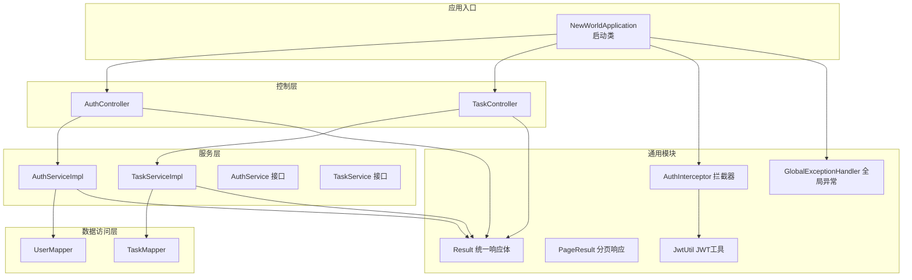
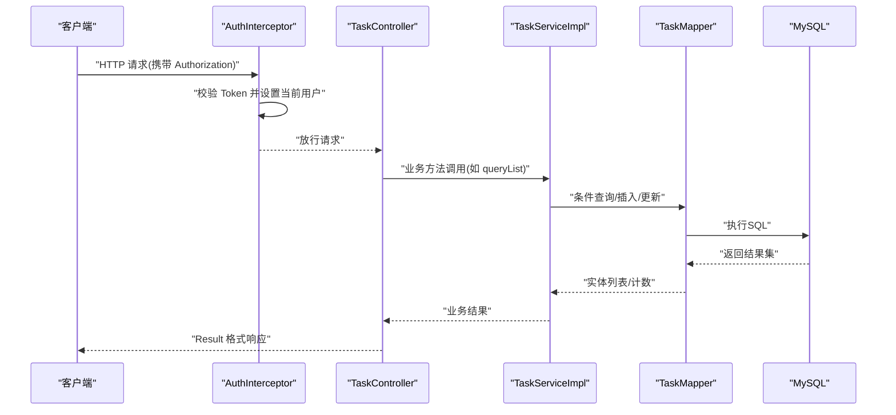
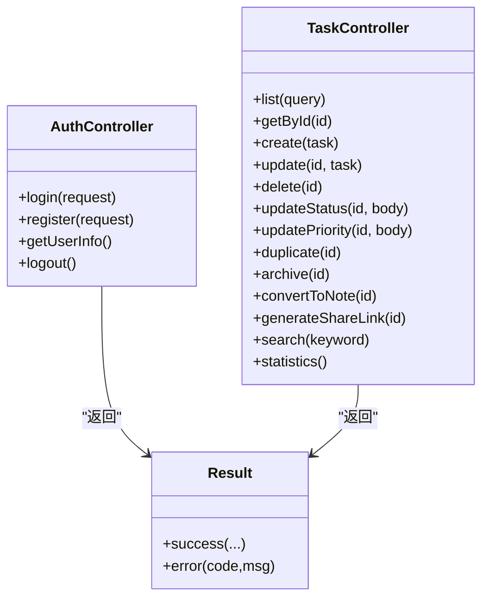
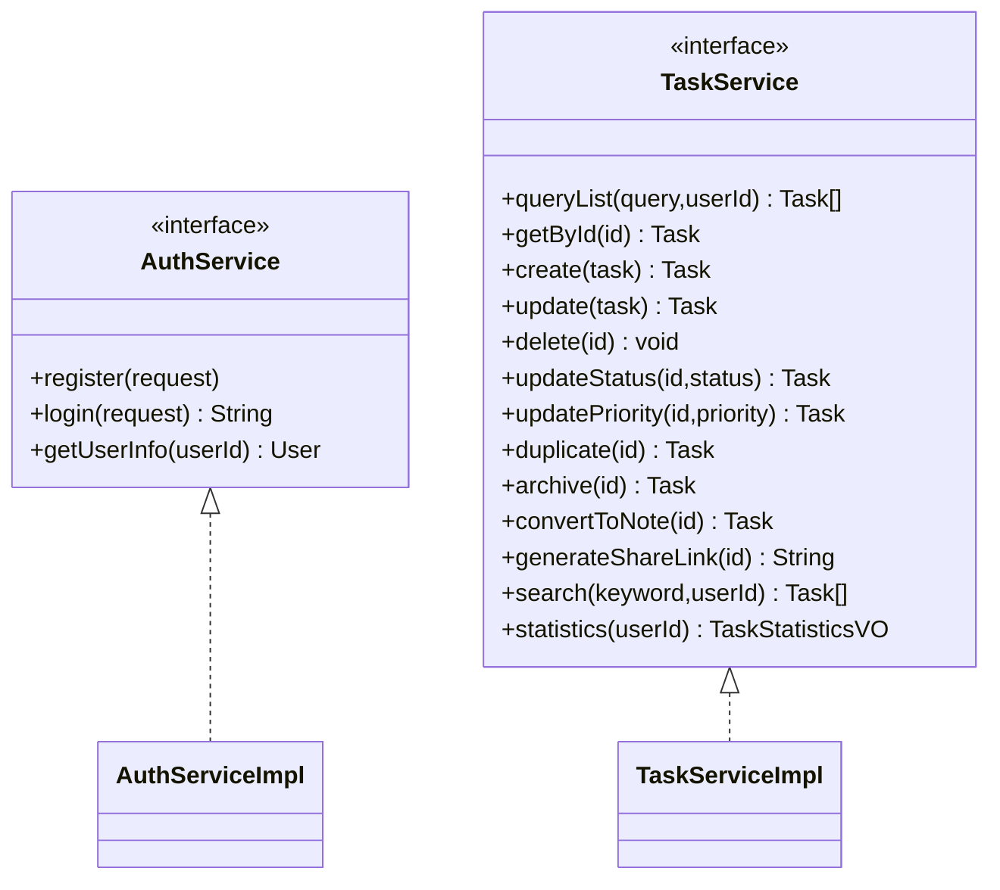
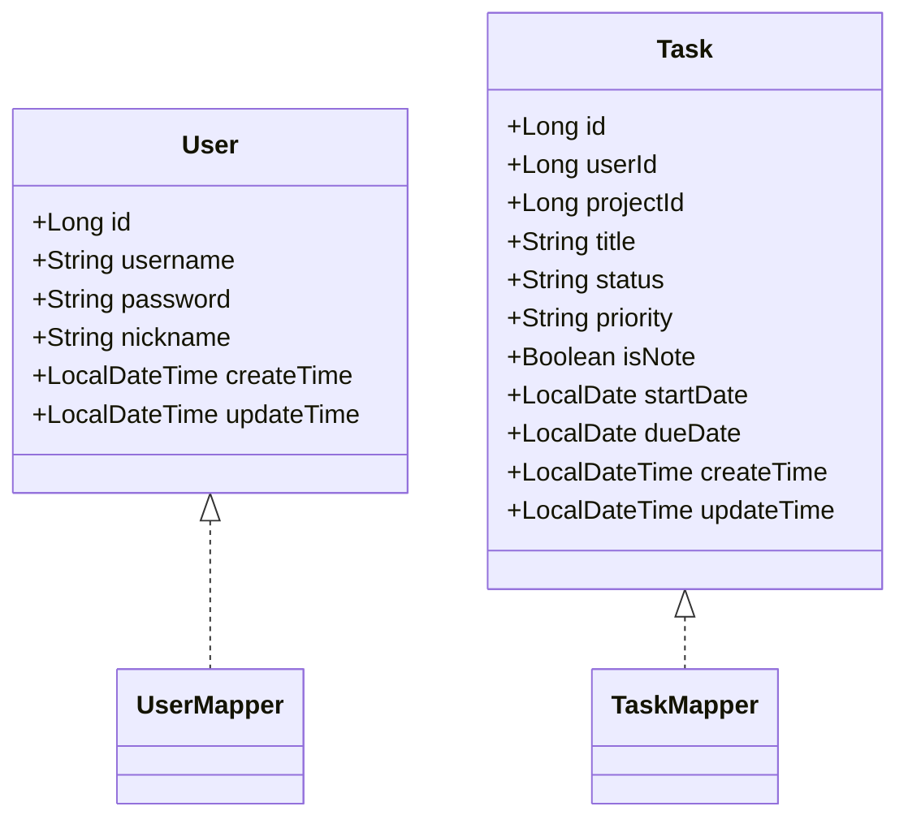
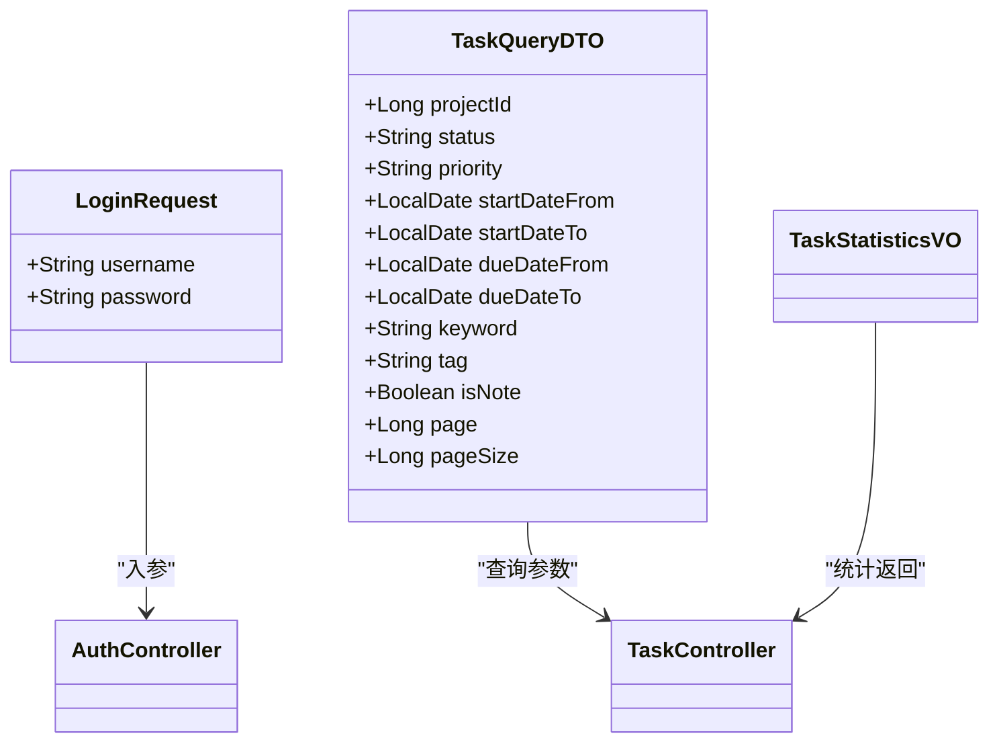
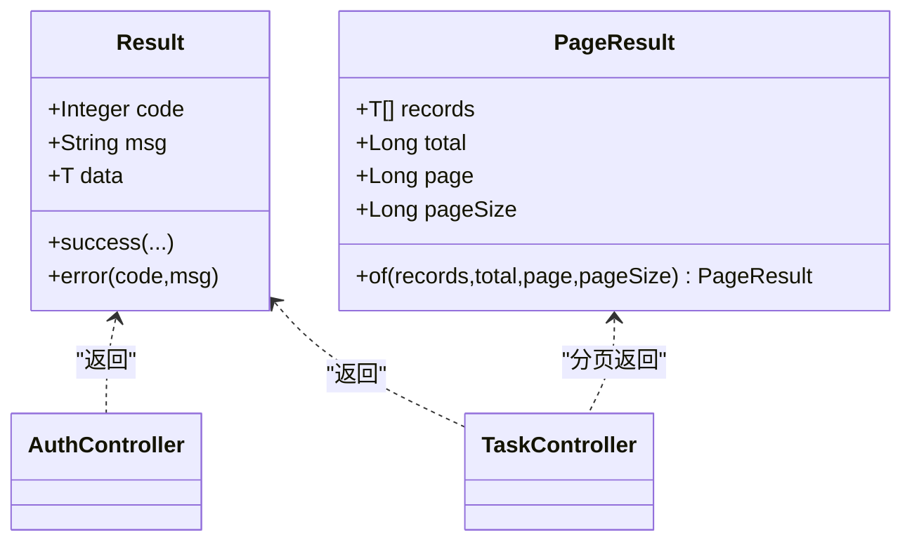
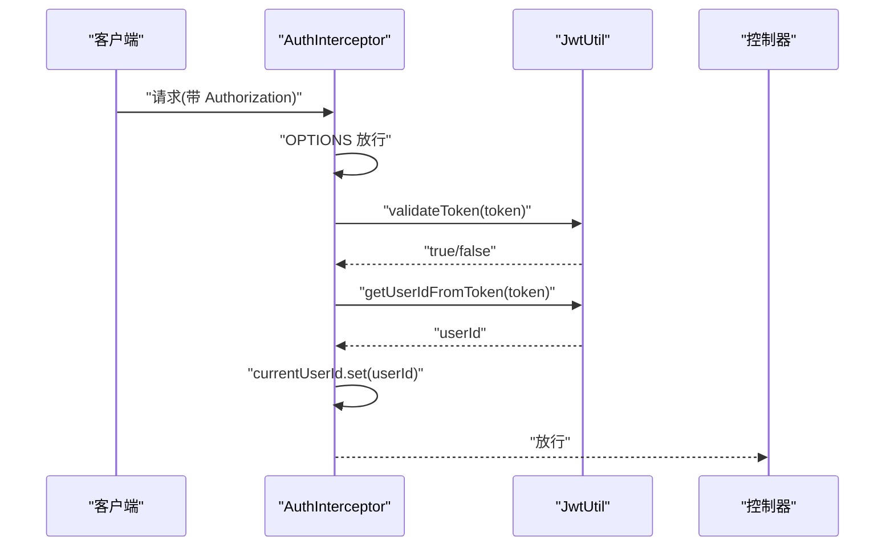
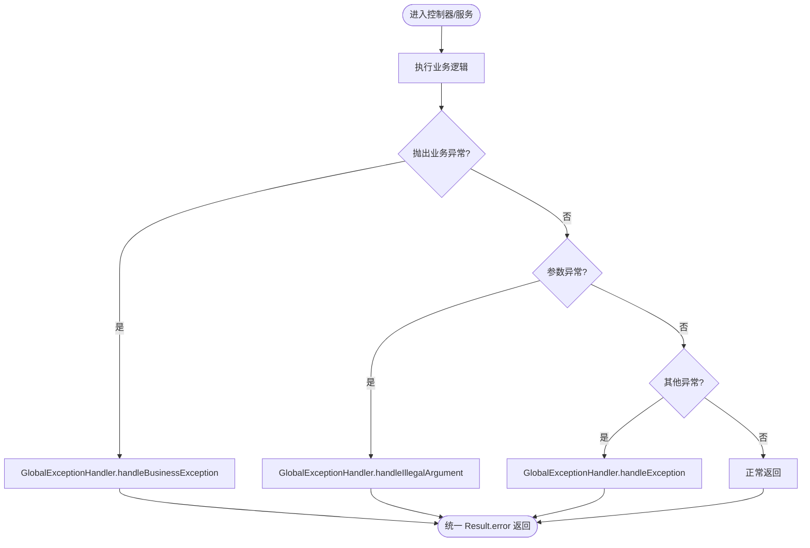
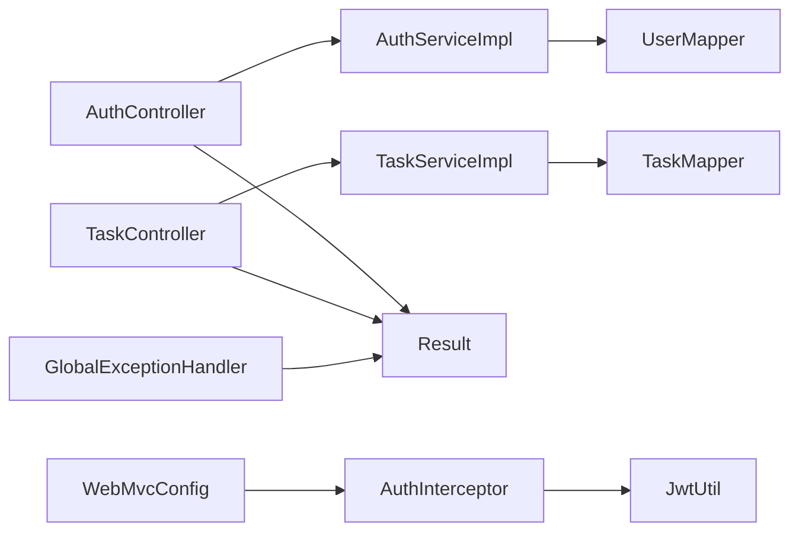

# MVC架构

<cite>
**本文引用的文件**
- [NewWorldApplication.java](file://backend/src/main/java/com/newworld/NewWorldApplication.java)
- [AuthController.java](file://backend/src/main/java/com/newworld/controller/AuthController.java)
- [TaskController.java](file://backend/src/main/java/com/newworld/controller/TaskController.java)
- [AuthServiceImpl.java](file://backend/src/main/java/com/newworld/service/impl/AuthServiceImpl.java)
- [TaskServiceImpl.java](file://backend/src/main/java/com/newworld/service/impl/TaskServiceImpl.java)
- [AuthService.java](file://backend/src/main/java/com/newworld/service/AuthService.java)
- [TaskService.java](file://backend/src/main/java/com/newworld/service/TaskService.java)
- [UserMapper.java](file://backend/src/main/java/com/newworld/mapper/UserMapper.java)
- [TaskMapper.java](file://backend/src/main/java/com/newworld/mapper/TaskMapper.java)
- [User.java](file://backend/src/main/java/com/newworld/entity/User.java)
- [Task.java](file://backend/src/main/java/com/newworld/entity/Task.java)
- [LoginRequest.java](file://backend/src/main/java/com/newworld/dto/LoginRequest.java)
- [TaskQueryDTO.java](file://backend/src/main/java/com/newworld/dto/TaskQueryDTO.java)
- [Result.java](file://backend/src/main/java/com/newworld/common/Result.java)
- [PageResult.java](file://backend/src/main/java/com/newworld/common/PageResult.java)
- [JwtUtil.java](file://backend/src/main/java/com/newworld/common/JwtUtil.java)
- [AuthInterceptor.java](file://backend/src/main/java/com/newworld/config/AuthInterceptor.java)
- [WebMvcConfig.java](file://backend/src/main/java/com/newworld/config/WebMvcConfig.java)
- [GlobalExceptionHandler.java](file://backend/src/main/java/com/newworld/common/exception/GlobalExceptionHandler.java)
- [application.yml](file://backend/src/main/resources/application.yml)
</cite>

## 目录
1. [简介](#简介)
2. [项目结构](#项目结构)
3. [核心组件](#核心组件)
4. [架构总览](#架构总览)
5. [详细组件分析](#详细组件分析)
6. [依赖分析](#依赖分析)
7. [性能考虑](#性能考虑)
8. [故障排查指南](#故障排查指南)
9. [结论](#结论)
10. [附录](#附录)

## 简介
本文件面向“新世界”项目的后端MVC架构，系统性阐述Spring MVC在本项目中的落地方式：Controller层负责请求接入与响应标准化；Service层封装业务逻辑与规则；Mapper层对接数据库访问；配合统一响应体、全局异常处理、JWT鉴权拦截器与Swagger文档集成，形成清晰的分层与职责边界。文档同时提供调用链路图、序列图与流程图，帮助开发者快速理解与遵循最佳实践。

## 项目结构
后端采用标准的MVC分层组织，主要包结构如下：
- common：通用工具与统一响应体、分页模型、JWT工具、全局异常处理
- config：Web配置、拦截器、MyBatis-Plus配置等
- controller：REST控制器，暴露HTTP接口
- service：业务服务接口与实现
- mapper：MyBatis-Plus映射接口
- dto：数据传输对象，承载请求参数与视图对象
- entity：领域实体
- resources：配置文件与Mapper XML

图表来源
- [NewWorldApplication.java:1-13](file://backend/src/main/java/com/newworld/NewWorldApplication.java#L1-L13)
- [AuthController.java:1-55](file://backend/src/main/java/com/newworld/controller/AuthController.java#L1-L55)
- [TaskController.java:1-112](file://backend/src/main/java/com/newworld/controller/TaskController.java#L1-L112)
- [AuthServiceImpl.java:1-69](file://backend/src/main/java/com/newworld/service/impl/AuthServiceImpl.java#L1-L69)
- [TaskServiceImpl.java:1-194](file://backend/src/main/java/com/newworld/service/impl/TaskServiceImpl.java#L1-L194)
- [UserMapper.java:1-10](file://backend/src/main/java/com/newworld/mapper/UserMapper.java#L1-L10)
- [TaskMapper.java:1-10](file://backend/src/main/java/com/newworld/mapper/TaskMapper.java#L1-L10)
- [Result.java:1-90](file://backend/src/main/java/com/newworld/common/Result.java#L1-L90)
- [PageResult.java:1-36](file://backend/src/main/java/com/newworld/common/PageResult.java#L1-L36)
- [JwtUtil.java:1-78](file://backend/src/main/java/com/newworld/common/JwtUtil.java#L1-L78)
- [AuthInterceptor.java:1-78](file://backend/src/main/java/com/newworld/config/AuthInterceptor.java#L1-L78)
- [GlobalExceptionHandler.java:1-35](file://backend/src/main/java/com/newworld/common/exception/GlobalExceptionHandler.java#L1-L35)

章节来源
- [NewWorldApplication.java:1-13](file://backend/src/main/java/com/newworld/NewWorldApplication.java#L1-L13)
- [application.yml:1-75](file://backend/src/main/resources/application.yml#L1-L75)

## 核心组件
- 控制器层：以REST风格暴露接口，使用注解进行路径映射与参数绑定，并通过统一响应体返回结果。
- 服务层：封装业务规则与流程，处理参数校验、状态变更、统计计算等。
- 数据访问层：基于MyBatis-Plus的BaseMapper，简化CRUD与条件构造。
- 统一响应体：Result/分页模型PageResult，规范前后端交互格式。
- 安全与拦截：JWT工具与拦截器，结合Web配置实现跨域、静态资源与拦截策略。
- 异常处理：全局异常处理器捕获业务异常与参数异常，统一返回。

章节来源
- [AuthController.java:17-54](file://backend/src/main/java/com/newworld/controller/AuthController.java#L17-L54)
- [TaskController.java:17-111](file://backend/src/main/java/com/newworld/controller/TaskController.java#L17-L111)
- [AuthServiceImpl.java:23-67](file://backend/src/main/java/com/newworld/service/impl/AuthServiceImpl.java#L23-L67)
- [TaskServiceImpl.java:23-192](file://backend/src/main/java/com/newworld/service/impl/TaskServiceImpl.java#L23-L192)
- [UserMapper.java:7-9](file://backend/src/main/java/com/newworld/mapper/UserMapper.java#L7-L9)
- [TaskMapper.java:7-9](file://backend/src/main/java/com/newworld/mapper/TaskMapper.java#L7-L9)
- [Result.java:22-64](file://backend/src/main/java/com/newworld/common/Result.java#L22-L64)
- [PageResult.java:27-34](file://backend/src/main/java/com/newworld/common/PageResult.java#L27-L34)
- [JwtUtil.java:29-76](file://backend/src/main/java/com/newworld/common/JwtUtil.java#L29-L76)
- [AuthInterceptor.java:30-64](file://backend/src/main/java/com/newworld/config/AuthInterceptor.java#L30-L64)
- [WebMvcConfig.java:19-51](file://backend/src/main/java/com/newworld/config/WebMvcConfig.java#L19-L51)
- [GlobalExceptionHandler.java:17-33](file://backend/src/main/java/com/newworld/common/exception/GlobalExceptionHandler.java#L17-L33)

## 架构总览
下图展示从客户端到数据库的典型调用链路，涵盖鉴权拦截、控制器处理、服务编排与数据访问。

图表来源
- [AuthController.java:27-31](file://backend/src/main/java/com/newworld/controller/AuthController.java#L27-L31)
- [TaskController.java:27-31](file://backend/src/main/java/com/newworld/controller/TaskController.java#L27-L31)
- [TaskServiceImpl.java:24-44](file://backend/src/main/java/com/newworld/service/impl/TaskServiceImpl.java#L24-L44)
- [TaskMapper.java:7-9](file://backend/src/main/java/com/newworld/mapper/TaskMapper.java#L7-L9)

## 详细组件分析

### 控制器层（RESTful API 设计）
- 认证控制器：提供登录、注册、获取当前用户信息、登出等接口，使用统一响应体返回。
- 任务控制器：提供任务列表查询、详情、创建、更新、删除、状态/优先级变更、复制、归档、转笔记、生成分享链接、搜索与统计等接口。
- 参数验证：使用JSR-303注解在DTO中声明非空与约束，控制器层通过@Valid进行入参校验。
- 响应格式：统一使用Result<T>/PageResult<T>，确保前后端契约一致。

图表来源
- [AuthController.java:22-53](file://backend/src/main/java/com/newworld/controller/AuthController.java#L22-L53)
- [TaskController.java:23-109](file://backend/src/main/java/com/newworld/controller/TaskController.java#L23-L109)
- [Result.java:22-64](file://backend/src/main/java/com/newworld/common/Result.java#L22-L64)

章节来源
- [AuthController.java:17-54](file://backend/src/main/java/com/newworld/controller/AuthController.java#L17-L54)
- [TaskController.java:17-111](file://backend/src/main/java/com/newworld/controller/TaskController.java#L17-L111)
- [LoginRequest.java:13-19](file://backend/src/main/java/com/newworld/dto/LoginRequest.java#L13-L19)
- [TaskQueryDTO.java:13-47](file://backend/src/main/java/com/newworld/dto/TaskQueryDTO.java#L13-L47)

### 服务层（业务逻辑封装与事务管理）
- 认证服务：注册前检查用户名重复，登录时校验用户与密码，生成JWT；查询用户信息时脱敏密码。
- 任务服务：实现多维查询（项目、状态、优先级、标签、日期范围、关键字）、默认值填充、状态与优先级更新、复制、归档、转笔记、分享链接生成、全文搜索与统计。
- 事务管理：基于Spring声明式事务的Service方法天然具备事务语义；复杂流程建议在Service层组合多个Mapper操作以保证一致性。

图表来源
- [AuthService.java](file://backend/src/main/java/com/newworld/service/AuthService.java)
- [TaskService.java](file://backend/src/main/java/com/newworld/service/TaskService.java)
- [AuthServiceImpl.java:14-68](file://backend/src/main/java/com/newworld/service/impl/AuthServiceImpl.java#L14-L68)
- [TaskServiceImpl.java:17-193](file://backend/src/main/java/com/newworld/service/impl/TaskServiceImpl.java#L17-L193)

章节来源
- [AuthServiceImpl.java:23-67](file://backend/src/main/java/com/newworld/service/impl/AuthServiceImpl.java#L23-L67)
- [TaskServiceImpl.java:23-192](file://backend/src/main/java/com/newworld/service/impl/TaskServiceImpl.java#L23-L192)

### 数据访问层（Mapper与实体）
- Mapper接口：继承MyBatis-Plus的BaseMapper，自动获得常用CRUD能力。
- 实体类：标注注解定义表名与字段映射，配合全局驼峰命名策略。
- 查询构建：服务层使用LambdaQueryWrapper进行条件拼装，支持多条件组合与排序。

图表来源
- [User.java:11-94](file://backend/src/main/java/com/newworld/entity/User.java#L11-L94)
- [Task.java](file://backend/src/main/java/com/newworld/entity/Task.java)
- [UserMapper.java:7-9](file://backend/src/main/java/com/newworld/mapper/UserMapper.java#L7-L9)
- [TaskMapper.java:7-9](file://backend/src/main/java/com/newworld/mapper/TaskMapper.java#L7-L9)

章节来源
- [UserMapper.java:7-9](file://backend/src/main/java/com/newworld/mapper/UserMapper.java#L7-L9)
- [TaskMapper.java:7-9](file://backend/src/main/java/com/newworld/mapper/TaskMapper.java#L7-L9)
- [User.java:11-94](file://backend/src/main/java/com/newworld/entity/User.java#L11-L94)

### DTO与数据转换机制
- LoginRequest：登录请求参数，包含用户名与密码的非空校验。
- TaskQueryDTO：任务查询参数，支持项目、状态、优先级、日期范围、关键字、标签、是否笔记以及分页参数。
- 视图对象：如TaskStatisticsVO用于统计聚合结果，避免直接暴露实体细节。

图表来源
- [LoginRequest.java:11-36](file://backend/src/main/java/com/newworld/dto/LoginRequest.java#L11-L36)
- [TaskQueryDTO.java:11-144](file://backend/src/main/java/com/newworld/dto/TaskQueryDTO.java#L11-L144)
- [TaskController.java:27-31](file://backend/src/main/java/com/newworld/controller/TaskController.java#L27-L31)

章节来源
- [LoginRequest.java:13-19](file://backend/src/main/java/com/newworld/dto/LoginRequest.java#L13-L19)
- [TaskQueryDTO.java:13-47](file://backend/src/main/java/com/newworld/dto/TaskQueryDTO.java#L13-L47)

### 统一响应体与分页模型
- Result<T>：提供success/error多种重载，统一返回code/msg/data结构。
- PageResult<T>：提供records/total/page/pageSize，便于前端分页渲染。

图表来源
- [Result.java:9-89](file://backend/src/main/java/com/newworld/common/Result.java#L9-L89)
- [PageResult.java:13-35](file://backend/src/main/java/com/newworld/common/PageResult.java#L13-L35)
- [AuthController.java:29-31](file://backend/src/main/java/com/newworld/controller/AuthController.java#L29-L31)
- [TaskController.java:108-109](file://backend/src/main/java/com/newworld/controller/TaskController.java#L108-L109)

章节来源
- [Result.java:22-64](file://backend/src/main/java/com/newworld/common/Result.java#L22-L64)
- [PageResult.java:27-34](file://backend/src/main/java/com/newworld/common/PageResult.java#L27-L34)

### 安全与拦截（JWT与拦截器）
- JWT工具：生成与解析Token，校验有效性，提取用户信息。
- 拦截器：预检请求放行，校验Authorization头，去除Bearer前缀，验证Token并注入当前用户ID到线程本地变量。
- Web配置：注册拦截器与跨域策略，开放Swagger静态资源。

图表来源
- [AuthInterceptor.java:30-64](file://backend/src/main/java/com/newworld/config/AuthInterceptor.java#L30-L64)
- [JwtUtil.java:61-76](file://backend/src/main/java/com/newworld/common/JwtUtil.java#L61-L76)
- [WebMvcConfig.java:19-51](file://backend/src/main/java/com/newworld/config/WebMvcConfig.java#L19-L51)

章节来源
- [JwtUtil.java:29-76](file://backend/src/main/java/com/newworld/common/JwtUtil.java#L29-L76)
- [AuthInterceptor.java:30-77](file://backend/src/main/java/com/newworld/config/AuthInterceptor.java#L30-L77)
- [WebMvcConfig.java:19-51](file://backend/src/main/java/com/newworld/config/WebMvcConfig.java#L19-L51)

### 全局异常处理
- 捕获业务异常、参数异常与通用异常，统一返回Result.error格式，便于前端提示与日志追踪。

图表来源
- [GlobalExceptionHandler.java:17-33](file://backend/src/main/java/com/newworld/common/exception/GlobalExceptionHandler.java#L17-L33)

章节来源
- [GlobalExceptionHandler.java:17-33](file://backend/src/main/java/com/newworld/common/exception/GlobalExceptionHandler.java#L17-L33)

## 依赖分析
- 控制器依赖服务接口，服务实现依赖Mapper接口，Mapper依赖实体类。
- 统一响应体与拦截器贯穿各层，异常处理作为横切关注点。
- 配置类注册拦截器与跨域策略，影响所有控制器。

图表来源
- [AuthController.java:22-23](file://backend/src/main/java/com/newworld/controller/AuthController.java#L22-L23)
- [TaskController.java:23](file://backend/src/main/java/com/newworld/controller/TaskController.java#L23)
- [AuthServiceImpl.java:17-21](file://backend/src/main/java/com/newworld/service/impl/AuthServiceImpl.java#L17-L21)
- [TaskServiceImpl.java:20-21](file://backend/src/main/java/com/newworld/service/impl/TaskServiceImpl.java#L20-L21)
- [UserMapper.java:7-9](file://backend/src/main/java/com/newworld/mapper/UserMapper.java#L7-L9)
- [TaskMapper.java:7-9](file://backend/src/main/java/com/newworld/mapper/TaskMapper.java#L7-L9)
- [Result.java:22-64](file://backend/src/main/java/com/newworld/common/Result.java#L22-L64)
- [AuthInterceptor.java:21-22](file://backend/src/main/java/com/newworld/config/AuthInterceptor.java#L21-L22)
- [JwtUtil.java:15](file://backend/src/main/java/com/newworld/common/JwtUtil.java#L15)
- [WebMvcConfig.java:17](file://backend/src/main/java/com/newworld/config/WebMvcConfig.java#L17)
- [GlobalExceptionHandler.java:12](file://backend/src/main/java/com/newworld/common/exception/GlobalExceptionHandler.java#L12)

章节来源
- [application.yml:36-50](file://backend/src/main/resources/application.yml#L36-L50)

## 性能考虑
- SQL优化：合理使用条件构造器，避免N+1查询；对高频查询建立必要索引。
- 分页策略：限制最大分页大小，避免超大offset导致慢查询。
- 缓存：Redis可用于热点数据与会话缓存，降低数据库压力。
- 序列化：Jackson日期格式与时区配置需与前端保持一致，减少解析开销。
- 日志：生产环境适度降低日志级别，避免IO瓶颈。

## 故障排查指南
- 401未登录：检查请求头Authorization是否存在且未带Bearer前缀；确认Token未过期。
- 参数校验失败：检查DTO字段注解与前端传参是否匹配。
- 业务异常：查看全局异常日志，定位具体业务分支。
- 跨域问题：确认WebMvcConfig中跨域配置与放行路径。

章节来源
- [AuthInterceptor.java:37-57](file://backend/src/main/java/com/newworld/config/AuthInterceptor.java#L37-L57)
- [GlobalExceptionHandler.java:17-33](file://backend/src/main/java/com/newworld/common/exception/GlobalExceptionHandler.java#L17-L33)
- [WebMvcConfig.java:36-43](file://backend/src/main/java/com/newworld/config/WebMvcConfig.java#L36-L43)

## 结论
本项目严格遵循MVC分层架构，通过统一响应体、拦截器与异常处理，实现了清晰的职责划分与可维护的代码结构。控制器专注于请求接入与响应标准化，服务层封装业务规则与流程，Mapper层专注数据访问。配合JWT鉴权与Swagger文档，整体具备良好的扩展性与开发体验。

## 附录
- 启动类：位于应用根包，负责Spring Boot启动。
- 配置文件：集中管理数据源、Redis、MyBatis-Plus、Knife4j与JWT等关键配置。

章节来源
- [NewWorldApplication.java:6-11](file://backend/src/main/java/com/newworld/NewWorldApplication.java#L6-L11)
- [application.yml:10-75](file://backend/src/main/resources/application.yml#L10-L75)