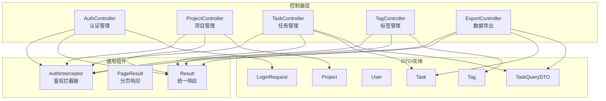
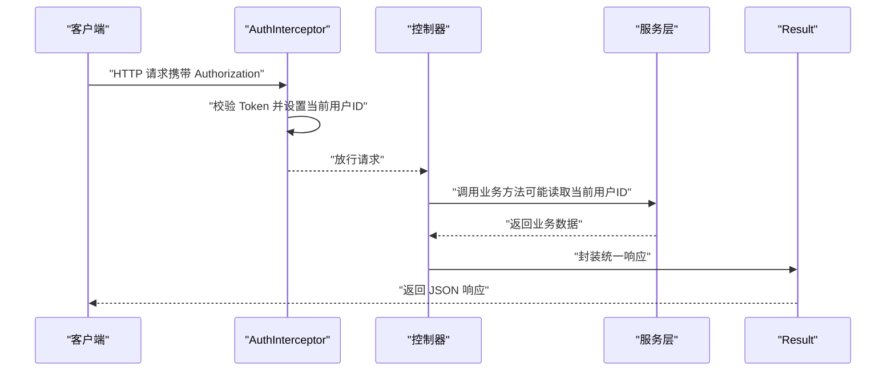
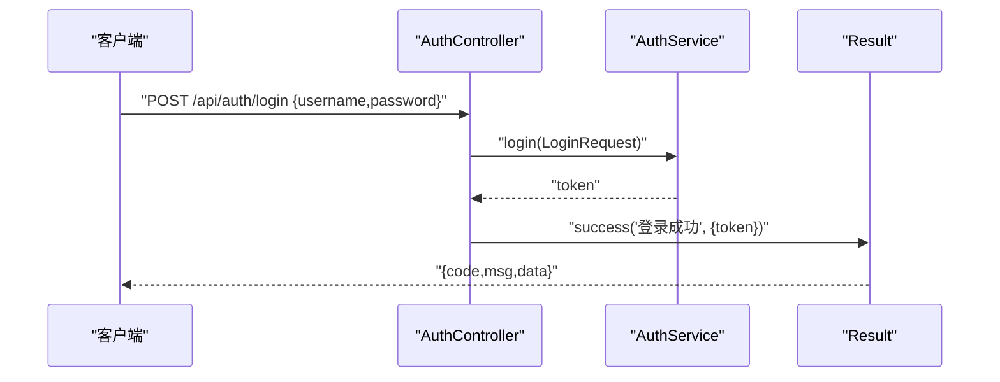
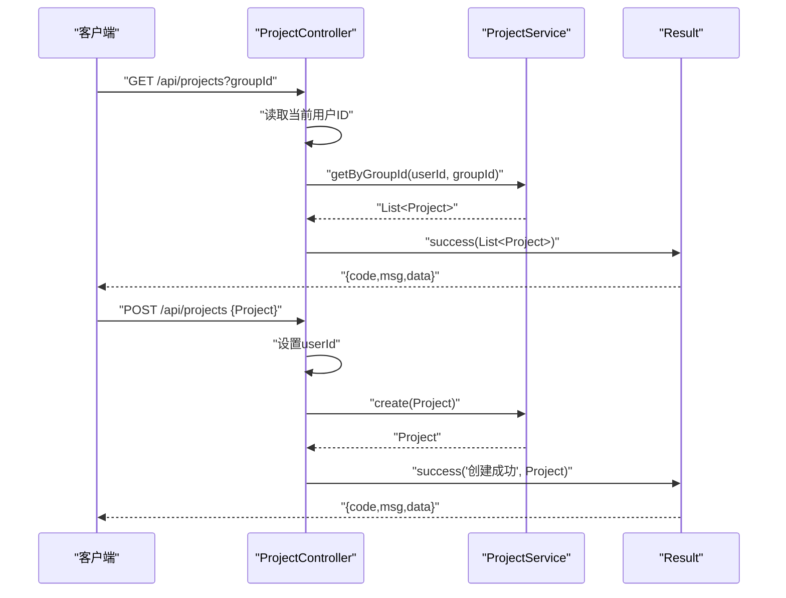
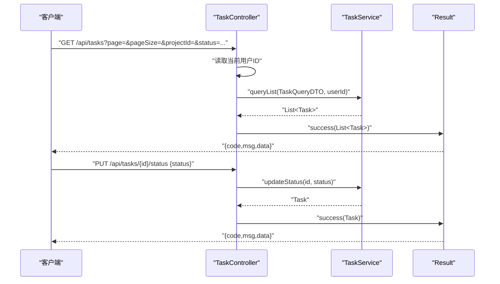
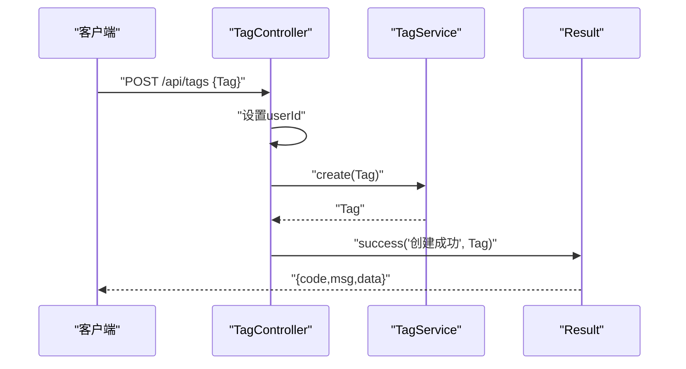
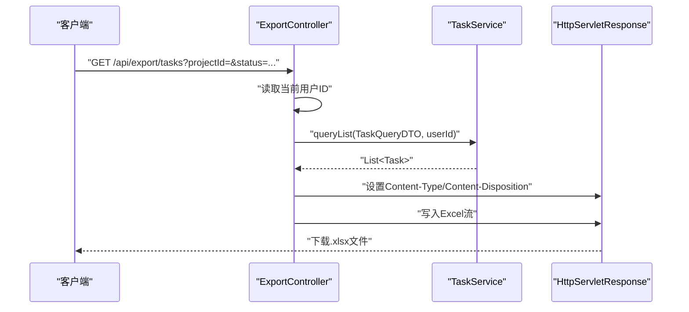
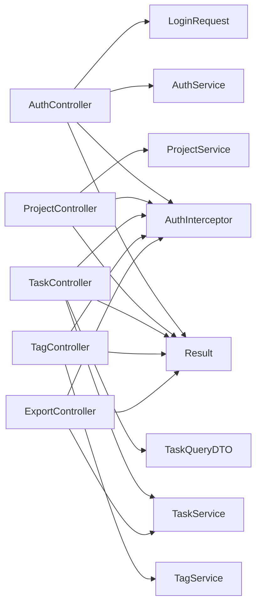

# 控制器层

<cite>
**本文引用的文件**
- [AuthController.java](file://backend/src/main/java/com/newworld/controller/AuthController.java)
- [ProjectController.java](file://backend/src/main/java/com/newworld/controller/ProjectController.java)
- [TaskController.java](file://backend/src/main/java/com/newworld/controller/TaskController.java)
- [TagController.java](file://backend/src/main/java/com/newworld/controller/TagController.java)
- [ExportController.java](file://backend/src/main/java/com/newworld/controller/ExportController.java)
- [LoginRequest.java](file://backend/src/main/java/com/newworld/dto/LoginRequest.java)
- [TaskQueryDTO.java](file://backend/src/main/java/com/newworld/dto/TaskQueryDTO.java)
- [Result.java](file://backend/src/main/java/com/newworld/common/Result.java)
- [PageResult.java](file://backend/src/main/java/com/newworld/common/PageResult.java)
- [AuthInterceptor.java](file://backend/src/main/java/com/newworld/config/AuthInterceptor.java)
- [AuthService.java](file://backend/src/main/java/com/newworld/service/AuthService.java)
- [User.java](file://backend/src/main/java/com/newworld/entity/User.java)
- [Task.java](file://backend/src/main/java/com/newworld/entity/Task.java)
- [Project.java](file://backend/src/main/java/com/newworld/entity/Project.java)
- [Tag.java](file://backend/src/main/java/com/newworld/entity/Tag.java)
</cite>

## 目录
1. [引言](#引言)
2. [项目结构](#项目结构)
3. [核心组件](#核心组件)
4. [架构总览](#架构总览)
5. [详细组件分析](#详细组件分析)
6. [依赖分析](#依赖分析)
7. [性能考虑](#性能考虑)
8. [故障排查指南](#故障排查指南)
9. [结论](#结论)
10. [附录](#附录)

## 引言
本文件聚焦于新世界项目的控制器层，系统性阐述 Spring MVC 控制器的设计模式与实现细节，覆盖 RESTful API 端点设计、HTTP 方法映射、请求参数处理、参数验证机制、异常处理策略以及响应格式标准化。文档逐一对以下控制器进行深入解析：AuthController 的用户认证处理、ProjectController 的项目管理、TaskController 的任务操作、TagController 的标签管理、ExportController 的数据导出。同时说明控制器与服务层的交互模式、数据传递机制，并通过图示展示关键流程。

## 项目结构
控制器层位于后端模块的 controller 包中，采用按功能域划分的包结构，每个控制器对应一个业务领域，统一通过统一响应包装类返回结果，确保前端交互一致性。

图表来源
- [AuthController.java:1-55](file://backend/src/main/java/com/newworld/controller/AuthController.java#L1-L55)
- [ProjectController.java:1-51](file://backend/src/main/java/com/newworld/controller/ProjectController.java#L1-L51)
- [TaskController.java:1-112](file://backend/src/main/java/com/newworld/controller/TaskController.java#L1-L112)
- [TagController.java:1-43](file://backend/src/main/java/com/newworld/controller/TagController.java#L1-L43)
- [ExportController.java:1-47](file://backend/src/main/java/com/newworld/controller/ExportController.java#L1-L47)
- [Result.java:1-90](file://backend/src/main/java/com/newworld/common/Result.java#L1-L90)
- [PageResult.java:1-36](file://backend/src/main/java/com/newworld/common/PageResult.java#L1-L36)
- [AuthInterceptor.java:1-78](file://backend/src/main/java/com/newworld/config/AuthInterceptor.java#L1-L78)
- [LoginRequest.java:1-37](file://backend/src/main/java/com/newworld/dto/LoginRequest.java#L1-L37)
- [TaskQueryDTO.java:1-145](file://backend/src/main/java/com/newworld/dto/TaskQueryDTO.java#L1-L145)
- [User.java:1-95](file://backend/src/main/java/com/newworld/entity/User.java#L1-L95)
- [Project.java:1-117](file://backend/src/main/java/com/newworld/entity/Project.java#L1-L117)
- [Task.java:1-184](file://backend/src/main/java/com/newworld/entity/Task.java#L1-L184)
- [Tag.java:1-72](file://backend/src/main/java/com/newworld/entity/Tag.java#L1-L72)

章节来源
- [AuthController.java:1-55](file://backend/src/main/java/com/newworld/controller/AuthController.java#L1-L55)
- [ProjectController.java:1-51](file://backend/src/main/java/com/newworld/controller/ProjectController.java#L1-L51)
- [TaskController.java:1-112](file://backend/src/main/java/com/newworld/controller/TaskController.java#L1-L112)
- [TagController.java:1-43](file://backend/src/main/java/com/newworld/controller/TagController.java#L1-L43)
- [ExportController.java:1-47](file://backend/src/main/java/com/newworld/controller/ExportController.java#L1-L47)

## 核心组件
- 统一响应包装 Result<T>：提供 success/error 多种静态工厂方法，统一返回 code/msg/data 结构，简化前端处理。
- 分页响应包装 PageResult<T>：用于需要分页的查询场景，封装 records/total/page/pageSize 字段。
- 鉴权拦截器 AuthInterceptor：在请求进入控制器前校验 Authorization 头部的 JWT，解析用户信息并注入到线程本地变量，供控制器读取当前用户 ID。
- DTO 对象：LoginRequest（登录/注册输入）、TaskQueryDTO（任务查询条件）等，承载请求参数并支持 Bean Validation。
- 实体对象：User、Project、Task、Tag 等，作为服务层与持久层之间的数据载体。

章节来源
- [Result.java:1-90](file://backend/src/main/java/com/newworld/common/Result.java#L1-L90)
- [PageResult.java:1-36](file://backend/src/main/java/com/newworld/common/PageResult.java#L1-L36)
- [AuthInterceptor.java:1-78](file://backend/src/main/java/com/newworld/config/AuthInterceptor.java#L1-L78)
- [LoginRequest.java:1-37](file://backend/src/main/java/com/newworld/dto/LoginRequest.java#L1-L37)
- [TaskQueryDTO.java:1-145](file://backend/src/main/java/com/newworld/dto/TaskQueryDTO.java#L1-L145)
- [User.java:1-95](file://backend/src/main/java/com/newworld/entity/User.java#L1-L95)
- [Project.java:1-117](file://backend/src/main/java/com/newworld/entity/Project.java#L1-L117)
- [Task.java:1-184](file://backend/src/main/java/com/newworld/entity/Task.java#L1-L184)
- [Tag.java:1-72](file://backend/src/main/java/com/newworld/entity/Tag.java#L1-L72)

## 架构总览
控制器层遵循典型的 MVC 分层：控制器负责接收 HTTP 请求、参数绑定与校验、调用服务层执行业务逻辑、组装统一响应返回给客户端。鉴权拦截器在控制器之前完成 Token 校验与用户上下文注入，确保控制器无需重复处理认证细节。

图表来源
- [AuthInterceptor.java:30-58](file://backend/src/main/java/com/newworld/config/AuthInterceptor.java#L30-L58)
- [AuthController.java:43-46](file://backend/src/main/java/com/newworld/controller/AuthController.java#L43-L46)
- [ProjectController.java:24-26](file://backend/src/main/java/com/newworld/controller/ProjectController.java#L24-L26)
- [TaskController.java:27-30](file://backend/src/main/java/com/newworld/controller/TaskController.java#L27-L30)
- [TagController.java:23-25](file://backend/src/main/java/com/newworld/controller/TagController.java#L23-L25)
- [Result.java:22-50](file://backend/src/main/java/com/newworld/common/Result.java#L22-L50)

## 详细组件分析

### AuthController：用户认证处理
- 职责概述
  - 提供登录、注册、获取当前用户信息、退出登录等接口。
  - 使用 DTO LoginRequest 接收用户名/密码，通过服务层 AuthService 完成认证与用户信息查询。
  - 返回统一响应 Result，其中登录接口额外封装 token。
- 关键端点
  - POST /api/auth/login：接收 LoginRequest，返回 Result<Map<String,String>>，data 中包含 token。
  - POST /api/auth/register：接收 LoginRequest，返回 Result<Void>。
  - GET /api/auth/user-info：读取当前用户 ID，返回 Result<User>。
  - POST /api/auth/logout：返回 Result<Void>。
- 参数验证与异常
  - LoginRequest 使用 @NotBlank 校验用户名与密码非空；控制器层通过 @Valid 触发校验。
  - 未登录或 Token 无效由拦截器抛出业务异常，统一交由全局异常处理器处理。
- 响应格式
  - 所有响应通过 Result.success(...) 或 Result.error(...) 封装，code=200 表示成功，msg 描述操作结果，data 携带具体数据。

图表来源
- [AuthController.java:25-32](file://backend/src/main/java/com/newworld/controller/AuthController.java#L25-L32)
- [AuthService.java:16-17](file://backend/src/main/java/com/newworld/service/AuthService.java#L16-L17)
- [LoginRequest.java:13-19](file://backend/src/main/java/com/newworld/dto/LoginRequest.java#L13-L19)
- [Result.java:22-50](file://backend/src/main/java/com/newworld/common/Result.java#L22-L50)

章节来源
- [AuthController.java:1-55](file://backend/src/main/java/com/newworld/controller/AuthController.java#L1-L55)
- [AuthService.java:1-24](file://backend/src/main/java/com/newworld/service/AuthService.java#L1-L24)
- [LoginRequest.java:1-37](file://backend/src/main/java/com/newworld/dto/LoginRequest.java#L1-L37)
- [Result.java:1-90](file://backend/src/main/java/com/newworld/common/Result.java#L1-L90)

### ProjectController：项目管理
- 职责概述
  - 提供按分组查询项目列表、新建、更新、删除项目等接口。
  - 新建时自动注入当前用户 ID，保证数据隔离。
- 关键端点
  - GET /api/projects?groupId=...：按分组过滤项目列表。
  - POST /api/projects：新建项目，设置 userId 后调用服务层创建。
  - PUT /api/projects/{id}：更新项目。
  - DELETE /api/projects/{id}：删除项目。
- 参数与数据流
  - 查询参数 groupId：可选，用于按分组筛选。
  - 请求体 Project：新建/更新时使用。
  - 当前用户 ID 通过 AuthInterceptor.getCurrentUserId() 注入。
- 响应格式
  - 列表与单个资源均通过 Result.success(...) 返回。

图表来源
- [ProjectController.java:22-35](file://backend/src/main/java/com/newworld/controller/ProjectController.java#L22-L35)
- [ProjectController.java:37-49](file://backend/src/main/java/com/newworld/controller/ProjectController.java#L37-L49)
- [AuthInterceptor.java:66-72](file://backend/src/main/java/com/newworld/config/AuthInterceptor.java#L66-L72)
- [Result.java:22-50](file://backend/src/main/java/com/newworld/common/Result.java#L22-L50)

章节来源
- [ProjectController.java:1-51](file://backend/src/main/java/com/newworld/controller/ProjectController.java#L1-L51)
- [Project.java:1-117](file://backend/src/main/java/com/newworld/entity/Project.java#L1-L117)
- [AuthInterceptor.java:1-78](file://backend/src/main/java/com/newworld/config/AuthInterceptor.java#L1-L78)
- [Result.java:1-90](file://backend/src/main/java/com/newworld/common/Result.java#L1-L90)

### TaskController：任务操作
- 职责概述
  - 提供任务列表查询、详情获取、新建、更新、删除、状态变更、优先级调整、复制、归档、转笔记、生成分享链接、关键词搜索、统计等全生命周期操作。
  - 支持复杂查询条件 TaskQueryDTO，包含项目、状态、优先级、日期区间、关键字、标签、是否笔记及分页参数。
- 关键端点
  - GET /api/tasks：查询任务列表，参数来自 TaskQueryDTO。
  - GET /api/tasks/{id}：获取单个任务。
  - POST /api/tasks：新建任务，注入 userId。
  - PUT /api/tasks/{id}：更新任务。
  - DELETE /api/tasks/{id}：删除任务。
  - PUT /api/tasks/{id}/status：更新状态。
  - PUT /api/tasks/{id}/priority：设置优先级。
  - PUT /api/tasks/{id}/duplicate：创建副本。
  - PUT /api/tasks/{id}/archive：归档任务。
  - PUT /api/tasks/{id}/convert-note：转为笔记。
  - GET /api/tasks/{id}/share-link：生成分享链接。
  - GET /api/tasks/search?keyword=...：按关键字搜索。
  - GET /api/tasks/statistics：任务统计。
- 参数与数据流
  - 查询参数：TaskQueryDTO 支持分页与多维过滤。
  - 路径变量：{id} 用于单资源操作。
  - 请求体：部分操作使用 Map<String,String> 从 body 读取字段。
  - 当前用户 ID 通过 AuthInterceptor.getCurrentUserId() 注入。
- 响应格式
  - 列表、单个资源、统计等均通过 Result.success(...) 返回。

图表来源
- [TaskController.java:25-31](file://backend/src/main/java/com/newworld/controller/TaskController.java#L25-L31)
- [TaskController.java:61-65](file://backend/src/main/java/com/newworld/controller/TaskController.java#L61-L65)
- [TaskQueryDTO.java:10-145](file://backend/src/main/java/com/newworld/dto/TaskQueryDTO.java#L10-L145)
- [AuthInterceptor.java:66-72](file://backend/src/main/java/com/newworld/config/AuthInterceptor.java#L66-L72)
- [Result.java:22-50](file://backend/src/main/java/com/newworld/common/Result.java#L22-L50)

章节来源
- [TaskController.java:1-112](file://backend/src/main/java/com/newworld/controller/TaskController.java#L1-L112)
- [TaskQueryDTO.java:1-145](file://backend/src/main/java/com/newworld/dto/TaskQueryDTO.java#L1-L145)
- [Task.java:1-184](file://backend/src/main/java/com/newworld/entity/Task.java#L1-L184)
- [AuthInterceptor.java:1-78](file://backend/src/main/java/com/newworld/config/AuthInterceptor.java#L1-L78)
- [Result.java:1-90](file://backend/src/main/java/com/newworld/common/Result.java#L1-L90)

### TagController：标签管理
- 职责概述
  - 提供标签列表查询、新建、删除接口。
  - 新建时自动注入当前用户 ID，保证数据隔离。
- 关键端点
  - GET /api/tags：获取当前用户标签列表。
  - POST /api/tags：新建标签，设置 userId 后调用服务层创建。
  - DELETE /api/tags/{id}：删除标签。
- 参数与数据流
  - 请求体 Tag：新建时使用。
  - 当前用户 ID 通过 AuthInterceptor.getCurrentUserId() 注入。
- 响应格式
  - 列表与单个资源通过 Result.success(...) 返回。

图表来源
- [TagController.java:28-34](file://backend/src/main/java/com/newworld/controller/TagController.java#L28-L34)
- [AuthInterceptor.java:66-72](file://backend/src/main/java/com/newworld/config/AuthInterceptor.java#L66-L72)
- [Result.java:22-50](file://backend/src/main/java/com/newworld/common/Result.java#L22-L50)

章节来源
- [TagController.java:1-43](file://backend/src/main/java/com/newworld/controller/TagController.java#L1-L43)
- [Tag.java:1-72](file://backend/src/main/java/com/newworld/entity/Tag.java#L1-L72)
- [AuthInterceptor.java:1-78](file://backend/src/main/java/com/newworld/config/AuthInterceptor.java#L1-L78)
- [Result.java:1-90](file://backend/src/main/java/com/newworld/common/Result.java#L1-L90)

### ExportController：数据导出
- 职责概述
  - 提供将任务数据导出为 Excel 的接口，基于 EasyExcel 实现。
  - 通过 TaskQueryDTO 过滤导出范围，设置响应头触发浏览器下载。
- 关键端点
  - GET /api/export/tasks：导出任务为 Excel，响应类型为 application/vnd.openxmlformats-officedocument.spreadsheetml.sheet。
- 参数与数据流
  - 查询参数：TaskQueryDTO 支持分页与多维过滤。
  - 输出：直接向 HttpServletResponse 写入 Excel 流。
- 响应格式
  - 该接口不返回 Result，而是直接输出文件流，适合浏览器下载场景。

图表来源
- [ExportController.java:30-45](file://backend/src/main/java/com/newworld/controller/ExportController.java#L30-L45)
- [TaskQueryDTO.java:10-145](file://backend/src/main/java/com/newworld/dto/TaskQueryDTO.java#L10-L145)
- [AuthInterceptor.java:66-72](file://backend/src/main/java/com/newworld/config/AuthInterceptor.java#L66-L72)

章节来源
- [ExportController.java:1-47](file://backend/src/main/java/com/newworld/controller/ExportController.java#L1-L47)
- [TaskQueryDTO.java:1-145](file://backend/src/main/java/com/newworld/dto/TaskQueryDTO.java#L1-L145)
- [Task.java:1-184](file://backend/src/main/java/com/newworld/entity/Task.java#L1-L184)
- [AuthInterceptor.java:1-78](file://backend/src/main/java/com/newworld/config/AuthInterceptor.java#L1-L78)

## 依赖分析
- 控制器对服务层的依赖：各控制器通过 @Autowired 注入对应的 Service 接口，实现业务编排与数据访问解耦。
- 控制器对通用组件的依赖：统一响应 Result/分页包装 PageResult，确保前后端契约一致。
- 控制器对 DTO/实体的依赖：LoginRequest、TaskQueryDTO 等用于参数接收与校验；User/Project/Task/Tag 等用于数据传输。
- 控制器对鉴权拦截器的依赖：通过 AuthInterceptor.getCurrentUserId() 获取当前用户上下文，避免在控制器内重复解析 Token。

图表来源
- [AuthController.java:22-23](file://backend/src/main/java/com/newworld/controller/AuthController.java#L22-L23)
- [ProjectController.java:19-20](file://backend/src/main/java/com/newworld/controller/ProjectController.java#L19-L20)
- [TaskController.java:22-23](file://backend/src/main/java/com/newworld/controller/TaskController.java#L22-L23)
- [TagController.java:18-19](file://backend/src/main/java/com/newworld/controller/TagController.java#L18-L19)
- [ExportController.java:27-28](file://backend/src/main/java/com/newworld/controller/ExportController.java#L27-L28)
- [Result.java:1-90](file://backend/src/main/java/com/newworld/common/Result.java#L1-L90)
- [LoginRequest.java:1-37](file://backend/src/main/java/com/newworld/dto/LoginRequest.java#L1-L37)
- [TaskQueryDTO.java:1-145](file://backend/src/main/java/com/newworld/dto/TaskQueryDTO.java#L1-L145)
- [AuthInterceptor.java:1-78](file://backend/src/main/java/com/newworld/config/AuthInterceptor.java#L1-L78)

章节来源
- [AuthController.java:1-55](file://backend/src/main/java/com/newworld/controller/AuthController.java#L1-L55)
- [ProjectController.java:1-51](file://backend/src/main/java/com/newworld/controller/ProjectController.java#L1-L51)
- [TaskController.java:1-112](file://backend/src/main/java/com/newworld/controller/TaskController.java#L1-L112)
- [TagController.java:1-43](file://backend/src/main/java/com/newworld/controller/TagController.java#L1-L43)
- [ExportController.java:1-47](file://backend/src/main/java/com/newworld/controller/ExportController.java#L1-L47)

## 性能考虑
- 参数校验前置：通过 @Valid 与 Bean Validation 在控制器层尽早失败，减少无效调用到服务层的成本。
- 统一响应封装：Result/分页包装减少前端判断分支，提升交互效率。
- 导出接口优化：ExportController 直接输出流，避免中间对象序列化开销；建议结合 TaskQueryDTO 的分页参数控制导出规模，防止大查询导致内存压力。
- 鉴权拦截器：在拦截阶段完成 Token 校验与用户上下文注入，避免控制器重复逻辑，降低分支判断成本。

## 故障排查指南
- 未登录或 Token 失效
  - 现象：返回 401 错误，提示“未登录，请先登录”或“Token 已过期或无效，请重新登录”。
  - 排查：确认请求头 Authorization 是否正确携带 Bearer Token；检查拦截器预检请求放行逻辑。
- 参数校验失败
  - 现象：请求被拒绝，返回 400 或业务异常。
  - 排查：核对 LoginRequest/TaskQueryDTO 字段是否满足 @NotBlank/@Pattern 等约束。
- 当前用户 ID 为空
  - 现象：调用 AuthInterceptor.getCurrentUserId() 抛出未登录异常。
  - 排查：确认拦截器已正确解析 Token 并设置 ThreadLocal；检查拦截器 afterCompletion 是否清理完毕。
- 导出文件异常
  - 现象：浏览器无法下载或文件损坏。
  - 排查：确认 Content-Type 与 Content-Disposition 设置正确；检查 EasyExcel 写入流是否完整；核对 TaskQueryDTO 过滤条件是否合理。

章节来源
- [AuthInterceptor.java:30-58](file://backend/src/main/java/com/newworld/config/AuthInterceptor.java#L30-L58)
- [AuthInterceptor.java:66-72](file://backend/src/main/java/com/newworld/config/AuthInterceptor.java#L66-L72)
- [LoginRequest.java:13-19](file://backend/src/main/java/com/newworld/dto/LoginRequest.java#L13-L19)
- [ExportController.java:36-44](file://backend/src/main/java/com/newworld/controller/ExportController.java#L36-L44)

## 结论
控制器层通过清晰的 RESTful 设计、统一的参数校验与响应封装、以及鉴权拦截器的前置处理，实现了高内聚、低耦合的业务入口。AuthController、ProjectController、TaskController、TagController、ExportController 各司其职，配合 Result/PageResult 统一了前后端契约，提升了系统的可维护性与扩展性。建议在后续迭代中持续完善参数校验规则与异常处理策略，确保在复杂查询与大数据量导出场景下的稳定性与性能表现。

## 附录
- 统一响应结构
  - code：整型状态码，200 表示成功，500 表示服务器错误。
  - msg：字符串消息，描述操作结果。
  - data：泛型数据体，承载具体业务数据。
- 分页响应结构
  - records：当前页记录列表。
  - total：总记录数。
  - page：当前页码。
  - pageSize：每页大小。
- 鉴权上下文
  - 通过 AuthInterceptor 在请求进入控制器前注入当前用户 ID 与用户名，控制器可通过静态方法读取。