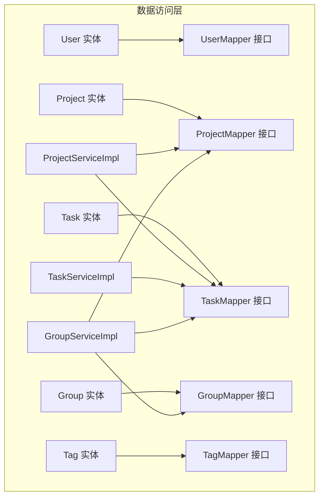
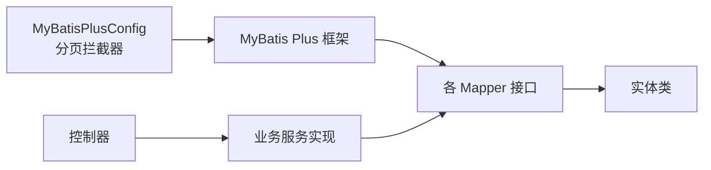
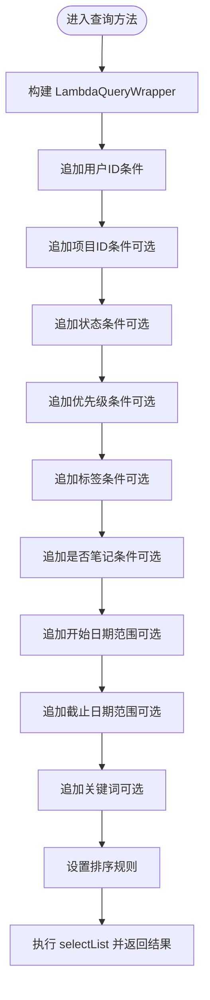
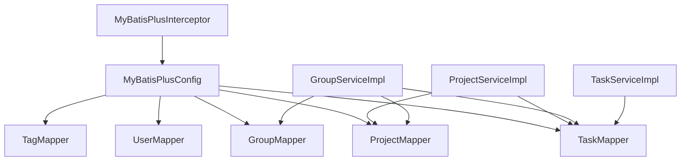

# 数据访问层

<cite>
**本文引用的文件**
- [UserMapper.java](file://backend/src/main/java/com/newworld/mapper/UserMapper.java)
- [ProjectMapper.java](file://backend/src/main/java/com/newworld/mapper/ProjectMapper.java)
- [TaskMapper.java](file://backend/src/main/java/com/newworld/mapper/TaskMapper.java)
- [GroupMapper.java](file://backend/src/main/java/com/newworld/mapper/GroupMapper.java)
- [TagMapper.java](file://backend/src/main/java/com/newworld/mapper/TagMapper.java)
- [User.java](file://backend/src/main/java/com/newworld/entity/User.java)
- [Project.java](file://backend/src/main/java/com/newworld/entity/Project.java)
- [Task.java](file://backend/src/main/java/com/newworld/entity/Task.java)
- [Group.java](file://backend/src/main/java/com/newworld/entity/Group.java)
- [Tag.java](file://backend/src/main/java/com/newworld/entity/Tag.java)
- [MyBatisPlusConfig.java](file://backend/src/main/java/com/newworld/config/MyBatisPlusConfig.java)
- [ProjectServiceImpl.java](file://backend/src/main/java/com/newworld/service/impl/ProjectServiceImpl.java)
- [TaskServiceImpl.java](file://backend/src/main/java/com/newworld/service/impl/TaskServiceImpl.java)
- [GroupServiceImpl.java](file://backend/src/main/java/com/newworld/service/impl/GroupServiceImpl.java)
</cite>

## 目录
1. [简介](#简介)
2. [项目结构](#项目结构)
3. [核心组件](#核心组件)
4. [架构总览](#架构总览)
5. [详细组件分析](#详细组件分析)
6. [依赖分析](#依赖分析)
7. [性能考虑](#性能考虑)
8. [故障排查指南](#故障排查指南)
9. [结论](#结论)
10. [附录](#附录)

## 简介
本文件面向“新世界”项目的后端数据访问层，系统性阐述 MyBatis Plus 在数据持久化中的应用与最佳实践。重点覆盖以下方面：
- Mapper 接口设计与职责边界
- 实体类字段映射、注解使用与关系配置
- 通用 CRUD、分页查询与条件构造器的使用
- 各 Mapper 的功能定位：UserMapper、ProjectMapper、TaskMapper、GroupMapper、TagMapper
- SQL 优化技巧、索引设计建议与性能调优方案
- 数据访问最佳实践与常见问题解决方案

## 项目结构
数据访问层位于 backend/src/main/java/com/newworld 下，主要由以下模块组成：
- entity：领域实体，承载数据库表到 Java 对象的映射
- mapper：MyBatis Plus Mapper 接口，声明数据访问方法
- service/impl：业务服务实现，组合 Mapper 完成复杂查询与事务控制
- config：MyBatis Plus 分页插件配置

图表来源
- [User.java:11-13](file://backend/src/main/java/com/newworld/entity/User.java#L11-L13)
- [Project.java:11-13](file://backend/src/main/java/com/newworld/entity/Project.java#L11-L13)
- [Task.java:12-14](file://backend/src/main/java/com/newworld/entity/Task.java#L12-L14)
- [Group.java:11-13](file://backend/src/main/java/com/newworld/entity/Group.java#L11-L13)
- [Tag.java:11-13](file://backend/src/main/java/com/newworld/entity/Tag.java#L11-L13)
- [UserMapper.java:7-9](file://backend/src/main/java/com/newworld/mapper/UserMapper.java#L7-L9)
- [ProjectMapper.java:7-9](file://backend/src/main/java/com/newworld/mapper/ProjectMapper.java#L7-L9)
- [TaskMapper.java:7-9](file://backend/src/main/java/com/newworld/mapper/TaskMapper.java#L7-L9)
- [GroupMapper.java:7-9](file://backend/src/main/java/com/newworld/mapper/GroupMapper.java#L7-L9)
- [TagMapper.java:7-9](file://backend/src/main/java/com/newworld/mapper/TagMapper.java#L7-L9)
- [ProjectServiceImpl.java:18-22](file://backend/src/main/java/com/newworld/service/impl/ProjectServiceImpl.java#L18-L22)
- [TaskServiceImpl.java:20-21](file://backend/src/main/java/com/newworld/service/impl/TaskServiceImpl.java#L20-L21)
- [GroupServiceImpl.java:24-31](file://backend/src/main/java/com/newworld/service/impl/GroupServiceImpl.java#L24-L31)

章节来源
- [MyBatisPlusConfig.java:15-20](file://backend/src/main/java/com/newworld/config/MyBatisPlusConfig.java#L15-L20)

## 核心组件
- Mapper 接口均继承 MyBatis Plus 的 BaseMapper，天然具备通用 CRUD 能力，无需手写 SQL 即可完成基础增删改查。
- 实体类通过注解完成表名、主键策略、字段填充等映射配置，确保 ORM 行为与数据库一致。
- 业务服务通过 LambdaQueryWrapper 组合复杂查询条件，结合分页插件实现高性能分页。

章节来源
- [UserMapper.java:7-9](file://backend/src/main/java/com/newworld/mapper/UserMapper.java#L7-L9)
- [ProjectMapper.java:7-9](file://backend/src/main/java/com/newworld/mapper/ProjectMapper.java#L7-L9)
- [TaskMapper.java:7-9](file://backend/src/main/java/com/newworld/mapper/TaskMapper.java#L7-L9)
- [GroupMapper.java:7-9](file://backend/src/main/java/com/newworld/mapper/GroupMapper.java#L7-L9)
- [TagMapper.java:7-9](file://backend/src/main/java/com/newworld/mapper/TagMapper.java#L7-L9)
- [User.java:11](file://backend/src/main/java/com/newworld/entity/User.java#L11)
- [Project.java:11](file://backend/src/main/java/com/newworld/entity/Project.java#L11)
- [Task.java:12](file://backend/src/main/java/com/newworld/entity/Task.java#L12)
- [Group.java:11](file://backend/src/main/java/com/newworld/entity/Group.java#L11)
- [Tag.java:11](file://backend/src/main/java/com/newworld/entity/Tag.java#L11)

## 架构总览
数据访问层采用“实体 + Mapper + 服务”的分层模式，MyBatis Plus 提供通用 CRUD 与分页能力，服务层负责业务编排与复杂查询。

图表来源
- [MyBatisPlusConfig.java:15-20](file://backend/src/main/java/com/newworld/config/MyBatisPlusConfig.java#L15-L20)
- [UserMapper.java:7-9](file://backend/src/main/java/com/newworld/mapper/UserMapper.java#L7-L9)
- [ProjectMapper.java:7-9](file://backend/src/main/java/com/newworld/mapper/ProjectMapper.java#L7-L9)
- [TaskMapper.java:7-9](file://backend/src/main/java/com/newworld/mapper/TaskMapper.java#L7-L9)
- [GroupMapper.java:7-9](file://backend/src/main/java/com/newworld/mapper/GroupMapper.java#L7-L9)
- [TagMapper.java:7-9](file://backend/src/main/java/com/newworld/mapper/TagMapper.java#L7-L9)

## 详细组件分析

### 实体类与字段映射
- 公共字段与自动填充
  - 所有实体均包含 createTime、updateTime 字段，并通过注解在插入与更新时自动填充，减少重复代码与出错概率。
- 主键策略
  - 使用自增主键策略，保证全局唯一且高效。
- 关系字段
  - Project.userId、Project.groupId；Task.userId、Task.projectId；Group.userId；Tag.userId 明确了用户维度的归属关系。
- 特殊字段
  - Task.priority、Task.status、Task.tag、Task.isNote、Task.sortOrder 等用于表达任务状态、优先级、类型与排序。

章节来源
- [User.java:31-37](file://backend/src/main/java/com/newworld/entity/User.java#L31-L37)
- [Project.java:37-43](file://backend/src/main/java/com/newworld/entity/Project.java#L37-L43)
- [Task.java:56-62](file://backend/src/main/java/com/newworld/entity/Task.java#L56-L62)
- [Group.java:28-34](file://backend/src/main/java/com/newworld/entity/Group.java#L28-L34)
- [Tag.java:28-30](file://backend/src/main/java/com/newworld/entity/Tag.java#L28-L30)
- [User.java:15](file://backend/src/main/java/com/newworld/entity/User.java#L15)
- [Project.java:15](file://backend/src/main/java/com/newworld/entity/Project.java#L15)
- [Task.java:16](file://backend/src/main/java/com/newworld/entity/Task.java#L16)
- [Group.java:15](file://backend/src/main/java/com/newworld/entity/Group.java#L15)
- [Tag.java:15](file://backend/src/main/java/com/newworld/entity/Tag.java#L15)

### Mapper 接口设计
- UserMapper：用户数据操作，继承 BaseMapper，支持通用 CRUD。
- ProjectMapper：项目信息管理，继承 BaseMapper，支持通用 CRUD。
- TaskMapper：任务数据处理，继承 BaseMapper，支持通用 CRUD。
- GroupMapper：分组关联，继承 BaseMapper，支持通用 CRUD。
- TagMapper：标签维护，继承 BaseMapper，支持通用 CRUD。

章节来源
- [UserMapper.java:7-9](file://backend/src/main/java/com/newworld/mapper/UserMapper.java#L7-L9)
- [ProjectMapper.java:7-9](file://backend/src/main/java/com/newworld/mapper/ProjectMapper.java#L7-L9)
- [TaskMapper.java:7-9](file://backend/src/main/java/com/newworld/mapper/TaskMapper.java#L7-L9)
- [GroupMapper.java:7-9](file://backend/src/main/java/com/newworld/mapper/GroupMapper.java#L7-L9)
- [TagMapper.java:7-9](file://backend/src/main/java/com/newworld/mapper/TagMapper.java#L7-L9)

### 条件构造器与查询策略
- LambdaQueryWrapper：以类型安全的方式构建查询条件，避免硬编码字符串。
- 动态条件拼装：根据传入参数决定是否添加过滤条件，提升灵活性。
- 复合查询：支持 and/or、范围查询、模糊匹配等组合。
- 排序策略：按 sort_order 升序、创建时间降序等规则组织结果。

示例流程（任务查询）

图表来源
- [TaskServiceImpl.java:24-44](file://backend/src/main/java/com/newworld/service/impl/TaskServiceImpl.java#L24-L44)

章节来源
- [TaskServiceImpl.java:24-44](file://backend/src/main/java/com/newworld/service/impl/TaskServiceImpl.java#L24-L44)
- [ProjectServiceImpl.java:25-31](file://backend/src/main/java/com/newworld/service/impl/ProjectServiceImpl.java#L25-L31)
- [GroupServiceImpl.java:34-39](file://backend/src/main/java/com/newworld/service/impl/GroupServiceImpl.java#L34-L39)

### 通用 CRUD 与分页
- 通用 CRUD：基于 BaseMapper 的 insert、selectById、updateById、deleteById 等方法，满足常规增删改查。
- 分页查询：通过 MyBatis Plus 分页插件实现，服务层可直接使用分页对象获取结果集。

章节来源
- [MyBatisPlusConfig.java:15-20](file://backend/src/main/java/com/newworld/config/MyBatisPlusConfig.java#L15-L20)
- [TaskServiceImpl.java:176-192](file://backend/src/main/java/com/newworld/service/impl/TaskServiceImpl.java#L176-L192)

### 业务服务与数据访问协作
- ProjectServiceImpl：按用户与分组维度查询项目列表；删除前检查项目下是否存在任务；提供创建/更新/删除操作。
- TaskServiceImpl：复杂条件查询、状态/优先级更新、复制任务、归档、转笔记、生成分享链接、统计任务状态数量。
- GroupServiceImpl：按用户查询分组列表；构建树形结构（分组-项目-任务），删除前检查是否存在项目。

章节来源
- [ProjectServiceImpl.java:24-58](file://backend/src/main/java/com/newworld/service/impl/ProjectServiceImpl.java#L24-L58)
- [TaskServiceImpl.java:17-194](file://backend/src/main/java/com/newworld/service/impl/TaskServiceImpl.java#L17-L194)
- [GroupServiceImpl.java:21-139](file://backend/src/main/java/com/newworld/service/impl/GroupServiceImpl.java#L21-L139)

## 依赖分析
- Mapper 与实体：每个 Mapper 对应一个实体，遵循一对一映射关系。
- 服务层耦合：ProjectServiceImpl 依赖 ProjectMapper 与 TaskMapper；GroupServiceImpl 依赖 GroupMapper、ProjectMapper 与 TaskMapper；TaskServiceImpl 仅依赖 TaskMapper。
- MyBatis Plus 插件：全局注册分页拦截器，对所有分页查询生效。

图表来源
- [MyBatisPlusConfig.java:15-20](file://backend/src/main/java/com/newworld/config/MyBatisPlusConfig.java#L15-L20)
- [UserMapper.java:7-9](file://backend/src/main/java/com/newworld/mapper/UserMapper.java#L7-L9)
- [ProjectMapper.java:7-9](file://backend/src/main/java/com/newworld/mapper/ProjectMapper.java#L7-L9)
- [TaskMapper.java:7-9](file://backend/src/main/java/com/newworld/mapper/TaskMapper.java#L7-L9)
- [GroupMapper.java:7-9](file://backend/src/main/java/com/newworld/mapper/GroupMapper.java#L7-L9)
- [TagMapper.java:7-9](file://backend/src/main/java/com/newworld/mapper/TagMapper.java#L7-L9)
- [ProjectServiceImpl.java:18-22](file://backend/src/main/java/com/newworld/service/impl/ProjectServiceImpl.java#L18-L22)
- [GroupServiceImpl.java:24-31](file://backend/src/main/java/com/newworld/service/impl/GroupServiceImpl.java#L24-L31)
- [TaskServiceImpl.java:20-21](file://backend/src/main/java/com/newworld/service/impl/TaskServiceImpl.java#L20-L21)

## 性能考虑
- 索引设计建议
  - 用户维度字段：userId 建立索引，确保按用户查询高效。
  - 关联字段：projectId、groupId 建立索引，支撑项目与分组维度查询。
  - 状态与优先级：status、priority 建立复合索引或独立索引，加速筛选。
  - 时间范围：startDate、dueDate 建立索引，优化日期范围查询。
  - 排序字段：sortOrder 建立索引，避免排序导致的临时文件与排序开销。
- SQL 优化技巧
  - 使用 selectList/selectCount 时尽量减少投影列，仅选择必要字段。
  - 复杂条件查询优先使用 and/or 组合，避免 N+1 查询。
  - 利用分页插件限制单页大小，避免一次性加载过多数据。
  - 对高频查询建立复合索引，如 (userId, status)、(userId, projectId, status)。
- 缓存策略
  - 对热点数据（如用户基本信息、常用项目列表）引入缓存，降低数据库压力。
- 批量操作
  - 对批量插入/更新，使用批处理或批量工具减少往返次数。

## 故障排查指南
- 任务不存在
  - 现象：更新、删除、状态变更、优先级变更等操作抛出“任务不存在”异常。
  - 排查：确认传入 ID 是否正确；检查用户维度权限；确认数据是否被删除。
  - 解决：先查询再操作，或在服务层增加空值判断与异常提示。
- 项目/分组删除失败
  - 现象：删除项目/分组时报“存在关联数据，无法删除”。
  - 排查：确认是否存在子项（任务/项目）未清理。
  - 解决：在删除前执行关联计数检查，必要时提供级联删除策略。
- 查询结果为空或不完整
  - 现象：条件查询返回空集合或不符合预期。
  - 排查：核对条件拼装逻辑，确认可选条件是否正确启用；检查排序字段是否合理。
  - 解决：打印最终查询条件；增加日志记录；对关键字段补充索引。
- 分页性能差
  - 现象：大数据量分页响应慢。
  - 排查：确认分页大小是否过大；是否缺少必要索引。
  - 解决：限制最大分页条数；为排序与过滤字段建立索引；使用覆盖索引优化。

章节来源
- [TaskServiceImpl.java:47-87](file://backend/src/main/java/com/newworld/service/impl/TaskServiceImpl.java#L47-L87)
- [ProjectServiceImpl.java:50-58](file://backend/src/main/java/com/newworld/service/impl/ProjectServiceImpl.java#L50-L58)
- [GroupServiceImpl.java:130-138](file://backend/src/main/java/com/newworld/service/impl/GroupServiceImpl.java#L130-L138)

## 结论
本数据访问层以 MyBatis Plus 为核心，结合实体注解与 LambdaQueryWrapper，实现了简洁高效的 CRUD 与复杂查询。通过合理的索引设计与分页策略，可在保证开发效率的同时兼顾性能。建议在生产环境中进一步完善缓存与监控体系，持续优化热点路径与慢查询。

## 附录
- 最佳实践清单
  - 使用 BaseMapper 的通用方法，避免手写重复 SQL。
  - 以 LambdaQueryWrapper 构建查询，确保类型安全与可维护性。
  - 为高频查询字段建立索引，避免全表扫描。
  - 控制单页数据量，防止内存与网络压力过大。
  - 对删除操作增加前置校验，避免破坏数据完整性。
  - 记录关键查询日志，便于定位性能瓶颈与错误原因。