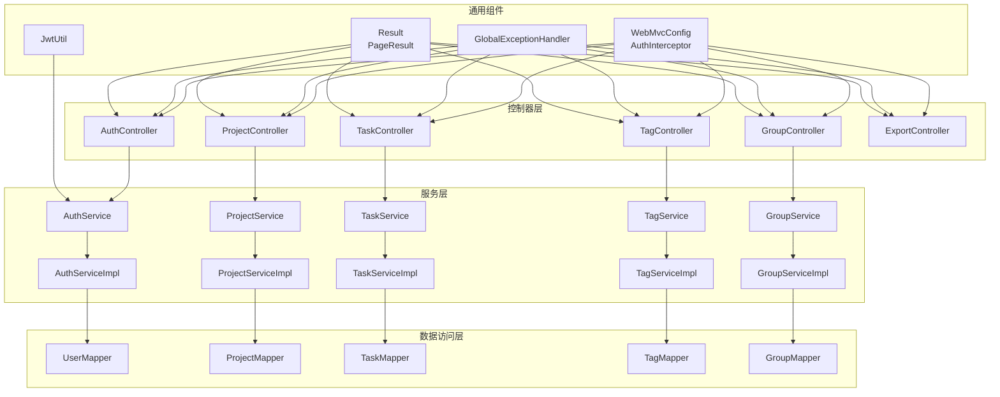
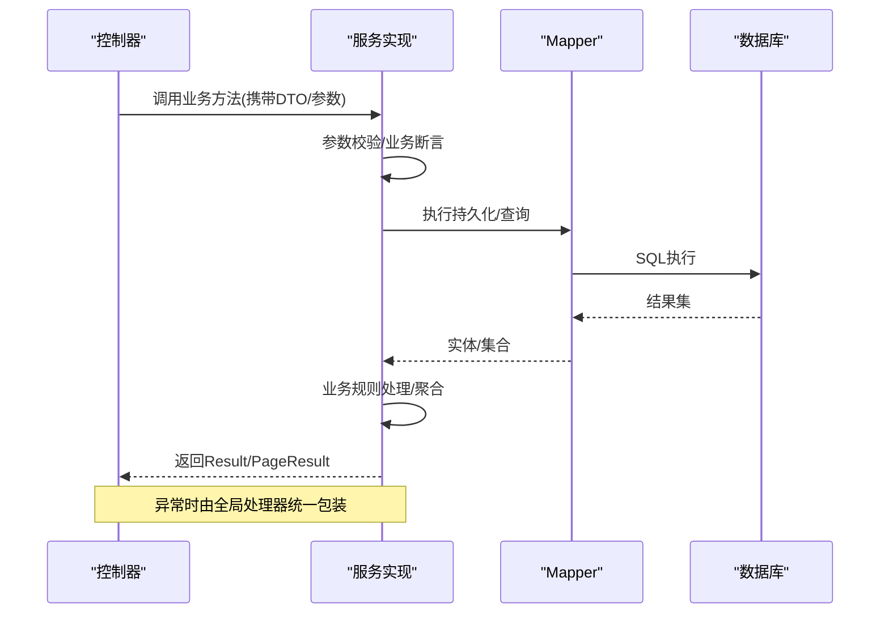
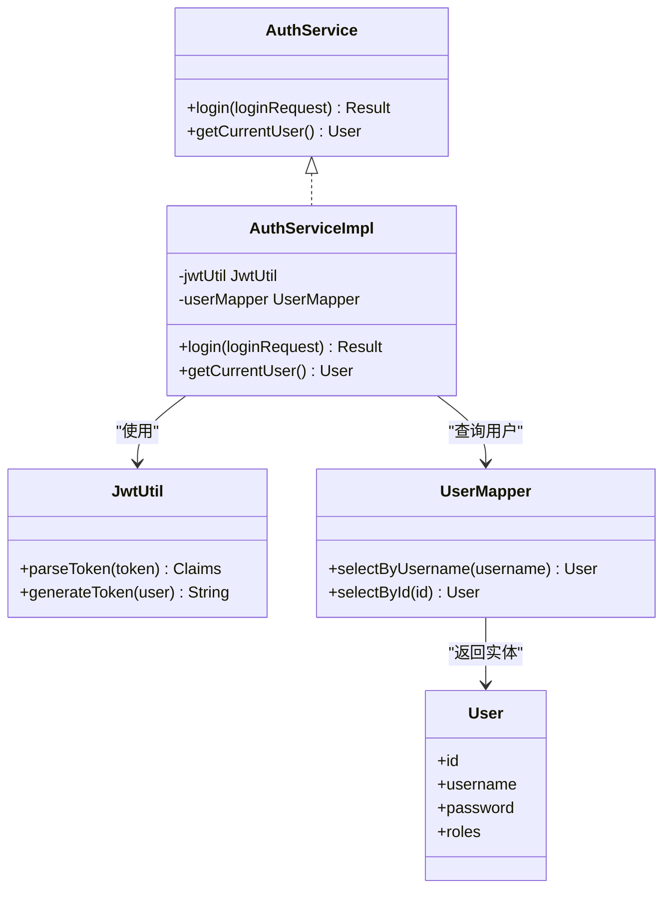
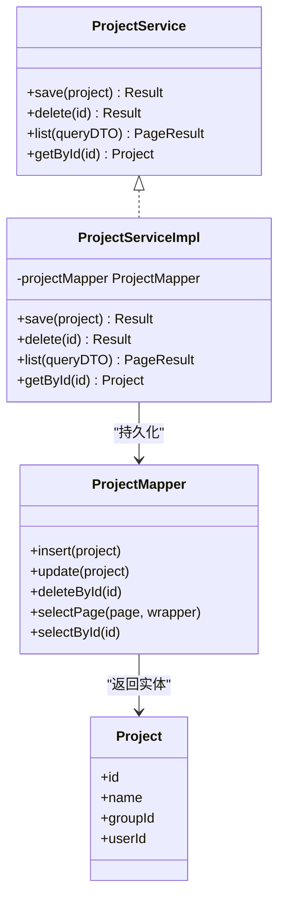
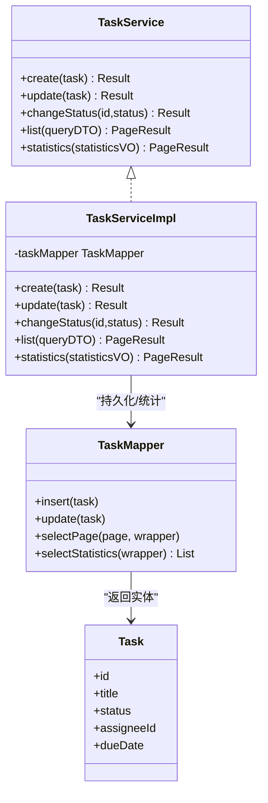
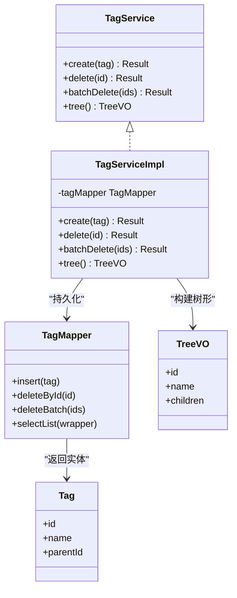
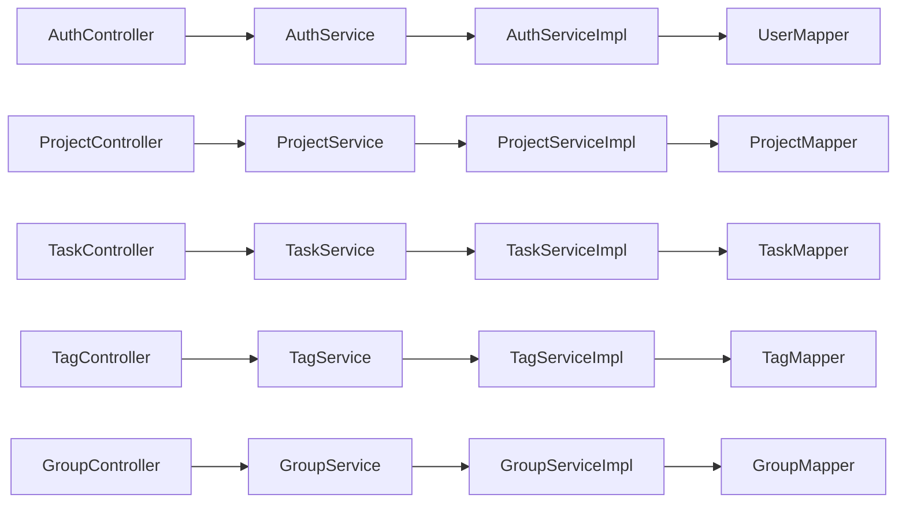

# 服务层

<cite>
**本文引用的文件**
- [NewWorldApplication.java](file://backend/src/main/java/com/newworld/NewWorldApplication.java)
- [WebMvcConfig.java](file://backend/src/main/java/com/newworld/config/WebMvcConfig.java)
- [AuthInterceptor.java](file://backend/src/main/java/com/newworld/config/AuthInterceptor.java)
- [MyBatisPlusConfig.java](file://backend/src/main/java/com/newworld/config/MyBatisPlusConfig.java)
- [GlobalExceptionHandler.java](file://backend/src/main/java/com/newworld/common/exception/GlobalExceptionHandler.java)
- [BusinessException.java](file://backend/src/main/java/com/newworld/common/exception/BusinessException.java)
- [Result.java](file://backend/src/main/java/com/newworld/common/Result.java)
- [PageResult.java](file://backend/src/main/java/com/newworld/common/PageResult.java)
- [JwtUtil.java](file://backend/src/main/java/com/newworld/common/JwtUtil.java)
- [AuthController.java](file://backend/src/main/java/com/newworld/controller/AuthController.java)
- [ProjectController.java](file://backend/src/main/java/com/newworld/controller/ProjectController.java)
- [TaskController.java](file://backend/src/main/java/com/newworld/controller/TaskController.java)
- [TagController.java](file://backend/src/main/java/com/newworld/controller/TagController.java)
- [GroupController.java](file://backend/src/main/java/com/newworld/controller/GroupController.java)
- [ExportController.java](file://backend/src/main/java/com/newworld/controller/ExportController.java)
- [LoginRequest.java](file://backend/src/main/java/com/newworld/dto/LoginRequest.java)
- [TaskQueryDTO.java](file://backend/src/main/java/com/newworld/dto/TaskQueryDTO.java)
- [TaskStatisticsVO.java](file://backend/src/main/java/com/newworld/dto/TaskStatisticsVO.java)
- [TreeVO.java](file://backend/src/main/java/com/newworld/dto/TreeVO.java)
- [User.java](file://backend/src/main/java/com/newworld/entity/User.java)
- [Project.java](file://backend/src/main/java/com/newworld/entity/Project.java)
- [Task.java](file://backend/src/main/java/com/newworld/entity/Task.java)
- [Tag.java](file://backend/src/main/java/com/newworld/entity/Tag.java)
- [Group.java](file://backend/src/main/java/com/newworld/entity/Group.java)
- [UserMapper.java](file://backend/src/main/java/com/newworld/mapper/UserMapper.java)
- [ProjectMapper.java](file://backend/src/main/java/com/newworld/mapper/ProjectMapper.java)
- [TaskMapper.java](file://backend/src/main/java/com/newworld/mapper/TaskMapper.java)
- [TagMapper.java](file://backend/src/main/java/com/newworld/mapper/TagMapper.java)
- [GroupMapper.java](file://backend/src/main/java/com/newworld/mapper/GroupMapper.java)
- [AuthService.java](file://backend/src/main/java/com/newworld/service/AuthService.java)
- [ProjectService.java](file://backend/src/main/java/com/newworld/service/ProjectService.java)
- [TaskService.java](file://backend/src/main/java/com/newworld/service/TaskService.java)
- [TagService.java](file://backend/src/main/java/com/newworld/service/TagService.java)
- [GroupService.java](file://backend/src/main/java/com/newworld/service/GroupService.java)
- [AuthServiceImpl.java](file://backend/src/main/java/com/newworld/service/impl/AuthServiceImpl.java)
- [ProjectServiceImpl.java](file://backend/src/main/java/com/newworld/service/impl/ProjectServiceImpl.java)
- [TaskServiceImpl.java](file://backend/src/main/java/com/newworld/service/impl/TaskServiceImpl.java)
- [TagServiceImpl.java](file://backend/src/main/java/com/newworld/service/impl/TagServiceImpl.java)
- [GroupServiceImpl.java](file://backend/src/main/java/com/newworld/service/impl/GroupServiceImpl.java)
</cite>

## 目录
1. [引言](#引言)
2. [项目结构](#项目结构)
3. [核心组件](#核心组件)
4. [架构总览](#架构总览)
5. [详细组件分析](#详细组件分析)
6. [依赖关系分析](#依赖关系分析)
7. [性能考量](#性能考量)
8. [故障排查指南](#故障排查指南)
9. [结论](#结论)
10. [附录](#附录)

## 引言
本文件聚焦于“新世界”项目的“服务层”，系统性阐述其在MVC架构中的核心定位：封装业务逻辑、统一事务边界、定义清晰的服务接口契约，并与控制器层形成稳定的交互模式。服务层通过接口与实现分离，确保业务规则内聚、可测试、可替换；同时结合全局异常处理与统一响应包装，提升系统的健壮性和可观测性。

## 项目结构
服务层位于后端模块的service包中，采用“接口 + 实现类”的分层组织方式，配合实体、映射器（Mapper）、控制器（Controller）与配置类共同构成完整的后端架构。下图展示了服务层与周边模块的关系：

图表来源
- [AuthController.java](file://backend/src/main/java/com/newworld/controller/AuthController.java)
- [ProjectController.java](file://backend/src/main/java/com/newworld/controller/ProjectController.java)
- [TaskController.java](file://backend/src/main/java/com/newworld/controller/TaskController.java)
- [TagController.java](file://backend/src/main/java/com/newworld/controller/TagController.java)
- [GroupController.java](file://backend/src/main/java/com/newworld/controller/GroupController.java)
- [ExportController.java](file://backend/src/main/java/com/newworld/controller/ExportController.java)
- [AuthService.java](file://backend/src/main/java/com/newworld/service/AuthService.java)
- [ProjectService.java](file://backend/src/main/java/com/newworld/service/ProjectService.java)
- [TaskService.java](file://backend/src/main/java/com/newworld/service/TaskService.java)
- [TagService.java](file://backend/src/main/java/com/newworld/service/TagService.java)
- [GroupService.java](file://backend/src/main/java/com/newworld/service/GroupService.java)
- [AuthServiceImpl.java](file://backend/src/main/java/com/newworld/service/impl/AuthServiceImpl.java)
- [ProjectServiceImpl.java](file://backend/src/main/java/com/newworld/service/impl/ProjectServiceImpl.java)
- [TaskServiceImpl.java](file://backend/src/main/java/com/newworld/service/impl/TaskServiceImpl.java)
- [TagServiceImpl.java](file://backend/src/main/java/com/newworld/service/impl/TagServiceImpl.java)
- [GroupServiceImpl.java](file://backend/src/main/java/com/newworld/service/impl/GroupServiceImpl.java)
- [UserMapper.java](file://backend/src/main/java/com/newworld/mapper/UserMapper.java)
- [ProjectMapper.java](file://backend/src/main/java/com/newworld/mapper/ProjectMapper.java)
- [TaskMapper.java](file://backend/src/main/java/com/newworld/mapper/TaskMapper.java)
- [TagMapper.java](file://backend/src/main/java/com/newworld/mapper/TagMapper.java)
- [GroupMapper.java](file://backend/src/main/java/com/newworld/mapper/GroupMapper.java)
- [WebMvcConfig.java](file://backend/src/main/java/com/newworld/config/WebMvcConfig.java)
- [AuthInterceptor.java](file://backend/src/main/java/com/newworld/config/AuthInterceptor.java)
- [GlobalExceptionHandler.java](file://backend/src/main/java/com/newworld/common/exception/GlobalExceptionHandler.java)
- [Result.java](file://backend/src/main/java/com/newworld/common/Result.java)
- [PageResult.java](file://backend/src/main/java/com/newworld/common/PageResult.java)
- [JwtUtil.java](file://backend/src/main/java/com/newworld/common/JwtUtil.java)

章节来源
- [WebMvcConfig.java](file://backend/src/main/java/com/newworld/config/WebMvcConfig.java)
- [AuthInterceptor.java](file://backend/src/main/java/com/newworld/config/AuthInterceptor.java)
- [GlobalExceptionHandler.java](file://backend/src/main/java/com/newworld/common/exception/GlobalExceptionHandler.java)
- [Result.java](file://backend/src/main/java/com/newworld/common/Result.java)
- [PageResult.java](file://backend/src/main/java/com/newworld/common/PageResult.java)
- [JwtUtil.java](file://backend/src/main/java/com/newworld/common/JwtUtil.java)

## 核心组件
- 接口层：定义服务契约，声明业务方法与返回类型，确保调用方仅依赖抽象。
- 实现层：具体业务规则落地，协调Mapper进行数据持久化，负责参数校验、业务断言、异常转换与统一返回包装。
- 控制器层：接收HTTP请求，装配DTO/VO，调用服务层，返回统一响应对象。
- 配置与拦截：注册拦截器以实现鉴权与跨域等横切关注点；全局异常处理器统一捕获并格式化错误。
- 统一响应：Result/PageResult封装成功/失败响应，便于前端消费。

章节来源
- [AuthService.java](file://backend/src/main/java/com/newworld/service/AuthService.java)
- [ProjectService.java](file://backend/src/main/java/com/newworld/service/ProjectService.java)
- [TaskService.java](file://backend/src/main/java/com/newworld/service/TaskService.java)
- [TagService.java](file://backend/src/main/java/com/newworld/service/TagService.java)
- [GroupService.java](file://backend/src/main/java/com/newworld/service/GroupService.java)
- [AuthServiceImpl.java](file://backend/src/main/java/com/newworld/service/impl/AuthServiceImpl.java)
- [ProjectServiceImpl.java](file://backend/src/main/java/com/newworld/service/impl/ProjectServiceImpl.java)
- [TaskServiceImpl.java](file://backend/src/main/java/com/newworld/service/impl/TaskServiceImpl.java)
- [TagServiceImpl.java](file://backend/src/main/java/com/newworld/service/impl/TagServiceImpl.java)
- [GroupServiceImpl.java](file://backend/src/main/java/com/newworld/service/impl/GroupServiceImpl.java)
- [AuthController.java](file://backend/src/main/java/com/newworld/controller/AuthController.java)
- [ProjectController.java](file://backend/src/main/java/com/newworld/controller/ProjectController.java)
- [TaskController.java](file://backend/src/main/java/com/newworld/controller/TaskController.java)
- [TagController.java](file://backend/src/main/java/com/newworld/controller/TagController.java)
- [GroupController.java](file://backend/src/main/java/com/newworld/controller/GroupController.java)
- [ExportController.java](file://backend/src/main/java/com/newworld/controller/ExportController.java)

## 架构总览
服务层在MVC中的职责边界清晰：
- 封装业务规则：将领域逻辑从控制器剥离，避免“胖控制器”。
- 事务边界：在服务层开启/提交/回滚事务，保证业务原子性。
- 参数与返回：服务层对入参进行校验与转换，输出统一的Result/PageResult。
- 错误处理：业务异常与系统异常在服务层或全局异常处理器中统一转换与上报。

图表来源
- [AuthController.java](file://backend/src/main/java/com/newworld/controller/AuthController.java)
- [ProjectController.java](file://backend/src/main/java/com/newworld/controller/ProjectController.java)
- [TaskController.java](file://backend/src/main/java/com/newworld/controller/TaskController.java)
- [TagController.java](file://backend/src/main/java/com/newworld/controller/TagController.java)
- [GroupController.java](file://backend/src/main/java/com/newworld/controller/GroupController.java)
- [ExportController.java](file://backend/src/main/java/com/newworld/controller/ExportController.java)
- [AuthServiceImpl.java](file://backend/src/main/java/com/newworld/service/impl/AuthServiceImpl.java)
- [ProjectServiceImpl.java](file://backend/src/main/java/com/newworld/service/impl/ProjectServiceImpl.java)
- [TaskServiceImpl.java](file://backend/src/main/java/com/newworld/service/impl/TaskServiceImpl.java)
- [TagServiceImpl.java](file://backend/src/main/java/com/newworld/service/impl/TagServiceImpl.java)
- [GroupServiceImpl.java](file://backend/src/main/java/com/newworld/service/impl/GroupServiceImpl.java)
- [UserMapper.java](file://backend/src/main/java/com/newworld/mapper/UserMapper.java)
- [ProjectMapper.java](file://backend/src/main/java/com/newworld/mapper/ProjectMapper.java)
- [TaskMapper.java](file://backend/src/main/java/com/newworld/mapper/TaskMapper.java)
- [TagMapper.java](file://backend/src/main/java/com/newworld/mapper/TagMapper.java)
- [GroupMapper.java](file://backend/src/main/java/com/newworld/mapper/GroupMapper.java)
- [GlobalExceptionHandler.java](file://backend/src/main/java/com/newworld/common/exception/GlobalExceptionHandler.java)
- [Result.java](file://backend/src/main/java/com/newworld/common/Result.java)
- [PageResult.java](file://backend/src/main/java/com/newworld/common/PageResult.java)

## 详细组件分析

### 认证与授权服务：AuthService
职责概述
- 用户登录与令牌签发：基于用户名/密码校验，生成JWT令牌。
- 权限与角色管理：根据用户角色/权限集合进行访问控制。
- 安全上下文：解析JWT获取当前用户信息，供其他服务使用。

关键实现要点
- 参数校验：对登录凭据进行非空与格式校验。
- 密码校验：使用安全哈希算法比对存储值。
- 令牌签发：设置过期时间与签名算法，返回Token。
- 异常处理：账户不存在、密码错误、账户锁定等场景抛出业务异常，由全局处理器统一包装。

图表来源
- [AuthService.java](file://backend/src/main/java/com/newworld/service/AuthService.java)
- [AuthServiceImpl.java](file://backend/src/main/java/com/newworld/service/impl/AuthServiceImpl.java)
- [JwtUtil.java](file://backend/src/main/java/com/newworld/common/JwtUtil.java)
- [UserMapper.java](file://backend/src/main/java/com/newworld/mapper/UserMapper.java)
- [User.java](file://backend/src/main/java/com/newworld/entity/User.java)

章节来源
- [AuthServiceImpl.java](file://backend/src/main/java/com/newworld/service/impl/AuthServiceImpl.java)
- [AuthService.java](file://backend/src/main/java/com/newworld/service/AuthService.java)
- [JwtUtil.java](file://backend/src/main/java/com/newworld/common/JwtUtil.java)
- [UserMapper.java](file://backend/src/main/java/com/newworld/mapper/UserMapper.java)
- [User.java](file://backend/src/main/java/com/newworld/entity/User.java)

### 项目服务：ProjectService
职责概述
- 项目生命周期管理：创建、更新、删除、查询项目。
- 关联数据处理：维护项目与任务、标签、分组的关联关系。
- 查询与分页：支持按条件过滤、排序与分页返回。

关键实现要点
- 创建/更新校验：名称唯一性、所属用户/分组合法性。
- 删除策略：软删除或级联删除，确保引用完整性。
- 查询优化：使用条件构造器与分页器，避免N+1问题。
- 异常处理：违反约束、无权限访问、资源不存在等统一抛出业务异常。

图表来源
- [ProjectService.java](file://backend/src/main/java/com/newworld/service/ProjectService.java)
- [ProjectServiceImpl.java](file://backend/src/main/java/com/newworld/service/impl/ProjectServiceImpl.java)
- [ProjectMapper.java](file://backend/src/main/java/com/newworld/mapper/ProjectMapper.java)
- [Project.java](file://backend/src/main/java/com/newworld/entity/Project.java)

章节来源
- [ProjectServiceImpl.java](file://backend/src/main/java/com/newworld/service/impl/ProjectServiceImpl.java)
- [ProjectService.java](file://backend/src/main/java/com/newworld/service/ProjectService.java)
- [ProjectMapper.java](file://backend/src/main/java/com/newworld/mapper/ProjectMapper.java)
- [Project.java](file://backend/src/main/java/com/newworld/entity/Project.java)

### 任务服务：TaskService
职责概述
- 任务创建与状态流转：支持新建、分配、推进、完成、撤销等状态变更。
- 统计与报表：提供任务统计视图，支持按维度聚合。
- 查询与过滤：支持多条件组合查询、排序与分页。

关键实现要点
- 状态机规则：严格限制状态转换路径，防止非法状态变更。
- 乐观锁/并发控制：对更新操作加入版本号或时间戳校验。
- 数据验证：标题长度、截止日期、负责人合法性等。
- 统一返回：使用PageResult封装统计结果，使用Result封装单条记录操作。

图表来源
- [TaskService.java](file://backend/src/main/java/com/newworld/service/TaskService.java)
- [TaskServiceImpl.java](file://backend/src/main/java/com/newworld/service/impl/TaskServiceImpl.java)
- [TaskMapper.java](file://backend/src/main/java/com/newworld/mapper/TaskMapper.java)
- [Task.java](file://backend/src/main/java/com/newworld/entity/Task.java)

章节来源
- [TaskServiceImpl.java](file://backend/src/main/java/com/newworld/service/impl/TaskServiceImpl.java)
- [TaskService.java](file://backend/src/main/java/com/newworld/service/TaskService.java)
- [TaskMapper.java](file://backend/src/main/java/com/newworld/mapper/TaskMapper.java)
- [Task.java](file://backend/src/main/java/com/newworld/entity/Task.java)

### 标签服务：TagService
职责概述
- 标签增删改查：支持创建、删除、批量删除、树形查询。
- 树形结构：支持父子层级关系，用于分类与筛选。
- 关联清理：删除标签时处理与任务的关联关系。

关键实现要点
- 唯一性约束：同层级下标签名唯一。
- 树形构建：将扁平列表转换为树形结构，支持深度与路径计算。
- 批量操作：提供批量删除与移动能力，保证一致性。
- 异常处理：重复命名、循环引用、根节点保护等场景抛出业务异常。

图表来源
- [TagService.java](file://backend/src/main/java/com/newworld/service/TagService.java)
- [TagServiceImpl.java](file://backend/src/main/java/com/newworld/service/impl/TagServiceImpl.java)
- [TagMapper.java](file://backend/src/main/java/com/newworld/mapper/TagMapper.java)
- [Tag.java](file://backend/src/main/java/com/newworld/entity/Tag.java)
- [TreeVO.java](file://backend/src/main/java/com/newworld/dto/TreeVO.java)

章节来源
- [TagServiceImpl.java](file://backend/src/main/java/com/newworld/service/impl/TagServiceImpl.java)
- [TagService.java](file://backend/src/main/java/com/newworld/service/TagService.java)
- [TagMapper.java](file://backend/src/main/java/com/newworld/mapper/TagMapper.java)
- [Tag.java](file://backend/src/main/java/com/newworld/entity/Tag.java)
- [TreeVO.java](file://backend/src/main/java/com/newworld/dto/TreeVO.java)

### 分组服务：GroupService
职责概述
- 分组管理：创建、修改、删除、查询分组。
- 成员管理：添加/移除成员，维护分组权限。
- 与项目/任务的关联：作为项目与任务的组织单元。

关键实现要点
- 权限校验：仅分组管理员可执行敏感操作。
- 成员去重：添加成员时避免重复。
- 删除保护：存在子资源时不被删除。

章节来源
- [GroupServiceImpl.java](file://backend/src/main/java/com/newworld/service/impl/GroupServiceImpl.java)
- [GroupService.java](file://backend/src/main/java/com/newworld/service/GroupService.java)
- [GroupMapper.java](file://backend/src/main/java/com/newworld/mapper/GroupMapper.java)
- [Group.java](file://backend/src/main/java/com/newworld/entity/Group.java)

## 依赖关系分析
服务层内部依赖关系
- 服务实现依赖对应的Mapper进行数据持久化。
- 公共工具（如JwtUtil）被认证服务使用。
- 控制器依赖服务接口，不直接依赖实现类，遵循依赖倒置原则。

图表来源
- [AuthController.java](file://backend/src/main/java/com/newworld/controller/AuthController.java)
- [ProjectController.java](file://backend/src/main/java/com/newworld/controller/ProjectController.java)
- [TaskController.java](file://backend/src/main/java/com/newworld/controller/TaskController.java)
- [TagController.java](file://backend/src/main/java/com/newworld/controller/TagController.java)
- [GroupController.java](file://backend/src/main/java/com/newworld/controller/GroupController.java)
- [AuthService.java](file://backend/src/main/java/com/newworld/service/AuthService.java)
- [ProjectService.java](file://backend/src/main/java/com/newworld/service/ProjectService.java)
- [TaskService.java](file://backend/src/main/java/com/newworld/service/TaskService.java)
- [TagService.java](file://backend/src/main/java/com/newworld/service/TagService.java)
- [GroupService.java](file://backend/src/main/java/com/newworld/service/GroupService.java)
- [AuthServiceImpl.java](file://backend/src/main/java/com/newworld/service/impl/AuthServiceImpl.java)
- [ProjectServiceImpl.java](file://backend/src/main/java/com/newworld/service/impl/ProjectServiceImpl.java)
- [TaskServiceImpl.java](file://backend/src/main/java/com/newworld/service/impl/TaskServiceImpl.java)
- [TagServiceImpl.java](file://backend/src/main/java/com/newworld/service/impl/TagServiceImpl.java)
- [GroupServiceImpl.java](file://backend/src/main/java/com/newworld/service/impl/GroupServiceImpl.java)
- [UserMapper.java](file://backend/src/main/java/com/newworld/mapper/UserMapper.java)
- [ProjectMapper.java](file://backend/src/main/java/com/newworld/mapper/ProjectMapper.java)
- [TaskMapper.java](file://backend/src/main/java/com/newworld/mapper/TaskMapper.java)
- [TagMapper.java](file://backend/src/main/java/com/newworld/mapper/TagMapper.java)
- [GroupMapper.java](file://backend/src/main/java/com/newworld/mapper/GroupMapper.java)

章节来源
- [AuthController.java](file://backend/src/main/java/com/newworld/controller/AuthController.java)
- [ProjectController.java](file://backend/src/main/java/com/newworld/controller/ProjectController.java)
- [TaskController.java](file://backend/src/main/java/com/newworld/controller/TaskController.java)
- [TagController.java](file://backend/src/main/java/com/newworld/controller/TagController.java)
- [GroupController.java](file://backend/src/main/java/com/newworld/controller/GroupController.java)
- [AuthService.java](file://backend/src/main/java/com/newworld/service/AuthService.java)
- [ProjectService.java](file://backend/src/main/java/com/newworld/service/ProjectService.java)
- [TaskService.java](file://backend/src/main/java/com/newworld/service/TaskService.java)
- [TagService.java](file://backend/src/main/java/com/newworld/service/TagService.java)
- [GroupService.java](file://backend/src/main/java/com/newworld/service/GroupService.java)

## 性能考量
- 分页与排序：优先在Mapper层使用分页器与排序条件，避免一次性加载大量数据。
- N+1查询：通过合理使用关联查询或批量查询减少额外SQL调用。
- 缓存策略：热点数据可引入缓存（如标签树、用户信息），注意缓存失效策略。
- 并发控制：对关键更新操作使用乐观锁字段，降低锁冲突。
- 事务粒度：将原子性要求高的操作放在同一事务中，避免长事务阻塞。

## 故障排查指南
- 统一异常处理：所有业务异常最终由全局异常处理器转换为标准响应，便于前端统一提示。
- 业务异常类型：通过业务异常类区分不同错误场景，利于日志定位与监控告警。
- 日志与追踪：建议在服务层关键入口打印请求参数与耗时，便于问题复盘。

章节来源
- [GlobalExceptionHandler.java](file://backend/src/main/java/com/newworld/common/exception/GlobalExceptionHandler.java)
- [BusinessException.java](file://backend/src/main/java/com/newworld/common/exception/BusinessException.java)
- [Result.java](file://backend/src/main/java/com/newworld/common/Result.java)
- [PageResult.java](file://backend/src/main/java/com/newworld/common/PageResult.java)

## 结论
服务层通过清晰的接口契约、严格的业务规则与统一的异常/响应处理，有效隔离了控制器与数据访问层的复杂度，提升了系统的可维护性与扩展性。结合事务管理与拦截器配置，服务层在保障业务正确性的同时，也兼顾了性能与可观测性。

## 附录
- 事务最佳实践
  - 将一次业务操作封装在单个服务方法中，必要时开启事务。
  - 对写操作进行批量提交，减少事务持有时间。
  - 使用只读查询避免不必要的行级锁。
- 服务方法调用链
  - 控制器 → 服务接口 → 服务实现 → Mapper → 数据库。
- 错误传播机制
  - 业务异常在服务层抛出，由全局异常处理器统一包装为标准响应。