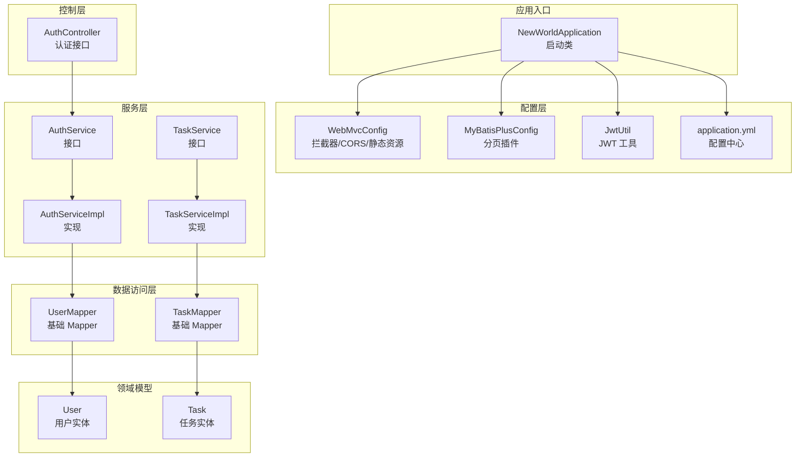
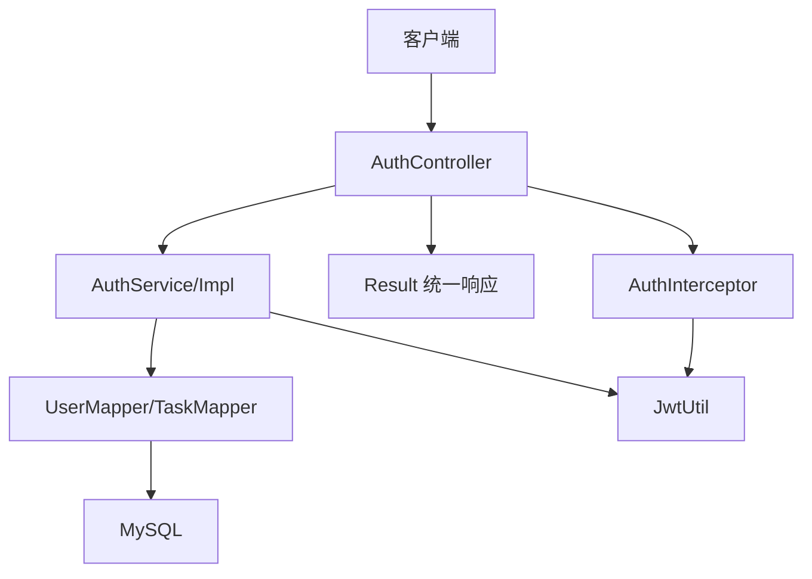
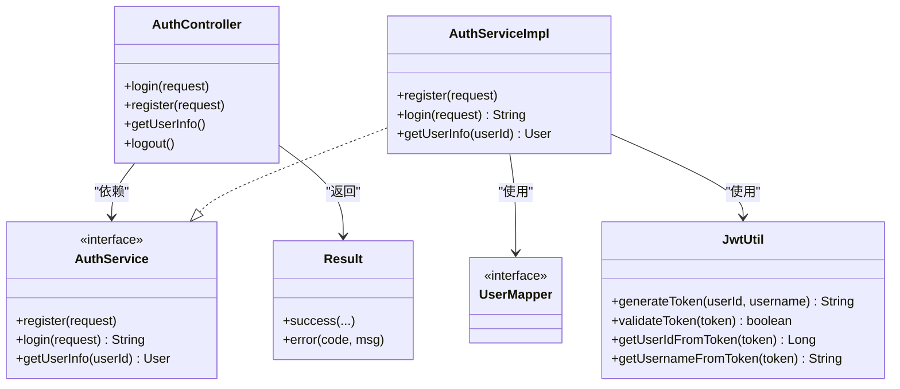
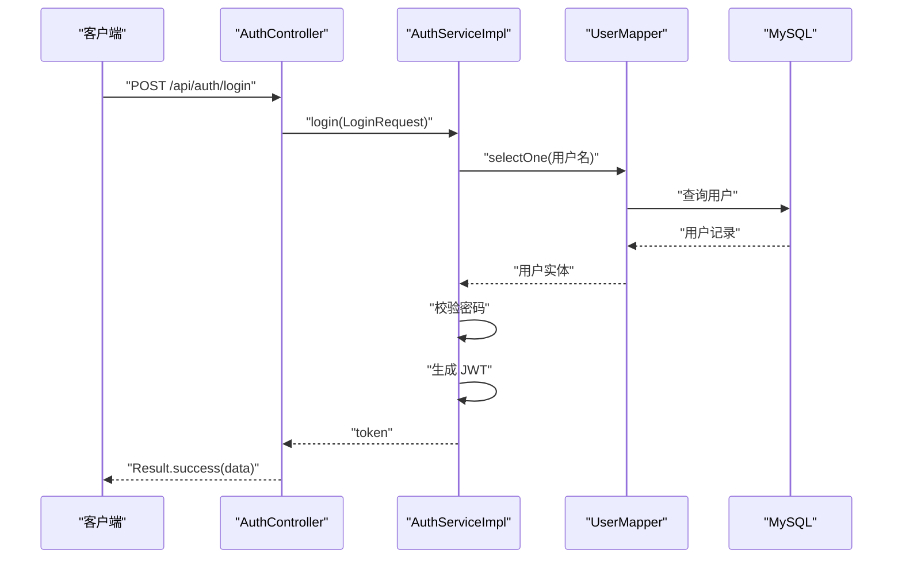
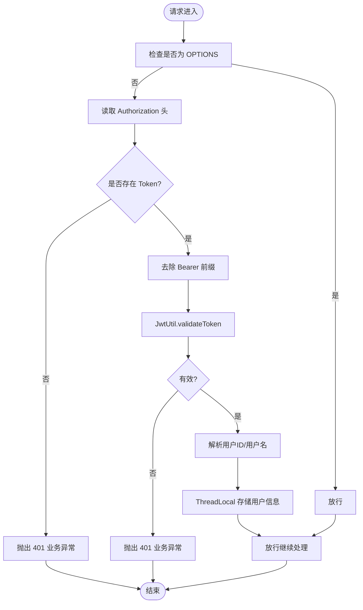
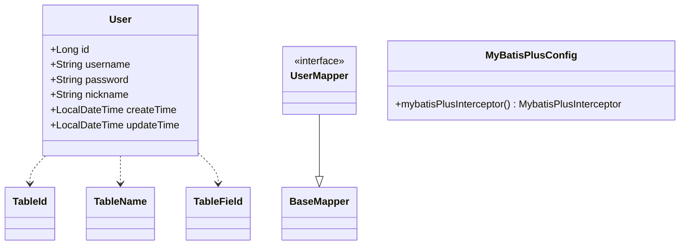
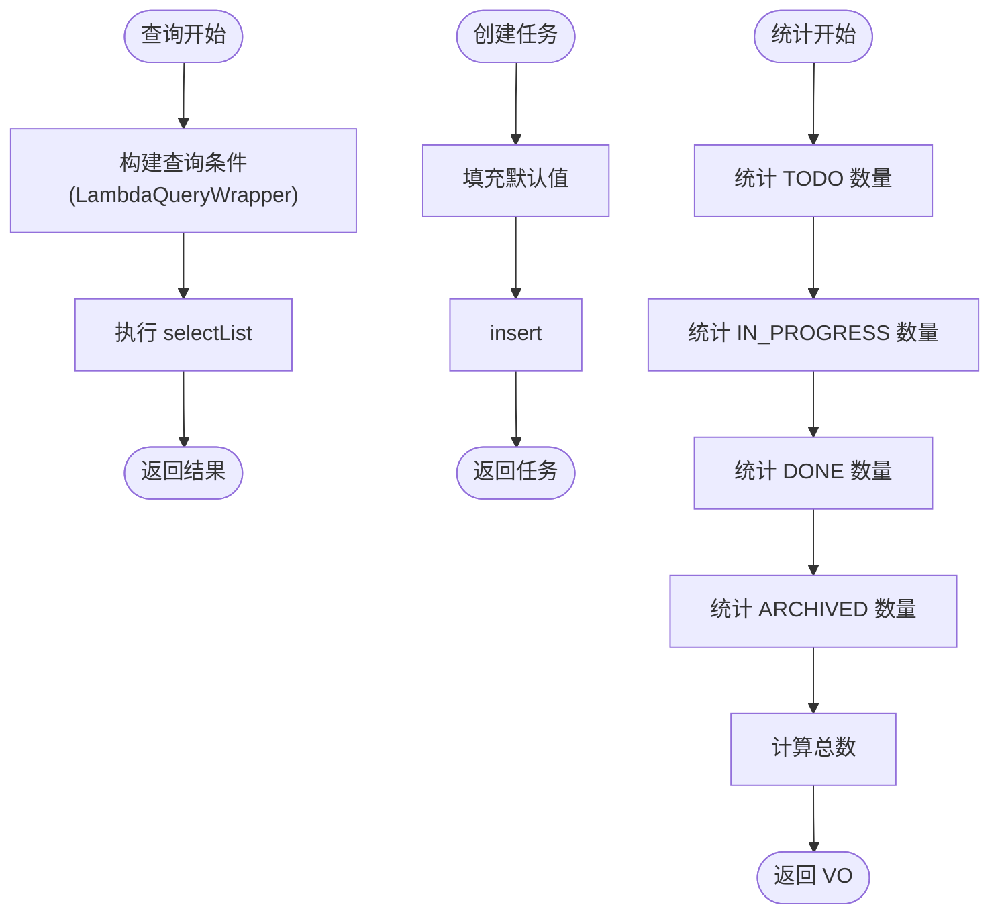
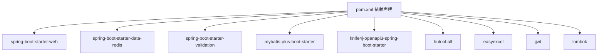

# 后端架构

<cite>
**本文引用的文件**
- [NewWorldApplication.java](file://backend/src/main/java/com/newworld/NewWorldApplication.java)
- [WebMvcConfig.java](file://backend/src/main/java/com/newworld/config/WebMvcConfig.java)
- [AuthInterceptor.java](file://backend/src/main/java/com/newworld/config/AuthInterceptor.java)
- [MyBatisPlusConfig.java](file://backend/src/main/java/com/newworld/config/MyBatisPlusConfig.java)
- [JwtUtil.java](file://backend/src/main/java/com/newworld/common/JwtUtil.java)
- [GlobalExceptionHandler.java](file://backend/src/main/java/com/newworld/common/exception/GlobalExceptionHandler.java)
- [Result.java](file://backend/src/main/java/com/newworld/common/Result.java)
- [application.yml](file://backend/src/main/resources/application.yml)
- [pom.xml](file://backend/pom.xml)
- [AuthController.java](file://backend/src/main/java/com/newworld/controller/AuthController.java)
- [AuthService.java](file://backend/src/main/java/com/newworld/service/AuthService.java)
- [AuthServiceImpl.java](file://backend/src/main/java/com/newworld/service/impl/AuthServiceImpl.java)
- [UserMapper.java](file://backend/src/main/java/com/newworld/mapper/UserMapper.java)
- [User.java](file://backend/src/main/java/com/newworld/entity/User.java)
- [TaskService.java](file://backend/src/main/java/com/newworld/service/TaskService.java)
- [TaskServiceImpl.java](file://backend/src/main/java/com/newworld/service/impl/TaskServiceImpl.java)
- [LoginRequest.java](file://backend/src/main/java/com/newworld/dto/LoginRequest.java)
</cite>

## 目录
1. [简介](#简介)
2. [项目结构](#项目结构)
3. [核心组件](#核心组件)
4. [架构总览](#架构总览)
5. [详细组件分析](#详细组件分析)
6. [依赖分析](#依赖分析)
7. [性能考虑](#性能考虑)
8. [故障排查指南](#故障排查指南)
9. [结论](#结论)
10. [附录](#附录)

## 简介
本文件面向“新世界”项目的后端团队与协作方，系统化梳理基于 Spring Boot 的分层架构与运行机制。重点覆盖：
- 分层架构：Controller、Service、Mapper 三层职责与交互
- MVC 设计模式落地：请求处理流程与响应机制
- 安全架构：JWT 认证、CORS 跨域、全局异常处理
- 依赖注入与 AOP 思想：拦截器与线程上下文传递
- MyBatis Plus：分页插件与实体映射
- 架构图与组件交互图，帮助快速理解系统全貌

## 项目结构
后端采用标准 Spring Boot 结构，按功能域划分包：
- common：通用工具与统一响应体、全局异常处理
- config：Web 配置、拦截器、MyBatis-Plus、Knife4j 文档
- controller：REST 控制器，暴露 API 接口
- service：业务接口与实现
- mapper：MyBatis Mapper 接口
- entity：实体模型
- dto：数据传输对象
- resources：配置文件与 XML 映射

图表来源
- [NewWorldApplication.java:1-13](file://backend/src/main/java/com/newworld/NewWorldApplication.java#L1-L13)
- [WebMvcConfig.java:1-53](file://backend/src/main/java/com/newworld/config/WebMvcConfig.java#L1-L53)
- [MyBatisPlusConfig.java:1-22](file://backend/src/main/java/com/newworld/config/MyBatisPlusConfig.java#L1-L22)
- [JwtUtil.java:1-78](file://backend/src/main/java/com/newworld/common/JwtUtil.java#L1-L78)
- [application.yml:1-75](file://backend/src/main/resources/application.yml#L1-L75)
- [AuthController.java:1-55](file://backend/src/main/java/com/newworld/controller/AuthController.java#L1-L55)
- [AuthService.java:1-24](file://backend/src/main/java/com/newworld/service/AuthService.java#L1-L24)
- [AuthServiceImpl.java:1-69](file://backend/src/main/java/com/newworld/service/impl/AuthServiceImpl.java#L1-L69)
- [TaskService.java:1-76](file://backend/src/main/java/com/newworld/service/TaskService.java#L1-L76)
- [TaskServiceImpl.java:1-194](file://backend/src/main/java/com/newworld/service/impl/TaskServiceImpl.java#L1-L194)
- [UserMapper.java:1-10](file://backend/src/main/java/com/newworld/mapper/UserMapper.java#L1-L10)
- [User.java:1-95](file://backend/src/main/java/com/newworld/entity/User.java#L1-L95)

章节来源
- [NewWorldApplication.java:1-13](file://backend/src/main/java/com/newworld/NewWorldApplication.java#L1-L13)
- [application.yml:1-75](file://backend/src/main/resources/application.yml#L1-L75)

## 核心组件
- 应用启动类：负责引导 Spring Boot 应用启动
- Web 配置：注册拦截器、CORS、静态资源映射
- 安全工具：JWT 工具类，提供签发、校验、解析
- 统一响应体：Result 封装统一响应结构
- 全局异常处理：统一捕获业务异常、参数异常与系统异常
- 控制器：对外暴露认证相关接口
- 服务层：封装业务逻辑，协调 Mapper 与工具类
- 数据访问层：基于 MyBatis Plus 的 Mapper 接口
- 实体模型：数据库表映射实体，含自动填充字段

章节来源
- [WebMvcConfig.java:1-53](file://backend/src/main/java/com/newworld/config/WebMvcConfig.java#L1-L53)
- [JwtUtil.java:1-78](file://backend/src/main/java/com/newworld/common/JwtUtil.java#L1-L78)
- [Result.java:1-90](file://backend/src/main/java/com/newworld/common/Result.java#L1-L90)
- [GlobalExceptionHandler.java:1-35](file://backend/src/main/java/com/newworld/common/exception/GlobalExceptionHandler.java#L1-L35)
- [AuthController.java:1-55](file://backend/src/main/java/com/newworld/controller/AuthController.java#L1-L55)
- [AuthService.java:1-24](file://backend/src/main/java/com/newworld/service/AuthService.java#L1-L24)
- [AuthServiceImpl.java:1-69](file://backend/src/main/java/com/newworld/service/impl/AuthServiceImpl.java#L1-L69)
- [UserMapper.java:1-10](file://backend/src/main/java/com/newworld/mapper/UserMapper.java#L1-L10)
- [User.java:1-95](file://backend/src/main/java/com/newworld/entity/User.java#L1-L95)

## 架构总览
后端采用经典的三层架构与 MVC 模式：
- 表现层（Controller）：接收 HTTP 请求，调用服务层，返回统一响应体
- 领域层（Service）：编排业务规则，进行参数校验与数据转换
- 数据访问层（Mapper）：通过 MyBatis Plus 执行 SQL，支持分页与自动填充

图表来源
- [AuthController.java:1-55](file://backend/src/main/java/com/newworld/controller/AuthController.java#L1-L55)
- [AuthService.java:1-24](file://backend/src/main/java/com/newworld/service/AuthService.java#L1-L24)
- [AuthServiceImpl.java:1-69](file://backend/src/main/java/com/newworld/service/impl/AuthServiceImpl.java#L1-L69)
- [UserMapper.java:1-10](file://backend/src/main/java/com/newworld/mapper/UserMapper.java#L1-L10)
- [JwtUtil.java:1-78](file://backend/src/main/java/com/newworld/common/JwtUtil.java#L1-L78)
- [AuthInterceptor.java:1-78](file://backend/src/main/java/com/newworld/config/AuthInterceptor.java#L1-L78)
- [Result.java:1-90](file://backend/src/main/java/com/newworld/common/Result.java#L1-L90)

## 详细组件分析

### 分层架构与职责边界
- Controller 层
  - 负责接收请求、参数校验、调用服务层、组装统一响应
  - 示例：认证控制器对外提供登录、注册、获取用户信息等接口
- Service 层
  - 封装业务规则，协调 Mapper 与工具类
  - 示例：认证服务实现登录校验、注册、用户信息查询；任务服务实现查询、创建、更新、删除、统计等
- Mapper 层
  - 基于 MyBatis Plus 的基础接口，提供 CRUD 能力
  - 示例：UserMapper、TaskMapper 继承 BaseMapper，自动获得常用方法

图表来源
- [AuthController.java:1-55](file://backend/src/main/java/com/newworld/controller/AuthController.java#L1-L55)
- [AuthService.java:1-24](file://backend/src/main/java/com/newworld/service/AuthService.java#L1-L24)
- [AuthServiceImpl.java:1-69](file://backend/src/main/java/com/newworld/service/impl/AuthServiceImpl.java#L1-L69)
- [UserMapper.java:1-10](file://backend/src/main/java/com/newworld/mapper/UserMapper.java#L1-L10)
- [JwtUtil.java:1-78](file://backend/src/main/java/com/newworld/common/JwtUtil.java#L1-L78)
- [Result.java:1-90](file://backend/src/main/java/com/newworld/common/Result.java#L1-L90)

章节来源
- [AuthController.java:1-55](file://backend/src/main/java/com/newworld/controller/AuthController.java#L1-L55)
- [AuthService.java:1-24](file://backend/src/main/java/com/newworld/service/AuthService.java#L1-L24)
- [AuthServiceImpl.java:1-69](file://backend/src/main/java/com/newworld/service/impl/AuthServiceImpl.java#L1-L69)
- [UserMapper.java:1-10](file://backend/src/main/java/com/newworld/mapper/UserMapper.java#L1-L10)

### MVC 设计模式与请求处理流程
- 流程概览
  - 客户端发起请求到控制器
  - 控制器调用服务层执行业务
  - 服务层通过 Mapper 访问数据库
  - 返回统一响应体给客户端
- 关键点
  - 统一响应体 Result 提供 success/error 多种重载
  - 参数校验由 DTO 与注解驱动
  - 异常通过全局异常处理器统一处理

图表来源
- [AuthController.java:25-32](file://backend/src/main/java/com/newworld/controller/AuthController.java#L25-L32)
- [AuthServiceImpl.java:40-57](file://backend/src/main/java/com/newworld/service/impl/AuthServiceImpl.java#L40-L57)
- [UserMapper.java:1-10](file://backend/src/main/java/com/newworld/mapper/UserMapper.java#L1-L10)
- [Result.java:22-50](file://backend/src/main/java/com/newworld/common/Result.java#L22-L50)

章节来源
- [AuthController.java:1-55](file://backend/src/main/java/com/newworld/controller/AuthController.java#L1-L55)
- [AuthServiceImpl.java:1-69](file://backend/src/main/java/com/newworld/service/impl/AuthServiceImpl.java#L1-L69)
- [Result.java:1-90](file://backend/src/main/java/com/newworld/common/Result.java#L1-L90)

### 安全架构：JWT、CORS、全局异常处理
- JWT 认证
  - JwtUtil 负责签发、校验与解析
  - AuthInterceptor 在预处理阶段从请求头提取 Authorization，去除 Bearer 前缀后校验
  - 使用 ThreadLocal 在请求线程内传递当前用户 ID 与用户名
- CORS 跨域
  - WebMvcConfig 对所有路径开放跨域，允许方法、头与凭据，并设置缓存时间
- 全局异常处理
  - GlobalExceptionHandler 捕获业务异常、参数异常与系统异常，统一返回 Result.error

图表来源
- [AuthInterceptor.java:30-58](file://backend/src/main/java/com/newworld/config/AuthInterceptor.java#L30-L58)
- [JwtUtil.java:61-69](file://backend/src/main/java/com/newworld/common/JwtUtil.java#L61-L69)
- [WebMvcConfig.java:35-43](file://backend/src/main/java/com/newworld/config/WebMvcConfig.java#L35-L43)
- [GlobalExceptionHandler.java:17-33](file://backend/src/main/java/com/newworld/common/exception/GlobalExceptionHandler.java#L17-L33)

章节来源
- [JwtUtil.java:1-78](file://backend/src/main/java/com/newworld/common/JwtUtil.java#L1-L78)
- [AuthInterceptor.java:1-78](file://backend/src/main/java/com/newworld/config/AuthInterceptor.java#L1-L78)
- [WebMvcConfig.java:1-53](file://backend/src/main/java/com/newworld/config/WebMvcConfig.java#L1-L53)
- [GlobalExceptionHandler.java:1-35](file://backend/src/main/java/com/newworld/common/exception/GlobalExceptionHandler.java#L1-L35)

### 依赖注入与 AOP 思想：拦截器与线程上下文
- 依赖注入
  - 控制器、服务、工具类、拦截器均通过 Spring 自动装配
- AOP 思想
  - 拦截器实现横切关注点（鉴权），在 preHandle 中完成 Token 校验与用户信息注入，在 afterCompletion 清理线程变量
- 线程上下文
  - 通过 ThreadLocal 保存当前用户 ID 与用户名，避免在每个方法中重复传参

章节来源
- [AuthInterceptor.java:20-77](file://backend/src/main/java/com/newworld/config/AuthInterceptor.java#L20-L77)
- [AuthController.java:42-47](file://backend/src/main/java/com/newworld/controller/AuthController.java#L42-L47)

### MyBatis Plus：分页插件与实体映射
- 分页插件
  - MyBatisPlusConfig 注册分页内核，针对 MySQL 生效
- 实体映射
  - 实体类使用注解标注表名、主键策略、自动填充字段
  - Mapper 继承 BaseMapper，自动获得常用 CRUD 方法
- 配置项
  - application.yml 指定 Mapper XML 位置、类型别名包、驼峰映射、逻辑删除字段等

图表来源
- [User.java:11-37](file://backend/src/main/java/com/newworld/entity/User.java#L11-L37)
- [UserMapper.java:1-10](file://backend/src/main/java/com/newworld/mapper/UserMapper.java#L1-L10)
- [MyBatisPlusConfig.java:15-20](file://backend/src/main/java/com/newworld/config/MyBatisPlusConfig.java#L15-L20)

章节来源
- [MyBatisPlusConfig.java:1-22](file://backend/src/main/java/com/newworld/config/MyBatisPlusConfig.java#L1-L22)
- [application.yml:36-50](file://backend/src/main/resources/application.yml#L36-L50)
- [User.java:1-95](file://backend/src/main/java/com/newworld/entity/User.java#L1-L95)
- [UserMapper.java:1-10](file://backend/src/main/java/com/newworld/mapper/UserMapper.java#L1-L10)

### 任务服务示例：复杂业务逻辑与数据流
- 查询条件动态拼接：根据查询 DTO 的多个维度组合查询条件
- 默认值填充：创建任务时对优先级、状态、是否笔记等字段进行默认赋值
- 统计聚合：按状态统计任务数量并汇总总数
- 分享链接：生成随机分享标识并返回可访问路径

图表来源
- [TaskServiceImpl.java:23-44](file://backend/src/main/java/com/newworld/service/impl/TaskServiceImpl.java#L23-L44)
- [TaskServiceImpl.java:55-68](file://backend/src/main/java/com/newworld/service/impl/TaskServiceImpl.java#L55-L68)
- [TaskServiceImpl.java:175-192](file://backend/src/main/java/com/newworld/service/impl/TaskServiceImpl.java#L175-L192)

章节来源
- [TaskService.java:1-76](file://backend/src/main/java/com/newworld/service/TaskService.java#L1-L76)
- [TaskServiceImpl.java:1-194](file://backend/src/main/java/com/newworld/service/impl/TaskServiceImpl.java#L1-L194)

## 依赖分析
- 运行时依赖
  - Spring Web、Validation、Redis、MyBatis Plus、Knife4j、Hutool、EasyExcel、JWT、Lombok
- 配置与版本
  - Spring Boot 2.7.x、MyBatis Plus 3.5.x、Knife4j 4.1.x、JWT 0.9.x、Hutool 5.8.x、EasyExcel 3.3.x

图表来源
- [pom.xml:31-96](file://backend/pom.xml#L31-L96)

章节来源
- [pom.xml:1-117](file://backend/pom.xml#L1-L117)

## 性能考虑
- 分页优化：启用 MyBatis Plus 分页插件，避免一次性加载大结果集
- 缓存策略：结合 Redis（已在依赖中引入）用于热点数据与会话缓存
- 日志与监控：开启 Knife4j 文档便于接口调试；日志级别按模块配置
- 数据库连接：合理配置连接池参数与超时时间

## 故障排查指南
- 401 未登录/Token 失效
  - 检查前端是否正确携带 Authorization 头且去除 Bearer 前缀
  - 校验 JWT 密钥与过期时间配置
- 参数校验失败
  - DTO 字段为空或格式不正确，查看全局异常处理对非法参数的返回
- 业务异常
  - 服务层抛出的业务异常会被全局异常处理器捕获并返回 Result.error
- 跨域问题
  - 确认 WebMvcConfig 中 CORS 配置是否满足前端域名与方法要求

章节来源
- [AuthInterceptor.java:37-49](file://backend/src/main/java/com/newworld/config/AuthInterceptor.java#L37-L49)
- [JwtUtil.java:61-69](file://backend/src/main/java/com/newworld/common/JwtUtil.java#L61-L69)
- [GlobalExceptionHandler.java:17-33](file://backend/src/main/java/com/newworld/common/exception/GlobalExceptionHandler.java#L17-L33)
- [WebMvcConfig.java:35-43](file://backend/src/main/java/com/newworld/config/WebMvcConfig.java#L35-L43)

## 结论
本项目后端以清晰的分层架构与 MVC 模式为基础，结合 JWT 认证、CORS 跨域与全局异常处理，形成稳定的安全与可靠性保障。MyBatis Plus 的分页与实体映射提升了开发效率与可维护性。建议后续在生产环境完善 Redis 缓存、接入链路追踪与指标监控，并持续优化查询与写入性能。

## 附录
- 配置要点
  - 数据源与 Redis：application.yml 中集中配置
  - MyBatis Plus：Mapper XML 位置、驼峰映射、逻辑删除字段
  - Knife4j：Swagger UI 与文档路径
  - JWT：密钥与过期时间
- 开发建议
  - DTO 参数校验与接口文档保持一致
  - 服务层尽量无状态，避免共享可变变量
  - 使用 ThreadLocal 仅限于请求上下文，确保在 afterCompletion 清理

章节来源
- [application.yml:10-75](file://backend/src/main/resources/application.yml#L10-L75)
- [pom.xml:21-29](file://backend/pom.xml#L21-L29)