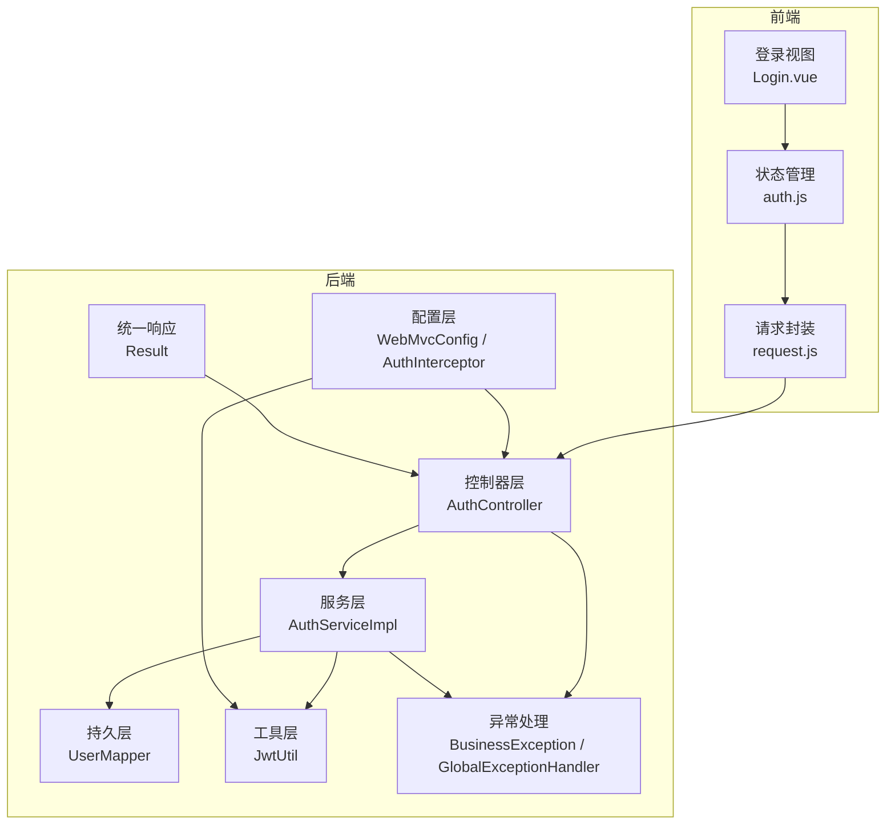
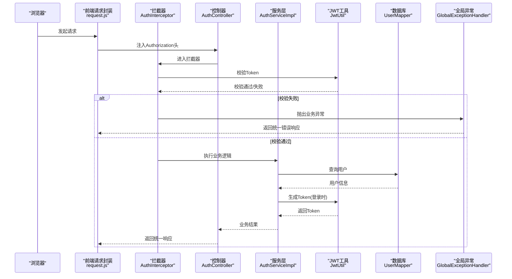
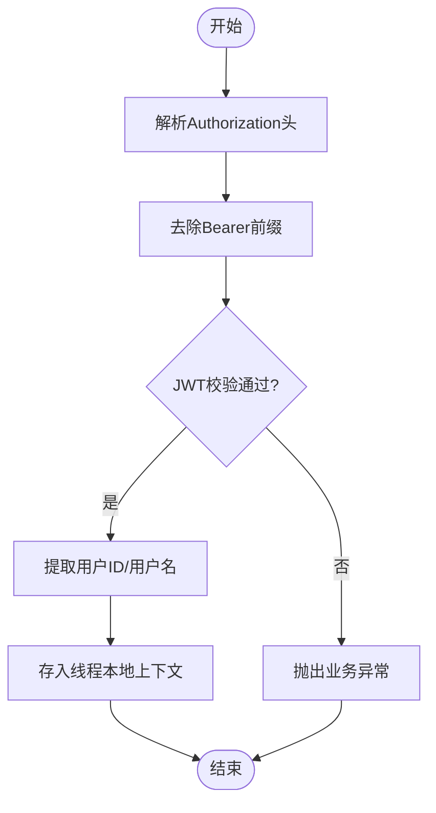
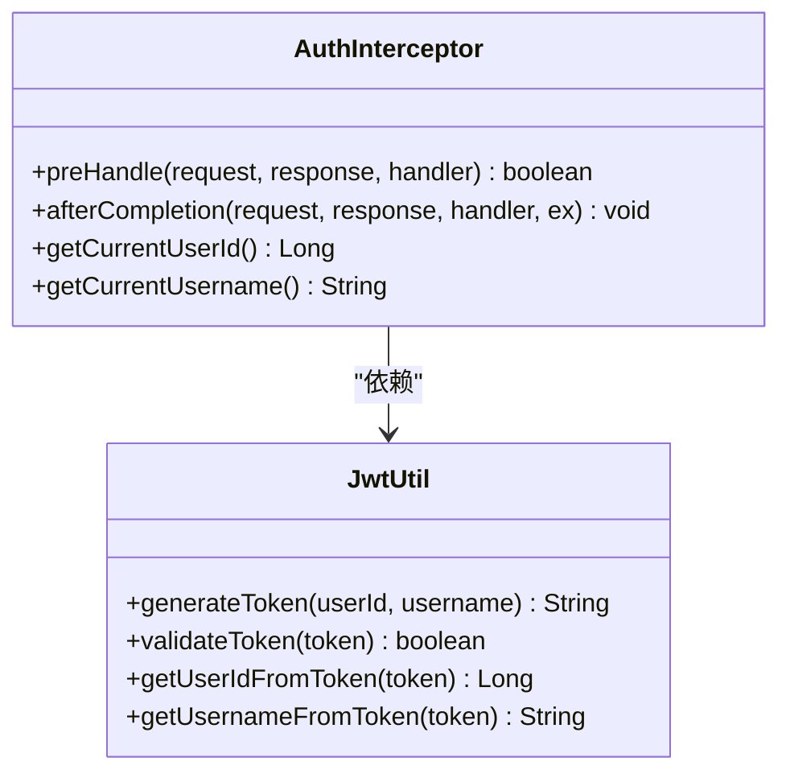
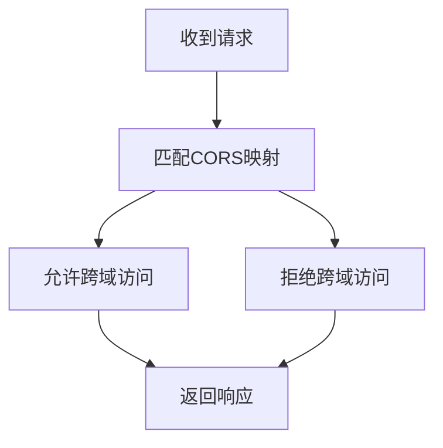
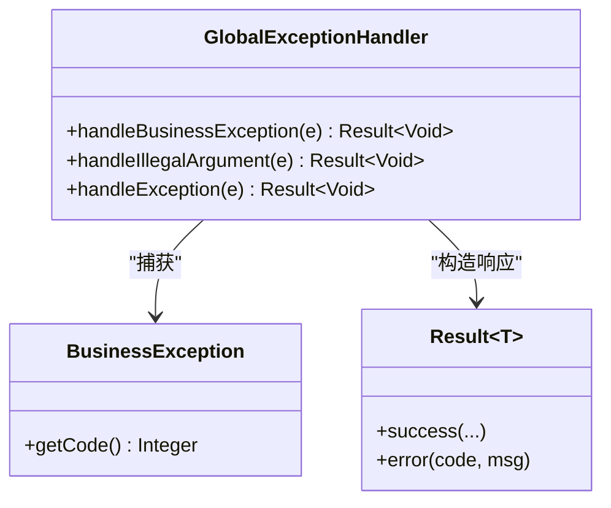
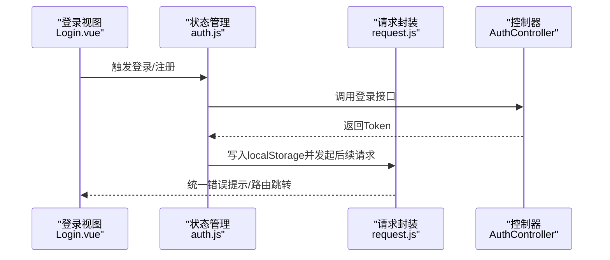
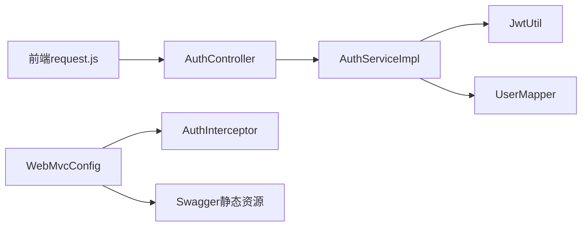

# 安全架构

<cite>
**本文引用的文件**
- [JwtUtil.java](file://backend/src/main/java/com/newworld/common/JwtUtil.java)
- [AuthInterceptor.java](file://backend/src/main/java/com/newworld/config/AuthInterceptor.java)
- [WebMvcConfig.java](file://backend/src/main/java/com/newworld/config/WebMvcConfig.java)
- [BusinessException.java](file://backend/src/main/java/com/newworld/common/exception/BusinessException.java)
- [GlobalExceptionHandler.java](file://backend/src/main/java/com/newworld/common/exception/GlobalExceptionHandler.java)
- [Result.java](file://backend/src/main/java/com/newworld/common/Result.java)
- [AuthController.java](file://backend/src/main/java/com/newworld/controller/AuthController.java)
- [AuthServiceImpl.java](file://backend/src/main/java/com/newworld/service/impl/AuthServiceImpl.java)
- [application.yml](file://backend/src/main/resources/application.yml)
- [application-prod.yml](file://backend/src/main/resources/application-prod.yml)
- [request.js](file://frontend/src/utils/request.js)
- [auth.js](file://frontend/src/stores/auth.js)
- [Login.vue](file://frontend/src/views/Login.vue)
</cite>

## 目录
1. [简介](#简介)
2. [项目结构](#项目结构)
3. [核心组件](#核心组件)
4. [架构总览](#架构总览)
5. [详细组件分析](#详细组件分析)
6. [依赖分析](#依赖分析)
7. [性能考量](#性能考量)
8. [故障排查指南](#故障排查指南)
9. [结论](#结论)
10. [附录](#附录)

## 简介
本文件面向新世界项目的后端与前端，系统性梳理其安全架构设计与实现要点，重点覆盖：
- JWT认证机制：Token生成、验证与失效处理
- 自定义拦截器AuthInterceptor：拦截规则、权限校验与异常处理
- CORS跨域配置：允许的源、方法与头部策略
- 全局异常处理：BusinessException的统一处理与错误响应格式
- 前端侧的请求拦截与Token注入
- 安全最佳实践与常见问题的解决方案

## 项目结构
后端采用Spring Boot标准分层：controller、service、mapper、config、common等包，配合统一响应体Result与全局异常处理，形成清晰的安全与业务边界。

图表来源
- [AuthController.java:1-55](file://backend/src/main/java/com/newworld/controller/AuthController.java#L1-L55)
- [AuthServiceImpl.java:1-69](file://backend/src/main/java/com/newworld/service/impl/AuthServiceImpl.java#L1-L69)
- [WebMvcConfig.java:1-53](file://backend/src/main/java/com/newworld/config/WebMvcConfig.java#L1-L53)
- [AuthInterceptor.java:1-78](file://backend/src/main/java/com/newworld/config/AuthInterceptor.java#L1-L78)
- [JwtUtil.java:1-78](file://backend/src/main/java/com/newworld/common/JwtUtil.java#L1-L78)
- [GlobalExceptionHandler.java:1-35](file://backend/src/main/java/com/newworld/common/exception/GlobalExceptionHandler.java#L1-L35)
- [Result.java:1-90](file://backend/src/main/java/com/newworld/common/Result.java#L1-L90)
- [request.js:1-56](file://frontend/src/utils/request.js#L1-L56)
- [auth.js:1-41](file://frontend/src/stores/auth.js#L1-L41)
- [Login.vue:1-203](file://frontend/src/views/Login.vue#L1-L203)

章节来源
- [application.yml:1-75](file://backend/src/main/resources/application.yml#L1-L75)
- [application-prod.yml:1-24](file://backend/src/main/resources/application-prod.yml#L1-L24)

## 核心组件
- JWT工具：负责Token生成、解析与校验，密钥与过期时间来自配置文件。
- 自定义拦截器：在进入控制器前校验Authorization头中的Token有效性，并将当前用户上下文注入到线程本地存储。
- Web配置：注册拦截器与CORS策略，明确放行路径与跨域许可范围。
- 全局异常处理：对业务异常、参数异常与通用异常进行统一响应包装。
- 统一响应体：所有接口返回统一结构，便于前后端一致处理。
- 前端请求封装：自动注入Authorization头，统一对错误码进行提示与路由跳转。

章节来源
- [JwtUtil.java:1-78](file://backend/src/main/java/com/newworld/common/JwtUtil.java#L1-L78)
- [AuthInterceptor.java:1-78](file://backend/src/main/java/com/newworld/config/AuthInterceptor.java#L1-L78)
- [WebMvcConfig.java:1-53](file://backend/src/main/java/com/newworld/config/WebMvcConfig.java#L1-L53)
- [GlobalExceptionHandler.java:1-35](file://backend/src/main/java/com/newworld/common/exception/GlobalExceptionHandler.java#L1-L35)
- [Result.java:1-90](file://backend/src/main/java/com/newworld/common/Result.java#L1-L90)
- [request.js:1-56](file://frontend/src/utils/request.js#L1-L56)

## 架构总览
下图展示从浏览器到后端的完整认证链路，包括Token生成、拦截校验与错误处理。

图表来源
- [AuthController.java:1-55](file://backend/src/main/java/com/newworld/controller/AuthController.java#L1-L55)
- [AuthServiceImpl.java:1-69](file://backend/src/main/java/com/newworld/service/impl/AuthServiceImpl.java#L1-L69)
- [AuthInterceptor.java:1-78](file://backend/src/main/java/com/newworld/config/AuthInterceptor.java#L1-L78)
- [JwtUtil.java:1-78](file://backend/src/main/java/com/newworld/common/JwtUtil.java#L1-L78)
- [GlobalExceptionHandler.java:1-35](file://backend/src/main/java/com/newworld/common/exception/GlobalExceptionHandler.java#L1-L35)
- [request.js:1-56](file://frontend/src/utils/request.js#L1-L56)

## 详细组件分析

### JWT认证机制
- Token生成
  - 使用对称签名算法，包含签发时间、过期时间与用户标识，过期时间与密钥来自配置文件。
  - 登录成功时由服务层调用JWT工具生成Token并返回给前端。
- Token验证
  - 拦截器从请求头读取Authorization，去除Bearer前缀后调用JWT工具进行解析与校验。
  - 校验失败时抛出业务异常，交由全局异常处理器统一响应。
- Token刷新
  - 当前实现未提供专用刷新接口；建议在生产环境引入Refresh Token机制或短Token+定时刷新策略，以降低风险暴露窗口。

图表来源
- [AuthInterceptor.java:30-58](file://backend/src/main/java/com/newworld/config/AuthInterceptor.java#L30-L58)
- [JwtUtil.java:61-69](file://backend/src/main/java/com/newworld/common/JwtUtil.java#L61-L69)

章节来源
- [JwtUtil.java:29-40](file://backend/src/main/java/com/newworld/common/JwtUtil.java#L29-L40)
- [AuthServiceImpl.java:55-56](file://backend/src/main/java/com/newworld/service/impl/AuthServiceImpl.java#L55-L56)
- [application.yml:65-68](file://backend/src/main/resources/application.yml#L65-L68)

### 自定义拦截器AuthInterceptor
- 拦截规则
  - 仅对/api/**路径生效，排除登录、注册、系统接口与Swagger相关路径。
  - 对预检请求OPTIONS直接放行，避免CORS影响。
- 权限验证
  - 必须携带Authorization头，否则抛出未登录异常。
  - 校验Token有效性，无效则提示过期或无效并要求重新登录。
- 异常处理
  - 拦截器内捕获校验失败并转换为业务异常，交由全局异常处理器统一输出。
- 线程上下文
  - 使用ThreadLocal保存当前用户ID与用户名，供后续业务使用。
  - 在afterCompletion中清理，防止内存泄漏。

图表来源
- [AuthInterceptor.java:1-78](file://backend/src/main/java/com/newworld/config/AuthInterceptor.java#L1-L78)
- [JwtUtil.java:1-78](file://backend/src/main/java/com/newworld/common/JwtUtil.java#L1-L78)

章节来源
- [WebMvcConfig.java:19-33](file://backend/src/main/java/com/newworld/config/WebMvcConfig.java#L19-L33)
- [AuthInterceptor.java:30-58](file://backend/src/main/java/com/newworld/config/AuthInterceptor.java#L30-L58)

### CORS跨域配置
- 映射范围
  - 对所有路径启用CORS，允许任意源、方法与头部，支持凭据，缓存时间为1小时。
- 安全考虑
  - 生产环境建议限制allowedOriginPatterns为具体域名，避免通配符导致的安全风险。
  - 明确允许的方法与头部，避免过度开放。

图表来源
- [WebMvcConfig.java:35-43](file://backend/src/main/java/com/newworld/config/WebMvcConfig.java#L35-L43)

章节来源
- [WebMvcConfig.java:35-43](file://backend/src/main/java/com/newworld/config/WebMvcConfig.java#L35-L43)

### 全局异常处理
- 业务异常BusinessException
  - 统一返回指定状态码与消息，由全局异常处理器包装为统一响应体。
- 参数异常与通用异常
  - 对非法参数与未知异常分别进行日志记录与统一响应。
- 错误响应格式
  - 通过Result统一输出code、msg与data字段，前端可据此进行提示与路由控制。

图表来源
- [GlobalExceptionHandler.java:1-35](file://backend/src/main/java/com/newworld/common/exception/GlobalExceptionHandler.java#L1-L35)
- [BusinessException.java:1-24](file://backend/src/main/java/com/newworld/common/exception/BusinessException.java#L1-L24)
- [Result.java:1-90](file://backend/src/main/java/com/newworld/common/Result.java#L1-L90)

章节来源
- [GlobalExceptionHandler.java:17-33](file://backend/src/main/java/com/newworld/common/exception/GlobalExceptionHandler.java#L17-L33)
- [BusinessException.java:10-22](file://backend/src/main/java/com/newworld/common/exception/BusinessException.java#L10-L22)
- [Result.java:52-64](file://backend/src/main/java/com/newworld/common/Result.java#L52-L64)

### 前端安全交互
- 请求拦截
  - 自动从localStorage读取token并在请求头注入Authorization: Bearer。
- 响应拦截
  - 对非200状态进行统一提示；对401进行登出处理并跳转登录页。
- 状态管理
  - 使用Pinia存储token与用户信息，登录成功后写入localStorage并拉取用户详情。

图表来源
- [Login.vue:125-157](file://frontend/src/views/Login.vue#L125-L157)
- [auth.js:16-31](file://frontend/src/stores/auth.js#L16-L31)
- [request.js:9-53](file://frontend/src/utils/request.js#L9-L53)
- [AuthController.java:26-32](file://backend/src/main/java/com/newworld/controller/AuthController.java#L26-L32)

章节来源
- [request.js:10-19](file://frontend/src/utils/request.js#L10-L19)
- [request.js:21-53](file://frontend/src/utils/request.js#L21-L53)
- [auth.js:11-14](file://frontend/src/stores/auth.js#L11-L14)
- [auth.js:33-37](file://frontend/src/stores/auth.js#L33-L37)

## 依赖分析
- 控制器依赖服务层，服务层依赖JWT工具与数据访问层。
- 拦截器依赖JWT工具与全局异常处理。
- Web配置注册拦截器与CORS，同时暴露Swagger静态资源。
- 前端通过Axios封装统一请求与响应处理。

图表来源
- [AuthController.java:1-55](file://backend/src/main/java/com/newworld/controller/AuthController.java#L1-L55)
- [AuthServiceImpl.java:1-69](file://backend/src/main/java/com/newworld/service/impl/AuthServiceImpl.java#L1-L69)
- [JwtUtil.java:1-78](file://backend/src/main/java/com/newworld/common/JwtUtil.java#L1-L78)
- [WebMvcConfig.java:1-53](file://backend/src/main/java/com/newworld/config/WebMvcConfig.java#L1-L53)
- [request.js:1-56](file://frontend/src/utils/request.js#L1-L56)

章节来源
- [AuthController.java:22-23](file://backend/src/main/java/com/newworld/controller/AuthController.java#L22-L23)
- [AuthServiceImpl.java:17-21](file://backend/src/main/java/com/newworld/service/impl/AuthServiceImpl.java#L17-L21)
- [WebMvcConfig.java:19-33](file://backend/src/main/java/com/newworld/config/WebMvcConfig.java#L19-L33)

## 性能考量
- Token校验开销
  - JWT解析与签名验证为轻量级操作，通常不会成为瓶颈；建议结合Redis缓存热点用户信息以减少数据库查询。
- 线程上下文
  - 使用ThreadLocal存储用户信息避免重复查询，但需确保在afterCompletion中及时清理，防止内存泄漏。
- CORS策略
  - 生产环境应收紧允许的源与方法，减少不必要的预检请求与跨域复杂请求。

## 故障排查指南
- 401未登录/Token无效
  - 检查前端是否正确注入Authorization头，确认Bearer前缀是否存在。
  - 核对后端拦截器是否正确解析与校验Token。
  - 确认JWT密钥与过期时间配置是否一致。
- 登录成功但接口仍报401
  - 排查拦截器排除路径配置是否覆盖了目标接口。
  - 检查线程上下文是否被清理或未正确设置。
- CORS跨域失败
  - 生产环境应限制allowedOriginPatterns为具体域名，避免通配符导致的安全问题。
  - 确认预检请求是否被正确放行。
- 前端401自动跳转
  - 检查响应拦截器逻辑，确认localStorage中的token已被清除且路由跳转正确。

章节来源
- [AuthInterceptor.java:37-49](file://backend/src/main/java/com/newworld/config/AuthInterceptor.java#L37-L49)
- [WebMvcConfig.java:35-43](file://backend/src/main/java/com/newworld/config/WebMvcConfig.java#L35-L43)
- [request.js:32-38](file://frontend/src/utils/request.js#L32-L38)

## 结论
新世界项目在后端实现了基于JWT的认证体系，配合自定义拦截器与全局异常处理，形成了清晰的安全边界。前端通过Axios封装实现了Token自动注入与统一错误处理。建议在生产环境中进一步完善CORS策略、引入Token刷新机制与黑名单管理，并加强密码存储与传输安全。

## 附录
- 安全最佳实践
  - 严格限制CORS允许的源与方法，避免通配符滥用。
  - 使用HTTPS传输，确保Cookie与Token的安全性。
  - 密钥与敏感配置通过环境变量注入，避免硬编码。
  - 引入Refresh Token与黑名单机制，缩短Token暴露窗口。
  - 对高频接口增加限流与防刷策略。
- 常见安全问题与解决方案
  - Token泄露：定期轮换密钥，缩短过期时间，结合黑名单。
  - CSRF攻击：前端避免使用Cookie存储Token，后端严格校验来源。
  - 点击劫持：设置X-Frame-Options与Content-Security-Policy。
  - 信息泄露：统一错误响应，避免暴露内部异常细节。