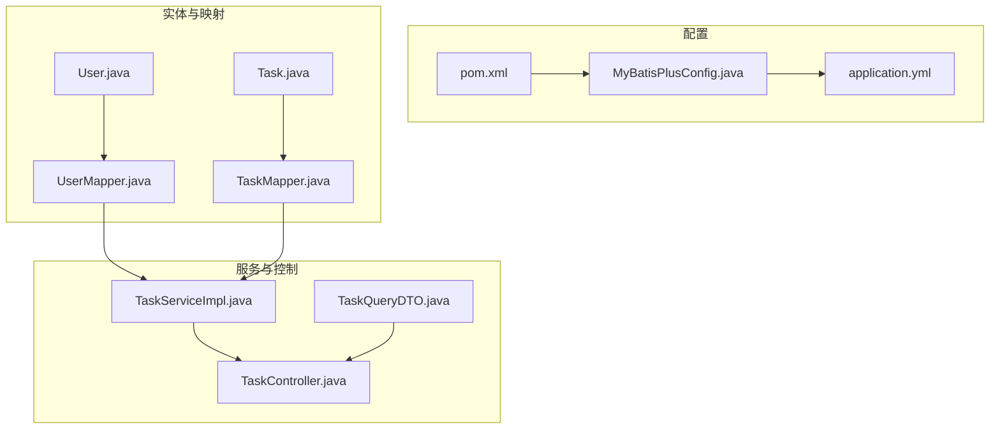
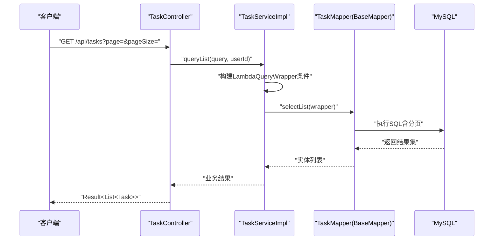
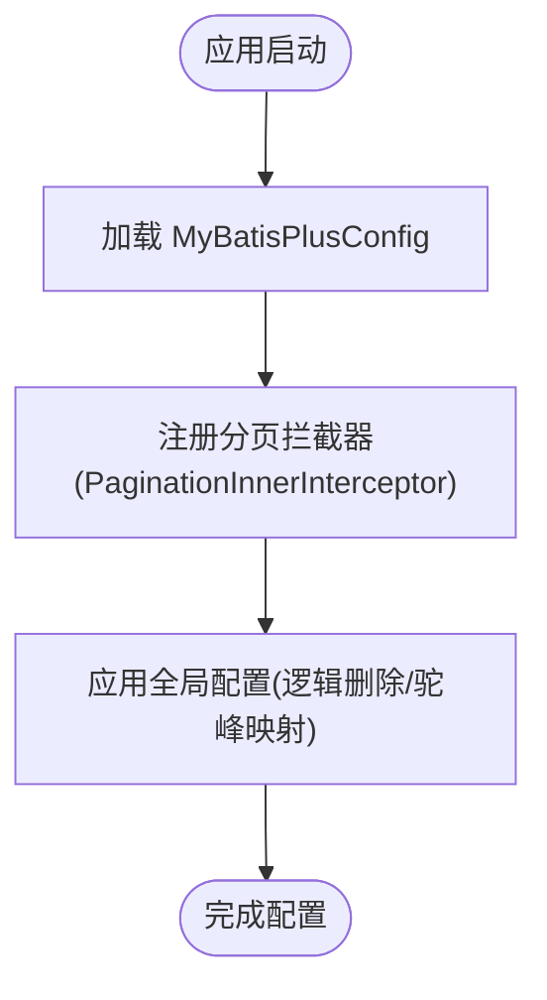
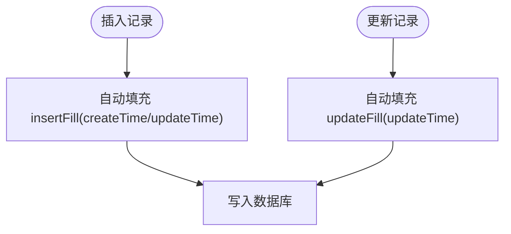
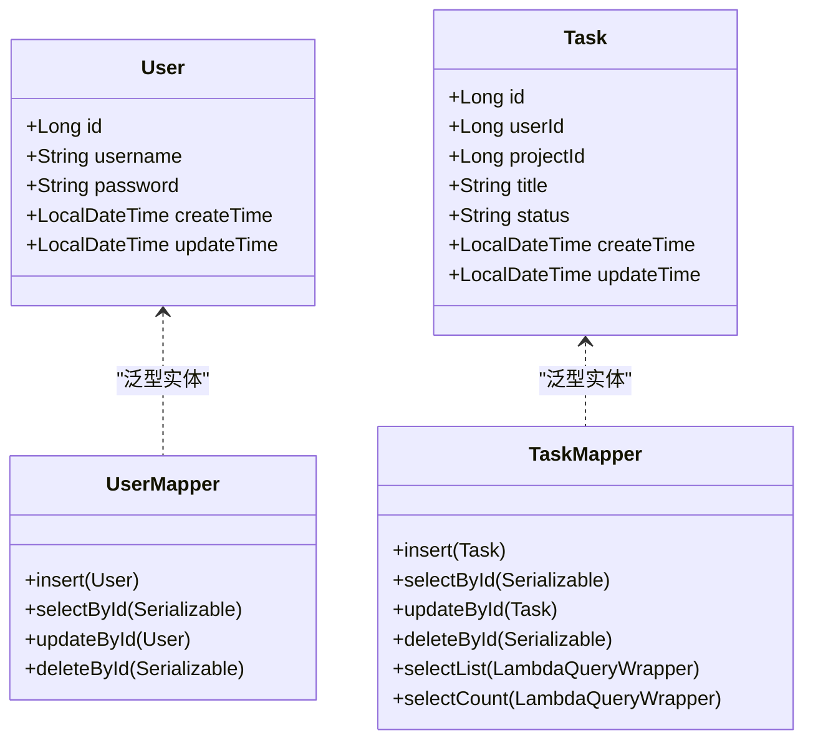
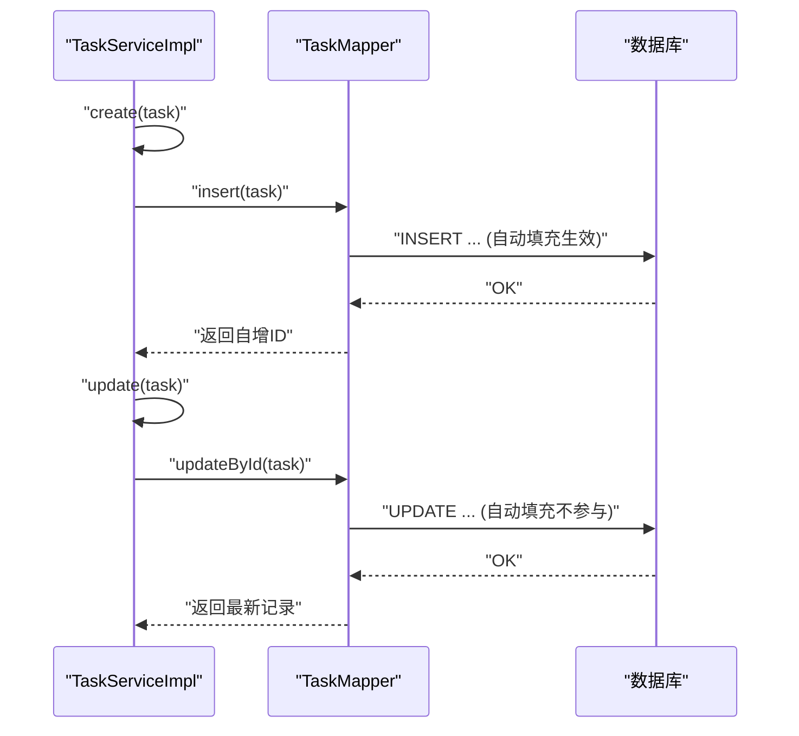
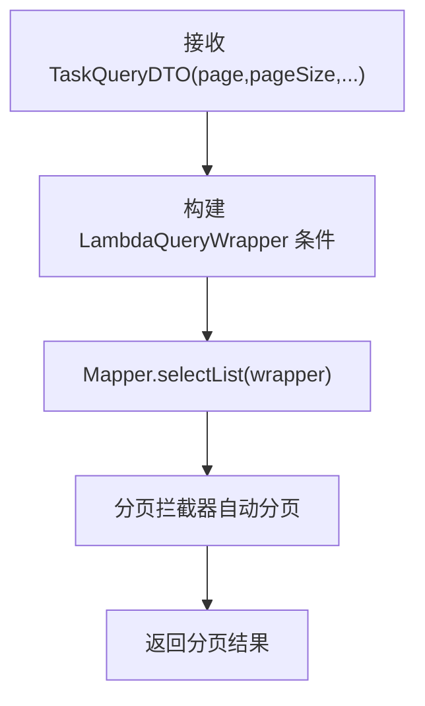
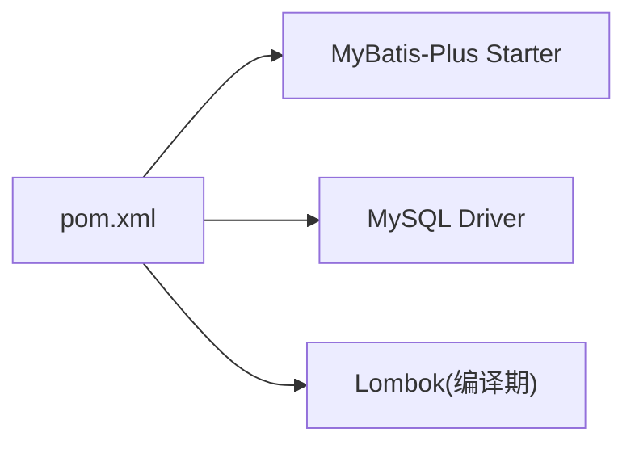

# 数据访问架构

<cite>
**本文引用的文件**
- [MyBatisPlusConfig.java](file://backend/src/main/java/com/newworld/config/MyBatisPlusConfig.java)
- [MyMetaObjectHandler.java](file://backend/src/main/java/com/newworld/config/MyMetaObjectHandler.java)
- [application.yml](file://backend/src/main/resources/application.yml)
- [pom.xml](file://backend/pom.xml)
- [init.sql](file://backend/sql/init.sql)
- [User.java](file://backend/src/main/java/com/newworld/entity/User.java)
- [Task.java](file://backend/src/main/java/com/newworld/entity/Task.java)
- [UserMapper.java](file://backend/src/main/java/com/newworld/mapper/UserMapper.java)
- [TaskMapper.java](file://backend/src/main/java/com/newworld/mapper/TaskMapper.java)
- [TaskServiceImpl.java](file://backend/src/main/java/com/newworld/service/impl/TaskServiceImpl.java)
- [TaskQueryDTO.java](file://backend/src/main/java/com/newworld/dto/TaskQueryDTO.java)
- [TaskController.java](file://backend/src/main/java/com/newworld/controller/TaskController.java)
</cite>

## 目录
1. [简介](#简介)
2. [项目结构](#项目结构)
3. [核心组件](#核心组件)
4. [架构总览](#架构总览)
5. [详细组件分析](#详细组件分析)
6. [依赖分析](#依赖分析)
7. [性能考虑](#性能考虑)
8. [故障排查指南](#故障排查指南)
9. [结论](#结论)
10. [附录](#附录)

## 简介
本文件系统性梳理新世界项目的数据访问架构，重点覆盖以下方面：
- MyBatis-Plus 的配置与使用：分页插件、自动填充、逻辑删除等
- Mapper 接口设计与 SQL 映射机制：基于注解与通用 Mapper 的标准 CRUD 流程
- 元对象处理器 MyMetaObjectHandler 的自动字段填充
- 数据库连接与连接池配置、性能优化策略
- 数据访问层的代码示例路径与最佳实践

## 项目结构
后端采用 Spring Boot + MyBatis-Plus 架构，数据访问层由实体类、Mapper 接口、Service 实现与控制器组成，配置集中在 application.yml 与 MyBatisPlusConfig 中。

图表来源
- [MyBatisPlusConfig.java:1-22](file://backend/src/main/java/com/newworld/config/MyBatisPlusConfig.java#L1-L22)
- [application.yml:36-50](file://backend/src/main/resources/application.yml#L36-L50)
- [pom.xml:46-49](file://backend/pom.xml#L46-L49)
- [User.java:11-37](file://backend/src/main/java/com/newworld/entity/User.java#L11-L37)
- [Task.java:12-62](file://backend/src/main/java/com/newworld/entity/Task.java#L12-L62)
- [UserMapper.java:1-10](file://backend/src/main/java/com/newworld/mapper/UserMapper.java#L1-L10)
- [TaskMapper.java:1-10](file://backend/src/main/java/com/newworld/mapper/TaskMapper.java#L1-L10)
- [TaskServiceImpl.java:18-44](file://backend/src/main/java/com/newworld/service/impl/TaskServiceImpl.java#L18-L44)
- [TaskController.java:17-31](file://backend/src/main/java/com/newworld/controller/TaskController.java#L17-L31)
- [TaskQueryDTO.java:11-47](file://backend/src/main/java/com/newworld/dto/TaskQueryDTO.java#L11-L47)

章节来源
- [application.yml:1-75](file://backend/src/main/resources/application.yml#L1-L75)
- [pom.xml:1-117](file://backend/pom.xml#L1-L117)

## 核心组件
- MyBatis-Plus 分页插件：在 MyBatisPlusConfig 中注册拦截器，使用 MySQL 内核的分页实现。
- 自动填充处理器：MyMetaObjectHandler 基于 MetaObjectHandler，在插入与更新时自动填充时间字段。
- 实体注解：通过 @TableName、@TableId、@TableField、@TableLogic 等注解映射表结构与字段行为。
- 通用 Mapper：Mapper 接口继承 BaseMapper，即可获得标准 CRUD 能力。
- 查询条件构造：Service 层广泛使用 LambdaQueryWrapper 进行链式条件构建。
- 逻辑删除：全局配置中启用逻辑删除字段与值。

章节来源
- [MyBatisPlusConfig.java:15-20](file://backend/src/main/java/com/newworld/config/MyBatisPlusConfig.java#L15-L20)
- [MyMetaObjectHandler.java:13-25](file://backend/src/main/java/com/newworld/config/MyMetaObjectHandler.java#L13-L25)
- [User.java:11-37](file://backend/src/main/java/com/newworld/entity/User.java#L11-L37)
- [Task.java:12-62](file://backend/src/main/java/com/newworld/entity/Task.java#L12-L62)
- [UserMapper.java:1-10](file://backend/src/main/java/com/newworld/mapper/UserMapper.java#L1-L10)
- [TaskMapper.java:1-10](file://backend/src/main/java/com/newworld/mapper/TaskMapper.java#L1-L10)
- [application.yml:44-49](file://backend/src/main/resources/application.yml#L44-L49)

## 架构总览
下图展示从控制器到数据访问层的调用链路与数据流。

图表来源
- [TaskController.java:25-31](file://backend/src/main/java/com/newworld/controller/TaskController.java#L25-L31)
- [TaskServiceImpl.java:23-44](file://backend/src/main/java/com/newworld/service/impl/TaskServiceImpl.java#L23-L44)
- [TaskMapper.java:1-10](file://backend/src/main/java/com/newworld/mapper/TaskMapper.java#L1-L10)

## 详细组件分析

### MyBatis-Plus 配置与分页插件
- 在 MyBatisPlusConfig 中注册 MybatisPlusInterceptor，并添加 PaginationInnerInterceptor（MySQL 内核），实现自动分页。
- application.yml 中配置 mapper-locations、type-aliases-package、驼峰映射、日志实现与全局配置（如逻辑删除字段与值）。

图表来源
- [MyBatisPlusConfig.java:15-20](file://backend/src/main/java/com/newworld/config/MyBatisPlusConfig.java#L15-L20)
- [application.yml:36-50](file://backend/src/main/resources/application.yml#L36-L50)

章节来源
- [MyBatisPlusConfig.java:1-22](file://backend/src/main/java/com/newworld/config/MyBatisPlusConfig.java#L1-L22)
- [application.yml:36-50](file://backend/src/main/resources/application.yml#L36-L50)

### 元对象处理器与自动填充
- MyMetaObjectHandler 实现 MetaObjectHandler，在插入与更新时自动填充 createTime、updateTime 字段。
- 实体类通过 @TableField(fill = INSERT/INSERT_UPDATE) 指定字段参与自动填充。

图表来源
- [MyMetaObjectHandler.java:15-24](file://backend/src/main/java/com/newworld/config/MyMetaObjectHandler.java#L15-L24)
- [User.java:31-37](file://backend/src/main/java/com/newworld/entity/User.java#L31-L37)
- [Task.java:56-62](file://backend/src/main/java/com/newworld/entity/Task.java#L56-L62)

章节来源
- [MyMetaObjectHandler.java:1-26](file://backend/src/main/java/com/newworld/config/MyMetaObjectHandler.java#L1-L26)
- [User.java:11-37](file://backend/src/main/java/com/newworld/entity/User.java#L11-L37)
- [Task.java:12-62](file://backend/src/main/java/com/newworld/entity/Task.java#L12-L62)

### Mapper 接口设计与 SQL 映射机制
- Mapper 接口继承 BaseMapper<T>，即可获得标准 CRUD 能力（insert、selectById、updateById、deleteById 等）。
- 实体类通过 @TableName、@TableId、@TableField、@TableLogic 等注解映射表结构与字段行为。
- Service 层使用 LambdaQueryWrapper 构建复杂查询条件，支持动态拼接 eq、like、between、orderBy 等。

图表来源
- [User.java:11-37](file://backend/src/main/java/com/newworld/entity/User.java#L11-L37)
- [Task.java:12-62](file://backend/src/main/java/com/newworld/entity/Task.java#L12-L62)
- [UserMapper.java:1-10](file://backend/src/main/java/com/newworld/mapper/UserMapper.java#L1-L10)
- [TaskMapper.java:1-10](file://backend/src/main/java/com/newworld/mapper/TaskMapper.java#L1-L10)

章节来源
- [UserMapper.java:1-10](file://backend/src/main/java/com/newworld/mapper/UserMapper.java#L1-L10)
- [TaskMapper.java:1-10](file://backend/src/main/java/com/newworld/mapper/TaskMapper.java#L1-L10)
- [User.java:11-37](file://backend/src/main/java/com/newworld/entity/User.java#L11-L37)
- [Task.java:12-62](file://backend/src/main/java/com/newworld/entity/Task.java#L12-L62)

### 通用 Mapper 的 CRUD 标准流程
- 查询列表：Service 构建条件，Mapper 执行 selectList 返回集合。
- 单条查询：Mapper 执行 selectById，若为空抛出业务异常。
- 新增：Service 设置默认值（如优先级、状态、是否笔记），Mapper 执行 insert，利用自动填充处理时间字段。
- 更新：先校验存在性，再执行 updateById，必要时重新 selectById 获取最新数据。
- 删除：先校验存在性，再执行 deleteById；全局配置启用逻辑删除时，实际走更新标记。

图表来源
- [TaskServiceImpl.java:56-78](file://backend/src/main/java/com/newworld/service/impl/TaskServiceImpl.java#L56-L78)
- [TaskMapper.java:1-10](file://backend/src/main/java/com/newworld/mapper/TaskMapper.java#L1-L10)
- [MyMetaObjectHandler.java:15-24](file://backend/src/main/java/com/newworld/config/MyMetaObjectHandler.java#L15-L24)

章节来源
- [TaskServiceImpl.java:56-78](file://backend/src/main/java/com/newworld/service/impl/TaskServiceImpl.java#L56-L78)
- [TaskServiceImpl.java:46-53](file://backend/src/main/java/com/newworld/service/impl/TaskServiceImpl.java#L46-L53)
- [TaskServiceImpl.java:80-87](file://backend/src/main/java/com/newworld/service/impl/TaskServiceImpl.java#L80-L87)
- [application.yml:44-49](file://backend/src/main/resources/application.yml#L44-L49)

### 查询与分页
- 控制器接收 TaskQueryDTO，解析分页参数 page、pageSize。
- Service 使用 LambdaQueryWrapper 动态拼接条件，支持多字段过滤、范围查询与模糊匹配。
- MyBatis-Plus 分页插件自动对查询进行分页包装，无需手动计算 offset/limit。

图表来源
- [TaskController.java:25-31](file://backend/src/main/java/com/newworld/controller/TaskController.java#L25-L31)
- [TaskQueryDTO.java:11-47](file://backend/src/main/java/com/newworld/dto/TaskQueryDTO.java#L11-L47)
- [TaskServiceImpl.java:23-44](file://backend/src/main/java/com/newworld/service/impl/TaskServiceImpl.java#L23-L44)
- [MyBatisPlusConfig.java:15-20](file://backend/src/main/java/com/newworld/config/MyBatisPlusConfig.java#L15-L20)

章节来源
- [TaskController.java:25-31](file://backend/src/main/java/com/newworld/controller/TaskController.java#L25-L31)
- [TaskQueryDTO.java:11-47](file://backend/src/main/java/com/newworld/dto/TaskQueryDTO.java#L11-L47)
- [TaskServiceImpl.java:23-44](file://backend/src/main/java/com/newworld/service/impl/TaskServiceImpl.java#L23-L44)
- [MyBatisPlusConfig.java:15-20](file://backend/src/main/java/com/newworld/config/MyBatisPlusConfig.java#L15-L20)

### 数据库连接与连接池配置
- application.yml 中配置了 MySQL 驱动、URL、账号密码等基础连接信息。
- 项目引入 Redis 并配置了连接池参数（最大连接、最大空闲、最小空闲、最大等待时间等），用于缓存与会话管理。
- MyBatis-Plus 通过 spring.datasource.* 读取连接信息，无需额外 MyBatis 连接池配置。

章节来源
- [application.yml:10-30](file://backend/src/main/resources/application.yml#L10-L30)
- [pom.xml:46-55](file://backend/pom.xml#L46-L55)

### 代码示例与最佳实践
- 示例路径（仅提供路径，不展示具体代码）：
  - 分页查询示例：[TaskServiceImpl.java:23-44](file://backend/src/main/java/com/newworld/service/impl/TaskServiceImpl.java#L23-L44)
  - 新增记录示例：[TaskServiceImpl.java:56-68](file://backend/src/main/java/com/newworld/service/impl/TaskServiceImpl.java#L56-L68)
  - 更新记录示例：[TaskServiceImpl.java:70-78](file://backend/src/main/java/com/newworld/service/impl/TaskServiceImpl.java#L70-L78)
  - 删除记录示例：[TaskServiceImpl.java:80-87](file://backend/src/main/java/com/newworld/service/impl/TaskServiceImpl.java#L80-L87)
  - 自动填充生效示例：[MyMetaObjectHandler.java:15-24](file://backend/src/main/java/com/newworld/config/MyMetaObjectHandler.java#L15-L24)
  - 逻辑删除配置示例：[application.yml:44-49](file://backend/src/main/resources/application.yml#L44-L49)

## 依赖分析
- MyBatis-Plus 版本：3.5.3.1，通过 mybatis-plus-boot-starter 引入。
- 数据库驱动：mysql-connector-j。
- 项目使用 Lombok 简化实体类代码，但构建时排除 Lombok 以避免运行时依赖。

图表来源
- [pom.xml:46-55](file://backend/pom.xml#L46-L55)
- [pom.xml:86-90](file://backend/pom.xml#L86-L90)

章节来源
- [pom.xml:21-29](file://backend/pom.xml#L21-L29)
- [pom.xml:46-55](file://backend/pom.xml#L46-L55)

## 性能考虑
- 启用 MyBatis-Plus 分页插件，避免一次性加载大量数据。
- 使用 LambdaQueryWrapper 进行条件查询，结合数据库索引（如任务表的多列索引）提升查询效率。
- 合理设置 page、pageSize 参数，避免超大分页导致的性能问题。
- 利用自动填充减少重复赋值，降低业务层负担。
- 对高频查询可结合 Redis 缓存（项目已引入 Redis 组件）。

## 故障排查指南
- 插入/更新时间未填充：确认实体字段已标注 @TableField(fill = INSERT/INSERT_UPDATE)，且 MyMetaObjectHandler 已被 Spring 管理。
- 分页无效：确认 MyBatisPlusConfig 已注册分页拦截器，且查询方法传入了分页参数。
- 逻辑删除未生效：检查 application.yml 中 global-config.db-config 的逻辑删除字段与值配置是否正确。
- 数据库连接失败：核对 application.yml 中 datasource 的 driver-class-name、url、username、password 是否正确。

章节来源
- [MyMetaObjectHandler.java:13-25](file://backend/src/main/java/com/newworld/config/MyMetaObjectHandler.java#L13-L25)
- [MyBatisPlusConfig.java:15-20](file://backend/src/main/java/com/newworld/config/MyBatisPlusConfig.java#L15-L20)
- [application.yml:44-49](file://backend/src/main/resources/application.yml#L44-L49)
- [application.yml:10-16](file://backend/src/main/resources/application.yml#L10-L16)

## 结论
本项目采用 Spring Boot + MyBatis-Plus 的成熟方案，通过通用 Mapper 与自动填充机制显著简化了数据访问层开发；配合分页插件与合理的查询条件构建，能够满足任务管理场景的高效数据操作需求。建议在后续迭代中进一步完善缓存策略与监控埋点，持续优化查询性能与可观测性。

## 附录
- 初始化脚本：包含数据库、表结构、索引与默认用户，便于快速搭建环境。
- 关键实体字段映射：User、Task 等实体均通过注解明确表名、主键与时间字段的自动填充策略。

章节来源
- [init.sql:1-95](file://backend/sql/init.sql#L1-L95)