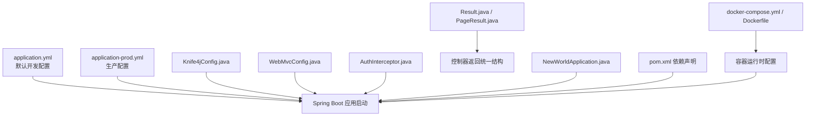
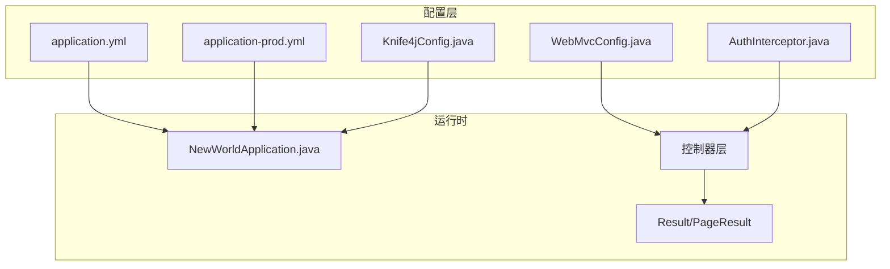
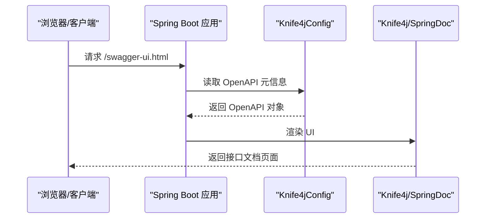
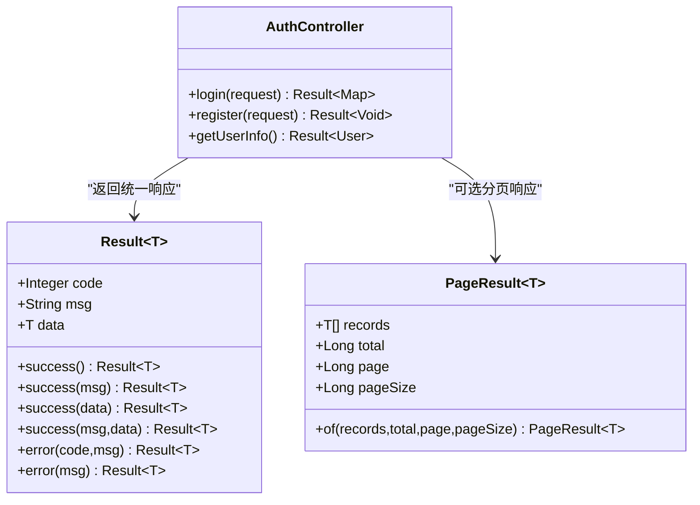
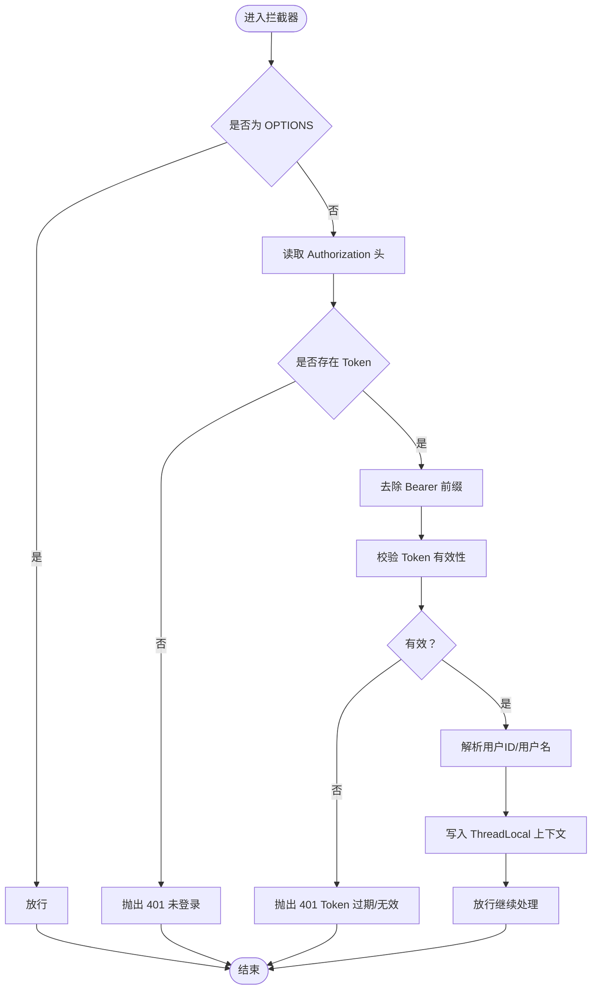
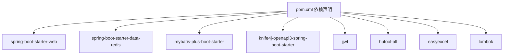

# 配置架构

<cite>
**本文引用的文件**
- [application.yml](file://backend/src/main/resources/application.yml)
- [application-prod.yml](file://backend/src/main/resources/application-prod.yml)
- [Knife4jConfig.java](file://backend/src/main/java/com/newworld/config/Knife4jConfig.java)
- [WebMvcConfig.java](file://backend/src/main/java/com/newworld/config/WebMvcConfig.java)
- [AuthInterceptor.java](file://backend/src/main/java/com/newworld/config/AuthInterceptor.java)
- [Result.java](file://backend/src/main/java/com/newworld/common/Result.java)
- [PageResult.java](file://backend/src/main/java/com/newworld/common/PageResult.java)
- [AuthController.java](file://backend/src/main/java/com/newworld/controller/AuthController.java)
- [NewWorldApplication.java](file://backend/src/main/java/com/newworld/NewWorldApplication.java)
- [pom.xml](file://backend/pom.xml)
- [docker-compose.yml](file://docker-compose.yml)
- [Dockerfile](file://backend/Dockerfile)
</cite>

## 目录
1. [简介](#简介)
2. [项目结构](#项目结构)
3. [核心组件](#核心组件)
4. [架构总览](#架构总览)
5. [详细组件分析](#详细组件分析)
6. [依赖分析](#依赖分析)
7. [性能考虑](#性能考虑)
8. [故障排查指南](#故障排查指南)
9. [结论](#结论)
10. [附录](#附录)

## 简介
本文件系统性梳理新世界项目的配置架构，重点覆盖：
- Spring Boot 配置文件结构与加载顺序、优先级规则
- 开发环境与生产环境配置差异及最佳实践
- Knife4j/Swagger 文档集成与访问路径
- 统一响应包装 Result 与分页结果 PageResult 的设计模式
- 环境变量与外部化配置的使用方式
- 常见配置问题与排障建议

## 项目结构
后端采用标准 Spring Boot 结构，配置集中在 resources 下的 application.yml 及 application-prod.yml；核心配置类位于 config 包，统一响应模型位于 common 包，入口类在根包下。

图表来源
- [application.yml:1-75](file://backend/src/main/resources/application.yml#L1-L75)
- [application-prod.yml:1-24](file://backend/src/main/resources/application-prod.yml#L1-L24)
- [Knife4jConfig.java:1-27](file://backend/src/main/java/com/newworld/config/Knife4jConfig.java#L1-L27)
- [WebMvcConfig.java:1-53](file://backend/src/main/java/com/newworld/config/WebMvcConfig.java#L1-L53)
- [AuthInterceptor.java:1-78](file://backend/src/main/java/com/newworld/config/AuthInterceptor.java#L1-L78)
- [Result.java:1-90](file://backend/src/main/java/com/newworld/common/Result.java#L1-L90)
- [PageResult.java:1-36](file://backend/src/main/java/com/newworld/common/PageResult.java#L1-L36)
- [NewWorldApplication.java:1-13](file://backend/src/main/java/com/newworld/NewWorldApplication.java#L1-L13)
- [pom.xml:1-117](file://backend/pom.xml#L1-L117)
- [docker-compose.yml:1-14](file://docker-compose.yml#L1-L14)
- [Dockerfile:1-14](file://backend/Dockerfile#L1-L14)

章节来源
- [application.yml:1-75](file://backend/src/main/resources/application.yml#L1-L75)
- [application-prod.yml:1-24](file://backend/src/main/resources/application-prod.yml#L1-L24)
- [NewWorldApplication.java:1-13](file://backend/src/main/java/com/newworld/NewWorldApplication.java#L1-L13)

## 核心组件
- 配置文件与加载顺序：application.yml 作为默认基础配置，application-prod.yml 在激活 prod profile 时合并覆盖。
- Knife4j/SpringDoc 集成：通过 Knife4jConfig 定义 OpenAPI 元信息，并在 application.yml 中声明 UI 路径。
- Web 层配置：跨域、静态资源映射、拦截器注册与放行路径。
- 安全拦截：JWT 认证拦截器，校验 Token 并注入当前用户上下文。
- 统一响应：Result<T> 提供成功/失败封装；PageResult<T> 提供分页数据封装。
- 运行时配置：Dockerfile 与 docker-compose.yml 将 SPRING_PROFILES_ACTIVE 设置为 prod。

章节来源
- [application.yml:51-64](file://backend/src/main/resources/application.yml#L51-L64)
- [application-prod.yml:1-24](file://backend/src/main/resources/application-prod.yml#L1-L24)
- [Knife4jConfig.java:1-27](file://backend/src/main/java/com/newworld/config/Knife4jConfig.java#L1-L27)
- [WebMvcConfig.java:1-53](file://backend/src/main/java/com/newworld/config/WebMvcConfig.java#L1-L53)
- [AuthInterceptor.java:1-78](file://backend/src/main/java/com/newworld/config/AuthInterceptor.java#L1-L78)
- [Result.java:1-90](file://backend/src/main/java/com/newworld/common/Result.java#L1-L90)
- [PageResult.java:1-36](file://backend/src/main/java/com/newworld/common/PageResult.java#L1-L36)
- [docker-compose.yml:11-12](file://docker-compose.yml#L11-L12)
- [Dockerfile:12-12](file://backend/Dockerfile#L12-L12)

## 架构总览
下图展示配置层如何影响应用行为：从配置文件到 Bean 注入，再到 Web 层处理与统一响应输出。

图表来源
- [application.yml:1-75](file://backend/src/main/resources/application.yml#L1-L75)
- [application-prod.yml:1-24](file://backend/src/main/resources/application-prod.yml#L1-L24)
- [Knife4jConfig.java:1-27](file://backend/src/main/java/com/newworld/config/Knife4jConfig.java#L1-L27)
- [WebMvcConfig.java:1-53](file://backend/src/main/java/com/newworld/config/WebMvcConfig.java#L1-L53)
- [AuthInterceptor.java:1-78](file://backend/src/main/java/com/newworld/config/AuthInterceptor.java#L1-L78)
- [NewWorldApplication.java:1-13](file://backend/src/main/java/com/newworld/NewWorldApplication.java#L1-L13)
- [AuthController.java:1-55](file://backend/src/main/java/com/newworld/controller/AuthController.java#L1-L55)
- [Result.java:1-90](file://backend/src/main/java/com/newworld/common/Result.java#L1-L90)
- [PageResult.java:1-36](file://backend/src/main/java/com/newworld/common/PageResult.java#L1-L36)

## 详细组件分析

### 配置文件结构与加载顺序
- 默认配置：application.yml 提供开发环境的数据库、Redis、Jackson、MyBatis-Plus、Knife4j、JWT、日志等基础配置。
- 生产配置：application-prod.yml 仅保留必要的覆盖项（如密码占位符、日志级别、日志实现），其余沿用默认配置。
- 加载顺序与优先级（简述）：命令行参数 > 系统环境变量 > 文件 application-{profile}.yml > 文件 application.yml。容器中通过环境变量 SPRING_PROFILES_ACTIVE 指定 prod。
- 外部化配置：生产环境使用环境变量覆盖敏感字段（如 MYSQL_ROOT_PASSWORD、REDIS_PASSWORD），避免硬编码。

章节来源
- [application.yml:1-75](file://backend/src/main/resources/application.yml#L1-L75)
- [application-prod.yml:1-24](file://backend/src/main/resources/application-prod.yml#L1-L24)
- [docker-compose.yml:11-12](file://docker-compose.yml#L11-L12)
- [Dockerfile:12-12](file://backend/Dockerfile#L12-L12)

### Knife4j/Swagger 集成
- 文档配置：通过 Knife4jConfig 定义 OpenAPI 元信息（标题、版本、描述、联系人、许可证）。
- UI 路径：在 application.yml 中定义 swagger-ui 和 api-docs 的访问路径。
- 访问方式：启动后可通过 /swagger-ui.html 或 /v3/api-docs 获取接口文档。

图表来源
- [Knife4jConfig.java:16-25](file://backend/src/main/java/com/newworld/config/Knife4jConfig.java#L16-L25)
- [application.yml:51-57](file://backend/src/main/resources/application.yml#L51-L57)

章节来源
- [application.yml:51-57](file://backend/src/main/resources/application.yml#L51-L57)
- [Knife4jConfig.java:1-27](file://backend/src/main/java/com/newworld/config/Knife4jConfig.java#L1-L27)

### 统一响应包装 Result 与分页结果 PageResult
- 设计目标：统一前后端交互格式，减少样板代码，提升一致性。
- Result<T>：提供多种 success/error 工厂方法，支持无参、带消息、带数据、带消息+数据组合。
- PageResult<T>：封装分页数据（records、total、page、pageSize），提供 of 工厂方法快速构建。
- 控制器使用：控制器返回 Result 或 PageResult，由 Spring 自动序列化为 JSON。

图表来源
- [Result.java:8-89](file://backend/src/main/java/com/newworld/common/Result.java#L8-L89)
- [PageResult.java:11-35](file://backend/src/main/java/com/newworld/common/PageResult.java#L11-L35)
- [AuthController.java:25-47](file://backend/src/main/java/com/newworld/controller/AuthController.java#L25-L47)

章节来源
- [Result.java:1-90](file://backend/src/main/java/com/newworld/common/Result.java#L1-L90)
- [PageResult.java:1-36](file://backend/src/main/java/com/newworld/common/PageResult.java#L1-L36)
- [AuthController.java:1-55](file://backend/src/main/java/com/newworld/controller/AuthController.java#L1-L55)

### Web 层配置与拦截器
- 跨域配置：允许任意来源、方法、头，支持凭据，预检请求缓存 1 小时。
- 静态资源：映射 Knife4j UI 所需的 doc.html 与 webjars 资源。
- 拦截器：对 /api/** 路径启用 JWT 校验，排除登录、注册、系统相关接口与文档路径。
- 拦截器逻辑：校验 Authorization 头，去除 Bearer 前缀，验证 Token 并将用户信息放入 ThreadLocal，完成后清理。

图表来源
- [WebMvcConfig.java:19-33](file://backend/src/main/java/com/newworld/config/WebMvcConfig.java#L19-L33)
- [AuthInterceptor.java:30-58](file://backend/src/main/java/com/newworld/config/AuthInterceptor.java#L30-L58)

章节来源
- [WebMvcConfig.java:1-53](file://backend/src/main/java/com/newworld/config/WebMvcConfig.java#L1-L53)
- [AuthInterceptor.java:1-78](file://backend/src/main/java/com/newworld/config/AuthInterceptor.java#L1-L78)

### 运行时配置与外部化
- 容器运行：docker-compose.yml 与 Dockerfile 将 SPRING_PROFILES_ACTIVE 设为 prod，确保加载 application-prod.yml。
- 环境变量覆盖：生产配置中使用 ${VAR:default} 形式，若环境变量未设置则回退默认值。
- 日志级别：开发默认 debug，生产默认 info，便于控制输出量。

章节来源
- [docker-compose.yml:11-12](file://docker-compose.yml#L11-L12)
- [Dockerfile:12-12](file://backend/Dockerfile#L12-L12)
- [application-prod.yml:21-24](file://backend/src/main/resources/application-prod.yml#L21-L24)

## 依赖分析
- 依赖范围：Spring Boot Web、Redis、Validation、MyBatis-Plus、Knife4j、Hutool、EasyExcel、JWT、Lombok 等。
- 版本管理：集中于 pom.properties，便于升级与一致性维护。
- 运行产物：打包生成 newworld.jar，容器镜像基于 openjdk:8-jre-slim 运行。

图表来源
- [pom.xml:31-96](file://backend/pom.xml#L31-L96)

章节来源
- [pom.xml:1-117](file://backend/pom.xml#L1-L117)

## 性能考虑
- 日志实现：生产环境使用 SLF4J 输出，降低控制台日志开销；开发环境使用 StdOut 实现便于调试。
- MyBatis-Plus：关闭二级缓存，避免复杂场景下的缓存一致性问题；开启下划线转驼峰映射。
- Redis 连接池：合理配置最大连接、等待时间与空闲阈值，避免资源争用。
- 跨域策略：生产环境建议限制具体来源而非通配符，减少不必要的 CORS 风险。

章节来源
- [application.yml:40-49](file://backend/src/main/resources/application.yml#L40-L49)
- [application-prod.yml:17-24](file://backend/src/main/resources/application-prod.yml#L17-L24)

## 故障排查指南
- 文档无法访问
  - 检查 application.yml 中 springdoc/swagger-ui 路径是否正确。
  - 确认 Knife4jConfig 是否生效，OpenAPI Bean 是否被扫描。
  - 参考章节来源
    - [application.yml:51-57](file://backend/src/main/resources/application.yml#L51-L57)
    - [Knife4jConfig.java:16-25](file://backend/src/main/java/com/newworld/config/Knife4jConfig.java#L16-L25)
- Token 401 未登录/过期
  - 确认请求头 Authorization 是否携带 Bearer Token。
  - 检查拦截器排除路径是否误放行了受保护接口。
  - 参考章节来源
    - [AuthInterceptor.java:30-58](file://backend/src/main/java/com/newworld/config/AuthInterceptor.java#L30-L58)
    - [WebMvcConfig.java:19-33](file://backend/src/main/java/com/newworld/config/WebMvcConfig.java#L19-L33)
- 密码或连接失败
  - 生产环境检查环境变量是否注入，确认 ${VAR:default} 是否回退到默认值。
  - 参考章节来源
    - [application-prod.yml:9-14](file://backend/src/main/resources/application-prod.yml#L9-L14)
- 日志级别过高导致性能下降
  - 生产环境将日志级别调整为 info 或更高。
  - 参考章节来源
    - [application-prod.yml:21-24](file://backend/src/main/resources/application-prod.yml#L21-L24)

## 结论
本项目以清晰的配置分层与统一响应模型为核心，结合 Knife4j 文档与 JWT 拦截器，形成可维护、可扩展且易运维的后端配置架构。通过环境变量与 profile 切换实现开发与生产的无缝衔接，推荐在团队内固化配置规范与部署流程，持续优化日志与缓存策略。

## 附录
- 配置优先级（简述）
  - 命令行参数 > 系统环境变量 > application-{profile}.yml > application.yml
  - 容器中通过 SPRING_PROFILES_ACTIVE 指定 prod
- 最佳实践
  - 敏感信息全部外部化，避免硬编码
  - 生产环境最小权限原则，严格控制跨域来源
  - 统一使用 Result/PageResult，保持接口一致性
  - 明确拦截器放行路径，避免安全漏洞
- 常见问题
  - 文档路径不一致导致 404
  - Token 缺失或格式错误导致 401
  - 环境变量未注入导致连接失败