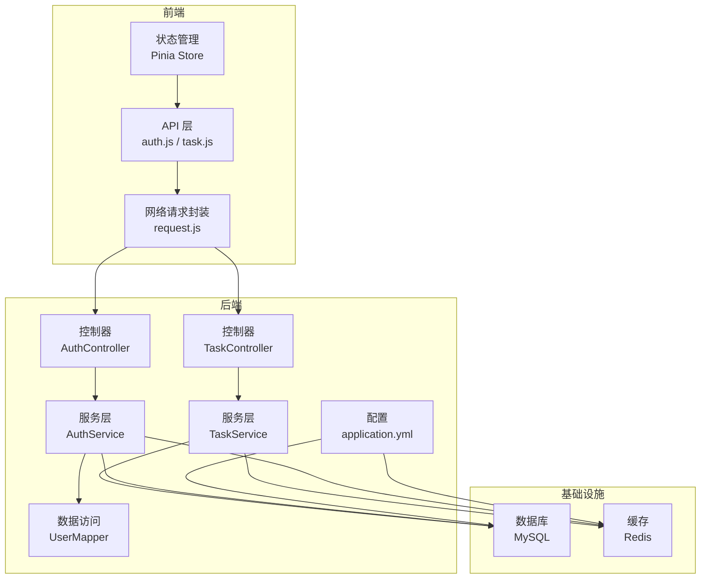
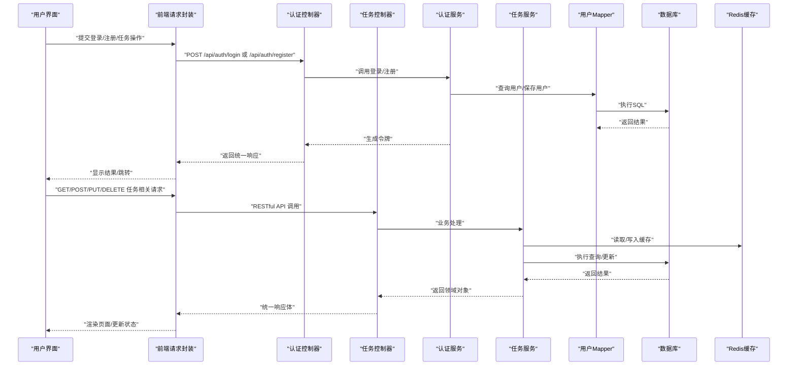
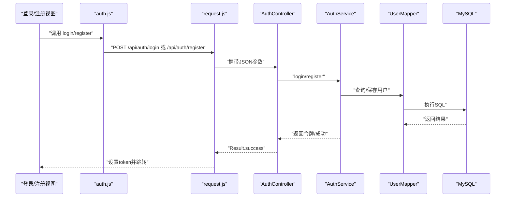
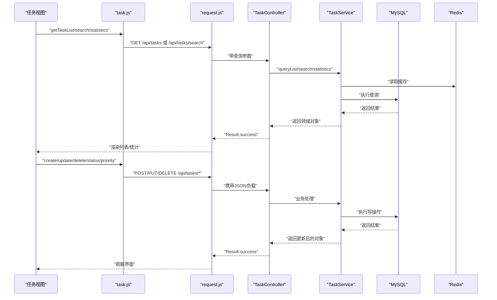
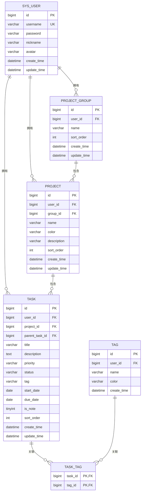
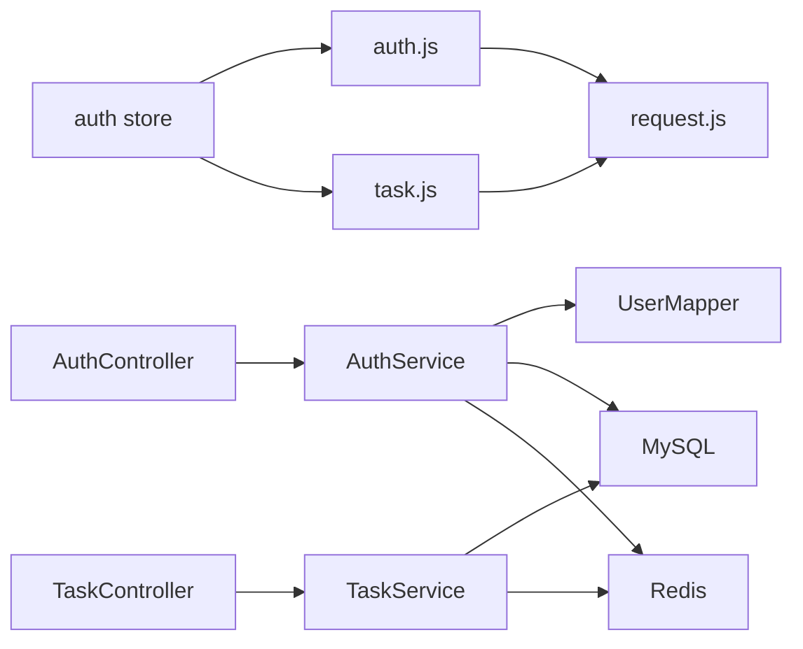

# 数据流设计

<cite>
**本文引用的文件**
- [Result.java](file://backend/src/main/java/com/newworld/common/Result.java)
- [PageResult.java](file://backend/src/main/java/com/newworld/common/PageResult.java)
- [GlobalExceptionHandler.java](file://backend/src/main/java/com/newworld/common/exception/GlobalExceptionHandler.java)
- [application.yml](file://backend/src/main/resources/application.yml)
- [AuthController.java](file://backend/src/main/java/com/newworld/controller/AuthController.java)
- [TaskController.java](file://backend/src/main/java/com/newworld/controller/TaskController.java)
- [AuthService.java](file://backend/src/main/java/com/newworld/service/AuthService.java)
- [TaskService.java](file://backend/src/main/java/com/newworld/service/TaskService.java)
- [UserMapper.java](file://backend/src/main/java/com/newworld/mapper/UserMapper.java)
- [LoginRequest.java](file://backend/src/main/java/com/newworld/dto/LoginRequest.java)
- [auth.js（前端）](file://frontend/src/api/auth.js)
- [task.js（前端）](file://frontend/src/api/task.js)
- [request.js（前端）](file://frontend/src/utils/request.js)
- [auth.js（Pinia Store）](file://frontend/src/stores/auth.js)
- [init.sql](file://backend/sql/init.sql)
</cite>

## 目录
1. [简介](#简介)
2. [项目结构](#项目结构)
3. [核心组件](#核心组件)
4. [架构总览](#架构总览)
5. [详细组件分析](#详细组件分析)
6. [依赖分析](#依赖分析)
7. [性能考虑](#性能考虑)
8. [故障排查指南](#故障排查指南)
9. [结论](#结论)
10. [附录](#附录)

## 简介
本设计文档围绕“新世界”项目，系统化梳理从前端用户界面到后端服务与数据库的完整数据流。重点覆盖以下方面：
- 前端请求发送与拦截器注入
- 后端RESTful API设计与统一响应体
- 数据库查询与MyBatis-Plus集成
- 错误处理与全局异常映射
- 前后端数据验证机制
- 缓存策略（浏览器本地存储与Redis）
- 实时更新机制（WebSocket与轮询策略）
- 数据流图与时序图，直观展示数据在系统中的流转过程

## 项目结构
项目采用前后端分离架构，前端基于Vue 3 + Vite，后端基于Spring Boot + MyBatis-Plus，数据库为MySQL，使用Redis作为缓存层。

图表来源
- [application.yml:1-75](file://backend/src/main/resources/application.yml#L1-L75)
- [AuthController.java:1-55](file://backend/src/main/java/com/newworld/controller/AuthController.java#L1-L55)
- [TaskController.java:1-112](file://backend/src/main/java/com/newworld/controller/TaskController.java#L1-L112)
- [AuthService.java:1-24](file://backend/src/main/java/com/newworld/service/AuthService.java#L1-L24)
- [TaskService.java:1-76](file://backend/src/main/java/com/newworld/service/TaskService.java#L1-L76)
- [UserMapper.java:1-10](file://backend/src/main/java/com/newworld/mapper/UserMapper.java#L1-L10)
- [auth.js（前端）:1-14](file://frontend/src/api/auth.js#L1-L14)
- [task.js（前端）:1-54](file://frontend/src/api/task.js#L1-L54)
- [request.js（前端）:1-56](file://frontend/src/utils/request.js#L1-L56)

章节来源
- [application.yml:1-75](file://backend/src/main/resources/application.yml#L1-L75)
- [AuthController.java:1-55](file://backend/src/main/java/com/newworld/controller/AuthController.java#L1-L55)
- [TaskController.java:1-112](file://backend/src/main/java/com/newworld/controller/TaskController.java#L1-L112)
- [auth.js（前端）:1-14](file://frontend/src/api/auth.js#L1-L14)
- [task.js（前端）:1-54](file://frontend/src/api/task.js#L1-L54)
- [request.js（前端）:1-56](file://frontend/src/utils/request.js#L1-L56)

## 核心组件
- 统一响应体与分页模型：后端通过统一响应体包装所有接口返回，便于前端一致处理；分页场景使用分页模型承载记录集与元信息。
- 全局异常处理：集中捕获业务异常、参数异常与系统异常，统一映射为标准响应。
- RESTful API 设计：遵循资源命名与HTTP动词约定，路径前缀统一为/api，参数与响应格式标准化。
- 前端请求封装：Axios实例封装基础URL、超时、请求/响应拦截器，自动注入鉴权头与错误提示。
- 数据访问层：MyBatis-Plus Mapper接口，结合实体类完成数据库CRUD与逻辑删除。
- 配置中心：数据源、Redis、Jackson、MyBatis-Plus、Knife4j等配置集中管理。

章节来源
- [Result.java:1-90](file://backend/src/main/java/com/newworld/common/Result.java#L1-L90)
- [PageResult.java:1-36](file://backend/src/main/java/com/newworld/common/PageResult.java#L1-L36)
- [GlobalExceptionHandler.java:1-35](file://backend/src/main/java/com/newworld/common/exception/GlobalExceptionHandler.java#L1-L35)
- [application.yml:1-75](file://backend/src/main/resources/application.yml#L1-L75)

## 架构总览
下图展示了从用户界面到数据库的完整数据流向，包括认证、任务管理、数据库与缓存交互。

图表来源
- [AuthController.java:25-53](file://backend/src/main/java/com/newworld/controller/AuthController.java#L25-L53)
- [TaskController.java:25-110](file://backend/src/main/java/com/newworld/controller/TaskController.java#L25-L110)
- [AuthService.java:8-23](file://backend/src/main/java/com/newworld/service/AuthService.java#L8-L23)
- [TaskService.java:9-75](file://backend/src/main/java/com/newworld/service/TaskService.java#L9-L75)
- [UserMapper.java:1-10](file://backend/src/main/java/com/newworld/mapper/UserMapper.java#L1-L10)
- [auth.js（前端）:3-13](file://frontend/src/api/auth.js#L3-L13)
- [task.js（前端）:3-53](file://frontend/src/api/task.js#L3-L53)
- [request.js（前端）:4-53](file://frontend/src/utils/request.js#L4-L53)

## 详细组件分析

### 认证流程（登录/注册/信息查询）
- 前端通过API模块发起登录/注册请求，携带用户名与密码；信息查询接口用于获取当前用户详情。
- 后端控制器接收请求，进行参数校验（如非空），调用认证服务生成或验证令牌，最终以统一响应体返回。
- 前端Store负责持久化令牌与用户信息，并在请求拦截器中注入Authorization头。

图表来源
- [auth.js（前端）:3-13](file://frontend/src/api/auth.js#L3-L13)
- [request.js（前端）:4-53](file://frontend/src/utils/request.js#L4-L53)
- [AuthController.java:25-53](file://backend/src/main/java/com/newworld/controller/AuthController.java#L25-L53)
- [AuthService.java:8-23](file://backend/src/main/java/com/newworld/service/AuthService.java#L8-L23)
- [UserMapper.java:1-10](file://backend/src/main/java/com/newworld/mapper/UserMapper.java#L1-L10)

章节来源
- [auth.js（前端）:1-14](file://frontend/src/api/auth.js#L1-L14)
- [auth.js（Pinia Store）:16-31](file://frontend/src/stores/auth.js#L16-L31)
- [request.js（前端）:9-19](file://frontend/src/utils/request.js#L9-L19)
- [AuthController.java:25-53](file://backend/src/main/java/com/newworld/controller/AuthController.java#L25-L53)
- [LoginRequest.java:13-19](file://backend/src/main/java/com/newworld/dto/LoginRequest.java#L13-L19)

### 任务管理流程（查询/创建/更新/删除/状态变更/优先级/复制/归档/转换/分享/搜索/统计）
- 前端通过task.js封装的RESTful方法调用后端接口，支持分页查询、按ID获取、创建、更新、删除、状态与优先级变更、复制、归档、转换为笔记、生成分享链接、关键词搜索与统计。
- 控制器根据当前登录用户ID过滤数据，服务层执行具体业务逻辑，必要时访问数据库与缓存。
- 统一响应体确保前后端交互一致性。

图表来源
- [task.js（前端）:3-53](file://frontend/src/api/task.js#L3-L53)
- [request.js（前端）:4-53](file://frontend/src/utils/request.js#L4-L53)
- [TaskController.java:25-110](file://backend/src/main/java/com/newworld/controller/TaskController.java#L25-L110)
- [TaskService.java:9-75](file://backend/src/main/java/com/newworld/service/TaskService.java#L9-L75)

章节来源
- [task.js（前端）:1-54](file://frontend/src/api/task.js#L1-L54)
- [TaskController.java:1-112](file://backend/src/main/java/com/newworld/controller/TaskController.java#L1-L112)
- [TaskService.java:1-76](file://backend/src/main/java/com/newworld/service/TaskService.java#L1-L76)

### 数据模型与索引
- 用户、项目分组、项目、任务、标签及任务标签关联表构成核心数据模型。
- 任务表建立多列索引以优化查询性能，插入默认管理员账户用于演示。

图表来源
- [init.sql:8-95](file://backend/sql/init.sql#L8-L95)

章节来源
- [init.sql:1-95](file://backend/sql/init.sql#L1-L95)

### 前后端数据验证机制
- 前端验证：在表单组件层面进行输入校验（如必填、长度、格式），并在提交前阻止无效数据进入API层。
- 后端验证：使用Bean Validation注解对请求参数进行约束校验，控制器方法标注@Valid触发校验，非法参数由全局异常处理器映射为400错误。

章节来源
- [LoginRequest.java:13-19](file://backend/src/main/java/com/newworld/dto/LoginRequest.java#L13-L19)
- [GlobalExceptionHandler.java:23-27](file://backend/src/main/java/com/newworld/common/exception/GlobalExceptionHandler.java#L23-L27)

### 缓存策略
- 浏览器缓存：前端通过localStorage持久化token与用户信息，减少重复登录成本。
- 服务器缓存：Redis用于热点数据缓存与会话存储，提升查询与写入性能；MyBatis-Plus配置关闭二级缓存，避免复杂场景下的脏读风险。

章节来源
- [application.yml:17-30](file://backend/src/main/resources/application.yml#L17-L30)
- [auth.js（Pinia Store）:6-14](file://frontend/src/stores/auth.js#L6-L14)
- [request.js（前端）:12-16](file://frontend/src/utils/request.js#L12-L16)

### 实时数据更新机制
- WebSocket：可选方案，适用于需要即时推送的任务状态变更、通知等场景；需在后端引入WebSocket支持并在前端订阅频道。
- 轮询策略：对于非强实时需求，可通过定时轮询接口（如任务统计、列表刷新）实现近实时更新；建议设置合理的轮询间隔与节流策略。

[本节为通用指导，不直接分析具体文件，故无章节来源]

## 依赖分析
- 控制器依赖服务层，服务层依赖Mapper与数据库；前端API模块依赖网络封装与状态管理。
- 配置文件集中定义数据源、缓存、序列化与文档化等能力，影响整体运行时行为。

图表来源
- [AuthController.java:1-55](file://backend/src/main/java/com/newworld/controller/AuthController.java#L1-L55)
- [TaskController.java:1-112](file://backend/src/main/java/com/newworld/controller/TaskController.java#L1-L112)
- [AuthService.java:1-24](file://backend/src/main/java/com/newworld/service/AuthService.java#L1-L24)
- [TaskService.java:1-76](file://backend/src/main/java/com/newworld/service/TaskService.java#L1-L76)
- [UserMapper.java:1-10](file://backend/src/main/java/com/newworld/mapper/UserMapper.java#L1-L10)
- [auth.js（前端）:1-14](file://frontend/src/api/auth.js#L1-L14)
- [task.js（前端）:1-54](file://frontend/src/api/task.js#L1-L54)
- [request.js（前端）:1-56](file://frontend/src/utils/request.js#L1-L56)

章节来源
- [application.yml:1-75](file://backend/src/main/resources/application.yml#L1-L75)

## 性能考虑
- 数据库层面：为任务表建立复合索引，优化按用户、日期与状态的查询；合理分页，避免一次性加载大量数据。
- 缓存层面：对高频读取的统计信息与用户信息进行缓存；写操作采用缓存失效策略，保证一致性。
- 序列化与网络：统一时间格式与时区，减少跨端解析开销；设置合理的请求超时与重试策略。
- 前端渲染：虚拟滚动与懒加载，降低DOM压力；批量更新状态，减少不必要的重渲染。

[本节提供通用建议，不直接分析具体文件，故无章节来源]

## 故障排查指南
- 统一错误处理：全局异常处理器将业务异常、参数异常与系统异常映射为标准响应，前端根据code与message进行提示与路由跳转。
- 前端拦截器：对401未授权进行登出处理并跳转登录页；对403禁止访问、500服务器错误进行提示。
- 建议排查步骤：确认令牌是否正确注入；检查后端日志级别与异常栈；核对数据库连接与Redis连通性；验证请求参数与响应格式。

章节来源
- [GlobalExceptionHandler.java:17-33](file://backend/src/main/java/com/newworld/common/exception/GlobalExceptionHandler.java#L17-L33)
- [request.js（前端）:21-53](file://frontend/src/utils/request.js#L21-L53)

## 结论
本设计文档从数据流视角梳理了“新世界”项目的前后端协作方式，明确了RESTful API设计原则、统一响应体与异常处理机制、数据库与缓存策略，以及认证与任务管理的关键流程。通过可视化图表与分层说明，有助于开发者快速理解系统架构与数据流转，为后续扩展与优化提供参考。

## 附录
- API设计要点
  - 路径前缀：/api
  - 方法：GET/POST/PUT/DELETE
  - 参数：查询参数用于筛选，请求体用于创建/更新
  - 响应：统一使用Result或PageResult包装
- 数据验证要点
  - 前端：表单级校验与必填项提示
  - 后端：@NotBlank等注解与全局异常映射
- 缓存与实时更新
  - 浏览器：localStorage持久化
  - 服务器：Redis缓存热点数据
  - 实时：WebSocket或轮询策略

[本节为概念性总结，不直接分析具体文件，故无章节来源]