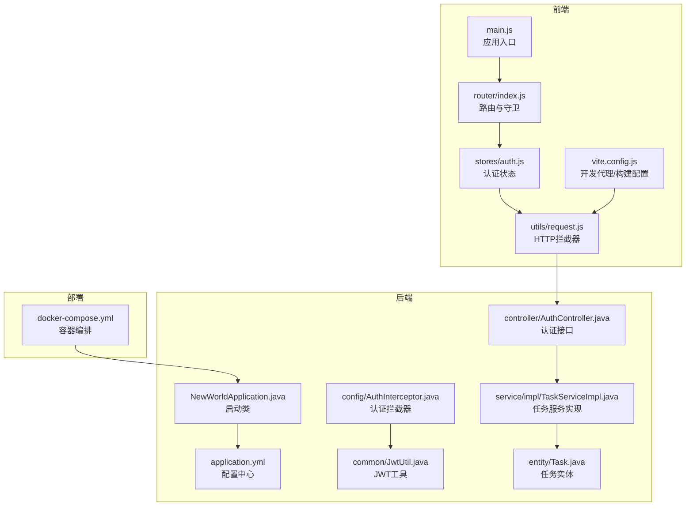
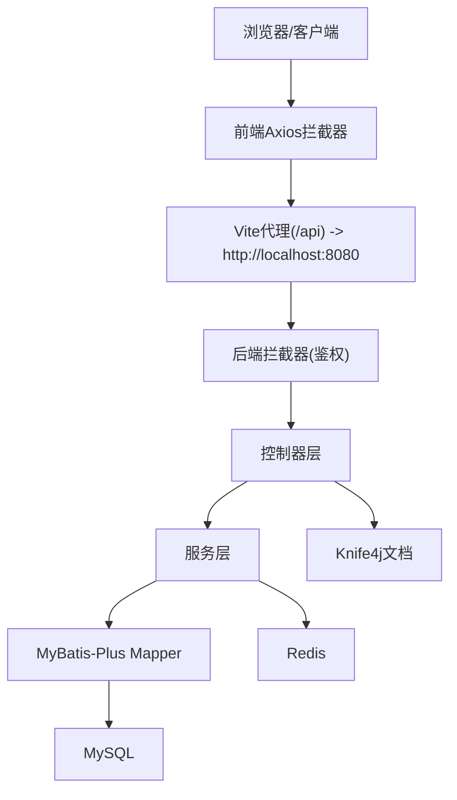
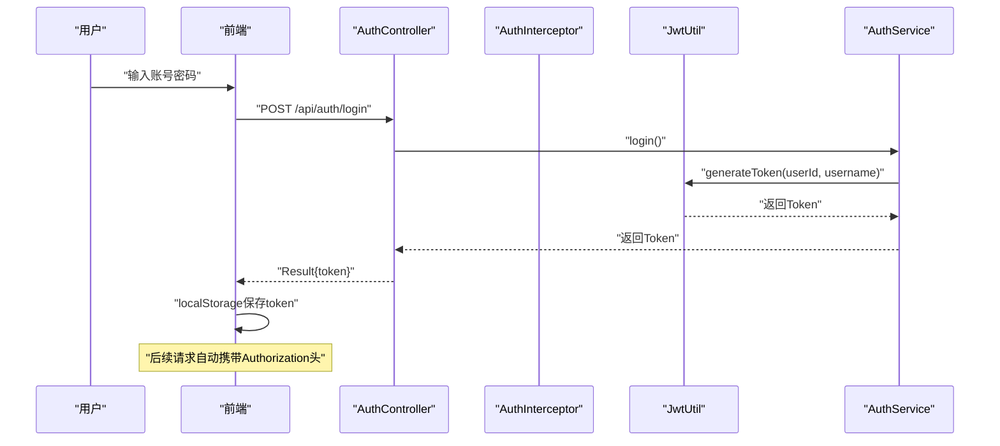
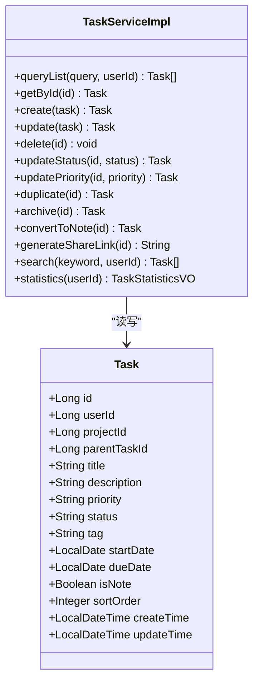
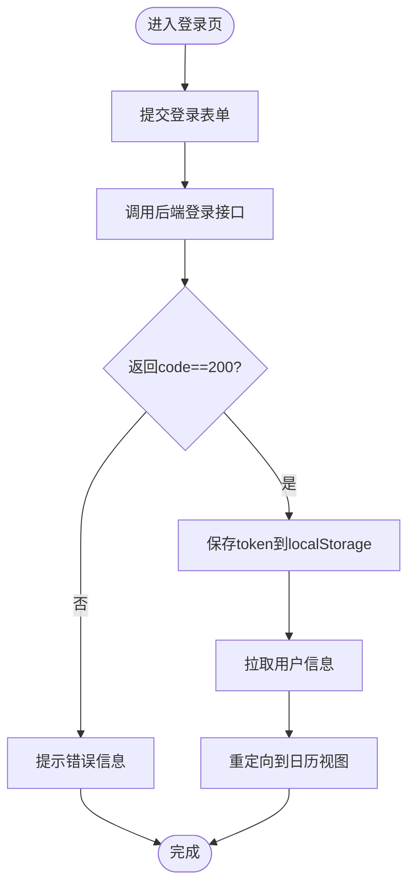
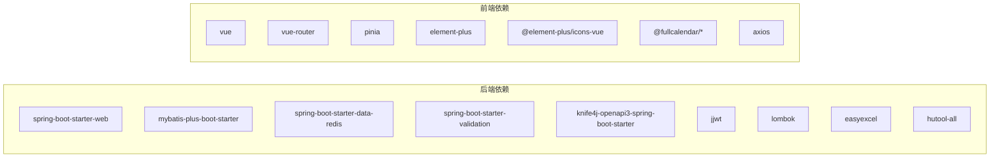

# 整体设计

<cite>
**本文引用的文件**
- [NewWorldApplication.java](file://backend/src/main/java/com/newworld/NewWorldApplication.java)
- [pom.xml](file://backend/pom.xml)
- [application.yml](file://backend/src/main/resources/application.yml)
- [docker-compose.yml](file://docker-compose.yml)
- [JwtUtil.java](file://backend/src/main/java/com/newworld/common/JwtUtil.java)
- [AuthInterceptor.java](file://backend/src/main/java/com/newworld/config/AuthInterceptor.java)
- [AuthController.java](file://backend/src/main/java/com/newworld/controller/AuthController.java)
- [Task.java](file://backend/src/main/java/com/newworld/entity/Task.java)
- [TaskServiceImpl.java](file://backend/src/main/java/com/newworld/service/impl/TaskServiceImpl.java)
- [main.js](file://frontend/src/main.js)
- [index.js](file://frontend/src/router/index.js)
- [auth.js](file://frontend/src/stores/auth.js)
- [request.js](file://frontend/src/utils/request.js)
- [vite.config.js](file://frontend/vite.config.js)
- [package.json](file://frontend/package.json)
</cite>

## 目录
1. [引言](#引言)
2. [项目结构](#项目结构)
3. [核心组件](#核心组件)
4. [架构总览](#架构总览)
5. [详细组件分析](#详细组件分析)
6. [依赖分析](#依赖分析)
7. [性能考虑](#性能考虑)
8. [故障排查指南](#故障排查指南)
9. [结论](#结论)
10. [附录](#附录)

## 引言
本设计文档面向“新世界”项目，旨在提供整体架构理念、设计理念与设计原则的系统化说明；阐述前后端分离的整体思路及技术选型原因与优势；明确模块划分策略与核心功能职责；给出可扩展性设计建议（含微服务化可能性与演进路径）；并结合现有实现，总结性能相关的设计要点（并发、缓存、数据库优化）。文档同时提供系统设计图与模块关系图，帮助开发者快速把握项目全貌。

## 项目结构
项目采用前后端分离架构：前端基于 Vue 3 + Vite 构建，使用 Pinia 管理状态、Element Plus 提供 UI 组件库；后端基于 Spring Boot 2.7，集成 MyBatis-Plus、Knife4j、Redis、JWT 等能力；通过 Docker Compose 进行本地编排部署。核心目录与职责如下：
- 后端 backend：Java/Spring Boot 应用，包含控制器、服务、数据访问层、通用工具、配置与资源文件。
- 前端 frontend：Vue 3 应用，包含路由、状态管理、API 封装、UI 组件与样式。
- 部署 deploy/docker-compose：容器化编排，暴露后端服务端口并设置运行环境。

图表来源
- [main.js:1-22](file://frontend/src/main.js#L1-L22)
- [index.js:1-50](file://frontend/src/router/index.js#L1-L50)
- [auth.js:1-41](file://frontend/src/stores/auth.js#L1-L41)
- [request.js:1-56](file://frontend/src/utils/request.js#L1-L56)
- [vite.config.js:1-26](file://frontend/vite.config.js#L1-L26)
- [NewWorldApplication.java:1-13](file://backend/src/main/java/com/newworld/NewWorldApplication.java#L1-L13)
- [application.yml:1-75](file://backend/src/main/resources/application.yml#L1-L75)
- [JwtUtil.java:1-78](file://backend/src/main/java/com/newworld/common/JwtUtil.java#L1-L78)
- [AuthInterceptor.java:1-78](file://backend/src/main/java/com/newworld/config/AuthInterceptor.java#L1-L78)
- [AuthController.java:1-55](file://backend/src/main/java/com/newworld/controller/AuthController.java#L1-L55)
- [Task.java:1-184](file://backend/src/main/java/com/newworld/entity/Task.java#L1-L184)
- [TaskServiceImpl.java:1-194](file://backend/src/main/java/com/newworld/service/impl/TaskServiceImpl.java#L1-L194)
- [docker-compose.yml:1-14](file://docker-compose.yml#L1-L14)

章节来源
- [NewWorldApplication.java:1-13](file://backend/src/main/java/com/newworld/NewWorldApplication.java#L1-L13)
- [application.yml:1-75](file://backend/src/main/resources/application.yml#L1-L75)
- [docker-compose.yml:1-14](file://docker-compose.yml#L1-L14)
- [main.js:1-22](file://frontend/src/main.js#L1-L22)
- [index.js:1-50](file://frontend/src/router/index.js#L1-L50)
- [auth.js:1-41](file://frontend/src/stores/auth.js#L1-L41)
- [request.js:1-56](file://frontend/src/utils/request.js#L1-L56)
- [vite.config.js:1-26](file://frontend/vite.config.js#L1-L26)
- [pom.xml:1-117](file://backend/pom.xml#L1-L117)
- [package.json:1-30](file://frontend/package.json#L1-L30)

## 核心组件
- 后端启动与配置
  - 启动类负责应用引导与上下文加载。
  - 配置文件集中管理数据库、Redis、MyBatis-Plus、Knife4j、JWT、日志等参数。
- 认证与授权
  - JWT 工具负责签发与校验 Token。
  - 拦截器在请求进入业务前进行 Token 校验，并将当前用户信息注入线程上下文。
  - 控制器提供登录、注册、用户信息查询等接口。
- 任务域服务
  - 实体定义任务核心字段与元数据。
  - 服务实现提供查询、创建、更新、删除、状态变更、优先级调整、复制归档、转换为笔记、生成分享链接、统计等能力。
- 前端应用
  - 应用入口初始化 Pinia、路由、UI 组件库。
  - 路由守卫控制鉴权跳转。
  - 状态管理封装认证流程与用户信息。
  - HTTP 封装统一注入 Authorization 头并处理错误。
  - Vite 开发服务器配置代理到后端 8080 端口。

章节来源
- [NewWorldApplication.java:1-13](file://backend/src/main/java/com/newworld/NewWorldApplication.java#L1-L13)
- [application.yml:1-75](file://backend/src/main/resources/application.yml#L1-L75)
- [JwtUtil.java:1-78](file://backend/src/main/java/com/newworld/common/JwtUtil.java#L1-L78)
- [AuthInterceptor.java:1-78](file://backend/src/main/java/com/newworld/config/AuthInterceptor.java#L1-L78)
- [AuthController.java:1-55](file://backend/src/main/java/com/newworld/controller/AuthController.java#L1-L55)
- [Task.java:1-184](file://backend/src/main/java/com/newworld/entity/Task.java#L1-L184)
- [TaskServiceImpl.java:1-194](file://backend/src/main/java/com/newworld/service/impl/TaskServiceImpl.java#L1-L194)
- [main.js:1-22](file://frontend/src/main.js#L1-L22)
- [index.js:1-50](file://frontend/src/router/index.js#L1-L50)
- [auth.js:1-41](file://frontend/src/stores/auth.js#L1-L41)
- [request.js:1-56](file://frontend/src/utils/request.js#L1-L56)
- [vite.config.js:1-26](file://frontend/vite.config.js#L1-L26)

## 架构总览
整体采用前后端分离模式：
- 前端通过 Axios 发起 REST 请求，统一注入 Bearer Token 并在响应中做统一错误处理。
- 后端通过拦截器完成鉴权，控制器返回统一封装的结果对象。
- 数据持久化使用 MySQL，ORM 使用 MyBatis-Plus；缓存使用 Redis；接口文档使用 Knife4j。
- 容器化部署通过 Docker Compose 将后端服务映射至 8080 端口。

图表来源
- [request.js:1-56](file://frontend/src/utils/request.js#L1-L56)
- [vite.config.js:1-26](file://frontend/vite.config.js#L1-L26)
- [AuthInterceptor.java:1-78](file://backend/src/main/java/com/newworld/config/AuthInterceptor.java#L1-L78)
- [AuthController.java:1-55](file://backend/src/main/java/com/newworld/controller/AuthController.java#L1-L55)
- [TaskServiceImpl.java:1-194](file://backend/src/main/java/com/newworld/service/impl/TaskServiceImpl.java#L1-L194)
- [application.yml:1-75](file://backend/src/main/resources/application.yml#L1-L75)

## 详细组件分析

### 认证与授权组件
- 设计理念
  - 无状态鉴权：后端不维护会话，Token 内含用户身份信息，便于横向扩展。
  - 统一拦截：在进入业务逻辑前完成 Token 校验与用户上下文注入。
  - 前端透明：前端自动注入 Authorization 头，简化调用方代码。
- 关键流程（登录）

图表来源
- [AuthController.java:1-55](file://backend/src/main/java/com/newworld/controller/AuthController.java#L1-L55)
- [AuthInterceptor.java:1-78](file://backend/src/main/java/com/newworld/config/AuthInterceptor.java#L1-L78)
- [JwtUtil.java:1-78](file://backend/src/main/java/com/newworld/common/JwtUtil.java#L1-L78)
- [request.js:1-56](file://frontend/src/utils/request.js#L1-L56)

章节来源
- [AuthController.java:1-55](file://backend/src/main/java/com/newworld/controller/AuthController.java#L1-L55)
- [AuthInterceptor.java:1-78](file://backend/src/main/java/com/newworld/config/AuthInterceptor.java#L1-L78)
- [JwtUtil.java:1-78](file://backend/src/main/java/com/newworld/common/JwtUtil.java#L1-L78)
- [request.js:1-56](file://frontend/src/utils/request.js#L1-L56)

### 任务域服务组件
- 设计理念
  - 领域模型清晰：任务实体包含优先级、状态、时间维度、笔记标记等关键属性。
  - 查询灵活：支持多条件组合查询、关键词模糊匹配、排序规则。
  - 变更幂等：状态与优先级更新、复制、归档、转换为笔记等操作均进行存在性校验。
  - 统一返回：服务层对外提供 VO/DTO，便于前端展示与统计。
- 类关系图

图表来源
- [Task.java:1-184](file://backend/src/main/java/com/newworld/entity/Task.java#L1-L184)
- [TaskServiceImpl.java:1-194](file://backend/src/main/java/com/newworld/service/impl/TaskServiceImpl.java#L1-L194)

章节来源
- [Task.java:1-184](file://backend/src/main/java/com/newworld/entity/Task.java#L1-L184)
- [TaskServiceImpl.java:1-194](file://backend/src/main/java/com/newworld/service/impl/TaskServiceImpl.java#L1-L194)

### 前端应用组件
- 设计理念
  - 渐进增强：路由守卫保证受保护页面的访问控制；Pinia 管理全局状态；Axios 统一处理请求与响应。
  - 本地持久化：Token 存储于 localStorage，刷新后仍保持登录态。
  - 开发体验：Vite 代理解决跨域问题，开发调试高效。
- 流程图（登录流程）

图表来源
- [auth.js:1-41](file://frontend/src/stores/auth.js#L1-L41)
- [request.js:1-56](file://frontend/src/utils/request.js#L1-L56)
- [index.js:1-50](file://frontend/src/router/index.js#L1-L50)

章节来源
- [main.js:1-22](file://frontend/src/main.js#L1-L22)
- [index.js:1-50](file://frontend/src/router/index.js#L1-L50)
- [auth.js:1-41](file://frontend/src/stores/auth.js#L1-L41)
- [request.js:1-56](file://frontend/src/utils/request.js#L1-L56)
- [vite.config.js:1-26](file://frontend/vite.config.js#L1-L26)

## 依赖分析
- 技术栈与版本
  - 后端：Spring Boot 2.7、MyBatis-Plus、Redis、Knife4j、JWT、Lombok、EasyExcel、Hutool。
  - 前端：Vue 3、Vue Router、Pinia、Element Plus、Axios、Vite。
- 依赖关系概览

图表来源
- [pom.xml:1-117](file://backend/pom.xml#L1-L117)
- [package.json:1-30](file://frontend/package.json#L1-L30)

章节来源
- [pom.xml:1-117](file://backend/pom.xml#L1-L117)
- [package.json:1-30](file://frontend/package.json#L1-L30)

## 性能考虑
- 并发与线程安全
  - 拦截器使用 ThreadLocal 存储当前用户上下文，避免共享可变状态引发的竞态。
- 缓存策略
  - 已引入 Redis Starter，可在服务层对热点数据（如用户偏好、任务列表分页结果、字典项）进行缓存；建议结合过期策略与缓存穿透防护。
- 数据库优化
  - ORM 层已开启驼峰映射与日志输出，便于定位慢查询；建议针对高频查询字段建立索引（如 userId、status、priority、tag、startDate/dueDate）。
- 接口文档与可观测性
  - Knife4j 提供在线文档与调试能力；建议结合日志级别与链路追踪（如 Spring Cloud Sleuth）进一步增强。
- 前端性能
  - Axios 设置超时时间，避免长时间阻塞；路由懒加载与组件按需加载有助于首屏优化。

章节来源
- [AuthInterceptor.java:1-78](file://backend/src/main/java/com/newworld/config/AuthInterceptor.java#L1-L78)
- [application.yml:1-75](file://backend/src/main/resources/application.yml#L1-L75)
- [TaskServiceImpl.java:1-194](file://backend/src/main/java/com/newworld/service/impl/TaskServiceImpl.java#L1-L194)
- [request.js:1-56](file://frontend/src/utils/request.js#L1-L56)

## 故障排查指南
- 登录态异常
  - 现象：401 提示，弹出“登录已过期，请重新登录”。
  - 排查：确认前端是否正确注入 Authorization 头；检查后端拦截器是否正确解析 Token；核对 JWT 密钥与过期时间配置。
- 跨域与代理
  - 现象：开发环境下 /api 请求 404 或跨域。
  - 排查：确认 Vite 代理配置指向后端 8080；确认后端未启用 CORS 注解（默认通过拦截器与 Knife4j配置满足需求）。
- 数据库连接
  - 现象：应用启动失败或连接超时。
  - 排查：核对 application.yml 中的数据库地址、账号、密码与时区；确保网络可达。
- 容器部署
  - 现象：容器启动后无法访问。
  - 排查：确认 docker-compose 映射端口与后端监听端口一致；检查环境变量 SPRING_PROFILES_ACTIVE 是否正确。

章节来源
- [request.js:1-56](file://frontend/src/utils/request.js#L1-L56)
- [vite.config.js:1-26](file://frontend/vite.config.js#L1-L26)
- [application.yml:1-75](file://backend/src/main/resources/application.yml#L1-L75)
- [docker-compose.yml:1-14](file://docker-compose.yml#L1-L14)

## 结论
“新世界”项目以前后端分离为核心，后端采用 Spring Boot + MyBatis-Plus + Redis + JWT 的成熟技术栈，具备良好的可维护性与扩展性；前端以 Vue 3 生态为基础，提供现代化交互体验。当前实现已覆盖认证、任务管理等核心能力，后续可围绕微服务化演进（如按领域拆分服务、引入网关与注册发现）、增强缓存与数据库索引、完善监控与可观测性等方面持续优化。

## 附录
- 部署与运行
  - 使用 docker-compose 启动后端服务，默认暴露 8080 端口，生产环境通过 profile 切换。
- 开发环境
  - 前端通过 Vite 代理转发 /api 到后端 8080；后端提供 Knife4j 文档入口，便于联调。

章节来源
- [docker-compose.yml:1-14](file://docker-compose.yml#L1-L14)
- [vite.config.js:1-26](file://frontend/vite.config.js#L1-L26)
- [application.yml:1-75](file://backend/src/main/resources/application.yml#L1-L75)