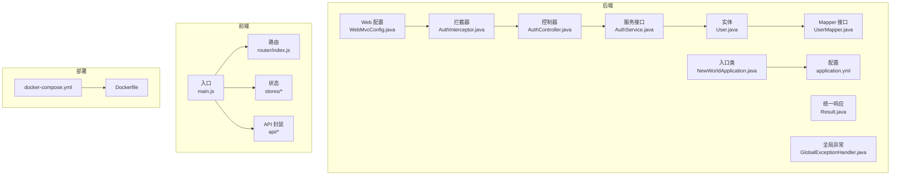
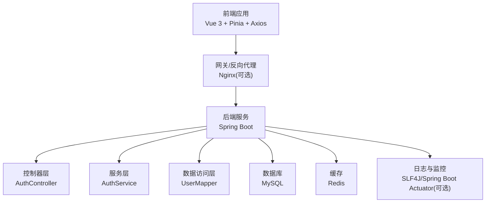
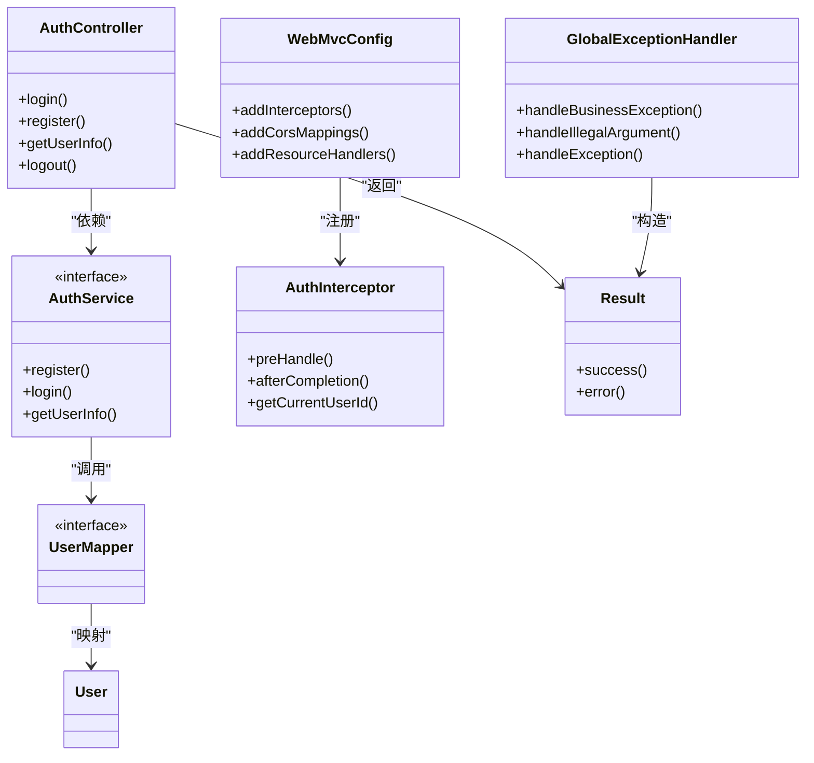
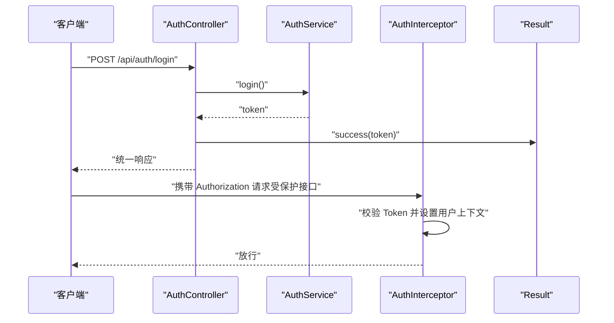
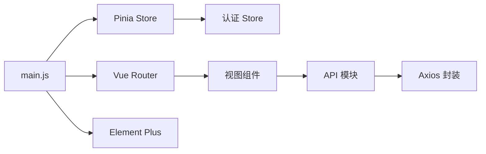
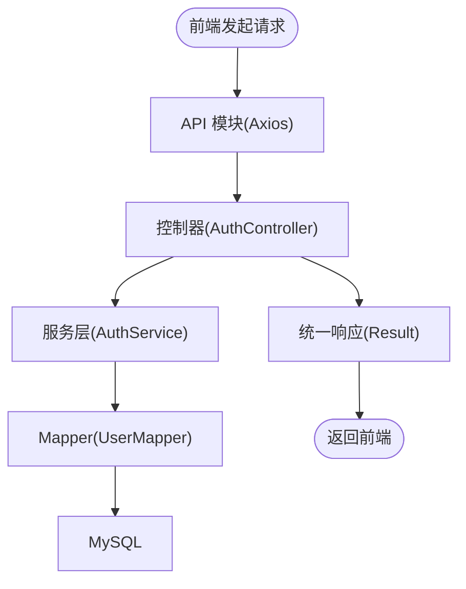
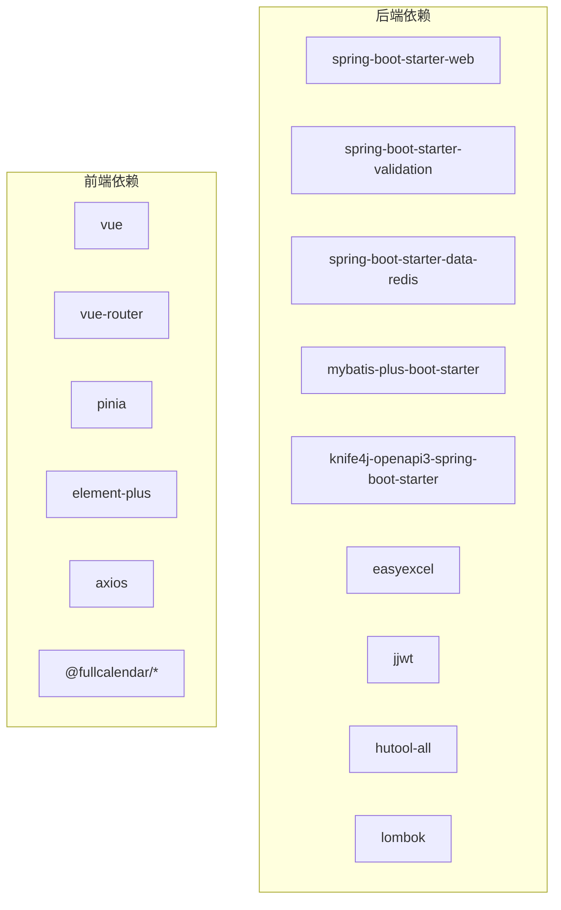

# 系统架构

<cite>
**本文引用的文件**
- [NewWorldApplication.java](file://backend/src/main/java/com/newworld/NewWorldApplication.java)
- [pom.xml](file://backend/pom.xml)
- [application.yml](file://backend/src/main/resources/application.yml)
- [WebMvcConfig.java](file://backend/src/main/java/com/newworld/config/WebMvcConfig.java)
- [AuthInterceptor.java](file://backend/src/main/java/com/newworld/config/AuthInterceptor.java)
- [Result.java](file://backend/src/main/java/com/newworld/common/Result.java)
- [GlobalExceptionHandler.java](file://backend/src/main/java/com/newworld/common/exception/GlobalExceptionHandler.java)
- [AuthController.java](file://backend/src/main/java/com/newworld/controller/AuthController.java)
- [AuthService.java](file://backend/src/main/java/com/newworld/service/AuthService.java)
- [User.java](file://backend/src/main/java/com/newworld/entity/User.java)
- [UserMapper.java](file://backend/src/main/java/com/newworld/mapper/UserMapper.java)
- [main.js](file://frontend/src/main.js)
- [package.json](file://frontend/package.json)
- [docker-compose.yml](file://docker-compose.yml)
- [Dockerfile](file://backend/Dockerfile)
</cite>

## 目录
1. [引言](#引言)
2. [项目结构](#项目结构)
3. [核心组件](#核心组件)
4. [架构总览](#架构总览)
5. [详细组件分析](#详细组件分析)
6. [依赖分析](#依赖分析)
7. [性能考虑](#性能考虑)
8. [故障排查指南](#故障排查指南)
9. [结论](#结论)
10. [附录](#附录)

## 引言
本文件面向“新世界”项目，提供系统级架构文档，覆盖前后端分离架构、MVC 分层设计与 RESTful API 设计原则；阐述 Spring Boot 自动配置与依赖注入、AOP 异常处理；解析 Vue 3 前端的组件化、Composition API 使用与 Pinia 状态管理；说明从前端请求到后端处理再到数据库存储的数据流；并给出微服务化演进建议、容器化部署与负载均衡思路。

## 项目结构
- 后端采用标准 Spring Boot 结构：入口类、配置、控制器、服务、持久层、通用模块与资源文件。
- 前端采用 Vite + Vue 3 + Pinia + Vue Router 架构，按功能模块组织页面与组件。
- 部署通过 Docker Compose 编排单容器应用，暴露 8080 端口并激活生产配置文件。

图表来源
- [NewWorldApplication.java:1-13](file://backend/src/main/java/com/newworld/NewWorldApplication.java#L1-L13)
- [application.yml:1-75](file://backend/src/main/resources/application.yml#L1-L75)
- [WebMvcConfig.java:1-53](file://backend/src/main/java/com/newworld/config/WebMvcConfig.java#L1-L53)
- [AuthInterceptor.java:1-78](file://backend/src/main/java/com/newworld/config/AuthInterceptor.java#L1-L78)
- [AuthController.java:1-55](file://backend/src/main/java/com/newworld/controller/AuthController.java#L1-L55)
- [AuthService.java:1-24](file://backend/src/main/java/com/newworld/service/AuthService.java#L1-L24)
- [User.java:1-95](file://backend/src/main/java/com/newworld/entity/User.java#L1-L95)
- [UserMapper.java:1-10](file://backend/src/main/java/com/newworld/mapper/UserMapper.java#L1-L10)
- [Result.java:1-90](file://backend/src/main/java/com/newworld/common/Result.java#L1-L90)
- [GlobalExceptionHandler.java:1-35](file://backend/src/main/java/com/newworld/common/exception/GlobalExceptionHandler.java#L1-L35)
- [main.js:1-22](file://frontend/src/main.js#L1-L22)
- [docker-compose.yml:1-14](file://docker-compose.yml#L1-L14)
- [Dockerfile:1-14](file://backend/Dockerfile#L1-L14)

章节来源
- [NewWorldApplication.java:1-13](file://backend/src/main/java/com/newworld/NewWorldApplication.java#L1-L13)
- [pom.xml:1-117](file://backend/pom.xml#L1-L117)
- [application.yml:1-75](file://backend/src/main/resources/application.yml#L1-L75)
- [docker-compose.yml:1-14](file://docker-compose.yml#L1-L14)
- [Dockerfile:1-14](file://backend/Dockerfile#L1-L14)

## 核心组件
- 后端核心组件
  - 应用入口与自动配置：Spring Boot 自动装配 Web、MyBatis-Plus、Redis、Knife4j 等。
  - Web 层：基于注解的 REST 控制器，统一响应包装与全局异常处理。
  - 业务层：以接口+实现的方式组织服务，职责清晰。
  - 数据访问层：MyBatis-Plus Mapper 接口映射数据库表，逻辑删除与字段填充等增强能力。
  - 安全与跨域：JWT 拦截器校验 Token 并透传用户上下文，全局 CORS 与静态资源映射。
- 前端核心组件
  - 应用入口：注册 Element Plus、Pinia、路由，挂载根组件。
  - 状态管理：Pinia Store 管理认证与应用状态。
  - API 封装：Axios 请求封装与拦截器，统一处理鉴权头与响应数据。
  - 视图与布局：按模块划分视图与通用布局组件。

章节来源
- [pom.xml:31-96](file://backend/pom.xml#L31-L96)
- [application.yml:10-75](file://backend/src/main/resources/application.yml#L10-L75)
- [WebMvcConfig.java:14-52](file://backend/src/main/java/com/newworld/config/WebMvcConfig.java#L14-L52)
- [AuthInterceptor.java:17-77](file://backend/src/main/java/com/newworld/config/AuthInterceptor.java#L17-L77)
- [Result.java:8-90](file://backend/src/main/java/com/newworld/common/Result.java#L8-L90)
- [GlobalExceptionHandler.java:12-34](file://backend/src/main/java/com/newworld/common/exception/GlobalExceptionHandler.java#L12-L34)
- [main.js:1-22](file://frontend/src/main.js#L1-L22)
- [package.json:1-30](file://frontend/package.json#L1-L30)

## 架构总览
系统采用前后端分离架构，后端提供 REST API，前端通过 Axios 发起请求，后端通过 MyBatis-Plus 访问 MySQL，并使用 Redis 缓存热点数据。JWT 实现无状态鉴权，全局异常处理保证一致的错误响应格式。

图表来源
- [AuthController.java:18-55](file://backend/src/main/java/com/newworld/controller/AuthController.java#L18-L55)
- [AuthService.java:6-23](file://backend/src/main/java/com/newworld/service/AuthService.java#L6-L23)
- [UserMapper.java:7-9](file://backend/src/main/java/com/newworld/mapper/UserMapper.java#L7-L9)
- [application.yml:11-30](file://backend/src/main/resources/application.yml#L11-L30)
- [main.js:18-20](file://frontend/src/main.js#L18-L20)

## 详细组件分析

### 后端：Spring Boot 自动配置与依赖注入
- 自动配置
  - Web 启动器提供嵌入式 Tomcat 与 MVC 基础设施。
  - MyBatis-Plus Starter 提供分页、逻辑删除、下划线转驼峰等默认行为。
  - Knife4j 提供 OpenAPI/Swagger 文档界面。
  - Redis Starter 提供连接池与序列化配置。
- 依赖注入
  - 控制器、服务、拦截器、Mapper、工具类均通过注解声明为 Bean，由容器注入。
- AOP 与全局异常
  - 全局异常处理器统一捕获业务异常、参数异常与系统异常，返回统一响应体。

图表来源
- [AuthController.java:20-55](file://backend/src/main/java/com/newworld/controller/AuthController.java#L20-L55)
- [AuthService.java:6-23](file://backend/src/main/java/com/newworld/service/AuthService.java#L6-L23)
- [UserMapper.java:7-9](file://backend/src/main/java/com/newworld/mapper/UserMapper.java#L7-L9)
- [User.java:11-12](file://backend/src/main/java/com/newworld/entity/User.java#L11-L12)
- [WebMvcConfig.java:14-52](file://backend/src/main/java/com/newworld/config/WebMvcConfig.java#L14-L52)
- [AuthInterceptor.java:17-77](file://backend/src/main/java/com/newworld/config/AuthInterceptor.java#L17-L77)
- [Result.java:8-90](file://backend/src/main/java/com/newworld/common/Result.java#L8-L90)
- [GlobalExceptionHandler.java:12-34](file://backend/src/main/java/com/newworld/common/exception/GlobalExceptionHandler.java#L12-L34)

章节来源
- [pom.xml:31-96](file://backend/pom.xml#L31-L96)
- [application.yml:36-75](file://backend/src/main/resources/application.yml#L36-L75)
- [WebMvcConfig.java:19-51](file://backend/src/main/java/com/newworld/config/WebMvcConfig.java#L19-L51)
- [AuthInterceptor.java:30-77](file://backend/src/main/java/com/newworld/config/AuthInterceptor.java#L30-L77)
- [Result.java:22-64](file://backend/src/main/java/com/newworld/common/Result.java#L22-L64)
- [GlobalExceptionHandler.java:17-33](file://backend/src/main/java/com/newworld/common/exception/GlobalExceptionHandler.java#L17-L33)

### 后端：认证流程与拦截器
- 登录/注册
  - 控制器接收请求体，调用服务生成/验证用户信息，返回统一响应。
- JWT 校验
  - 拦截器从请求头提取 Token，校验有效性并将用户上下文放入 ThreadLocal，供后续业务使用。
- 跨域与静态资源
  - 配置允许任意来源、方法与头，放行 Swagger 与静态资源路径。

图表来源
- [AuthController.java:25-32](file://backend/src/main/java/com/newworld/controller/AuthController.java#L25-L32)
- [AuthInterceptor.java:30-58](file://backend/src/main/java/com/newworld/config/AuthInterceptor.java#L30-L58)
- [Result.java:22-42](file://backend/src/main/java/com/newworld/common/Result.java#L22-L42)

章节来源
- [AuthController.java:25-53](file://backend/src/main/java/com/newworld/controller/AuthController.java#L25-L53)
- [AuthInterceptor.java:30-77](file://backend/src/main/java/com/newworld/config/AuthInterceptor.java#L30-L77)
- [WebMvcConfig.java:19-33](file://backend/src/main/java/com/newworld/config/WebMvcConfig.java#L19-L33)

### 前端：应用架构与状态管理
- 应用入口
  - 创建 Vue 应用实例，注册 Element Plus、Pinia、路由与全局样式。
- 状态管理
  - 使用 Pinia Store 管理认证状态与应用级状态，支持模块化拆分。
- API 封装
  - Axios 封装统一处理请求与响应，设置默认 baseURL、超时与拦截器，自动附加 Token。
- 组件化与路由
  - 页面按模块组织，组件按功能拆分，路由负责页面跳转与参数传递。

图表来源
- [main.js:11-21](file://frontend/src/main.js#L11-L21)
- [package.json:11-24](file://frontend/package.json#L11-L24)

章节来源
- [main.js:1-22](file://frontend/src/main.js#L1-L22)
- [package.json:1-30](file://frontend/package.json#L1-L30)

### 数据流设计：从前端到数据库
- 前端请求
  - 通过 API 模块发起 HTTP 请求，携带认证信息。
- 后端处理
  - 控制器接收请求，进行参数校验与权限检查，调用服务层处理业务，返回统一响应。
- 数据持久化
  - 服务层调用 Mapper 执行 CRUD，MyBatis-Plus 处理 SQL 映射与逻辑删除。
- 缓存与数据库
  - Redis 用于热点数据缓存，减少数据库压力。

图表来源
- [AuthController.java:20-55](file://backend/src/main/java/com/newworld/controller/AuthController.java#L20-L55)
- [AuthService.java:6-23](file://backend/src/main/java/com/newworld/service/AuthService.java#L6-L23)
- [UserMapper.java:7-9](file://backend/src/main/java/com/newworld/mapper/UserMapper.java#L7-L9)
- [Result.java:8-90](file://backend/src/main/java/com/newworld/common/Result.java#L8-L90)

章节来源
- [application.yml:11-30](file://backend/src/main/resources/application.yml#L11-L30)
- [application.yml:36-50](file://backend/src/main/resources/application.yml#L36-L50)

## 依赖分析
- 后端依赖
  - Spring Boot Web、Validation、Data Redis、Test。
  - MyBatis-Plus、MySQL 驱动、Knife4j、Hutool、EasyExcel、JWT、Lombok。
- 前端依赖
  - Vue 3、Vue Router、Pinia、Element Plus、Axios、FullCalendar 及图标库。

图表来源
- [pom.xml:31-96](file://backend/pom.xml#L31-L96)
- [package.json:11-24](file://frontend/package.json#L11-L24)

章节来源
- [pom.xml:21-96](file://backend/pom.xml#L21-L96)
- [package.json:1-30](file://frontend/package.json#L1-L30)

## 性能考虑
- 连接池与缓存
  - 合理配置 MySQL 与 Redis 连接池参数，避免高并发下的连接争用。
- 分页与索引
  - 使用 MyBatis-Plus 分页插件，确保高频查询建立必要索引。
- 缓存策略
  - 对读多写少的数据引入 Redis 缓存，设置合理过期时间。
- 前端优化
  - 按需加载组件与路由，减少首屏体积；对大列表使用虚拟滚动。
- 监控与日志
  - 开启慢查询日志与业务埋点，结合日志级别控制避免过度输出。

## 故障排查指南
- 认证失败
  - 检查请求头是否包含有效的 Bearer Token；确认 Token 未过期；查看拦截器日志。
- 参数异常
  - 控制器层参数校验失败会触发全局异常，返回 400 错误；检查请求体与校验注解。
- 服务器内部错误
  - 全局异常处理器捕获未知异常并返回统一错误响应；查看服务端日志定位堆栈。
- 跨域问题
  - 确认 CORS 配置允许的来源、方法与头；预检请求 OPTIONS 是否被正确放行。

章节来源
- [AuthInterceptor.java:30-58](file://backend/src/main/java/com/newworld/config/AuthInterceptor.java#L30-L58)
- [GlobalExceptionHandler.java:17-33](file://backend/src/main/java/com/newworld/common/exception/GlobalExceptionHandler.java#L17-L33)
- [WebMvcConfig.java:35-43](file://backend/src/main/java/com/newworld/config/WebMvcConfig.java#L35-L43)

## 结论
新世界项目在技术选型上遵循现代化实践：后端以 Spring Boot 为核心，结合 MyBatis-Plus 与 Knife4j 快速构建 REST API；前端以 Vue 3 为基础，配合 Pinia 与 Axios 实现清晰的状态与网络层。通过统一响应与全局异常处理提升一致性与可观测性。建议后续在微服务化、容器编排与负载均衡方面进一步演进，以支撑更大规模的业务增长。

## 附录
- 部署与运行
  - 使用 Dockerfile 构建镜像，docker-compose.yml 将容器暴露 8080 端口并激活 prod 配置。
- 环境变量与配置
  - application.yml 中集中管理数据库、Redis、Jackson、MyBatis-Plus、Knife4j、JWT 与日志级别。

章节来源
- [docker-compose.yml:3-13](file://docker-compose.yml#L3-L13)
- [Dockerfile:1-14](file://backend/Dockerfile#L1-L14)
- [application.yml:1-75](file://backend/src/main/resources/application.yml#L1-L75)