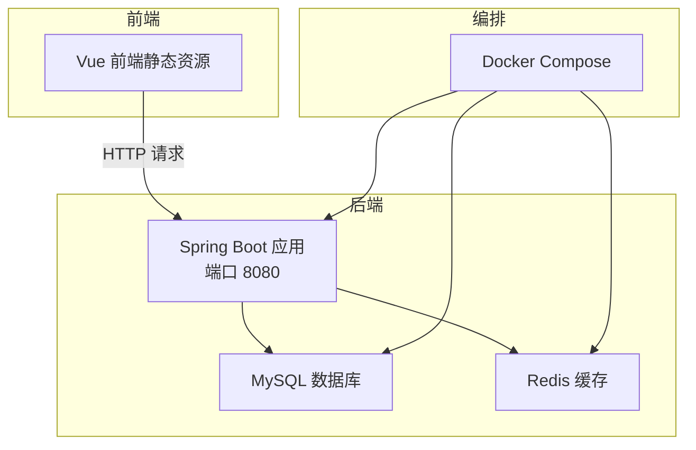
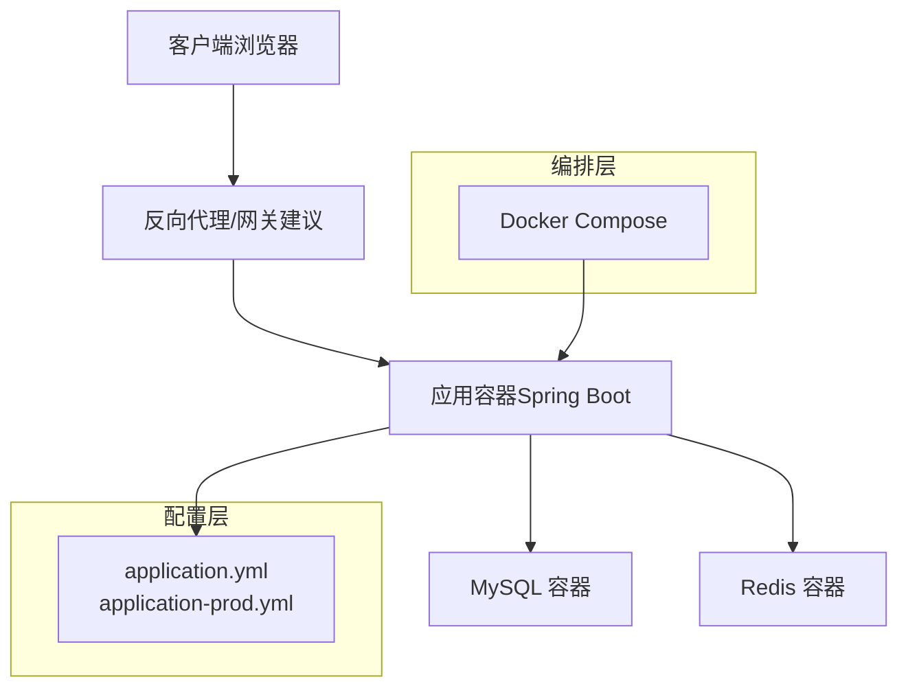
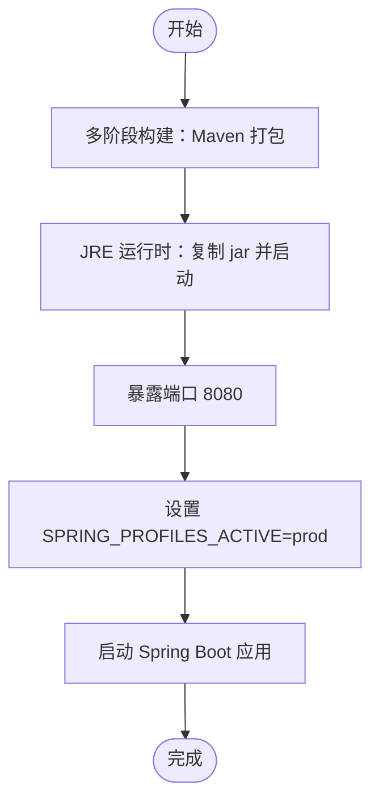
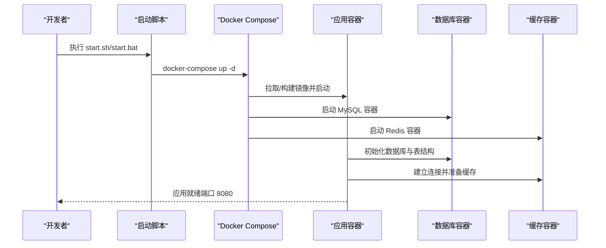
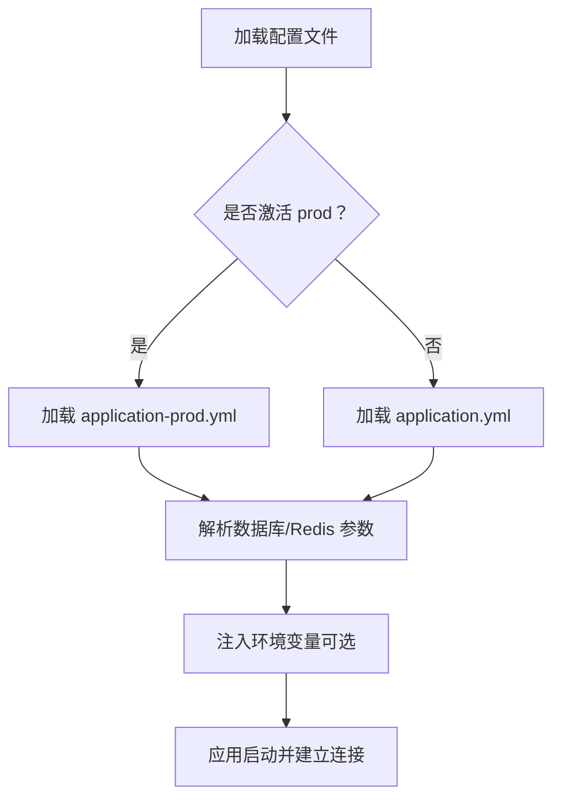
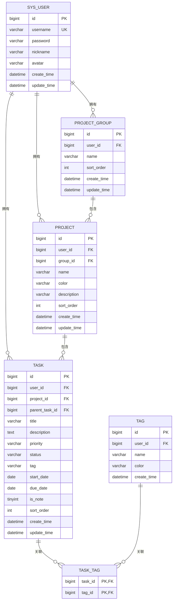
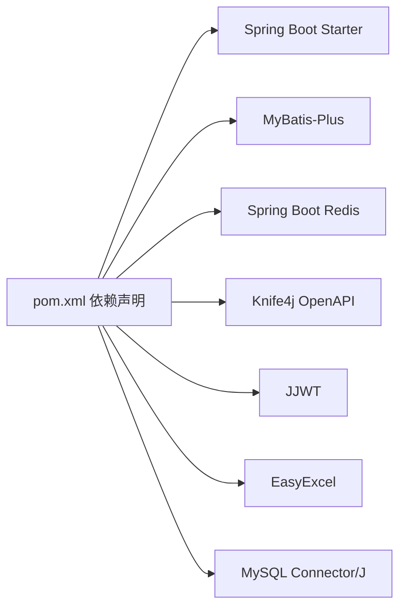

# 部署架构

<cite>
**本文引用的文件**
- [docker-compose.yml](file://docker-compose.yml)
- [Dockerfile](file://backend/Dockerfile)
- [start.sh](file://deploy/start.sh)
- [start.bat](file://deploy/start.bat)
- [application.yml](file://backend/src/main/resources/application.yml)
- [application-prod.yml](file://backend/src/main/resources/application-prod.yml)
- [init.sql](file://backend/sql/init.sql)
- [pom.xml](file://backend/pom.xml)
- [package.json](file://frontend/package.json)
</cite>

## 目录
1. [简介](#简介)
2. [项目结构](#项目结构)
3. [核心组件](#核心组件)
4. [架构总览](#架构总览)
5. [详细组件分析](#详细组件分析)
6. [依赖关系分析](#依赖关系分析)
7. [性能考虑](#性能考虑)
8. [故障排查指南](#故障排查指南)
9. [结论](#结论)
10. [附录](#附录)

## 简介
本文件面向新世界项目的部署与运维，系统性阐述容器化部署策略、Docker 镜像构建与多容器协调、Docker Compose 编排配置、生产环境配置要点（环境变量、数据库与缓存连接、性能参数）、高可用与负载均衡建议、CI/CD 流水线设计思路、监控与日志策略，以及配套的部署与运维流程图。目标是帮助团队快速、稳定地完成本地开发到生产的部署迁移。

## 项目结构
新世界项目采用前后端分离架构：后端基于 Spring Boot，使用 Maven 构建；前端基于 Vue 3 + Vite；通过 Docker Compose 将应用容器与 MySQL、Redis 协同运行。当前仓库提供基础的单容器应用编排与启动脚本，生产配置位于后端资源目录中。

图表来源
- [docker-compose.yml:1-14](file://docker-compose.yml#L1-L14)
- [application.yml:1-75](file://backend/src/main/resources/application.yml#L1-L75)
- [application-prod.yml:1-24](file://backend/src/main/resources/application-prod.yml#L1-L24)

章节来源
- [docker-compose.yml:1-14](file://docker-compose.yml#L1-L14)
- [Dockerfile:1-14](file://backend/Dockerfile#L1-L14)
- [application.yml:1-75](file://backend/src/main/resources/application.yml#L1-L75)
- [application-prod.yml:1-24](file://backend/src/main/resources/application-prod.yml#L1-L24)

## 核心组件
- 应用容器（app）
  - 基于多阶段构建的 Java 运行时镜像，暴露 8080 端口，激活 prod 配置文件。
  - 通过环境变量 SPRING_PROFILES_ACTIVE 控制配置文件加载。
- 数据库（MySQL）
  - 由初始化 SQL 脚本创建数据库与表结构，并预置默认管理员账号。
- 缓存（Redis）
  - 提供会话、令牌等缓存能力，支持密码认证与数据库选择。
- 前端（可选）
  - 当前仓库未包含独立前端镜像，通常以静态资源方式由应用或反向代理提供。
- 启动脚本
  - 提供 Windows 与 Linux 的一键启动脚本，使用 docker-compose 启动全部服务。

章节来源
- [docker-compose.yml:3-13](file://docker-compose.yml#L3-L13)
- [Dockerfile:1-14](file://backend/Dockerfile#L1-L14)
- [application.yml:1-75](file://backend/src/main/resources/application.yml#L1-L75)
- [application-prod.yml:1-24](file://backend/src/main/resources/application-prod.yml#L1-L24)
- [init.sql:1-95](file://backend/sql/init.sql#L1-L95)
- [start.sh:1-8](file://deploy/start.sh#L1-L8)
- [start.bat:1-9](file://deploy/start.bat#L1-L9)

## 架构总览
下图展示了从容器编排到应用访问的完整路径，包括数据库与缓存的依赖关系、应用的配置加载与端口暴露，以及前端访问链路。

图表来源
- [docker-compose.yml:1-14](file://docker-compose.yml#L1-L14)
- [application.yml:1-75](file://backend/src/main/resources/application.yml#L1-L75)
- [application-prod.yml:1-24](file://backend/src/main/resources/application-prod.yml#L1-L24)

## 详细组件分析

### 容器化与镜像构建
- 多阶段构建
  - 第一阶段使用 Maven 基础镜像下载依赖并打包，跳过测试以加速构建。
  - 第二阶段使用轻量级 JRE 运行时，仅复制最终 jar 包，减小镜像体积。
- 入口与暴露
  - 镜像暴露 8080 端口，入口为 java -jar 启动应用。
- 运行时配置
  - 默认激活 prod 配置文件，可通过环境变量覆盖。

图表来源
- [Dockerfile:1-14](file://backend/Dockerfile#L1-L14)

章节来源
- [Dockerfile:1-14](file://backend/Dockerfile#L1-L14)

### Docker Compose 编排配置
- 服务定义
  - app 服务：基于 backend 目录的 Dockerfile 构建，容器名为 newworld-app，端口映射 8080:8080，重启策略为 unless-stopped。
- 网络与卷
  - 当前编排未显式声明自定义网络与卷挂载，建议在生产环境中增加：
    - 自定义网络隔离服务间通信；
    - 持久化卷挂载数据库与缓存数据目录；
    - 配置文件与密钥的只读挂载。
- 环境变量
  - 通过 environment 字段注入 SPRING_PROFILES_ACTIVE=prod，便于加载生产配置。

图表来源
- [docker-compose.yml:1-14](file://docker-compose.yml#L1-L14)
- [start.sh:1-8](file://deploy/start.sh#L1-L8)
- [start.bat:1-9](file://deploy/start.bat#L1-L9)

章节来源
- [docker-compose.yml:1-14](file://docker-compose.yml#L1-L14)
- [start.sh:1-8](file://deploy/start.sh#L1-L8)
- [start.bat:1-9](file://deploy/start.bat#L1-L9)

### 生产环境配置
- 配置文件
  - application.yml：开发/默认配置，包含数据库、Redis、MyBatis-Plus、Knife4j、JWT、日志等参数。
  - application-prod.yml：生产配置，覆盖数据库与 Redis 连接参数及日志级别。
- 关键参数
  - 数据库连接：驱动类名、URL、用户名、密码（建议通过环境变量注入）。
  - Redis 连接：主机、端口、密码、数据库索引、超时与连接池参数。
  - MyBatis-Plus：日志实现、驼峰映射、逻辑删除字段等。
  - 日志级别：按包设置 info 或 debug，便于生产环境控制输出。
- 环境变量管理
  - 建议将敏感信息（如数据库密码、Redis 密码、JWT 密钥）通过环境变量注入，避免硬编码在配置文件中。
  - 在 docker-compose 中使用 env_file 或 environment 字段进行注入。

图表来源
- [application.yml:1-75](file://backend/src/main/resources/application.yml#L1-L75)
- [application-prod.yml:1-24](file://backend/src/main/resources/application-prod.yml#L1-L24)

章节来源
- [application.yml:1-75](file://backend/src/main/resources/application.yml#L1-L75)
- [application-prod.yml:1-24](file://backend/src/main/resources/application-prod.yml#L1-L24)

### 数据库初始化与表结构
- 初始化脚本
  - 创建数据库 newworld，设置字符集与排序规则。
  - 定义用户、项目分组、项目、任务、标签及关联表。
  - 建立常用索引以提升查询性能。
  - 插入默认管理员用户（密码为加密后的值）。
- 连接与迁移
  - 应用启动时通过 JDBC 连接数据库，若表不存在则可由初始化脚本创建。
  - 建议在生产中结合 Flyway/Liquibase 等迁移工具进行版本化管理。

图表来源
- [init.sql:1-95](file://backend/sql/init.sql#L1-L95)

章节来源
- [init.sql:1-95](file://backend/sql/init.sql#L1-L95)

### 前端与静态资源
- 前端技术栈
  - 使用 Vue 3 + Vite 构建，包含路由、状态管理、图标库、日历组件与 HTTP 客户端等依赖。
- 部署建议
  - 可将前端构建产物（dist）作为静态资源由 Nginx 或应用内置提供，或通过反向代理统一托管。
  - 若采用容器化，建议单独构建前端镜像或使用 Nginx 镜像提供静态资源。

章节来源
- [package.json:1-30](file://frontend/package.json#L1-L30)

### 高可用与负载均衡
- 反向代理
  - 建议引入 Nginx/Envoy/Traefik 等反向代理，统一入口、健康检查与 SSL 终止。
- 健康检查
  - 在 docker-compose 中为应用容器配置 healthcheck，探测 /actuator/health（若启用 Spring Boot Actuator）。
- 扩容与副本
  - 应用容器可水平扩展多个副本，配合负载均衡器分发请求。
- 存储持久化
  - MySQL 与 Redis 建议使用持久化卷与主从/哨兵模式，确保数据高可用。

（本节为概念性说明，不直接分析具体文件）

### CI/CD 流水线设计
- 构建阶段
  - Maven 清理构建、跳过测试（或在流水线中拆分单元测试与集成测试）。
  - 多阶段 Docker 镜像构建并推送至镜像仓库。
- 测试阶段
  - 单元测试、集成测试、容器内端到端测试。
- 部署阶段
  - 使用 docker-compose 或 Kubernetes 部署，结合滚动更新与回滚策略。
- 安全与合规
  - 镜像扫描、依赖漏洞检测、密钥与凭据管理。

（本节为概念性说明，不直接分析具体文件）

### 监控与日志
- 应用日志
  - 通过 application.yml/application-prod.yml 设置日志级别与输出位置，建议输出到标准输出以便容器平台采集。
- 错误追踪
  - 结合全局异常处理与日志聚合，定位业务异常与系统错误。
- 性能监控
  - 建议启用 Spring Boot Actuator 暴露指标，结合 Prometheus/Grafana 进行监控告警。
- 日志收集
  - 使用 Fluent Bit/Fluentd/Filebeat 收集容器日志，集中存储至 ELK/EFK 或云日志服务。

（本节为概念性说明，不直接分析具体文件）

## 依赖关系分析
- 后端依赖
  - Spring Boot Web、Redis、MyBatis-Plus、Knife4j、JWT、Excel 工具等。
- 构建与打包
  - Maven 插件负责打包与重命名，最终生成可执行 jar。
- 运行时依赖
  - MySQL Connector、Redis 客户端、日志实现等。

图表来源
- [pom.xml:1-117](file://backend/pom.xml#L1-L117)

章节来源
- [pom.xml:1-117](file://backend/pom.xml#L1-L117)

## 性能考虑
- 数据库连接池与超时
  - 合理设置连接池大小、最大等待时间与空闲连接数，避免并发瓶颈。
- Redis 连接与缓存策略
  - 控制连接数与超时，合理设置键空间过期策略，避免内存膨胀。
- 应用线程与 JVM
  - 根据容器 CPU/内存限制调整 JVM 参数，避免频繁 GC。
- 索引与查询
  - 利用初始化脚本中的索引提升常见查询性能，避免全表扫描。

（本节为通用指导，不直接分析具体文件）

## 故障排查指南
- 启动失败
  - 检查端口占用（8080）、数据库连通性与凭据、Redis 连接参数。
- 数据库问题
  - 确认初始化脚本已执行，数据库存在且具备相应权限。
- 配置加载
  - 确认 SPRING_PROFILES_ACTIVE=prod 已生效，必要时通过环境变量覆盖敏感配置。
- 日志定位
  - 查看应用容器标准输出日志，结合 application.yml/application-prod.yml 的日志配置定位问题。

章节来源
- [docker-compose.yml:1-14](file://docker-compose.yml#L1-L14)
- [application.yml:1-75](file://backend/src/main/resources/application.yml#L1-L75)
- [application-prod.yml:1-24](file://backend/src/main/resources/application-prod.yml#L1-L24)
- [init.sql:1-95](file://backend/sql/init.sql#L1-L95)

## 结论
当前仓库提供了基础的容器化与编排能力，能够快速拉起应用、数据库与缓存。建议在生产环境中补充反向代理、健康检查、持久化卷、环境变量注入与密钥管理、监控与日志体系，以及完善的 CI/CD 流水线，以满足高可用、可观测与可维护性的要求。

## 附录
- 快速启动
  - 执行 deploy 目录下的 start.sh（Linux/Mac）或 start.bat（Windows），即可通过 docker-compose 启动全部服务。
- 访问地址
  - 应用：http://localhost:8080
  - Swagger 文档：http://localhost:8080/doc.html（若启用 Knife4j）

章节来源
- [start.sh:1-8](file://deploy/start.sh#L1-L8)
- [start.bat:1-9](file://deploy/start.bat#L1-L9)