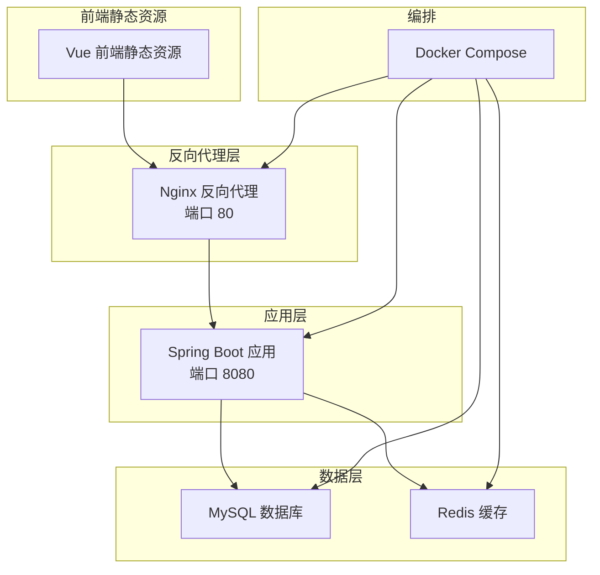
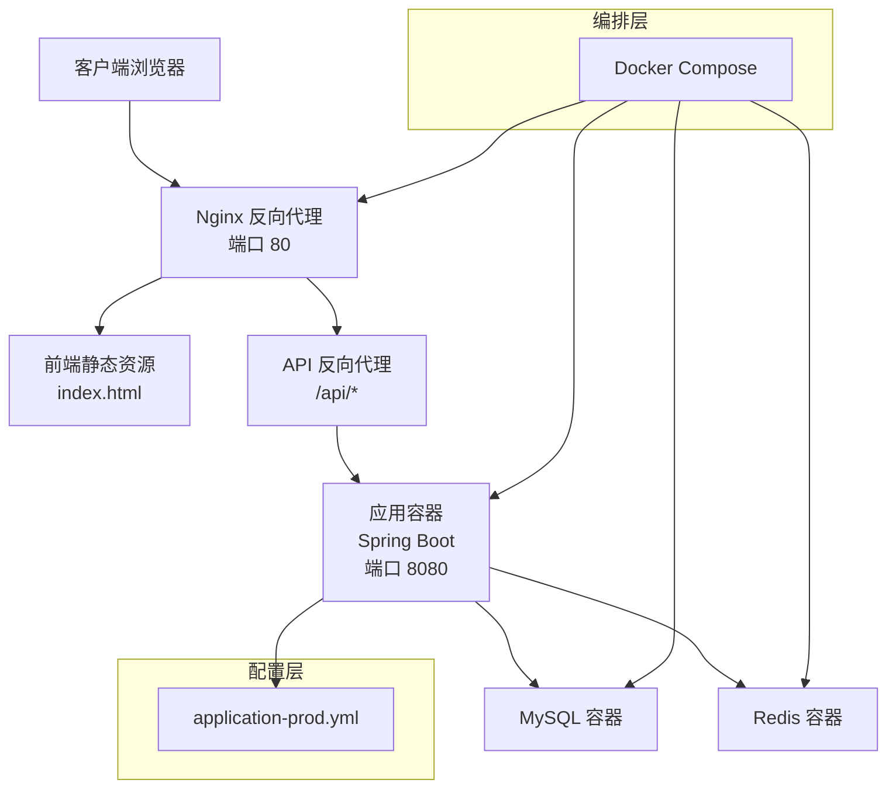
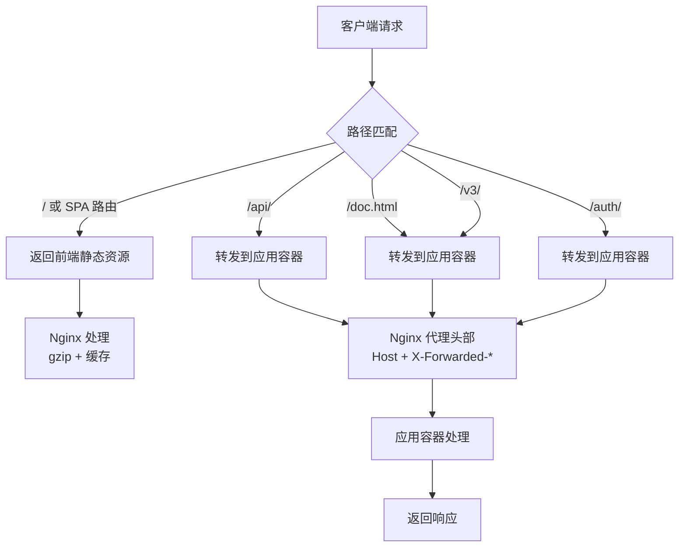
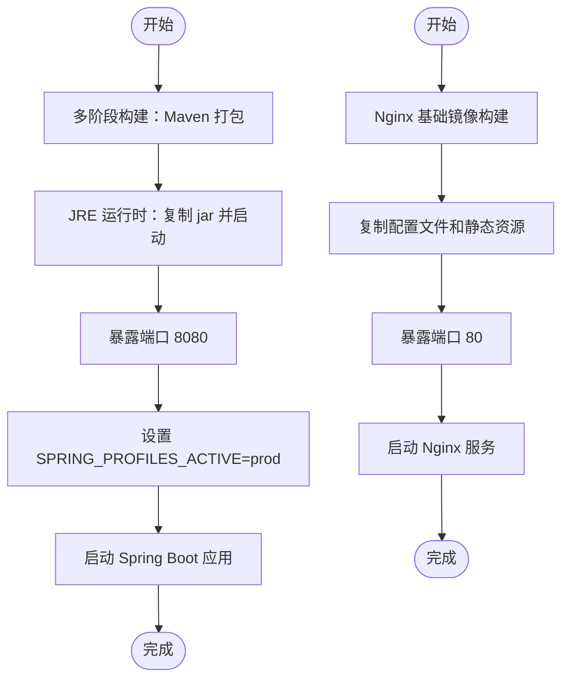
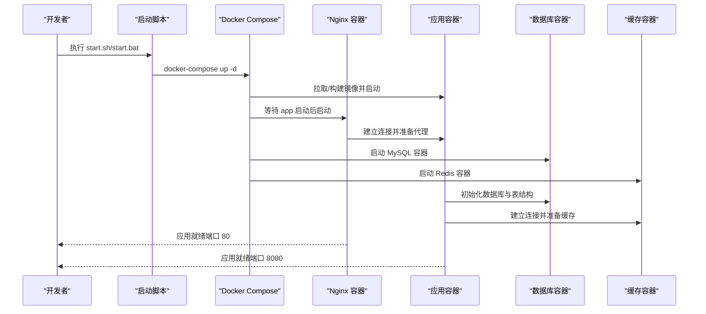
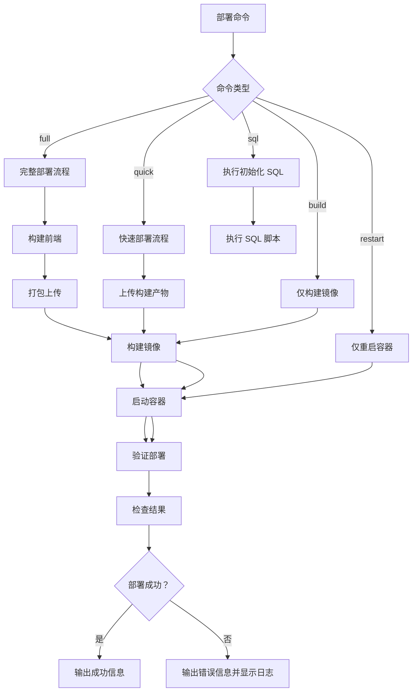
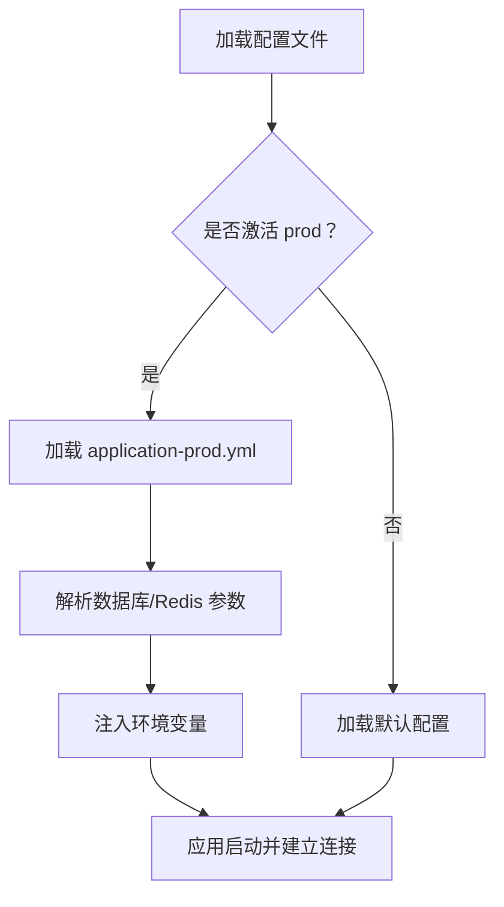
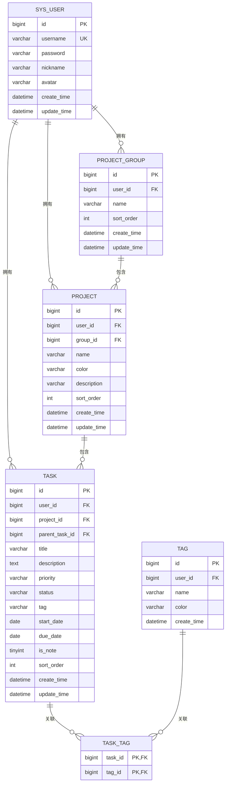
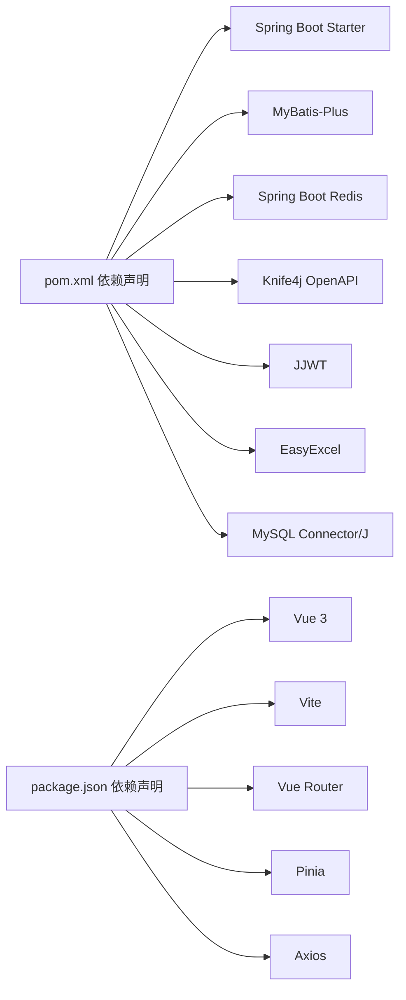

# 部署架构

<cite>
**本文引用的文件**
- [docker-compose.yml](file://docker-compose.yml)
- [Dockerfile](file://backend/Dockerfile)
- [nginx.conf](file://nginx/nginx.conf)
- [nginx/Dockerfile](file://nginx/Dockerfile)
- [deploy.js](file://deploy/deploy.js)
- [check.js](file://deploy/check.js)
- [ssh.js](file://deploy/ssh.js)
- [start.sh](file://deploy/start.sh)
- [start.bat](file://deploy/start.bat)
- [vite.config.js](file://frontend/vite.config.js)
- [application-prod.yml](file://backend/src/main/resources/application-prod.yml)
- [init.sql](file://backend/sql/init.sql)
- [pom.xml](file://backend/pom.xml)
- [package.json](file://frontend/package.json)
</cite>

## 更新摘要
**所做更改**
- 新增 Nginx 反向代理架构章节，详细说明前端静态资源托管和 API 代理配置
- 更新容器编排配置，展示新增的 Nginx 服务和端口映射关系
- 添加自动化部署脚本架构设计，包括完整的 CI/CD 流水线
- 更新部署流程图和组件关系，反映新的三层架构模式
- 增强高可用与负载均衡章节，包含反向代理的健康检查机制

## 目录
1. [简介](#简介)
2. [项目结构](#项目结构)
3. [核心组件](#核心组件)
4. [架构总览](#架构总览)
5. [详细组件分析](#详细组件分析)
6. [依赖关系分析](#依赖关系分析)
7. [性能考虑](#性能考虑)
8. [故障排查指南](#故障排查指南)
9. [结论](#结论)
10. [附录](#附录)

## 简介
本文件面向新世界项目的部署与运维，系统性阐述容器化部署策略、Docker 镜像构建与多容器协调、Docker Compose 编排配置、生产环境配置要点（环境变量、数据库与缓存连接、性能参数）、高可用与负载均衡建议、CI/CD 流水线设计思路、监控与日志策略，以及配套的部署与运维流程图。目标是帮助团队快速、稳定地完成本地开发到生产的部署迁移。

**更新** 新增 Nginx 反向代理架构，增强容器编排配置，添加自动化部署脚本的架构设计。

## 项目结构
新世界项目采用前后端分离架构：后端基于 Spring Boot，使用 Maven 构建；前端基于 Vue 3 + Vite；通过 Docker Compose 将应用容器与 MySQL、Redis 协同运行。当前仓库提供基础的单容器应用编排与启动脚本，生产配置位于后端资源目录中。

**图表来源**
- [docker-compose.yml:18-28](file://docker-compose.yml#L18-L28)
- [nginx.conf:1-63](file://nginx/nginx.conf#L1-L63)
- [application-prod.yml:1-24](file://backend/src/main/resources/application-prod.yml#L1-L24)

**章节来源**
- [docker-compose.yml:1-29](file://docker-compose.yml#L1-L29)
- [nginx.conf:1-63](file://nginx/nginx.conf#L1-L63)
- [application-prod.yml:1-24](file://backend/src/main/resources/application-prod.yml#L1-L24)

## 核心组件
- 应用容器（app）
  - 基于多阶段构建的 Java 运行时镜像，暴露 8080 端口，激活 prod 配置文件。
  - 通过环境变量 SPRING_PROFILES_ACTIVE 控制配置文件加载。
- Nginx 反向代理（nginx）
  - 基于 Alpine Linux 的 Nginx 镜像，对外暴露 80 端口，托管前端静态资源并代理 API 请求。
  - 配置 gzip 压缩、静态资源缓存、API 反向代理和错误页面处理。
- 数据库（MySQL）
  - 由初始化 SQL 脚本创建数据库与表结构，并预置默认管理员账号。
- 缓存（Redis）
  - 提供会话、令牌等缓存能力，支持密码认证与数据库选择。
- 前端静态资源
  - Vue 3 + Vite 构建的静态资源，通过 Nginx 提供服务。
- 启动脚本
  - 提供 Windows 与 Linux 的一键启动脚本，使用 docker-compose 启动全部服务。

**更新** 新增 Nginx 反向代理组件，提供前端静态资源托管和 API 代理功能。

**章节来源**
- [docker-compose.yml:5-28](file://docker-compose.yml#L5-L28)
- [nginx.conf:1-63](file://nginx/nginx.conf#L1-L63)
- [nginx/Dockerfile:1-5](file://nginx/Dockerfile#L1-L5)
- [application-prod.yml:1-24](file://backend/src/main/resources/application-prod.yml#L1-L24)
- [init.sql:1-95](file://backend/sql/init.sql#L1-L95)
- [start.sh:1-8](file://deploy/start.sh#L1-L8)
- [start.bat:1-9](file://deploy/start.bat#L1-L9)

## 架构总览
下图展示了从客户端访问到应用响应的完整路径，包括 Nginx 反向代理的三层架构模式、数据库与缓存的依赖关系、应用的配置加载与端口暴露，以及前端访问链路。

**图表来源**
- [docker-compose.yml:18-28](file://docker-compose.yml#L18-L28)
- [nginx.conf:24-56](file://nginx/nginx.conf#L24-L56)
- [application-prod.yml:1-24](file://backend/src/main/resources/application-prod.yml#L1-L24)

## 详细组件分析

### Nginx 反向代理架构
- 服务定义
  - 基于 Alpine Linux 的 Nginx 镜像，对外暴露 80 端口。
  - 依赖 app 服务，确保应用容器先启动。
  - 使用 restart: unless-stopped 策略保证服务可用性。
- 静态资源托管
  - 前端静态资源位于 /usr/share/nginx/html 目录。
  - 支持 SPA 路由，通过 try_files $uri $uri/ /index.html 实现。
  - 静态资源设置 30 天缓存，提升加载性能。
- API 反向代理
  - /api/ 前缀的请求转发到 newworld-app:8080。
  - 保留原始请求头信息，包括 Host、X-Real-IP、X-Forwarded-For。
  - 设置合理的超时时间（connect: 10s, read: 60s）。
- 接口文档代理
  - /doc.html 和 /v3/ 路径代理到后端 API。
  - 支持 Knife4j 接口文档访问。
- 压缩与缓存
  - 启用 gzip 压缩，支持多种文本类型。
  - 静态资源设置 immutable 缓存策略。

**图表来源**
- [nginx.conf:11-56](file://nginx/nginx.conf#L11-L56)

**章节来源**
- [docker-compose.yml:18-28](file://docker-compose.yml#L18-L28)
- [nginx.conf:1-63](file://nginx/nginx.conf#L1-L63)
- [nginx/Dockerfile:1-5](file://nginx/Dockerfile#L1-L5)

### 容器化与镜像构建
- 多阶段构建
  - 第一阶段使用 Maven 基础镜像下载依赖并打包，跳过测试以加速构建。
  - 第二阶段使用轻量级 JRE 运行时，仅复制最终 jar 包，减小镜像体积。
- Nginx 镜像构建
  - 基于 nginx:alpine 基础镜像。
  - 复制自定义配置文件和前端构建产物。
  - 暴露 80 端口。
- 入口与暴露
  - 应用镜像暴露 8080 端口，入口为 java -jar 启动应用。
  - Nginx 镜像暴露 80 端口。
- 运行时配置
  - 应用默认激活 prod 配置文件，可通过环境变量覆盖。

**图表来源**
- [Dockerfile:1-14](file://backend/Dockerfile#L1-L14)
- [nginx/Dockerfile:1-5](file://nginx/Dockerfile#L1-L5)

**章节来源**
- [Dockerfile:1-14](file://backend/Dockerfile#L1-L14)
- [nginx/Dockerfile:1-5](file://nginx/Dockerfile#L1-L5)

### Docker Compose 编排配置
- 服务定义
  - app 服务：基于 backend 目录的 Dockerfile 构建，容器名为 newworld-app，端口映射 8080:8080，重启策略为 unless-stopped。
  - nginx 服务：基于 nginx 目录的 Dockerfile 构建，容器名为 newworld-nginx，端口映射 80:80，依赖 app 服务。
- 网络与卷
  - 当前编排未显式声明自定义网络与卷挂载，建议在生产环境中增加：
    - 自定义网络隔离服务间通信；
    - 持久化卷挂载数据库与缓存数据目录；
    - 配置文件与密钥的只读挂载。
- 环境变量
  - 通过 environment 字段注入 SPRING_PROFILES_ACTIVE=prod，便于加载生产配置。

**图表来源**
- [docker-compose.yml:1-29](file://docker-compose.yml#L1-L29)
- [start.sh:1-8](file://deploy/start.sh#L1-L8)
- [start.bat:1-9](file://deploy/start.bat#L1-L9)

**章节来源**
- [docker-compose.yml:1-29](file://docker-compose.yml#L1-L29)
- [start.sh:1-8](file://deploy/start.sh#L1-L8)
- [start.bat:1-9](file://deploy/start.bat#L1-L9)

### 自动化部署脚本架构设计
- 部署工具（deploy.js）
  - 支持多种部署模式：完整部署、快速部署、仅构建、仅重启、仅执行 SQL。
  - 完整部署流程：前端构建 → 上传 → 构建镜像 → 启动容器 → 验证部署。
  - 快速部署：跳过前端构建，直接上传构建产物。
  - 验证机制：检查容器状态、前端页面响应、API 接口可用性。
- 服务检查工具（check.js）
  - 容器状态检查：显示运行中的容器和镜像信息。
  - 日志检查：查看后端应用日志，默认最近40行。
  - API 接口测试：验证前端页面和登录接口。
  - 数据库检查：MySQL 和 Redis 连接状态。
  - 服务器环境检查：操作系统信息、Docker 版本、项目目录和端口占用。
- SSH 连接管理（ssh.js）
  - 配置远程服务器连接参数。
  - 提供 SSH 命令执行和 SFTP 文件上传功能。
  - 支持超时和保活机制。

**图表来源**
- [deploy.js:168-242](file://deploy/deploy.js#L168-L242)
- [check.js:109-151](file://deploy/check.js#L109-L151)
- [ssh.js:5-60](file://deploy/ssh.js#L5-L60)

**章节来源**
- [deploy.js:1-243](file://deploy/deploy.js#L1-L243)
- [check.js:1-152](file://deploy/check.js#L1-L152)
- [ssh.js:1-61](file://deploy/ssh.js#L1-L61)

### 生产环境配置
- 配置文件
  - application-prod.yml：生产配置，覆盖数据库与 Redis 连接参数及日志级别。
- 关键参数
  - 数据库连接：驱动类名、URL、用户名、密码（通过环境变量 MYSQL_ROOT_PASSWORD 注入）。
  - Redis 连接：主机、端口、密码（通过环境变量 REDIS_PASSWORD 注入）、数据库索引。
  - 服务器端口：应用监听 8080 端口。
  - MyBatis-Plus：日志实现配置。
  - 日志级别：按包设置 info 级别。
- 环境变量管理
  - 建议将敏感信息（如数据库密码、Redis 密码）通过环境变量注入。
  - 在 docker-compose 中使用 env_file 或 environment 字段进行注入。

**图表来源**
- [application-prod.yml:1-24](file://backend/src/main/resources/application-prod.yml#L1-L24)

**章节来源**
- [application-prod.yml:1-24](file://backend/src/main/resources/application-prod.yml#L1-L24)

### 数据库初始化与表结构
- 初始化脚本
  - 创建数据库 newworld，设置字符集与排序规则。
  - 定义用户、项目分组、项目、任务、标签及关联表。
  - 建立常用索引以提升查询性能。
  - 插入默认管理员用户（密码为加密后的值）。
- 连接与迁移
  - 应用启动时通过 JDBC 连接数据库，若表不存在则可由初始化脚本创建。
  - 建议在生产中结合 Flyway/Liquibase 等迁移工具进行版本化管理。

**图表来源**
- [init.sql:1-95](file://backend/sql/init.sql#L1-L95)

**章节来源**
- [init.sql:1-95](file://backend/sql/init.sql#L1-L95)

### 前端与静态资源
- 前端技术栈
  - 使用 Vue 3 + Vite 构建，包含路由、状态管理、图标库、日历组件与 HTTP 客户端等依赖。
  - 开发服务器配置代理到后端 API（localhost:8080）。
- 部署建议
  - Nginx 直接托管前端构建产物（dist）作为静态资源。
  - 生产环境通过 Docker Compose 启动时自动复制前端静态资源到 Nginx 容器。

**更新** 前端静态资源现在由 Nginx 直接托管，提供更好的性能和缓存策略。

**章节来源**
- [vite.config.js:1-26](file://frontend/vite.config.js#L1-L26)
- [nginx/Dockerfile:3](file://nginx/Dockerfile#L3)

### 高可用与负载均衡
- 反向代理
  - Nginx 作为统一入口，提供静态资源服务和 API 代理。
  - 支持 gzip 压缩和静态资源缓存，提升性能。
  - 配置合理的超时时间和错误页面处理。
- 健康检查
  - 在 docker-compose 中为应用容器配置 healthcheck，探测 /actuator/health（若启用 Spring Boot Actuator）。
  - 部署脚本包含自动验证机制，检查容器状态和 API 可用性。
- 扩容与副本
  - 应用容器可水平扩展多个副本，配合负载均衡器分发请求。
  - Nginx 可配置上游服务器列表，实现应用容器的负载均衡。
- 存储持久化
  - MySQL 与 Redis 建议使用持久化卷与主从/哨兵模式，确保数据高可用。

**更新** 新增 Nginx 反向代理的健康检查机制和负载均衡配置建议。

**章节来源**
- [nginx.conf:1-63](file://nginx/nginx.conf#L1-L63)
- [deploy.js:117-146](file://deploy/deploy.js#L117-L146)

### CI/CD 流水线设计
- 构建阶段
  - Maven 清理构建、跳过测试（或在流水线中拆分单元测试与集成测试）。
  - 多阶段 Docker 镜像构建并推送至镜像仓库。
  - 前端构建产物自动复制到 Nginx 镜像。
- 测试阶段
  - 单元测试、集成测试、容器内端到端测试。
  - 部署前的自动化验证，包括 API 接口测试和数据库连接检查。
- 部署阶段
  - 使用 docker-compose 或 Kubernetes 部署，结合滚动更新与回滚策略。
  - 支持蓝绿部署和金丝雀发布策略。
- 安全与合规
  - 镜像扫描、依赖漏洞检测、密钥与凭据管理。
  - 自动化部署脚本包含 SSH 连接管理和文件传输功能。

**更新** 新增基于 Node.js 的自动化部署脚本，提供完整的 CI/CD 流水线支持。

**章节来源**
- [deploy.js:1-243](file://deploy/deploy.js#L1-L243)
- [check.js:1-152](file://deploy/check.js#L1-L152)

### 监控与日志
- 应用日志
  - 通过 application.yml/application-prod.yml 设置日志级别与输出位置。
  - 建议输出到标准输出以便容器平台采集。
- 错误追踪
  - 结合全局异常处理与日志聚合，定位业务异常与系统错误。
- 性能监控
  - 建议启用 Spring Boot Actuator 暴露指标，结合 Prometheus/Grafana 进行监控告警。
- 日志收集
  - 使用 Fluent Bit/Fluentd/Filebeat 收集容器日志，集中存储至 ELK/EFK 或云日志服务。
- 部署监控
  - 部署脚本包含自动验证机制，检查容器状态、前端页面和 API 接口。

**更新** 新增部署监控和自动验证机制。

**章节来源**
- [application-prod.yml:21-24](file://backend/src/main/resources/application-prod.yml#L21-L24)
- [deploy.js:117-146](file://deploy/deploy.js#L117-L146)

## 依赖关系分析
- 后端依赖
  - Spring Boot Web、Redis、MyBatis-Plus、Knife4j、JWT、Excel 工具等。
- 构建与打包
  - Maven 插件负责打包与重命名，最终生成可执行 jar。
- 运行时依赖
  - MySQL Connector、Redis 客户端、日志实现等。
- 前端依赖
  - Vue 3、Vite、路由、状态管理、HTTP 客户端等。

**图表来源**
- [pom.xml:1-117](file://backend/pom.xml#L1-L117)
- [package.json:1-30](file://frontend/package.json#L1-L30)

**章节来源**
- [pom.xml:1-117](file://backend/pom.xml#L1-L117)
- [package.json:1-30](file://frontend/package.json#L1-L30)

## 性能考虑
- 数据库连接池与超时
  - 合理设置连接池大小、最大等待时间与空闲连接数，避免并发瓶颈。
- Redis 连接与缓存策略
  - 控制连接数与超时，合理设置键空间过期策略，避免内存膨胀。
- 应用线程与 JVM
  - 根据容器 CPU/内存限制调整 JVM 参数，避免频繁 GC。
- Nginx 性能优化
  - 启用 gzip 压缩，设置静态资源缓存策略。
  - 配置合理的超时时间和连接数限制。
- 索引与查询
  - 利用初始化脚本中的索引提升常见查询性能，避免全表扫描。

**更新** 新增 Nginx 性能优化配置，包括 gzip 压缩和静态资源缓存策略。

**章节来源**
- [nginx.conf:5-21](file://nginx/nginx.conf#L5-L21)
- [application-prod.yml:1-24](file://backend/src/main/resources/application-prod.yml#L1-L24)

## 故障排查指南
- 启动失败
  - 检查端口占用（80、8080）、数据库连通性与凭据、Redis 连接参数。
  - 验证 Nginx 配置文件语法和静态资源路径。
- Nginx 问题
  - 检查配置文件语法：nginx -t。
  - 验证静态资源文件是否存在。
  - 查看 Nginx 错误日志：docker logs newworld-nginx。
- 数据库问题
  - 确认初始化脚本已执行，数据库存在且具备相应权限。
- 配置加载
  - 确认 SPRING_PROFILES_ACTIVE=prod 已生效，必要时通过环境变量覆盖敏感配置。
- 部署验证
  - 使用部署检查工具：node deploy/check.js。
  - 检查容器状态和日志输出。
- 日志定位
  - 查看应用容器标准输出日志，结合 application.yml/application-prod.yml 的日志配置定位问题。

**更新** 新增 Nginx 故障排查指南和部署验证工具使用方法。

**章节来源**
- [docker-compose.yml:1-29](file://docker-compose.yml#L1-L29)
- [nginx.conf:1-63](file://nginx/nginx.conf#L1-L63)
- [deploy.js:117-146](file://deploy/deploy.js#L117-L146)
- [check.js:1-152](file://deploy/check.js#L1-L152)

## 结论
当前仓库提供了完整的容器化部署架构，包括 Nginx 反向代理、应用容器、数据库和缓存服务。新增的自动化部署脚本提供了完整的 CI/CD 流水线支持，包括前端构建、镜像构建、远程部署和自动验证功能。建议在生产环境中补充反向代理、健康检查、持久化卷、环境变量注入与密钥管理、监控与日志体系，以及完善的 CI/CD 流水线，以满足高可用、可观测与可维护性的要求。

**更新** 新架构提供了更完善的部署体验，包括反向代理、自动化部署和全面的监控验证机制。

## 附录
- 快速启动
  - 执行 deploy 目录下的 start.sh（Linux/Mac）或 start.bat（Windows），即可通过 docker-compose 启动全部服务。
  - 或使用自动化部署脚本：node deploy/deploy.js（完整部署）或 node deploy/deploy.js quick（快速部署）。
- 访问地址
  - Nginx：http://localhost（前端静态资源）
  - API：http://localhost/api/（后端接口）
  - Swagger 文档：http://localhost/doc.html（Knife4j）
  - 应用：http://localhost:8080（后端直连，仅用于调试）
- 部署工具
  - 完整部署：node deploy/deploy.js
  - 快速部署：node deploy/deploy.js quick
  - 仅构建：node deploy/deploy.js build
  - 仅重启：node deploy/deploy.js restart
  - 仅执行 SQL：node deploy/deploy.js sql
- 服务检查
  - 完整检查：node deploy/check.js
  - 容器状态：node deploy/check.js containers
  - 日志查看：node deploy/check.js logs 100
  - API 测试：node deploy/check.js api
  - 数据库检查：node deploy/check.js db
  - 服务器检查：node deploy/check.js server

**更新** 新增自动化部署脚本和检查工具的使用说明。

**章节来源**
- [start.sh:1-8](file://deploy/start.sh#L1-L8)
- [start.bat:1-9](file://deploy/start.bat#L1-L9)
- [deploy.js:168-242](file://deploy/deploy.js#L168-L242)
- [check.js:109-151](file://deploy/check.js#L109-L151)